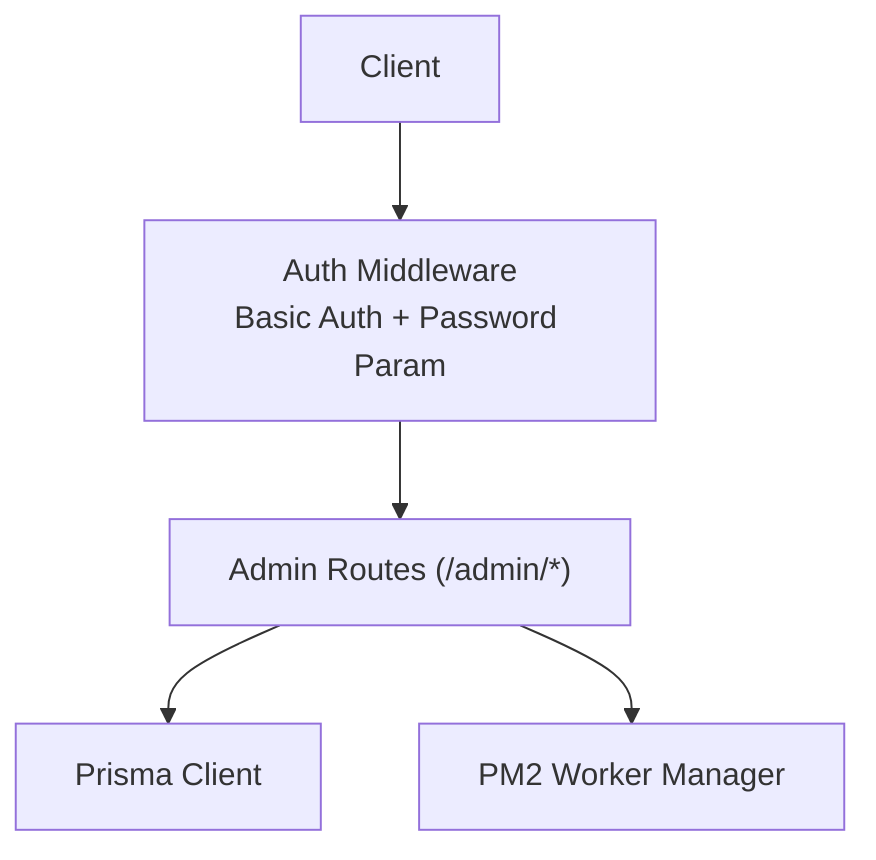
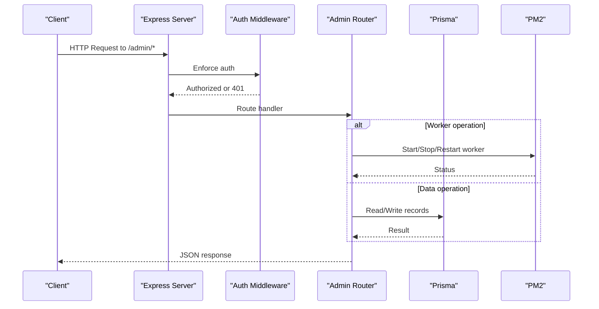
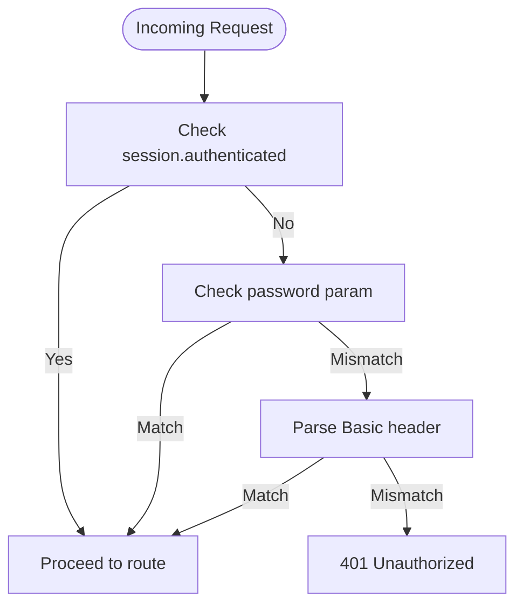
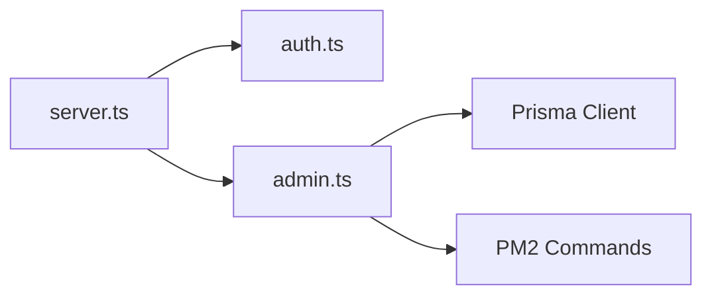

# Admin Endpoints

<cite>
**Referenced Files in This Document**
- [admin.ts](file://apps/control-plane/src/routes/admin.ts)
- [auth.ts](file://apps/control-plane/src/middleware/auth.ts)
- [server.ts](file://apps/control-plane/src/server.ts)
- [logs/route.ts](file://apps/web/src/app/api/portal/tenant/current/logs/route.ts)
- [qr/route.ts](file://apps/web/src/app/api/portal/tenant/current/qr/route.ts)
</cite>

## Table of Contents
1. [Introduction](#introduction)
2. [Project Structure](#project-structure)
3. [Core Components](#core-components)
4. [Architecture Overview](#architecture-overview)
5. [Detailed Component Analysis](#detailed-component-analysis)
6. [Dependency Analysis](#dependency-analysis)
7. [Performance Considerations](#performance-considerations)
8. [Troubleshooting Guide](#troubleshooting-guide)
9. [Conclusion](#conclusion)

## Introduction
This document specifies the Admin REST API for administrative operations. It covers HTTP methods, URL patterns, request/response schemas, authentication, error handling, and operational guidance for tenant and worker lifecycle management, QR code retrieval, and message logging. It also outlines integration patterns with the administrative dashboard and client implementation guidelines.

## Project Structure
The Admin API is implemented in the control plane service and mounted under the /admin path. Authentication is enforced via a middleware that supports Basic Auth and an optional password parameter. The API interacts with a database via Prisma and orchestrates worker processes using PM2.

**Diagram sources**
- [server.ts](file://apps/control-plane/src/server.ts#L47-L48)
- [auth.ts](file://apps/control-plane/src/middleware/auth.ts#L5-L29)
- [admin.ts](file://apps/control-plane/src/routes/admin.ts#L1-L12)

**Section sources**
- [server.ts](file://apps/control-plane/src/server.ts#L1-L89)

## Core Components
- Admin Routes: Tenant CRUD, worker lifecycle, QR retrieval, message logs, and setup request management.
- Authentication Middleware: Validates credentials via Basic Auth header or password parameter.
- Server Bootstrap: Mounts admin routes, sets up EJS views, validates environment, and starts background tasks.

Key endpoint families:
- Tenant Management: POST /admin/tenants, GET /admin/tenants, GET /admin/tenants/:id, PUT /admin/tenants/:id, DELETE /admin/tenants/:id
- Worker Management: POST /admin/tenants/:id/worker/start, POST /admin/tenants/:id/worker/stop, POST /admin/tenants/:id/worker/restart, POST /admin/tenants/:id/worker/force-restart
- QR Retrieval: GET /admin/tenants/:id/qr
- Message Logging: GET /admin/tenants/:id/logs
- Setup Requests: GET /admin/setup-requests, GET /admin/setup-requests/:id, POST /admin/setup-requests/:id/approve, POST /admin/setup-requests/:id/reject

**Section sources**
- [admin.ts](file://apps/control-plane/src/routes/admin.ts#L82-L369)
- [auth.ts](file://apps/control-plane/src/middleware/auth.ts#L1-L40)
- [server.ts](file://apps/control-plane/src/server.ts#L47-L48)

## Architecture Overview
The Admin API is an Express application with:
- Mounted routes under /admin protected by authentication middleware
- Database access via Prisma
- Worker orchestration via PM2 commands
- Background maintenance job to mark stale workers

**Diagram sources**
- [server.ts](file://apps/control-plane/src/server.ts#L47-L48)
- [auth.ts](file://apps/control-plane/src/middleware/auth.ts#L5-L29)
- [admin.ts](file://apps/control-plane/src/routes/admin.ts#L174-L332)

## Detailed Component Analysis

### Authentication
- Method: Basic Auth
- Header: Authorization: Basic base64(username:password)
- Alternative: password query parameter or body field
- Session bypass: If a session flag indicates authenticated, the middleware allows the request.
- Secret: ADMIN_PASSWORD environment variable.

**Diagram sources**
- [auth.ts](file://apps/control-plane/src/middleware/auth.ts#L5-L29)

**Section sources**
- [auth.ts](file://apps/control-plane/src/middleware/auth.ts#L1-L40)
- [server.ts](file://apps/control-plane/src/server.ts#L47-L48)

### Tenant Management Endpoints
- POST /admin/tenants
  - Purpose: Create a new tenant with associated config, WhatsApp session, and worker process.
  - Request body fields: name, phone_number, template_type, business_name, language
  - Response: Created tenant object (JSON)
  - Status codes: 201 on success, 500 on failure
- GET /admin/tenants
  - Purpose: List all tenants with related config, session, and worker info.
  - Response: Array of tenants (JSON)
  - Status codes: 200 on success, 500 on failure
- GET /admin/tenants/:id
  - Purpose: Retrieve tenant details and recent logs.
  - Response: Object containing tenant and logs array (JSON)
  - Status codes: 200 on success, 404 if not found, 500 on failure
- PUT /admin/tenants/:id
  - Purpose: Update tenant details (schema not shown here; refer to route)
  - Response: Updated tenant object (JSON)
  - Status codes: 200 on success, 404 if not found, 500 on failure
- DELETE /admin/tenants/:id
  - Purpose: Delete a tenant (schema not shown here; refer to route)
  - Response: Deletion result (JSON)
  - Status codes: 200 on success, 404 if not found, 500 on failure

Notes:
- Accept header handling: If application/json is present, JSON is returned; otherwise, HTML views are rendered.
- Logs included with GET /admin/tenants/:id are limited to recent entries.

**Section sources**
- [admin.ts](file://apps/control-plane/src/routes/admin.ts#L82-L172)

### Worker Management Endpoints
- POST /admin/tenants/:id/worker/start
  - Purpose: Start a worker process for the tenant using PM2.
  - Behavior: Checks if already running; if not, starts via PM2 with environment variables for tenant ID and sessions path.
  - Response: { success: true, message: "Worker started" } or error
  - Status codes: 200 on success, 400 if already running, 404 if tenant not found, 500 on failure
- POST /admin/tenants/:id/worker/stop
  - Purpose: Stop the worker process.
  - Response: { success: true, message: "Worker stopped" }
  - Status codes: 200 on success, 404 if not found, 500 on failure
- POST /admin/tenants/:id/worker/restart
  - Purpose: Restart the worker process.
  - Response: { success: true, message: "Worker restarted" }
  - Status codes: 200 on success, 404 if not found, 500 on failure
- POST /admin/tenants/:id/worker/force-restart
  - Purpose: Force restart by stopping and re-spawning the worker.
  - Response: { success: true, message: "Worker force-restarted" }
  - Status codes: 200 on success, 404 if not found, 500 on failure

Operational details:
- Worker script path is resolved from the worker distribution.
- Worker process name is derived from tenant metadata.
- On successful start, tenant status transitions to QR_PENDING.

**Section sources**
- [admin.ts](file://apps/control-plane/src/routes/admin.ts#L174-L332)

### QR Code Retrieval
- GET /admin/tenants/:id/qr
  - Purpose: Retrieve the latest QR state and image for a tenant’s session.
  - Response: { state: string, qr: string }
  - Status codes: 200 on success, 404 if session not found, 500 on failure

**Section sources**
- [admin.ts](file://apps/control-plane/src/routes/admin.ts#L334-L352)

### Message Logging
- GET /admin/tenants/:id/logs
  - Purpose: Fetch message logs for a tenant.
  - Query parameter: limit (default 200)
  - Response: Array of log entries
  - Status codes: 200 on success, 500 on failure

**Section sources**
- [admin.ts](file://apps/control-plane/src/routes/admin.ts#L354-L369)

### Setup Request Management
- GET /admin/setup-requests
  - Response: Array of setup requests with tenant and user relations
- GET /admin/setup-requests/:id
  - Response: Single setup request with relations
- POST /admin/setup-requests/:id/approve
  - Purpose: Approve a setup request, update status, start worker, and record event
  - Response: Redirect to detail view
- POST /admin/setup-requests/:id/reject
  - Purpose: Reject a setup request and record event
  - Response: Redirect to detail view

**Section sources**
- [admin.ts](file://apps/control-plane/src/routes/admin.ts#L373-L525)

## Dependency Analysis
- Server mounts admin routes and applies auth middleware globally to /admin.
- Admin routes depend on Prisma for data operations and child process execution for PM2 commands.
- Environment validation ensures required variables are present before startup.

**Diagram sources**
- [server.ts](file://apps/control-plane/src/server.ts#L47-L48)
- [auth.ts](file://apps/control-plane/src/middleware/auth.ts#L1-L40)
- [admin.ts](file://apps/control-plane/src/routes/admin.ts#L1-L12)

**Section sources**
- [server.ts](file://apps/control-plane/src/server.ts#L16-L39)

## Performance Considerations
- Stale worker detection: Periodic background task marks workers as ERROR if no heartbeat within threshold.
- Rate limiting: Not implemented in the Admin API. Consider adding rate limiting at the gateway or middleware level to protect sensitive endpoints.
- Query limits: Logs endpoint accepts a limit parameter; default is 200. Use smaller limits for frequent polling.
- PM2 orchestration: Worker start/stop/restart operations spawn external processes; avoid excessive concurrent operations.

[No sources needed since this section provides general guidance]

## Troubleshooting Guide
Common issues and resolutions:
- 401 Unauthorized: Verify ADMIN_PASSWORD and correct Basic Auth header encoding.
- 404 Not Found: Ensure tenant ID exists; worker endpoints require a valid tenant with a worker process.
- 400 Bad Request: Starting a worker that is already running; use restart instead.
- 500 Internal Server Error: Inspect server logs for database or PM2 command failures.
- Stale workers: Background task updates worker and tenant status; check logs and restart worker if needed.

**Section sources**
- [auth.ts](file://apps/control-plane/src/middleware/auth.ts#L28-L29)
- [admin.ts](file://apps/control-plane/src/routes/admin.ts#L188-L194)
- [server.ts](file://apps/control-plane/src/server.ts#L54-L63)

## Conclusion
The Admin REST API provides comprehensive controls for tenant lifecycle, worker orchestration, QR retrieval, and message logging. Authentication is enforced via Basic Auth or a password parameter. For production deployments, consider implementing rate limiting, robust monitoring, and secure credential management. Integrate with the administrative dashboard by invoking these endpoints with proper authentication and handling standardized error responses.