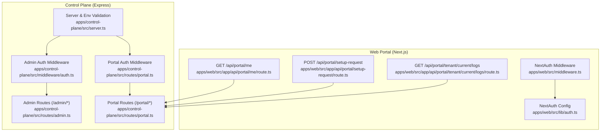
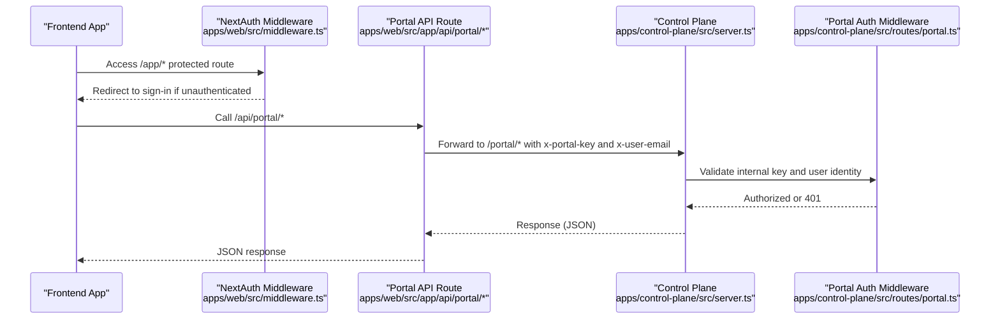
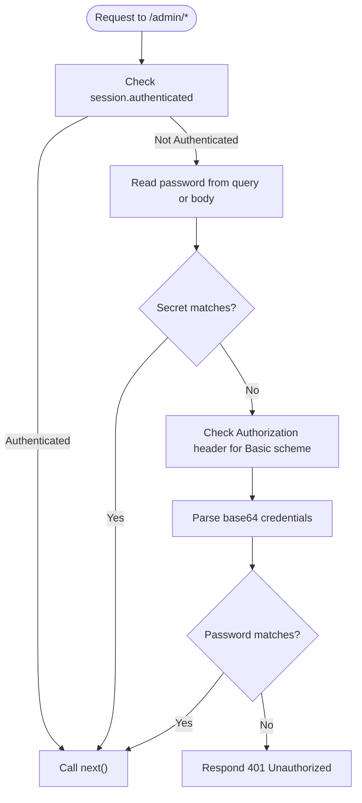
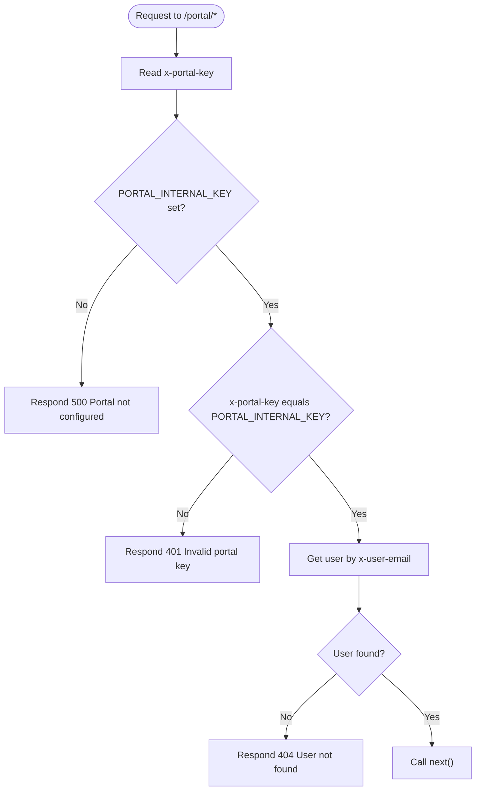
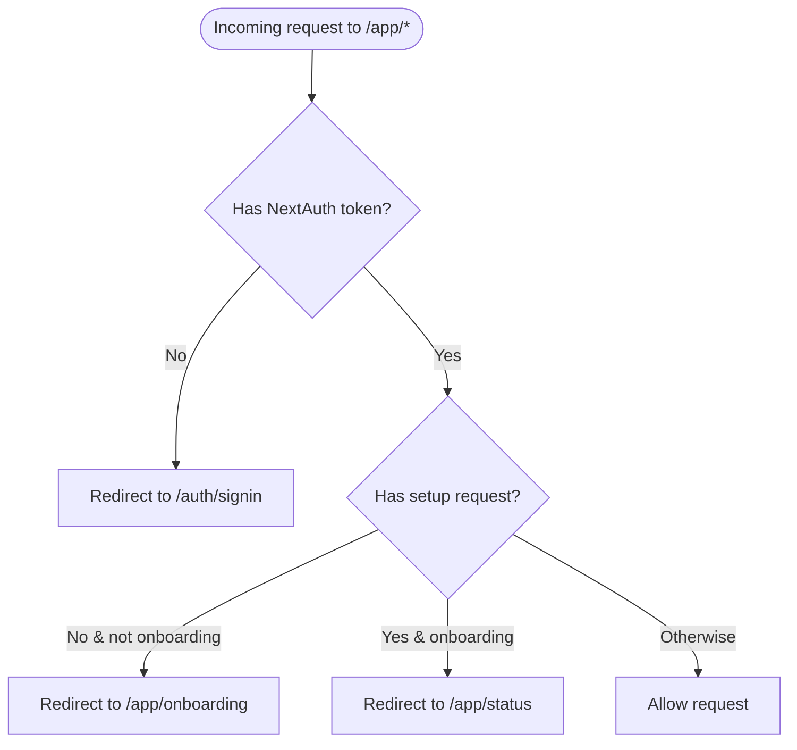
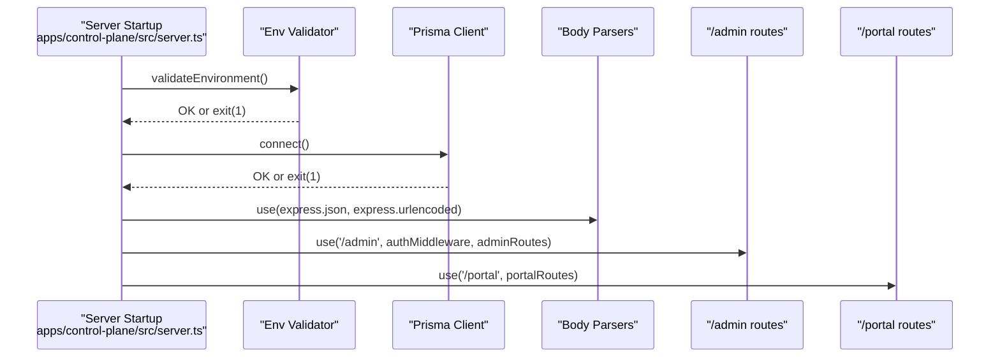
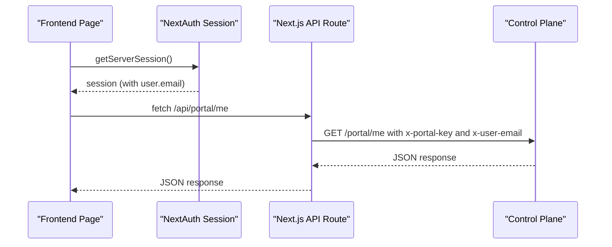
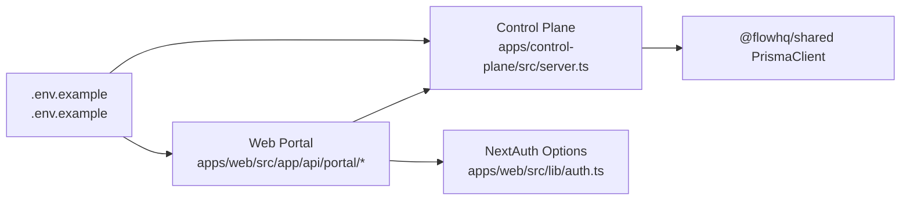

# Authentication & Middleware

<cite>
**Referenced Files in This Document**
- [apps/control-plane/src/middleware/auth.ts](file://apps/control-plane/src/middleware/auth.ts)
- [apps/control-plane/src/routes/admin.ts](file://apps/control-plane/src/routes/admin.ts)
- [apps/control-plane/src/routes/portal.ts](file://apps/control-plane/src/routes/portal.ts)
- [apps/control-plane/src/server.ts](file://apps/control-plane/src/server.ts)
- [apps/web/src/middleware.ts](file://apps/web/src/middleware.ts)
- [apps/web/src/lib/auth.ts](file://apps/web/src/lib/auth.ts)
- [apps/web/src/app/api/auth/[...nextauth]/route.ts](file://apps/web/src/app/api/auth/[...nextauth]/route.ts)
- [apps/web/src/app/api/portal/me/route.ts](file://apps/web/src/app/api/portal/me/route.ts)
- [apps/web/src/app/api/portal/setup-request/route.ts](file://apps/web/src/app/api/portal/setup-request/route.ts)
- [apps/web/src/app/api/portal/tenant/current/logs/route.ts](file://apps/web/src/app/api/portal/tenant/current/logs/route.ts)
- [.env.example](file://.env.example)
</cite>

## Table of Contents
1. [Introduction](#introduction)
2. [Project Structure](#project-structure)
3. [Core Components](#core-components)
4. [Architecture Overview](#architecture-overview)
5. [Detailed Component Analysis](#detailed-component-analysis)
6. [Dependency Analysis](#dependency-analysis)
7. [Performance Considerations](#performance-considerations)
8. [Troubleshooting Guide](#troubleshooting-guide)
9. [Conclusion](#conclusion)
10. [Appendices](#appendices)

## Introduction
This document explains the Control Plane authentication and middleware system. It covers:
- Admin endpoint protection via Basic Authentication and a shared secret fallback
- Tenant endpoint protection via a shared internal key and user identity propagation
- Middleware pipeline including body parsing and error propagation
- Configuration requirements, environment validation, and security best practices
- Examples of proper authentication header formatting and error responses
- Integration patterns with the frontend Next.js application
- Security considerations, rate limiting integration, and audit logging for authentication events

## Project Structure
The authentication system spans two applications:
- Control Plane (Express): Admin endpoints protected by Basic Auth and Portal endpoints protected by an internal key
- Web Portal (Next.js): Session-based authentication via NextAuth, proxying to Control Plane with internal key and user identity

**Diagram sources**
- [apps/control-plane/src/server.ts](file://apps/control-plane/src/server.ts#L1-L89)
- [apps/control-plane/src/middleware/auth.ts](file://apps/control-plane/src/middleware/auth.ts#L1-L40)
- [apps/control-plane/src/routes/portal.ts](file://apps/control-plane/src/routes/portal.ts#L1-L246)
- [apps/control-plane/src/routes/admin.ts](file://apps/control-plane/src/routes/admin.ts#L1-L528)
- [apps/web/src/middleware.ts](file://apps/web/src/middleware.ts#L1-L44)
- [apps/web/src/lib/auth.ts](file://apps/web/src/lib/auth.ts#L1-L76)
- [apps/web/src/app/api/portal/me/route.ts](file://apps/web/src/app/api/portal/me/route.ts#L1-L35)
- [apps/web/src/app/api/portal/setup-request/route.ts](file://apps/web/src/app/api/portal/setup-request/route.ts#L1-L40)
- [apps/web/src/app/api/portal/tenant/current/logs/route.ts](file://apps/web/src/app/api/portal/tenant/current/logs/route.ts#L1-L35)

**Section sources**
- [apps/control-plane/src/server.ts](file://apps/control-plane/src/server.ts#L1-L89)
- [apps/web/src/middleware.ts](file://apps/web/src/middleware.ts#L1-L44)

## Core Components
- Admin authentication middleware: Validates Basic Auth or a shared secret fallback and sets session-based authenticated flag
- Portal authentication middleware: Validates a shared internal key and extracts user identity from headers
- Next.js middleware: Enforces session presence for protected portal routes and redirects based on setup status
- Control Plane server: Centralized environment validation, body parsing, and route registration

Key responsibilities:
- Admin endpoints under /admin require either Basic Auth or a shared secret
- Tenant endpoints under /portal require a valid internal key and a user email header
- Next.js protects portal UI routes and enforces onboarding flow based on user session

**Section sources**
- [apps/control-plane/src/middleware/auth.ts](file://apps/control-plane/src/middleware/auth.ts#L1-L40)
- [apps/control-plane/src/routes/portal.ts](file://apps/control-plane/src/routes/portal.ts#L1-L246)
- [apps/web/src/middleware.ts](file://apps/web/src/middleware.ts#L1-L44)
- [apps/control-plane/src/server.ts](file://apps/control-plane/src/server.ts#L1-L89)

## Architecture Overview
The system uses layered authentication:
- Web Portal: NextAuth session-based authentication
- Control Plane Admin: Basic Auth or shared secret
- Control Plane Portal: Shared internal key + user identity header

**Diagram sources**
- [apps/web/src/middleware.ts](file://apps/web/src/middleware.ts#L1-L44)
- [apps/web/src/app/api/portal/me/route.ts](file://apps/web/src/app/api/portal/me/route.ts#L1-L35)
- [apps/web/src/app/api/portal/setup-request/route.ts](file://apps/web/src/app/api/portal/setup-request/route.ts#L1-L40)
- [apps/web/src/app/api/portal/tenant/current/logs/route.ts](file://apps/web/src/app/api/portal/tenant/current/logs/route.ts#L1-L35)
- [apps/control-plane/src/server.ts](file://apps/control-plane/src/server.ts#L1-L89)
- [apps/control-plane/src/routes/portal.ts](file://apps/control-plane/src/routes/portal.ts#L1-L246)

## Detailed Component Analysis

### Admin Authentication Middleware
Purpose:
- Protects admin endpoints under /admin
- Supports Basic Auth and a shared secret fallback
- Sets a session flag to short-circuit subsequent checks

Behavior:
- Checks for an authenticated session
- Accepts a shared secret via query or body
- Parses Authorization header for Basic Auth scheme
- Rejects unauthorized requests with 401

**Diagram sources**
- [apps/control-plane/src/middleware/auth.ts](file://apps/control-plane/src/middleware/auth.ts#L1-L40)

**Section sources**
- [apps/control-plane/src/middleware/auth.ts](file://apps/control-plane/src/middleware/auth.ts#L1-L40)
- [apps/control-plane/src/server.ts](file://apps/control-plane/src/server.ts#L47-L48)

### Portal Authentication Middleware
Purpose:
- Protects tenant endpoints under /portal
- Validates a shared internal key
- Extracts user identity from x-user-email header

Behavior:
- Validates PORTAL_INTERNAL_KEY environment variable
- Compares x-portal-key header against the configured key
- Retrieves user and tenant details by x-user-email
- Propagates user context downstream for route handlers

**Diagram sources**
- [apps/control-plane/src/routes/portal.ts](file://apps/control-plane/src/routes/portal.ts#L1-L246)

**Section sources**
- [apps/control-plane/src/routes/portal.ts](file://apps/control-plane/src/routes/portal.ts#L1-L246)

### Next.js Portal Middleware and Authentication
Purpose:
- Enforce session presence for /app routes
- Redirect to sign-in when unauthenticated
- Redirect to onboarding or status based on setup status

Behavior:
- Uses NextAuth middleware wrapper
- Redirects unauthenticated users to sign-in
- Redirects based on whether a setup request exists

**Diagram sources**
- [apps/web/src/middleware.ts](file://apps/web/src/middleware.ts#L1-L44)

**Section sources**
- [apps/web/src/middleware.ts](file://apps/web/src/middleware.ts#L1-L44)
- [apps/web/src/lib/auth.ts](file://apps/web/src/lib/auth.ts#L1-L76)
- [apps/web/src/app/api/auth/[...nextauth]/route.ts](file://apps/web/src/app/api/auth/[...nextauth]/route.ts#L1-L7)

### Control Plane Server Pipeline
Purpose:
- Centralized environment validation and startup
- Body parsing middleware
- Route registration with authentication

Behavior:
- Validates required environment variables
- Connects to the database
- Registers JSON and URL-encoded body parsers
- Mounts admin routes with auth middleware and portal routes without admin auth

**Diagram sources**
- [apps/control-plane/src/server.ts](file://apps/control-plane/src/server.ts#L1-L89)

**Section sources**
- [apps/control-plane/src/server.ts](file://apps/control-plane/src/server.ts#L1-L89)

### Frontend Integration Patterns
- NextAuth session is required for portal UI routes
- API routes proxy to Control Plane with:
  - x-portal-key: shared internal key
  - x-user-email: authenticated user’s email
- Control Plane validates the internal key and resolves user context

**Diagram sources**
- [apps/web/src/app/api/portal/me/route.ts](file://apps/web/src/app/api/portal/me/route.ts#L1-L35)
- [apps/control-plane/src/routes/portal.ts](file://apps/control-plane/src/routes/portal.ts#L1-L246)

**Section sources**
- [apps/web/src/app/api/portal/me/route.ts](file://apps/web/src/app/api/portal/me/route.ts#L1-L35)
- [apps/web/src/app/api/portal/setup-request/route.ts](file://apps/web/src/app/api/portal/setup-request/route.ts#L1-L40)
- [apps/web/src/app/api/portal/tenant/current/logs/route.ts](file://apps/web/src/app/api/portal/tenant/current/logs/route.ts#L1-L35)
- [apps/control-plane/src/routes/portal.ts](file://apps/control-plane/src/routes/portal.ts#L1-L246)

## Dependency Analysis
- Control Plane depends on:
  - Environment variables for secrets and ports
  - Prisma for data access
  - Express body parsers for JSON and form data
- Web Portal depends on:
  - NextAuth for session management
  - Control Plane for backend APIs

**Diagram sources**
- [.env.example](file://.env.example#L1-L22)
- [apps/control-plane/src/server.ts](file://apps/control-plane/src/server.ts#L1-L89)
- [apps/web/src/lib/auth.ts](file://apps/web/src/lib/auth.ts#L1-L76)
- [apps/web/src/app/api/portal/me/route.ts](file://apps/web/src/app/api/portal/me/route.ts#L1-L35)

**Section sources**
- [.env.example](file://.env.example#L1-L22)
- [apps/control-plane/src/server.ts](file://apps/control-plane/src/server.ts#L16-L39)
- [apps/web/src/lib/auth.ts](file://apps/web/src/lib/auth.ts#L1-L76)

## Performance Considerations
- Keep body parsers minimal and only parse what is needed
- Avoid heavy synchronous operations in middleware
- Use streaming or pagination for large datasets (logs, tenants)
- Cache frequently accessed user/tenant metadata where safe
- Monitor database queries and add indexes as needed

## Troubleshooting Guide
Common issues and resolutions:
- Missing environment variables:
  - ADMIN_PASSWORD, PORTAL_INTERNAL_KEY, DATABASE_URL, PORT
  - The server exits early if any required variables are missing
- Database connectivity failures:
  - The server exits if Prisma fails to connect
- Portal internal key mismatch:
  - Control Plane responds 401 with “Invalid portal key”
- Admin authentication failure:
  - Control Plane responds 401 with “Unauthorized”
- Missing x-user-email header:
  - Control Plane responds 404 with “User not found” if the user does not exist
- Production warnings:
  - Missing Puppeteer executable path in production may cause worker startup issues

**Section sources**
- [apps/control-plane/src/server.ts](file://apps/control-plane/src/server.ts#L16-L39)
- [apps/control-plane/src/routes/portal.ts](file://apps/control-plane/src/routes/portal.ts#L12-L25)
- [apps/control-plane/src/middleware/auth.ts](file://apps/control-plane/src/middleware/auth.ts#L28-L29)

## Conclusion
The system employs layered authentication:
- Admin endpoints use Basic Auth or a shared secret
- Tenant endpoints use a shared internal key plus user identity propagation
- Next.js enforces session-based access to portal UI
- The Control Plane centralizes environment validation and middleware pipeline
Adhering to the security best practices below will help maintain a robust and secure deployment.

## Appendices

### Configuration Requirements and Environment Variables
Required variables:
- DATABASE_URL: Prisma database connection string
- ADMIN_PASSWORD: Shared secret for admin endpoints
- PORTAL_INTERNAL_KEY: Shared secret for portal tenant endpoints
- PORT: Control Plane listening port
- Optional:
  - PUPPETEER_EXECUTABLE_PATH: Required in production for workers
  - STALE_THRESHOLD_MINUTES, STALE_CHECK_INTERVAL_MS: Worker staleness detection

Recommended defaults and overrides are defined in the example environment file.

**Section sources**
- [.env.example](file://.env.example#L1-L22)
- [apps/control-plane/src/server.ts](file://apps/control-plane/src/server.ts#L16-L39)

### Security Best Practices
- Rotate secrets regularly and restrict access to environment files
- Use HTTPS/TLS in production for all endpoints
- Limit exposure of admin endpoints; consider IP allowlists or reverse proxies
- Sanitize and validate all inputs; avoid echoing raw errors to clients
- Implement rate limiting at the gateway or per-route to mitigate brute-force attacks
- Add audit logging for authentication events (login attempts, key mismatches, unauthorized access)
- Store sensitive keys in a secrets manager; avoid committing secrets to version control

### Authentication Header Formatting Examples
- Admin endpoints:
  - Basic Auth: Authorization: Basic base64(username:password)
  - Shared secret: Include password in query or request body as supported by the endpoint
- Tenant endpoints:
  - x-portal-key: Set to PORTAL_INTERNAL_KEY
  - x-user-email: Set to the authenticated user’s email address

### Error Responses
- 401 Unauthorized:
  - Admin middleware rejects invalid credentials
- 401 Invalid portal key:
  - Portal middleware rejects invalid internal key
- 404 User not found:
  - Portal routes when x-user-email does not match a user
- 500 Portal not configured:
  - Portal middleware when PORTAL_INTERNAL_KEY is not set

### Rate Limiting Integration
- Place a rate limiter in front of:
  - Admin Basic Auth endpoints
  - Portal internal key endpoints
- Consider sliding window or token bucket algorithms
- Track by IP and user identifier where applicable
- Return 429 Too Many Requests with Retry-After header

### Audit Logging for Authentication Events
- Log:
  - Successful and failed admin authentications
  - Portal internal key validations
  - User identity resolution attempts
  - Unhandled errors during authentication flows
- Include correlation IDs and timestamps for traceability