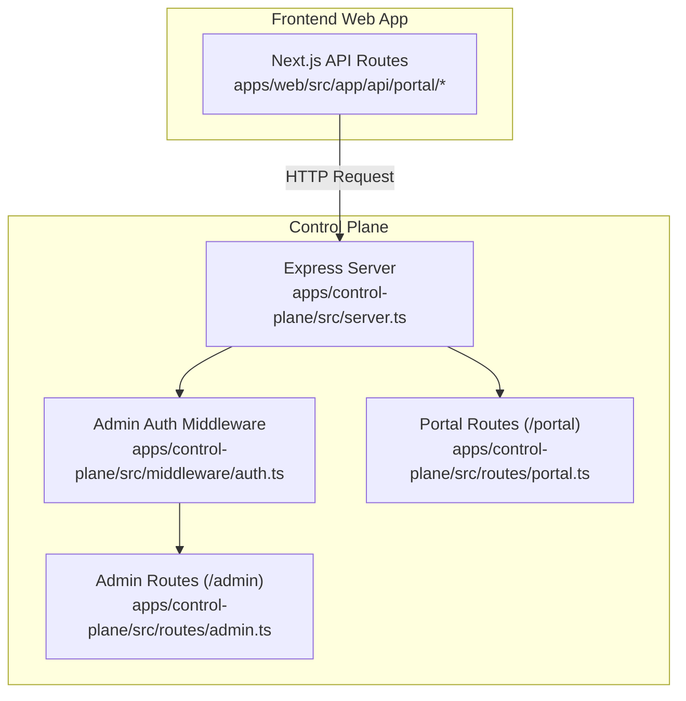
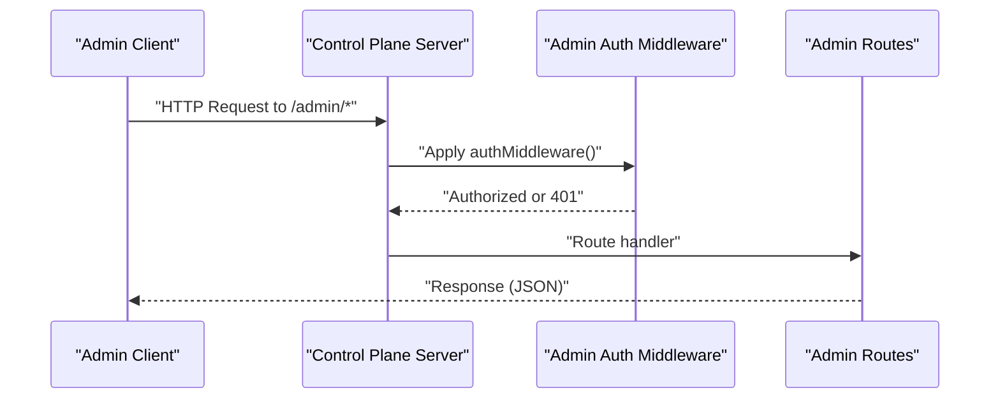
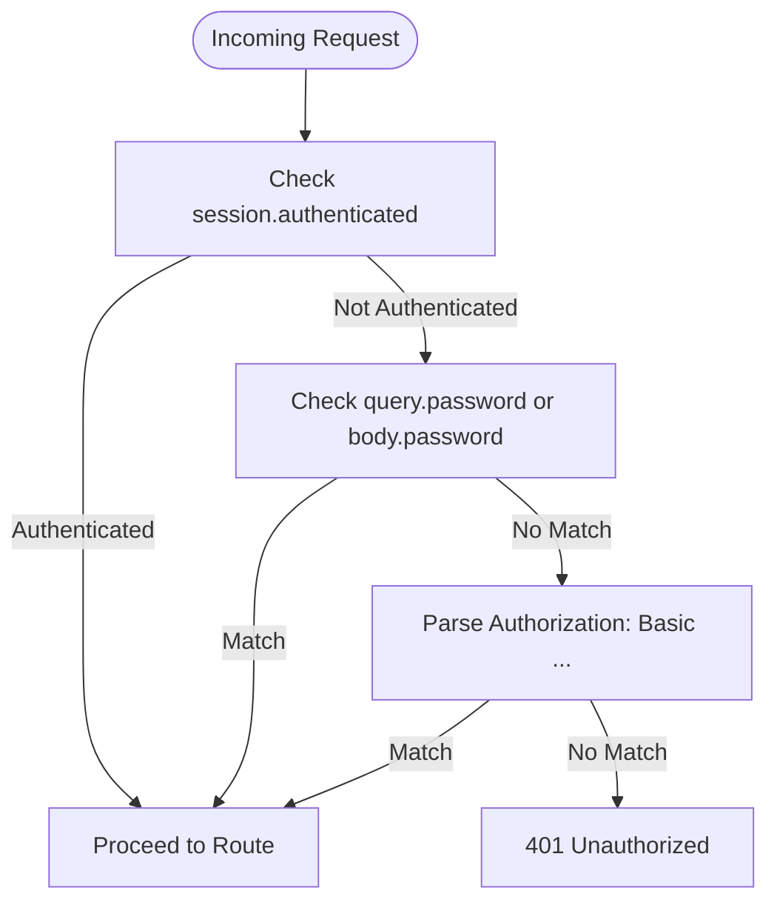
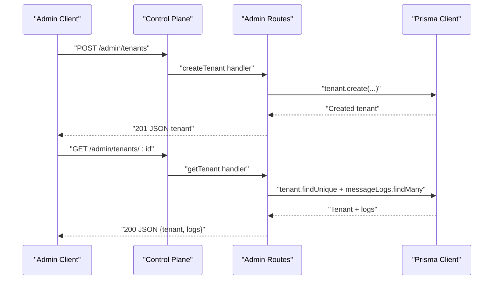
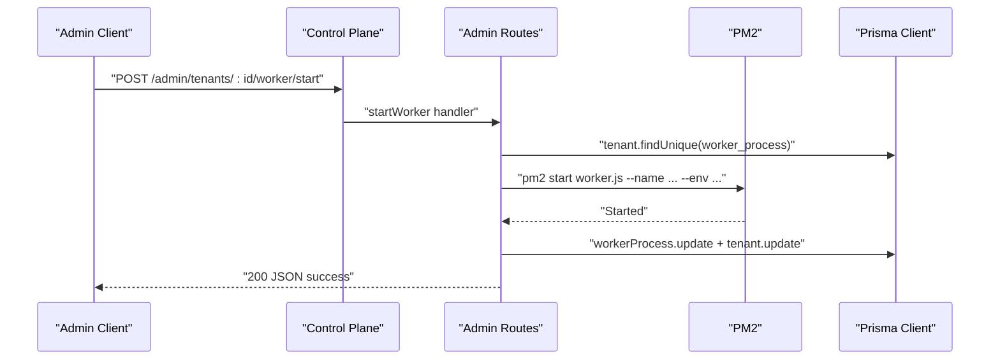
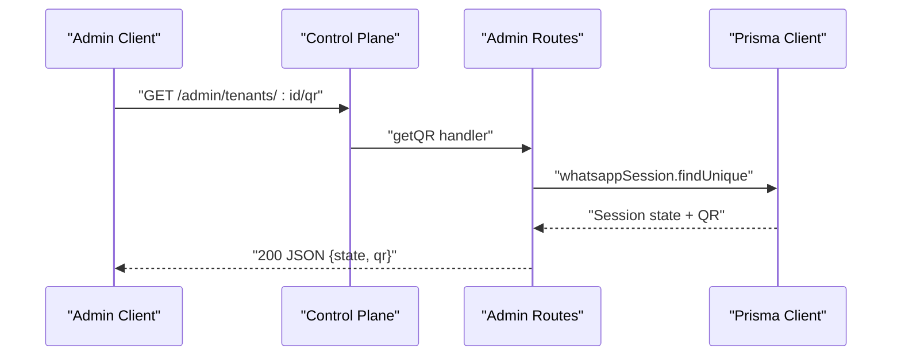
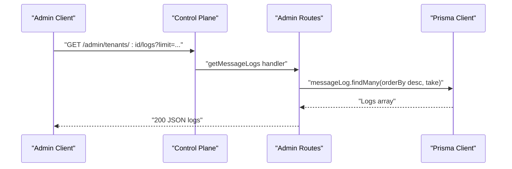
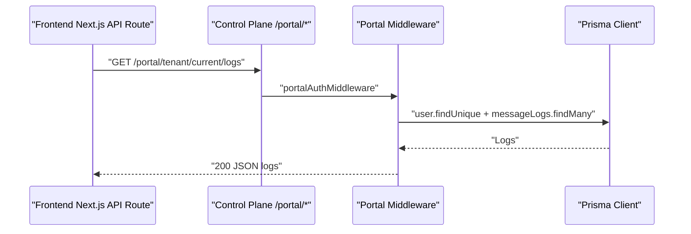
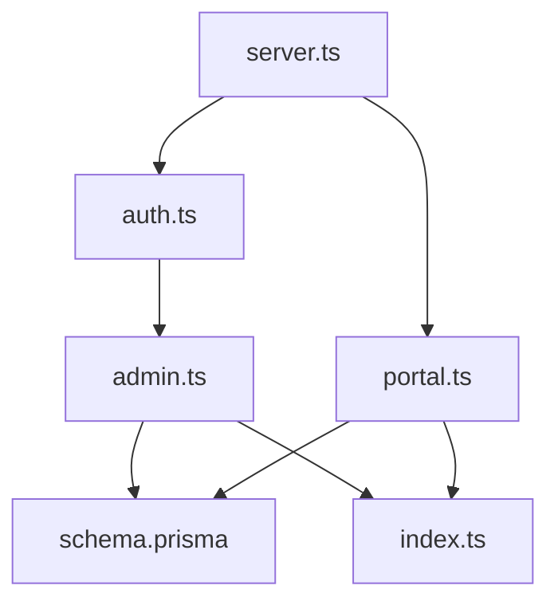
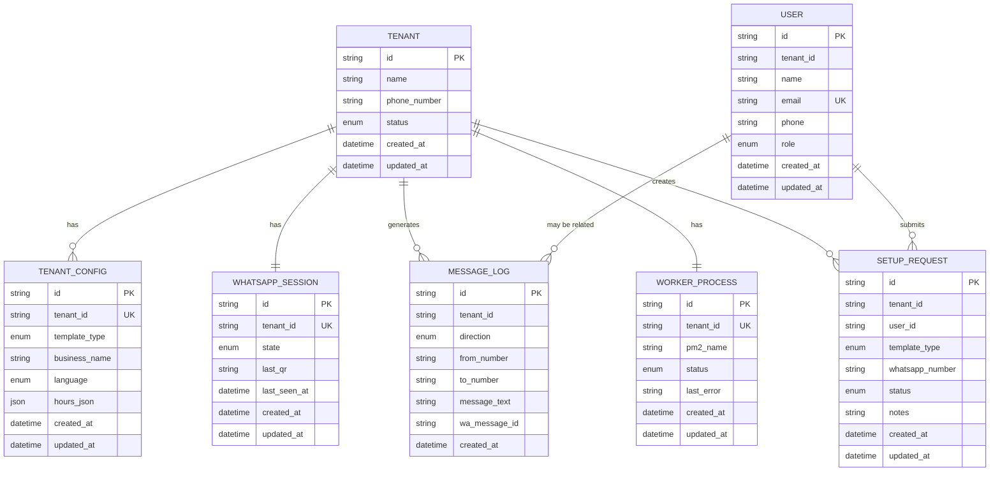

# Control Plane API

<cite>
**Referenced Files in This Document**
- [server.ts](file://apps/control-plane/src/server.ts)
- [auth.ts](file://apps/control-plane/src/middleware/auth.ts)
- [admin.ts](file://apps/control-plane/src/routes/admin.ts)
- [portal.ts](file://apps/control-plane/src/routes/portal.ts)
- [route.ts](file://apps/web/src/app/api/portal/tenant/current/logs/route.ts)
- [route.ts](file://apps/web/src/app/api/portal/tenant/current/qr/route.ts)
- [route.ts](file://apps/web/src/app/api/portal/tenant/current/status/route.ts)
- [.env.example](file://.env.example)
- [schema.prisma](file://packages/shared/src/prisma/schema.prisma)
- [index.ts](file://packages/shared/src/types/index.ts)
- [package.json](file://apps/control-plane/package.json)
</cite>

## Table of Contents
1. [Introduction](#introduction)
2. [Project Structure](#project-structure)
3. [Core Components](#core-components)
4. [Architecture Overview](#architecture-overview)
5. [Detailed Component Analysis](#detailed-component-analysis)
6. [Dependency Analysis](#dependency-analysis)
7. [Performance Considerations](#performance-considerations)
8. [Troubleshooting Guide](#troubleshooting-guide)
9. [Conclusion](#conclusion)
10. [Appendices](#appendices)

## Introduction
This document provides comprehensive API documentation for the Control Plane REST API endpoints used by administrators to manage tenants, workers, QR codes, and message logs. It covers HTTP methods, URL patterns, request/response schemas, authentication mechanisms, error handling, rate limiting considerations, and security measures. It also includes practical examples, client implementation guidelines, and integration patterns with the frontend application.

## Project Structure
The Control Plane exposes administrative endpoints under the /admin prefix and portal-facing endpoints under /portal. Authentication middleware secures administrative routes, while portal routes require an internal key. The frontend Next.js app proxies portal routes to the Control Plane.

**Diagram sources**
- [server.ts](file://apps/control-plane/src/server.ts#L47-L48)
- [auth.ts](file://apps/control-plane/src/middleware/auth.ts#L5-L29)
- [admin.ts](file://apps/control-plane/src/routes/admin.ts#L82-L102)
- [portal.ts](file://apps/control-plane/src/routes/portal.ts#L12-L25)

**Section sources**
- [server.ts](file://apps/control-plane/src/server.ts#L47-L48)
- [package.json](file://apps/control-plane/package.json#L9-L16)

## Core Components
- Admin authentication middleware supporting Basic Auth and query/body password parameters.
- Administrative endpoints for tenant lifecycle, worker lifecycle, QR retrieval, and message log retrieval.
- Portal authentication requiring an internal key and user identity header.
- Shared Prisma schema and TypeScript types define data models and enums used across the system.

**Section sources**
- [auth.ts](file://apps/control-plane/src/middleware/auth.ts#L5-L29)
- [admin.ts](file://apps/control-plane/src/routes/admin.ts#L82-L102)
- [portal.ts](file://apps/control-plane/src/routes/portal.ts#L12-L25)
- [schema.prisma](file://packages/shared/src/prisma/schema.prisma#L10-L58)
- [index.ts](file://packages/shared/src/types/index.ts#L1-L41)

## Architecture Overview
Administrative clients call /admin endpoints secured by admin authentication. The portal layer (frontend Next.js) calls /portal endpoints, which are secured by an internal key and user identity header. The Control Plane validates environment variables, connects to the database, and runs periodic maintenance tasks.

**Diagram sources**
- [server.ts](file://apps/control-plane/src/server.ts#L47-L48)
- [auth.ts](file://apps/control-plane/src/middleware/auth.ts#L5-L29)
- [admin.ts](file://apps/control-plane/src/routes/admin.ts#L82-L102)

## Detailed Component Analysis

### Authentication Methods
- Admin endpoints under /admin are protected by a middleware that accepts:
  - Basic Auth via Authorization header.
  - Password via query parameter or request body.
  - Session-based authentication if present.
- Portal endpoints under /portal require:
  - Header x-portal-key matching the configured internal key.
  - Header x-user-email identifying the user whose data is requested.

**Diagram sources**
- [auth.ts](file://apps/control-plane/src/middleware/auth.ts#L5-L29)

**Section sources**
- [auth.ts](file://apps/control-plane/src/middleware/auth.ts#L5-L29)
- [portal.ts](file://apps/control-plane/src/routes/portal.ts#L12-L25)

### Tenant Management
- POST /admin/tenants
  - Purpose: Create a new tenant with associated configuration, WhatsApp session, and worker process.
  - Request body fields: name, phone_number, template_type, business_name, language.
  - Response: Created tenant object including relations.
  - Status codes: 201 on success, 500 on failure.
- GET /admin/tenants
  - Purpose: List all tenants with related data.
  - Response: Array of tenants.
  - Accepts: application/json or renders HTML via EJS.
  - Status codes: 200 on success, 500 on failure.
- GET /admin/tenants/:id
  - Purpose: Retrieve a single tenant and the latest message logs.
  - Response: Object containing tenant and logs array.
  - Accepts: application/json or renders HTML via EJS.
  - Status codes: 200 on success, 404 if not found, 500 on failure.

**Diagram sources**
- [admin.ts](file://apps/control-plane/src/routes/admin.ts#L104-L140)
- [admin.ts](file://apps/control-plane/src/routes/admin.ts#L142-L172)

**Section sources**
- [admin.ts](file://apps/control-plane/src/routes/admin.ts#L82-L102)
- [admin.ts](file://apps/control-plane/src/routes/admin.ts#L104-L140)
- [admin.ts](file://apps/control-plane/src/routes/admin.ts#L142-L172)
- [schema.prisma](file://packages/shared/src/prisma/schema.prisma#L60-L76)
- [schema.prisma](file://packages/shared/src/prisma/schema.prisma#L105-L118)
- [index.ts](file://packages/shared/src/types/index.ts#L21-L27)

### Worker Management
- POST /admin/tenants/:id/worker/start
  - Purpose: Start the worker process for a tenant using PM2.
  - Behavior: Checks if already running; starts with environment variables for tenant ID and sessions path.
  - Response: Success message; updates worker_process status and tenant status.
  - Status codes: 200 on success, 400 if already running, 404 if not found, 500 on failure.
- POST /admin/tenants/:id/worker/stop
  - Purpose: Stop the worker process.
  - Response: Success message; updates worker_process status.
  - Status codes: 200 on success, 404 if not found, 500 on failure.
- POST /admin/tenants/:id/worker/restart
  - Purpose: Restart the worker process.
  - Response: Success message; updates worker_process status.
  - Status codes: 200 on success, 404 if not found, 500 on failure.
- POST /admin/tenants/:id/worker/force-restart
  - Purpose: Force restart by stopping and re-spawning the worker.
  - Response: Success message; updates worker_process status and tenant status.
  - Status codes: 200 on success, 404 if not found, 500 on failure.

**Diagram sources**
- [admin.ts](file://apps/control-plane/src/routes/admin.ts#L174-L230)

**Section sources**
- [admin.ts](file://apps/control-plane/src/routes/admin.ts#L174-L230)
- [admin.ts](file://apps/control-plane/src/routes/admin.ts#L232-L255)
- [admin.ts](file://apps/control-plane/src/routes/admin.ts#L257-L283)
- [admin.ts](file://apps/control-plane/src/routes/admin.ts#L285-L332)

### QR Code Retrieval
- GET /admin/tenants/:id/qr
  - Purpose: Retrieve the current WhatsApp session state and QR data for a tenant.
  - Response: Object with state and qr fields.
  - Status codes: 200 on success, 404 if session not found, 500 on failure.

**Diagram sources**
- [admin.ts](file://apps/control-plane/src/routes/admin.ts#L334-L352)

**Section sources**
- [admin.ts](file://apps/control-plane/src/routes/admin.ts#L334-L352)

### Message Logging
- GET /admin/tenants/:id/logs
  - Purpose: Retrieve recent message logs for a tenant.
  - Query parameter: limit (default 200).
  - Response: Array of message log entries.
  - Status codes: 200 on success, 500 on failure.

**Diagram sources**
- [admin.ts](file://apps/control-plane/src/routes/admin.ts#L354-L369)

**Section sources**
- [admin.ts](file://apps/control-plane/src/routes/admin.ts#L354-L369)

### Portal Integration (Frontend)
- The frontend Next.js app proxies portal endpoints to the Control Plane using server-side fetch.
- Required headers:
  - x-portal-key: matches PORTAL_INTERNAL_KEY.
  - x-user-email: identifies the user.
- Example routes:
  - GET /portal/tenant/current/status
  - GET /portal/tenant/current/qr
  - GET /portal/tenant/current/logs

**Diagram sources**
- [portal.ts](file://apps/control-plane/src/routes/portal.ts#L12-L25)
- [route.ts](file://apps/web/src/app/api/portal/tenant/current/logs/route.ts#L8-L34)

**Section sources**
- [route.ts](file://apps/web/src/app/api/portal/tenant/current/logs/route.ts#L8-L34)
- [route.ts](file://apps/web/src/app/api/portal/tenant/current/qr/route.ts#L8-L34)
- [route.ts](file://apps/web/src/app/api/portal/tenant/current/status/route.ts#L8-L34)
- [portal.ts](file://apps/control-plane/src/routes/portal.ts#L12-L25)

## Dependency Analysis
- Control Plane server initializes environment validation, database connection, and background tasks.
- Admin routes depend on Prisma models for tenant, config, session, worker process, and message logs.
- Portal routes depend on Prisma models for user, tenant, setup requests, and event logs.
- Frontend Next.js routes depend on Control Plane’s /portal endpoints and environment variables.

**Diagram sources**
- [server.ts](file://apps/control-plane/src/server.ts#L17-L39)
- [admin.ts](file://apps/control-plane/src/routes/admin.ts#L1-L12)
- [portal.ts](file://apps/control-plane/src/routes/portal.ts#L1-L6)
- [schema.prisma](file://packages/shared/src/prisma/schema.prisma#L60-L177)
- [index.ts](file://packages/shared/src/types/index.ts#L1-L41)

**Section sources**
- [server.ts](file://apps/control-plane/src/server.ts#L17-L39)
- [admin.ts](file://apps/control-plane/src/routes/admin.ts#L1-L12)
- [portal.ts](file://apps/control-plane/src/routes/portal.ts#L1-L6)
- [schema.prisma](file://packages/shared/src/prisma/schema.prisma#L60-L177)
- [index.ts](file://packages/shared/src/types/index.ts#L1-L41)

## Performance Considerations
- Stale worker detection runs periodically to mark long-inactive workers as ERROR, preventing resource drift.
- Default stale threshold and check interval are configurable via environment variables.
- Message log queries use ordering and limits to constrain result sizes.

Recommendations:
- Tune STALE_THRESHOLD_MINUTES and STALE_CHECK_INTERVAL_MS for your workload.
- Limit log retrieval with appropriate limit values to avoid large payloads.
- Ensure PM2 is available and properly configured for worker lifecycle operations.

**Section sources**
- [admin.ts](file://apps/control-plane/src/routes/admin.ts#L30-L80)
- [server.ts](file://apps/control-plane/src/server.ts#L54-L63)
- [admin.ts](file://apps/control-plane/src/routes/admin.ts#L354-L369)

## Troubleshooting Guide
Common issues and resolutions:
- 401 Unauthorized on /admin endpoints:
  - Verify ADMIN_PASSWORD is set and matches the provided credentials.
  - Ensure Authorization header uses Basic scheme or password is provided via query/body.
- 401 Unauthorized on /portal endpoints:
  - Confirm PORTAL_INTERNAL_KEY is set and matches x-portal-key header.
  - Ensure x-user-email header is present and valid.
- 404 Not Found:
  - Tenant, worker, or session may not exist; verify IDs and associations.
- 500 Internal Server Error:
  - Check server logs for database connectivity and PM2 startup failures.
  - Validate environment variables and paths.

Security notes:
- Use HTTPS in production to protect credentials and keys.
- Rotate ADMIN_PASSWORD and PORTAL_INTERNAL_KEY regularly.
- Restrict access to PM2 and worker scripts to trusted administrators.

**Section sources**
- [auth.ts](file://apps/control-plane/src/middleware/auth.ts#L5-L29)
- [portal.ts](file://apps/control-plane/src/routes/portal.ts#L12-L25)
- [server.ts](file://apps/control-plane/src/server.ts#L17-L39)
- [admin.ts](file://apps/control-plane/src/routes/admin.ts#L174-L230)

## Conclusion
The Control Plane API provides a focused administrative surface for tenant and worker lifecycle management, QR retrieval, and message log inspection. Administrators authenticate via Basic Auth or password parameters, while the portal layer integrates with the frontend using an internal key and user identity header. Proper environment configuration, periodic maintenance, and secure credential handling are essential for reliable operation.

## Appendices

### API Reference Summary

- Authentication
  - Admin: Basic Auth or password via query/body; session fallback.
  - Portal: x-portal-key and x-user-email headers.

- Endpoints
  - POST /admin/tenants
    - Body: name, phone_number, template_type, business_name, language
    - Response: 201 tenant object
  - GET /admin/tenants
    - Response: 200 array of tenants
  - GET /admin/tenants/:id
    - Response: 200 { tenant, logs }
  - POST /admin/tenants/:id/worker/start
    - Response: 200 success
  - POST /admin/tenants/:id/worker/stop
    - Response: 200 success
  - POST /admin/tenants/:id/worker/restart
    - Response: 200 success
  - POST /admin/tenants/:id/worker/force-restart
    - Response: 200 success
  - GET /admin/tenants/:id/qr
    - Response: 200 { state, qr }
  - GET /admin/tenants/:id/logs?limit=N
    - Response: 200 array of logs

- Environment Variables
  - DATABASE_URL, ADMIN_PASSWORD, PORTAL_INTERNAL_KEY, PORT, LOG_LEVEL, SESSIONS_PATH, LOGS_PATH, STALE_THRESHOLD_MINUTES, STALE_CHECK_INTERVAL_MS

**Section sources**
- [admin.ts](file://apps/control-plane/src/routes/admin.ts#L82-L369)
- [portal.ts](file://apps/control-plane/src/routes/portal.ts#L12-L25)
- [.env.example](file://.env.example#L1-L22)

### Data Models Overview

**Diagram sources**
- [schema.prisma](file://packages/shared/src/prisma/schema.prisma#L60-L177)