# Control Plane API

<cite>
**Referenced Files in This Document**
- [server.ts](file://apps/control-plane/src/server.ts)
- [auth.ts](file://apps/control-plane/src/middleware/auth.ts)
- [admin.ts](file://apps/control-plane/src/routes/admin.ts)
- [portal.ts](file://apps/control-plane/src/routes/portal.ts)
- [documents.ts](file://apps/control-plane/src/routes/documents.ts)
- [route.ts](file://apps/web/src/app/api/portal/tenant/current/logs/route.ts)
- [route.ts](file://apps/web/src/app/api/portal/tenant/current/qr/route.ts)
- [route.ts](file://apps/web/src/app/api/portal/tenant/current/status/route.ts)
- [route.ts](file://apps/web/src/app/api/portal/documents/route.ts)
- [route.ts](file://apps/web/src/app/api/portal/documents/upload/route.ts)
- [route.ts](file://apps/web/src/app/api/portal/documents/url/route.ts)
- [.env.example](file://.env.example)
- [schema.prisma](file://packages/shared/src/prisma/schema.prisma)
- [index.ts](file://packages/shared/src/types/index.ts)
- [package.json](file://apps/control-plane/package.json)
</cite>

## Update Summary
**Changes Made**
- Added new document management API endpoints for portal document upload and URL processing
- Consolidated document processing functionality into centralized router
- Enhanced portal endpoints with tenant isolation and internal key authentication
- Updated server routing to include document management endpoints
- Added new BusinessDocument model to Prisma schema

## Table of Contents
1. [Introduction](#introduction)
2. [Project Structure](#project-structure)
3. [Core Components](#core-components)
4. [Architecture Overview](#architecture-overview)
5. [Detailed Component Analysis](#detailed-component-analysis)
6. [Dependency Analysis](#dependency-analysis)
7. [Performance Considerations](#performance-considerations)
8. [Troubleshooting Guide](#troubleshooting-guide)
9. [Conclusion](#conclusion)
10. [Appendices](#appendices)

## Introduction
This document provides comprehensive API documentation for the Control Plane REST API endpoints used by administrators to manage tenants, workers, QR codes, message logs, and document management. It covers HTTP methods, URL patterns, request/response schemas, authentication mechanisms, error handling, rate limiting considerations, and security measures. It also includes practical examples, client implementation guidelines, and integration patterns with the frontend application.

## Project Structure
The Control Plane exposes administrative endpoints under the /admin prefix, portal-facing endpoints under /portal, and document management endpoints under /portal/documents. Authentication middleware secures administrative routes, while portal routes require an internal key and tenant isolation. The frontend Next.js app proxies portal routes to the Control Plane.

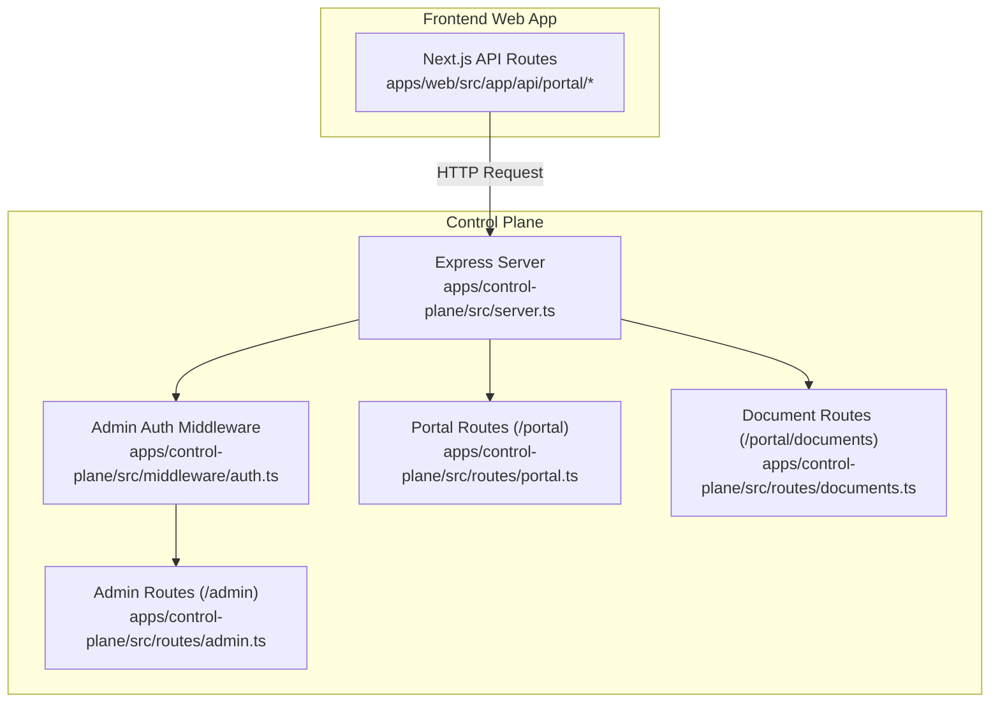
```mermaid
graph TB
subgraph "Control Plane"
CP_Server["Express Server<br/>apps/control-plane/src/server.ts"]
CP_AdminMW["Admin Auth Middleware<br/>apps/control-plane/src/middleware/auth.ts"]
CP_AdminRoutes["Admin Routes (/admin)<br/>apps/control-plane/src/routes/admin.ts"]
CP_PortalRoutes["Portal Routes (/portal)<br/>apps/control-plane/src/routes/portal.ts"]
CP_DocRoutes["Document Routes (/portal/documents)<br/>apps/control-plane/src/routes/documents.ts"]
end
subgraph "Frontend Web App"
FE_NextAPI["Next.js API Routes<br/>apps/web/src/app/api/portal/*"]
end
FE_NextAPI --> |HTTP Request| CP_Server
CP_Server --> CP_AdminMW
CP_AdminMW --> CP_AdminRoutes
CP_Server --> CP_PortalRoutes
CP_Server --> CP_DocRoutes
```

**Diagram sources**
- [server.ts](file://apps/control-plane/src/server.ts#L48-L50)
- [auth.ts](file://apps/control-plane/src/middleware/auth.ts#L5-L29)
- [admin.ts](file://apps/control-plane/src/routes/admin.ts#L82-L102)
- [portal.ts](file://apps/control-plane/src/routes/portal.ts#L12-L25)
- [documents.ts](file://apps/control-plane/src/routes/documents.ts#L1-L213)

**Section sources**
- [server.ts](file://apps/control-plane/src/server.ts#L48-L50)
- [package.json](file://apps/control-plane/package.json#L9-L16)

## Core Components
- Admin authentication middleware supporting Basic Auth and query/body password parameters.
- Administrative endpoints for tenant lifecycle, worker lifecycle, QR retrieval, and message log retrieval.
- Portal authentication requiring an internal key and user identity header.
- Document management endpoints for uploading files and URLs with tenant isolation.
- Shared Prisma schema and TypeScript types define data models and enums used across the system.

**Section sources**
- [auth.ts](file://apps/control-plane/src/middleware/auth.ts#L5-L29)
- [admin.ts](file://apps/control-plane/src/routes/admin.ts#L82-L102)
- [portal.ts](file://apps/control-plane/src/routes/portal.ts#L12-L25)
- [documents.ts](file://apps/control-plane/src/routes/documents.ts#L56-L63)
- [schema.prisma](file://packages/shared/src/prisma/schema.prisma#L234-L247)
- [index.ts](file://packages/shared/src/types/index.ts#L1-L41)

## Architecture Overview
Administrative clients call /admin endpoints secured by admin authentication. The portal layer (frontend Next.js) calls /portal endpoints, which are secured by an internal key and user identity header. Document management endpoints are isolated under /portal/documents with tenant-specific access control. The Control Plane validates environment variables, connects to the database, and runs periodic maintenance tasks.

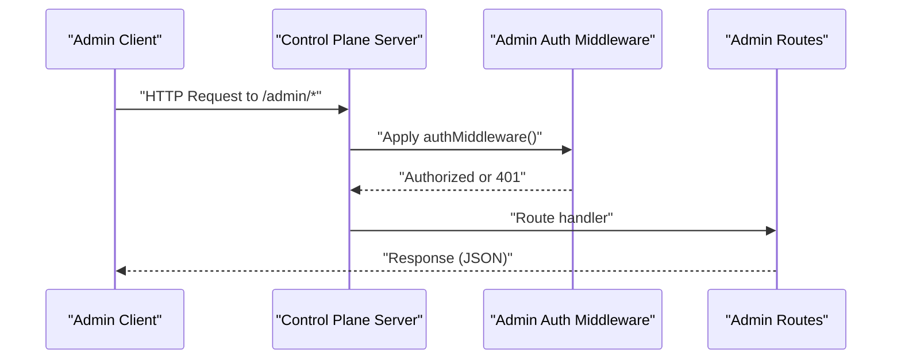
```mermaid
sequenceDiagram
participant Admin as "Admin Client"
participant CP as "Control Plane Server"
participant MW as "Admin Auth Middleware"
participant AR as "Admin Routes"
Admin->>CP : "HTTP Request to /admin/*"
CP->>MW : "Apply authMiddleware()"
MW-->>CP : "Authorized or 401"
CP->>AR : "Route handler"
AR-->>Admin : "Response (JSON)"
```

**Diagram sources**
- [server.ts](file://apps/control-plane/src/server.ts#L48-L50)
- [auth.ts](file://apps/control-plane/src/middleware/auth.ts#L5-L29)
- [admin.ts](file://apps/control-plane/src/routes/admin.ts#L82-L102)

## Detailed Component Analysis

### Authentication Methods
- Admin endpoints under /admin are protected by a middleware that accepts:
  - Basic Auth via Authorization header.
  - Password via query parameter or request body.
  - Session-based authentication if present.
- Portal endpoints under /portal require:
  - Header x-portal-key matching the configured internal key.
  - Header x-user-email identifying the user whose data is requested.
- Document management endpoints under /portal/documents require:
  - Header x-portal-key matching the configured internal key.
  - Header x-tenant-id identifying the tenant whose documents are being managed.

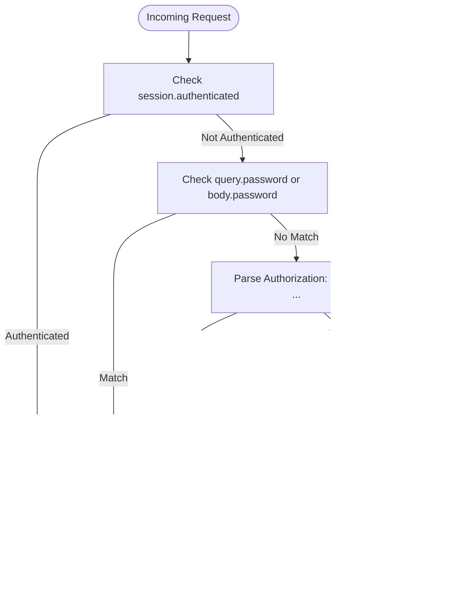
```mermaid
flowchart TD
Start(["Incoming Request"]) --> CheckSession["Check session.authenticated"]
CheckSession --> |Authenticated| Allow["Proceed to Route"]
CheckSession --> |Not Authenticated| CheckQuery["Check query.password or body.password"]
CheckQuery --> |Match| Allow
CheckQuery --> |No Match| CheckBasic["Parse Authorization: Basic ..."]
CheckBasic --> |Match| Allow
CheckBasic --> |No Match| CheckPortalKey["Validate x-portal-key"]
CheckPortalKey --> |Valid| CheckTenant["Validate x-tenant-id (for documents)"]
CheckTenant --> |Valid| Allow
CheckTenant --> |Invalid| Deny["401 Unauthorized"]
CheckPortalKey --> |Invalid| Deny
```

**Diagram sources**
- [auth.ts](file://apps/control-plane/src/middleware/auth.ts#L5-L29)
- [portal.ts](file://apps/control-plane/src/routes/portal.ts#L11-L25)
- [documents.ts](file://apps/control-plane/src/routes/documents.ts#L56-L63)

**Section sources**
- [auth.ts](file://apps/control-plane/src/middleware/auth.ts#L5-L29)
- [portal.ts](file://apps/control-plane/src/routes/portal.ts#L11-L25)
- [documents.ts](file://apps/control-plane/src/routes/documents.ts#L56-L63)

### Tenant Management
- POST /admin/tenants
  - Purpose: Create a new tenant with associated configuration, WhatsApp session, and worker process.
  - Request body fields: name, phone_number, template_type, business_name, language.
  - Response: Created tenant object including relations.
  - Status codes: 201 on success, 500 on failure.
- GET /admin/tenants
  - Purpose: List all tenants with related data.
  - Response: Array of tenants.
  - Accepts: application/json or renders HTML via EJS.
  - Status codes: 200 on success, 500 on failure.
- GET /admin/tenants/:id
  - Purpose: Retrieve a single tenant and the latest message logs.
  - Response: Object containing tenant and logs array.
  - Accepts: application/json or renders HTML via EJS.
  - Status codes: 200 on success, 404 if not found, 500 on failure.

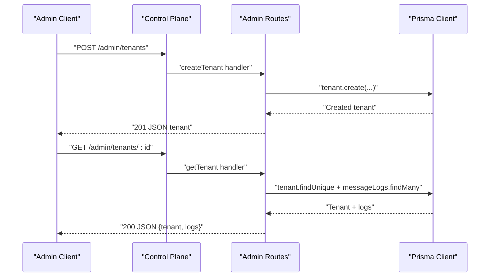
```mermaid
sequenceDiagram
participant Admin as "Admin Client"
participant CP as "Control Plane"
participant AR as "Admin Routes"
participant DB as "Prisma Client"
Admin->>CP : "POST /admin/tenants"
CP->>AR : "createTenant handler"
AR->>DB : "tenant.create(...)"
DB-->>AR : "Created tenant"
AR-->>Admin : "201 JSON tenant"
Admin->>CP : "GET /admin/tenants/ : id"
CP->>AR : "getTenant handler"
AR->>DB : "tenant.findUnique + messageLogs.findMany"
DB-->>AR : "Tenant + logs"
AR-->>Admin : "200 JSON {tenant, logs}"
```

**Diagram sources**
- [admin.ts](file://apps/control-plane/src/routes/admin.ts#L104-L140)
- [admin.ts](file://apps/control-plane/src/routes/admin.ts#L142-L172)

**Section sources**
- [admin.ts](file://apps/control-plane/src/routes/admin.ts#L82-L102)
- [admin.ts](file://apps/control-plane/src/routes/admin.ts#L104-L140)
- [admin.ts](file://apps/control-plane/src/routes/admin.ts#L142-L172)
- [schema.prisma](file://packages/shared/src/prisma/schema.prisma#L60-L76)
- [schema.prisma](file://packages/shared/src/prisma/schema.prisma#L105-L118)
- [index.ts](file://packages/shared/src/types/index.ts#L21-L27)

### Worker Management
- POST /admin/tenants/:id/worker/start
  - Purpose: Start the worker process for a tenant using PM2.
  - Behavior: Checks if already running; starts with environment variables for tenant ID and sessions path.
  - Response: Success message; updates worker_process status and tenant status.
  - Status codes: 200 on success, 400 if already running, 404 if not found, 500 on failure.
- POST /admin/tenants/:id/worker/stop
  - Purpose: Stop the worker process.
  - Response: Success message; updates worker_process status.
  - Status codes: 200 on success, 404 if not found, 500 on failure.
- POST /admin/tenants/:id/worker/restart
  - Purpose: Restart the worker process.
  - Response: Success message; updates worker_process status.
  - Status codes: 200 on success, 404 if not found, 500 on failure.
- POST /admin/tenants/:id/worker/force-restart
  - Purpose: Force restart by stopping and re-spawning the worker.
  - Response: Success message; updates worker_process status and tenant status.
  - Status codes: 200 on success, 404 if not found, 500 on failure.

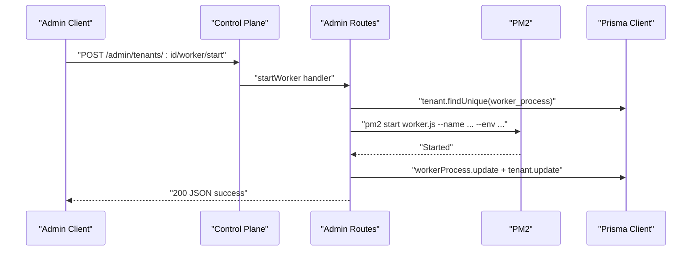
```mermaid
sequenceDiagram
participant Admin as "Admin Client"
participant CP as "Control Plane"
participant AR as "Admin Routes"
participant PM2 as "PM2"
participant DB as "Prisma Client"
Admin->>CP : "POST /admin/tenants/ : id/worker/start"
CP->>AR : "startWorker handler"
AR->>DB : "tenant.findUnique(worker_process)"
AR->>PM2 : "pm2 start worker.js --name ... --env ..."
PM2-->>AR : "Started"
AR->>DB : "workerProcess.update + tenant.update"
AR-->>Admin : "200 JSON success"
```

**Diagram sources**
- [admin.ts](file://apps/control-plane/src/routes/admin.ts#L174-L230)

**Section sources**
- [admin.ts](file://apps/control-plane/src/routes/admin.ts#L174-L230)
- [admin.ts](file://apps/control-plane/src/routes/admin.ts#L232-L255)
- [admin.ts](file://apps/control-plane/src/routes/admin.ts#L257-L283)
- [admin.ts](file://apps/control-plane/src/routes/admin.ts#L285-L332)

### QR Code Retrieval
- GET /admin/tenants/:id/qr
  - Purpose: Retrieve the current WhatsApp session state and QR data for a tenant.
  - Response: Object with state and qr fields.
  - Status codes: 200 on success, 404 if session not found, 500 on failure.

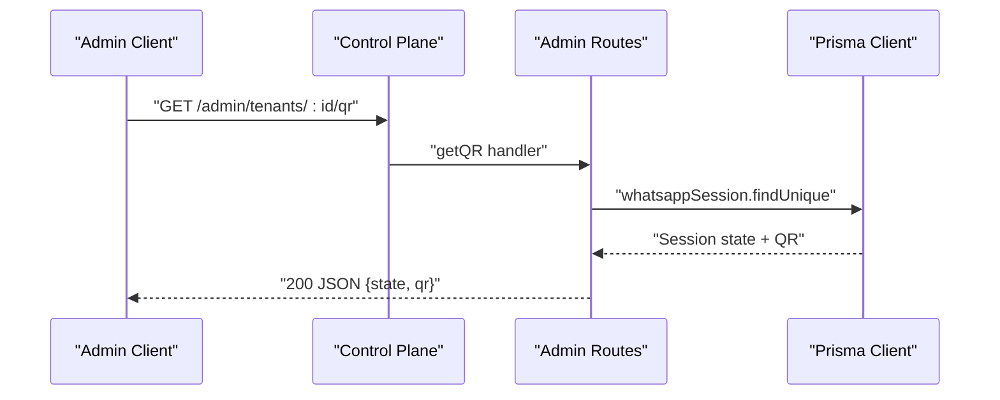
```mermaid
sequenceDiagram
participant Admin as "Admin Client"
participant CP as "Control Plane"
participant AR as "Admin Routes"
participant DB as "Prisma Client"
Admin->>CP : "GET /admin/tenants/ : id/qr"
CP->>AR : "getQR handler"
AR->>DB : "whatsappSession.findUnique"
DB-->>AR : "Session state + QR"
AR-->>Admin : "200 JSON {state, qr}"
```

**Diagram sources**
- [admin.ts](file://apps/control-plane/src/routes/admin.ts#L334-L352)

**Section sources**
- [admin.ts](file://apps/control-plane/src/routes/admin.ts#L334-L352)

### Message Logging
- GET /admin/tenants/:id/logs
  - Purpose: Retrieve recent message logs for a tenant.
  - Query parameter: limit (default 200).
  - Response: Array of message log entries.
  - Status codes: 200 on success, 500 on failure.

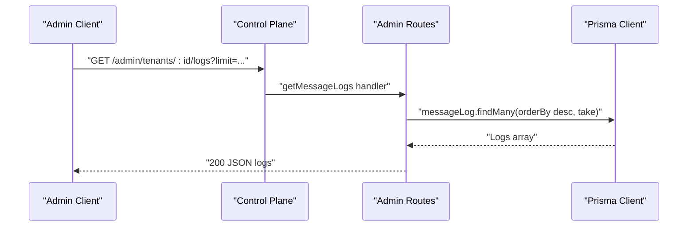
```mermaid
sequenceDiagram
participant Admin as "Admin Client"
participant CP as "Control Plane"
participant AR as "Admin Routes"
participant DB as "Prisma Client"
Admin->>CP : "GET /admin/tenants/ : id/logs?limit=..."
CP->>AR : "getMessageLogs handler"
AR->>DB : "messageLog.findMany(orderBy desc, take)"
DB-->>AR : "Logs array"
AR-->>Admin : "200 JSON logs"
```

**Diagram sources**
- [admin.ts](file://apps/control-plane/src/routes/admin.ts#L354-L369)

**Section sources**
- [admin.ts](file://apps/control-plane/src/routes/admin.ts#L354-L369)

### Document Management
- POST /portal/documents/upload
  - Purpose: Upload a PDF/DOCX/TXT file and extract its text content.
  - Headers: x-portal-key (internal key), x-tenant-id (tenant identifier).
  - Request: multipart/form-data with file field.
  - Response: Document metadata (id, filename, file_type).
  - Status codes: 201 on success, 400 on validation errors, 500 on failure.
- POST /portal/documents/url
  - Purpose: Save a website URL as a knowledge source.
  - Headers: x-portal-key (internal key), x-tenant-id (tenant identifier).
  - Request: JSON with url field.
  - Response: Document metadata (id, url, file_type).
  - Status codes: 201 on success, 400 on validation errors, 500 on failure.
- GET /portal/documents
  - Purpose: List all documents for a tenant.
  - Headers: x-portal-key (internal key), x-tenant-id (tenant identifier).
  - Response: Array of document metadata.
  - Status codes: 200 on success, 404 on tenant not found, 500 on failure.
- DELETE /portal/documents/:id
  - Purpose: Delete a document and remove it from disk.
  - Headers: x-portal-key (internal key), x-tenant-id (tenant identifier).
  - Response: Success indicator.
  - Status codes: 200 on success, 404 on document not found, 500 on failure.

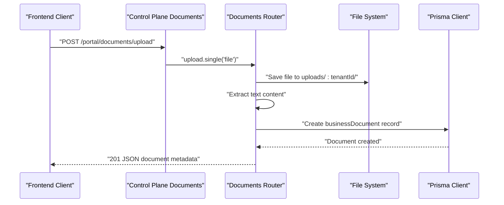
```mermaid
sequenceDiagram
participant FE as "Frontend Client"
participant CP as "Control Plane Documents"
participant DR as "Documents Router"
participant FS as "File System"
participant DB as "Prisma Client"
FE->>CP : "POST /portal/documents/upload"
CP->>DR : "upload.single('file')"
DR->>FS : "Save file to uploads/ : tenantId/"
DR->>DR : "Extract text content"
DR->>DB : "Create businessDocument record"
DB-->>DR : "Document created"
DR-->>FE : "201 JSON document metadata"
```

**Diagram sources**
- [documents.ts](file://apps/control-plane/src/routes/documents.ts#L69-L102)

**Section sources**
- [documents.ts](file://apps/control-plane/src/routes/documents.ts#L65-L102)
- [documents.ts](file://apps/control-plane/src/routes/documents.ts#L104-L139)
- [documents.ts](file://apps/control-plane/src/routes/documents.ts#L141-L161)
- [documents.ts](file://apps/control-plane/src/routes/documents.ts#L163-L188)

### Portal Integration (Frontend)
- The frontend Next.js app proxies portal endpoints to the Control Plane using server-side fetch.
- Required headers:
  - x-portal-key: matches PORTAL_INTERNAL_KEY.
  - x-user-email: identifies the user.
  - x-tenant-id: identifies the tenant (for document management).
- Example routes:
  - GET /portal/tenant/current/status
  - GET /portal/tenant/current/qr
  - GET /portal/tenant/current/logs
  - GET /portal/documents
  - POST /portal/documents/upload
  - POST /portal/documents/url

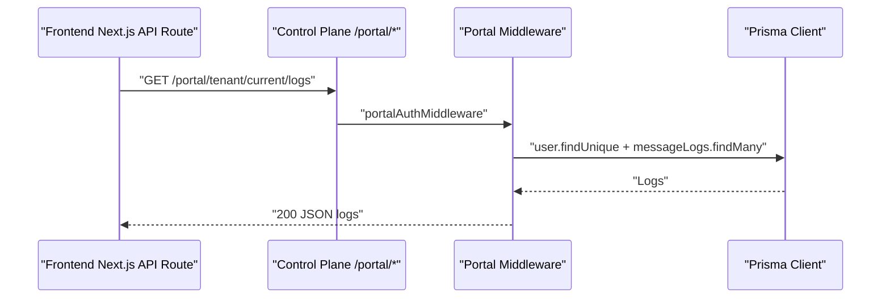
```mermaid
sequenceDiagram
participant FE as "Frontend Next.js API Route"
participant CP as "Control Plane /portal/*"
participant PR as "Portal Middleware"
participant DB as "Prisma Client"
FE->>CP : "GET /portal/tenant/current/logs"
CP->>PR : "portalAuthMiddleware"
PR->>DB : "user.findUnique + messageLogs.findMany"
DB-->>PR : "Logs"
PR-->>FE : "200 JSON logs"
```

**Diagram sources**
- [portal.ts](file://apps/control-plane/src/routes/portal.ts#L11-L25)
- [route.ts](file://apps/web/src/app/api/portal/tenant/current/logs/route.ts#L8-L34)

**Section sources**
- [route.ts](file://apps/web/src/app/api/portal/tenant/current/logs/route.ts#L8-L34)
- [route.ts](file://apps/web/src/app/api/portal/tenant/current/qr/route.ts#L8-L34)
- [route.ts](file://apps/web/src/app/api/portal/tenant/current/status/route.ts#L8-L34)
- [route.ts](file://apps/web/src/app/api/portal/documents/route.ts#L17-L35)
- [route.ts](file://apps/web/src/app/api/portal/documents/upload/route.ts#L9-L40)
- [route.ts](file://apps/web/src/app/api/portal/documents/url/route.ts#L9-L36)
- [portal.ts](file://apps/control-plane/src/routes/portal.ts#L11-L25)

## Dependency Analysis
- Control Plane server initializes environment validation, database connection, and background tasks.
- Admin routes depend on Prisma models for tenant, config, session, worker process, and message logs.
- Portal routes depend on Prisma models for user, tenant, setup requests, and event logs.
- Document routes depend on Prisma models for business documents and tenant configuration.
- Frontend Next.js routes depend on Control Plane's /portal endpoints and environment variables.

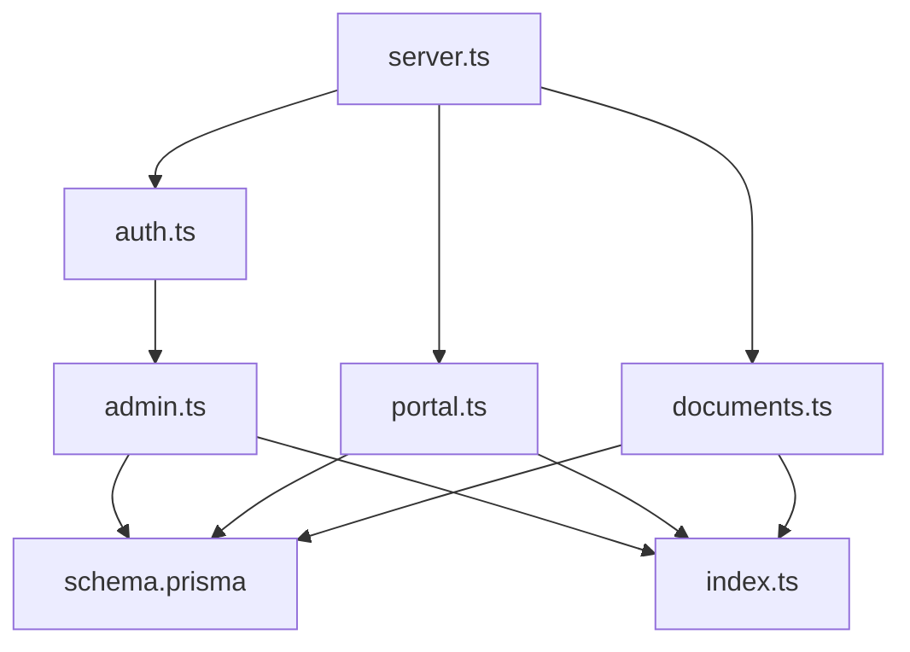
```mermaid
graph TB
CP_Server["server.ts"]
CP_AdminMW["auth.ts"]
CP_AdminRoutes["admin.ts"]
CP_PortalRoutes["portal.ts"]
CP_DocRoutes["documents.ts"]
Shared_Schema["schema.prisma"]
Shared_Types["index.ts"]
CP_Server --> CP_AdminMW
CP_AdminMW --> CP_AdminRoutes
CP_Server --> CP_PortalRoutes
CP_Server --> CP_DocRoutes
CP_AdminRoutes --> Shared_Schema
CP_PortalRoutes --> Shared_Schema
CP_DocRoutes --> Shared_Schema
CP_AdminRoutes --> Shared_Types
CP_PortalRoutes --> Shared_Types
CP_DocRoutes --> Shared_Types
```

**Diagram sources**
- [server.ts](file://apps/control-plane/src/server.ts#L17-L39)
- [admin.ts](file://apps/control-plane/src/routes/admin.ts#L1-L12)
- [portal.ts](file://apps/control-plane/src/routes/portal.ts#L1-L6)
- [documents.ts](file://apps/control-plane/src/routes/documents.ts#L1-L8)
- [schema.prisma](file://packages/shared/src/prisma/schema.prisma#L60-L247)
- [index.ts](file://packages/shared/src/types/index.ts#L1-L41)

**Section sources**
- [server.ts](file://apps/control-plane/src/server.ts#L17-L39)
- [admin.ts](file://apps/control-plane/src/routes/admin.ts#L1-L12)
- [portal.ts](file://apps/control-plane/src/routes/portal.ts#L1-L6)
- [documents.ts](file://apps/control-plane/src/routes/documents.ts#L1-L8)
- [schema.prisma](file://packages/shared/src/prisma/schema.prisma#L60-L247)
- [index.ts](file://packages/shared/src/types/index.ts#L1-L41)

## Performance Considerations
- Stale worker detection runs periodically to mark long-inactive workers as ERROR, preventing resource drift.
- Default stale threshold and check interval are configurable via environment variables.
- Message log queries use ordering and limits to constrain result sizes.
- Document upload processing includes file size limits (20MB) and supported formats (PDF, DOCX, DOC, TXT).
- Text extraction is performed asynchronously and falls back gracefully if extraction fails.
- Business context aggregation rebuilds efficiently by filtering documents with content.

Recommendations:
- Tune STALE_THRESHOLD_MINUTES and STALE_CHECK_INTERVAL_MS for your workload.
- Limit log retrieval with appropriate limit values to avoid large payloads.
- Ensure PM2 is available and properly configured for worker lifecycle operations.
- Monitor uploads directory space for document storage.
- Consider implementing document cleanup policies for old or unused files.

**Section sources**
- [admin.ts](file://apps/control-plane/src/routes/admin.ts#L30-L80)
- [server.ts](file://apps/control-plane/src/server.ts#L54-L63)
- [admin.ts](file://apps/control-plane/src/routes/admin.ts#L354-L369)
- [documents.ts](file://apps/control-plane/src/routes/documents.ts#L27-L36)
- [documents.ts](file://apps/control-plane/src/routes/documents.ts#L194-L210)

## Troubleshooting Guide
Common issues and resolutions:
- 401 Unauthorized on /admin endpoints:
  - Verify ADMIN_PASSWORD is set and matches the provided credentials.
  - Ensure Authorization header uses Basic scheme or password is provided via query/body.
- 401 Unauthorized on /portal endpoints:
  - Confirm PORTAL_INTERNAL_KEY is set and matches x-portal-key header.
  - Ensure x-user-email header is present and valid.
- 401 Unauthorized on /portal/documents endpoints:
  - Confirm PORTAL_INTERNAL_KEY is set and matches x-portal-key header.
  - Ensure x-tenant-id header is present and valid.
- 404 Not Found:
  - Tenant, worker, session, or document may not exist; verify IDs and associations.
- 500 Internal Server Error:
  - Check server logs for database connectivity and PM2 startup failures.
  - Validate environment variables and paths.
  - For document uploads, check file permissions and disk space.

Security notes:
- Use HTTPS in production to protect credentials and keys.
- Rotate ADMIN_PASSWORD and PORTAL_INTERNAL_KEY regularly.
- Restrict access to PM2 and worker scripts to trusted administrators.
- Document management endpoints enforce tenant isolation through x-tenant-id header.
- Uploaded files are stored in tenant-specific directories for isolation.

**Section sources**
- [auth.ts](file://apps/control-plane/src/middleware/auth.ts#L5-L29)
- [portal.ts](file://apps/control-plane/src/routes/portal.ts#L11-L25)
- [documents.ts](file://apps/control-plane/src/routes/documents.ts#L56-L63)
- [server.ts](file://apps/control-plane/src/server.ts#L17-L39)
- [admin.ts](file://apps/control-plane/src/routes/admin.ts#L174-L230)

## Conclusion
The Control Plane API provides a comprehensive administrative and portal interface for tenant and worker lifecycle management, QR retrieval, message log inspection, and document management. Administrators authenticate via Basic Auth or password parameters, while the portal layer integrates with the frontend using an internal key and user identity header. Document management adds powerful knowledge base capabilities with tenant isolation and automated content processing. Proper environment configuration, periodic maintenance, and secure credential handling are essential for reliable operation.

## Appendices

### API Reference Summary

- Authentication
  - Admin: Basic Auth or password via query/body; session fallback.
  - Portal: x-portal-key and x-user-email headers.
  - Documents: x-portal-key and x-tenant-id headers.

- Endpoints
  - POST /admin/tenants
    - Body: name, phone_number, template_type, business_name, language
    - Response: 201 tenant object
  - GET /admin/tenants
    - Response: 200 array of tenants
  - GET /admin/tenants/:id
    - Response: 200 { tenant, logs }
  - POST /admin/tenants/:id/worker/start
    - Response: 200 success
  - POST /admin/tenants/:id/worker/stop
    - Response: 200 success
  - POST /admin/tenants/:id/worker/restart
    - Response: 200 success
  - POST /admin/tenants/:id/worker/force-restart
    - Response: 200 success
  - GET /admin/tenants/:id/qr
    - Response: 200 { state, qr }
  - GET /admin/tenants/:id/logs?limit=N
    - Response: 200 array of logs

- Document Management Endpoints
  - POST /portal/documents/upload
    - Headers: x-portal-key, x-tenant-id
    - Body: multipart/form-data with file field
    - Response: 201 document metadata
  - POST /portal/documents/url
    - Headers: x-portal-key, x-tenant-id
    - Body: JSON { url }
    - Response: 201 document metadata
  - GET /portal/documents
    - Headers: x-portal-key, x-tenant-id
    - Response: 200 array of document metadata
  - DELETE /portal/documents/:id
    - Headers: x-portal-key, x-tenant-id
    - Response: 200 success indicator

- Environment Variables
  - DATABASE_URL, ADMIN_PASSWORD, PORTAL_INTERNAL_KEY, PORT, LOG_LEVEL, SESSIONS_PATH, LOGS_PATH, STALE_THRESHOLD_MINUTES, STALE_CHECK_INTERVAL_MS

**Section sources**
- [admin.ts](file://apps/control-plane/src/routes/admin.ts#L82-L369)
- [portal.ts](file://apps/control-plane/src/routes/portal.ts#L11-L251)
- [documents.ts](file://apps/control-plane/src/routes/documents.ts#L65-L188)
- [.env.example](file://.env.example#L1-L22)

### Data Models Overview
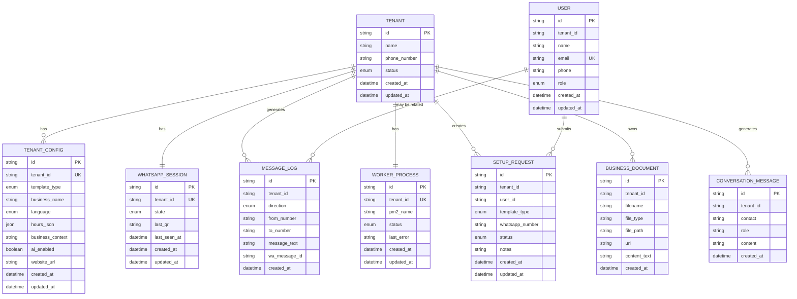
```mermaid
erDiagram
TENANT {
string id PK
string name
string phone_number
enum status
datetime created_at
datetime updated_at
}
TENANT_CONFIG {
string id PK
string tenant_id UK
enum template_type
string business_name
enum language
json hours_json
string business_context
boolean ai_enabled
string website_url
datetime created_at
datetime updated_at
}
WHATSAPP_SESSION {
string id PK
string tenant_id UK
enum state
string last_qr
datetime last_seen_at
datetime created_at
datetime updated_at
}
MESSAGE_LOG {
string id PK
string tenant_id
enum direction
string from_number
string to_number
string message_text
string wa_message_id
datetime created_at
}
WORKER_PROCESS {
string id PK
string tenant_id UK
string pm2_name
enum status
string last_error
datetime created_at
datetime updated_at
}
USER {
string id PK
string tenant_id
string name
string email UK
string phone
enum role
datetime created_at
datetime updated_at
}
SETUP_REQUEST {
string id PK
string tenant_id
string user_id
enum template_type
string whatsapp_number
enum status
string notes
datetime created_at
datetime updated_at
}
BUSINESS_DOCUMENT {
string id PK
string tenant_id
string filename
string file_type
string file_path
string url
string content_text
datetime created_at
}
CONVERSATION_MESSAGE {
string id PK
string tenant_id
string contact
string role
string content
datetime created_at
}
TENANT ||--o{ TENANT_CONFIG : "has"
TENANT ||--|| WHATSAPP_SESSION : "has"
TENANT ||--o{ MESSAGE_LOG : "generates"
TENANT ||--|| WORKER_PROCESS : "has"
TENANT ||--o{ SETUP_REQUEST : "creates"
TENANT ||--o{ BUSINESS_DOCUMENT : "owns"
USER ||--o{ SETUP_REQUEST : "submits"
USER ||--o{ MESSAGE_LOG : "may be related"
TENANT ||--o{ CONVERSATION_MESSAGE : "generates"
```

**Diagram sources**
- [schema.prisma](file://packages/shared/src/prisma/schema.prisma#L60-L261)