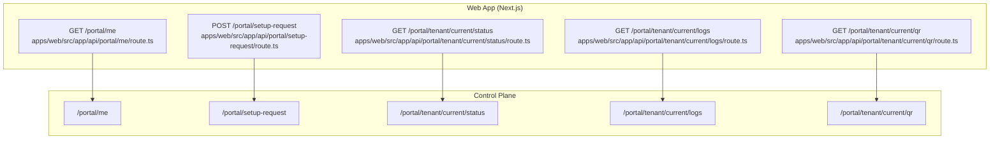
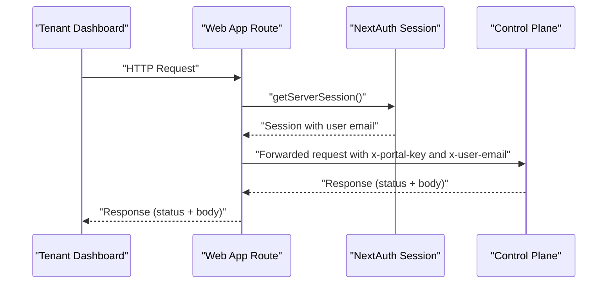
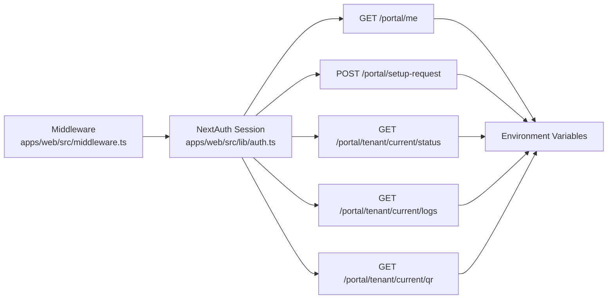

# Portal Endpoints

<cite>
**Referenced Files in This Document**
- [apps/web/src/app/api/portal/me/route.ts](file://apps/web/src/app/api/portal/me/route.ts)
- [apps/web/src/app/api/portal/setup-request/route.ts](file://apps/web/src/app/api/portal/setup-request/route.ts)
- [apps/web/src/app/api/portal/tenant/current/status/route.ts](file://apps/web/src/app/api/portal/tenant/current/status/route.ts)
- [apps/web/src/app/api/portal/tenant/current/logs/route.ts](file://apps/web/src/app/api/portal/tenant/current/logs/route.ts)
- [apps/web/src/app/api/portal/tenant/current/qr/route.ts](file://apps/web/src/app/api/portal/tenant/current/qr/route.ts)
- [apps/web/src/lib/auth.ts](file://apps/web/src/lib/auth.ts)
- [apps/web/src/middleware.ts](file://apps/web/src/middleware.ts)
</cite>

## Table of Contents
1. [Introduction](#introduction)
2. [Project Structure](#project-structure)
3. [Core Components](#core-components)
4. [Architecture Overview](#architecture-overview)
5. [Detailed Component Analysis](#detailed-component-analysis)
6. [Dependency Analysis](#dependency-analysis)
7. [Performance Considerations](#performance-considerations)
8. [Troubleshooting Guide](#troubleshooting-guide)
9. [Conclusion](#conclusion)

## Introduction
This document specifies the Portal REST API endpoints consumed by the tenant dashboard. It covers HTTP methods, URL patterns, request/response considerations, authentication, error handling, and security measures. The endpoints are implemented as Next.js App Router API routes under the portal namespace and proxy to the Control Plane service using an internal key and user identity.

## Project Structure
The Portal endpoints are located under the web application’s App Router API:
- User management: GET /portal/me
- Setup request: POST /portal/setup-request
- Tenant management:
  - GET /portal/tenant/current/status
  - GET /portal/tenant/current/logs
  - GET /portal/tenant/current/qr

These routes are thin wrappers that authenticate the caller via NextAuth session, attach internal and user identity headers, and forward requests to the Control Plane service.

**Diagram sources**
- [apps/web/src/app/api/portal/me/route.ts](file://apps/web/src/app/api/portal/me/route.ts#L1-L35)
- [apps/web/src/app/api/portal/setup-request/route.ts](file://apps/web/src/app/api/portal/setup-request/route.ts#L1-L40)
- [apps/web/src/app/api/portal/tenant/current/status/route.ts](file://apps/web/src/app/api/portal/tenant/current/status/route.ts#L1-L35)
- [apps/web/src/app/api/portal/tenant/current/logs/route.ts](file://apps/web/src/app/api/portal/tenant/current/logs/route.ts#L1-L35)
- [apps/web/src/app/api/portal/tenant/current/qr/route.ts](file://apps/web/src/app/api/portal/tenant/current/qr/route.ts#L1-L35)

**Section sources**
- [apps/web/src/app/api/portal/me/route.ts](file://apps/web/src/app/api/portal/me/route.ts#L1-L35)
- [apps/web/src/app/api/portal/setup-request/route.ts](file://apps/web/src/app/api/portal/setup-request/route.ts#L1-L40)
- [apps/web/src/app/api/portal/tenant/current/status/route.ts](file://apps/web/src/app/api/portal/tenant/current/status/route.ts#L1-L35)
- [apps/web/src/app/api/portal/tenant/current/logs/route.ts](file://apps/web/src/app/api/portal/tenant/current/logs/route.ts#L1-L35)
- [apps/web/src/app/api/portal/tenant/current/qr/route.ts](file://apps/web/src/app/api/portal/tenant/current/qr/route.ts#L1-L35)

## Core Components
- Authentication and session:
  - NextAuth session is required for all portal endpoints.
  - Session includes user email, tenantId, role, and setup request presence.
- Internal key and user identity:
  - All proxied requests include:
    - x-portal-key: internal key from environment
    - x-user-email: authenticated user’s email
- Control Plane URL:
  - All requests are forwarded to CONTROL_PLANE_URL with the same path.

Key behaviors:
- Unauthorized responses (401) when session lacks user email.
- Forwarded responses mirror upstream status codes.
- Network errors return 500 with a generic failure message.

**Section sources**
- [apps/web/src/app/api/portal/me/route.ts](file://apps/web/src/app/api/portal/me/route.ts#L5-L20)
- [apps/web/src/app/api/portal/setup-request/route.ts](file://apps/web/src/app/api/portal/setup-request/route.ts#L5-L25)
- [apps/web/src/lib/auth.ts](file://apps/web/src/lib/auth.ts#L47-L67)
- [apps/web/src/middleware.ts](file://apps/web/src/middleware.ts#L4-L27)

## Architecture Overview
The Portal API routes act as reverse proxies:
- Validate session and extract user identity.
- Enrich outbound request with internal key and user email.
- Call Control Plane endpoint and return response to client.

**Diagram sources**
- [apps/web/src/app/api/portal/me/route.ts](file://apps/web/src/app/api/portal/me/route.ts#L8-L29)
- [apps/web/src/lib/auth.ts](file://apps/web/src/lib/auth.ts#L47-L67)

**Section sources**
- [apps/web/src/app/api/portal/me/route.ts](file://apps/web/src/app/api/portal/me/route.ts#L8-L29)
- [apps/web/src/app/api/portal/setup-request/route.ts](file://apps/web/src/app/api/portal/setup-request/route.ts#L17-L34)
- [apps/web/src/app/api/portal/tenant/current/status/route.ts](file://apps/web/src/app/api/portal/tenant/current/status/route.ts#L15-L29)
- [apps/web/src/app/api/portal/tenant/current/logs/route.ts](file://apps/web/src/app/api/portal/tenant/current/logs/route.ts#L15-L29)
- [apps/web/src/app/api/portal/tenant/current/qr/route.ts](file://apps/web/src/app/api/portal/tenant/current/qr/route.ts#L15-L29)

## Detailed Component Analysis

### Endpoint: GET /portal/me
- Purpose: Retrieve current user’s information scoped to the tenant.
- Authentication:
  - Requires NextAuth session with user email.
  - Proxies with x-portal-key and x-user-email.
- Request
  - Method: GET
  - Path: /portal/me
  - Headers:
    - x-portal-key: internal key
    - x-user-email: authenticated user email
- Response
  - 200: User information payload (schema defined by Control Plane).
  - 401: Unauthorized (missing session or email).
  - 5xx: Forwarded from Control Plane or generic network error.
- Notes
  - Delegates to Control Plane endpoint /portal/me.

**Section sources**
- [apps/web/src/app/api/portal/me/route.ts](file://apps/web/src/app/api/portal/me/route.ts#L8-L34)

### Endpoint: POST /portal/setup-request
- Purpose: Submit a tenant setup request.
- Authentication:
  - Requires NextAuth session with user email.
  - Proxies with x-portal-key and x-user-email.
- Request
  - Method: POST
  - Path: /portal/setup-request
  - Headers:
    - Content-Type: application/json
    - x-portal-key: internal key
    - x-user-email: authenticated user email
  - Body: JSON payload (schema defined by Control Plane).
- Response
  - 201/200: Created or accepted response (payload depends on Control Plane).
  - 401: Unauthorized (missing session or email).
  - 4xx/5xx: Forwarded from Control Plane or generic network error.
- Notes
  - Delegates to Control Plane endpoint /portal/setup-request.

**Section sources**
- [apps/web/src/app/api/portal/setup-request/route.ts](file://apps/web/src/app/api/portal/setup-request/route.ts#L8-L39)

### Endpoint: GET /portal/tenant/current/status
- Purpose: Fetch current tenant’s operational status.
- Authentication:
  - Requires NextAuth session with user email.
  - Proxies with x-portal-key and x-user-email.
- Request
  - Method: GET
  - Path: /portal/tenant/current/status
  - Headers:
    - x-portal-key: internal key
    - x-user-email: authenticated user email
- Response
  - 200: Status payload (schema defined by Control Plane).
  - 401: Unauthorized (missing session or email).
  - 5xx: Forwarded from Control Plane or generic network error.
- Notes
  - Delegates to Control Plane endpoint /portal/tenant/current/status.

**Section sources**
- [apps/web/src/app/api/portal/tenant/current/status/route.ts](file://apps/web/src/app/api/portal/tenant/current/status/route.ts#L8-L34)

### Endpoint: GET /portal/tenant/current/logs
- Purpose: Retrieve current tenant logs.
- Authentication:
  - Requires NextAuth session with user email.
  - Proxies with x-portal-key and x-user-email.
- Request
  - Method: GET
  - Path: /portal/tenant/current/logs
  - Headers:
    - x-portal-key: internal key
    - x-user-email: authenticated user email
- Response
  - 200: Logs payload (schema defined by Control Plane).
  - 401: Unauthorized (missing session or email).
  - 5xx: Forwarded from Control Plane or generic network error.
- Notes
  - Delegates to Control Plane endpoint /portal/tenant/current/logs.

**Section sources**
- [apps/web/src/app/api/portal/tenant/current/logs/route.ts](file://apps/web/src/app/api/portal/tenant/current/logs/route.ts#L8-L34)

### Endpoint: GET /portal/tenant/current/qr
- Purpose: Obtain a tenant QR code for onboarding or verification.
- Authentication:
  - Requires NextAuth session with user email.
  - Proxies with x-portal-key and x-user-email.
- Request
  - Method: GET
  - Path: /portal/tenant/current/qr
  - Headers:
    - x-portal-key: internal key
    - x-user-email: authenticated user email
- Response
  - 200: QR payload (schema defined by Control Plane).
  - 401: Unauthorized (missing session or email).
  - 5xx: Forwarded from Control Plane or generic network error.
- Notes
  - Delegates to Control Plane endpoint /portal/tenant/current/qr.

**Section sources**
- [apps/web/src/app/api/portal/tenant/current/qr/route.ts](file://apps/web/src/app/api/portal/tenant/current/qr/route.ts#L8-L34)

## Dependency Analysis
- Runtime dependencies
  - NextAuth session provider supplies user identity.
  - Environment variables:
    - CONTROL_PLANE_URL: base URL for Control Plane.
    - PORTAL_INTERNAL_KEY: shared secret for inter-service trust.
- Security and routing
  - Middleware enforces authentication for protected paths.
  - Routes require session presence before forwarding.

**Diagram sources**
- [apps/web/src/middleware.ts](file://apps/web/src/middleware.ts#L4-L27)
- [apps/web/src/lib/auth.ts](file://apps/web/src/lib/auth.ts#L47-L67)
- [apps/web/src/app/api/portal/me/route.ts](file://apps/web/src/app/api/portal/me/route.ts#L5-L6)
- [apps/web/src/app/api/portal/setup-request/route.ts](file://apps/web/src/app/api/portal/setup-request/route.ts#L5-L6)
- [apps/web/src/app/api/portal/tenant/current/status/route.ts](file://apps/web/src/app/api/portal/tenant/current/status/route.ts#L5-L6)
- [apps/web/src/app/api/portal/tenant/current/logs/route.ts](file://apps/web/src/app/api/portal/tenant/current/logs/route.ts#L5-L6)
- [apps/web/src/app/api/portal/tenant/current/qr/route.ts](file://apps/web/src/app/api/portal/tenant/current/qr/route.ts#L5-L6)

**Section sources**
- [apps/web/src/middleware.ts](file://apps/web/src/middleware.ts#L4-L27)
- [apps/web/src/lib/auth.ts](file://apps/web/src/lib/auth.ts#L47-L67)
- [apps/web/src/app/api/portal/me/route.ts](file://apps/web/src/app/api/portal/me/route.ts#L5-L6)
- [apps/web/src/app/api/portal/setup-request/route.ts](file://apps/web/src/app/api/portal/setup-request/route.ts#L5-L6)
- [apps/web/src/app/api/portal/tenant/current/status/route.ts](file://apps/web/src/app/api/portal/tenant/current/status/route.ts#L5-L6)
- [apps/web/src/app/api/portal/tenant/current/logs/route.ts](file://apps/web/src/app/api/portal/tenant/current/logs/route.ts#L5-L6)
- [apps/web/src/app/api/portal/tenant/current/qr/route.ts](file://apps/web/src/app/api/portal/tenant/current/qr/route.ts#L5-L6)

## Performance Considerations
- Network latency: Each endpoint performs a single outbound HTTP call to the Control Plane. Keep requests synchronous to preserve ordering and simplicity.
- Caching: No caching is implemented in the routes. Consider adding cache-control headers or client-side caching for read-heavy endpoints (logs/status) if appropriate.
- Concurrency: Requests are handled per-request; avoid long-running operations in these routes.
- Observability: Log upstream failures and return generic 500 responses to clients to prevent leaking internal details.

## Troubleshooting Guide
Common issues and resolutions:
- 401 Unauthorized
  - Cause: Missing NextAuth session or missing user email.
  - Resolution: Ensure user is signed in and session is active.
- 403 Forbidden or upstream 403
  - Cause: Insufficient permissions or invalid internal key.
  - Resolution: Verify PORTAL_INTERNAL_KEY and user role in session.
- 502/504 Gateway errors
  - Cause: Control Plane unreachable or slow.
  - Resolution: Check CONTROL_PLANE_URL and upstream health.
- Unexpected 500
  - Cause: Network exceptions or unhandled errors.
  - Resolution: Review server logs for “Error calling control plane” messages.

Operational checks:
- Confirm environment variables are set in the web app runtime.
- Verify that middleware allows access to /app routes only when authenticated.
- Validate that session includes user email and tenant metadata.

**Section sources**
- [apps/web/src/app/api/portal/me/route.ts](file://apps/web/src/app/api/portal/me/route.ts#L11-L13)
- [apps/web/src/app/api/portal/setup-request/route.ts](file://apps/web/src/app/api/portal/setup-request/route.ts#L11-L13)
- [apps/web/src/app/api/portal/tenant/current/status/route.ts](file://apps/web/src/app/api/portal/tenant/current/status/route.ts#L11-L13)
- [apps/web/src/app/api/portal/tenant/current/logs/route.ts](file://apps/web/src/app/api/portal/tenant/current/logs/route.ts#L11-L13)
- [apps/web/src/app/api/portal/tenant/current/qr/route.ts](file://apps/web/src/app/api/portal/tenant/current/qr/route.ts#L11-L13)
- [apps/web/src/middleware.ts](file://apps/web/src/middleware.ts#L4-L27)

## Conclusion
The Portal endpoints provide a secure, thin proxy layer from the tenant dashboard to the Control Plane. They enforce authentication via NextAuth, propagate an internal key and user identity, and forward responses with minimal transformation. For reliable operation, ensure environment variables are configured, maintain session validity, and handle upstream errors gracefully.