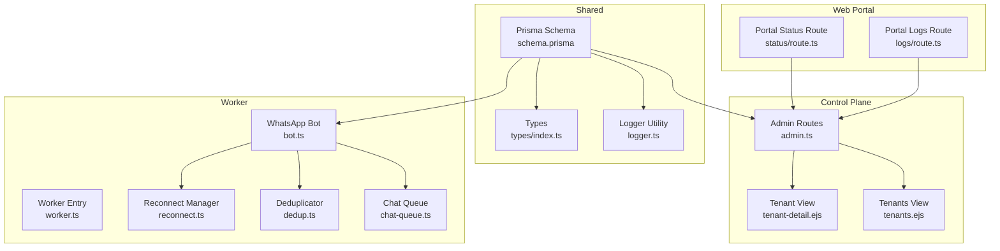
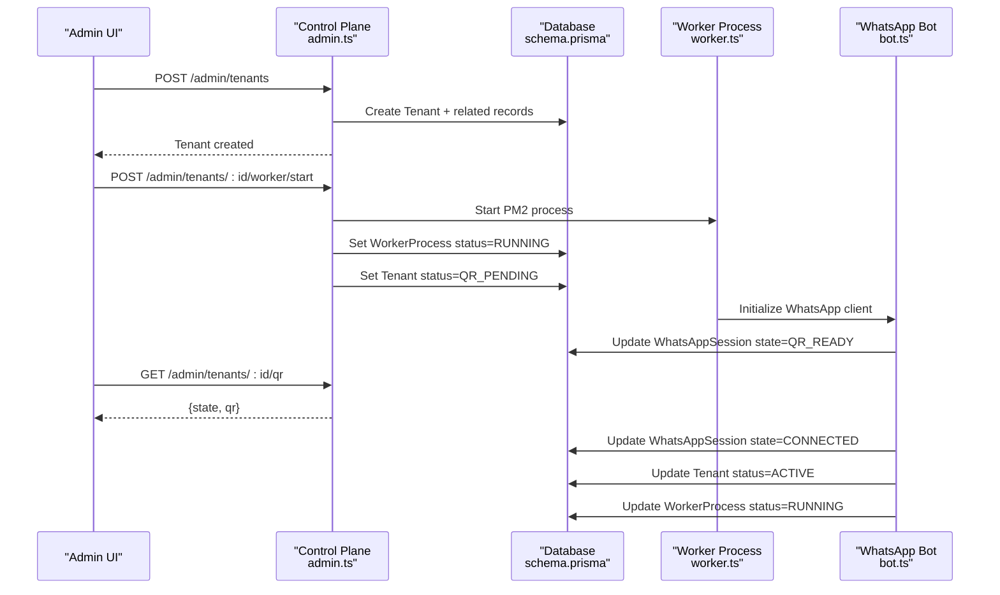
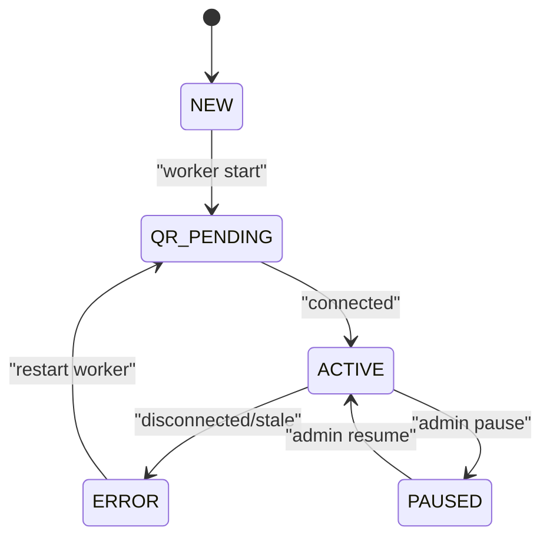
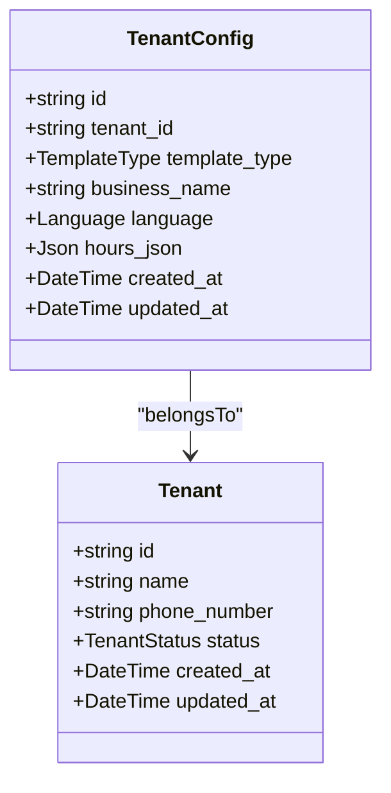
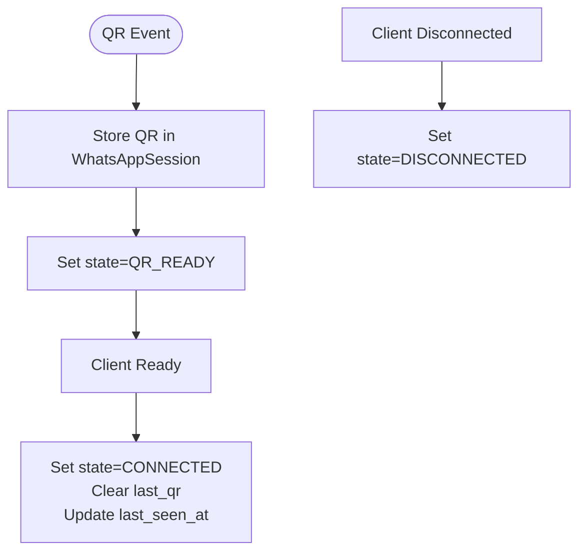
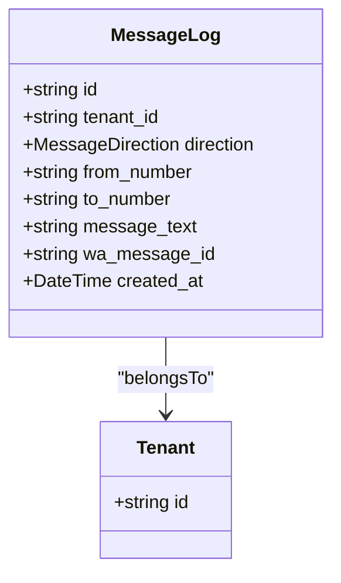
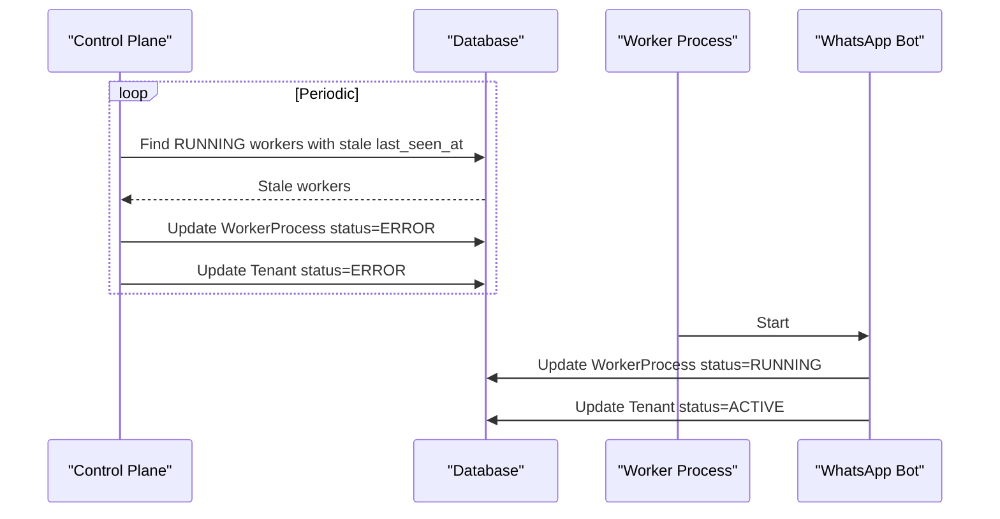

# Core Entities

<cite>
**Referenced Files in This Document**
- [schema.prisma](file://packages/shared/src/prisma/schema.prisma)
- [types/index.ts](file://packages/shared/src/types/index.ts)
- [prisma.ts](file://apps/web/src/lib/prisma.ts)
- [admin.ts](file://apps/control-plane/src/routes/admin.ts)
- [tenant-detail.ejs](file://apps/control-plane/src/views/tenant-detail.ejs)
- [tenants.ejs](file://apps/control-plane/src/views/tenants.ejs)
- [bot.ts](file://apps/worker/src/bot.ts)
- [worker.ts](file://apps/worker/src/worker.ts)
- [reconnect.ts](file://apps/worker/src/utils/reconnect.ts)
- [dedup.ts](file://apps/worker/src/utils/dedup.ts)
- [chat-queue.ts](file://apps/worker/src/utils/chat-queue.ts)
- [logger.ts](file://packages/shared/src/utils/logger.ts)
- [route.ts](file://apps/web/src/app/api/portal/tenant/current/status/route.ts)
- [route.ts](file://apps/web/src/app/api/portal/tenant/current/logs/route.ts)
</cite>

## Table of Contents
1. [Introduction](#introduction)
2. [Project Structure](#project-structure)
3. [Core Components](#core-components)
4. [Architecture Overview](#architecture-overview)
5. [Detailed Component Analysis](#detailed-component-analysis)
6. [Dependency Analysis](#dependency-analysis)
7. [Performance Considerations](#performance-considerations)
8. [Troubleshooting Guide](#troubleshooting-guide)
9. [Conclusion](#conclusion)

## Introduction
This document provides comprehensive documentation for the core database entities in Flow HQ. It focuses on:
- Tenant: lifecycle management, status tracking, and multi-tenant isolation
- TenantConfig: business configuration including template types, language settings, and operational hours
- WhatsAppSession: connection state management, QR code handling, and session persistence
- MessageLog: conversation tracking, message direction, and audit trails
- WorkerProcess: automation status monitoring and process management

The document also covers field definitions, data types, constraints, and business rules derived from the Prisma schema and related implementations.

## Project Structure
The core data model is defined centrally and consumed across the control plane, worker, and web portal:
- Data model and enums are defined in the shared Prisma schema
- TypeScript types define input contracts and relations
- Control plane routes orchestrate creation, updates, and status transitions
- Worker processes manage WhatsApp connections and persist state
- Web portal routes proxy tenant-specific status and logs



**Diagram sources**
- [schema.prisma](file://packages/shared/src/prisma/schema.prisma#L1-L178)
- [types/index.ts](file://packages/shared/src/types/index.ts#L1-L41)
- [admin.ts](file://apps/control-plane/src/routes/admin.ts#L1-L528)
- [tenant-detail.ejs](file://apps/control-plane/src/views/tenant-detail.ejs#L45-L71)
- [tenants.ejs](file://apps/control-plane/src/views/tenants.ejs#L50-L71)
- [bot.ts](file://apps/worker/src/bot.ts#L1-L200)
- [worker.ts](file://apps/worker/src/worker.ts#L1-L46)
- [reconnect.ts](file://apps/worker/src/utils/reconnect.ts#L1-L52)
- [dedup.ts](file://apps/worker/src/utils/dedup.ts#L1-L92)
- [chat-queue.ts](file://apps/worker/src/utils/chat-queue.ts#L1-L42)
- [logger.ts](file://packages/shared/src/utils/logger.ts#L1-L32)
- [route.ts](file://apps/web/src/app/api/portal/tenant/current/status/route.ts#L1-L35)
- [route.ts](file://apps/web/src/app/api/portal/tenant/current/logs/route.ts#L1-L35)

**Section sources**
- [schema.prisma](file://packages/shared/src/prisma/schema.prisma#L1-L178)
- [types/index.ts](file://packages/shared/src/types/index.ts#L1-L41)
- [prisma.ts](file://apps/web/src/lib/prisma.ts#L1-L10)
- [admin.ts](file://apps/control-plane/src/routes/admin.ts#L1-L528)
- [bot.ts](file://apps/worker/src/bot.ts#L1-L200)
- [worker.ts](file://apps/worker/src/worker.ts#L1-L46)
- [logger.ts](file://packages/shared/src/utils/logger.ts#L1-L32)
- [route.ts](file://apps/web/src/app/api/portal/tenant/current/status/route.ts#L1-L35)
- [route.ts](file://apps/web/src/app/api/portal/tenant/current/logs/route.ts#L1-L35)

## Core Components
This section documents each core entity with its fields, data types, constraints, and business rules.

### Tenant
- Purpose: Represents a customer tenant with lifecycle and status tracking
- Multi-tenant isolation: Each tenant is uniquely identified and isolated via its ID and relations
- Lifecycle and statuses: NEW → QR_PENDING → ACTIVE → PAUSED/ERROR; transitions managed by control plane and worker
- Relations:
  - One-to-one with TenantConfig
  - One-to-one with WhatsAppSession
  - One-to-many with MessageLog
  - One-to-one with WorkerProcess
  - Optional User ownership

Fields and constraints:
- id: String (UUID primary key)
- name: String (required)
- phone_number: String (required)
- status: TenantStatus enum with default NEW
- created_at: DateTime (default now)
- updated_at: DateTime (updatedAt)

Business rules:
- Status progression is enforced by control plane and worker actions
- Tenant deletion cascades to related records (via relations)

**Section sources**
- [schema.prisma](file://packages/shared/src/prisma/schema.prisma#L60-L76)
- [admin.ts](file://apps/control-plane/src/routes/admin.ts#L104-L140)
- [bot.ts](file://apps/worker/src/bot.ts#L98-L151)

### TenantConfig
- Purpose: Stores business configuration per tenant
- Template types: BOOKING, ECOMMERCE, SUPPORT
- Language: SW (Swahili) or EN (English)
- Operational hours: Json field for flexible scheduling

Fields and constraints:
- id: String (UUID primary key)
- tenant_id: String (unique, foreign key to Tenant)
- template_type: TemplateType enum with default BOOKING
- business_name: String (required)
- language: Language enum with default SW
- hours_json: Json (optional)
- created_at: DateTime (default now)
- updated_at: DateTime (updatedAt)

Business rules:
- One-to-one relation with Tenant via tenant_id
- Defaults applied for template_type and language

**Section sources**
- [schema.prisma](file://packages/shared/src/prisma/schema.prisma#L78-L90)
- [types/index.ts](file://packages/shared/src/types/index.ts#L21-L27)

### WhatsAppSession
- Purpose: Manages WhatsApp connection state and QR handling
- States: DISCONNECTED, QR_READY, CONNECTED
- Persistence: Stores last QR code image and last_seen_at timestamp

Fields and constraints:
- id: String (UUID primary key)
- tenant_id: String (unique, foreign key to Tenant)
- state: SessionState enum with default DISCONNECTED
- last_qr: String (optional QR code image)
- last_seen_at: DateTime (optional)
- created_at: DateTime (default now)
- updated_at: DateTime (updatedAt)

Business rules:
- One-to-one relation with Tenant
- QR code generation sets state to QR_READY and stores last_qr
- On successful connect, state becomes CONNECTED and last_qr cleared
- On disconnect, state becomes DISCONNECTED and last_seen_at updated

**Section sources**
- [schema.prisma](file://packages/shared/src/prisma/schema.prisma#L92-L103)
- [bot.ts](file://apps/worker/src/bot.ts#L78-L96)
- [bot.ts](file://apps/worker/src/bot.ts#L98-L151)
- [bot.ts](file://apps/worker/src/bot.ts#L185-L208)

### MessageLog
- Purpose: Audit trail and conversation tracking
- Direction: IN or OUT
- Indexing: Composite index on tenant_id and created_at for efficient queries

Fields and constraints:
- id: String (UUID primary key)
- tenant_id: String (foreign key to Tenant)
- direction: MessageDirection enum (required)
- from_number: String (required)
- to_number: String (required)
- message_text: String (required)
- wa_message_id: String (optional)
- created_at: DateTime (default now)

Business rules:
- Tenant-scoped logging
- Indexed for tenant_id and created_at to support pagination and tenant filtering

**Section sources**
- [schema.prisma](file://packages/shared/src/prisma/schema.prisma#L105-L118)
- [admin.ts](file://apps/control-plane/src/routes/admin.ts#L354-L369)

### WorkerProcess
- Purpose: Automation status monitoring and process management
- Statuses: RUNNING, STOPPED, ERROR
- Heartbeat: last_seen_at maintained by worker to signal liveness

Fields and constraints:
- id: String (UUID primary key)
- tenant_id: String (unique, foreign key to Tenant)
- pm2_name: String (process name)
- status: WorkerStatus enum with default STOPPED
- last_error: String (optional)
- created_at: DateTime (default now)
- updated_at: DateTime (updatedAt)

Business rules:
- One-to-one relation with Tenant
- Control plane marks workers as ERROR if stale (no heartbeat within threshold)
- Worker sets status to RUNNING on successful start and clears last_error

**Section sources**
- [schema.prisma](file://packages/shared/src/prisma/schema.prisma#L120-L131)
- [admin.ts](file://apps/control-plane/src/routes/admin.ts#L30-L80)
- [bot.ts](file://apps/worker/src/bot.ts#L98-L151)
- [worker.ts](file://apps/worker/src/worker.ts#L1-L46)

## Architecture Overview
The system orchestrates multi-tenant operations across control plane, worker, and portal layers:
- Control plane creates tenants and manages worker lifecycle
- Worker maintains WhatsApp connection, persists session state, and logs messages
- Portal routes expose tenant status and logs to authenticated users



**Diagram sources**
- [admin.ts](file://apps/control-plane/src/routes/admin.ts#L104-L140)
- [admin.ts](file://apps/control-plane/src/routes/admin.ts#L174-L230)
- [admin.ts](file://apps/control-plane/src/routes/admin.ts#L334-L352)
- [bot.ts](file://apps/worker/src/bot.ts#L78-L96)
- [bot.ts](file://apps/worker/src/bot.ts#L98-L151)
- [schema.prisma](file://packages/shared/src/prisma/schema.prisma#L92-L103)

## Detailed Component Analysis

### Tenant Entity Analysis
- Lifecycle management:
  - Creation sets status to NEW
  - Worker start sets status to QR_PENDING
  - Successful connection sets status to ACTIVE
  - Disconnection or staleness sets status to ERROR
- Multi-tenant isolation:
  - Unique identifiers and foreign keys ensure tenant boundaries
  - Portal routes enforce user access via internal keys and session



**Diagram sources**
- [schema.prisma](file://packages/shared/src/prisma/schema.prisma#L10-L16)
- [admin.ts](file://apps/control-plane/src/routes/admin.ts#L174-L230)
- [bot.ts](file://apps/worker/src/bot.ts#L185-L208)

**Section sources**
- [schema.prisma](file://packages/shared/src/prisma/schema.prisma#L60-L76)
- [admin.ts](file://apps/control-plane/src/routes/admin.ts#L104-L140)
- [admin.ts](file://apps/control-plane/src/routes/admin.ts#L174-L230)
- [bot.ts](file://apps/worker/src/bot.ts#L98-L151)

### TenantConfig Analysis
- Business configuration:
  - template_type drives messaging templates and flows
  - language affects localized responses
  - hours_json enables dynamic operational hours
- Defaults and constraints:
  - template_type defaults to BOOKING
  - language defaults to SW



**Diagram sources**
- [schema.prisma](file://packages/shared/src/prisma/schema.prisma#L78-L90)
- [schema.prisma](file://packages/shared/src/prisma/schema.prisma#L60-L76)

**Section sources**
- [schema.prisma](file://packages/shared/src/prisma/schema.prisma#L78-L90)
- [types/index.ts](file://packages/shared/src/types/index.ts#L21-L27)

### WhatsAppSession Analysis
- QR code handling:
  - QR event stores QR as data URL
  - State transitions to QR_READY
- Connection state management:
  - Ready event transitions to CONNECTED and clears QR
  - Disconnected event transitions to DISCONNECTED
- Session persistence:
  - LocalAuth dataPath per tenant ensures isolated sessions



**Diagram sources**
- [bot.ts](file://apps/worker/src/bot.ts#L78-L96)
- [bot.ts](file://apps/worker/src/bot.ts#L98-L151)
- [bot.ts](file://apps/worker/src/bot.ts#L185-L208)
- [schema.prisma](file://packages/shared/src/prisma/schema.prisma#L92-L103)

**Section sources**
- [schema.prisma](file://packages/shared/src/prisma/schema.prisma#L92-L103)
- [bot.ts](file://apps/worker/src/bot.ts#L78-L96)
- [bot.ts](file://apps/worker/src/bot.ts#L98-L151)
- [bot.ts](file://apps/worker/src/bot.ts#L185-L208)

### MessageLog Analysis
- Conversation tracking:
  - Records direction, numbers, and text
  - Supports optional wa_message_id for deduplication
- Audit trails:
  - Tenant-scoped entries with timestamps
  - Indexed for efficient tenant-based queries



**Diagram sources**
- [schema.prisma](file://packages/shared/src/prisma/schema.prisma#L105-L118)
- [schema.prisma](file://packages/shared/src/prisma/schema.prisma#L60-L76)

**Section sources**
- [schema.prisma](file://packages/shared/src/prisma/schema.prisma#L105-L118)
- [admin.ts](file://apps/control-plane/src/routes/admin.ts#L354-L369)

### WorkerProcess Analysis
- Automation monitoring:
  - Status reflects PM2 process health
  - last_error captures failures
- Staleness detection:
  - Control plane marks workers as ERROR if no heartbeat within threshold
- Heartbeat mechanism:
  - Worker sets RUNNING and clears last_error on ready
  - Heartbeat updates last_seen_at



**Diagram sources**
- [admin.ts](file://apps/control-plane/src/routes/admin.ts#L30-L80)
- [bot.ts](file://apps/worker/src/bot.ts#L98-L151)
- [schema.prisma](file://packages/shared/src/prisma/schema.prisma#L120-L131)

**Section sources**
- [schema.prisma](file://packages/shared/src/prisma/schema.prisma#L120-L131)
- [admin.ts](file://apps/control-plane/src/routes/admin.ts#L30-L80)
- [bot.ts](file://apps/worker/src/bot.ts#L98-L151)

## Dependency Analysis
The following diagram shows key dependencies among core entities and their usage across modules:

```mermaid
erDiagram
TENANT {
uuid id PK
string name
string phone_number
enum status
timestamp created_at
timestamp updated_at
}
TENANT_CONFIG {
uuid id PK
uuid tenant_id UK FK
enum template_type
string business_name
enum language
json hours_json
timestamp created_at
timestamp updated_at
}
WHATSAPP_SESSION {
uuid id PK
uuid tenant_id UK FK
enum state
string last_qr
timestamp last_seen_at
timestamp created_at
timestamp updated_at
}
MESSAGE_LOG {
uuid id PK
uuid tenant_id FK
enum direction
string from_number
string to_number
string message_text
string wa_message_id
timestamp created_at
}
WORKER_PROCESS {
uuid id PK
uuid tenant_id UK FK
string pm2_name
enum status
string last_error
timestamp created_at
timestamp updated_at
}
TENANT ||--o| TENANT_CONFIG : "has one"
TENANT ||--o| WHATSAPP_SESSION : "has one"
TENANT ||--o{ MESSAGE_LOG : "has many"
TENANT ||--o| WORKER_PROCESS : "has one"
```

**Diagram sources**
- [schema.prisma](file://packages/shared/src/prisma/schema.prisma#L60-L131)

**Section sources**
- [schema.prisma](file://packages/shared/src/prisma/schema.prisma#L60-L131)

## Performance Considerations
- Indexing: MessageLog is indexed by tenant_id and created_at to optimize tenant-scoped queries and pagination
- Logging: Centralized logger supports per-tenant log files to avoid cross-tenant log mixing and improve observability
- Worker staleness: Control plane periodically detects stale workers to prevent resource leaks and maintain system health
- Queueing and deduplication: ChatQueueManager and MessageDeduplicator prevent overload and duplicate processing

[No sources needed since this section provides general guidance]

## Troubleshooting Guide
Common issues and remedies:
- QR code not appearing:
  - Verify WhatsAppSession state is QR_READY and last_qr is populated
  - Confirm worker is running and client emitted QR event
- Connection drops:
  - Check WorkerProcess status and last_error
  - Review disconnection events and reconnect attempts
- Stale worker:
  - Confirm last_seen_at freshness; control plane marks ERROR if stale
- Duplicate messages:
  - Deduplicator uses wa_message_id; ensure it is present and unique
- Queue overflow:
  - ChatQueueManager enforces a maximum queue size per chat; consider increasing capacity or reducing load

**Section sources**
- [bot.ts](file://apps/worker/src/bot.ts#L78-L96)
- [bot.ts](file://apps/worker/src/bot.ts#L185-L208)
- [admin.ts](file://apps/control-plane/src/routes/admin.ts#L30-L80)
- [dedup.ts](file://apps/worker/src/utils/dedup.ts#L28-L46)
- [chat-queue.ts](file://apps/worker/src/utils/chat-queue.ts#L35-L42)

## Conclusion
The core entities in Flow HQ provide a robust foundation for multi-tenant WhatsApp automation:
- Tenant tracks lifecycle and status
- TenantConfig encapsulates business configuration
- WhatsAppSession manages connection state and QR handling
- MessageLog ensures auditability and conversation tracking
- WorkerProcess monitors automation health and liveness

The Prisma schema defines strong constraints and relations, while control plane and worker implementations enforce business rules and state transitions.