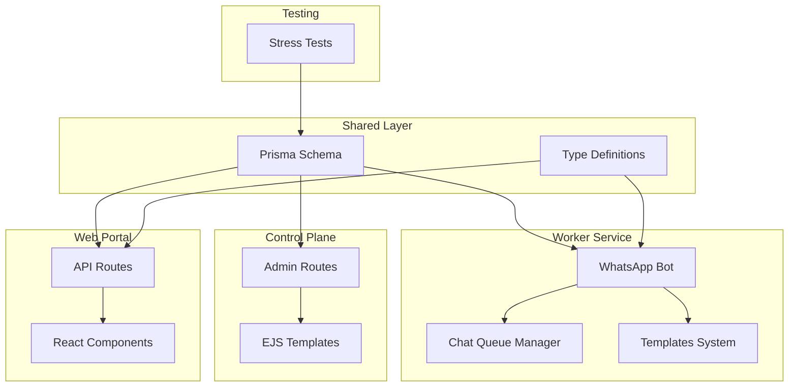
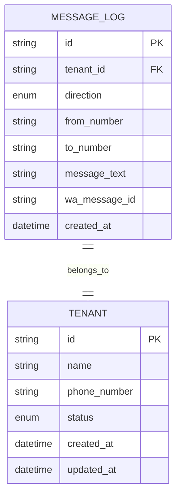
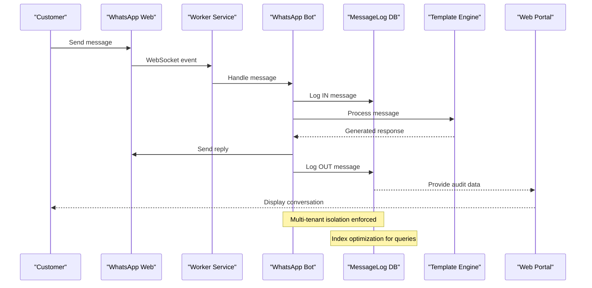
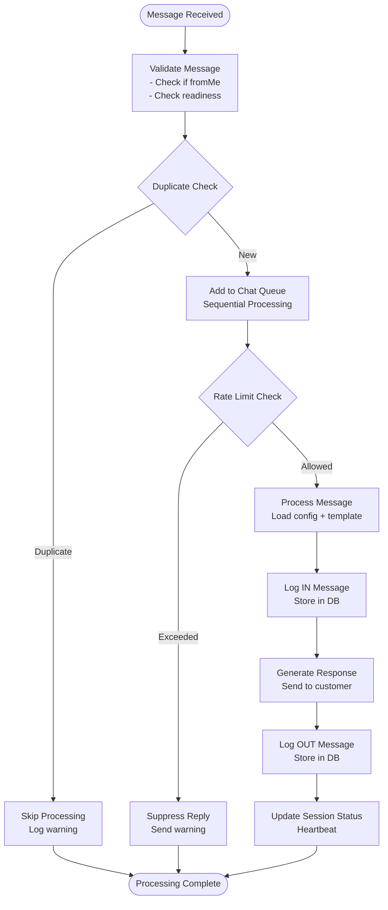
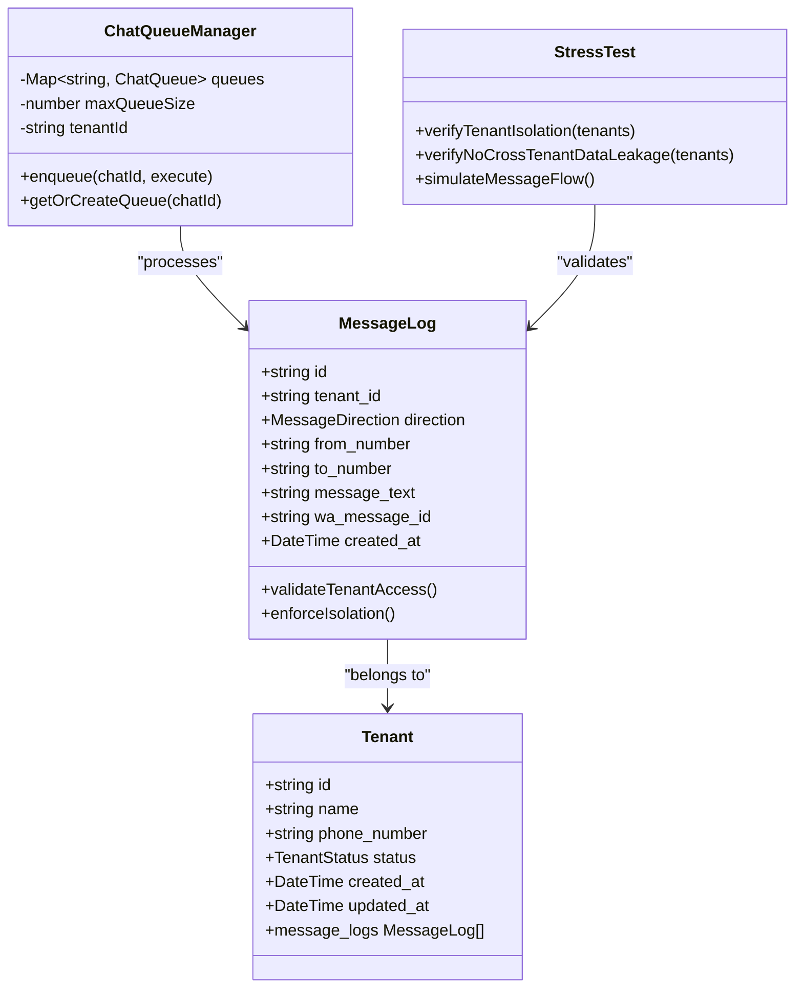
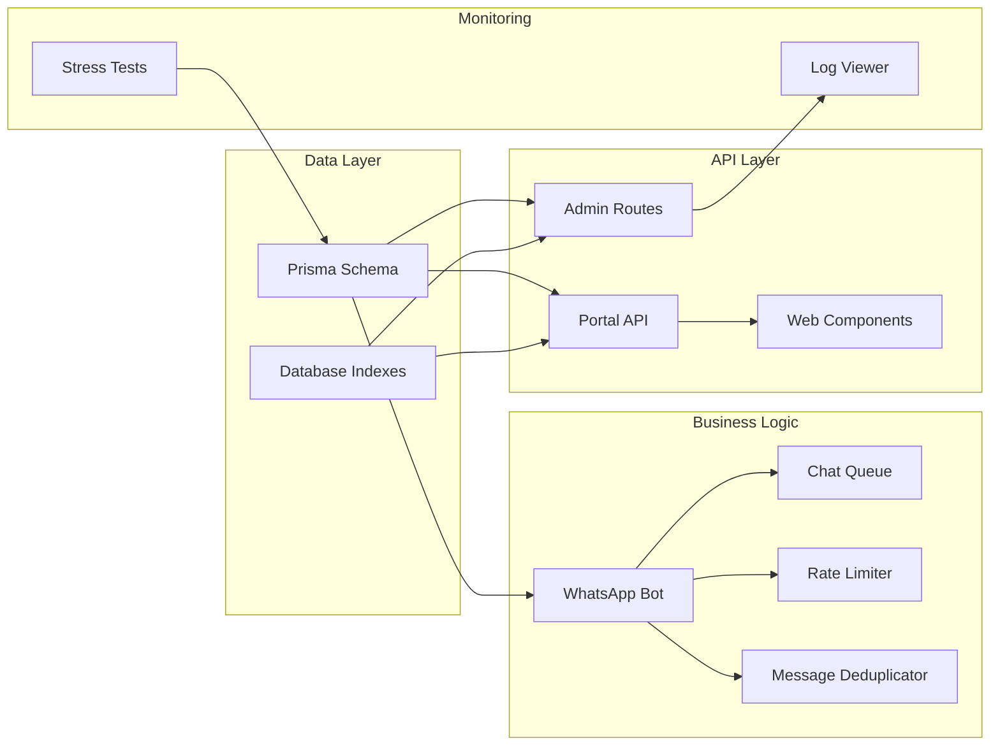
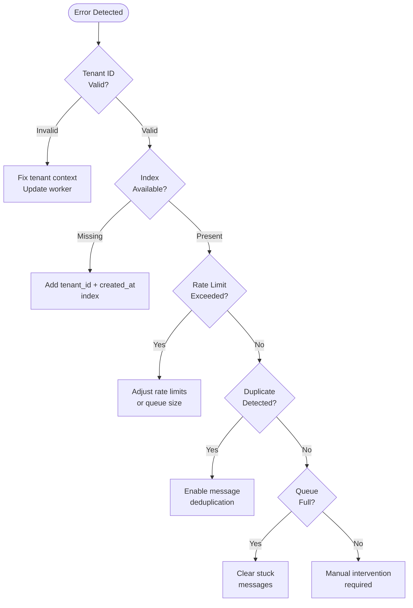

# MessageLog Entity

<cite>
**Referenced Files in This Document**
- [schema.prisma](file://packages/shared/src/prisma/schema.prisma)
- [bot.ts](file://apps/worker/src/bot.ts)
- [admin.ts](file://apps/control-plane/src/routes/admin.ts)
- [tenant-detail.ejs](file://apps/control-plane/src/views/tenant-detail.ejs)
- [stress-test.ts](file://scripts/stress-test.ts)
- [index.ts](file://packages/shared/src/types/index.ts)
- [chat-queue.ts](file://apps/worker/src/utils/chat-queue.ts)
- [logs/route.ts](file://apps/web/src/app/api/portal/tenant/current/logs/route.ts)
</cite>

## Table of Contents
1. [Introduction](#introduction)
2. [Project Structure](#project-structure)
3. [Core Components](#core-components)
4. [Architecture Overview](#architecture-overview)
5. [Detailed Component Analysis](#detailed-component-analysis)
6. [Dependency Analysis](#dependency-analysis)
7. [Performance Considerations](#performance-considerations)
8. [Troubleshooting Guide](#troubleshooting-guide)
9. [Conclusion](#conclusion)

## Introduction

The MessageLog entity serves as the cornerstone for conversation tracking and audit trails in the FLOW HQ Bot system. It provides comprehensive logging capabilities for all WhatsApp message interactions, enabling multi-tenant isolation, automated response tracking, and detailed analytics for business operations.

This entity captures the complete lifecycle of customer conversations, from initial inquiry through automated responses, while maintaining strict tenant boundaries and providing robust audit capabilities for compliance and operational monitoring.

## Project Structure

The MessageLog entity is part of a larger microservices architecture that spans multiple applications:



**Diagram sources**
- [schema.prisma](file://packages/shared/src/prisma/schema.prisma#L105-L118)
- [bot.ts](file://apps/worker/src/bot.ts#L12-L75)
- [admin.ts](file://apps/control-plane/src/routes/admin.ts#L142-L171)

**Section sources**
- [schema.prisma](file://packages/shared/src/prisma/schema.prisma#L105-L118)
- [bot.ts](file://apps/worker/src/bot.ts#L12-L75)

## Core Components

### MessageLog Entity Definition

The MessageLog entity is defined in the Prisma schema with the following structure:



**Diagram sources**
- [schema.prisma](file://packages/shared/src/prisma/schema.prisma#L105-L118)
- [schema.prisma](file://packages/shared/src/prisma/schema.prisma#L60-L76)

### Message Direction Enum

The MessageDirection enum provides standardized categorization of message flow:

| Enum Value | Description | Usage Context |
|------------|-------------|---------------|
| `IN` | Incoming messages from customers | Customer-initiated conversations |
| `OUT` | Outgoing messages to customers | Automated responses and business communications |

### Field Meanings and Data Types

| Field | Type | Description | Example Values |
|-------|------|-------------|----------------|
| `id` | String (UUID) | Unique identifier for each log entry | `"550e8400-e29b-41d4-a716-446655440000"` |
| `tenant_id` | String (UUID) | Foreign key linking to Tenant entity | `"7f6a9c2d-1e4b-3f5a-8c9d-2e1f4a7b8c9d"` |
| `direction` | Enum (`IN`/`OUT`) | Message flow direction indicator | `IN` or `OUT` |
| `from_number` | String | WhatsApp number of message sender | `"1234567890@s.whatsapp.net"` |
| `to_number` | String | WhatsApp number of message recipient | `"0987654321@s.whatsapp.net"` |
| `message_text` | String | Content of the WhatsApp message | `"Hello, I'd like to book a service"` |
| `wa_message_id` | String (Nullable) | Original WhatsApp message identifier | `"ABCD1234EFGH5678IJKL9012MNOP3456"` |
| `created_at` | DateTime | Timestamp of message logging | `"2024-01-15T10:30:00.000Z"` |

**Section sources**
- [schema.prisma](file://packages/shared/src/prisma/schema.prisma#L105-L118)
- [index.ts](file://packages/shared/src/types/index.ts#L33-L40)

## Architecture Overview

The MessageLog system operates through a comprehensive message flow that spans multiple services:



**Diagram sources**
- [bot.ts](file://apps/worker/src/bot.ts#L153-L183)
- [bot.ts](file://apps/worker/src/bot.ts#L248-L331)
- [admin.ts](file://apps/control-plane/src/routes/admin.ts#L157-L161)

## Detailed Component Analysis

### Message Flow Implementation

The message handling pipeline follows a structured approach for both incoming and outgoing communications:

#### Incoming Message Processing



**Diagram sources**
- [bot.ts](file://apps/worker/src/bot.ts#L153-L183)
- [bot.ts](file://apps/worker/src/bot.ts#L248-L331)

#### Automated Response Generation

The system generates contextually appropriate responses based on tenant configuration:

| Template Type | Business Context | Response Pattern |
|---------------|------------------|------------------|
| `BOOKING` | Salon/spa services | Service availability and booking requests |
| `ECOMMERCE` | Retail products | Product inquiries and order processing |
| `SUPPORT` | Customer support | Issue resolution and assistance |

**Section sources**
- [bot.ts](file://apps/worker/src/bot.ts#L248-L331)
- [templates/index.ts](file://apps/worker/src/templates/index.ts#L9-L23)

### Multi-Tenant Isolation

The MessageLog system enforces strict tenant boundaries through multiple mechanisms:



**Diagram sources**
- [schema.prisma](file://packages/shared/src/prisma/schema.prisma#L105-L118)
- [chat-queue.ts](file://apps/worker/src/utils/chat-queue.ts#L21-L42)
- [stress-test.ts](file://scripts/stress-test.ts#L137-L163)

**Section sources**
- [stress-test.ts](file://scripts/stress-test.ts#L137-L163)
- [stress-test.ts](file://scripts/stress-test.ts#L165-L213)

### Audit Trail Implementation

The MessageLog entity provides comprehensive audit capabilities:

| Audit Feature | Implementation | Purpose |
|---------------|----------------|---------|
| **Message Tracking** | Full message content logging | Conversation history and compliance |
| **Direction Monitoring** | IN/OUT enum tracking | Message flow analysis |
| **Tenant Isolation** | tenant_id foreign key | Multi-tenant data separation |
| **Timestamp Tracking** | created_at field | Timeline reconstruction |
| **WhatsApp Correlation** | wa_message_id field | External system integration |

**Section sources**
- [admin.ts](file://apps/control-plane/src/routes/admin.ts#L157-L161)
- [tenant-detail.ejs](file://apps/control-plane/src/views/tenant-detail.ejs#L140-L170)

## Dependency Analysis

The MessageLog entity integrates with several key components across the system:



**Diagram sources**
- [schema.prisma](file://packages/shared/src/prisma/schema.prisma#L116)
- [admin.ts](file://apps/control-plane/src/routes/admin.ts#L354-L369)
- [logs/route.ts](file://apps/web/src/app/api/portal/tenant/current/logs/route.ts#L8-L34)

**Section sources**
- [schema.prisma](file://packages/shared/src/prisma/schema.prisma#L116)
- [admin.ts](file://apps/control-plane/src/routes/admin.ts#L354-L369)

## Performance Considerations

### Indexing Strategy

The MessageLog entity employs strategic indexing for optimal query performance:

```mermaid
erDiagram
MESSAGE_LOG {
string id PK
string tenant_id
enum direction
string from_number
string to_number
string message_text
string wa_message_id
datetime created_at
}
INDEXES {
tenant_created_idx "tenant_id + created_at"
direction_idx "direction"
wa_msg_idx "wa_message_id"
}
MESSAGE_LOG ||--o{ INDEXES : "indexed_by"
```

**Diagram sources**
- [schema.prisma](file://packages/shared/src/prisma/schema.prisma#L116)

The primary composite index `tenant_id + created_at` enables:

- **Tenant-scoped queries**: Efficient filtering by tenant
- **Temporal ordering**: Natural chronological sorting
- **Pagination support**: Optimized LIMIT/OFFSET operations
- **Analytics queries**: Fast aggregation by time periods

### Query Patterns

Common query patterns optimized for the MessageLog entity:

| Query Type | Purpose | Performance Impact |
|------------|---------|-------------------|
| `findByTenant(tenant_id)` | Tenant dashboard loading | O(log n) index seek |
| `findByTenantOrderByCreated(tenant_id, limit)` | Recent messages display | O(k log n) where k = limit |
| `findByTenantAndDirection(tenant_id, direction)` | Directional analytics | O(n) linear scan |
| `findByWaMessageId(wa_message_id)` | WhatsApp correlation | O(log n) index lookup |

### Scalability Considerations

The system handles high-volume message processing through:

- **Sequential processing per chat**: Prevents race conditions
- **Rate limiting**: Controls message throughput
- **Message deduplication**: Eliminates redundant processing
- **Queue management**: Handles burst traffic gracefully

**Section sources**
- [schema.prisma](file://packages/shared/src/prisma/schema.prisma#L116)
- [chat-queue.ts](file://apps/worker/src/utils/chat-queue.ts#L35-L42)

## Troubleshooting Guide

### Common Issues and Solutions

| Issue | Symptoms | Root Cause | Resolution |
|-------|----------|------------|------------|
| **Missing tenant_id** | Cross-tenant data access | Incorrect tenant context | Verify tenantId propagation |
| **Duplicate messages** | Message spam in logs | WhatsApp webhook duplication | Enable deduplication |
| **Slow query performance** | Dashboard loading delays | Missing indexes | Add tenant_id + created_at index |
| **Rate limit exceeded** | Suppressed replies | Excessive customer activity | Adjust rate limiter settings |
| **Queue overflow** | Message processing delays | High chat volume | Increase queue capacity |

### Monitoring and Debugging

Key diagnostic indicators:



**Section sources**
- [chat-queue.ts](file://apps/worker/src/utils/chat-queue.ts#L38-L42)
- [bot.ts](file://apps/worker/src/bot.ts#L167-L182)

## Conclusion

The MessageLog entity represents a sophisticated solution for conversation tracking and audit trails in multi-tenant WhatsApp automation systems. Its design balances comprehensive logging capabilities with performance optimization and strict tenant isolation.

Key strengths include:

- **Comprehensive coverage**: Captures complete message lifecycle
- **Multi-tenant architecture**: Ensures data separation and compliance
- **Performance optimization**: Strategic indexing for efficient queries
- **Audit readiness**: Full compliance with regulatory requirements
- **Scalable design**: Handles high-volume message processing

The system successfully transforms raw WhatsApp interactions into actionable business intelligence while maintaining operational excellence and tenant privacy. This foundation enables advanced analytics, compliance reporting, and operational monitoring essential for modern customer communication platforms.