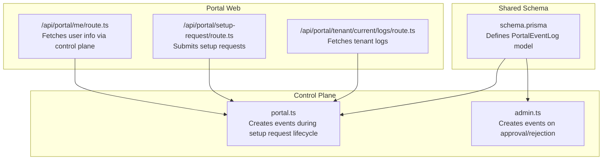
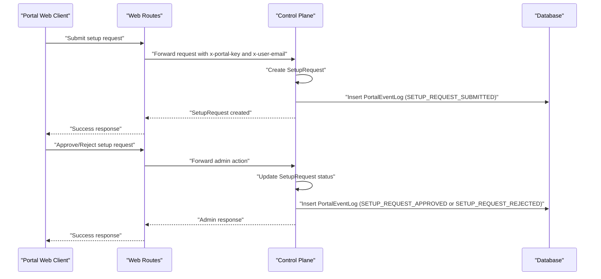
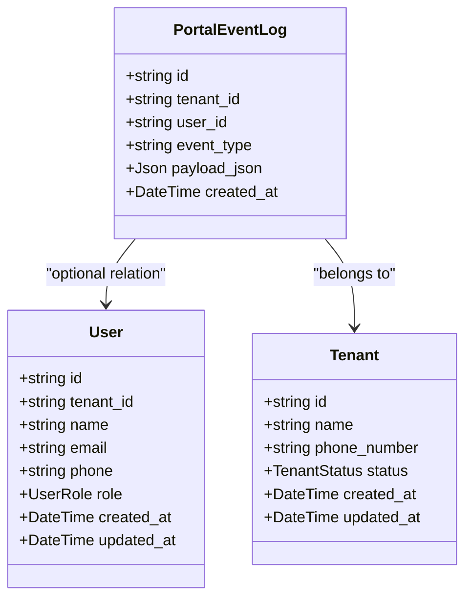
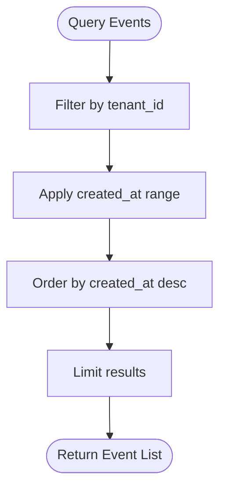
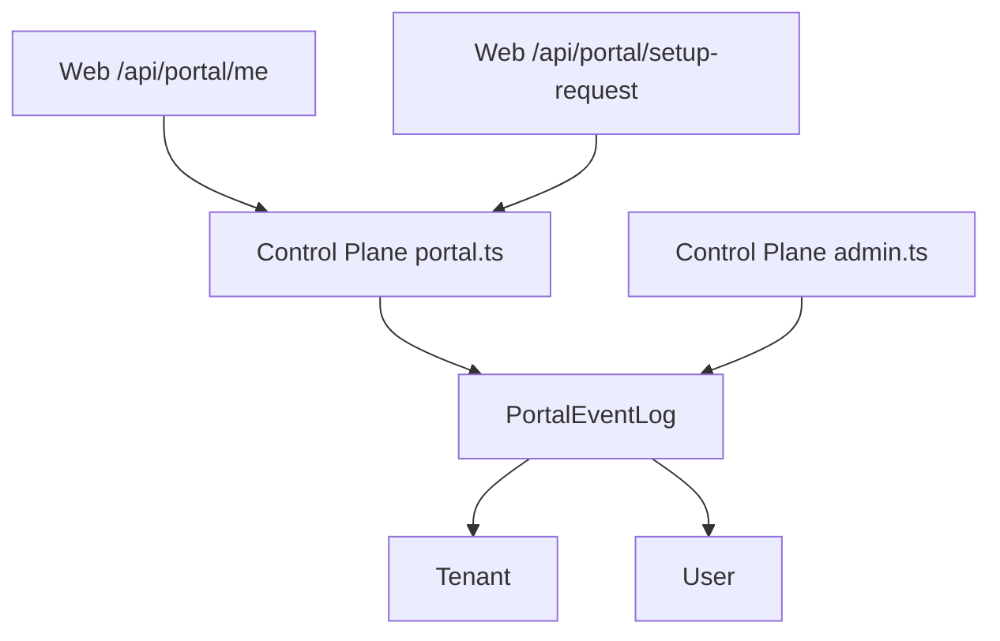

# PortalEventLog Entity

<cite>
**Referenced Files in This Document**
- [schema.prisma](file://packages/shared/src/prisma/schema.prisma)
- [portal.ts](file://apps/control-plane/src/routes/portal.ts)
- [admin.ts](file://apps/control-plane/src/routes/admin.ts)
- [route.ts](file://apps/web/src/app/api/portal/me/route.ts)
- [route.ts](file://apps/web/src/app/api/portal/setup-request/route.ts)
- [route.ts](file://apps/web/src/app/api/portal/tenant/current/logs/route.ts)
</cite>

## Table of Contents
1. [Introduction](#introduction)
2. [Project Structure](#project-structure)
3. [Core Components](#core-components)
4. [Architecture Overview](#architecture-overview)
5. [Detailed Component Analysis](#detailed-component-analysis)
6. [Dependency Analysis](#dependency-analysis)
7. [Performance Considerations](#performance-considerations)
8. [Troubleshooting Guide](#troubleshooting-guide)
9. [Conclusion](#conclusion)

## Introduction
This document describes the PortalEventLog entity used to track user portal activities and system events. It explains the event_type field for categorizing actions, the payload_json field for storing structured event data, tenant_id indexing for efficient querying and time-based filtering, and the relationship with the User entity for user activity tracking. It also provides examples of common event types, event data structures, and analytics use cases for monitoring portal usage.

## Project Structure
PortalEventLog is defined in the shared Prisma schema and is used by both the control plane and portal web routes. The entity supports optional user association and tenant scoping with a composite index optimized for time-series queries.

**Diagram sources**
- [schema.prisma](file://packages/shared/src/prisma/schema.prisma#L166-L177)
- [portal.ts](file://apps/control-plane/src/routes/portal.ts#L138-L146)
- [admin.ts](file://apps/control-plane/src/routes/admin.ts#L475-L482)
- [route.ts](file://apps/web/src/app/api/portal/me/route.ts#L1-L34)
- [route.ts](file://apps/web/src/app/api/portal/setup-request/route.ts#L1-L39)
- [route.ts](file://apps/web/src/app/api/portal/tenant/current/logs/route.ts#L1-L35)

**Section sources**
- [schema.prisma](file://packages/shared/src/prisma/schema.prisma#L166-L177)
- [portal.ts](file://apps/control-plane/src/routes/portal.ts#L138-L146)
- [admin.ts](file://apps/control-plane/src/routes/admin.ts#L475-L482)
- [route.ts](file://apps/web/src/app/api/portal/me/route.ts#L1-L34)
- [route.ts](file://apps/web/src/app/api/portal/setup-request/route.ts#L1-L39)
- [route.ts](file://apps/web/src/app/api/portal/tenant/current/logs/route.ts#L1-L35)

## Core Components
PortalEventLog is a lightweight event storage model with the following fields:
- id: Unique identifier
- tenant_id: Links the event to a tenant for multi-tenancy
- user_id: Optional link to the User who triggered the event
- event_type: String tag used to categorize the event
- payload_json: JSON payload containing structured event data
- created_at: Timestamp for time-based filtering and ordering

Indexing:
- Composite index on [tenant_id, created_at] enables efficient tenant-scoped time-range queries.

Relationships:
- Belongs to User via optional user_id
- Belongs to Tenant via tenant_id

**Section sources**
- [schema.prisma](file://packages/shared/src/prisma/schema.prisma#L166-L177)

## Architecture Overview
PortalEventLog participates in two primary flows:
- Setup request lifecycle: Events are logged when a setup request is submitted, approved, or rejected.
- Portal user activity: Events can optionally capture user-specific actions when user_id is present.

**Diagram sources**
- [portal.ts](file://apps/control-plane/src/routes/portal.ts#L138-L146)
- [admin.ts](file://apps/control-plane/src/routes/admin.ts#L475-L482)
- [route.ts](file://apps/web/src/app/api/portal/setup-request/route.ts#L1-L39)

## Detailed Component Analysis

### Data Model and Relationships
PortalEventLog is defined with a composite index for tenant and time filtering and an optional relation to User.

**Diagram sources**
- [schema.prisma](file://packages/shared/src/prisma/schema.prisma#L133-L148)
- [schema.prisma](file://packages/shared/src/prisma/schema.prisma#L166-L177)

**Section sources**
- [schema.prisma](file://packages/shared/src/prisma/schema.prisma#L133-L148)
- [schema.prisma](file://packages/shared/src/prisma/schema.prisma#L166-L177)

### Event Types and Payload Examples
Common event types observed in the codebase:
- SETUP_REQUEST_SUBMITTED: Logged when a setup request is created. Payload includes submission metadata such as template type, language, and business name.
- SETUP_REQUEST_APPROVED: Logged when a setup request is approved. Payload includes request ID and optional notes.
- SETUP_REQUEST_REJECTED: Logged when a setup request is rejected. Payload includes request ID and rejection notes.

Example payload structures (described):
- SETUP_REQUEST_SUBMITTED: { templateType: "...", language: "...", businessName: "..." }
- SETUP_REQUEST_APPROVED: { requestId: "...", notes: "..." }
- SETUP_REQUEST_REJECTED: { requestId: "...", notes: "..." }

These examples illustrate how payload_json stores structured data for downstream analytics and audit trails.

**Section sources**
- [portal.ts](file://apps/control-plane/src/routes/portal.ts#L138-L146)
- [admin.ts](file://apps/control-plane/src/routes/admin.ts#L475-L482)
- [admin.ts](file://apps/control-plane/src/routes/admin.ts#L511-L518)

### Indexing and Time-Based Filtering
The composite index [tenant_id, created_at] supports efficient tenant-scoped queries and time-range filtering. This is essential for:
- Fetching recent events per tenant
- Generating usage reports and dashboards
- Enabling pagination and chronological ordering

**Diagram sources**
- [schema.prisma](file://packages/shared/src/prisma/schema.prisma#L175)

**Section sources**
- [schema.prisma](file://packages/shared/src/prisma/schema.prisma#L175)

### Relationship with User Entity
PortalEventLog optionally links to User via user_id. When present, it enables:
- User-specific activity tracking
- Auditing individual user actions within a tenant
- Cross-referencing with user roles and permissions

The User model includes a reverse relation to PortalEventLog, enabling queries that fetch a user’s events.

**Section sources**
- [schema.prisma](file://packages/shared/src/prisma/schema.prisma#L133-L148)
- [schema.prisma](file://packages/shared/src/prisma/schema.prisma#L166-L177)

### Analytics Use Cases
PortalEventLog supports several analytics scenarios:
- Adoption metrics: Count of SETUP_REQUEST_SUBMITTED per tenant over time
- Approval funnel: Ratio of APPROVED vs REJECTED requests
- User engagement: Frequency of user-triggered events (when user_id is populated)
- Operational insights: Timing and outcomes of setup request lifecycle stages

These use cases rely on tenant_id scoping and created_at ordering enabled by the composite index.

**Section sources**
- [portal.ts](file://apps/control-plane/src/routes/portal.ts#L138-L146)
- [admin.ts](file://apps/control-plane/src/routes/admin.ts#L475-L482)
- [admin.ts](file://apps/control-plane/src/routes/admin.ts#L511-L518)

## Dependency Analysis
PortalEventLog depends on:
- Tenant for multi-tenancy isolation
- User for optional user attribution
- Control plane routes for event creation during setup request lifecycle
- Web routes for portal-to-control-plane communication

**Diagram sources**
- [schema.prisma](file://packages/shared/src/prisma/schema.prisma#L166-L177)
- [portal.ts](file://apps/control-plane/src/routes/portal.ts#L138-L146)
- [admin.ts](file://apps/control-plane/src/routes/admin.ts#L475-L482)
- [route.ts](file://apps/web/src/app/api/portal/me/route.ts#L1-L34)
- [route.ts](file://apps/web/src/app/api/portal/setup-request/route.ts#L1-L39)

**Section sources**
- [schema.prisma](file://packages/shared/src/prisma/schema.prisma#L166-L177)
- [portal.ts](file://apps/control-plane/src/routes/portal.ts#L138-L146)
- [admin.ts](file://apps/control-plane/src/routes/admin.ts#L475-L482)
- [route.ts](file://apps/web/src/app/api/portal/me/route.ts#L1-L34)
- [route.ts](file://apps/web/src/app/api/portal/setup-request/route.ts#L1-L39)

## Performance Considerations
- Use the composite index [tenant_id, created_at] for tenant-scoped queries to avoid full scans.
- Prefer filtering by tenant_id and limiting date ranges to reduce result sets.
- Store only necessary data in payload_json to minimize storage and improve query performance.
- Consider partitioning or retention policies for historical event data if volumes grow large.

## Troubleshooting Guide
- Missing x-portal-key or invalid key: Control plane routes enforce portal authentication; ensure the portal internal key is configured and passed in headers.
- Missing x-user-email: Many routes require a valid user session; verify NextAuth session and header forwarding.
- Unauthorized access: Ensure the portal internal key and user email headers are present and correct.
- Event not appearing: Confirm that the event type and payload are correctly set when creating PortalEventLog entries.

**Section sources**
- [portal.ts](file://apps/control-plane/src/routes/portal.ts#L12-L25)
- [route.ts](file://apps/web/src/app/api/portal/me/route.ts#L15-L33)
- [route.ts](file://apps/web/src/app/api/portal/setup-request/route.ts#L17-L38)

## Conclusion
PortalEventLog provides a flexible and efficient mechanism for capturing tenant-scoped events with optional user attribution. Its composite index on tenant_id and created_at enables robust time-based analytics, while payload_json accommodates diverse event data. The observed event types demonstrate practical usage for tracking setup request lifecycle events, forming the foundation for broader portal usage monitoring and operational insights.