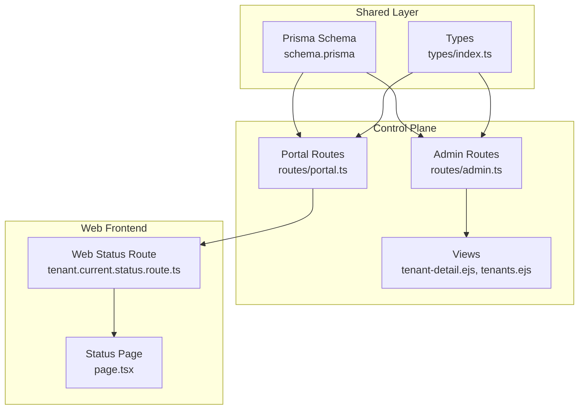
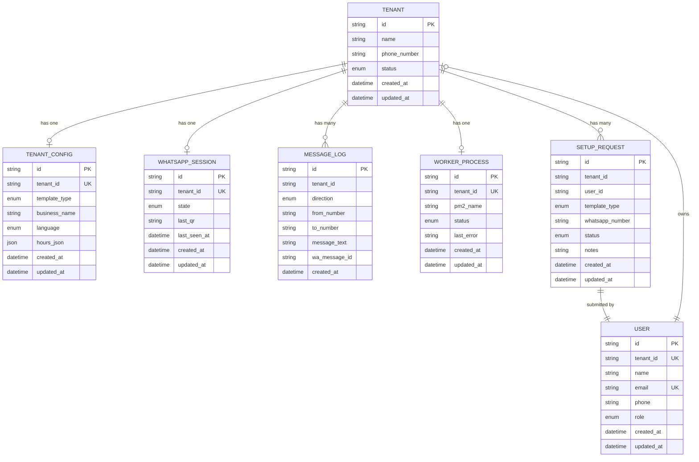
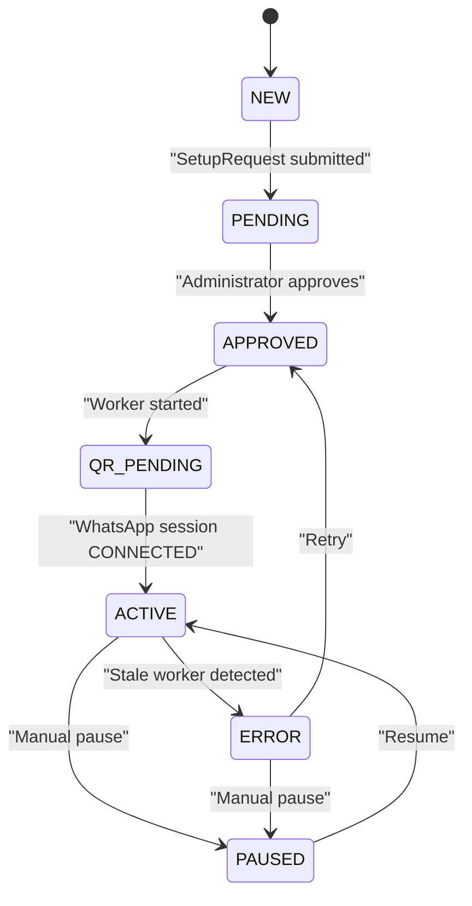
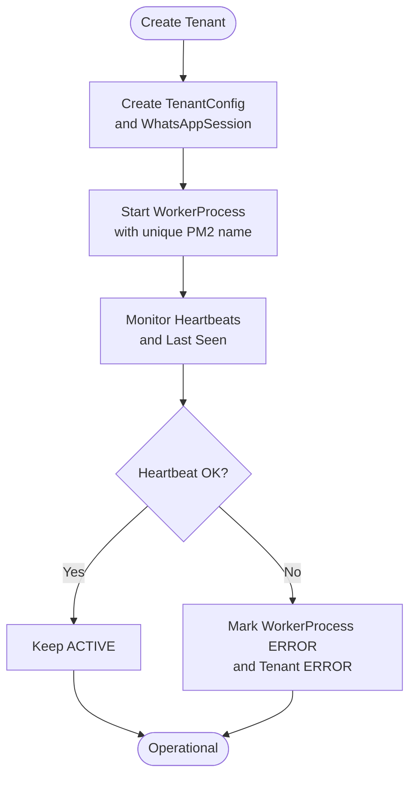
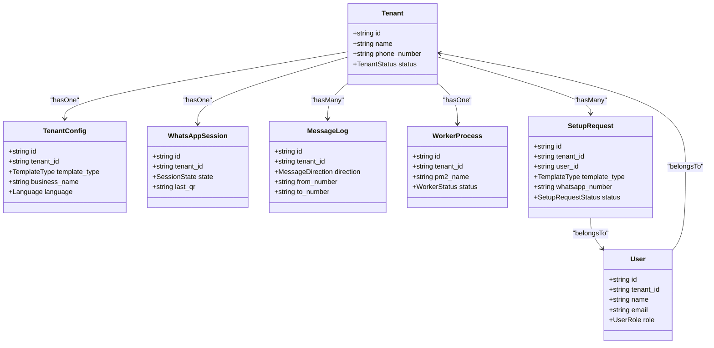
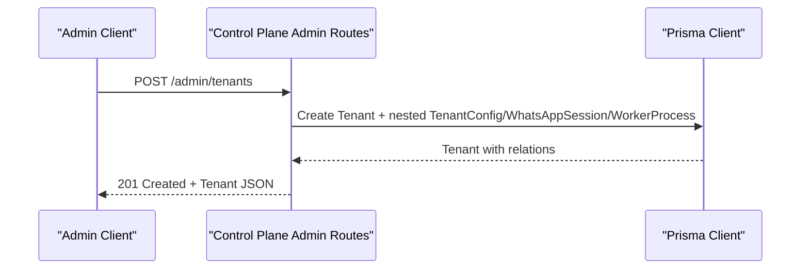
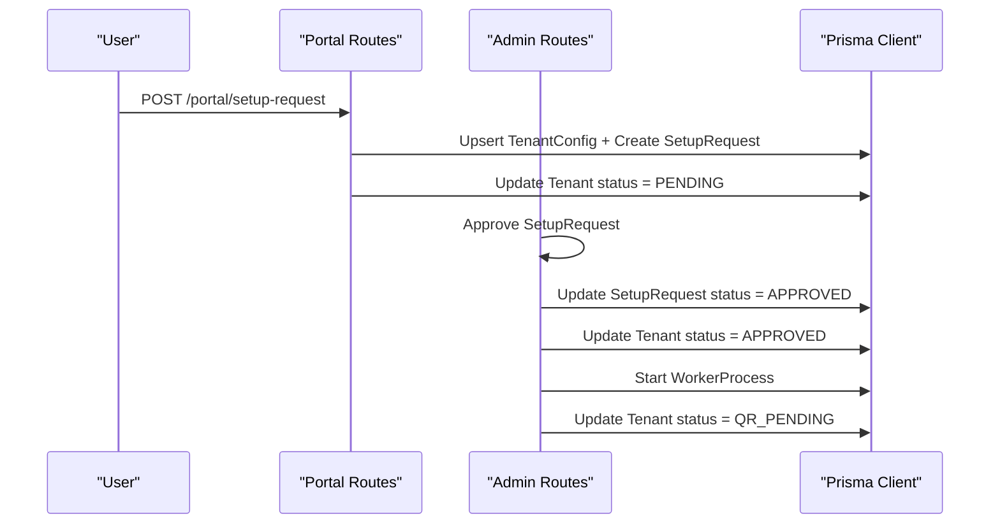
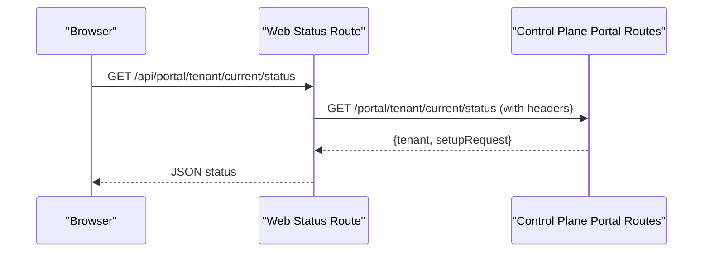
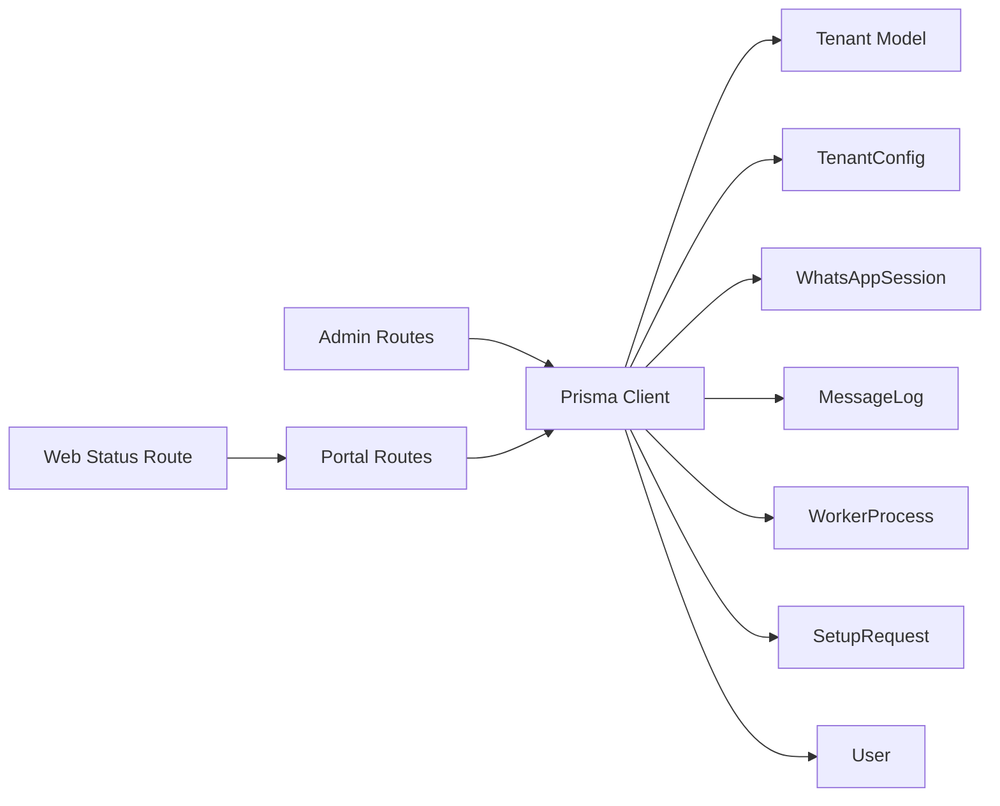

# Tenant Entity

<cite>
**Referenced Files in This Document**
- [schema.prisma](file://packages/shared/src/prisma/schema.prisma)
- [types/index.ts](file://packages/shared/src/types/index.ts)
- [admin.ts](file://apps/control-plane/src/routes/admin.ts)
- [portal.ts](file://apps/control-plane/src/routes/portal.ts)
- [tenant-detail.ejs](file://apps/control-plane/src/views/tenant-detail.ejs)
- [tenants.ejs](file://apps/control-plane/src/views/tenants.ejs)
- [tenant.current.status.route.ts](file://apps/web/src/app/api/portal/tenant/current/status/route.ts)
- [page.tsx](file://apps/web/src/app/(portal)/app/status/page.tsx)
- [stress-test.ts](file://scripts/stress-test.ts)
</cite>

## Table of Contents
1. [Introduction](#introduction)
2. [Project Structure](#project-structure)
3. [Core Components](#core-components)
4. [Architecture Overview](#architecture-overview)
5. [Detailed Component Analysis](#detailed-component-analysis)
6. [Dependency Analysis](#dependency-analysis)
7. [Performance Considerations](#performance-considerations)
8. [Troubleshooting Guide](#troubleshooting-guide)
9. [Conclusion](#conclusion)

## Introduction
This document describes the Tenant entity in Flow HQ, focusing on its structure, lifecycle, multi-tenant isolation, and relationships with related entities. It explains how tenants progress through states (NEW, QR_PENDING, ACTIVE, PAUSED, ERROR), how data ownership is enforced, and how the system maintains separation between tenants at the database and runtime level. It also documents business rules for creation, status transitions, and operational workflows such as configuration and worker management.

## Project Structure
The Tenant entity is defined in the shared Prisma schema and consumed by both the Control Plane backend and the Web frontend. Key areas:
- Shared Prisma schema defines models and enums for Tenant and related entities.
- Control Plane routes handle administrative and portal-facing operations for tenants.
- Frontend pages and API routes surface tenant status and configuration to users.

**Diagram sources**
- [schema.prisma](file://packages/shared/src/prisma/schema.prisma#L60-L178)
- [types/index.ts](file://packages/shared/src/types/index.ts#L1-L40)
- [admin.ts](file://apps/control-plane/src/routes/admin.ts#L104-L140)
- [portal.ts](file://apps/control-plane/src/routes/portal.ts#L85-L186)
- [tenant-detail.ejs](file://apps/control-plane/src/views/tenant-detail.ejs#L45-L71)
- [tenants.ejs](file://apps/control-plane/src/views/tenants.ejs#L102-L123)
- [tenant.current.status.route.ts](file://apps/web/src/app/api/portal/tenant/current/status/route.ts#L1-L35)
- [page.tsx](file://apps/web/src/app/(portal)/app/status/page.tsx#L1-L72)

**Section sources**
- [schema.prisma](file://packages/shared/src/prisma/schema.prisma#L60-L178)
- [types/index.ts](file://packages/shared/src/types/index.ts#L1-L40)
- [admin.ts](file://apps/control-plane/src/routes/admin.ts#L82-L140)
- [portal.ts](file://apps/control-plane/src/routes/portal.ts#L85-L186)
- [tenant-detail.ejs](file://apps/control-plane/src/views/tenant-detail.ejs#L45-L71)
- [tenants.ejs](file://apps/control-plane/src/views/tenants.ejs#L102-L123)
- [tenant.current.status.route.ts](file://apps/web/src/app/api/portal/tenant/current/status/route.ts#L1-L35)
- [page.tsx](file://apps/web/src/app/(portal)/app/status/page.tsx#L1-L72)

## Core Components
- Tenant model fields: id, name, phone_number, status, timestamps.
- Related entities:
  - TenantConfig: per-tenant configuration (template type, business name, language).
  - WhatsAppSession: per-tenant session state and QR data.
  - MessageLog: tenant-scoped message records with tenant_id index.
  - WorkerProcess: per-tenant worker process with status and PM2 identity.
  - User: optional owner of a tenant.
  - SetupRequest: tenant onboarding requests with status lifecycle.

Tenant status enum includes NEW, QR_PENDING, ACTIVE, PAUSED, ERROR.

**Section sources**
- [schema.prisma](file://packages/shared/src/prisma/schema.prisma#L10-L16)
- [schema.prisma](file://packages/shared/src/prisma/schema.prisma#L60-L76)
- [schema.prisma](file://packages/shared/src/prisma/schema.prisma#L78-L90)
- [schema.prisma](file://packages/shared/src/prisma/schema.prisma#L92-L103)
- [schema.prisma](file://packages/shared/src/prisma/schema.prisma#L105-L118)
- [schema.prisma](file://packages/shared/src/prisma/schema.prisma#L120-L131)
- [schema.prisma](file://packages/shared/src/prisma/schema.prisma#L133-L148)
- [schema.prisma](file://packages/shared/src/prisma/schema.prisma#L150-L164)

## Architecture Overview
The Tenant entity is central to multi-tenant architecture. Each tenant has:
- A dedicated TenantConfig for branding and template selection.
- A WhatsAppSession for connection state and QR provisioning.
- A WorkerProcess managed via PM2 with a unique name per tenant.
- MessageLogs scoped by tenant_id with an index for efficient queries.
- Optional User ownership and SetupRequests for onboarding.

**Diagram sources**
- [schema.prisma](file://packages/shared/src/prisma/schema.prisma#L60-L178)

## Detailed Component Analysis

### Tenant Lifecycle and Status Transitions
The lifecycle spans from initial creation to active operation, with safeguards for stale workers and explicit transitions:
- NEW: Initial state after tenant creation.
- PENDING: After a SetupRequest is submitted by a user.
- APPROVED: After an administrator approves the setup request; worker is started.
- QR_PENDING: Worker started and ready to display QR for connection.
- ACTIVE: WhatsApp session connected and processing messages.
- PAUSED: Manual pause by administrators.
- ERROR: Worker marked stale or manual error state.

**Diagram sources**
- [schema.prisma](file://packages/shared/src/prisma/schema.prisma#L10-L16)
- [portal.ts](file://apps/control-plane/src/routes/portal.ts#L132-L136)
- [admin.ts](file://apps/control-plane/src/routes/admin.ts#L441-L445)
- [admin.ts](file://apps/control-plane/src/routes/admin.ts#L464-L467)
- [admin.ts](file://apps/control-plane/src/routes/admin.ts#L30-L80)

**Section sources**
- [schema.prisma](file://packages/shared/src/prisma/schema.prisma#L10-L16)
- [portal.ts](file://apps/control-plane/src/routes/portal.ts#L132-L136)
- [admin.ts](file://apps/control-plane/src/routes/admin.ts#L441-L445)
- [admin.ts](file://apps/control-plane/src/routes/admin.ts#L464-L467)
- [admin.ts](file://apps/control-plane/src/routes/admin.ts#L30-L80)

### Multi-Tenant Isolation Principles
- Database-level isolation:
  - All tenant-scoped entities include tenant_id foreign keys.
  - MessageLog includes a composite index on tenant_id and created_at for fast tenant-scoped queries.
- Runtime isolation:
  - WorkerProcess stores a unique pm2_name per tenant to prevent cross-tenant interference.
  - Worker startup uses PM2 with environment variables scoped to a single tenant’s ID.
  - Stale worker detection updates both WorkerProcess and Tenant status to ERROR.

**Diagram sources**
- [admin.ts](file://apps/control-plane/src/routes/admin.ts#L104-L133)
- [admin.ts](file://apps/control-plane/src/routes/admin.ts#L174-L200)
- [admin.ts](file://apps/control-plane/src/routes/admin.ts#L30-L80)
- [schema.prisma](file://packages/shared/src/prisma/schema.prisma#L105-L118)
- [stress-test.ts](file://scripts/stress-test.ts#L258-L298)

**Section sources**
- [schema.prisma](file://packages/shared/src/prisma/schema.prisma#L105-L118)
- [admin.ts](file://apps/control-plane/src/routes/admin.ts#L104-L133)
- [admin.ts](file://apps/control-plane/src/routes/admin.ts#L174-L200)
- [admin.ts](file://apps/control-plane/src/routes/admin.ts#L30-L80)
- [stress-test.ts](file://scripts/stress-test.ts#L258-L298)

### Tenant Structure and Fields
- id: Unique identifier (UUID).
- name: Human-readable tenant name.
- phone_number: Contact phone number.
- status: Enumerated lifecycle state.
- created_at/updated_at: Timestamps managed by Prisma.

These fields are exposed in the admin UI and returned by API endpoints.

**Section sources**
- [schema.prisma](file://packages/shared/src/prisma/schema.prisma#L60-L66)
- [tenant-detail.ejs](file://apps/control-plane/src/views/tenant-detail.ejs#L45-L57)
- [tenants.ejs](file://apps/control-plane/src/views/tenants.ejs#L102-L111)

### Relationships with Related Entities
- TenantConfig: One-to-one; created during tenant creation.
- WhatsAppSession: One-to-one; tracks connection state and QR.
- MessageLog: One-to-many; tenant-scoped logs.
- WorkerProcess: One-to-one; managed by PM2 with unique name.
- User: Optional owner; one-to-one via tenant_id.
- SetupRequest: One-to-many; tracks onboarding requests.

**Diagram sources**
- [schema.prisma](file://packages/shared/src/prisma/schema.prisma#L60-L178)

**Section sources**
- [schema.prisma](file://packages/shared/src/prisma/schema.prisma#L60-L178)

### Business Rules for Creation and Management
- Creation:
  - Admin endpoint creates Tenant with embedded TenantConfig, WhatsAppSession, and WorkerProcess.
  - Status defaults to NEW; later transitions occur via SetupRequest and approvals.
- Status transitions:
  - SetupRequest submission sets Tenant status to PENDING.
  - Approval sets Tenant status to APPROVED, starts worker, then QR_PENDING.
  - ACTIVE follows successful WhatsApp connection.
  - ERROR set by stale worker detection.
- Data ownership:
  - All tenant-scoped entities include tenant_id; queries filter by tenant_id.
  - MessageLog has a tenant_id index for efficient tenant-scoped retrieval.
- Worker management:
  - Unique PM2 name per tenant prevents conflicts.
  - Start checks if worker is already running; otherwise starts via PM2 with environment variables.

**Section sources**
- [admin.ts](file://apps/control-plane/src/routes/admin.ts#L104-L133)
- [portal.ts](file://apps/control-plane/src/routes/portal.ts#L132-L136)
- [admin.ts](file://apps/control-plane/src/routes/admin.ts#L441-L445)
- [admin.ts](file://apps/control-plane/src/routes/admin.ts#L464-L467)
- [admin.ts](file://apps/control-plane/src/routes/admin.ts#L174-L200)
- [schema.prisma](file://packages/shared/src/prisma/schema.prisma#L105-L118)
- [stress-test.ts](file://scripts/stress-test.ts#L258-L298)

### Examples of Workflows

#### Tenant Creation Workflow
- Admin posts to create a Tenant with initial TenantConfig, WhatsAppSession, and WorkerProcess.
- Response includes the created Tenant with relations.

**Diagram sources**
- [admin.ts](file://apps/control-plane/src/routes/admin.ts#L104-L133)

**Section sources**
- [admin.ts](file://apps/control-plane/src/routes/admin.ts#L104-L133)

#### Setup Request Submission and Transition
- User submits a SetupRequest; Tenant status moves to PENDING.
- Admin approves; Tenant status becomes APPROVED, worker is started, then QR_PENDING.

**Diagram sources**
- [portal.ts](file://apps/control-plane/src/routes/portal.ts#L85-L153)
- [admin.ts](file://apps/control-plane/src/routes/admin.ts#L419-L489)

**Section sources**
- [portal.ts](file://apps/control-plane/src/routes/portal.ts#L85-L153)
- [admin.ts](file://apps/control-plane/src/routes/admin.ts#L419-L489)

#### Tenant Status Retrieval (Portal)
- Web frontend calls a protected route that proxies to Control Plane to fetch current tenant status and latest SetupRequest.

**Diagram sources**
- [tenant.current.status.route.ts](file://apps/web/src/app/api/portal/tenant/current/status/route.ts#L1-L35)
- [portal.ts](file://apps/control-plane/src/routes/portal.ts#L155-L186)
- [page.tsx](file://apps/web/src/app/(portal)/app/status/page.tsx#L24-L44)

**Section sources**
- [tenant.current.status.route.ts](file://apps/web/src/app/api/portal/tenant/current/status/route.ts#L1-L35)
- [portal.ts](file://apps/control-plane/src/routes/portal.ts#L155-L186)
- [page.tsx](file://apps/web/src/app/(portal)/app/status/page.tsx#L24-L44)

## Dependency Analysis
- Tenant depends on:
  - TenantConfig (one-to-one)
  - WhatsAppSession (one-to-one)
  - WorkerProcess (one-to-one)
  - MessageLog (one-to-many)
  - SetupRequest (one-to-many)
  - User (optional owner)
- Admin and Portal routes orchestrate creation, transitions, and status reporting.
- Frontend pages consume status via API routes.

**Diagram sources**
- [admin.ts](file://apps/control-plane/src/routes/admin.ts#L104-L133)
- [portal.ts](file://apps/control-plane/src/routes/portal.ts#L85-L186)
- [tenant.current.status.route.ts](file://apps/web/src/app/api/portal/tenant/current/status/route.ts#L1-L35)
- [schema.prisma](file://packages/shared/src/prisma/schema.prisma#L60-L178)

**Section sources**
- [admin.ts](file://apps/control-plane/src/routes/admin.ts#L104-L133)
- [portal.ts](file://apps/control-plane/src/routes/portal.ts#L85-L186)
- [tenant.current.status.route.ts](file://apps/web/src/app/api/portal/tenant/current/status/route.ts#L1-L35)
- [schema.prisma](file://packages/shared/src/prisma/schema.prisma#L60-L178)

## Performance Considerations
- Indexing: MessageLog includes a composite index on tenant_id and created_at to optimize tenant-scoped queries.
- Isolation: Unique PM2 names per tenant avoid resource contention and simplify monitoring.
- Staleness detection: Periodic checks mark stale workers as ERROR and cascade to Tenant status, preventing degraded performance.

**Section sources**
- [schema.prisma](file://packages/shared/src/prisma/schema.prisma#L116-L117)
- [admin.ts](file://apps/control-plane/src/routes/admin.ts#L30-L80)
- [stress-test.ts](file://scripts/stress-test.ts#L258-L298)

## Troubleshooting Guide
- Tenant not found:
  - Ensure tenant_id is correct and exists in the database.
- Worker already running:
  - Use restart if needed; the start endpoint rejects already-running workers.
- Stale worker:
  - Stale workers are automatically marked ERROR and Tenant status updated to ERROR.
- Unauthorized access:
  - Portal routes require a valid portal internal key and authenticated user email via headers.

**Section sources**
- [admin.ts](file://apps/control-plane/src/routes/admin.ts#L174-L200)
- [admin.ts](file://apps/control-plane/src/routes/admin.ts#L30-L80)
- [portal.ts](file://apps/control-plane/src/routes/portal.ts#L12-L25)

## Conclusion
The Tenant entity in Flow HQ is designed for robust multi-tenancy with clear lifecycle states, strong isolation at the database and runtime levels, and well-defined relationships with supporting entities. Administrative and portal workflows enforce business rules for creation, onboarding, and status transitions while ensuring data ownership and operational safety.