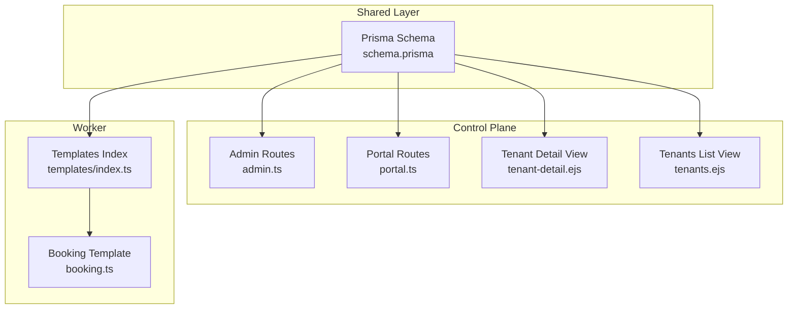
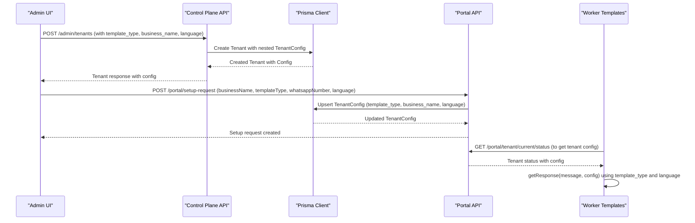
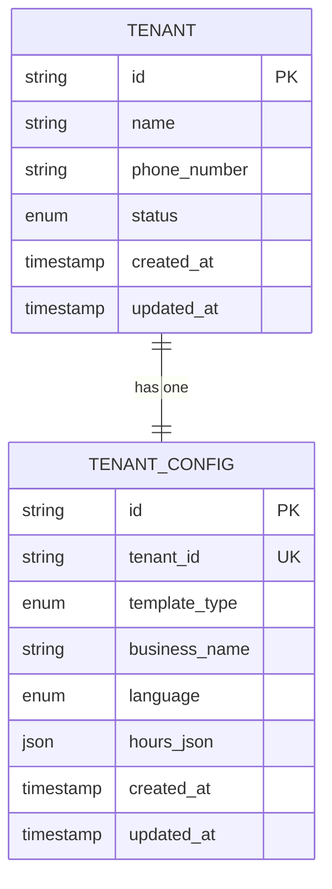
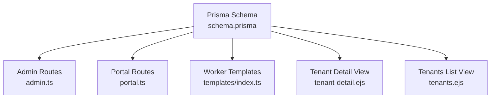

# TenantConfig Entity

<cite>
**Referenced Files in This Document**
- [schema.prisma](file://packages/shared/src/prisma/schema.prisma)
- [admin.ts](file://apps/control-plane/src/routes/admin.ts)
- [portal.ts](file://apps/control-plane/src/routes/portal.ts)
- [tenant-detail.ejs](file://apps/control-plane/src/views/tenant-detail.ejs)
- [tenants.ejs](file://apps/control-plane/src/views/tenants.ejs)
- [index.ts](file://apps/worker/src/templates/index.ts)
- [booking.ts](file://apps/worker/src/templates/booking.ts)
- [index.ts (types)](file://packages/shared/src/types/index.ts)
- [page.tsx](file://apps/web/src/app/(marketing)/templates/page.tsx)
</cite>

## Table of Contents
1. [Introduction](#introduction)
2. [Project Structure](#project-structure)
3. [Core Components](#core-components)
4. [Architecture Overview](#architecture-overview)
5. [Detailed Component Analysis](#detailed-component-analysis)
6. [Dependency Analysis](#dependency-analysis)
7. [Performance Considerations](#performance-considerations)
8. [Troubleshooting Guide](#troubleshooting-guide)
9. [Conclusion](#conclusion)

## Introduction
This document provides comprehensive documentation for the TenantConfig entity, which manages business configuration for each tenant in the system. It covers the template_type enum values (BOOKING, ECOMMERCE, SUPPORT) and their specific use cases, the business_name field for company identification, language settings (SW, EN) for localization, and the hours_json field for business operating hours configuration. It also explains the one-to-one relationship with Tenant and cascade deletion behavior, along with practical examples of configuration for different business types and language preferences.

## Project Structure
The TenantConfig entity is defined in the shared Prisma schema and is used across the control plane, portal, and worker applications. The configuration is created during tenant onboarding and consumed by the messaging templates to provide localized responses.

**Diagram sources**
- [schema.prisma](file://packages/shared/src/prisma/schema.prisma#L78-L90)
- [admin.ts](file://apps/control-plane/src/routes/admin.ts#L104-L139)
- [portal.ts](file://apps/control-plane/src/routes/portal.ts#L105-L119)
- [tenant-detail.ejs](file://apps/control-plane/src/views/tenant-detail.ejs#L45-L71)
- [tenants.ejs](file://apps/control-plane/src/views/tenants.ejs#L47-L74)
- [index.ts](file://apps/worker/src/templates/index.ts#L1-L70)
- [booking.ts](file://apps/worker/src/templates/booking.ts#L1-L22)

**Section sources**
- [schema.prisma](file://packages/shared/src/prisma/schema.prisma#L78-L90)
- [admin.ts](file://apps/control-plane/src/routes/admin.ts#L104-L139)
- [portal.ts](file://apps/control-plane/src/routes/portal.ts#L105-L119)
- [tenant-detail.ejs](file://apps/control-plane/src/views/tenant-detail.ejs#L45-L71)
- [tenants.ejs](file://apps/control-plane/src/views/tenants.ejs#L47-L74)
- [index.ts](file://apps/worker/src/templates/index.ts#L1-L70)
- [booking.ts](file://apps/worker/src/templates/booking.ts#L1-L22)

## Core Components
- TenantConfig model: Defines the business configuration for each tenant, including template type, business name, language preference, and optional operating hours.
- Enums: TemplateType (BOOKING, ECOMMERCE, SUPPORT) and Language (SW, EN).
- One-to-one relationship with Tenant via tenant_id and cascade deletion behavior.
- Integration with messaging templates for localized responses.

**Section sources**
- [schema.prisma](file://packages/shared/src/prisma/schema.prisma#L18-L27)
- [schema.prisma](file://packages/shared/src/prisma/schema.prisma#L78-L90)

## Architecture Overview
The TenantConfig entity is part of the shared Prisma schema and is accessed by both the control plane and portal APIs. During tenant creation, the TenantConfig is created alongside the Tenant. The portal API supports updating the TenantConfig via upsert operations. The worker application consumes the TenantConfig to generate localized responses based on the selected template type and language.

**Diagram sources**
- [admin.ts](file://apps/control-plane/src/routes/admin.ts#L104-L139)
- [portal.ts](file://apps/control-plane/src/routes/portal.ts#L105-L119)
- [index.ts](file://apps/worker/src/templates/index.ts#L9-L23)

## Detailed Component Analysis

### TenantConfig Model Definition
The TenantConfig model defines the business configuration for each tenant:
- id: Unique identifier for the configuration record.
- tenant_id: Unique foreign key linking to the Tenant model.
- tenant: Relation to the Tenant model with cascade deletion.
- template_type: Enum selecting the business template (BOOKING, ECOMMERCE, SUPPORT).
- business_name: String identifying the company or business.
- language: Enum selecting the localization language (SW, EN).
- hours_json: Optional JSON field for storing business operating hours.
- created_at and updated_at: Timestamps for record lifecycle.

**Diagram sources**
- [schema.prisma](file://packages/shared/src/prisma/schema.prisma#L78-L90)
- [schema.prisma](file://packages/shared/src/prisma/schema.prisma#L60-L76)

**Section sources**
- [schema.prisma](file://packages/shared/src/prisma/schema.prisma#L78-L90)

### Template Types and Use Cases
The template_type enum determines the business domain and response behavior:
- BOOKING: Ideal for salons, clinics, and service businesses. Handles appointment scheduling, service selection, and confirmation messages.
- ECOMMERCE: Suitable for retail and product-based businesses. Manages product catalogs, price inquiries, order placement, and delivery tracking.
- SUPPORT: Designed for customer support scenarios. Provides FAQ responses, issue tracking, escalation handling, and working hours information.

These use cases are reflected in the marketing templates page and the worker response logic.

**Section sources**
- [schema.prisma](file://packages/shared/src/prisma/schema.prisma#L18-L22)
- [page.tsx](file://apps/web/src/app/(marketing)/templates/page.tsx#L3-L22)
- [index.ts](file://apps/worker/src/templates/index.ts#L13-L23)

### Business Name Field
The business_name field serves as the primary identifier for the company or business within the TenantConfig. It is used in messaging templates to personalize welcome messages and contextual responses, ensuring a tailored experience for customers.

**Section sources**
- [schema.prisma](file://packages/shared/src/prisma/schema.prisma#L83-L85)
- [index.ts](file://apps/worker/src/templates/index.ts#L14-L15)
- [booking.ts](file://apps/worker/src/templates/booking.ts#L10-L13)

### Language Settings (SW, EN)
The language field controls localization:
- SW: Swahili, used for Swahili-speaking regions.
- EN: English, used for English-speaking regions.

The worker templates use this setting to generate appropriate localized responses, ensuring communication aligns with the tenant's preferred language.

**Section sources**
- [schema.prisma](file://packages/shared/src/prisma/schema.prisma#L24-L27)
- [index.ts](file://apps/worker/src/templates/index.ts#L4-L6)
- [booking.ts](file://apps/worker/src/templates/booking.ts#L9-L14)

### Hours JSON Field
The hours_json field is an optional JSON structure for storing business operating hours. While the field is defined in the schema, its specific structure and usage are not explicitly defined in the provided code. It is intended to support flexible hour configurations that can be processed by the worker templates or other business logic.

**Section sources**
- [schema.prisma](file://packages/shared/src/prisma/schema.prisma#L85-L85)

### One-to-One Relationship with Tenant and Cascade Deletion
The TenantConfig maintains a one-to-one relationship with Tenant:
- tenant_id is unique, ensuring each Tenant has at most one TenantConfig.
- The relation includes onDelete: Cascade, meaning deleting a Tenant will automatically delete the associated TenantConfig.

This ensures data consistency and prevents orphaned configuration records.

**Section sources**
- [schema.prisma](file://packages/shared/src/prisma/schema.prisma#L80-L81)
- [schema.prisma](file://packages/shared/src/prisma/schema.prisma#L68-L68)

### Configuration Examples

#### Example 1: Booking Business (Swahili)
- template_type: BOOKING
- business_name: "Spa Zetu"
- language: SW
- Use case: Automatically handle appointment bookings with Swahili responses.

**Section sources**
- [index.ts](file://apps/worker/src/templates/index.ts#L14-L15)
- [booking.ts](file://apps/worker/src/templates/booking.ts#L9-L13)

#### Example 2: E-commerce Business (English)
- template_type: ECOMMERCE
- business_name: "Tech Gadgets"
- language: EN
- Use case: Respond to product price inquiries and order requests in English.

**Section sources**
- [index.ts](file://apps/worker/src/templates/index.ts#L16-L17)

#### Example 3: Support Business (Swahili)
- template_type: SUPPORT
- business_name: "Msaada Yetu"
- language: SW
- Use case: Provide customer support with Swahili responses and working hours information.

**Section sources**
- [index.ts](file://apps/worker/src/templates/index.ts#L18-L19)
- [index.ts](file://apps/worker/src/templates/index.ts#L58-L62)

### API Integration Details

#### Creating a Tenant with TenantConfig
The control plane creates a Tenant and its associated TenantConfig in a single operation, including template_type, business_name, and language.

**Section sources**
- [admin.ts](file://apps/control-plane/src/routes/admin.ts#L104-L139)

#### Updating TenantConfig via Portal
The portal API supports updating the TenantConfig using an upsert operation, allowing changes to template_type, business_name, and language without requiring explicit deletion and recreation.

**Section sources**
- [portal.ts](file://apps/control-plane/src/routes/portal.ts#L105-L119)

#### Consuming TenantConfig in Worker Templates
The worker templates consume the TenantConfig to generate localized responses based on the selected template_type and language, demonstrating how the configuration influences runtime behavior.

**Section sources**
- [index.ts](file://apps/worker/src/templates/index.ts#L9-L23)
- [booking.ts](file://apps/worker/src/templates/booking.ts#L1-L22)

## Dependency Analysis
The TenantConfig entity depends on the shared Prisma schema and is consumed by multiple components:
- Control plane routes for creation and retrieval.
- Portal routes for updates and status queries.
- Worker templates for localized messaging.

**Diagram sources**
- [schema.prisma](file://packages/shared/src/prisma/schema.prisma#L78-L90)
- [admin.ts](file://apps/control-plane/src/routes/admin.ts#L104-L139)
- [portal.ts](file://apps/control-plane/src/routes/portal.ts#L105-L119)
- [index.ts](file://apps/worker/src/templates/index.ts#L1-L70)
- [tenant-detail.ejs](file://apps/control-plane/src/views/tenant-detail.ejs#L45-L71)
- [tenants.ejs](file://apps/control-plane/src/views/tenants.ejs#L47-L74)

**Section sources**
- [schema.prisma](file://packages/shared/src/prisma/schema.prisma#L78-L90)
- [admin.ts](file://apps/control-plane/src/routes/admin.ts#L104-L139)
- [portal.ts](file://apps/control-plane/src/routes/portal.ts#L105-L119)
- [index.ts](file://apps/worker/src/templates/index.ts#L1-L70)
- [tenant-detail.ejs](file://apps/control-plane/src/views/tenant-detail.ejs#L45-L71)
- [tenants.ejs](file://apps/control-plane/src/views/tenants.ejs#L47-L74)

## Performance Considerations
- TenantConfig is included in control plane tenant queries, ensuring efficient access to configuration data alongside tenant details.
- The upsert operation in the portal API minimizes database round trips when updating configuration.
- Worker templates rely on simple string matching and conditional logic, keeping response generation lightweight.

[No sources needed since this section provides general guidance]

## Troubleshooting Guide
- If a tenant lacks a TenantConfig, ensure the creation route includes the nested config creation or the portal upsert is executed.
- Verify that the template_type and language values match the supported enums to avoid unexpected behavior.
- Confirm that the tenant_id uniqueness constraint is respected to prevent multiple TenantConfig records for a single tenant.

**Section sources**
- [admin.ts](file://apps/control-plane/src/routes/admin.ts#L104-L139)
- [portal.ts](file://apps/control-plane/src/routes/portal.ts#L105-L119)
- [schema.prisma](file://packages/shared/src/prisma/schema.prisma#L80-L81)

## Conclusion
The TenantConfig entity centralizes business configuration for each tenant, enabling flexible and localized automation across booking, e-commerce, and support domains. Its one-to-one relationship with Tenant and cascade deletion behavior ensure data integrity, while the integration with control plane and portal APIs provides seamless configuration management. By leveraging template_type and language settings, the system delivers tailored experiences aligned with tenant preferences and regional languages.