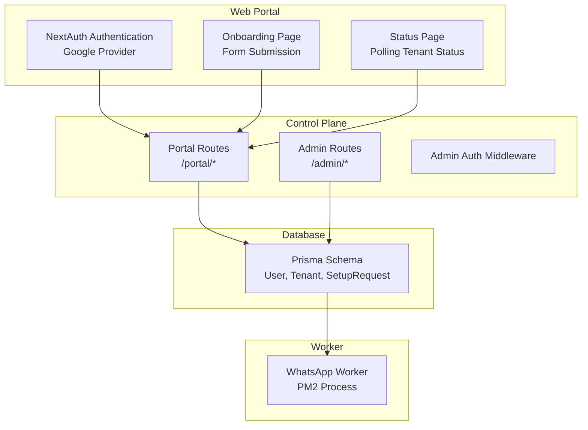
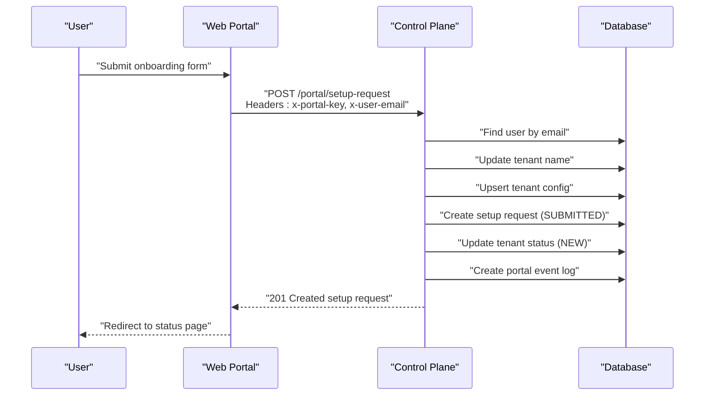
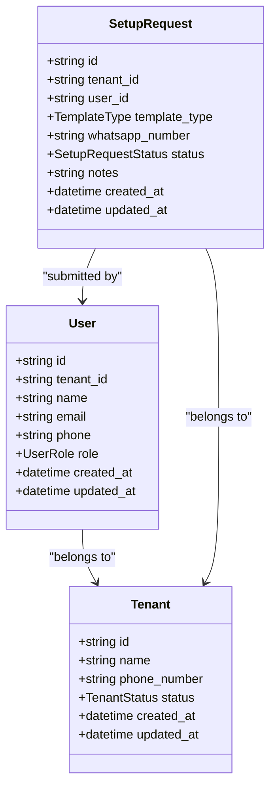
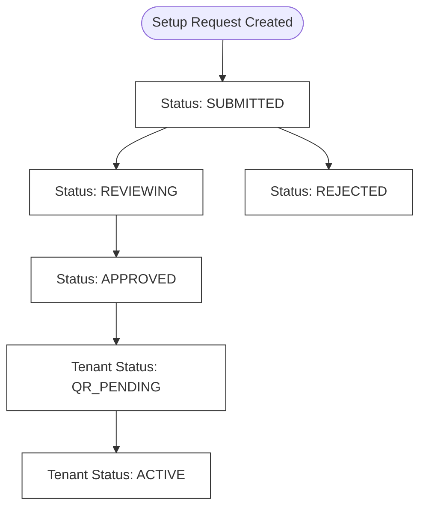
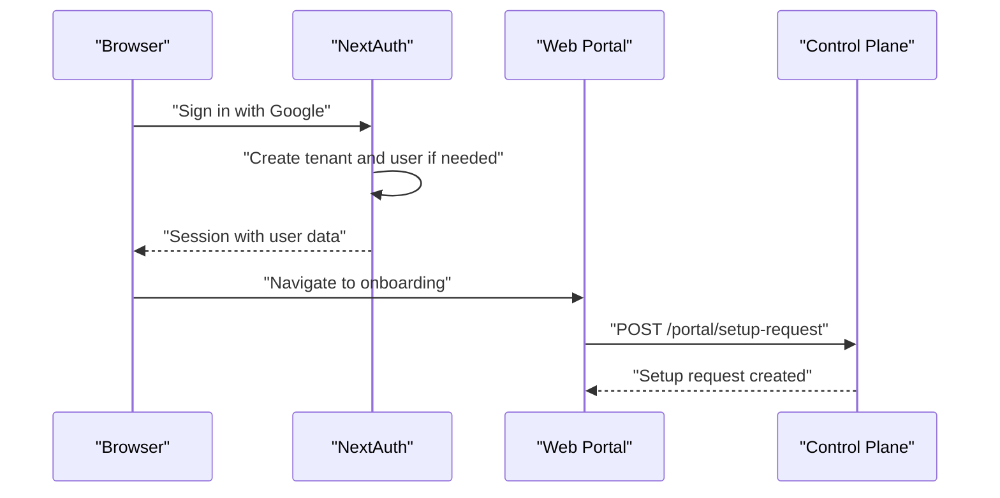
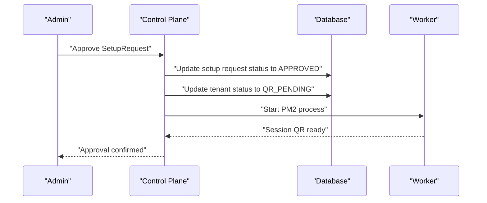
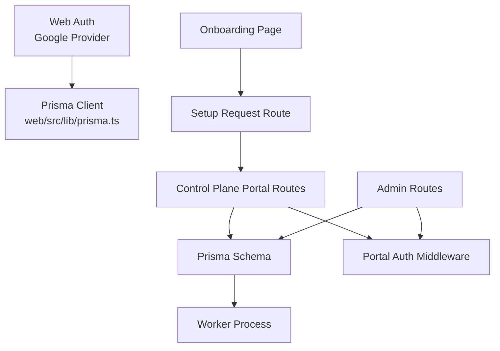

# User and SetupRequest Entities

<cite>
**Referenced Files in This Document**
- [schema.prisma](file://packages/shared/src/prisma/schema.prisma)
- [auth.ts](file://apps/web/src/lib/auth.ts)
- [prisma.ts](file://apps/web/src/lib/prisma.ts)
- [portal.ts](file://apps/control-plane/src/routes/portal.ts)
- [admin.ts](file://apps/control-plane/src/routes/admin.ts)
- [auth.ts](file://apps/control-plane/src/middleware/auth.ts)
- [setup-request/route.ts](file://apps/web/src/app/api/portal/setup-request/route.ts)
- [me/route.ts](file://apps/web/src/app/api/portal/me/route.ts)
- [tenant/current/status/route.ts](file://apps/web/src/app/api/portal/tenant/current/status/route.ts)
- [onboarding/page.tsx](file://apps/web/src/app/(portal)/app/onboarding/page.tsx)
- [status/page.tsx](file://apps/web/src/app/(portal)/app/status/page.tsx)
- [index.ts](file://packages/shared/src/types/index.ts)
</cite>

## Table of Contents
1. [Introduction](#introduction)
2. [Project Structure](#project-structure)
3. [Core Components](#core-components)
4. [Architecture Overview](#architecture-overview)
5. [Detailed Component Analysis](#detailed-component-analysis)
6. [Dependency Analysis](#dependency-analysis)
7. [Performance Considerations](#performance-considerations)
8. [Troubleshooting Guide](#troubleshooting-guide)
9. [Conclusion](#conclusion)

## Introduction
This document provides comprehensive documentation for the User and SetupRequest entities that power the authentication and tenant setup workflows. It explains user roles (OWNER, STAFF, ADMIN) and their permission levels, details the SetupRequestStatus enum (SUBMITTED, REVIEWING, APPROVED, ACTIVE, REJECTED) and its workflow transitions, and covers the relationships among User, Tenant, and SetupRequest. The document also outlines the complete setup request process from submission through approval to tenant activation, with practical examples for user management, role assignments, and setup request workflows.

## Project Structure
The system consists of:
- Frontend portal (Next.js) for user onboarding and status tracking
- Control plane (Express) for administrative actions and setup request management
- Shared Prisma schema defining entities and enums
- Worker processes for per-tenant WhatsApp automation

**Diagram sources**
- [auth.ts](file://apps/web/src/lib/auth.ts#L1-L76)
- [portal.ts](file://apps/control-plane/src/routes/portal.ts#L1-L246)
- [admin.ts](file://apps/control-plane/src/routes/admin.ts#L1-L528)
- [schema.prisma](file://packages/shared/src/prisma/schema.prisma#L133-L164)

**Section sources**
- [auth.ts](file://apps/web/src/lib/auth.ts#L1-L76)
- [portal.ts](file://apps/control-plane/src/routes/portal.ts#L1-L246)
- [admin.ts](file://apps/control-plane/src/routes/admin.ts#L1-L528)
- [schema.prisma](file://packages/shared/src/prisma/schema.prisma#L133-L164)

## Core Components
This section documents the User, SetupRequest, and related entities, including their attributes, relationships, and constraints.

- User entity
  - Unique identifier and optional tenant association
  - Fields: id, tenant_id, name, email, phone, role, timestamps
  - Role defaults to OWNER for new users
  - Relationship: belongs to Tenant (optional), has many SetupRequests and PortalEventLogs

- SetupRequest entity
  - Links a tenant and user to a setup request
  - Fields: id, tenant_id, user_id, template_type, whatsapp_number, status, notes, timestamps
  - Status defaults to SUBMITTED
  - Relationship: belongs to Tenant and User, triggers tenant status changes

- Tenant entity
  - Represents a multi-tenant business unit
  - Fields: id, name, phone_number, status, timestamps
  - Status enum includes NEW, QR_PENDING, ACTIVE, PAUSED, ERROR
  - Relationships: optional User (owner), TenantConfig, WhatsAppSession, WorkerProcess, SetupRequests

- Enums
  - UserRole: OWNER, STAFF, ADMIN
  - SetupRequestStatus: SUBMITTED, REVIEWING, APPROVED, ACTIVE, REJECTED
  - TenantStatus: NEW, QR_PENDING, ACTIVE, PAUSED, ERROR

**Section sources**
- [schema.prisma](file://packages/shared/src/prisma/schema.prisma#L46-L58)
- [schema.prisma](file://packages/shared/src/prisma/schema.prisma#L133-L164)

## Architecture Overview
The authentication and setup workflow spans the web portal and control plane:

- Authentication flow
  - NextAuth with Google provider creates a User and associated Tenant on first sign-in
  - Session callback enriches session with user role, tenantId, and setup request presence

- Setup request flow
  - User submits onboarding form via web portal
  - Web portal forwards request to control plane with portal internal key and user email
  - Control plane validates portal key, resolves user by email, updates tenant, upserts config, creates SetupRequest, sets tenant status, and logs events
  - Admin reviews and approves SetupRequest, which starts the worker and advances tenant status

**Diagram sources**
- [setup-request/route.ts](file://apps/web/src/app/api/portal/setup-request/route.ts#L8-L39)
- [portal.ts](file://apps/control-plane/src/routes/portal.ts#L85-L153)

**Section sources**
- [auth.ts](file://apps/web/src/lib/auth.ts#L14-L70)
- [setup-request/route.ts](file://apps/web/src/app/api/portal/setup-request/route.ts#L8-L39)
- [portal.ts](file://apps/control-plane/src/routes/portal.ts#L85-L153)

## Detailed Component Analysis

### User Entity
The User entity defines ownership and permissions within the system.

- Creation and linking
  - First-time sign-in via Google provider creates a Tenant and User
  - User role defaults to OWNER
  - Session enrichment includes role, tenantId, and setup request presence

- Permissions and roles
  - OWNER: primary account holder with full access to tenant resources
  - STAFF: limited access for operational tasks
  - ADMIN: elevated privileges for administrative functions

**Diagram sources**
- [schema.prisma](file://packages/shared/src/prisma/schema.prisma#L133-L164)

**Section sources**
- [auth.ts](file://apps/web/src/lib/auth.ts#L22-L43)
- [schema.prisma](file://packages/shared/src/prisma/schema.prisma#L133-L148)

### SetupRequest Entity and Workflow
SetupRequest tracks the lifecycle of tenant setup from submission to activation.

- Status transitions
  - SUBMITTED: initial state after user submission
  - REVIEWING: internal review phase (not directly manipulated by user)
  - APPROVED: admin approval; triggers worker start and QR generation
  - ACTIVE: worker connected and processing messages
  - REJECTED: admin rejection with notes

- Submission process
  - Web portal receives form data and forwards to control plane
  - Control plane updates tenant name, upserts tenant config, creates SetupRequest with SUBMITTED status, sets tenant status to NEW, and logs event

- Approval and activation
  - Admin approves SetupRequest, updating status to APPROVED and tenant status to QR_PENDING
  - Worker process is started via PM2; tenant status advances to QR_PENDING while QR is generated
  - Once QR is scanned and session connects, tenant status becomes ACTIVE

**Diagram sources**
- [schema.prisma](file://packages/shared/src/prisma/schema.prisma#L52-L58)
- [portal.ts](file://apps/control-plane/src/routes/portal.ts#L121-L137)
- [admin.ts](file://apps/control-plane/src/routes/admin.ts#L419-L489)

**Section sources**
- [portal.ts](file://apps/control-plane/src/routes/portal.ts#L85-L153)
- [admin.ts](file://apps/control-plane/src/routes/admin.ts#L419-L489)
- [schema.prisma](file://packages/shared/src/prisma/schema.prisma#L52-L58)

### Authentication and Authorization
The system uses NextAuth with Google OAuth for user authentication and session management.

- Sign-in flow
  - Google provider authenticates user
  - If user does not exist, create Tenant (NEW status) and User (OWNER role)
  - Enrich session with user metadata for portal access

- Portal access
  - Web portal routes call control plane endpoints with portal internal key and user email
  - Control plane validates portal key and resolves user to enforce access

- Admin access
  - Admin routes use basic auth or password query parameter for protection

**Diagram sources**
- [auth.ts](file://apps/web/src/lib/auth.ts#L14-L70)
- [setup-request/route.ts](file://apps/web/src/app/api/portal/setup-request/route.ts#L8-L39)
- [portal.ts](file://apps/control-plane/src/routes/portal.ts#L12-L25)

**Section sources**
- [auth.ts](file://apps/web/src/lib/auth.ts#L14-L70)
- [setup-request/route.ts](file://apps/web/src/app/api/portal/setup-request/route.ts#L8-L39)
- [portal.ts](file://apps/control-plane/src/routes/portal.ts#L12-L25)

### User Management and Role Assignments
- Role assignment
  - New users receive OWNER role automatically during sign-in
  - Additional roles (STAFF, ADMIN) are defined in the schema for future expansion

- Session enrichment
  - Session callback attaches user role, tenantId, and setup request presence to the session object

- Practical examples
  - Assigning roles: Extend the sign-in callback to set role based on business logic
  - Restricting access: Use role checks in portal routes before performing sensitive operations

**Section sources**
- [auth.ts](file://apps/web/src/lib/auth.ts#L34-L43)
- [schema.prisma](file://packages/shared/src/prisma/schema.prisma#L46-L50)

### Setup Request Workflows
- Submission
  - User fills onboarding form with business details, template type, WhatsApp number, and language
  - Form posts to web portal endpoint, which forwards to control plane

- Review and approval
  - Admin reviews SetupRequest in the admin dashboard
  - Approve action updates status to APPROVED, starts worker, and advances tenant status to QR_PENDING

- Activation
  - User scans QR code to connect WhatsApp
  - Tenant status transitions to ACTIVE upon successful connection

- Status polling
  - Web portal polls tenant status endpoint to reflect real-time progress

**Diagram sources**
- [admin.ts](file://apps/control-plane/src/routes/admin.ts#L419-L489)
- [portal.ts](file://apps/control-plane/src/routes/portal.ts#L420-L445)

**Section sources**
- [onboarding/page.tsx](file://apps/web/src/app/(portal)/app/onboarding/page.tsx#L19-L38)
- [status/page.tsx](file://apps/web/src/app/(portal)/app/status/page.tsx#L28-L44)
- [admin.ts](file://apps/control-plane/src/routes/admin.ts#L419-L489)

## Dependency Analysis
The following diagram shows key dependencies among components involved in user authentication and setup request workflows.

**Diagram sources**
- [auth.ts](file://apps/web/src/lib/auth.ts#L1-L76)
- [prisma.ts](file://apps/web/src/lib/prisma.ts#L1-L10)
- [setup-request/route.ts](file://apps/web/src/app/api/portal/setup-request/route.ts#L1-L40)
- [portal.ts](file://apps/control-plane/src/routes/portal.ts#L1-L246)
- [admin.ts](file://apps/control-plane/src/routes/admin.ts#L1-L528)
- [schema.prisma](file://packages/shared/src/prisma/schema.prisma#L133-L164)

**Section sources**
- [prisma.ts](file://apps/web/src/lib/prisma.ts#L1-L10)
- [portal.ts](file://apps/control-plane/src/routes/portal.ts#L12-L25)
- [admin.ts](file://apps/control-plane/src/routes/admin.ts#L14-L29)

## Performance Considerations
- Database queries
  - Use selective includes and ordering to minimize payload sizes (e.g., fetching latest setup request by created_at desc)
- Rate limiting
  - Worker enforces rate limits to prevent overload; configure thresholds appropriately
- Heartbeat monitoring
  - Stale worker detection prevents resource leaks; adjust stale threshold based on environment
- Caching
  - Consider caching frequently accessed tenant and user data in session storage to reduce database load

[No sources needed since this section provides general guidance]

## Troubleshooting Guide
- Unauthorized access
  - Ensure portal internal key is configured and matches in both web portal and control plane
  - Verify user email header is present when calling control plane endpoints

- Setup request creation failures
  - Check that user exists and is linked to a tenant
  - Confirm tenant name and config upsert succeed
  - Validate portal event log creation

- Approval and worker start issues
  - Verify PM2 is installed and accessible
  - Check worker process status updates and tenant status transitions
  - Review logs for detailed error messages

- Status polling
  - Ensure status endpoint is polled at appropriate intervals
  - Handle network errors gracefully and retry with backoff

**Section sources**
- [portal.ts](file://apps/control-plane/src/routes/portal.ts#L12-L25)
- [setup-request/route.ts](file://apps/web/src/app/api/portal/setup-request/route.ts#L18-L39)
- [admin.ts](file://apps/control-plane/src/routes/admin.ts#L447-L473)

## Conclusion
The User and SetupRequest entities form the backbone of the authentication and tenant setup workflows. Users are authenticated via Google OAuth, automatically linked to a Tenant, and granted OWNER role by default. SetupRequest captures the end-to-end lifecycle from submission to activation, with clear status transitions and administrative controls. The architecture ensures secure access through portal and admin authentication layers, while the control plane manages tenant lifecycle, worker processes, and event logging. By following the documented workflows and troubleshooting steps, administrators and developers can effectively manage users, roles, and setup requests across tenants.