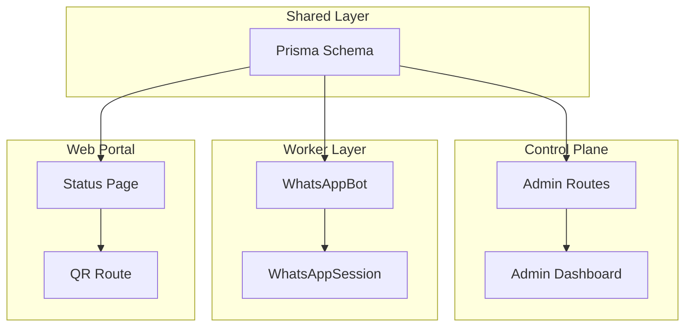
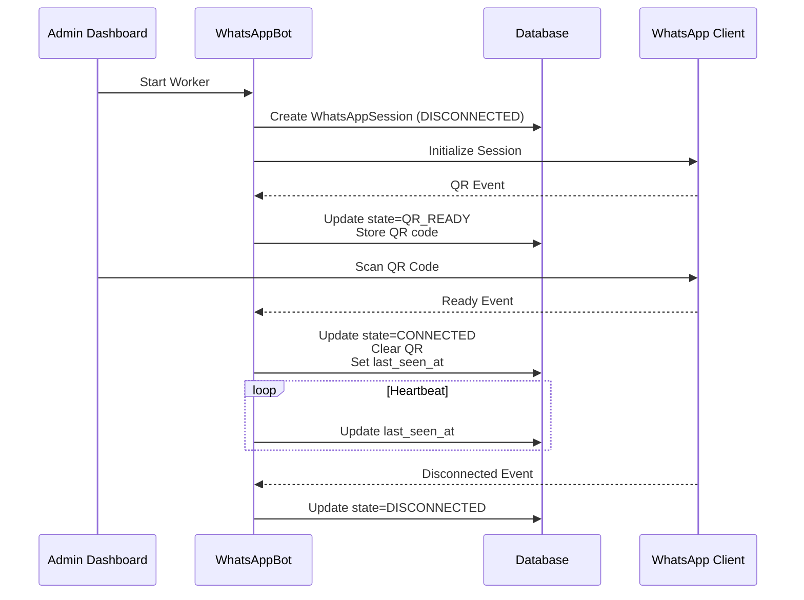
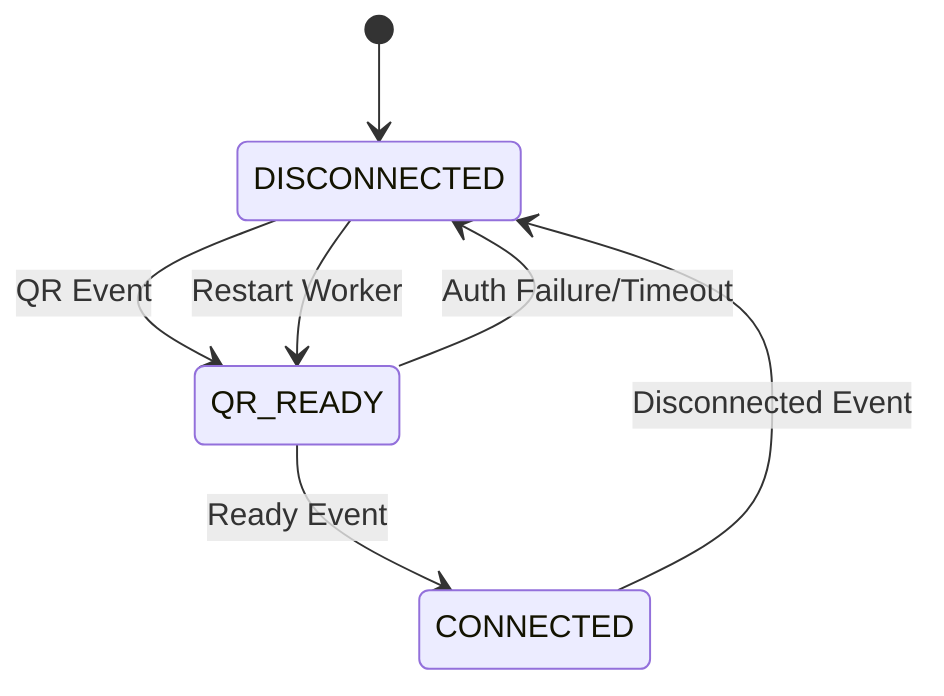
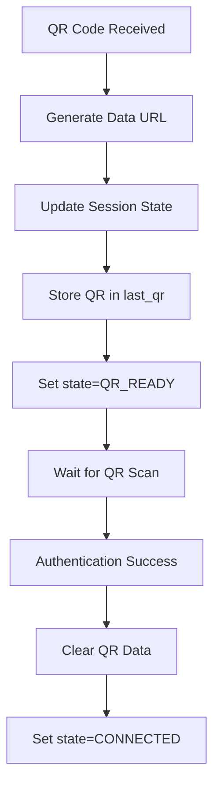
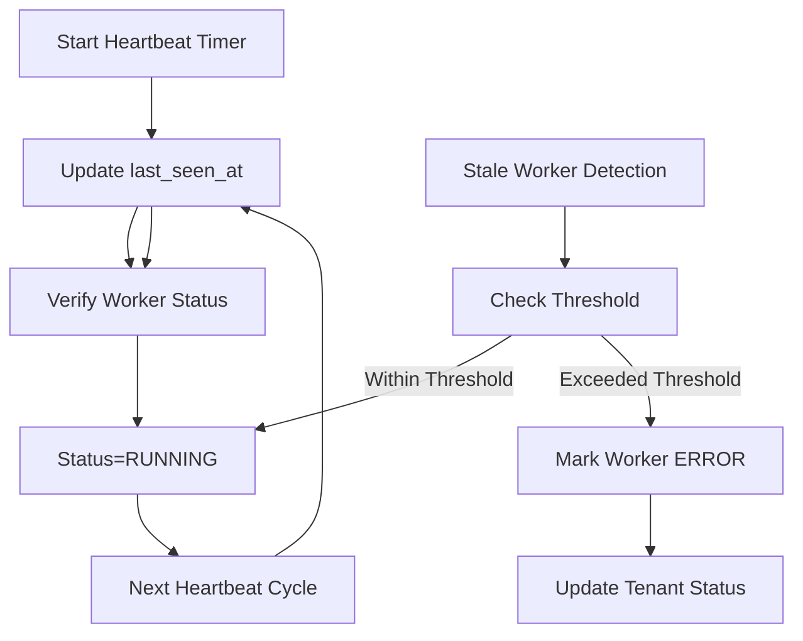
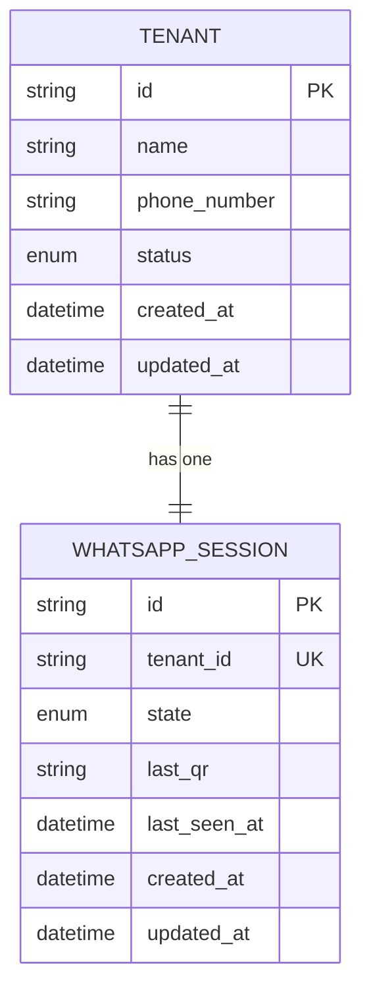
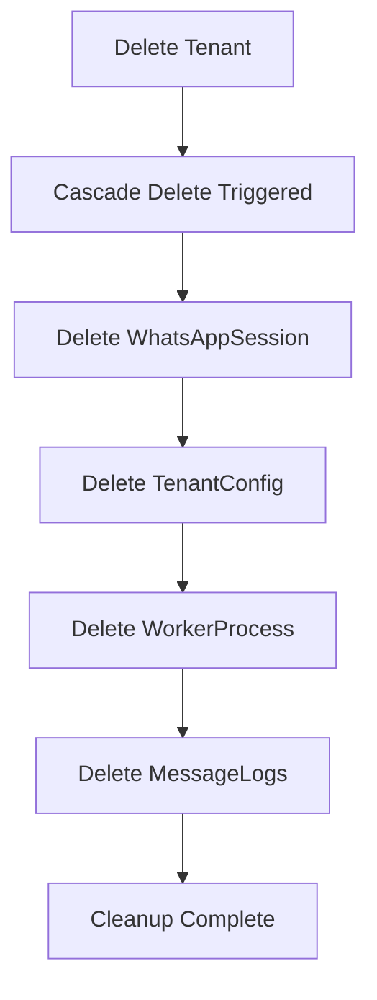
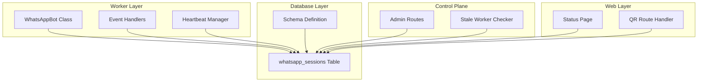

# WhatsAppSession Entity

<cite>
**Referenced Files in This Document**
- [schema.prisma](file://packages/shared/src/prisma/schema.prisma)
- [bot.ts](file://apps/worker/src/bot.ts)
- [admin.ts](file://apps/control-plane/src/routes/admin.ts)
- [page.tsx](file://apps/web/src/app/(portal)/app/status/page.tsx)
- [route.ts](file://apps/web/src/app/api/portal/tenant/current/status/route.ts)
- [route.ts](file://apps/web/src/app/api/portal/tenant/current/qr/route.ts)
- [README.md](file://README.md)
</cite>

## Table of Contents
1. [Introduction](#introduction)
2. [Project Structure](#project-structure)
3. [Core Components](#core-components)
4. [Architecture Overview](#architecture-overview)
5. [Detailed Component Analysis](#detailed-component-analysis)
6. [Dependency Analysis](#dependency-analysis)
7. [Performance Considerations](#performance-considerations)
8. [Troubleshooting Guide](#troubleshooting-guide)
9. [Conclusion](#conclusion)

## Introduction
This document provides comprehensive documentation for the WhatsAppSession entity that manages WhatsApp Web connection state within a multi-tenant architecture. The WhatsAppSession serves as the authoritative source of truth for a tenant's WhatsApp connection status, QR code availability, and heartbeat monitoring. It maintains a one-to-one relationship with the Tenant entity and automatically cleans up when a tenant is deleted.

## Project Structure
The WhatsAppSession entity is part of a larger multi-tenant system composed of:
- Control Plane: Admin API and dashboard for tenant management
- Worker: Per-tenant WhatsApp bot process using whatsapp-web.js
- Shared: Common Prisma schema and utilities
- Web Portal: Frontend interfaces for status and QR code display

**Diagram sources**
- [schema.prisma](file://packages/shared/src/prisma/schema.prisma#L92-L103)
- [bot.ts](file://apps/worker/src/bot.ts#L12-L75)
- [admin.ts](file://apps/control-plane/src/routes/admin.ts#L1-L528)

**Section sources**
- [README.md](file://README.md#L116-L129)

## Core Components
The WhatsAppSession entity consists of several key fields and relationships:

### Primary Fields
- **id**: Unique identifier for the session
- **tenant_id**: Foreign key linking to Tenant (unique constraint)
- **state**: Enum representing connection state (DISCONNECTED, QR_READY, CONNECTED)
- **last_qr**: Base64-encoded QR code data URL for authentication
- **last_seen_at**: Timestamp for heartbeat monitoring
- **created_at/updated_at**: Automatic timestamps for tracking

### Relationship with Tenant
The WhatsAppSession maintains a one-to-one relationship with Tenant through the tenant_id foreign key. This relationship is enforced with CASCADE deletion, ensuring automatic cleanup when a tenant is removed.

### Session States
The entity defines three distinct states:
- **DISCONNECTED**: Initial state or after disconnection
- **QR_READY**: Waiting for QR code authentication
- **CONNECTED**: Active connection with WhatsApp Web

**Section sources**
- [schema.prisma](file://packages/shared/src/prisma/schema.prisma#L92-L103)

## Architecture Overview
The WhatsAppSession lifecycle spans multiple components working together to manage the complete connection flow from initialization to active operation.

**Diagram sources**
- [bot.ts](file://apps/worker/src/bot.ts#L77-L226)
- [admin.ts](file://apps/control-plane/src/routes/admin.ts#L174-L230)

## Detailed Component Analysis

### Session State Management
The WhatsAppSession tracks connection state through three distinct phases:

**State Transitions Implementation:**
- **QR Event**: Updates state to QR_READY and stores QR code as base64 data URL
- **Ready Event**: Updates state to CONNECTED, clears QR data, sets last_seen_at
- **Disconnected Event**: Updates state to DISCONNECTED
- **Auth Failure**: Triggers error state propagation

**Section sources**
- [bot.ts](file://apps/worker/src/bot.ts#L78-L151)
- [bot.ts](file://apps/worker/src/bot.ts#L185-L225)

### QR Code Management
The last_qr field stores QR codes as base64 data URLs for frontend display:

**Section sources**
- [bot.ts](file://apps/worker/src/bot.ts#L78-L96)

### Heartbeat Monitoring System
The last_seen_at field enables continuous heartbeat monitoring:

**Section sources**
- [bot.ts](file://apps/worker/src/bot.ts#L333-L367)
- [admin.ts](file://apps/control-plane/src/routes/admin.ts#L30-L80)

### One-to-One Relationship with Tenant
The WhatsAppSession maintains a strict one-to-one relationship with Tenant:

**Section sources**
- [schema.prisma](file://packages/shared/src/prisma/schema.prisma#L60-L76)
- [schema.prisma](file://packages/shared/src/prisma/schema.prisma#L92-L103)

### Automatic Cleanup on Tenant Deletion
The CASCADE deletion policy ensures complete cleanup when tenants are removed:

**Section sources**
- [schema.prisma](file://packages/shared/src/prisma/schema.prisma#L79-L90)
- [schema.prisma](file://packages/shared/src/prisma/schema.prisma#L92-L103)

## Dependency Analysis
The WhatsAppSession entity interacts with multiple components across the system:

**Diagram sources**
- [schema.prisma](file://packages/shared/src/prisma/schema.prisma#L92-L103)
- [bot.ts](file://apps/worker/src/bot.ts#L12-L411)
- [admin.ts](file://apps/control-plane/src/routes/admin.ts#L30-L80)

**Section sources**
- [schema.prisma](file://packages/shared/src/prisma/schema.prisma#L92-L103)
- [bot.ts](file://apps/worker/src/bot.ts#L12-L411)
- [admin.ts](file://apps/control-plane/src/routes/admin.ts#L30-L80)

## Performance Considerations
The WhatsAppSession implementation includes several performance and reliability features:

### Heartbeat Interval Configuration
- Default interval: 30 seconds (configurable via HEARTBEAT_INTERVAL_MS)
- Ensures real-time monitoring of worker health
- Reduces database load through efficient polling

### Stale Worker Detection
- Threshold: 2 minutes (configurable via STALE_THRESHOLD_MINUTES)
- Periodic cleanup prevents resource leaks
- Automatic error propagation to maintain system health

### Database Optimization
- Indexes on tenant_id for efficient lookups
- Efficient state updates minimize write operations
- Connection pooling reduces overhead

## Troubleshooting Guide

### Common Session Issues

#### QR Code Not Appearing
**Symptoms**: QR_READY state but no QR displayed
**Causes**:
- Worker not started or crashed
- Database connectivity issues
- Puppeteer/Chromium installation problems

**Solutions**:
1. Verify worker status: `pm2 list`
2. Check worker logs: `pm2 logs worker-<tenant-id>`
3. Restart worker: `/admin/tenants/:id/worker/restart`
4. Verify Chromium installation: `which chromium-browser`

#### Authentication Failures
**Symptoms**: Auth failure events and ERROR status
**Causes**:
- Corrupted session files
- Network connectivity issues
- WhatsApp Web restrictions

**Solutions**:
1. Force restart worker: `/admin/tenants/:id/worker/force-restart`
2. Clear session files: Remove contents of `sessions/<tenant-id>/`
3. Check network connectivity
4. Verify WhatsApp Web accessibility

#### Connection Drops
**Symptoms**: DISCONNECTED state with reconnection attempts
**Causes**:
- Network instability
- Heartbeat timeout
- Session expiration

**Solutions**:
1. Monitor heartbeat: Check last_seen_at updates
2. Verify network stability
3. Adjust HEARTBEAT_INTERVAL_MS if needed
4. Check for stale worker detection

#### Stale Worker Detection
**Symptoms**: Workers marked as STALE with ERROR status
**Causes**:
- Heartbeat failures exceeding threshold
- Database connectivity issues
- Worker process crashes

**Solutions**:
1. Force restart workers: Use admin interface
2. Check database connectivity
3. Review worker logs for errors
4. Verify system resources

**Section sources**
- [README.md](file://README.md#L185-L208)
- [README.md](file://README.md#L452-L474)

## Conclusion
The WhatsAppSession entity provides robust session management for a multi-tenant WhatsApp Web integration. Its design ensures reliable connection state tracking, efficient QR code management, and comprehensive heartbeat monitoring. The one-to-one relationship with Tenant, combined with automatic cleanup policies, creates a maintainable and scalable architecture. The implementation includes extensive error handling, monitoring capabilities, and troubleshooting mechanisms to support production deployments.

Key benefits of this implementation:
- **Reliability**: Automatic cleanup and error recovery
- **Visibility**: Real-time status monitoring and heartbeat tracking
- **Scalability**: Multi-tenant isolation with per-tenant sessions
- **Maintainability**: Clear state transitions and comprehensive logging

The system provides a solid foundation for enterprise-grade WhatsApp integration with production-hardened features including rate limiting, message queuing, and comprehensive monitoring.