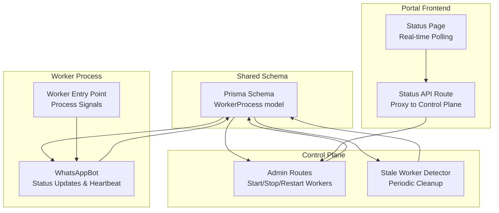
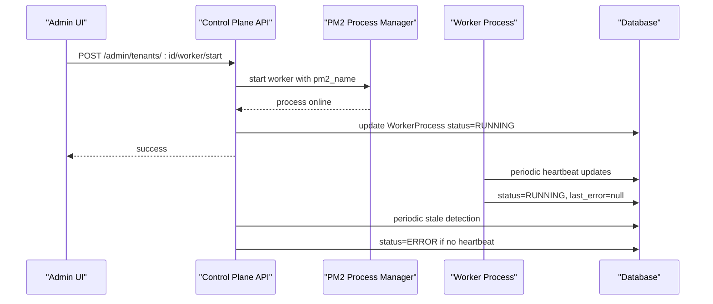
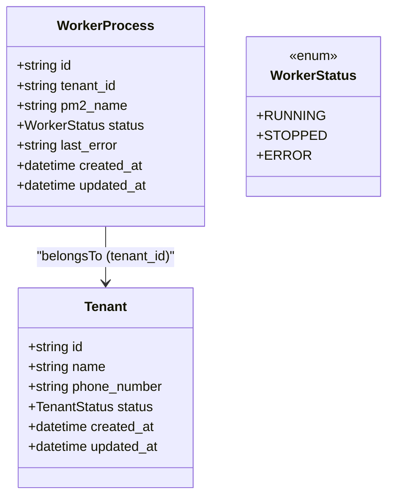
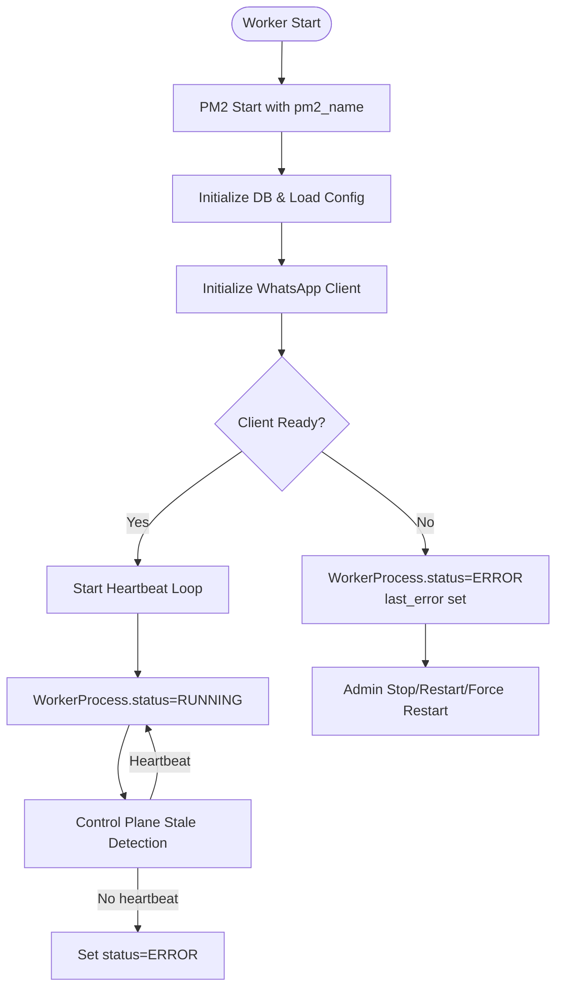
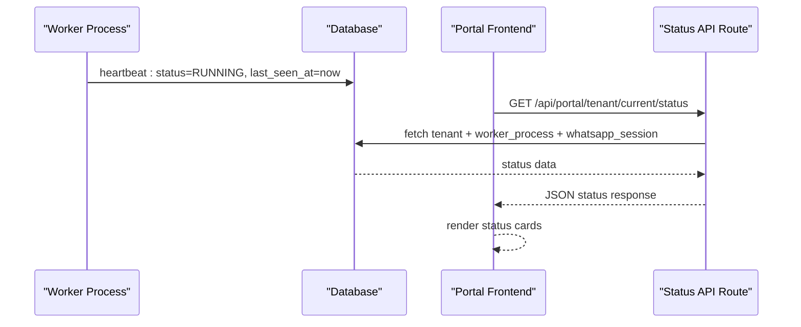
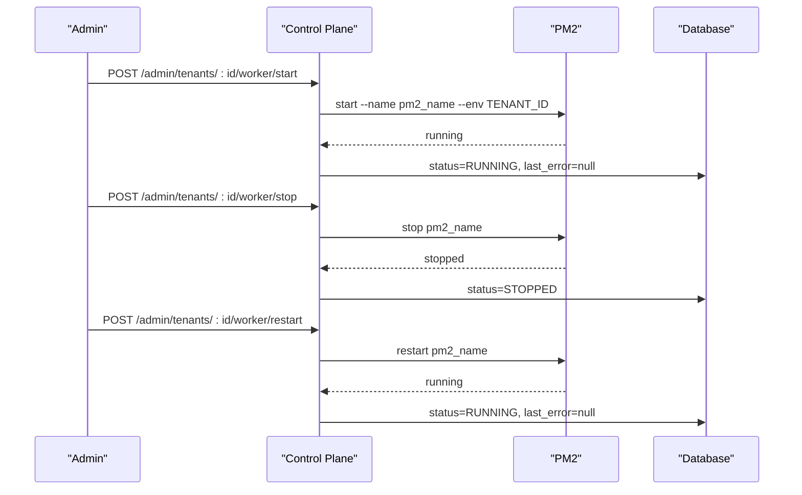
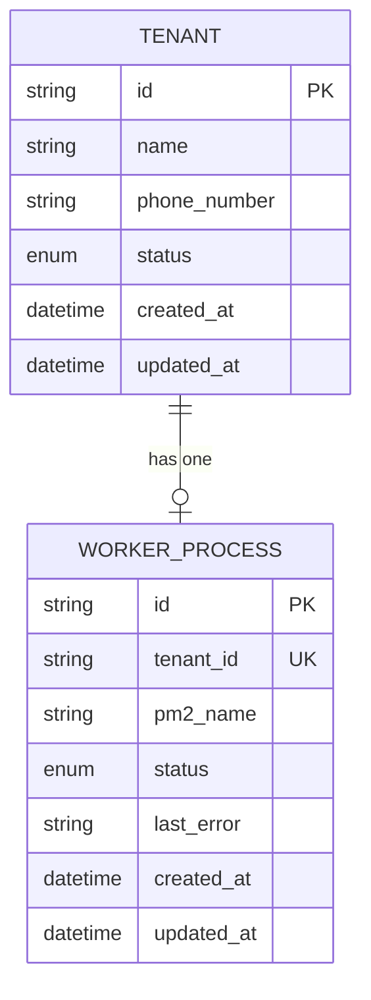
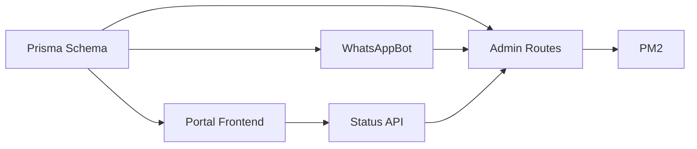

# WorkerProcess Entity

<cite>
**Referenced Files in This Document**
- [schema.prisma](file://packages/shared/src/prisma/schema.prisma)
- [bot.ts](file://apps/worker/src/bot.ts)
- [worker.ts](file://apps/worker/src/worker.ts)
- [admin.ts](file://apps/control-plane/src/routes/admin.ts)
- [page.tsx](file://apps/web/src/app/(portal)/app/status/page.tsx)
- [route.ts](file://apps/web/src/app/api/portal/tenant/current/status/route.ts)
- [stress-test.ts](file://scripts/stress-test.ts)
</cite>

## Table of Contents
1. [Introduction](#introduction)
2. [Project Structure](#project-structure)
3. [Core Components](#core-components)
4. [Architecture Overview](#architecture-overview)
5. [Detailed Component Analysis](#detailed-component-analysis)
6. [Dependency Analysis](#dependency-analysis)
7. [Performance Considerations](#performance-considerations)
8. [Troubleshooting Guide](#troubleshooting-guide)
9. [Conclusion](#conclusion)

## Introduction
This document provides comprehensive documentation for the WorkerProcess entity that tracks automation worker status for multi-tenant WhatsApp automation. It explains the worker status model, process identification, error tracking, one-to-one relationship with Tenant, and the complete lifecycle from startup through monitoring to error recovery. It also covers monitoring workflows, error handling patterns, and process management operations.

## Project Structure
The WorkerProcess entity is part of the shared Prisma schema and is used across the worker process, control plane, and portal frontend. The key files involved are:
- Prisma schema defining the WorkerProcess model and enums
- Worker process implementation that updates status and heartbeats
- Control plane routes that manage worker lifecycle and detect stale workers
- Portal frontend that displays status and triggers status polling
- Stress test that verifies isolation and cleanup behavior

**Diagram sources**
- [schema.prisma](file://packages/shared/src/prisma/schema.prisma#L120-L131)
- [bot.ts](file://apps/worker/src/bot.ts#L12-L75)
- [worker.ts](file://apps/worker/src/worker.ts#L1-L46)
- [admin.ts](file://apps/control-plane/src/routes/admin.ts#L174-L332)
- [page.tsx](file://apps/web/src/app/(portal)/app/status/page.tsx#L28-L44)
- [route.ts](file://apps/web/src/app/api/portal/tenant/current/status/route.ts#L8-L34)

**Section sources**
- [schema.prisma](file://packages/shared/src/prisma/schema.prisma#L120-L131)
- [bot.ts](file://apps/worker/src/bot.ts#L12-L75)
- [worker.ts](file://apps/worker/src/worker.ts#L1-L46)
- [admin.ts](file://apps/control-plane/src/routes/admin.ts#L174-L332)
- [page.tsx](file://apps/web/src/app/(portal)/app/status/page.tsx#L28-L44)
- [route.ts](file://apps/web/src/app/api/portal/tenant/current/status/route.ts#L8-L34)

## Core Components
- WorkerStatus enum: RUNNING, STOPPED, ERROR
- WorkerProcess model fields:
  - tenant_id: unique identifier linking to Tenant
  - pm2_name: process name used by PM2 for process identification
  - status: current worker status (default STOPPED)
  - last_error: latest error message recorded for diagnostics
  - created_at/updated_at: timestamps for audit and cleanup

Key behaviors:
- One-to-one relationship with Tenant via tenant_id unique constraint
- Automatic cleanup via PM2 process management and stale detection
- Heartbeat mechanism to keep status RUNNING and last_seen_at updated

**Section sources**
- [schema.prisma](file://packages/shared/src/prisma/schema.prisma#L40-L44)
- [schema.prisma](file://packages/shared/src/prisma/schema.prisma#L120-L131)

## Architecture Overview
The WorkerProcess entity integrates with:
- Worker process: starts, runs heartbeats, updates status, handles errors
- Control plane: manages PM2 lifecycle, detects stale workers, exposes APIs
- Portal frontend: polls status, displays worker health, triggers actions
- Shared Prisma schema: defines model, relations, and enums

**Diagram sources**
- [admin.ts](file://apps/control-plane/src/routes/admin.ts#L174-L230)
- [bot.ts](file://apps/worker/src/bot.ts#L333-L367)
- [admin.ts](file://apps/control-plane/src/routes/admin.ts#L30-L80)

## Detailed Component Analysis

### WorkerProcess Model and Enums
- WorkerStatus enum defines the canonical states for worker monitoring
- WorkerProcess model enforces:
  - Unique tenant_id (one worker per tenant)
  - pm2_name for PM2 process identification
  - Default status STOPPED
  - Optional last_error for error tracking

**Diagram sources**
- [schema.prisma](file://packages/shared/src/prisma/schema.prisma#L120-L131)
- [schema.prisma](file://packages/shared/src/prisma/schema.prisma#L60-L76)
- [schema.prisma](file://packages/shared/src/prisma/schema.prisma#L40-L44)

**Section sources**
- [schema.prisma](file://packages/shared/src/prisma/schema.prisma#L40-L44)
- [schema.prisma](file://packages/shared/src/prisma/schema.prisma#L120-L131)

### Worker Lifecycle: Startup to Monitoring
- Startup:
  - Control plane creates WorkerProcess with pm2_name and status STOPPED
  - Admin triggers worker start via PM2 with environment TENANT_ID and SESSIONS_PATH
  - Worker process initializes, connects to database, and starts WhatsApp client
  - On success, WorkerProcess status transitions to RUNNING and last_error cleared

- Monitoring:
  - Worker sends periodic heartbeats updating last_seen_at and status=RUNNING
  - Control plane periodically marks stale workers as ERROR if no heartbeat within threshold

- Error Recovery:
  - Worker sets status=ERROR and records last_error on failures
  - Control plane provides stop/restart/force-restart endpoints
  - Stale detector automatically moves stale RUNNING workers to ERROR

**Diagram sources**
- [admin.ts](file://apps/control-plane/src/routes/admin.ts#L174-L230)
- [bot.ts](file://apps/worker/src/bot.ts#L369-L392)
- [bot.ts](file://apps/worker/src/bot.ts#L333-L367)
- [admin.ts](file://apps/control-plane/src/routes/admin.ts#L30-L80)

**Section sources**
- [admin.ts](file://apps/control-plane/src/routes/admin.ts#L174-L230)
- [bot.ts](file://apps/worker/src/bot.ts#L369-L392)
- [bot.ts](file://apps/worker/src/bot.ts#L333-L367)
- [admin.ts](file://apps/control-plane/src/routes/admin.ts#L30-L80)

### Status Monitoring and Error Tracking
- Worker status monitoring:
  - Heartbeat updates WorkerProcess.status=RUNNING and last_seen_at
  - Control plane stale detection sets status=ERROR if no heartbeat
  - Portal frontend polls status endpoint and renders status cards

- Error tracking:
  - Worker captures exceptions during message handling and updates last_error
  - Worker sets status=ERROR on startup failures
  - Control plane endpoints expose last_error for diagnostics

**Diagram sources**
- [bot.ts](file://apps/worker/src/bot.ts#L333-L367)
- [page.tsx](file://apps/web/src/app/(portal)/app/status/page.tsx#L28-L44)
- [route.ts](file://apps/web/src/app/api/portal/tenant/current/status/route.ts#L8-L34)

**Section sources**
- [bot.ts](file://apps/worker/src/bot.ts#L333-L367)
- [page.tsx](file://apps/web/src/app/(portal)/app/status/page.tsx#L28-L44)
- [route.ts](file://apps/web/src/app/api/portal/tenant/current/status/route.ts#L8-L34)

### Process Management Workflows
- Start worker:
  - Control plane validates tenant and creates WorkerProcess if needed
  - Starts PM2 process with pm2_name and environment variables
  - Sets WorkerProcess.status=RUNNING and last_error=null

- Stop worker:
  - Control plane stops PM2 process by pm2_name
  - Sets WorkerProcess.status=STOPPED

- Restart worker:
  - Control plane restarts PM2 process by pm2_name
  - Clears last_error and sets status=RUNNING

- Force restart worker:
  - Control plane stops existing process if running
  - Starts fresh PM2 process with same pm2_name
  - Resets status to QR_PENDING and clears last_error

**Diagram sources**
- [admin.ts](file://apps/control-plane/src/routes/admin.ts#L174-L230)
- [admin.ts](file://apps/control-plane/src/routes/admin.ts#L232-L283)
- [admin.ts](file://apps/control-plane/src/routes/admin.ts#L285-L332)

**Section sources**
- [admin.ts](file://apps/control-plane/src/routes/admin.ts#L174-L230)
- [admin.ts](file://apps/control-plane/src/routes/admin.ts#L232-L283)
- [admin.ts](file://apps/control-plane/src/routes/admin.ts#L285-L332)

### One-to-One Relationship with Tenant and Automatic Cleanup
- One-to-one relationship:
  - WorkerProcess has tenant_id unique constraint
  - Tenant has optional worker_process relation
  - Each tenant has exactly one worker process

- Automatic cleanup behavior:
  - PM2 process management via control plane endpoints
  - Stale worker detection periodically marks RUNNING workers without recent heartbeats as ERROR
  - Stress test verifies isolation and cleanup by deleting tenant (cascades to related data)

**Diagram sources**
- [schema.prisma](file://packages/shared/src/prisma/schema.prisma#L60-L76)
- [schema.prisma](file://packages/shared/src/prisma/schema.prisma#L120-L131)

**Section sources**
- [schema.prisma](file://packages/shared/src/prisma/schema.prisma#L60-L76)
- [schema.prisma](file://packages/shared/src/prisma/schema.prisma#L120-L131)
- [stress-test.ts](file://scripts/stress-test.ts#L301-L324)

## Dependency Analysis
- WorkerProcess depends on:
  - Prisma schema for model definition and relations
  - WhatsAppBot for runtime status updates and heartbeats
  - Control plane for PM2 lifecycle management
  - Portal frontend for status display and polling

- Coupling and cohesion:
  - Strong cohesion within WorkerProcess model and related handlers
  - Loose coupling between worker, control plane, and portal via database and APIs
  - Clear separation of concerns: worker handles runtime, control plane manages lifecycle, portal displays status

**Diagram sources**
- [schema.prisma](file://packages/shared/src/prisma/schema.prisma#L120-L131)
- [bot.ts](file://apps/worker/src/bot.ts#L12-L75)
- [admin.ts](file://apps/control-plane/src/routes/admin.ts#L174-L230)
- [page.tsx](file://apps/web/src/app/(portal)/app/status/page.tsx#L28-L44)

**Section sources**
- [schema.prisma](file://packages/shared/src/prisma/schema.prisma#L120-L131)
- [bot.ts](file://apps/worker/src/bot.ts#L12-L75)
- [admin.ts](file://apps/control-plane/src/routes/admin.ts#L174-L230)
- [page.tsx](file://apps/web/src/app/(portal)/app/status/page.tsx#L28-L44)

## Performance Considerations
- Heartbeat interval tuning:
  - Adjust HEARTBEAT_INTERVAL_MS to balance responsiveness vs. DB load
  - Too frequent heartbeats increase DB writes; too infrequent delays stale detection

- Stale threshold:
  - STALE_THRESHOLD_MINUTES should exceed typical heartbeat intervals
  - Prevents false positives while maintaining timely error detection

- Database indexing:
  - Consider indexing WorkerProcess.status and tenant_id for stale detection queries
  - Index tenant.whatsapp_session.last_seen_at for efficient stale checks

- Process isolation:
  - PM2 process names must be unique per tenant to prevent conflicts
  - Stress testing validates isolation and cleanup behavior

## Troubleshooting Guide
Common scenarios and resolutions:
- Worker stuck in RUNNING despite disconnection:
  - Check stale detection threshold and heartbeat interval
  - Verify PM2 process is still running under pm2_name
  - Use force-restart to recreate the process

- Startup failures:
  - Review last_error in WorkerProcess
  - Check PM2 logs for process exit reasons
  - Validate TENANT_ID and SESSIONS_PATH environment variables

- Status not updating in portal:
  - Confirm heartbeat loop is running in worker
  - Verify database connectivity and permissions
  - Check portal status API proxy configuration

- Error handling patterns:
  - Worker catches unhandled exceptions and continues processing
  - Worker updates last_error on message handling errors
  - Control plane routes return structured error responses

**Section sources**
- [bot.ts](file://apps/worker/src/bot.ts#L313-L331)
- [admin.ts](file://apps/control-plane/src/routes/admin.ts#L30-L80)
- [route.ts](file://apps/web/src/app/api/portal/tenant/current/status/route.ts#L8-L34)

## Conclusion
The WorkerProcess entity provides robust, automated monitoring and management of multi-tenant WhatsApp automation workers. Its design ensures:
- Clear status semantics with RUNNING, STOPPED, ERROR
- Reliable process identification via pm2_name
- Comprehensive error tracking through last_error
- One-to-one tenant relationship with automatic cleanup
- End-to-end lifecycle management from startup to recovery

The combination of worker heartbeats, control plane PM2 management, and stale detection creates a resilient system suitable for production deployment.