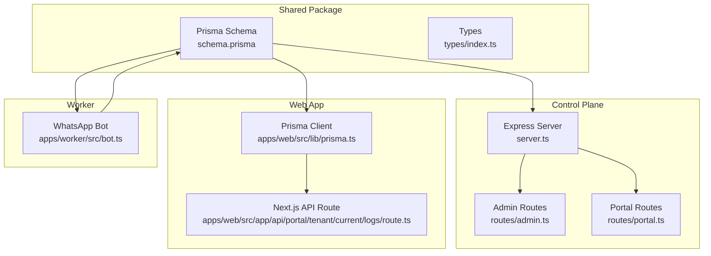
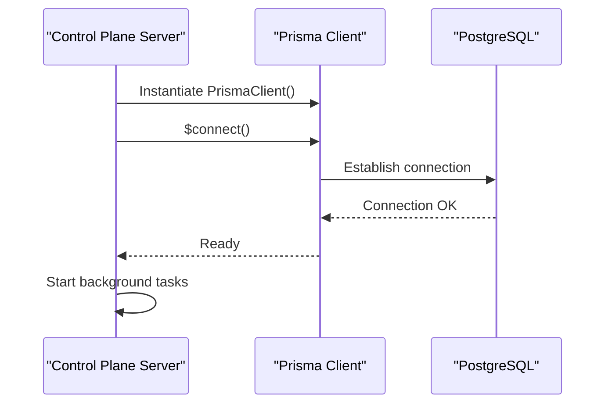
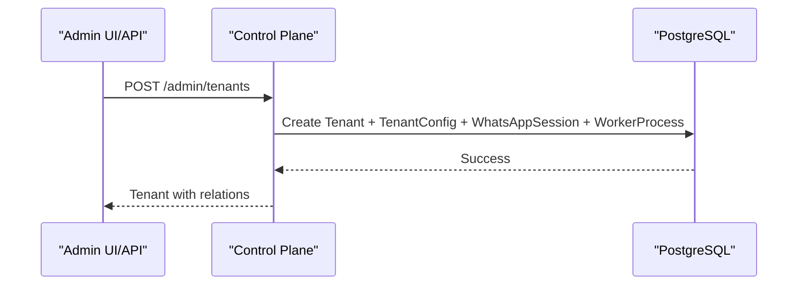
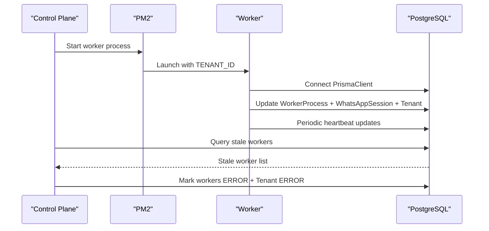
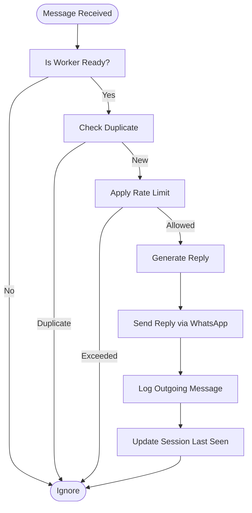
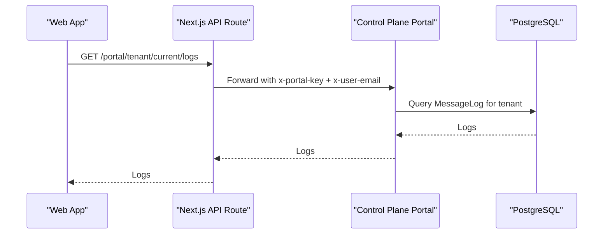
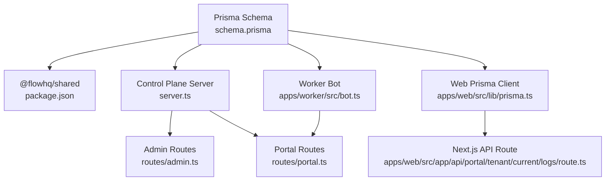

# Data Model Overview

<cite>
**Referenced Files in This Document**
- [schema.prisma](file://packages/shared/src/prisma/schema.prisma)
- [prisma.ts](file://apps/web/src/lib/prisma.ts)
- [package.json](file://packages/shared/package.json)
- [server.ts](file://apps/control-plane/src/server.ts)
- [bot.ts](file://apps/worker/src/bot.ts)
- [.env.example](file://.env.example)
- [admin.ts](file://apps/control-plane/src/routes/admin.ts)
- [portal.ts](file://apps/control-plane/src/routes/portal.ts)
- [route.ts](file://apps/web/src/app/api/portal/tenant/current/logs/route.ts)
- [types/index.ts](file://packages/shared/src/types/index.ts)
</cite>

## Table of Contents
1. [Introduction](#introduction)
2. [Project Structure](#project-structure)
3. [Core Components](#core-components)
4. [Architecture Overview](#architecture-overview)
5. [Detailed Component Analysis](#detailed-component-analysis)
6. [Dependency Analysis](#dependency-analysis)
7. [Performance Considerations](#performance-considerations)
8. [Troubleshooting Guide](#troubleshooting-guide)
9. [Conclusion](#conclusion)

## Introduction
This document provides a comprehensive data model overview for the Flow HQ database schema. It explains the overall database architecture, multi-tenant design principles, and core entity relationships. It documents the purpose and scope of each major table (Tenant, TenantConfig, WhatsAppSession, MessageLog, WorkerProcess, User, SetupRequest, and PortalEventLog), details the database provider (PostgreSQL), connection configuration, and Prisma client setup, and describes data modeling decisions, normalization strategies, and how the schema supports the application’s business logic. Conceptual diagrams illustrate entity relationships and data flow patterns.

## Project Structure
The database schema is defined centrally in the shared package and consumed by both the control-plane and web applications. The schema uses Prisma with PostgreSQL as the provider and UUID primary keys for all entities. The control-plane and worker processes connect to the database via Prisma clients to manage tenants, sessions, message logs, workers, users, setup requests, and portal events.



**Diagram sources**
- [schema.prisma](file://packages/shared/src/prisma/schema.prisma#L1-L178)
- [prisma.ts](file://apps/web/src/lib/prisma.ts#L1-L10)
- [server.ts](file://apps/control-plane/src/server.ts#L1-L89)
- [admin.ts](file://apps/control-plane/src/routes/admin.ts#L1-L528)
- [portal.ts](file://apps/control-plane/src/routes/portal.ts#L1-L246)
- [bot.ts](file://apps/worker/src/bot.ts#L1-L411)
- [route.ts](file://apps/web/src/app/api/portal/tenant/current/logs/route.ts#L1-L35)
- [types/index.ts](file://packages/shared/src/types/index.ts#L1-L41)

**Section sources**
- [schema.prisma](file://packages/shared/src/prisma/schema.prisma#L1-L178)
- [prisma.ts](file://apps/web/src/lib/prisma.ts#L1-L10)
- [server.ts](file://apps/control-plane/src/server.ts#L1-L89)
- [bot.ts](file://apps/worker/src/bot.ts#L1-L411)
- [.env.example](file://.env.example#L1-L22)
- [admin.ts](file://apps/control-plane/src/routes/admin.ts#L1-L528)
- [portal.ts](file://apps/control-plane/src/routes/portal.ts#L1-L246)
- [route.ts](file://apps/web/src/app/api/portal/tenant/current/logs/route.ts#L1-L35)
- [types/index.ts](file://packages/shared/src/types/index.ts#L1-L41)

## Core Components
This section outlines the core entities and their roles in the multi-tenant architecture.

- Tenant
  - Purpose: Represents a customer account or business unit.
  - Key attributes: Unique identifier, name, phone number, status, timestamps.
  - Relationships: One-to-one with TenantConfig, WhatsAppSession, WorkerProcess; one-to-many with MessageLog, SetupRequest; optional one-to-one with User.
  - Scope: Central tenant lifecycle and status management.

- TenantConfig
  - Purpose: Stores tenant-specific configuration (template type, business name, language).
  - Key attributes: Unique tenant association, template type enum, language enum, optional hours JSON.
  - Relationships: One-to-one with Tenant via foreign key.
  - Scope: Per-tenant customization and operational settings.

- WhatsAppSession
  - Purpose: Tracks WhatsApp session state and QR readiness.
  - Key attributes: Unique tenant association, session state enum, last QR data URI, last seen timestamp.
  - Relationships: One-to-one with Tenant.
  - Scope: Real-time session health and QR provisioning.

- MessageLog
  - Purpose: Logs inbound and outbound messages for audit and analytics.
  - Key attributes: Direction enum, sender/receiver numbers, message text, optional WA message ID, timestamps.
  - Relationships: Many-to-one with Tenant.
  - Scope: Message history and operational monitoring.

- WorkerProcess
  - Purpose: Manages the lifecycle and status of tenant-specific worker processes.
  - Key attributes: Unique tenant association, PM2 process name, status enum, last error.
  - Relationships: One-to-one with Tenant.
  - Scope: Worker orchestration and health monitoring.

- User
  - Purpose: Represents users associated with tenants (owners, staff, admins).
  - Key attributes: Unique tenant association, name, unique email, optional phone, role enum, timestamps.
  - Relationships: Optional one-to-one with Tenant; one-to-many with SetupRequest and PortalEventLog.
  - Scope: Access control and user-centric operations.

- SetupRequest
  - Purpose: Captures tenant onboarding requests with status tracking.
  - Key attributes: Tenant and User associations, template type, WhatsApp number, status enum, notes, timestamps.
  - Relationships: Many-to-one with Tenant and User.
  - Scope: Onboarding workflow and approvals.

- PortalEventLog
  - Purpose: Records portal-triggered events for audit and analytics.
  - Key attributes: Tenant and optional User associations, event type string, optional JSON payload, timestamps.
  - Relationships: Many-to-one with Tenant and optional User.
  - Scope: Event-driven auditing and tracing.

**Section sources**
- [schema.prisma](file://packages/shared/src/prisma/schema.prisma#L60-L178)
- [types/index.ts](file://packages/shared/src/types/index.ts#L1-L41)

## Architecture Overview
The database architecture follows a multi-tenant pattern with centralized schema definition and shared Prisma client usage across services. PostgreSQL is configured as the provider with environment-driven URL configuration. The control-plane manages tenant lifecycle, worker orchestration, and portal integrations. The worker maintains real-time WhatsApp connectivity and updates session and message logs. The web app proxies portal APIs to the control-plane using an internal key.

```mermaid
erDiagram
TENANT {
uuid id PK
string name
string phone_number
enum status
timestamp created_at
timestamp updated_at
}
TENANT_CONFIG {
uuid id PK
uuid tenant_id UK
enum template_type
string business_name
enum language
json hours_json
timestamp created_at
timestamp updated_at
}
WHATSAPP_SESSION {
uuid id PK
uuid tenant_id UK
enum state
string last_qr
timestamp last_seen_at
timestamp created_at
timestamp updated_at
}
MESSAGE_LOG {
uuid id PK
uuid tenant_id
enum direction
string from_number
string to_number
string message_text
string wa_message_id
timestamp created_at
}
WORKER_PROCESS {
uuid id PK
uuid tenant_id UK
string pm2_name
enum status
string last_error
timestamp created_at
timestamp updated_at
}
USER {
uuid id PK
uuid tenant_id UK
string name
string email UK
string phone
enum role
timestamp created_at
timestamp updated_at
}
SETUP_REQUEST {
uuid id PK
uuid tenant_id
uuid user_id
enum template_type
string whatsapp_number
enum status
string notes
timestamp created_at
timestamp updated_at
}
PORTAL_EVENT_LOG {
uuid id PK
uuid tenant_id
uuid user_id
string event_type
json payload_json
timestamp created_at
}
TENANT ||--o| TENANT_CONFIG : "has one"
TENANT ||--o| WHATSAPP_SESSION : "has one"
TENANT ||--o| WORKER_PROCESS : "has one"
TENANT ||--o{ MESSAGE_LOG : "has many"
TENANT ||--o{ SETUP_REQUEST : "has many"
TENANT ||--o? USER : "has one"
USER ||--o{ SETUP_REQUEST : "submits"
USER ||--o{ PORTAL_EVENT_LOG : "triggers"
TENANT ||--o{ PORTAL_EVENT_LOG : "generates"
SETUP_REQUEST }o--|| TENANT : "references"
SETUP_REQUEST }o--|| USER : "references"
```

**Diagram sources**
- [schema.prisma](file://packages/shared/src/prisma/schema.prisma#L60-L178)

## Detailed Component Analysis

### Database Provider and Connection Configuration
- Provider: PostgreSQL configured via Prisma datasource.
- Connection URL: Loaded from DATABASE_URL environment variable.
- Environment Validation: Control-plane server validates required environment variables and connects to the database before starting.



**Diagram sources**
- [server.ts](file://apps/control-plane/src/server.ts#L16-L39)
- [prisma.ts](file://apps/web/src/lib/prisma.ts#L1-L10)
- [.env.example](file://.env.example#L1-L22)

**Section sources**
- [schema.prisma](file://packages/shared/src/prisma/schema.prisma#L5-L8)
- [server.ts](file://apps/control-plane/src/server.ts#L16-L39)
- [prisma.ts](file://apps/web/src/lib/prisma.ts#L1-L10)
- [.env.example](file://.env.example#L1-L22)

### Multi-Tenant Design Principles
- Tenant Isolation: Each tenant has dedicated records across all entities, ensuring logical separation.
- Shared Enums: Enums like TenantStatus, SessionState, WorkerStatus, MessageDirection, UserRole, and SetupRequestStatus standardize state transitions and validations.
- UUID Primary Keys: Ensures safe cross-service joins and avoids collisions.
- Foreign Key Constraints: One-to-one and one-to-many relations enforce referential integrity.

**Section sources**
- [schema.prisma](file://packages/shared/src/prisma/schema.prisma#L60-L178)

### Tenant Management and Lifecycle
- Creation: Admin routes create Tenant, TenantConfig, WhatsAppSession, and WorkerProcess in a single operation.
- Status Updates: Worker readiness, QR generation, and session state changes update Tenant and WorkerProcess statuses.
- Cleanup: Disconnections and errors propagate to Tenant and WorkerProcess for visibility.



**Diagram sources**
- [admin.ts](file://apps/control-plane/src/routes/admin.ts#L104-L140)

**Section sources**
- [admin.ts](file://apps/control-plane/src/routes/admin.ts#L104-L140)

### Worker Orchestration and Health Monitoring
- Worker Lifecycle: Control-plane starts/stops/restarts workers via PM2 and updates WorkerProcess status.
- Heartbeat: Worker sends periodic heartbeats to update session last_seen_at and worker status.
- Staleness Detection: Control-plane periodically marks workers as ERROR if no heartbeat within threshold.



**Diagram sources**
- [admin.ts](file://apps/control-plane/src/routes/admin.ts#L30-L80)
- [bot.ts](file://apps/worker/src/bot.ts#L369-L392)
- [bot.ts](file://apps/worker/src/bot.ts#L333-L367)

**Section sources**
- [admin.ts](file://apps/control-plane/src/routes/admin.ts#L30-L80)
- [bot.ts](file://apps/worker/src/bot.ts#L369-L392)
- [bot.ts](file://apps/worker/src/bot.ts#L333-L367)

### Messaging Flow and Audit Logging
- Incoming Messages: Worker captures inbound messages, logs them, applies rate limiting, and sends templated replies.
- Outgoing Messages: Worker logs outbound replies and updates session last_seen_at.
- MessageLog Indexes: Composite index on tenant_id and created_at optimizes tenant-scoped queries.



**Diagram sources**
- [bot.ts](file://apps/worker/src/bot.ts#L248-L331)
- [schema.prisma](file://packages/shared/src/prisma/schema.prisma#L105-L118)

**Section sources**
- [bot.ts](file://apps/worker/src/bot.ts#L248-L331)
- [schema.prisma](file://packages/shared/src/prisma/schema.prisma#L105-L118)

### Portal Integration and Internal Key Authentication
- Web App API: Next.js API route proxies to control-plane portal endpoints.
- Authentication: Requests are secured with PORTAL_INTERNAL_KEY header and x-user-email.
- Data Fetching: Portal routes return tenant, user, and setup request data for UI rendering.



**Diagram sources**
- [route.ts](file://apps/web/src/app/api/portal/tenant/current/logs/route.ts#L1-L35)
- [portal.ts](file://apps/control-plane/src/routes/portal.ts#L159-L186)

**Section sources**
- [route.ts](file://apps/web/src/app/api/portal/tenant/current/logs/route.ts#L1-L35)
- [portal.ts](file://apps/control-plane/src/routes/portal.ts#L159-L186)

### Data Modeling Decisions and Normalization
- Strong Typing via Enums: Ensures consistent state transitions and reduces invalid states.
- UUIDs: Enables safe joins across services and avoids integer-based collisions.
- One-to-One Joins: TenantConfig, WhatsAppSession, WorkerProcess are normalized to reduce duplication.
- Denormalized Views: Types expose simplified shapes for UI consumption (e.g., TenantWithRelations).
- Indexing: Composite index on MessageLog tenant_id and created_at improves tenant-scoped queries.

**Section sources**
- [schema.prisma](file://packages/shared/src/prisma/schema.prisma#L10-L178)
- [types/index.ts](file://packages/shared/src/types/index.ts#L1-L41)

## Dependency Analysis
The control-plane, web app, and worker depend on the shared Prisma schema and client. The control-plane coordinates tenant lifecycle and worker orchestration. The worker maintains session state and logs messages. The web app proxies portal endpoints to the control-plane using an internal key.



**Diagram sources**
- [schema.prisma](file://packages/shared/src/prisma/schema.prisma#L1-L178)
- [package.json](file://packages/shared/package.json#L1-L23)
- [server.ts](file://apps/control-plane/src/server.ts#L1-L89)
- [admin.ts](file://apps/control-plane/src/routes/admin.ts#L1-L528)
- [portal.ts](file://apps/control-plane/src/routes/portal.ts#L1-L246)
- [prisma.ts](file://apps/web/src/lib/prisma.ts#L1-L10)
- [route.ts](file://apps/web/src/app/api/portal/tenant/current/logs/route.ts#L1-L35)
- [bot.ts](file://apps/worker/src/bot.ts#L1-L411)

**Section sources**
- [schema.prisma](file://packages/shared/src/prisma/schema.prisma#L1-L178)
- [package.json](file://packages/shared/package.json#L1-L23)
- [server.ts](file://apps/control-plane/src/server.ts#L1-L89)
- [admin.ts](file://apps/control-plane/src/routes/admin.ts#L1-L528)
- [portal.ts](file://apps/control-plane/src/routes/portal.ts#L1-L246)
- [prisma.ts](file://apps/web/src/lib/prisma.ts#L1-L10)
- [route.ts](file://apps/web/src/app/api/portal/tenant/current/logs/route.ts#L1-L35)
- [bot.ts](file://apps/worker/src/bot.ts#L1-L411)

## Performance Considerations
- Indexing: Composite index on MessageLog tenant_id and created_at accelerates tenant-scoped queries.
- Heartbeat Intervals: Configurable intervals for worker heartbeats balance responsiveness and database load.
- Rate Limiting: Built-in rate limiter prevents flooding and reduces database contention.
- Pagination: Control-plane routes support configurable limits for logs and setup requests.
- Connection Management: Prisma client reuse via global instance in development and per-process instances in production.

[No sources needed since this section provides general guidance]

## Troubleshooting Guide
- Database Connectivity
  - Validate DATABASE_URL environment variable and network access.
  - Confirm Prisma client connection during startup and handle connection failures gracefully.

- Worker Issues
  - Stale Workers: Control-plane periodically marks workers as ERROR if no heartbeat within threshold.
  - Session Errors: Worker updates Tenant and WorkerProcess status on disconnections and auth failures.
  - Heartbeat Failures: Worker logs heartbeat errors and continues processing.

- Portal Authentication
  - Ensure PORTAL_INTERNAL_KEY is configured and matches the x-portal-key header.
  - Verify x-user-email header presence for portal endpoints.

**Section sources**
- [server.ts](file://apps/control-plane/src/server.ts#L16-L39)
- [admin.ts](file://apps/control-plane/src/routes/admin.ts#L30-L80)
- [bot.ts](file://apps/worker/src/bot.ts#L185-L226)
- [portal.ts](file://apps/control-plane/src/routes/portal.ts#L12-L25)

## Conclusion
The Flow HQ database schema is designed around a clean multi-tenant architecture with strong typing, UUID primary keys, and normalized relations. PostgreSQL and Prisma provide robust data persistence and client-side typing. The schema supports the application’s business logic by tracking tenant lifecycle, session state, message logs, worker health, user roles, setup requests, and portal events. The control-plane, worker, and web app integrate seamlessly through shared Prisma clients and internal authentication, enabling scalable and maintainable operations.