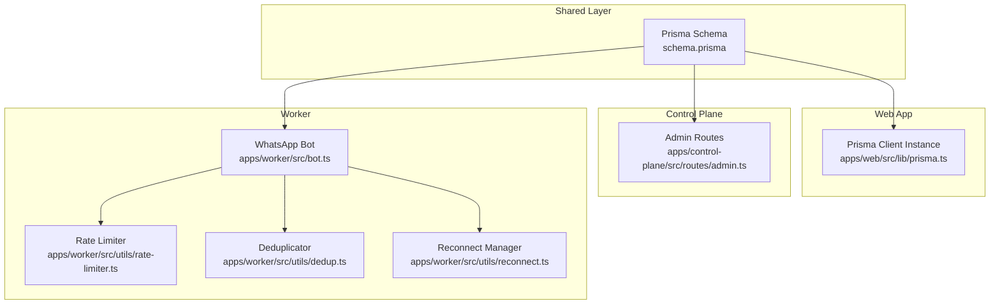
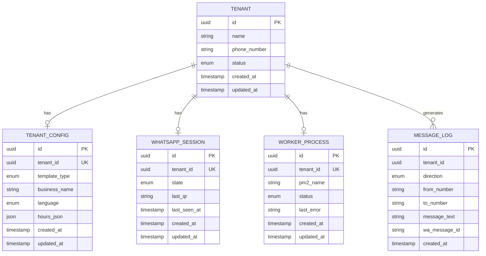
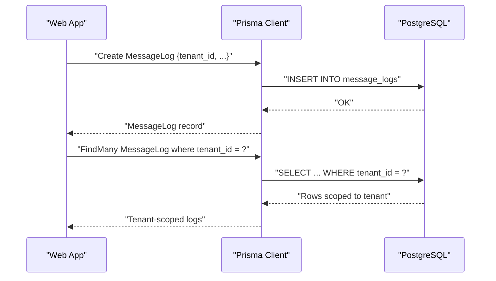
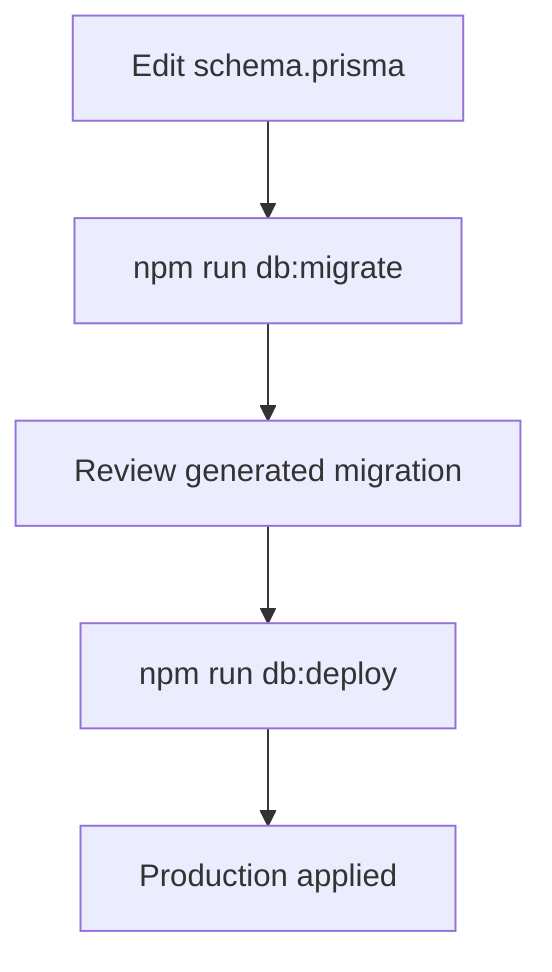
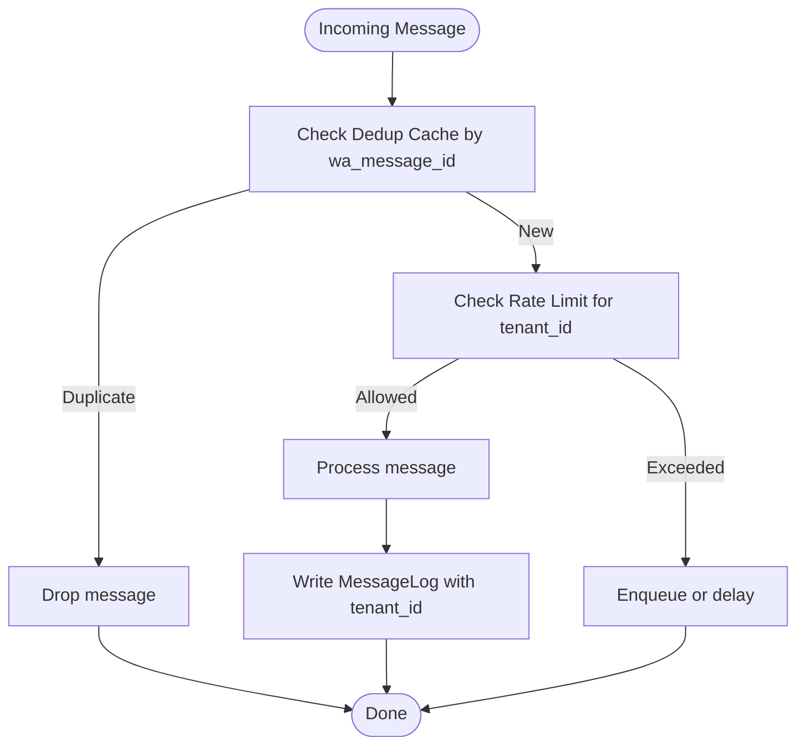
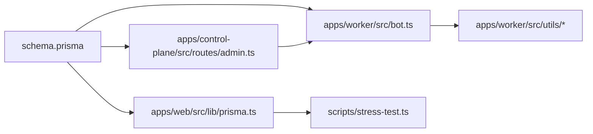

# Database Design

<cite>
**Referenced Files in This Document**
- [schema.prisma](file://packages/shared/src/prisma/schema.prisma)
- [prisma.ts](file://apps/web/src/lib/prisma.ts)
- [stress-test.ts](file://scripts/stress-test.ts)
- [package.json](file://package.json)
- [admin.ts](file://apps/control-plane/src/routes/admin.ts)
- [rate-limiter.ts](file://apps/worker/src/utils/rate-limiter.ts)
- [dedup.ts](file://apps/worker/src/utils/dedup.ts)
- [reconnect.ts](file://apps/worker/src/utils/reconnect.ts)
- [bot.ts](file://apps/worker/src/bot.ts)
</cite>

## Table of Contents
1. [Introduction](#introduction)
2. [Project Structure](#project-structure)
3. [Core Components](#core-components)
4. [Architecture Overview](#architecture-overview)
5. [Detailed Component Analysis](#detailed-component-analysis)
6. [Dependency Analysis](#dependency-analysis)
7. [Performance Considerations](#performance-considerations)
8. [Troubleshooting Guide](#troubleshooting-guide)
9. [Conclusion](#conclusion)
10. [Appendices](#appendices)

## Introduction
This document describes the Flow HQ database schema and data model with a focus on multi-tenant isolation, entity relationships among Tenant, TenantConfig, WhatsAppSession, MessageLog, and WorkerProcess, and operational aspects such as schema evolution, validation rules, caching strategies, and performance considerations. It also outlines data lifecycle management, retention, and security practices grounded in the repository’s Prisma schema and supporting runtime code.

## Project Structure
The database schema is defined centrally in a Prisma schema file and consumed by application layers:
- Shared Prisma schema defines models, enums, relations, indexes, and constraints.
- Application clients (web and worker) use a shared Prisma client instance.
- Control plane routes coordinate worker lifecycle and tenant operations.
- Operational scripts validate multi-tenant isolation and simulate high-throughput scenarios.

**Diagram sources**
- [schema.prisma](file://packages/shared/src/prisma/schema.prisma#L1-L178)
- [prisma.ts](file://apps/web/src/lib/prisma.ts#L1-L10)
- [admin.ts](file://apps/control-plane/src/routes/admin.ts#L1-L24)
- [bot.ts](file://apps/worker/src/bot.ts#L1-L25)
- [rate-limiter.ts](file://apps/worker/src/utils/rate-limiter.ts#L58-L109)
- [dedup.ts](file://apps/worker/src/utils/dedup.ts#L1-L92)
- [reconnect.ts](file://apps/worker/src/utils/reconnect.ts#L1-L52)

**Section sources**
- [schema.prisma](file://packages/shared/src/prisma/schema.prisma#L1-L178)
- [prisma.ts](file://apps/web/src/lib/prisma.ts#L1-L10)
- [admin.ts](file://apps/control-plane/src/routes/admin.ts#L1-L24)
- [bot.ts](file://apps/worker/src/bot.ts#L1-L25)

## Core Components
This section documents the five core entities involved in multi-tenant messaging and operations.

- Tenant
  - Purpose: Represents a customer account.
  - Primary key: id (UUID).
  - Fields: name, phone_number, status (TenantStatus), timestamps.
  - Relationships: One-to-one TenantConfig, One-to-one WhatsAppSession, One-to-one WorkerProcess, One-to-many MessageLog, One-to-one User (owner), One-to-many SetupRequest.
  - Notes: Status enum supports provisioning and operational states.

- TenantConfig
  - Purpose: Stores per-tenant configuration (template type, language, business metadata).
  - Primary key: id (UUID).
  - Foreign key: tenant_id -> Tenant.id (unique; cascade delete).
  - Fields: template_type (TemplateType), business_name, language (Language), hours_json (JSON), timestamps.
  - Constraints: tenant_id uniqueness ensures one config per tenant.

- WhatsAppSession
  - Purpose: Tracks session state and QR/heartbeat metadata for a tenant’s WhatsApp connection.
  - Primary key: id (UUID).
  - Foreign key: tenant_id -> Tenant.id (unique; cascade delete).
  - Fields: state (SessionState), last_qr, last_seen_at, timestamps.
  - Constraints: tenant_id uniqueness ensures one session per tenant.

- MessageLog
  - Purpose: Captures inbound/outbound messages with tenant scoping.
  - Primary key: id (UUID).
  - Foreign key: tenant_id -> Tenant.id (no unique constraint; multiple logs).
  - Fields: direction (MessageDirection), from_number, to_number, message_text, wa_message_id, created_at.
  - Indexes: composite index on (tenant_id, created_at) for efficient tenant-scoped queries.
  - Notes: tenant_id is required for all logs; used extensively in isolation checks.

- WorkerProcess
  - Purpose: Tracks per-tenant worker lifecycle and status.
  - Primary key: id (UUID).
  - Foreign key: tenant_id -> Tenant.id (unique; cascade delete).
  - Fields: pm2_name, status (WorkerStatus), last_error, timestamps.
  - Constraints: tenant_id uniqueness ensures one worker per tenant.

**Section sources**
- [schema.prisma](file://packages/shared/src/prisma/schema.prisma#L60-L131)

## Architecture Overview
The database enforces multi-tenant isolation via tenant_id on all transactional tables and cascading deletes from Tenant. The web app and control plane share the same Prisma client, while the worker consumes the schema for message processing and deduplication.

**Diagram sources**
- [schema.prisma](file://packages/shared/src/prisma/schema.prisma#L60-L131)

## Detailed Component Analysis

### Tenant Model
- Identity: UUID primary key.
- Lifecycle: created_at and updated_at managed automatically.
- Relationships: One-to-one with TenantConfig, WhatsAppSession, WorkerProcess; one-to-many with MessageLog and SetupRequest; optional User ownership.
- Validation: Enforced by Prisma schema; application code should validate presence of related records when required.

**Section sources**
- [schema.prisma](file://packages/shared/src/prisma/schema.prisma#L60-L76)

### TenantConfig Model
- Uniqueness: tenant_id is unique; enforced by relation and schema.
- Defaults: template_type defaults to BOOKING; language defaults to SW.
- JSON field: hours_json stores structured scheduling data.
- Cascade: deletion of Tenant cascades to TenantConfig.

**Section sources**
- [schema.prisma](file://packages/shared/src/prisma/schema.prisma#L78-L90)

### WhatsAppSession Model
- Uniqueness: tenant_id is unique; enforced by relation and schema.
- State machine: state transitions tracked via SessionState enum.
- Metadata: last_qr and last_seen_at support QR generation and health monitoring.
- Cascade: deletion of Tenant cascades to WhatsAppSession.

**Section sources**
- [schema.prisma](file://packages/shared/src/prisma/schema.prisma#L92-L103)

### MessageLog Model
- Tenant scoping: tenant_id is required for all rows.
- Directionality: IN/OUT via MessageDirection enum.
- De-duplication: wa_message_id used by worker-side deduplicator to avoid reprocessing.
- Indexing: composite index on (tenant_id, created_at) improves tenant-scoped scans.
- Audit: created_at auto-populated.

Operational usage patterns:
- Web app writes inbound/outbound messages with tenant_id.
- Worker reads tenant-scoped logs and applies rate limits and deduplication.

**Section sources**
- [schema.prisma](file://packages/shared/src/prisma/schema.prisma#L105-L118)
- [dedup.ts](file://apps/worker/src/utils/dedup.ts#L1-L92)
- [rate-limiter.ts](file://apps/worker/src/utils/rate-limiter.ts#L58-L109)

### WorkerProcess Model
- Lifecycle: tracks worker status and last error.
- Coordination: pm2_name aligns with process manager naming.
- Cascade: deletion of Tenant cascades to WorkerProcess.

Control plane integration:
- Admin routes manage worker start/stop and check process status.

**Section sources**
- [schema.prisma](file://packages/shared/src/prisma/schema.prisma#L120-L131)
- [admin.ts](file://apps/control-plane/src/routes/admin.ts#L1-L24)

### Multi-Tenant Data Isolation
- Principle: All transactional tables include tenant_id; queries filter by tenant_id to prevent cross-tenant access.
- Evidence in code:
  - MessageLog queries enforce tenant_id filtering.
  - Stress test validates isolation by scanning logs grouped by tenant_id and asserting no foreign entries.
  - Tenant deletion cascades to child entities, ensuring complete cleanup.

**Diagram sources**
- [stress-test.ts](file://scripts/stress-test.ts#L137-L163)
- [schema.prisma](file://packages/shared/src/prisma/schema.prisma#L105-L118)

**Section sources**
- [stress-test.ts](file://scripts/stress-test.ts#L137-L163)
- [schema.prisma](file://packages/shared/src/prisma/schema.prisma#L105-L118)

### Schema Evolution with Prisma
- Prisma client generator and datasource configured for PostgreSQL.
- Migration commands exposed via npm scripts in the monorepo workspace.
- Typical workflow: modify schema.prisma, run db:migrate to generate and apply migrations, then db:deploy to production.

**Diagram sources**
- [package.json](file://package.json#L9-L16)
- [schema.prisma](file://packages/shared/src/prisma/schema.prisma#L1-L8)

**Section sources**
- [package.json](file://package.json#L9-L16)
- [schema.prisma](file://packages/shared/src/prisma/schema.prisma#L1-L8)

### Data Access Patterns and Caching Strategies
- Tenant-scoped reads: Filter by tenant_id to ensure isolation and reduce scan cost.
- Composite index: (tenant_id, created_at) on MessageLog accelerates tenant-centric queries.
- Worker-side caching:
  - Deduplication cache keyed by wa_message_id prevents duplicate processing.
  - Rate limiter maintains per-tenant counters and windows.
  - Reconnect manager applies exponential backoff to stabilize connections.

**Diagram sources**
- [dedup.ts](file://apps/worker/src/utils/dedup.ts#L1-L92)
- [rate-limiter.ts](file://apps/worker/src/utils/rate-limiter.ts#L58-L109)
- [schema.prisma](file://packages/shared/src/prisma/schema.prisma#L105-L118)

**Section sources**
- [dedup.ts](file://apps/worker/src/utils/dedup.ts#L1-L92)
- [rate-limiter.ts](file://apps/worker/src/utils/rate-limiter.ts#L58-L109)
- [schema.prisma](file://packages/shared/src/prisma/schema.prisma#L105-L118)

### Data Lifecycle Management, Retention, and Archival
- Current schema does not define explicit retention or archival policies.
- Recommendations grounded in existing indexes and data volume characteristics:
  - Partitioning: Consider table partitioning by created_at for MessageLog to manage growth.
  - Archival: Offload older tenant-scoped logs to cold storage using tenant_id as a sharding key.
  - Cleanup: Implement scheduled jobs to prune stale records per tenant policy.
  - Monitoring: Track tenant log counts and growth trends to inform retention tiers.

[No sources needed since this section provides general guidance]

### Security Measures, Backups, and Disaster Recovery
- Network security: DATABASE_URL configured via environment variable; restrict access to database credentials.
- Data isolation: tenant_id filtering and cascading deletes protect tenants from cross-access.
- Backup and DR: Use managed PostgreSQL backups; test restore procedures regularly; maintain point-in-time recovery (PITR) enabled.

[No sources needed since this section provides general guidance]

## Dependency Analysis
The following diagram shows how application layers depend on the shared Prisma schema and each other.

**Diagram sources**
- [schema.prisma](file://packages/shared/src/prisma/schema.prisma#L1-L178)
- [prisma.ts](file://apps/web/src/lib/prisma.ts#L1-L10)
- [admin.ts](file://apps/control-plane/src/routes/admin.ts#L1-L24)
- [bot.ts](file://apps/worker/src/bot.ts#L1-L25)
- [stress-test.ts](file://scripts/stress-test.ts#L1-L200)

**Section sources**
- [schema.prisma](file://packages/shared/src/prisma/schema.prisma#L1-L178)
- [prisma.ts](file://apps/web/src/lib/prisma.ts#L1-L10)
- [admin.ts](file://apps/control-plane/src/routes/admin.ts#L1-L24)
- [bot.ts](file://apps/worker/src/bot.ts#L1-L25)
- [stress-test.ts](file://scripts/stress-test.ts#L1-L200)

## Performance Considerations
- Indexing: The composite index on (tenant_id, created_at) in MessageLog optimizes tenant-scoped queries.
- Workload patterns:
  - High-throughput message ingestion benefits from worker-side deduplication and rate limiting.
  - Exponential backoff reconnect reduces load during transient failures.
- Scalability:
  - Use tenant_id to shard writes across replicas if needed.
  - Consider read replicas for tenant report queries.

[No sources needed since this section provides general guidance]

## Troubleshooting Guide
- Multi-tenant leakage detection:
  - Use tenant-scoped queries and group-and-validate logic to detect foreign tenant_id entries.
  - The stress test demonstrates scanning all logs and verifying tenant-specific content.
- Worker lifecycle:
  - Confirm PM2 process status via control plane routes; handle stale thresholds and restarts.
- Message processing anomalies:
  - Inspect dedup cache stats and TTL behavior.
  - Review rate limiter status per tenant to identify throttling.

**Section sources**
- [stress-test.ts](file://scripts/stress-test.ts#L137-L213)
- [admin.ts](file://apps/control-plane/src/routes/admin.ts#L1-L24)
- [dedup.ts](file://apps/worker/src/utils/dedup.ts#L51-L57)
- [rate-limiter.ts](file://apps/worker/src/utils/rate-limiter.ts#L78-L93)

## Conclusion
The Flow HQ schema establishes robust multi-tenant isolation through tenant_id scoping, enforced by Prisma relations and validated by runtime tests. The MessageLog model’s composite index and worker-side caching (dedup, rate limiting, reconnect) support high-throughput operations. Schema evolution follows Prisma’s migration workflow, and operational scripts confirm isolation correctness. For production hardening, adopt partitioning, archival, and retention strategies aligned with tenant log growth.

## Appendices

### Field Reference Summary
- Tenant: id, name, phone_number, status, timestamps; relationships to TenantConfig, WhatsAppSession, WorkerProcess, MessageLog, User, SetupRequest.
- TenantConfig: id, tenant_id (unique), template_type, business_name, language, hours_json, timestamps; relation to Tenant.
- WhatsAppSession: id, tenant_id (unique), state, last_qr, last_seen_at, timestamps; relation to Tenant.
- MessageLog: id, tenant_id, direction, from_number, to_number, message_text, wa_message_id, created_at; composite index (tenant_id, created_at).
- WorkerProcess: id, tenant_id (unique), pm2_name, status, last_error, timestamps; relation to Tenant.

**Section sources**
- [schema.prisma](file://packages/shared/src/prisma/schema.prisma#L60-L131)