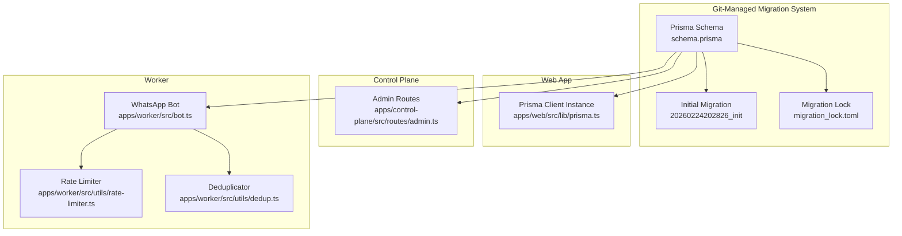
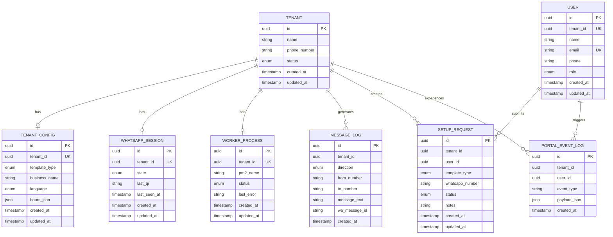
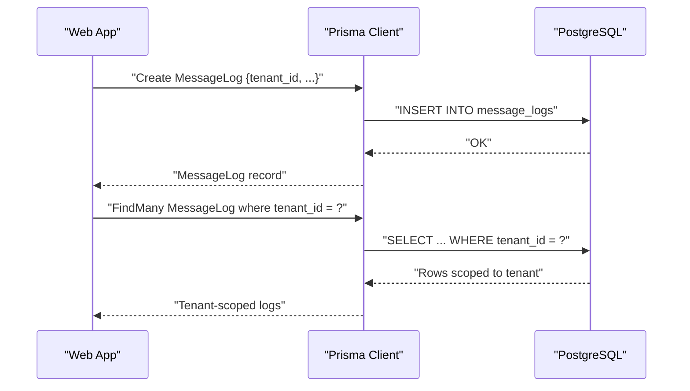
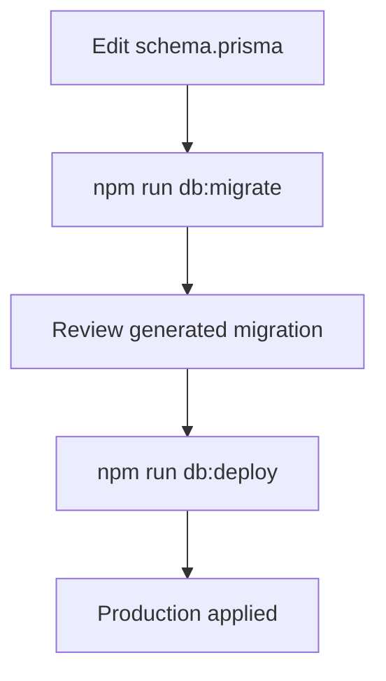
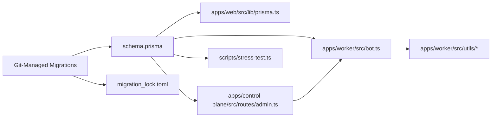

# Database Design

<cite>
**Referenced Files in This Document**
- [schema.prisma](file://packages/shared/src/prisma/schema.prisma)
- [migration.sql](file://packages/shared/src/prisma/migrations/20260224202826_init/migration.sql)
- [migration_lock.toml](file://packages/shared/src/prisma/migrations/migration_lock.toml)
- [prisma.ts](file://apps/web/src/lib/prisma.ts)
- [stress-test.ts](file://scripts/stress-test.ts)
- [package.json](file://package.json)
- [admin.ts](file://apps/control-plane/src/routes/admin.ts)
- [rate-limiter.ts](file://apps/worker/src/utils/rate-limiter.ts)
- [dedup.ts](file://apps/worker/src/utils/dedup.ts)
- [bot.ts](file://apps/worker/src/bot.ts)
</cite>

## Update Summary
**Changes Made**
- Updated to reflect migration from non-Git managed database to fully Git-managed Prisma migration system
- Added comprehensive database schema definition with seven core tables (tenants, tenant_configs, users, setup_requests, message_logs, worker_processes, whatsapp_sessions)
- Documented complete migration infrastructure with initial migration file and migration lock
- Enhanced multi-tenant isolation documentation with new tables and relationships
- Updated schema evolution workflow to show Git-managed migration process

## Table of Contents
1. [Introduction](#introduction)
2. [Migration System Overview](#migration-system-overview)
3. [Project Structure](#project-structure)
4. [Core Components](#core-components)
5. [Architecture Overview](#architecture-overview)
6. [Detailed Component Analysis](#detailed-component-analysis)
7. [Dependency Analysis](#dependency-analysis)
8. [Performance Considerations](#performance-considerations)
9. [Troubleshooting Guide](#troubleshooting-guide)
10. [Conclusion](#conclusion)
11. [Appendices](#appendices)

## Introduction
This document describes the Flow HQ database schema and data model with a focus on multi-tenant isolation, entity relationships among Tenant, TenantConfig, WhatsAppSession, MessageLog, WorkerProcess, User, SetupRequest, and PortalEventLog tables, and operational aspects such as Git-managed schema evolution, validation rules, caching strategies, and performance considerations. The database has been migrated to a fully Git-managed Prisma migration system with seven core tables providing comprehensive multi-tenant messaging capabilities.

## Migration System Overview
Flow HQ has transitioned from a non-Git managed database to a fully Git-managed Prisma migration system. The migration infrastructure includes:

- **Initial Migration**: Complete database schema creation with seven core tables
- **Migration Lock**: Ensures migration consistency across environments
- **Git Integration**: All migration files are version-controlled for traceability
- **Schema Evolution**: Automated migration generation and deployment workflow

```mermaid
graph TB
subgraph "Migration Infrastructure"
INIT["Initial Migration<br/>20260224202826_init"]
LOCK["Migration Lock<br/>migration_lock.toml"]
END
subgraph "Core Tables"
TENANT["tenants"]
CONFIG["tenant_configs"]
USER["users"]
REQUEST["setup_requests"]
LOG["message_logs"]
WORKER["worker_processes"]
SESSION["whatsapp_sessions"]
EVENT["portal_event_logs"]
END
INIT --> T --> CONFIG
INIT --> USER
INIT --> REQUEST
INIT --> LOG
INIT --> WORKER
INIT --> SESSION
INIT --> EVENT
LOCK --> INIT
```

**Diagram sources**
- [migration.sql](file://packages/shared/src/prisma/migrations/20260224202826_init/migration.sql#L25-L130)
- [migration_lock.toml](file://packages/shared/src/prisma/migrations/migration_lock.toml#L1-L3)

**Section sources**
- [schema.prisma](file://packages/shared/src/prisma/schema.prisma#L1-L178)
- [migration.sql](file://packages/shared/src/prisma/migrations/20260224202826_init/migration.sql#L1-L176)
- [migration_lock.toml](file://packages/shared/src/prisma/migrations/migration_lock.toml#L1-L3)

## Project Structure
The database schema is defined centrally in a Prisma schema file and consumed by application layers with Git-managed migrations:

- **Shared Prisma schema** defines models, enums, relations, indexes, and constraints
- **Git-managed migrations** provide version-controlled database evolution
- **Application clients** (web and worker) use a shared Prisma client instance
- **Control plane routes** coordinate worker lifecycle and tenant operations
- **Operational scripts** validate multi-tenant isolation and simulate high-throughput scenarios



**Diagram sources**
- [schema.prisma](file://packages/shared/src/prisma/schema.prisma#L1-L178)
- [migration.sql](file://packages/shared/src/prisma/migrations/20260224202826_init/migration.sql#L1-L176)
- [migration_lock.toml](file://packages/shared/src/prisma/migrations/migration_lock.toml#L1-L3)
- [prisma.ts](file://apps/web/src/lib/prisma.ts#L1-L10)
- [admin.ts](file://apps/control-plane/src/routes/admin.ts#L1-L528)
- [bot.ts](file://apps/worker/src/bot.ts#L1-L411)

**Section sources**
- [schema.prisma](file://packages/shared/src/prisma/schema.prisma#L1-L178)
- [migration.sql](file://packages/shared/src/prisma/migrations/20260224202826_init/migration.sql#L1-L176)
- [migration_lock.toml](file://packages/shared/src/prisma/migrations/migration_lock.toml#L1-L3)
- [prisma.ts](file://apps/web/src/lib/prisma.ts#L1-L10)
- [admin.ts](file://apps/control-plane/src/routes/admin.ts#L1-L528)
- [bot.ts](file://apps/worker/src/bot.ts#L1-L411)

## Core Components
This section documents the seven core entities that form the foundation of Flow HQ's multi-tenant messaging platform.

### Tenant
- **Purpose**: Represents a customer account with comprehensive multi-tenant isolation
- **Primary key**: id (UUID)
- **Fields**: name, phone_number, status (TenantStatus), timestamps
- **Relationships**: One-to-one TenantConfig, One-to-one WhatsAppSession, One-to-one WorkerProcess, One-to-many MessageLog, One-to-one User (owner), One-to-many SetupRequest
- **Notes**: Status enum supports provisioning and operational states

### TenantConfig
- **Purpose**: Stores per-tenant configuration (template type, language, business metadata)
- **Primary key**: id (UUID)
- **Foreign key**: tenant_id -> Tenant.id (unique; cascade delete)
- **Fields**: template_type (TemplateType), business_name, language (Language), hours_json (JSON), timestamps
- **Constraints**: tenant_id uniqueness ensures one config per tenant

### WhatsAppSession
- **Purpose**: Tracks session state and QR/heartbeat metadata for a tenant's WhatsApp connection
- **Primary key**: id (UUID)
- **Foreign key**: tenant_id -> Tenant.id (unique; cascade delete)
- **Fields**: state (SessionState), last_qr, last_seen_at, timestamps
- **Constraints**: tenant_id uniqueness ensures one session per tenant

### MessageLog
- **Purpose**: Captures inbound/outbound messages with tenant scoping
- **Primary key**: id (UUID)
- **Foreign key**: tenant_id -> Tenant.id (no unique constraint; multiple logs)
- **Fields**: direction (MessageDirection), from_number, to_number, message_text, wa_message_id, created_at
- **Indexes**: composite index on (tenant_id, created_at) for efficient tenant-scoped queries
- **Notes**: tenant_id is required for all logs; used extensively in isolation checks

### WorkerProcess
- **Purpose**: Tracks per-tenant worker lifecycle and status
- **Primary key**: id (UUID)
- **Foreign key**: tenant_id -> Tenant.id (unique; cascade delete)
- **Fields**: pm2_name, status (WorkerStatus), last_error, timestamps
- **Constraints**: tenant_id uniqueness ensures one worker per tenant

### User
- **Purpose**: Manages user accounts with role-based access control
- **Primary key**: id (UUID)
- **Unique constraints**: tenant_id (unique), email (unique)
- **Fields**: tenant_id, name, email, phone, role (UserRole), timestamps
- **Relationships**: One-to-many SetupRequest, One-to-many PortalEventLog
- **Notes**: Role-based access with OWNER, STAFF, ADMIN permissions

### SetupRequest
- **Purpose**: Handles tenant onboarding and setup workflow
- **Primary key**: id (UUID)
- **Foreign keys**: tenant_id -> Tenant.id, user_id -> User.id (both cascade)
- **Fields**: tenant_id, user_id, template_type, whatsapp_number, status (SetupRequestStatus), notes, timestamps
- **Constraints**: Restrict delete on tenant_id to maintain audit trail

### PortalEventLog
- **Purpose**: Logs administrative and system events for tenant monitoring
- **Primary key**: id (UUID)
- **Foreign key**: user_id -> User.id (nullable; set null on delete)
- **Fields**: tenant_id, user_id, event_type, payload_json, created_at
- **Indexes**: composite index on (tenant_id, created_at) for efficient tenant-scoped event queries

**Section sources**
- [schema.prisma](file://packages/shared/src/prisma/schema.prisma#L60-L178)

## Architecture Overview
The database enforces multi-tenant isolation via tenant_id on all transactional tables and cascading deletes from Tenant. The Git-managed migration system ensures consistent schema evolution across environments. The web app and control plane share the same Prisma client, while the worker consumes the schema for message processing and deduplication.



**Diagram sources**
- [schema.prisma](file://packages/shared/src/prisma/schema.prisma#L60-L178)

## Detailed Component Analysis

### Tenant Model
- **Identity**: UUID primary key
- **Lifecycle**: created_at and updated_at managed automatically
- **Relationships**: One-to-one with TenantConfig, WhatsAppSession, WorkerProcess; one-to-many with MessageLog and SetupRequest; optional User ownership
- **Validation**: Enforced by Prisma schema; application code should validate presence of related records when required

**Section sources**
- [schema.prisma](file://packages/shared/src/prisma/schema.prisma#L60-L76)

### TenantConfig Model
- **Uniqueness**: tenant_id is unique; enforced by relation and schema
- **Defaults**: template_type defaults to BOOKING; language defaults to SW
- **JSON field**: hours_json stores structured scheduling data
- **Cascade**: deletion of Tenant cascades to TenantConfig

**Section sources**
- [schema.prisma](file://packages/shared/src/prisma/schema.prisma#L78-L90)

### WhatsAppSession Model
- **Uniqueness**: tenant_id is unique; enforced by relation and schema
- **State machine**: state transitions tracked via SessionState enum
- **Metadata**: last_qr and last_seen_at support QR generation and health monitoring
- **Cascade**: deletion of Tenant cascades to WhatsAppSession

**Section sources**
- [schema.prisma](file://packages/shared/src/prisma/schema.prisma#L92-L103)

### MessageLog Model
- **Tenant scoping**: tenant_id is required for all rows
- **Directionality**: IN/OUT via MessageDirection enum
- **De-duplication**: wa_message_id used by worker-side deduplicator to avoid reprocessing
- **Indexing**: composite index on (tenant_id, created_at) improves tenant-scoped scans
- **Audit**: created_at auto-populated

Operational usage patterns:
- Web app writes inbound/outbound messages with tenant_id
- Worker reads tenant-scoped logs and applies rate limits and deduplication

**Section sources**
- [schema.prisma](file://packages/shared/src/prisma/schema.prisma#L105-L118)
- [dedup.ts](file://apps/worker/src/utils/dedup.ts#L1-L93)
- [rate-limiter.ts](file://apps/worker/src/utils/rate-limiter.ts#L1-L110)

### WorkerProcess Model
- **Lifecycle**: tracks worker status and last error
- **Coordination**: pm2_name aligns with process manager naming
- **Cascade**: deletion of Tenant cascades to WorkerProcess

Control plane integration:
- Admin routes manage worker start/stop and check process status

**Section sources**
- [schema.prisma](file://packages/shared/src/prisma/schema.prisma#L120-L131)
- [admin.ts](file://apps/control-plane/src/routes/admin.ts#L1-L528)

### User Model
- **Role-based access**: OWNER, STAFF, ADMIN roles with different permissions
- **Multi-tenant association**: Optional tenant_id linking users to organizations
- **Unique constraints**: email uniqueness ensures single user per email address
- **Relationships**: manages SetupRequest submissions and PortalEventLog triggers

**Section sources**
- [schema.prisma](file://packages/shared/src/prisma/schema.prisma#L133-L148)

### SetupRequest Model
- **Onboarding workflow**: Manages tenant setup requests through approval process
- **Status tracking**: SUBMITTED, REVIEWING, APPROVED, ACTIVE, REJECTED states
- **Cascade behavior**: Restrict delete on tenant_id to maintain audit trail
- **User association**: Links requests to submitting users for accountability

**Section sources**
- [schema.prisma](file://packages/shared/src/prisma/schema.prisma#L150-L164)

### PortalEventLog Model
- **Event tracking**: Comprehensive logging of portal activities
- **Tenant scoping**: tenant_id enables tenant-specific event monitoring
- **JSON payload**: flexible event data storage for various event types
- **Indexing**: composite index on (tenant_id, created_at) for efficient querying

**Section sources**
- [schema.prisma](file://packages/shared/src/prisma/schema.prisma#L166-L177)

### Multi-Tenant Data Isolation
- **Principle**: All transactional tables include tenant_id; queries filter by tenant_id to prevent cross-tenant access
- **Evidence in code**:
  - MessageLog queries enforce tenant_id filtering
  - Stress test validates isolation by scanning logs grouped by tenant_id and asserting no foreign entries
  - Tenant deletion cascades to child entities, ensuring complete cleanup
  - New PortalEventLog table maintains tenant isolation for administrative events



**Diagram sources**
- [stress-test.ts](file://scripts/stress-test.ts#L137-L163)
- [schema.prisma](file://packages/shared/src/prisma/schema.prisma#L105-L118)

**Section sources**
- [stress-test.ts](file://scripts/stress-test.ts#L137-L213)
- [schema.prisma](file://packages/shared/src/prisma/schema.prisma#L105-L118)

### Git-Managed Schema Evolution with Prisma
- **Prisma client generator and datasource configured for PostgreSQL**
- **Migration commands exposed via npm scripts** in the monorepo workspace
- **Initial migration included**: Complete schema creation with seven core tables
- **Migration lock**: Ensures migration consistency across environments
- **Typical workflow**: Edit schema.prisma, run db:migrate to generate and apply migrations, then db:deploy to production



**Diagram sources**
- [package.json](file://package.json#L9-L16)
- [schema.prisma](file://packages/shared/src/prisma/schema.prisma#L1-L8)

**Section sources**
- [package.json](file://package.json#L9-L16)
- [schema.prisma](file://packages/shared/src/prisma/schema.prisma#L1-L8)
- [migration.sql](file://packages/shared/src/prisma/migrations/20260224202826_init/migration.sql#L1-L176)

### Data Access Patterns and Caching Strategies
- **Tenant-scoped reads**: Filter by tenant_id to ensure isolation and reduce scan cost
- **Composite index**: (tenant_id, created_at) on MessageLog and PortalEventLog accelerates tenant-centric queries
- **Worker-side caching**:
  - Deduplication cache keyed by wa_message_id prevents duplicate processing
  - Rate limiter maintains per-tenant counters and windows
  - Reconnect manager applies exponential backoff to stabilize connections


**Diagram sources**
- [dedup.ts](file://apps/worker/src/utils/dedup.ts#L1-L93)
- [rate-limiter.ts](file://apps/worker/src/utils/rate-limiter.ts#L1-L110)
- [schema.prisma](file://packages/shared/src/prisma/schema.prisma#L105-L118)

**Section sources**
- [dedup.ts](file://apps/worker/src/utils/dedup.ts#L1-L93)
- [rate-limiter.ts](file://apps/worker/src/utils/rate-limiter.ts#L1-L110)
- [schema.prisma](file://packages/shared/src/prisma/schema.prisma#L105-L118)

### Data Lifecycle Management, Retention, and Archival
- **Current schema does not define explicit retention or archival policies**
- **Recommendations grounded in existing indexes and data volume characteristics**:
  - Partitioning: Consider table partitioning by created_at for MessageLog and PortalEventLog to manage growth
  - Archival: Offload older tenant-scoped logs to cold storage using tenant_id as a sharding key
  - Cleanup: Implement scheduled jobs to prune stale records per tenant policy
  - Monitoring: Track tenant log counts and growth trends to inform retention tiers

### Security Measures, Backups, and Disaster Recovery
- **Network security**: DATABASE_URL configured via environment variable; restrict access to database credentials
- **Data isolation**: tenant_id filtering and cascading deletes protect tenants from cross-access
- **Backup and DR**: Use managed PostgreSQL backups; test restore procedures regularly; maintain point-in-time recovery (PITR) enabled
- **Migration security**: Git-managed migrations provide audit trail and rollback capability

## Dependency Analysis
The following diagram shows how application layers depend on the shared Prisma schema and each other, now with Git-managed migrations.



**Diagram sources**
- [schema.prisma](file://packages/shared/src/prisma/schema.prisma#L1-L178)
- [prisma.ts](file://apps/web/src/lib/prisma.ts#L1-L10)
- [admin.ts](file://apps/control-plane/src/routes/admin.ts#L1-L528)
- [bot.ts](file://apps/worker/src/bot.ts#L1-L411)
- [stress-test.ts](file://scripts/stress-test.ts#L1-L420)
- [migration.sql](file://packages/shared/src/prisma/migrations/20260224202826_init/migration.sql#L1-L176)
- [migration_lock.toml](file://packages/shared/src/prisma/migrations/migration_lock.toml#L1-L3)

**Section sources**
- [schema.prisma](file://packages/shared/src/prisma/schema.prisma#L1-L178)
- [prisma.ts](file://apps/web/src/lib/prisma.ts#L1-L10)
- [admin.ts](file://apps/control-plane/src/routes/admin.ts#L1-L528)
- [bot.ts](file://apps/worker/src/bot.ts#L1-L411)
- [stress-test.ts](file://scripts/stress-test.ts#L1-L420)

## Performance Considerations
- **Indexing**: The composite index on (tenant_id, created_at) in MessageLog and PortalEventLog optimizes tenant-scoped queries
- **Workload patterns**:
  - High-throughput message ingestion benefits from worker-side deduplication and rate limiting
  - Exponential backoff reconnect reduces load during transient failures
- **Scalability**:
  - Use tenant_id to shard writes across replicas if needed
  - Consider read replicas for tenant report queries
  - Monitor PortalEventLog growth for administrative reporting needs

## Troubleshooting Guide
- **Multi-tenant leakage detection**:
  - Use tenant-scoped queries and group-and-validate logic to detect foreign tenant_id entries
  - The stress test demonstrates scanning all logs and verifying tenant-specific content
- **Worker lifecycle**:
  - Confirm PM2 process status via control plane routes; handle stale thresholds and restarts
- **Message processing anomalies**:
  - Inspect dedup cache stats and TTL behavior
  - Review rate limiter status per tenant to identify throttling
- **Migration issues**:
  - Check migration_lock.toml for migration consistency
  - Verify initial migration was applied successfully
  - Use Prisma introspection to compare schema with database state

**Section sources**
- [stress-test.ts](file://scripts/stress-test.ts#L137-L213)
- [admin.ts](file://apps/control-plane/src/routes/admin.ts#L1-L528)
- [dedup.ts](file://apps/worker/src/utils/dedup.ts#L51-L57)
- [rate-limiter.ts](file://apps/worker/src/utils/rate-limiter.ts#L78-L93)

## Conclusion
The Flow HQ schema establishes robust multi-tenant isolation through tenant_id scoping, enforced by Prisma relations and validated by runtime tests. The migration to a Git-managed Prisma system provides comprehensive schema evolution capabilities with seven core tables supporting complete multi-tenant messaging, user management, setup workflows, and event logging. The MessageLog model's composite index and worker-side caching (dedup, rate limiting, reconnect) support high-throughput operations. Schema evolution follows Prisma's migration workflow, and operational scripts confirm isolation correctness. For production hardening, adopt partitioning, archival, and retention strategies aligned with tenant log growth.

## Appendices

### Field Reference Summary
- **Tenant**: id, name, phone_number, status, timestamps; relationships to TenantConfig, WhatsAppSession, WorkerProcess, MessageLog, User, SetupRequest
- **TenantConfig**: id, tenant_id (unique), template_type, business_name, language, hours_json, timestamps; relation to Tenant
- **WhatsAppSession**: id, tenant_id (unique), state, last_qr, last_seen_at, timestamps; relation to Tenant
- **MessageLog**: id, tenant_id, direction, from_number, to_number, message_text, wa_message_id, created_at; composite index (tenant_id, created_at)
- **WorkerProcess**: id, tenant_id (unique), pm2_name, status, last_error, timestamps; relation to Tenant
- **User**: id, tenant_id (unique), name, email (unique), phone, role, timestamps; relationships to SetupRequest, PortalEventLog
- **SetupRequest**: id, tenant_id, user_id, template_type, whatsapp_number, status, notes, timestamps; relations to Tenant, User
- **PortalEventLog**: id, tenant_id, user_id, event_type, payload_json, created_at; composite index (tenant_id, created_at)

### Migration History
- **Initial Migration (20260224202826)**: Complete schema creation with seven core tables
- **Migration Lock**: Ensures consistent migration state across environments
- **Git Integration**: All migration files version-controlled for traceability

**Section sources**
- [schema.prisma](file://packages/shared/src/prisma/schema.prisma#L60-L178)
- [migration.sql](file://packages/shared/src/prisma/migrations/20260224202826_init/migration.sql#L25-L130)
- [migration_lock.toml](file://packages/shared/src/prisma/migrations/migration_lock.toml#L1-L3)