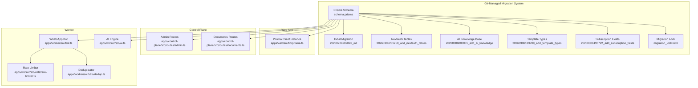
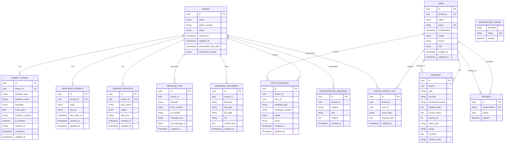
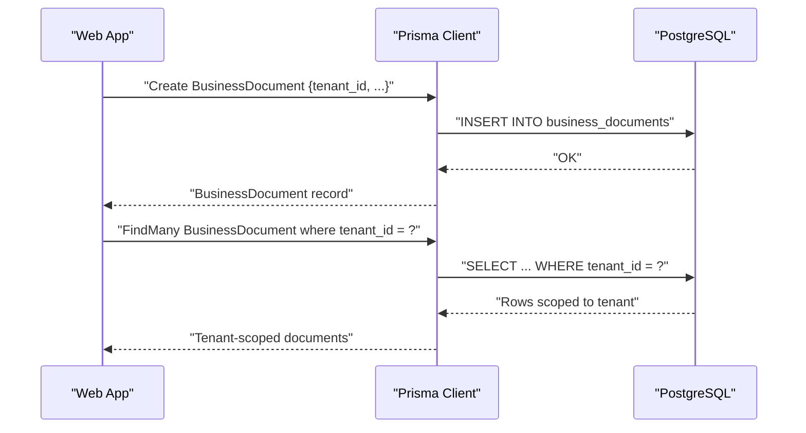
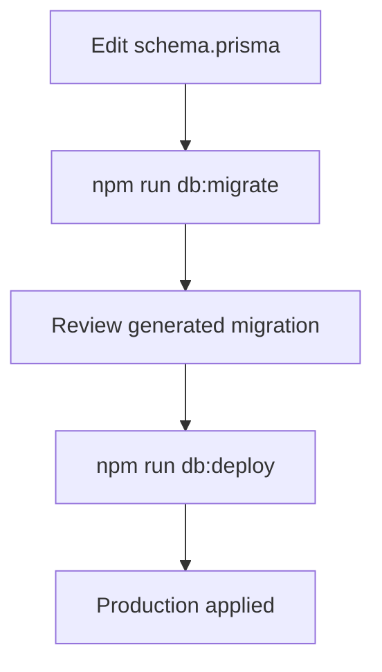
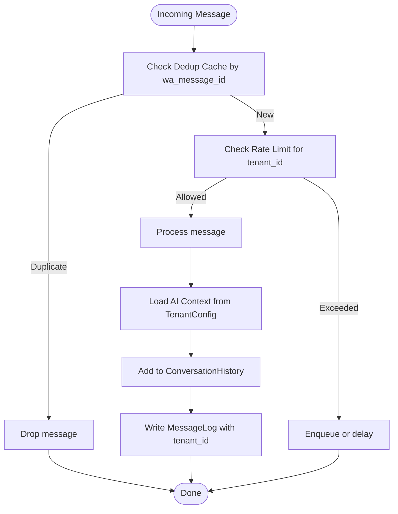
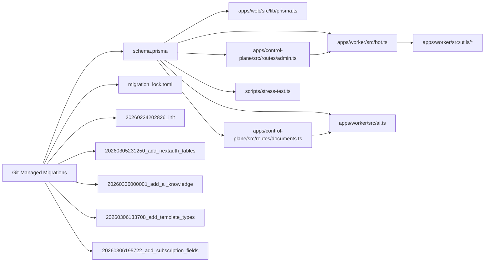

# Database Design

<cite>
**Referenced Files in This Document**
- [schema.prisma](file://packages/shared/src/prisma/schema.prisma)
- [migration.sql](file://packages/shared/src/prisma/migrations/20260224202826_init/migration.sql)
- [20260305231250_add_nextauth_tables/migration.sql](file://packages/shared/src/prisma/migrations/20260305231250_add_nextauth_tables/migration.sql)
- [20260306000001_add_ai_knowledge/migration.sql](file://packages/shared/src/prisma/migrations/20260306000001_add_ai_knowledge/migration.sql)
- [20260306133708_add_template_types/migration.sql](file://packages/shared/src/prisma/migrations/20260306133708_add_template_types/migration.sql)
- [20260306195722_add_subscription_fields/migration.sql](file://packages/shared/src/prisma/migrations/20260306195722_add_subscription_fields/migration.sql)
- [migration_lock.toml](file://packages/shared/src/prisma/migrations/migration_lock.toml)
- [prisma.ts](file://apps/web/src/lib/prisma.ts)
- [stress-test.ts](file://scripts/stress-test.ts)
- [package.json](file://package.json)
- [admin.ts](file://apps/control-plane/src/routes/admin.ts)
- [rate-limiter.ts](file://apps/worker/src/utils/rate-limiter.ts)
- [dedup.ts](file://apps/worker/src/utils/dedup.ts)
- [bot.ts](file://apps/worker/src/bot.ts)
- [documents.ts](file://apps/control-plane/src/routes/documents.ts)
- [ai.ts](file://apps/worker/src/ai.ts)
- [index.ts](file://apps/worker/src/templates/index.ts)
</cite>

## Update Summary
**Changes Made**
- Updated to reflect comprehensive database schema enhancements including NextAuth tables for authentication
- Added AI knowledge base structures with business_documents and conversation_messages tables
- Expanded template type definitions with new enum values: REAL_ESTATE, RESTAURANT, HEALTHCARE
- Added subscription field additions to Tenant model for billing and payment tracking
- Enhanced Prisma schema with comprehensive authentication support and AI capabilities
- Updated migration system to include five distinct enhancement migrations

## Table of Contents
1. [Introduction](#introduction)
2. [Migration System Overview](#migration-system-overview)
3. [Project Structure](#project-structure)
4. [Core Components](#core-components)
5. [Architecture Overview](#architecture-overview)
6. [Detailed Component Analysis](#detailed-component-analysis)
7. [Dependency Analysis](#dependency-analysis)
8. [Performance Considerations](#performance-considerations)
9. [Troubleshooting Guide](#troubleshooting-guide)
10. [Conclusion](#conclusion)
11. [Appendices](#appendices)

## Introduction
This document describes the Flow HQ database schema and data model with a focus on multi-tenant isolation, entity relationships among Tenant, TenantConfig, WhatsAppSession, MessageLog, WorkerProcess, User, SetupRequest, PortalEventLog, BusinessDocument, and ConversationMessage tables, and operational aspects such as Git-managed schema evolution, validation rules, caching strategies, and performance considerations. The database has been enhanced with comprehensive authentication support, AI knowledge base capabilities, expanded template types, and subscription management features.

## Migration System Overview
Flow HQ has transitioned from a non-Git managed database to a fully Git-managed Prisma migration system with five comprehensive enhancement stages:

- **Initial Migration**: Complete database schema creation with eight core tables and comprehensive enum definitions
- **NextAuth Tables**: Authentication infrastructure with user accounts, sessions, and verification tokens
- **AI Knowledge Base**: Business document management and conversation history tracking
- **Enhanced Template Types**: Expanded template categories for specialized business domains
- **Subscription Fields**: Billing and payment tracking capabilities
- **Migration Lock**: Ensures migration consistency across environments
- **Git Integration**: All migration files are version-controlled for traceability

```mermaid
graph TB
subgraph "Migration Infrastructure"
INIT["Initial Migration<br/>20260224202826_init"]
NEXTAUTH["NextAuth Tables<br/>20260305231250_add_nextauth_tables"]
AI["AI Knowledge Base<br/>20260306000001_add_ai_knowledge"]
TEMPLATES["Template Types<br/>20260306133708_add_template_types"]
SUBSCRIPTION["Subscription Fields<br/>20260306195722_add_subscription_fields"]
LOCK["Migration Lock<br/>migration_lock.toml"]
END
subgraph "Core Tables"
TENANT["tenants"]
CONFIG["tenant_configs"]
USER["users"]
REQUEST["setup_requests"]
LOG["message_logs"]
WORKER["worker_processes"]
SESSION["whatsapp_sessions"]
EVENT["portal_event_logs"]
BUSINESS_DOC["business_documents"]
CONVERSATION_MSG["conversation_messages"]
END
INIT --> NEXTAUTH --> AI --> TEMPLATES --> SUBSCRIPTION
INIT --> T --> CONFIG
INIT --> USER
INIT --> REQUEST
INIT --> LOG
INIT --> WORKER
INIT --> SESSION
INIT --> EVENT
NEXTAUTH --> USER
AI --> BUSINESS_DOC
AI --> CONVERSATION_MSG
SUBSCRIPTION --> TENANT
LOCK --> INIT
```

**Diagram sources**
- [migration.sql](file://packages/shared/src/prisma/migrations/20260224202826_init/migration.sql#L25-L130)
- [20260305231250_add_nextauth_tables/migration.sql](file://packages/shared/src/prisma/migrations/20260305231250_add_nextauth_tables/migration.sql#L1-L57)
- [20260306000001_add_ai_knowledge/migration.sql](file://packages/shared/src/prisma/migrations/20260306000001_add_ai_knowledge/migration.sql#L1-L45)
- [20260306133708_add_template_types/migration.sql](file://packages/shared/src/prisma/migrations/20260306133708_add_template_types/migration.sql#L1-L12)
- [20260306195722_add_subscription_fields/migration.sql](file://packages/shared/src/prisma/migrations/20260306195722_add_subscription_fields/migration.sql#L1-L4)
- [migration_lock.toml](file://packages/shared/src/prisma/migrations/migration_lock.toml#L1-L3)

**Section sources**
- [schema.prisma](file://packages/shared/src/prisma/schema.prisma#L1-L261)
- [migration.sql](file://packages/shared/src/prisma/migrations/20260224202826_init/migration.sql#L1-L176)
- [20260305231250_add_nextauth_tables/migration.sql](file://packages/shared/src/prisma/migrations/20260305231250_add_nextauth_tables/migration.sql#L1-L57)
- [20260306000001_add_ai_knowledge/migration.sql](file://packages/shared/src/prisma/migrations/20260306000001_add_ai_knowledge/migration.sql#L1-L45)
- [20260306133708_add_template_types/migration.sql](file://packages/shared/src/prisma/migrations/20260306133708_add_template_types/migration.sql#L1-L12)
- [20260306195722_add_subscription_fields/migration.sql](file://packages/shared/src/prisma/migrations/20260306195722_add_subscription_fields/migration.sql#L1-L4)
- [migration_lock.toml](file://packages/shared/src/prisma/migrations/migration_lock.toml#L1-L3)

## Project Structure
The database schema is defined centrally in a Prisma schema file and consumed by application layers with Git-managed migrations:

- **Shared Prisma schema** defines models, enums, relations, indexes, and constraints
- **Git-managed migrations** provide version-controlled database evolution with five enhancement stages
- **Application clients** (web and worker) use a shared Prisma client instance
- **Control plane routes** coordinate worker lifecycle, document management, and tenant operations
- **Operational scripts** validate multi-tenant isolation and simulate high-throughput scenarios

```mermaid
graph TB
subgraph "Git-Managed Migration System"
PRISMA["Prisma Schema<br/>schema.prisma"]
MIG_INIT["Initial Migration<br/>20260224202826_init"]
MIG_NEXTAUTH["NextAuth Tables<br/>20260305231250_add_nextauth_tables"]
MIG_AI["AI Knowledge Base<br/>20260306000001_add_ai_knowledge"]
MIG_TEMPLATES["Template Types<br/>20260306133708_add_template_types"]
MIG_SUBSCRIPTION["Subscription Fields<br/>20260306195722_add_subscription_fields"]
MIG_LOCK["Migration Lock<br/>migration_lock.toml"]
end
subgraph "Web App"
WEB_LIB["Prisma Client Instance<br/>apps/web/src/lib/prisma.ts"]
end
subgraph "Control Plane"
ADMIN_RT["Admin Routes<br/>apps/control-plane/src/routes/admin.ts"]
DOC_RT["Documents Routes<br/>apps/control-plane/src/routes/documents.ts"]
end
subgraph "Worker"
BOT["WhatsApp Bot<br/>apps/worker/src/bot.ts"]
AI["AI Engine<br/>apps/worker/src/ai.ts"]
RL["Rate Limiter<br/>apps/worker/src/utils/rate-limiter.ts"]
DEDUP["Deduplicator<br/>apps/worker/src/utils/dedup.ts"]
end
PRISMA --> MIG_INIT
PRISMA --> MIG_NEXTAUTH
PRISMA --> MIG_AI
PRISMA --> MIG_TEMPLATES
PRISMA --> MIG_SUBSCRIPTION
PRISMA --> MIG_LOCK
PRISMA --> WEB_LIB
PRISMA --> ADMIN_RT
PRISMA --> DOC_RT
PRISMA --> BOT
PRISMA --> AI
BOT --> RL
BOT --> DEDUP
```

**Diagram sources**
- [schema.prisma](file://packages/shared/src/prisma/schema.prisma#L1-L261)
- [migration.sql](file://packages/shared/src/prisma/migrations/20260224202826_init/migration.sql#L1-L176)
- [20260305231250_add_nextauth_tables/migration.sql](file://packages/shared/src/prisma/migrations/20260305231250_add_nextauth_tables/migration.sql#L1-L57)
- [20260306000001_add_ai_knowledge/migration.sql](file://packages/shared/src/prisma/migrations/20260306000001_add_ai_knowledge/migration.sql#L1-L45)
- [20260306133708_add_template_types/migration.sql](file://packages/shared/src/prisma/migrations/20260306133708_add_template_types/migration.sql#L1-L12)
- [20260306195722_add_subscription_fields/migration.sql](file://packages/shared/src/prisma/migrations/20260306195722_add_subscription_fields/migration.sql#L1-L4)
- [migration_lock.toml](file://packages/shared/src/prisma/migrations/migration_lock.toml#L1-L3)
- [prisma.ts](file://apps/web/src/lib/prisma.ts#L1-L10)
- [admin.ts](file://apps/control-plane/src/routes/admin.ts#L1-L528)
- [documents.ts](file://apps/control-plane/src/routes/documents.ts#L1-L212)
- [bot.ts](file://apps/worker/src/bot.ts#L1-L411)
- [ai.ts](file://apps/worker/src/ai.ts#L1-L100)

**Section sources**
- [schema.prisma](file://packages/shared/src/prisma/schema.prisma#L1-L261)
- [migration.sql](file://packages/shared/src/prisma/migrations/20260224202826_init/migration.sql#L1-L176)
- [20260305231250_add_nextauth_tables/migration.sql](file://packages/shared/src/prisma/migrations/20260305231250_add_nextauth_tables/migration.sql#L1-L57)
- [20260306000001_add_ai_knowledge/migration.sql](file://packages/shared/src/prisma/migrations/20260306000001_add_ai_knowledge/migration.sql#L1-L45)
- [20260306133708_add_template_types/migration.sql](file://packages/shared/src/prisma/migrations/20260306133708_add_template_types/migration.sql#L1-L12)
- [20260306195722_add_subscription_fields/migration.sql](file://packages/shared/src/prisma/migrations/20260306195722_add_subscription_fields/migration.sql#L1-L4)
- [migration_lock.toml](file://packages/shared/src/prisma/migrations/migration_lock.toml#L1-L3)
- [prisma.ts](file://apps/web/src/lib/prisma.ts#L1-L10)
- [admin.ts](file://apps/control-plane/src/routes/admin.ts#L1-L528)
- [documents.ts](file://apps/control-plane/src/routes/documents.ts#L1-L212)
- [bot.ts](file://apps/worker/src/bot.ts#L1-L411)
- [ai.ts](file://apps/worker/src/ai.ts#L1-L100)

## Core Components
This section documents the ten core entities that form the foundation of Flow HQ's enhanced multi-tenant messaging platform with comprehensive authentication, AI capabilities, and subscription management.

### Enhanced Enum Definitions
The schema defines comprehensive enum types for domain-specific data validation:

**TenantStatus**: NEW, QR_PENDING, ACTIVE, PAUSED, ERROR
**TemplateType**: BOOKING, ECOMMERCE, SUPPORT, REAL_ESTATE, RESTAURANT, HEALTHCARE
**Language**: SW, EN
**SessionState**: DISCONNECTED, QR_READY, CONNECTED
**MessageDirection**: IN, OUT
**WorkerStatus**: RUNNING, STOPPED, ERROR
**UserRole**: OWNER, STAFF, ADMIN
**SetupRequestStatus**: SUBMITTED, REVIEWING, APPROVED, ACTIVE, REJECTED

### Tenant
- **Purpose**: Represents a customer account with comprehensive multi-tenant isolation and subscription management
- **Primary key**: id (UUID)
- **Fields**: name, phone_number, status (TenantStatus), timestamps, subscription_end_date, subscription_status
- **Relationships**: One-to-one TenantConfig, One-to-one WhatsAppSession, One-to-one WorkerProcess, One-to-many MessageLog, One-to-one User (owner), One-to-many SetupRequest, One-to-many BusinessDocument, One-to-many ConversationMessage
- **Notes**: Enhanced with subscription tracking fields for billing and payment management

### TenantConfig
- **Purpose**: Stores per-tenant configuration with AI knowledge base capabilities
- **Primary key**: id (UUID)
- **Foreign key**: tenant_id -> Tenant.id (unique; cascade delete)
- **Fields**: template_type (TemplateType), business_name, language (Language), hours_json (JSON), business_context (String), ai_enabled (Boolean), website_url (String), timestamps
- **Constraints**: tenant_id uniqueness ensures one config per tenant
- **AI Features**: business_context aggregates knowledge from uploaded documents and website URLs

### WhatsAppSession
- **Purpose**: Tracks session state and QR/heartbeat metadata for a tenant's WhatsApp connection
- **Primary key**: id (UUID)
- **Foreign key**: tenant_id -> Tenant.id (unique; cascade delete)
- **Fields**: state (SessionState), last_qr, last_seen_at, timestamps
- **Constraints**: tenant_id uniqueness ensures one session per tenant

### MessageLog
- **Purpose**: Captures inbound/outbound messages with tenant scoping
- **Primary key**: id (UUID)
- **Foreign key**: tenant_id -> Tenant.id (no unique constraint; multiple logs)
- **Fields**: direction (MessageDirection), from_number, to_number, message_text, wa_message_id, created_at
- **Indexes**: composite index on (tenant_id, created_at) for efficient tenant-scoped queries
- **Notes**: tenant_id is required for all logs; used extensively in isolation checks

### WorkerProcess
- **Purpose**: Tracks per-tenant worker lifecycle and status
- **Primary key**: id (UUID)
- **Foreign key**: tenant_id -> Tenant.id (unique; cascade delete)
- **Fields**: pm2_name, status (WorkerStatus), last_error, timestamps
- **Constraints**: tenant_id uniqueness ensures one worker per tenant

### User
- **Purpose**: Manages user accounts with role-based access control and NextAuth authentication
- **Primary key**: id (UUID)
- **Unique constraints**: tenant_id (unique), email (unique)
- **Fields**: tenant_id, name, email, emailVerified, image, phone, role (UserRole), timestamps
- **Relationships**: One-to-many SetupRequest, One-to-many PortalEventLog, One-to-many Account, One-to-many Session
- **Authentication**: Enhanced with NextAuth support including OAuth accounts and session management

### SetupRequest
- **Purpose**: Handles tenant onboarding and setup workflow
- **Primary key**: id (UUID)
- **Foreign keys**: tenant_id -> Tenant.id, user_id -> User.id (both cascade)
- **Fields**: tenant_id, user_id, template_type, whatsapp_number, status (SetupRequestStatus), notes, timestamps
- **Constraints**: Restrict delete on tenant_id to maintain audit trail

### PortalEventLog
- **Purpose**: Logs administrative and system events for tenant monitoring
- **Primary key**: id (UUID)
- **Foreign key**: user_id -> User.id (nullable; set null on delete)
- **Fields**: tenant_id, user_id, event_type, payload_json, created_at
- **Indexes**: composite index on (tenant_id, created_at) for efficient tenant-scoped event queries

### BusinessDocument
- **Purpose**: Stores uploaded business documents for AI knowledge base
- **Primary key**: id (UUID)
- **Foreign key**: tenant_id -> Tenant.id (cascade delete)
- **Fields**: tenant_id, filename, file_type, file_path, url, content_text, created_at
- **Indexes**: index on (tenant_id) for efficient tenant-scoped document queries
- **AI Integration**: Provides context for AI-powered responses and customer service automation

### ConversationMessage
- **Purpose**: Tracks conversation history for AI-powered chat interactions
- **Primary key**: id (UUID)
- **Foreign key**: tenant_id -> Tenant.id (cascade delete)
- **Fields**: tenant_id, contact, role, content, created_at
- **Indexes**: composite index on (tenant_id, contact, created_at) for efficient conversation queries
- **AI Context**: Maintains conversation history for context-aware AI responses

### NextAuth Tables
- **Account**: OAuth account associations with provider credentials
- **Session**: User session management with expiration tracking
- **VerificationToken**: Token-based email verification system

**Section sources**
- [schema.prisma](file://packages/shared/src/prisma/schema.prisma#L10-L61)
- [schema.prisma](file://packages/shared/src/prisma/schema.prisma#L63-L261)
- [20260305231250_add_nextauth_tables/migration.sql](file://packages/shared/src/prisma/migrations/20260305231250_add_nextauth_tables/migration.sql#L1-L57)
- [20260306000001_add_ai_knowledge/migration.sql](file://packages/shared/src/prisma/migrations/20260306000001_add_ai_knowledge/migration.sql#L1-L45)

## Architecture Overview
The database enforces multi-tenant isolation via tenant_id on all transactional tables and cascading deletes from Tenant. The enhanced Git-managed migration system ensures consistent schema evolution across environments with comprehensive authentication, AI capabilities, and subscription management. The web app, control plane, and worker consume the unified schema for message processing, document management, and AI-powered conversations.

```mermaid
erDiagram
TENANT {
uuid id PK
string name
string phone_number
enum status
timestamp created_at
timestamp updated_at
timestamp subscription_end_date
string subscription_status
}
TENANT_CONFIG {
uuid id PK
uuid tenant_id UK
enum template_type
string business_name
enum language
json hours_json
string business_context
boolean ai_enabled
string website_url
timestamp created_at
timestamp updated_at
}
WHATSAPP_SESSION {
uuid id PK
uuid tenant_id UK
enum state
string last_qr
timestamp last_seen_at
timestamp created_at
timestamp updated_at
}
MESSAGE_LOG {
uuid id PK
uuid tenant_id
enum direction
string from_number
string to_number
string message_text
string wa_message_id
timestamp created_at
}
WORKER_PROCESS {
uuid id PK
uuid tenant_id UK
string pm2_name
enum status
string last_error
timestamp created_at
timestamp updated_at
}
USER {
uuid id PK
uuid tenant_id UK
string name
string email UK
timestamp emailVerified
string image
string phone
enum role
timestamp created_at
timestamp updated_at
}
SETUP_REQUEST {
uuid id PK
uuid tenant_id
uuid user_id
enum template_type
string whatsapp_number
enum status
string notes
timestamp created_at
timestamp updated_at
}
PORTAL_EVENT_LOG {
uuid id PK
uuid tenant_id
uuid user_id
string event_type
json payload_json
timestamp created_at
}
BUSINESS_DOCUMENT {
uuid id PK
uuid tenant_id
string filename
string file_type
string file_path
string url
text content_text
timestamp created_at
}
CONVERSATION_MESSAGE {
uuid id PK
uuid tenant_id
string contact
string role
text content
timestamp created_at
}
ACCOUNT {
uuid id PK
uuid userId
string type
string provider
string providerAccountId
text refresh_token
text access_token
int expires_at
string token_type
string scope
text id_token
string session_state
}
SESSION {
uuid id PK
string sessionToken UK
uuid userId
datetime expires
}
VERIFICATION_TOKEN {
string identifier
string token UK
datetime expires
}
TENANT ||--o| TENANT_CONFIG : "has"
TENANT ||--o| WHATSAPP_SESSION : "has"
TENANT ||--o| WORKER_PROCESS : "has"
TENANT ||--o{ MESSAGE_LOG : "generates"
TENANT ||--o{ SETUP_REQUEST : "creates"
TENANT ||--o{ BUSINESS_DOCUMENT : "owns"
TENANT ||--o{ CONVERSATION_MESSAGE : "participates"
USER ||--o{ SETUP_REQUEST : "submits"
USER ||--o{ PORTAL_EVENT_LOG : "triggers"
USER ||--o{ ACCOUNT : "has"
USER ||--o{ SESSION : "manages"
TENANT ||--o{ PORTAL_EVENT_LOG : "experiences"
ACCOUNT }o--|| USER : "belongs_to"
SESSION }o--|| USER : "belongs_to"
```

**Diagram sources**
- [schema.prisma](file://packages/shared/src/prisma/schema.prisma#L63-L261)
- [20260305231250_add_nextauth_tables/migration.sql](file://packages/shared/src/prisma/migrations/20260305231250_add_nextauth_tables/migration.sql#L5-L57)
- [20260306000001_add_ai_knowledge/migration.sql](file://packages/shared/src/prisma/migrations/20260306000001_add_ai_knowledge/migration.sql#L7-L45)

## Detailed Component Analysis

### Enhanced Tenant Model
- **Identity**: UUID primary key
- **Lifecycle**: created_at and updated_at managed automatically
- **Subscription Management**: subscription_end_date and subscription_status fields for billing tracking
- **Relationships**: One-to-one with TenantConfig, WhatsAppSession, WorkerProcess; one-to-many with MessageLog, SetupRequest, BusinessDocument, ConversationMessage; optional User ownership
- **Validation**: Enforced by Prisma schema; application code should validate presence of related records when required

**Updated** Added subscription tracking fields for billing and payment management

**Section sources**
- [schema.prisma](file://packages/shared/src/prisma/schema.prisma#L63-L84)

### Enhanced TenantConfig Model
- **Uniqueness**: tenant_id is unique; enforced by relation and schema
- **Defaults**: template_type defaults to BOOKING; language defaults to SW
- **JSON field**: hours_json stores structured scheduling data
- **AI Knowledge Base**: business_context aggregates content from uploaded documents and website URLs
- **AI Controls**: ai_enabled flag and website_url for external knowledge sources
- **Cascade**: deletion of Tenant cascades to TenantConfig

**Updated** Added AI knowledge base fields and enhanced business context management

**Section sources**
- [schema.prisma](file://packages/shared/src/prisma/schema.prisma#L86-L101)

### NextAuth Authentication Enhancement
- **User Enhancement**: Added emailVerified and image fields for NextAuth compatibility
- **Account Model**: OAuth account associations with provider credentials and token management
- **Session Model**: User session management with secure session tokens and expiration
- **VerificationToken**: Token-based email verification system
- **Relationships**: Users can have multiple accounts and sessions; cascading deletes maintain referential integrity

**New** Comprehensive authentication infrastructure with NextAuth support

**Section sources**
- [schema.prisma](file://packages/shared/src/prisma/schema.prisma#L144-L203)
- [20260305231250_add_nextauth_tables/migration.sql](file://packages/shared/src/prisma/migrations/20260305231250_add_nextauth_tables/migration.sql#L1-L57)

### AI Knowledge Base Implementation
- **BusinessDocument Model**: Stores uploaded documents with extracted text content
- **ConversationMessage Model**: Tracks conversation history for context-aware AI responses
- **Business Context Aggregation**: Automatic rebuilding of business_context from all tenant documents
- **Website Integration**: Supports external website URLs as knowledge sources
- **Indexing**: Optimized indexes for tenant-scoped document and conversation queries

**New** AI-powered knowledge base with document management and conversation tracking

**Section sources**
- [schema.prisma](file://packages/shared/src/prisma/schema.prisma#L234-L260)
- [20260306000001_add_ai_knowledge/migration.sql](file://packages/shared/src/prisma/migrations/20260306000001_add_ai_knowledge/migration.sql#L1-L45)
- [documents.ts](file://apps/control-plane/src/routes/documents.ts#L75-L212)
- [ai.ts](file://apps/worker/src/ai.ts#L35-L47)

### Enhanced Template Types
- **Expanded Categories**: Added REAL_ESTATE, RESTAURANT, HEALTHCARE template types
- **Template Context**: Specialized business context for each template category
- **AI Responses**: Category-specific response handling and conversation flows
- **Template Selection**: Enhanced UI with six template options for different business domains

**Updated** Extended template system with specialized business categories

**Section sources**
- [schema.prisma](file://packages/shared/src/prisma/schema.prisma#L18-L25)
- [20260306133708_add_template_types/migration.sql](file://packages/shared/src/prisma/migrations/20260306133708_add_template_types/migration.sql#L1-L12)
- [index.ts](file://apps/worker/src/templates/index.ts#L1-L79)

### Subscription Management
- **Billing Tracking**: subscription_end_date for payment deadline tracking
- **Status Management**: subscription_status with ACTIVE and CANCELLED states
- **Control Plane Integration**: Administrative interface for subscription management
- **Visual Indicators**: Color-coded badges for subscription status display

**New** Subscription and billing management capabilities

**Section sources**
- [schema.prisma](file://packages/shared/src/prisma/schema.prisma#L71-L72)
- [20260306195722_add_subscription_fields/migration.sql](file://packages/shared/src/prisma/migrations/20260306195722_add_subscription_fields/migration.sql#L1-L4)
- [admin.ts](file://apps/control-plane/src/routes/admin.ts#L289-L358)

### Multi-Tenant Data Isolation
- **Principle**: All transactional tables include tenant_id; queries filter by tenant_id to prevent cross-tenant access
- **Enhanced Coverage**: BusinessDocument and ConversationMessage tables maintain tenant isolation
- **Evidence in code**:
  - MessageLog queries enforce tenant_id filtering
  - BusinessDocument queries use tenant_id for document access control
  - ConversationMessage queries scope conversations by tenant and contact
  - Stress test validates isolation by scanning logs grouped by tenant_id and asserting no foreign entries
  - Tenant deletion cascades to child entities, ensuring complete cleanup
  - New PortalEventLog table maintains tenant isolation for administrative events

```mermaid
sequenceDiagram
participant Web as "Web App"
participant Prisma as "Prisma Client"
participant DB as "PostgreSQL"
Web->>Prisma : "Create BusinessDocument {tenant_id, ...}"
Prisma->>DB : "INSERT INTO business_documents"
DB-->>Prisma : "OK"
Prisma-->>Web : "BusinessDocument record"
Web->>Prisma : "FindMany BusinessDocument where tenant_id = ?"
Prisma->>DB : "SELECT ... WHERE tenant_id = ?"
DB-->>Prisma : "Rows scoped to tenant"
Prisma-->>Web : "Tenant-scoped documents"
```

**Diagram sources**
- [stress-test.ts](file://scripts/stress-test.ts#L137-L163)
- [schema.prisma](file://packages/shared/src/prisma/schema.prisma#L234-L247)
- [documents.ts](file://apps/control-plane/src/routes/documents.ts#L75-L102)

**Section sources**
- [stress-test.ts](file://scripts/stress-test.ts#L137-L213)
- [schema.prisma](file://packages/shared/src/prisma/schema.prisma#L234-L247)
- [documents.ts](file://apps/control-plane/src/routes/documents.ts#L75-L102)

### Git-Managed Schema Evolution with Prisma
- **Prisma client generator and datasource configured for PostgreSQL**
- **Migration commands exposed via npm scripts** in the monorepo workspace
- **Five enhancement migrations**: Initial schema, NextAuth tables, AI knowledge base, template types, subscription fields
- **Migration lock**: Ensures migration consistency across environments
- **Typical workflow**: Edit schema.prisma, run db:migrate to generate and apply migrations, then db:deploy to production

```mermaid
flowchart TD
A["Edit schema.prisma"] --> B["npm run db:migrate"]
B --> C["Review generated migration"]
C --> D["npm run db:deploy"]
D --> E["Production applied"]
```

**Diagram sources**
- [package.json](file://package.json#L9-L16)
- [schema.prisma](file://packages/shared/src/prisma/schema.prisma#L1-L8)

**Section sources**
- [package.json](file://package.json#L9-L16)
- [schema.prisma](file://packages/shared/src/prisma/schema.prisma#L1-L8)
- [migration.sql](file://packages/shared/src/prisma/migrations/20260224202826_init/migration.sql#L1-L176)
- [20260305231250_add_nextauth_tables/migration.sql](file://packages/shared/src/prisma/migrations/20260305231250_add_nextauth_tables/migration.sql#L1-L57)
- [20260306000001_add_ai_knowledge/migration.sql](file://packages/shared/src/prisma/migrations/20260306000001_add_ai_knowledge/migration.sql#L1-L45)
- [20260306133708_add_template_types/migration.sql](file://packages/shared/src/prisma/migrations/20260306133708_add_template_types/migration.sql#L1-L12)
- [20260306195722_add_subscription_fields/migration.sql](file://packages/shared/src/prisma/migrations/20260306195722_add_subscription_fields/migration.sql#L1-L4)

### Data Access Patterns and Caching Strategies
- **Tenant-scoped reads**: Filter by tenant_id to ensure isolation and reduce scan cost
- **Composite index**: (tenant_id, created_at) on MessageLog and PortalEventLog accelerates tenant-centric queries
- **AI Knowledge Base**: BusinessDocument content_text cached in TenantConfig.business_context for efficient AI access
- **Worker-side caching**:
  - Deduplication cache keyed by wa_message_id prevents duplicate processing
  - Rate limiter maintains per-tenant counters and windows
  - Reconnect manager applies exponential backoff to stabilize connections
  - ConversationMessage history cached for context-aware AI responses

```mermaid
flowchart TD
Start(["Incoming Message"]) --> CheckDup["Check Dedup Cache by wa_message_id"]
CheckDup --> |Duplicate| Drop["Drop message"]
CheckDup --> |New| RateLimit["Check Rate Limit for tenant_id"]
RateLimit --> |Allowed| Process["Process message"]
RateLimit --> |Exceeded| Queue["Enqueue or delay"]
Process --> AIContext["Load AI Context from TenantConfig"]
AIContext --> Conversation["Add to ConversationHistory"]
Conversation --> WriteLog["Write MessageLog with tenant_id"]
WriteLog --> End(["Done"])
Drop --> End
Queue --> End
```

**Diagram sources**
- [dedup.ts](file://apps/worker/src/utils/dedup.ts#L1-L93)
- [rate-limiter.ts](file://apps/worker/src/utils/rate-limiter.ts#L1-L110)
- [schema.prisma](file://packages/shared/src/prisma/schema.prisma#L116-L129)
- [ai.ts](file://apps/worker/src/ai.ts#L35-L47)
- [index.ts](file://apps/worker/src/templates/index.ts#L1-L79)

**Section sources**
- [dedup.ts](file://apps/worker/src/utils/dedup.ts#L1-L93)
- [rate-limiter.ts](file://apps/worker/src/utils/rate-limiter.ts#L1-L110)
- [schema.prisma](file://packages/shared/src/prisma/schema.prisma#L116-L129)
- [ai.ts](file://apps/worker/src/ai.ts#L35-L47)
- [index.ts](file://apps/worker/src/templates/index.ts#L1-L79)

### Data Lifecycle Management, Retention, and Archival
- **BusinessDocument Lifecycle**: Documents stored with extracted text content; automatic aggregation into business_context
- **ConversationMessage Retention**: Conversation history maintained for context-aware AI responses
- **Subscription-based Retention**: Tenant subscription status affects access to premium features
- **Recommendations grounded in existing indexes and data volume characteristics**:
  - Partitioning: Consider table partitioning by created_at for MessageLog, PortalEventLog, BusinessDocument, and ConversationMessage
  - Archival: Offload older tenant-scoped logs and conversation history to cold storage using tenant_id as a sharding key
  - Cleanup: Implement scheduled jobs to prune stale records per tenant subscription tier
  - Monitoring: Track tenant log counts, document sizes, and conversation volumes to inform retention tiers

### Security Measures, Backups, and Disaster Recovery
- **Network security**: DATABASE_URL configured via environment variable; restrict access to database credentials
- **Data isolation**: tenant_id filtering and cascading deletes protect tenants from cross-access
- **Authentication security**: NextAuth provides secure OAuth integration with token management and session handling
- **AI data protection**: BusinessDocument content stored securely with tenant access controls
- **Backup and DR**: Use managed PostgreSQL backups; test restore procedures regularly; maintain point-in-time recovery (PITR) enabled
- **Migration security**: Git-managed migrations provide audit trail and rollback capability
- **Subscription security**: Payment end dates and status tracked for billing compliance

## Dependency Analysis
The following diagram shows how application layers depend on the enhanced Prisma schema and each other, now with comprehensive Git-managed migrations.

```mermaid
graph LR
SCHEMA["schema.prisma"] --> WEB["apps/web/src/lib/prisma.ts"]
SCHEMA --> CTRL["apps/control-plane/src/routes/admin.ts"]
SCHEMA --> CTRL_DOC["apps/control-plane/src/routes/documents.ts"]
SCHEMA --> BOT["apps/worker/src/bot.ts"]
SCHEMA --> AI["apps/worker/src/ai.ts"]
SCHEMA --> TEST["scripts/stress-test.ts"]
CTRL --> BOT
CTRL_DOC --> AI
BOT --> UTILS["apps/worker/src/utils/*"]
MIGRATION["Git-Managed Migrations"] --> SCHEMA
MIGRATION --> LOCK["migration_lock.toml"]
MIGRATION --> INIT["20260224202826_init"]
MIGRATION --> NEXTAUTH["20260305231250_add_nextauth_tables"]
MIGRATION --> AI_MIG["20260306000001_add_ai_knowledge"]
MIGRATION --> TEMPLATES["20260306133708_add_template_types"]
MIGRATION --> SUBSCRIPTION["20260306195722_add_subscription_fields"]
```

**Diagram sources**
- [schema.prisma](file://packages/shared/src/prisma/schema.prisma#L1-L261)
- [prisma.ts](file://apps/web/src/lib/prisma.ts#L1-L10)
- [admin.ts](file://apps/control-plane/src/routes/admin.ts#L1-L528)
- [documents.ts](file://apps/control-plane/src/routes/documents.ts#L1-L212)
- [bot.ts](file://apps/worker/src/bot.ts#L1-L411)
- [ai.ts](file://apps/worker/src/ai.ts#L1-L100)
- [stress-test.ts](file://scripts/stress-test.ts#L1-L420)
- [migration.sql](file://packages/shared/src/prisma/migrations/20260224202826_init/migration.sql#L1-L176)
- [20260305231250_add_nextauth_tables/migration.sql](file://packages/shared/src/prisma/migrations/20260305231250_add_nextauth_tables/migration.sql#L1-L57)
- [20260306000001_add_ai_knowledge/migration.sql](file://packages/shared/src/prisma/migrations/20260306000001_add_ai_knowledge/migration.sql#L1-L45)
- [20260306133708_add_template_types/migration.sql](file://packages/shared/src/prisma/migrations/20260306133708_add_template_types/migration.sql#L1-L12)
- [20260306195722_add_subscription_fields/migration.sql](file://packages/shared/src/prisma/migrations/20260306195722_add_subscription_fields/migration.sql#L1-L4)
- [migration_lock.toml](file://packages/shared/src/prisma/migrations/migration_lock.toml#L1-L3)

**Section sources**
- [schema.prisma](file://packages/shared/src/prisma/schema.prisma#L1-L261)
- [prisma.ts](file://apps/web/src/lib/prisma.ts#L1-L10)
- [admin.ts](file://apps/control-plane/src/routes/admin.ts#L1-L528)
- [documents.ts](file://apps/control-plane/src/routes/documents.ts#L1-L212)
- [bot.ts](file://apps/worker/src/bot.ts#L1-L411)
- [ai.ts](file://apps/worker/src/ai.ts#L1-L100)
- [stress-test.ts](file://scripts/stress-test.ts#L1-L420)

## Performance Considerations
- **Indexing**: The composite index on (tenant_id, created_at) in MessageLog and PortalEventLog optimizes tenant-scoped queries
- **AI Optimization**: BusinessDocument content_text cached in TenantConfig.business_context reduces database load for AI responses
- **Workload patterns**:
  - High-throughput message ingestion benefits from worker-side deduplication and rate limiting
  - Exponential backoff reconnect reduces load during transient failures
  - AI knowledge base queries benefit from optimized indexes on tenant_id fields
- **Scalability**:
  - Use tenant_id to shard writes across replicas if needed
  - Consider read replicas for tenant report queries
  - Monitor PortalEventLog growth for administrative reporting needs
  - Optimize BusinessDocument storage and retrieval for AI processing

## Troubleshooting Guide
- **Multi-tenant leakage detection**:
  - Use tenant-scoped queries and group-and-validate logic to detect foreign tenant_id entries
  - The stress test demonstrates scanning all logs and verifying tenant-specific content
  - Verify BusinessDocument and ConversationMessage tenant_id filtering
- **AI knowledge base issues**:
  - Check business_document content extraction and aggregation processes
  - Verify TenantConfig.business_context rebuild after document operations
  - Monitor conversation_message indexing for performance
- **Authentication problems**:
  - Verify NextAuth account associations and session tokens
  - Check OAuth provider configurations and token refresh mechanisms
- **Subscription management**:
  - Confirm subscription_end_date and subscription_status synchronization
  - Validate billing status display in control plane interface
- **Worker lifecycle**:
  - Confirm PM2 process status via control plane routes; handle stale thresholds and restarts
- **Message processing anomalies**:
  - Inspect dedup cache stats and TTL behavior
  - Review rate limiter status per tenant to identify throttling
- **Migration issues**:
  - Check migration_lock.toml for migration consistency
  - Verify all five migration stages were applied successfully
  - Use Prisma introspection to compare schema with database state

**Section sources**
- [stress-test.ts](file://scripts/stress-test.ts#L137-L213)
- [admin.ts](file://apps/control-plane/src/routes/admin.ts#L289-L358)
- [documents.ts](file://apps/control-plane/src/routes/documents.ts#L194-L210)
- [dedup.ts](file://apps/worker/src/utils/dedup.ts#L51-L57)
- [rate-limiter.ts](file://apps/worker/src/utils/rate-limiter.ts#L78-L93)

## Conclusion
The Flow HQ schema establishes robust multi-tenant isolation through tenant_id scoping, enforced by Prisma relations and validated by runtime tests. The enhanced migration system provides comprehensive schema evolution capabilities with five distinct enhancement stages supporting complete multi-tenant messaging, user management, setup workflows, event logging, authentication, AI knowledge base, expanded template types, and subscription management. The MessageLog model's composite index and worker-side caching (dedup, rate limiting, reconnect) support high-throughput operations. The addition of NextAuth authentication, AI-powered knowledge base, and subscription management significantly expands the platform's capabilities while maintaining strong data isolation principles. Schema evolution follows Prisma's migration workflow, and operational scripts confirm isolation correctness. For production hardening, adopt partitioning, archival, and retention strategies aligned with tenant log growth and AI data management requirements.

## Appendices

### Field Reference Summary
- **Tenant**: id, name, phone_number, status, timestamps, subscription_end_date, subscription_status; relationships to TenantConfig, WhatsAppSession, WorkerProcess, MessageLog, User, SetupRequest, BusinessDocument, ConversationMessage
- **TenantConfig**: id, tenant_id (unique), template_type, business_name, language, hours_json, business_context, ai_enabled, website_url, timestamps; relation to Tenant
- **WhatsAppSession**: id, tenant_id (unique), state, last_qr, last_seen_at, timestamps; relation to Tenant
- **MessageLog**: id, tenant_id, direction, from_number, to_number, message_text, wa_message_id, created_at; composite index (tenant_id, created_at)
- **WorkerProcess**: id, tenant_id (unique), pm2_name, status, last_error, timestamps; relation to Tenant
- **User**: id, tenant_id (unique), name, email (unique), emailVerified, image, phone, role, timestamps; relationships to SetupRequest, PortalEventLog, Account, Session
- **SetupRequest**: id, tenant_id, user_id, template_type, whatsapp_number, status, notes, timestamps; relations to Tenant, User
- **PortalEventLog**: id, tenant_id, user_id, event_type, payload_json, created_at; composite index (tenant_id, created_at)
- **BusinessDocument**: id, tenant_id, filename, file_type, file_path, url, content_text, created_at; index (tenant_id); relation to Tenant
- **ConversationMessage**: id, tenant_id, contact, role, content, created_at; composite index (tenant_id, contact, created_at); relation to Tenant
- **Account**: id, userId, type, provider, providerAccountId, refresh_token, access_token, expires_at, token_type, scope, id_token, session_state; relation to User
- **Session**: id, sessionToken (unique), userId, expires; relation to User
- **VerificationToken**: identifier, token (unique), expires

### Enhanced Enum Definitions Reference
- **TenantStatus**: NEW, QR_PENDING, ACTIVE, PAUSED, ERROR
- **TemplateType**: BOOKING, ECOMMERCE, SUPPORT, REAL_ESTATE, RESTAURANT, HEALTHCARE
- **Language**: SW, EN
- **SessionState**: DISCONNECTED, QR_READY, CONNECTED
- **MessageDirection**: IN, OUT
- **WorkerStatus**: RUNNING, STOPPED, ERROR
- **UserRole**: OWNER, STAFF, ADMIN
- **SetupRequestStatus**: SUBMITTED, REVIEWING, APPROVED, ACTIVE, REJECTED

### Migration History
- **Initial Migration (20260224202826)**: Complete schema creation with eight core tables and comprehensive enum definitions
- **NextAuth Tables (20260305231250)**: Authentication infrastructure with user accounts, sessions, and verification tokens
- **AI Knowledge Base (20260306000001)**: Business document management and conversation history tracking
- **Template Types (20260306133708)**: Expanded template categories for specialized business domains
- **Subscription Fields (20260306195722)**: Billing and payment tracking capabilities
- **Migration Lock**: Ensures consistent migration state across environments
- **Git Integration**: All migration files version-controlled for traceability

**Section sources**
- [schema.prisma](file://packages/shared/src/prisma/schema.prisma#L10-L61)
- [schema.prisma](file://packages/shared/src/prisma/schema.prisma#L63-L261)
- [migration.sql](file://packages/shared/src/prisma/migrations/20260224202826_init/migration.sql#L25-L130)
- [20260305231250_add_nextauth_tables/migration.sql](file://packages/shared/src/prisma/migrations/20260305231250_add_nextauth_tables/migration.sql#L1-L57)
- [20260306000001_add_ai_knowledge/migration.sql](file://packages/shared/src/prisma/migrations/20260306000001_add_ai_knowledge/migration.sql#L1-L45)
- [20260306133708_add_template_types/migration.sql](file://packages/shared/src/prisma/migrations/20260306133708_add_template_types/migration.sql#L1-L12)
- [20260306195722_add_subscription_fields/migration.sql](file://packages/shared/src/prisma/migrations/20260306195722_add_subscription_fields/migration.sql#L1-L4)
- [migration_lock.toml](file://packages/shared/src/prisma/migrations/migration_lock.toml#L1-L3)