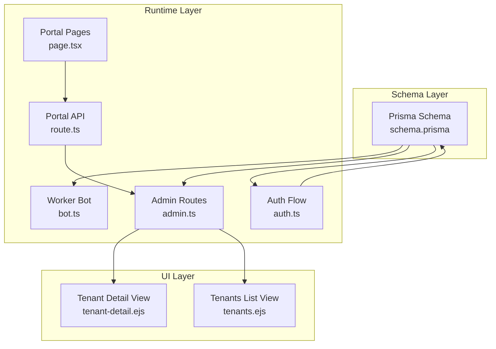
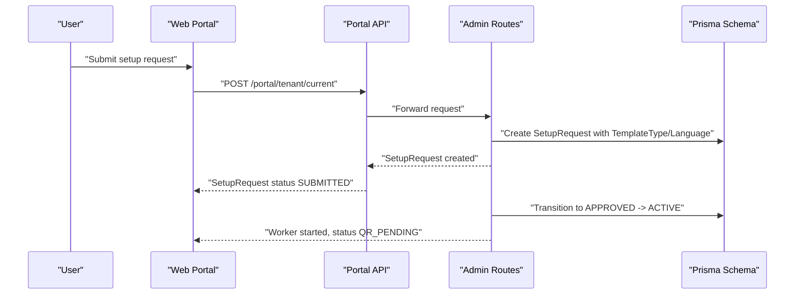
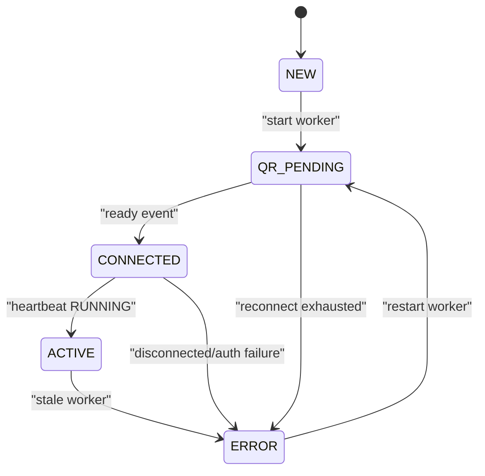
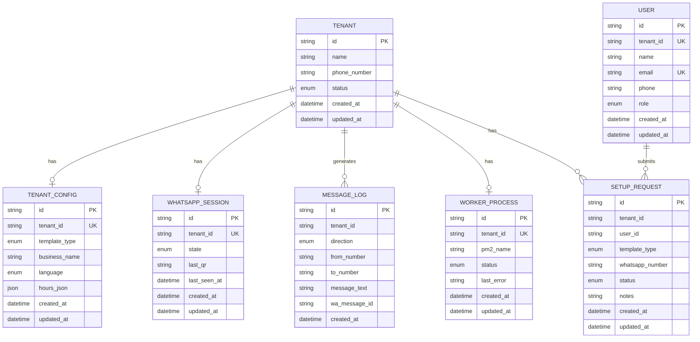

# Enums and Data Types

<cite>
**Referenced Files in This Document**
- [schema.prisma](file://packages/shared/src/prisma/schema.prisma)
- [types/index.ts](file://packages/shared/src/types/index.ts)
- [bot.ts](file://apps/worker/src/bot.ts)
- [admin.ts](file://apps/control-plane/src/routes/admin.ts)
- [auth.ts](file://apps/web/src/lib/auth.ts)
- [page.tsx](file://apps/web/src/app/(portal)/app/status/page.tsx)
- [route.ts](file://apps/web/src/app/api/portal/tenant/current/status/route.ts)
- [tenant-detail.ejs](file://apps/control-plane/src/views/tenant-detail.ejs)
- [tenants.ejs](file://apps/control-plane/src/views/tenants.ejs)
</cite>

## Table of Contents
1. [Introduction](#introduction)
2. [Project Structure](#project-structure)
3. [Core Components](#core-components)
4. [Architecture Overview](#architecture-overview)
5. [Detailed Component Analysis](#detailed-component-analysis)
6. [Dependency Analysis](#dependency-analysis)
7. [Performance Considerations](#performance-considerations)
8. [Troubleshooting Guide](#troubleshooting-guide)
9. [Conclusion](#conclusion)

## Introduction
This document catalogs all database enums and custom data types used in the Flow HQ schema, focusing on their definitions, defaults, validations, and business implications. It covers:
- TenantStatus (NEW, QR_PENDING, ACTIVE, PAUSED, ERROR)
- TemplateType (BOOKING, ECOMMERCE, SUPPORT)
- Language (SW, EN)
- SessionState (DISCONNECTED, QR_READY, CONNECTED)
- MessageDirection (IN, OUT)
- WorkerStatus (RUNNING, STOPPED, ERROR)
- UserRole (OWNER, STAFF, ADMIN)
- SetupRequestStatus (SUBMITTED, REVIEWING, APPROVED, ACTIVE, REJECTED)

These enums govern tenant lifecycle, messaging behavior, worker monitoring, access control, and setup workflows.

## Project Structure
The enum definitions live in the Prisma schema and are surfaced across the worker, control plane, and web portal layers. The schema defines defaults and relationships; runtime code enforces business transitions and operational states.

**Diagram sources**
- [schema.prisma](file://packages/shared/src/prisma/schema.prisma#L10-L58)
- [bot.ts](file://apps/worker/src/bot.ts#L44-L56)
- [admin.ts](file://apps/control-plane/src/routes/admin.ts#L30-L80)
- [auth.ts](file://apps/web/src/lib/auth.ts#L24-L43)
- [page.tsx](file://apps/web/src/app/(portal)/app/status/page.tsx#L48-L64)
- [route.ts](file://apps/web/src/app/api/portal/tenant/current/status/route.ts#L8-L29)
- [tenant-detail.ejs](file://apps/control-plane/src/views/tenant-detail.ejs#L45-L71)
- [tenants.ejs](file://apps/control-plane/src/views/tenants.ejs#L102-L123)

**Section sources**
- [schema.prisma](file://packages/shared/src/prisma/schema.prisma#L10-L58)
- [types/index.ts](file://packages/shared/src/types/index.ts#L1-L41)

## Core Components
- TenantStatus: Governs tenant lifecycle and visibility in admin UIs.
- TemplateType: Determines messaging template behavior and customization.
- Language: Controls localization for tenant communications.
- SessionState: Tracks WhatsApp session health and QR provisioning.
- MessageDirection: Distinguishes inbound vs outbound messages in logs.
- WorkerStatus: Monitors worker process health and activity.
- UserRole: Enforces access control for portal users.
- SetupRequestStatus: Manages setup request lifecycle from submission to activation.

Defaults and validations are defined in the schema; runtime code updates these states based on events.

**Section sources**
- [schema.prisma](file://packages/shared/src/prisma/schema.prisma#L60-L177)
- [types/index.ts](file://packages/shared/src/types/index.ts#L21-L40)

## Architecture Overview
The enums influence three primary flows:
- Tenant lifecycle via TenantStatus and SetupRequestStatus
- Messaging pipeline via SessionState, MessageDirection, and TemplateType
- Operational monitoring via WorkerStatus and UserRole

**Diagram sources**
- [schema.prisma](file://packages/shared/src/prisma/schema.prisma#L150-L164)
- [admin.ts](file://apps/control-plane/src/routes/admin.ts#L456-L473)
- [route.ts](file://apps/web/src/app/api/portal/tenant/current/status/route.ts#L8-L29)

## Detailed Component Analysis

### TenantStatus
- Values: NEW, QR_PENDING, ACTIVE, PAUSED, ERROR
- Defaults: Tenant.status defaults to NEW
- Validation: Not enforced beyond schema enum; transitions occur in runtime logic
- Business implications:
  - NEW: Initial tenant state after creation
  - QR_PENDING: Worker started; awaiting QR scan
  - ACTIVE: Connected and serving messages
  - PAUSED: Manual pause (not observed in runtime transitions)
  - ERROR: Disconnected or failed state requiring admin intervention

Runtime transitions:
- Worker start sets status to QR_PENDING
- On successful connect, status becomes ACTIVE
- On disconnect or auth failure, status becomes ERROR
- Max reconnection attempts lead to ERROR

**Diagram sources**
- [bot.ts](file://apps/worker/src/bot.ts#L106-L127)
- [admin.ts](file://apps/control-plane/src/routes/admin.ts#L30-L80)

**Section sources**
- [schema.prisma](file://packages/shared/src/prisma/schema.prisma#L60-L76)
- [bot.ts](file://apps/worker/src/bot.ts#L106-L127)
- [admin.ts](file://apps/control-plane/src/routes/admin.ts#L30-L80)
- [auth.ts](file://apps/web/src/lib/auth.ts#L24-L43)

### TemplateType
- Values: BOOKING, ECOMMERCE, SUPPORT
- Defaults: TenantConfig.template_type defaults to BOOKING
- Validation: Enum enforced in schema and TypeScript interfaces
- Business use cases:
  - BOOKING: Scheduling and appointment workflows
  - ECOMMERCE: Product catalog and purchase flows
  - SUPPORT: Helpdesk and customer service automation

Runtime usage:
- Worker loads template_type from TenantConfig to select response logic

**Section sources**
- [schema.prisma](file://packages/shared/src/prisma/schema.prisma#L78-L90)
- [types/index.ts](file://packages/shared/src/types/index.ts#L21-L27)
- [bot.ts](file://apps/worker/src/bot.ts#L236-L242)

### Language
- Values: SW, EN
- Defaults: TenantConfig.language defaults to SW
- Validation: Enum enforced in schema and TypeScript interfaces
- Internationalization support:
  - Multi-language messaging prompts and responses
  - UI displays language selection during onboarding

**Section sources**
- [schema.prisma](file://packages/shared/src/prisma/schema.prisma#L78-L90)
- [types/index.ts](file://packages/shared/src/types/index.ts#L26-L27)

### SessionState
- Values: DISCONNECTED, QR_READY, CONNECTED
- Defaults: WhatsAppSession.state defaults to DISCONNECTED
- Validation: Enum enforced in schema
- Business implications:
  - DISCONNECTED: Session not connected
  - QR_READY: Ready for QR scan; portal shows QR
  - CONNECTED: Active session; worker is running

Runtime updates:
- QR event sets state to QR_READY
- Ready event sets state to CONNECTED and tenant to ACTIVE
- Disconnected event sets state to DISCONNECTED and tenant to ERROR

**Section sources**
- [schema.prisma](file://packages/shared/src/prisma/schema.prisma#L92-L103)
- [bot.ts](file://apps/worker/src/bot.ts#L78-L96)
- [bot.ts](file://apps/worker/src/bot.ts#L98-L127)
- [bot.ts](file://apps/worker/src/bot.ts#L185-L208)

### MessageDirection
- Values: IN, OUT
- Defaults: None (required field)
- Validation: Enum enforced in schema
- Business implications:
  - IN: Messages received from users
  - OUT: Messages sent by the system

Runtime usage:
- MessageLog entries tag direction for audit and analytics

**Section sources**
- [schema.prisma](file://packages/shared/src/prisma/schema.prisma#L105-L118)
- [bot.ts](file://apps/worker/src/bot.ts#L253-L262)
- [bot.ts](file://apps/worker/src/bot.ts#L296-L305)

### WorkerStatus
- Values: RUNNING, STOPPED, ERROR
- Defaults: WorkerProcess.status defaults to STOPPED
- Validation: Enum enforced in schema
- Business implications:
  - RUNNING: Worker healthy and heartbeating
  - STOPPED: Worker not running
  - ERROR: Worker failure or stale state detection

Runtime updates:
- Heartbeat keeps status RUNNING
- Stale worker detection sets status ERROR
- Worker start sets status RUNNING and clears last_error

**Section sources**
- [schema.prisma](file://packages/shared/src/prisma/schema.prisma#L120-L131)
- [bot.ts](file://apps/worker/src/bot.ts#L347-L350)
- [admin.ts](file://apps/control-plane/src/routes/admin.ts#L30-L80)

### UserRole
- Values: OWNER, STAFF, ADMIN
- Defaults: User.role defaults to OWNER
- Validation: Enum enforced in schema
- Business implications:
  - OWNER: Full access to tenant resources
  - STAFF: Limited access for support roles
  - ADMIN: Platform administration privileges

Runtime usage:
- Portal session exposes role to UI for access control

**Section sources**
- [schema.prisma](file://packages/shared/src/prisma/schema.prisma#L133-L148)
- [auth.ts](file://apps/web/src/lib/auth.ts#L47-L69)

### SetupRequestStatus
- Values: SUBMITTED, REVIEWING, APPROVED, ACTIVE, REJECTED
- Defaults: SetupRequest.status defaults to SUBMITTED
- Validation: Enum enforced in schema
- Business implications:
  - SUBMITTED: Initial submission
  - REVIEWING: Under admin review
  - APPROVED: Admin approval; worker starts and status becomes QR_PENDING
  - ACTIVE: Setup complete and operational
  - REJECTED: Request denied with notes

Runtime transitions:
- Approved: Worker started, status becomes QR_PENDING
- Active: On successful connect, setup request becomes ACTIVE

**Section sources**
- [schema.prisma](file://packages/shared/src/prisma/schema.prisma#L150-L164)
- [admin.ts](file://apps/control-plane/src/routes/admin.ts#L456-L473)

## Dependency Analysis
The enums are tightly coupled to models and runtime logic. The following diagram maps enum usage across models and runtime components.

**Diagram sources**
- [schema.prisma](file://packages/shared/src/prisma/schema.prisma#L60-L177)

**Section sources**
- [schema.prisma](file://packages/shared/src/prisma/schema.prisma#L60-L177)

## Performance Considerations
- Enum constraints prevent invalid states at the database level, reducing runtime checks.
- Frequent state transitions (e.g., heartbeat, QR events) should be monitored for excessive writes; consider batching where appropriate.
- UI rendering depends on enum values; ensure minimal re-renders by caching computed statuses.

## Troubleshooting Guide
Common issues and resolutions:
- Tenant stuck in QR_PENDING:
  - Verify worker is running and emitting heartbeats.
  - Check admin stale worker detection and manual restart.
- Tenant shows ERROR:
  - Investigate disconnection reasons and auth failures.
  - Review workerProcess.last_error for details.
- Message logs missing direction:
  - Ensure MessageLog entries set direction to IN or OUT consistently.
- Setup request not progressing:
  - Confirm admin transition from SUBMITTED to APPROVED and ACTIVE.

Operational references:
- Stale worker detection and marking
- Worker start and status transitions
- QR and ready event handling
- Message logging and deduplication

**Section sources**
- [admin.ts](file://apps/control-plane/src/routes/admin.ts#L30-L80)
- [bot.ts](file://apps/worker/src/bot.ts#L106-L127)
- [bot.ts](file://apps/worker/src/bot.ts#L78-L96)
- [bot.ts](file://apps/worker/src/bot.ts#L253-L305)

## Conclusion
The Flow HQ schema’s enums provide a robust foundation for tenant lifecycle, messaging, worker monitoring, and access control. Defaults and validations in the schema, combined with runtime transitions, ensure predictable system behavior. Understanding these enums and their business implications is essential for development, operations, and troubleshooting.