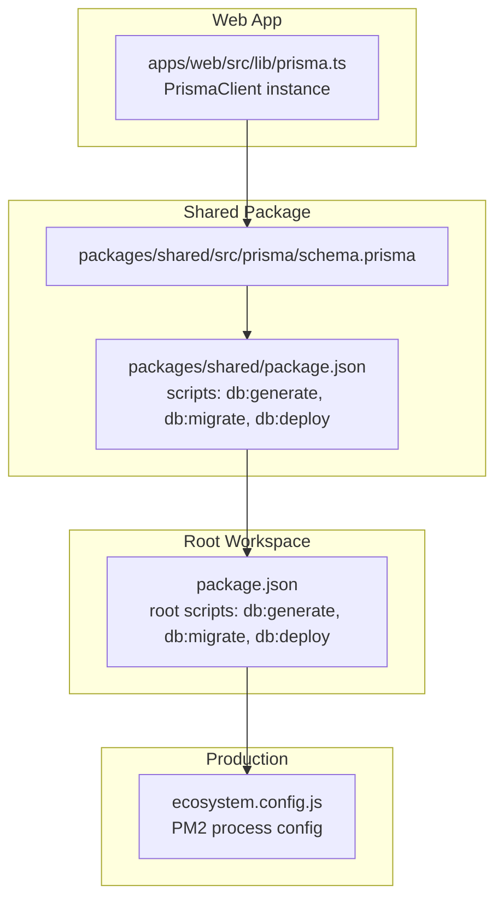
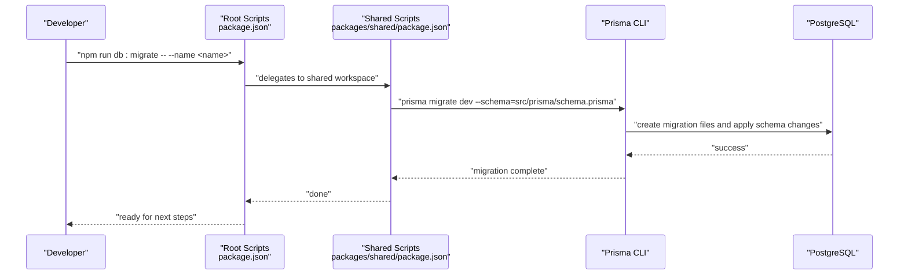
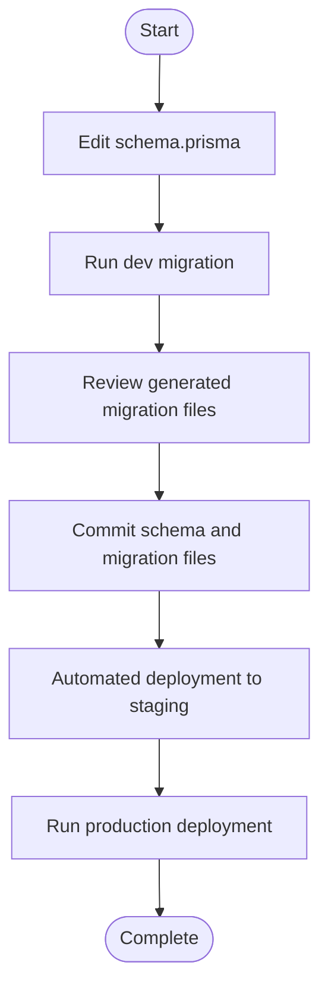
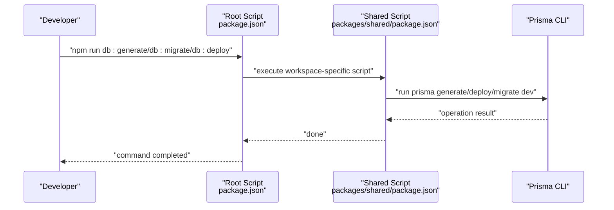
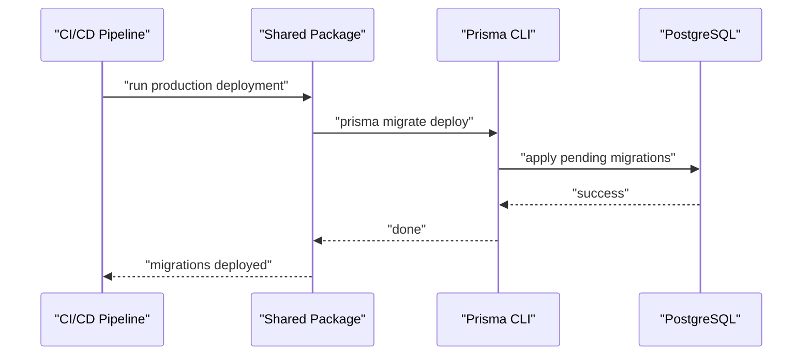
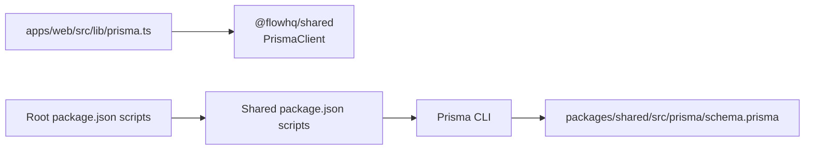

# Migrations and Schema Evolution

<cite>
**Referenced Files in This Document**
- [schema.prisma](file://packages/shared/src/prisma/schema.prisma)
- [package.json](file://packages/shared/package.json)
- [package.json](file://package.json)
- [prisma.ts](file://apps/web/src/lib/prisma.ts)
- [README.md](file://README.md)
- [ecosystem.config.js](file://ecosystem.config.js)
</cite>

## Table of Contents
1. [Introduction](#introduction)
2. [Project Structure](#project-structure)
3. [Core Components](#core-components)
4. [Architecture Overview](#architecture-overview)
5. [Detailed Component Analysis](#detailed-component-analysis)
6. [Dependency Analysis](#dependency-analysis)
7. [Performance Considerations](#performance-considerations)
8. [Troubleshooting Guide](#troubleshooting-guide)
9. [Conclusion](#conclusion)
10. [Appendices](#appendices)

## Introduction
This document explains how Prisma schema migrations and database evolution are managed in this project. It covers the migration lifecycle, creation and deployment procedures, how schema changes are tracked and versioned, and how to apply them safely across environments. It also outlines best practices for preserving data, handling constraints and indexes, managing rollbacks, conflict resolution, testing strategies, and production deployment considerations.

## Project Structure
The database schema and migration tooling are centralized in the shared package, while application code accesses Prisma via a client instance configured in the web app.

**Diagram sources**
- [schema.prisma](file://packages/shared/src/prisma/schema.prisma#L1-L178)
- [package.json](file://packages/shared/package.json#L6-L11)
- [package.json](file://package.json#L9-L16)
- [prisma.ts](file://apps/web/src/lib/prisma.ts#L1-L10)
- [ecosystem.config.js](file://ecosystem.config.js#L1-L19)

**Section sources**
- [schema.prisma](file://packages/shared/src/prisma/schema.prisma#L1-L178)
- [package.json](file://packages/shared/package.json#L6-L11)
- [package.json](file://package.json#L9-L16)
- [prisma.ts](file://apps/web/src/lib/prisma.ts#L1-L10)
- [README.md](file://README.md#L250-L258)

## Core Components
- Prisma schema defines models, enums, relations, and indexes. It is the single source of truth for the database structure.
- Migration commands are exposed via npm scripts in both the root workspace and the shared package.
- The web app initializes a PrismaClient singleton for database access.

Key responsibilities:
- schema.prisma: Defines domain models, constraints, and indexes.
- Shared package scripts: Provide Prisma CLI commands for generating client code, creating dev migrations, and deploying migrations in production.
- Root workspace scripts: Mirror shared package commands for convenience.
- Web app client: Provides a globally cached PrismaClient instance for application code.

**Section sources**
- [schema.prisma](file://packages/shared/src/prisma/schema.prisma#L1-L178)
- [package.json](file://packages/shared/package.json#L6-L11)
- [package.json](file://package.json#L9-L16)
- [prisma.ts](file://apps/web/src/lib/prisma.ts#L1-L10)

## Architecture Overview
The migration workflow spans three stages:
- Development: Create and review schema changes locally using dev migrations.
- CI/CD: Apply migrations in staging using automated deployment.
- Production: Deploy migrations without interactive prompts using the production-safe command.

**Diagram sources**
- [package.json](file://package.json#L9-L16)
- [package.json](file://packages/shared/package.json#L6-L11)
- [README.md](file://README.md#L250-L258)

## Detailed Component Analysis

### Prisma Schema
The schema defines:
- Enumerations for domain states and roles.
- Models representing entities such as Tenant, TenantConfig, WhatsAppSession, MessageLog, WorkerProcess, User, SetupRequest, and PortalEventLog.
- Relations between models with referential actions (e.g., cascade deletes).
- Indexes for query performance on frequently filtered columns.
- Naming conventions via model-level mappings.

**Diagram sources**
- [schema.prisma](file://packages/shared/src/prisma/schema.prisma#L60-L177)

**Section sources**
- [schema.prisma](file://packages/shared/src/prisma/schema.prisma#L1-L178)

### Migration Lifecycle
- Creation: Developers run the dev migration command to generate and apply a new migration file based on schema changes.
- Review: The generated migration files are committed alongside schema changes.
- Staging: CI applies migrations automatically using the production-safe deployment command.
- Production: The deployment command is executed in production environments without interactive prompts.

**Diagram sources**
- [README.md](file://README.md#L250-L258)
- [package.json](file://packages/shared/package.json#L9-L10)

**Section sources**
- [README.md](file://README.md#L250-L258)
- [package.json](file://packages/shared/package.json#L9-L10)

### Migration Commands and Scripts
- Root workspace scripts delegate to the shared package workspace for Prisma operations.
- Shared package scripts define the Prisma CLI commands with explicit schema paths.

**Diagram sources**
- [package.json](file://package.json#L9-L16)
- [package.json](file://packages/shared/package.json#L6-L11)

**Section sources**
- [package.json](file://package.json#L9-L16)
- [package.json](file://packages/shared/package.json#L6-L11)

### Production Deployment
- The production deployment command is designed to be non-interactive and safe for automated pipelines.
- The control-plane runs as a PM2-managed service, ensuring stability and logging.

**Diagram sources**
- [README.md](file://README.md#L333-L338)
- [package.json](file://packages/shared/package.json#L10-L10)
- [ecosystem.config.js](file://ecosystem.config.js#L1-L19)

**Section sources**
- [README.md](file://README.md#L333-L338)
- [package.json](file://packages/shared/package.json#L10-L10)
- [ecosystem.config.js](file://ecosystem.config.js#L1-L19)

## Dependency Analysis
- The web app depends on the shared package for Prisma client generation and runtime access.
- Root workspace scripts depend on the shared package scripts to execute Prisma operations consistently.
- The Prisma client is initialized once and reused across the app to avoid redundant connections.

**Diagram sources**
- [prisma.ts](file://apps/web/src/lib/prisma.ts#L1-L10)
- [package.json](file://package.json#L9-L16)
- [package.json](file://packages/shared/package.json#L6-L11)
- [schema.prisma](file://packages/shared/src/prisma/schema.prisma#L1-L178)

**Section sources**
- [prisma.ts](file://apps/web/src/lib/prisma.ts#L1-L10)
- [package.json](file://package.json#L9-L16)
- [package.json](file://packages/shared/package.json#L6-L11)
- [schema.prisma](file://packages/shared/src/prisma/schema.prisma#L1-L178)

## Performance Considerations
- Indexes are defined on frequently queried columns to improve select performance. For example, composite indexes on tenant-scoped entities help isolate and filter data efficiently.
- Use relation fields and referential actions to maintain data integrity and reduce application-level joins.
- Keep migrations minimal and additive where possible to reduce downtime and risk.

[No sources needed since this section provides general guidance]

## Troubleshooting Guide
Common issues and resolutions:
- Database connection failures: Verify the connection string format and PostgreSQL availability.
- Migration conflicts: Ensure migrations are applied in order and resolve any divergent histories by aligning environments.
- Production deployment errors: Confirm the production deployment command is used and environment variables are set correctly.
- Client initialization problems: Ensure the Prisma client is initialized once and reused across the app.

**Section sources**
- [README.md](file://README.md#L196-L198)
- [README.md](file://README.md#L333-L338)
- [prisma.ts](file://apps/web/src/lib/prisma.ts#L1-L10)

## Conclusion
This project follows a disciplined approach to schema evolution using Prisma migrations. By centralizing schema definitions, exposing clear scripts for development and production, and leveraging indexes and relations, teams can safely evolve the database over time. Adhering to the outlined lifecycle, testing strategies, and production practices ensures reliable deployments and operational stability.

[No sources needed since this section summarizes without analyzing specific files]

## Appendices

### Best Practices for Safe Schema Modifications
- Always create a dev migration locally before committing schema changes.
- Keep migrations small, reversible where possible, and well-named.
- Add indexes thoughtfully; measure impact on write performance.
- Use referential actions to enforce integrity without heavy application logic.
- Back up the database before large or risky migrations.

[No sources needed since this section provides general guidance]

### Rollback Procedures
- Use the dev migration rollback capability during development.
- For production, create a corrective migration that reverts problematic changes.
- Maintain a documented rollback plan and practice it in staging.

[No sources needed since this section provides general guidance]

### Testing Strategies
- Run the stress test to verify tenant isolation after applying migrations.
- Validate queries and indexes with targeted checks against the database.
- Automate migration application in CI/CD pipelines to catch regressions early.

[No sources needed since this section provides general guidance]

### Constraint and Index Management Examples
- Enums: Define domain states centrally to prevent invalid values.
- Unique constraints: Enforce uniqueness at the database level (e.g., unique tenant relations).
- Composite indexes: Improve filtering on tenant-scoped entities.

**Section sources**
- [schema.prisma](file://packages/shared/src/prisma/schema.prisma#L10-L58)
- [schema.prisma](file://packages/shared/src/prisma/schema.prisma#L78-L90)
- [schema.prisma](file://packages/shared/src/prisma/schema.prisma#L105-L118)
- [schema.prisma](file://packages/shared/src/prisma/schema.prisma#L166-L177)