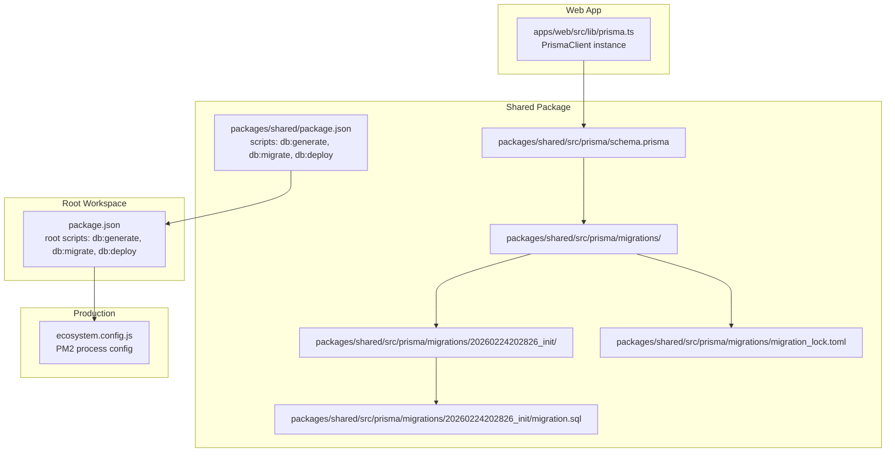
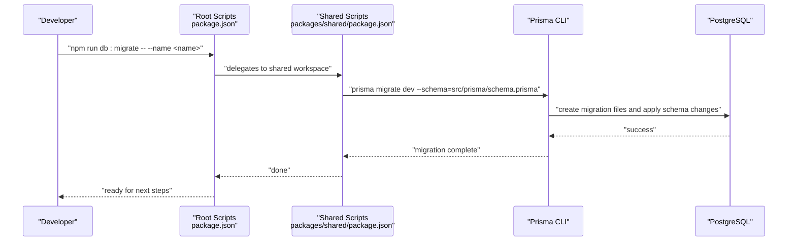
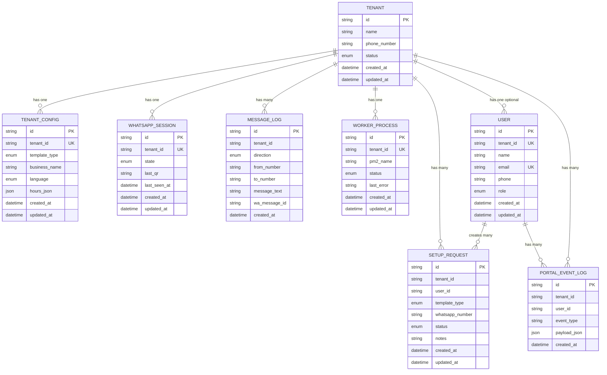
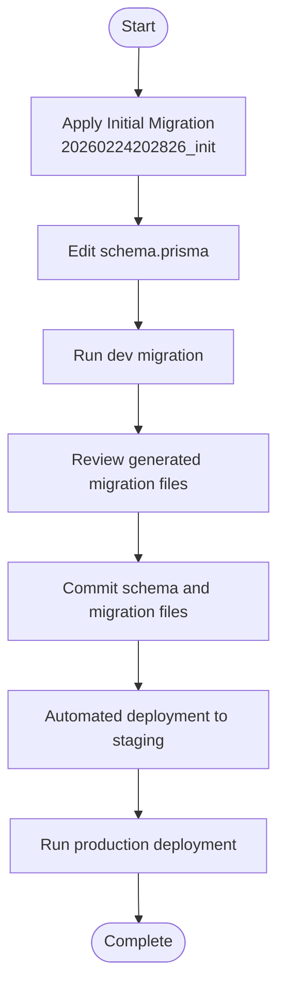
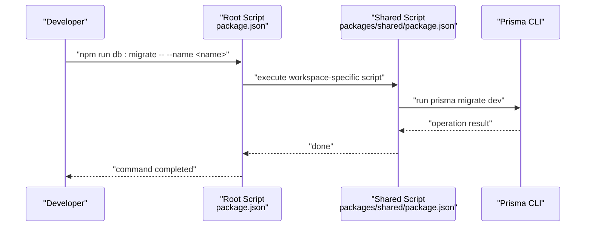
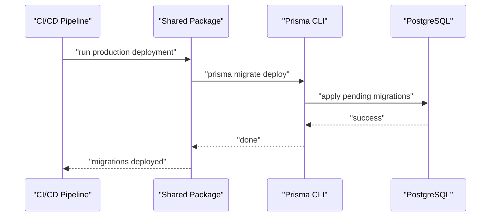
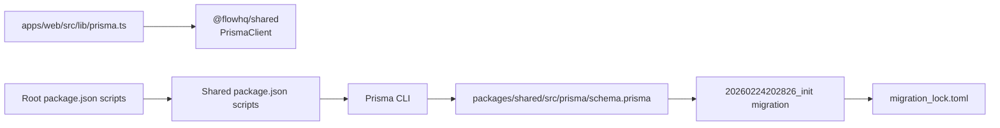

# Migrations and Schema Evolution

<cite>
**Referenced Files in This Document**
- [schema.prisma](file://packages/shared/src/prisma/schema.prisma)
- [migration.sql](file://packages/shared/src/prisma/migrations/20260224202826_init/migration.sql)
- [migration_lock.toml](file://packages/shared/src/prisma/migrations/migration_lock.toml)
- [package.json](file://packages/shared/package.json)
- [package.json](file://package.json)
- [prisma.ts](file://apps/web/src/lib/prisma.ts)
- [README.md](file://README.md)
- [ecosystem.config.js](file://ecosystem.config.js)
</cite>

## Update Summary
**Changes Made**
- Updated migration system architecture to reflect the complete Prisma migration implementation
- Added documentation for the initial migration (20260224202826_init) and migration lock configuration
- Enhanced migration lifecycle documentation with concrete examples from the actual migration files
- Updated troubleshooting section with migration-specific guidance
- Revised best practices to include migration lock management and version control considerations

## Table of Contents
1. [Introduction](#introduction)
2. [Project Structure](#project-structure)
3. [Core Components](#core-components)
4. [Architecture Overview](#architecture-overview)
5. [Detailed Component Analysis](#detailed-component-analysis)
6. [Migration Lifecycle](#migration-lifecycle)
7. [Migration Commands and Scripts](#migration-commands-and-scripts)
8. [Production Deployment](#production-deployment)
9. [Dependency Analysis](#dependency-analysis)
10. [Performance Considerations](#performance-considerations)
11. [Troubleshooting Guide](#troubleshooting-guide)
12. [Conclusion](#conclusion)
13. [Appendices](#appendices)

## Introduction
This document explains how Prisma schema migrations and database evolution are managed in this project. The system now features a complete Prisma migration implementation with an initial migration (20260224202826_init) that establishes the entire database schema, along with migration lock configuration for safe collaborative development. It covers the migration lifecycle, creation and deployment procedures, how schema changes are tracked and versioned, and how to apply them safely across environments. It also outlines best practices for preserving data, handling constraints and indexes, managing rollbacks, conflict resolution, testing strategies, and production deployment considerations.

## Project Structure
The database schema and migration tooling are centralized in the shared package, while application code accesses Prisma via a client instance configured in the web app. The migration system includes a complete initial migration that creates all database tables and a migration lock configuration for collaborative development.

**Diagram sources**
- [schema.prisma](file://packages/shared/src/prisma/schema.prisma#L1-L178)
- [migration.sql](file://packages/shared/src/prisma/migrations/20260224202826_init/migration.sql#L1-L176)
- [migration_lock.toml](file://packages/shared/src/prisma/migrations/migration_lock.toml#L1-L3)
- [package.json](file://packages/shared/package.json#L6-L11)
- [package.json](file://package.json#L9-L16)
- [prisma.ts](file://apps/web/src/lib/prisma.ts#L1-L10)
- [ecosystem.config.js](file://ecosystem.config.js#L1-L19)

**Section sources**
- [schema.prisma](file://packages/shared/src/prisma/schema.prisma#L1-L178)
- [migration.sql](file://packages/shared/src/prisma/migrations/20260224202826_init/migration.sql#L1-L176)
- [migration_lock.toml](file://packages/shared/src/prisma/migrations/migration_lock.toml#L1-L3)
- [package.json](file://packages/shared/package.json#L6-L11)
- [package.json](file://package.json#L9-L16)
- [prisma.ts](file://apps/web/src/lib/prisma.ts#L1-L10)
- [README.md](file://README.md#L250-L258)

## Core Components
- **Prisma schema** defines models, enums, relations, and indexes. It is the single source of truth for the database structure.
- **Initial migration (20260224202826_init)** creates the complete database schema including all tables, enums, indexes, and foreign keys.
- **Migration lock configuration** prevents concurrent development on the same migration files.
- **Migration commands** are exposed via npm scripts in both the root workspace and the shared package.
- **Application client** provides a globally cached PrismaClient instance for database access.

Key responsibilities:
- schema.prisma: Defines domain models, constraints, and indexes.
- Initial migration: Creates the complete database structure from scratch.
- Migration lock: Ensures safe collaborative development with proper version control.
- Shared package scripts: Provide Prisma CLI commands for generating client code, creating dev migrations, and deploying migrations in production.
- Root workspace scripts: Mirror shared package commands for convenience.
- Web app client: Provides a globally cached PrismaClient instance for application code.

**Section sources**
- [schema.prisma](file://packages/shared/src/prisma/schema.prisma#L1-L178)
- [migration.sql](file://packages/shared/src/prisma/migrations/20260224202826_init/migration.sql#L1-L176)
- [migration_lock.toml](file://packages/shared/src/prisma/migrations/migration_lock.toml#L1-L3)
- [package.json](file://packages/shared/package.json#L6-L11)
- [package.json](file://package.json#L9-L16)
- [prisma.ts](file://apps/web/src/lib/prisma.ts#L1-L10)

## Architecture Overview
The migration workflow spans three stages with the initial migration providing the foundation:
- **Development**: Create and review schema changes locally using dev migrations, starting from the initial migration baseline.
- **CI/CD**: Apply migrations in staging using automated deployment with migration lock validation.
- **Production**: Deploy migrations without interactive prompts using the production-safe command.

**Diagram sources**
- [package.json](file://package.json#L9-L16)
- [package.json](file://packages/shared/package.json#L6-L11)
- [README.md](file://README.md#L250-L258)

## Detailed Component Analysis

### Prisma Schema
The schema defines:
- **Enumerations** for domain states and roles (TenantStatus, TemplateType, Language, SessionState, MessageDirection, WorkerStatus, UserRole, SetupRequestStatus).
- **Models** representing entities such as Tenant, TenantConfig, WhatsAppSession, MessageLog, WorkerProcess, User, SetupRequest, and PortalEventLog.
- **Relations** between models with referential actions (e.g., cascade deletes, restrict actions).
- **Indexes** for query performance on frequently filtered columns.
- **Naming conventions** via model-level mappings.

**Diagram sources**
- [schema.prisma](file://packages/shared/src/prisma/schema.prisma#L60-L177)

**Section sources**
- [schema.prisma](file://packages/shared/src/prisma/schema.prisma#L1-L178)

### Initial Migration Implementation
The initial migration (20260224202826_init) creates the complete database schema:

**Created Enums:**
- TenantStatus: NEW, QR_PENDING, ACTIVE, PAUSED, ERROR
- TemplateType: BOOKING, ECOMMERCE, SUPPORT
- Language: SW, EN
- SessionState: DISCONNECTED, QR_READY, CONNECTED
- MessageDirection: IN, OUT
- WorkerStatus: RUNNING, STOPPED, ERROR
- UserRole: OWNER, STAFF, ADMIN
- SetupRequestStatus: SUBMITTED, REVIEWING, APPROVED, ACTIVE, REJECTED

**Created Tables:**
- tenants: Core tenant information and status
- tenant_configs: Template settings and business details
- whatsapp_sessions: Session state and QR code management
- message_logs: All incoming and outgoing messages
- worker_processes: PM2 process tracking
- users: User accounts with tenant relationships
- setup_requests: Tenant setup request management
- portal_event_logs: Event tracking and analytics

**Indexes Created:**
- Unique indexes on tenant_id fields for one-to-one relationships
- Unique email index on users table
- Composite indexes on tenant-scoped entities for performance

**Foreign Key Relationships:**
- All tenant-scoped tables reference tenants with cascade deletes
- Specific referential actions for different relationship types

**Section sources**
- [migration.sql](file://packages/shared/src/prisma/migrations/20260224202826_init/migration.sql#L1-L176)

### Migration Lock Configuration
The migration lock configuration ensures safe collaborative development:

- **Provider Configuration**: Specifies PostgreSQL as the migration provider
- **Version Control Integration**: Prevents manual editing of migration files
- **Collaborative Safety**: Ensures team members work with consistent migration states

**Section sources**
- [migration_lock.toml](file://packages/shared/src/prisma/migrations/migration_lock.toml#L1-L3)

## Migration Lifecycle
The migration lifecycle now operates from a solid foundation established by the initial migration:

**Lifecycle Stages:**
1. **Initialization**: The initial migration creates the complete database structure
2. **Development**: Create and review schema changes locally using dev migrations
3. **Review**: The generated migration files are committed alongside schema changes
4. **Staging**: CI applies migrations automatically using the production-safe deployment command
5. **Production**: The deployment command is executed in production environments without interactive prompts

**Diagram sources**
- [migration.sql](file://packages/shared/src/prisma/migrations/20260224202826_init/migration.sql#L1-L176)
- [README.md](file://README.md#L250-L258)
- [package.json](file://packages/shared/package.json#L9-L10)

**Section sources**
- [migration.sql](file://packages/shared/src/prisma/migrations/20260224202826_init/migration.sql#L1-L176)
- [README.md](file://README.md#L250-L258)
- [package.json](file://packages/shared/package.json#L9-L10)

## Migration Commands and Scripts
The migration system provides comprehensive command support through npm scripts:

**Root Workspace Scripts:**
- Delegate to the shared package workspace for Prisma operations
- Mirror shared package commands for developer convenience

**Shared Package Scripts:**
- `db:generate`: Generates Prisma client code from schema
- `db:migrate`: Creates and applies dev migrations
- `db:deploy`: Deploys migrations in production without prompts

**Command Execution Flow:**

**Diagram sources**
- [package.json](file://package.json#L9-L16)
- [package.json](file://packages/shared/package.json#L6-L11)

**Section sources**
- [package.json](file://package.json#L9-L16)
- [package.json](file://packages/shared/package.json#L6-L11)

## Production Deployment
Production deployment is designed for automation and safety:

**Deployment Process:**
- Uses the production-safe `prisma migrate deploy` command
- Designed to be non-interactive and safe for automated pipelines
- Integrates with PM2-managed services for stability and logging

**Production Workflow:**

**Diagram sources**
- [README.md](file://README.md#L333-L338)
- [package.json](file://packages/shared/package.json#L10-L10)
- [ecosystem.config.js](file://ecosystem.config.js#L1-L19)

**Section sources**
- [README.md](file://README.md#L333-L338)
- [package.json](file://packages/shared/package.json#L10-L10)
- [ecosystem.config.js](file://ecosystem.config.js#L1-L19)

## Dependency Analysis
The migration system creates clear dependencies between components:

**Component Dependencies:**
- Web app depends on the shared package for Prisma client generation and runtime access
- Root workspace scripts depend on the shared package scripts to execute Prisma operations consistently
- Prisma client is initialized once and reused across the app to avoid redundant connections
- Migration system depends on PostgreSQL provider configuration

**Diagram sources**
- [prisma.ts](file://apps/web/src/lib/prisma.ts#L1-L10)
- [package.json](file://package.json#L9-L16)
- [package.json](file://packages/shared/package.json#L6-L11)
- [schema.prisma](file://packages/shared/src/prisma/schema.prisma#L1-L178)
- [migration.sql](file://packages/shared/src/prisma/migrations/20260224202826_init/migration.sql#L1-L176)
- [migration_lock.toml](file://packages/shared/src/prisma/migrations/migration_lock.toml#L1-L3)

**Section sources**
- [prisma.ts](file://apps/web/src/lib/prisma.ts#L1-L10)
- [package.json](file://package.json#L9-L16)
- [package.json](file://packages/shared/package.json#L6-L11)
- [schema.prisma](file://packages/shared/src/prisma/schema.prisma#L1-L178)
- [migration.sql](file://packages/shared/src/prisma/migrations/20260224202826_init/migration.sql#L1-L176)
- [migration_lock.toml](file://packages/shared/src/prisma/migrations/migration_lock.toml#L1-L3)

## Performance Considerations
The initial migration establishes performance foundations:

**Index Strategy:**
- Composite indexes on tenant-scoped entities (message_logs, portal_event_logs) for efficient filtering
- Unique indexes on foreign key relationships for fast joins
- Strategic indexing on frequently queried columns

**Query Optimization:**
- Tenant isolation achieved through indexed foreign keys
- Efficient filtering using composite indexes on (tenant_id, created_at)
- Minimal application-level joins through proper relational design

**Migration Performance:**
- Initial migration creates all structures in a single transaction-like operation
- Subsequent migrations are incremental and additive
- Migration lock prevents concurrent operations that could impact performance

## Troubleshooting Guide
**Migration-Specific Issues:**

**Initial Migration Problems:**
- **Migration conflicts**: Ensure the initial migration has been applied successfully before creating new migrations
- **Migration lock errors**: Verify migration_lock.toml is present and properly configured
- **Schema mismatch**: Check that schema.prisma matches the expected database state

**Database Connection Issues:**
- **Connection failures**: Verify DATABASE_URL format and PostgreSQL availability
- **Permission errors**: Ensure database user has necessary privileges for schema changes

**Migration Application Errors:**
- **Production deployment errors**: Confirm production deployment command is used and environment variables are set correctly
- **Concurrent development conflicts**: Use migration lock to prevent simultaneous changes

**Client Initialization Problems:**
- **Prisma client issues**: Ensure the Prisma client is initialized once and reused across the app

**Section sources**
- [README.md](file://README.md#L196-L198)
- [README.md](file://README.md#L333-L338)
- [prisma.ts](file://apps/web/src/lib/prisma.ts#L1-L10)
- [migration_lock.toml](file://packages/shared/src/prisma/migrations/migration_lock.toml#L1-L3)

## Conclusion
This project now implements a comprehensive Prisma migration system with a solid foundation provided by the initial migration (20260224202826_init). The system centralizes schema definitions, exposes clear scripts for development and production, leverages indexes and relations for performance, and includes migration lock configuration for safe collaborative development. By following the documented lifecycle, testing strategies, and production practices, teams can reliably evolve the database schema over time while maintaining data integrity and operational stability.

## Appendices

### Best Practices for Safe Schema Modifications
**Migration-Based Approach:**
- Always create dev migrations locally before committing schema changes
- Use the initial migration as the baseline for all subsequent changes
- Keep migrations small, reversible where possible, and well-named
- Add indexes thoughtfully; measure impact on write performance
- Use referential actions to enforce integrity without heavy application logic
- Back up the database before large or risky migrations

**Collaborative Development:**
- Respect migration lock configuration to prevent concurrent changes
- Commit migration files alongside schema changes
- Test migrations in staging environments before production deployment

**Section sources**
- [migration.sql](file://packages/shared/src/prisma/migrations/20260224202826_init/migration.sql#L1-L176)
- [migration_lock.toml](file://packages/shared/src/prisma/migrations/migration_lock.toml#L1-L3)

### Rollback Procedures
**Development Rollback:**
- Use the dev migration rollback capability during development
- Leverage Prisma's built-in rollback mechanisms for local testing

**Production Rollback:**
- Create corrective migrations that revert problematic changes
- Maintain a documented rollback plan and practice it in staging
- Use migration history to identify safe rollback points

**Section sources**
- [README.md](file://README.md#L250-L258)
- [package.json](file://packages/shared/package.json#L9-L10)

### Testing Strategies
**Migration Testing:**
- Run the stress test to verify tenant isolation after applying migrations
- Validate queries and indexes with targeted checks against the database
- Automate migration application in CI/CD pipelines to catch regressions early
- Test migration lock functionality in collaborative development scenarios

**Section sources**
- [README.md](file://README.md#L221-L242)

### Constraint and Index Management Examples
**Enum Definitions:**
- Centralized domain states prevent invalid values across all tables
- Consistent enum usage ensures data integrity

**Unique Constraints:**
- Enforce uniqueness at the database level (e.g., unique tenant relations)
- Prevent data duplication in critical relationships

**Composite Indexes:**
- Improve filtering on tenant-scoped entities (message_logs, portal_event_logs)
- Optimize common query patterns with multi-column indexes

**Section sources**
- [schema.prisma](file://packages/shared/src/prisma/schema.prisma#L10-L58)
- [schema.prisma](file://packages/shared/src/prisma/schema.prisma#L78-L90)
- [schema.prisma](file://packages/shared/src/prisma/schema.prisma#L105-L118)
- [schema.prisma](file://packages/shared/src/prisma/schema.prisma#L166-L177)
- [migration.sql](file://packages/shared/src/prisma/migrations/20260224202826_init/migration.sql#L132-L151)