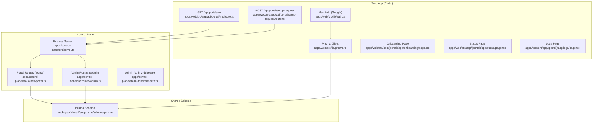
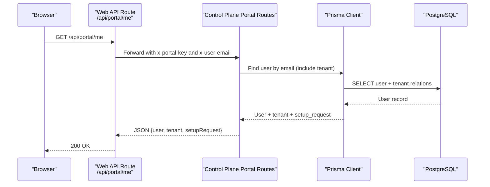
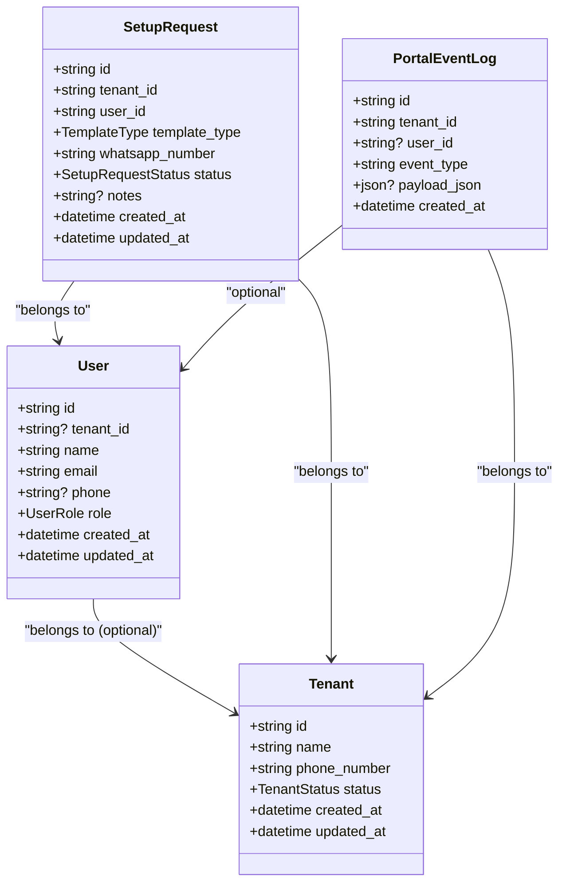
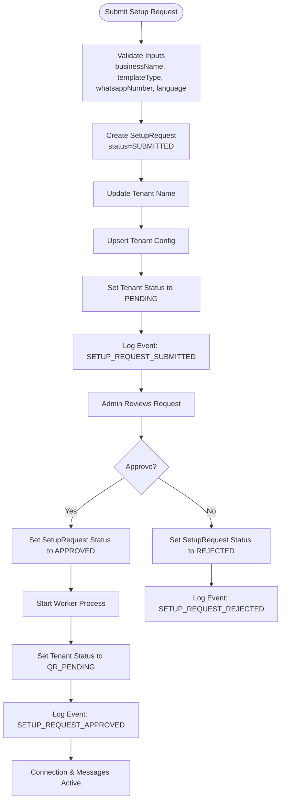
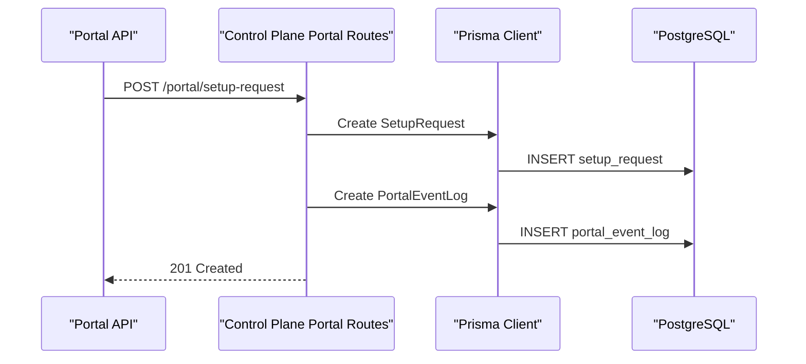
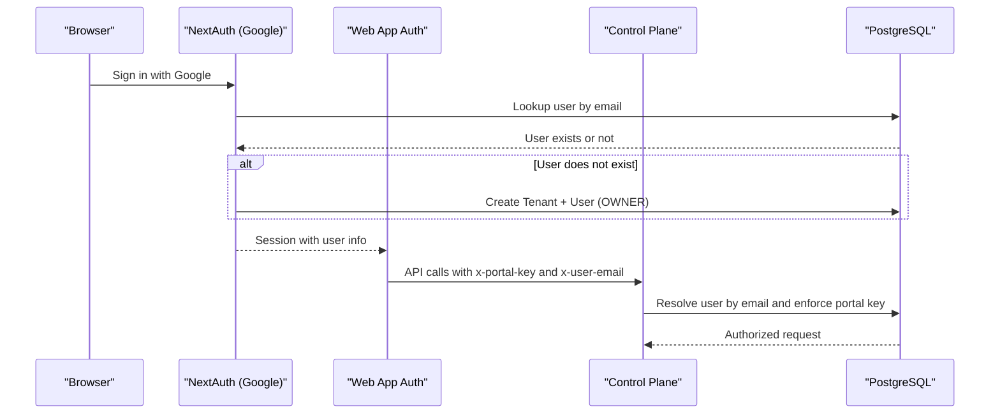
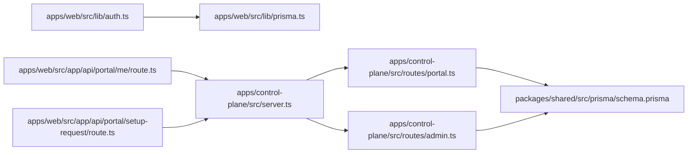

# User Management

<cite>
**Referenced Files in This Document**
- [schema.prisma](file://packages/shared/src/prisma/schema.prisma)
- [auth.ts](file://apps/web/src/lib/auth.ts)
- [prisma.ts](file://apps/web/src/lib/prisma.ts)
- [route.ts](file://apps/web/src/app/api/portal/me/route.ts)
- [route.ts](file://apps/web/src/app/api/portal/setup-request/route.ts)
- [route.ts](file://apps/control-plane/src/routes/portal.ts)
- [route.ts](file://apps/control-plane/src/routes/admin.ts)
- [auth.ts](file://apps/control-plane/src/middleware/auth.ts)
- [server.ts](file://apps/control-plane/src/server.ts)
- [page.tsx](file://apps/web/src/app/(portal)/app/onboarding/page.tsx)
- [page.tsx](file://apps/web/src/app/(portal)/app/status/page.tsx)
- [page.tsx](file://apps/web/src/app/(portal)/app/logs/page.tsx)
</cite>

## Table of Contents
1. [Introduction](#introduction)
2. [Project Structure](#project-structure)
3. [Core Components](#core-components)
4. [Architecture Overview](#architecture-overview)
5. [Detailed Component Analysis](#detailed-component-analysis)
6. [Dependency Analysis](#dependency-analysis)
7. [Performance Considerations](#performance-considerations)
8. [Troubleshooting Guide](#troubleshooting-guide)
9. [Conclusion](#conclusion)

## Introduction
This document explains the User and SetupRequest entities in the database schema and how they integrate with the portal and control plane to support business onboarding workflows. It covers:
- User entity with role-based access control (OWNER, ADMIN, STAFF), authentication integration via Google OAuth, and tenant association
- SetupRequest entity for onboarding, including status lifecycle (SUBMITTED, REVIEWING, APPROVED, ACTIVE, REJECTED), template preferences, and approval processes
- Relationship between Users and SetupRequests, portal event logging, and user activity tracking
- Data validation rules, security considerations, and access control patterns

## Project Structure
The system spans a Next.js web application (portal) and an Express control plane:
- Web app (portal): front-end pages, API routes, and authentication integration
- Control plane: administrative APIs and onboarding workflows
- Shared Prisma schema defines the database models and enums

**Diagram sources**
- [auth.ts](file://apps/web/src/lib/auth.ts#L1-L76)
- [prisma.ts](file://apps/web/src/lib/prisma.ts#L1-L10)
- [route.ts](file://apps/web/src/app/api/portal/me/route.ts#L1-L35)
- [route.ts](file://apps/web/src/app/api/portal/setup-request/route.ts#L1-L40)
- [route.ts](file://apps/control-plane/src/routes/portal.ts#L1-L246)
- [route.ts](file://apps/control-plane/src/routes/admin.ts#L1-L528)
- [auth.ts](file://apps/control-plane/src/middleware/auth.ts#L1-L40)
- [server.ts](file://apps/control-plane/src/server.ts#L1-L89)
- [schema.prisma](file://packages/shared/src/prisma/schema.prisma#L1-L178)

**Section sources**
- [schema.prisma](file://packages/shared/src/prisma/schema.prisma#L133-L164)
- [auth.ts](file://apps/web/src/lib/auth.ts#L1-L76)
- [route.ts](file://apps/web/src/app/api/portal/me/route.ts#L1-L35)
- [route.ts](file://apps/web/src/app/api/portal/setup-request/route.ts#L1-L40)
- [route.ts](file://apps/control-plane/src/routes/portal.ts#L1-L246)
- [route.ts](file://apps/control-plane/src/routes/admin.ts#L1-L528)
- [auth.ts](file://apps/control-plane/src/middleware/auth.ts#L1-L40)
- [server.ts](file://apps/control-plane/src/server.ts#L1-L89)

## Core Components
- User model
  - Unique identifier, optional tenant association, name, unique email, optional phone, role with default OWNER, timestamps
  - Relationships: belongs to Tenant (optional), has many SetupRequests, has many PortalEventLogs
- SetupRequest model
  - Unique identifier, tenant and user foreign keys, template type, WhatsApp number, status with default SUBMITTED, optional notes, timestamps
  - Relationships: belongs to Tenant and User, creates PortalEventLogs during lifecycle events

Key enums:
- UserRole: OWNER, ADMIN, STAFF
- SetupRequestStatus: SUBMITTED, REVIEWING, APPROVED, ACTIVE, REJECTED
- TemplateType: BOOKING, ECOMMERCE, SUPPORT
- Language: SW, EN

Validation and constraints:
- User.email is unique
- User.tenant_id is unique (one user per tenant)
- SetupRequest.status transitions occur via admin actions and portal submissions
- PortalEventLog stores user and tenant-scoped events for auditability

**Section sources**
- [schema.prisma](file://packages/shared/src/prisma/schema.prisma#L46-L58)
- [schema.prisma](file://packages/shared/src/prisma/schema.prisma#L133-L164)

## Architecture Overview
The portal authenticates users via Google OAuth and delegates user and onboarding operations to the control plane. The control plane validates portal internal keys, resolves users by email, and manages setup requests and tenant status.

**Diagram sources**
- [route.ts](file://apps/web/src/app/api/portal/me/route.ts#L1-L35)
- [route.ts](file://apps/control-plane/src/routes/portal.ts#L52-L79)
- [prisma.ts](file://apps/web/src/lib/prisma.ts#L1-L10)
- [schema.prisma](file://packages/shared/src/prisma/schema.prisma#L133-L164)

**Section sources**
- [route.ts](file://apps/web/src/app/api/portal/me/route.ts#L1-L35)
- [route.ts](file://apps/control-plane/src/routes/portal.ts#L52-L79)
- [prisma.ts](file://apps/web/src/lib/prisma.ts#L1-L10)

## Detailed Component Analysis

### User Entity
- Authentication integration
  - NextAuth with Google provider and Prisma adapter
  - On successful sign-in, if no user exists, a new Tenant and User (OWNER) are created automatically
  - Session callback enriches session with user metadata (id, tenantId, role, hasSetupRequest)
- Role-based access control
  - Roles: OWNER, ADMIN, STAFF
  - OWNER is default when a new user is created
  - Access control patterns rely on session data and portal/internal key validation
- Tenant association
  - Optional tenant_id on User; enforced unique constraint ensures single-user-per-tenant
  - User belongs to Tenant; used for scoping setup requests and portal events

**Diagram sources**
- [schema.prisma](file://packages/shared/src/prisma/schema.prisma#L133-L177)

**Section sources**
- [auth.ts](file://apps/web/src/lib/auth.ts#L14-L70)
- [schema.prisma](file://packages/shared/src/prisma/schema.prisma#L133-L148)

### SetupRequest Entity and Onboarding Workflow
- Submission flow
  - Frontend onboarding collects businessName, templateType, whatsappNumber, language
  - Portal API route posts to control plane with portal internal key and user email
  - Control plane updates tenant name, upserts tenant config, creates SetupRequest with status SUBMITTED, sets tenant status to PENDING, and logs SETUP_REQUEST_SUBMITTED
- Approval flow
  - Admin approves SetupRequest, updates status to APPROVED, sets tenant status to APPROVED, starts worker, updates tenant status to QR_PENDING, and logs SETUP_REQUEST_APPROVED
- Rejection flow
  - Admin rejects SetupRequest, updates status to REJECTED, and logs SETUP_REQUEST_REJECTED
- Status lifecycle
  - SUBMITTED → REVIEWING → APPROVED → ACTIVE (after QR connection and worker running)
  - Alternative path: SUBMITTED → REJECTED

**Diagram sources**
- [page.tsx](file://apps/web/src/app/(portal)/app/onboarding/page.tsx#L19-L38)
- [route.ts](file://apps/web/src/app/api/portal/setup-request/route.ts#L1-L40)
- [route.ts](file://apps/control-plane/src/routes/portal.ts#L85-L153)
- [route.ts](file://apps/control-plane/src/routes/admin.ts#L419-L489)
- [route.ts](file://apps/control-plane/src/routes/admin.ts#L491-L525)

**Section sources**
- [page.tsx](file://apps/web/src/app/(portal)/app/onboarding/page.tsx#L1-L115)
- [route.ts](file://apps/web/src/app/api/portal/setup-request/route.ts#L1-L40)
- [route.ts](file://apps/control-plane/src/routes/portal.ts#L85-L153)
- [route.ts](file://apps/control-plane/src/routes/admin.ts#L419-L489)
- [route.ts](file://apps/control-plane/src/routes/admin.ts#L491-L525)

### Portal Event Logging and User Activity Tracking
- Events logged
  - SETUP_REQUEST_SUBMITTED on submission
  - SETUP_REQUEST_APPROVED on approval
  - SETUP_REQUEST_REJECTED on rejection
- Storage
  - PortalEventLog records event_type and optional payload_json, scoped to tenant and optionally user
- Usage
  - Used for audit trails and operational visibility into user actions and system state changes

**Diagram sources**
- [route.ts](file://apps/control-plane/src/routes/portal.ts#L121-L147)
- [schema.prisma](file://packages/shared/src/prisma/schema.prisma#L166-L177)

**Section sources**
- [route.ts](file://apps/control-plane/src/routes/portal.ts#L121-L147)
- [schema.prisma](file://packages/shared/src/prisma/schema.prisma#L166-L177)

### Authentication and Authorization Patterns
- Frontend authentication
  - Google OAuth via NextAuth with Prisma adapter
  - On sign-in, if no user exists, a new Tenant and User (OWNER) are created
  - Session includes user metadata for UI and routing decisions
- Backend authorization
  - Portal routes require x-portal-key header for internal trust boundary
  - Admin routes protected by Basic auth or session flag against ADMIN_PASSWORD
  - Control plane server validates environment and database connectivity

**Diagram sources**
- [auth.ts](file://apps/web/src/lib/auth.ts#L14-L70)
- [route.ts](file://apps/web/src/app/api/portal/me/route.ts#L16-L29)
- [route.ts](file://apps/control-plane/src/routes/portal.ts#L12-L25)
- [auth.ts](file://apps/control-plane/src/middleware/auth.ts#L5-L29)

**Section sources**
- [auth.ts](file://apps/web/src/lib/auth.ts#L1-L76)
- [route.ts](file://apps/web/src/app/api/portal/me/route.ts#L1-L35)
- [route.ts](file://apps/control-plane/src/routes/portal.ts#L12-L25)
- [auth.ts](file://apps/control-plane/src/middleware/auth.ts#L1-L40)
- [server.ts](file://apps/control-plane/src/server.ts#L16-L39)

## Dependency Analysis
- Web app depends on shared Prisma client and NextAuth
- Control plane routes depend on Prisma client and enforce internal keys and admin credentials
- Portal and admin routes share the same Prisma schema and database

**Diagram sources**
- [auth.ts](file://apps/web/src/lib/auth.ts#L1-L76)
- [prisma.ts](file://apps/web/src/lib/prisma.ts#L1-L10)
- [route.ts](file://apps/web/src/app/api/portal/me/route.ts#L1-L35)
- [route.ts](file://apps/web/src/app/api/portal/setup-request/route.ts#L1-L40)
- [route.ts](file://apps/control-plane/src/routes/portal.ts#L1-L246)
- [route.ts](file://apps/control-plane/src/routes/admin.ts#L1-L528)
- [server.ts](file://apps/control-plane/src/server.ts#L1-L89)
- [schema.prisma](file://packages/shared/src/prisma/schema.prisma#L1-L178)

**Section sources**
- [prisma.ts](file://apps/web/src/lib/prisma.ts#L1-L10)
- [route.ts](file://apps/control-plane/src/routes/portal.ts#L1-L246)
- [route.ts](file://apps/control-plane/src/routes/admin.ts#L1-L528)
- [server.ts](file://apps/control-plane/src/server.ts#L1-L89)
- [schema.prisma](file://packages/shared/src/prisma/schema.prisma#L1-L178)

## Performance Considerations
- Database queries
  - Use selective includes (tenant, setup_requests) to avoid loading unnecessary relations
  - Paginate logs and limit recent items where appropriate
- Caching
  - Consider caching frequently accessed user/session data at the edge or in-memory for short-lived requests
- Background tasks
  - Stale worker detection runs on intervals; tune interval based on workload and latency tolerance
- Network
  - Minimize round-trips by batching portal API calls where feasible

## Troubleshooting Guide
- Authentication issues
  - Verify GOOGLE_CLIENT_ID and GOOGLE_CLIENT_SECRET are set
  - Confirm Prisma adapter is configured and database is reachable
- Portal internal key errors
  - Ensure PORTAL_INTERNAL_KEY is set in environment and matches header
- Admin authentication failures
  - Confirm ADMIN_PASSWORD is set and Basic auth credentials match
- Setup request not found
  - Check x-user-email header resolution and user existence
- Worker start failures
  - Validate PUPPETEER_EXECUTABLE_PATH in production and PM2 availability
- Database connectivity
  - Confirm DATABASE_URL and Prisma client initialization

**Section sources**
- [auth.ts](file://apps/web/src/lib/auth.ts#L1-L76)
- [route.ts](file://apps/control-plane/src/routes/portal.ts#L12-L25)
- [auth.ts](file://apps/control-plane/src/middleware/auth.ts#L1-L40)
- [server.ts](file://apps/control-plane/src/server.ts#L16-L39)

## Conclusion
The User and SetupRequest entities form the backbone of the onboarding and management workflows. Users are authenticated via Google OAuth and associated with a single tenant, enabling role-based access and tenant-scoped operations. SetupRequest tracks the lifecycle of business onboarding, integrates with portal event logging for auditability, and coordinates with admin approvals and worker lifecycle management. Security relies on portal internal keys, admin credentials, and session-based identity, while the Prisma schema enforces uniqueness and referential integrity across entities.