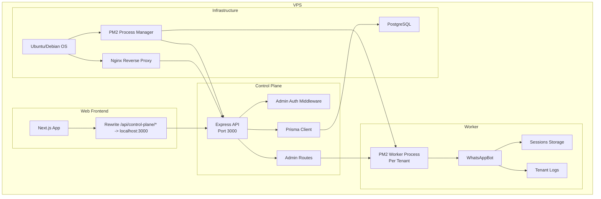
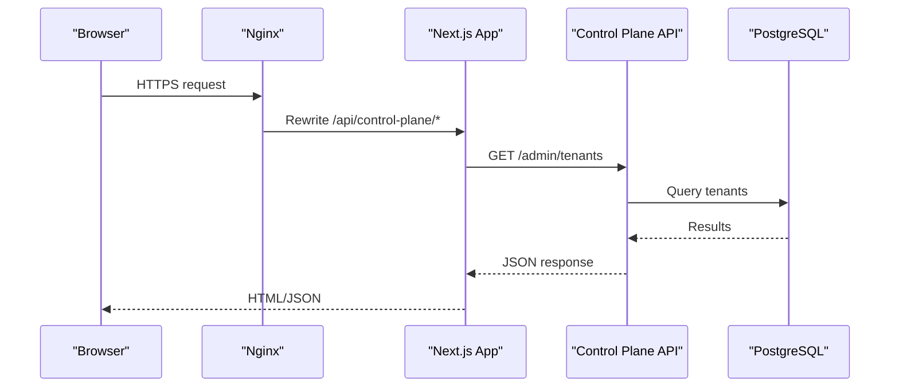
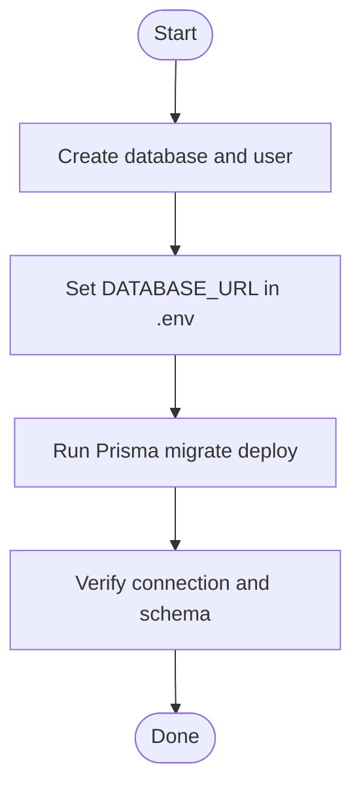
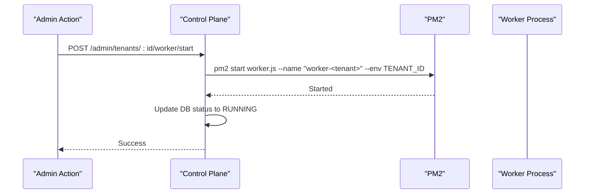
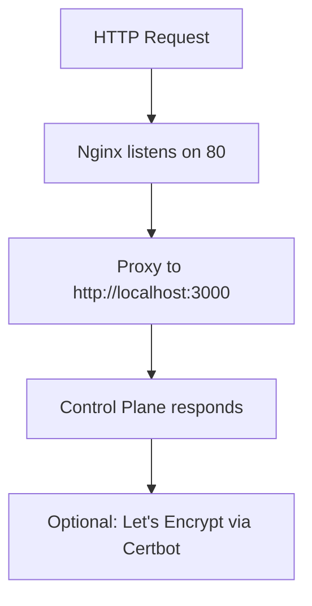

# Deployment Guide

<cite>
**Referenced Files in This Document**
- [README.md](file://README.md)
- [package.json](file://package.json)
- [ecosystem.config.js](file://ecosystem.config.js)
- [.env.example](file://.env.example)
- [apps/control-plane/package.json](file://apps/control-plane/package.json)
- [apps/control-plane/src/server.ts](file://apps/control-plane/src/server.ts)
- [apps/control-plane/src/middleware/auth.ts](file://apps/control-plane/src/middleware/auth.ts)
- [apps/control-plane/src/routes/admin.ts](file://apps/control-plane/src/routes/admin.ts)
- [apps/worker/src/worker.ts](file://apps/worker/src/worker.ts)
- [apps/web/next.config.js](file://apps/web/next.config.js)
- [packages/shared/src/prisma/schema.prisma](file://packages/shared/src/prisma/schema.prisma)
- [packages/shared/src/utils/logger.ts](file://packages/shared/src/utils/logger.ts)
</cite>

## Table of Contents
1. [Introduction](#introduction)
2. [Project Structure](#project-structure)
3. [Core Components](#core-components)
4. [Architecture Overview](#architecture-overview)
5. [Detailed Component Analysis](#detailed-component-analysis)
6. [Dependency Analysis](#dependency-analysis)
7. [Performance Considerations](#performance-considerations)
8. [Troubleshooting Guide](#troubleshooting-guide)
9. [Conclusion](#conclusion)
10. [Appendices](#appendices)

## Introduction
This guide provides end-to-end deployment instructions for the Flow HQ platform on a production VPS running Ubuntu/Debian. It covers system prerequisites, PostgreSQL setup, application builds, PM2 process management, reverse proxy configuration with Nginx, SSL certificates with Let’s Encrypt, environment configuration, and production verification. It also includes monitoring, maintenance, backup strategies, disaster recovery, troubleshooting, performance optimization, and scaling considerations.

## Project Structure
The platform consists of:
- Control Plane: Admin API and dashboard (Express + EJS)
- Worker: Per-tenant WhatsApp bot process (whatsapp-web.js)
- Shared: Common types, Prisma client, and utilities
- Web: Next.js frontend that proxies API calls to the Control Plane
- Sessions and Logs: Persistent directories for session data and logs



**Diagram sources**
- [apps/control-plane/src/server.ts](file://apps/control-plane/src/server.ts#L10-L89)
- [apps/control-plane/src/middleware/auth.ts](file://apps/control-plane/src/middleware/auth.ts#L1-L40)
- [apps/control-plane/src/routes/admin.ts](file://apps/control-plane/src/routes/admin.ts#L174-L332)
- [apps/worker/src/worker.ts](file://apps/worker/src/worker.ts#L1-L46)
- [apps/web/next.config.js](file://apps/web/next.config.js#L1-L17)
- [packages/shared/src/prisma/schema.prisma](file://packages/shared/src/prisma/schema.prisma#L1-L178)

**Section sources**
- [README.md](file://README.md#L116-L129)

## Core Components
- Control Plane API: Validates environment, connects to PostgreSQL, exposes admin and portal endpoints, and manages stale workers.
- Worker: Starts per-tenant WhatsApp sessions, persists sessions, and writes tenant-specific logs.
- Shared: Provides Prisma schema, logger utilities, and common types.
- Web: Rewrites API traffic to the Control Plane for the portal.

Key deployment scripts and configuration:
- Root build and workspace scripts are defined at the root.
- PM2 configuration defines the Control Plane process and logging.
- Environment variables define database, admin credentials, ports, logging, and worker behavior.

**Section sources**
- [package.json](file://package.json#L9-L16)
- [ecosystem.config.js](file://ecosystem.config.js#L1-L19)
- [.env.example](file://.env.example#L1-L22)
- [apps/control-plane/src/server.ts](file://apps/control-plane/src/server.ts#L16-L39)
- [apps/control-plane/src/routes/admin.ts](file://apps/control-plane/src/routes/admin.ts#L174-L230)
- [apps/worker/src/worker.ts](file://apps/worker/src/worker.ts#L7-L24)
- [packages/shared/src/utils/logger.ts](file://packages/shared/src/utils/logger.ts#L5-L30)
- [apps/web/next.config.js](file://apps/web/next.config.js#L6-L13)

## Architecture Overview
The Control Plane runs on port 3000 and is proxied by Nginx. The Web app proxies API calls to the Control Plane. PM2 manages the Control Plane and per-tenant Worker processes. PostgreSQL stores tenant, session, and messaging data. Sessions and logs are persisted on disk.



**Diagram sources**
- [apps/web/next.config.js](file://apps/web/next.config.js#L6-L13)
- [apps/control-plane/src/server.ts](file://apps/control-plane/src/server.ts#L47-L52)
- [packages/shared/src/prisma/schema.prisma](file://packages/shared/src/prisma/schema.prisma#L60-L76)

## Detailed Component Analysis

### VPS Setup (Ubuntu/Debian)
Follow the official steps to prepare the system:
- Update and upgrade the system.
- Install Node.js 18+, PostgreSQL, PM2 globally, Chromium for whatsapp-web.js, and Git.
- Create the application directory and clone the repository.
- Install dependencies for each workspace and build the applications.
- Configure environment variables and run database migrations.

Verification steps include accessing the admin dashboard, verifying database connectivity, creating a test tenant, starting a worker, and running the stress test.

**Section sources**
- [README.md](file://README.md#L262-L350)
- [README.md](file://README.md#L389-L403)

### PostgreSQL Database Configuration
- Create the database and user with appropriate privileges.
- Set the DATABASE_URL environment variable to match the database host, user, password, and port.
- Run Prisma migrations in production to apply schema changes.



**Diagram sources**
- [README.md](file://README.md#L287-L298)
- [README.md](file://README.md#L333-L338)
- [.env.example](file://.env.example#L2)

**Section sources**
- [README.md](file://README.md#L287-L298)
- [README.md](file://README.md#L333-L338)
- [.env.example](file://.env.example#L2)

### PM2 Process Management
- PM2 configuration defines the Control Plane process with production environment, logging, and restart policies.
- Start the Control Plane with PM2 and save the configuration to enable auto-start on boot.
- Workers are started dynamically by the Control Plane via PM2 using per-tenant names and environment variables.



**Diagram sources**
- [apps/control-plane/src/routes/admin.ts](file://apps/control-plane/src/routes/admin.ts#L174-L230)
- [ecosystem.config.js](file://ecosystem.config.js#L1-L19)

**Section sources**
- [ecosystem.config.js](file://ecosystem.config.js#L1-L19)
- [apps/control-plane/src/routes/admin.ts](file://apps/control-plane/src/routes/admin.ts#L174-L230)

### Reverse Proxy with Nginx
- Install Nginx and configure a site to proxy HTTP traffic to the Control Plane on port 3000.
- Enable the site, test the configuration, and restart Nginx.
- Obtain SSL certificates using Certbot with the Nginx plugin for automatic HTTPS.



**Diagram sources**
- [README.md](file://README.md#L351-L380)
- [README.md](file://README.md#L382-L387)

**Section sources**
- [README.md](file://README.md#L351-L380)
- [README.md](file://README.md#L382-L387)

### Environment Configuration
Critical environment variables include:
- DATABASE_URL: PostgreSQL connection string
- ADMIN_PASSWORD: Admin dashboard password
- PORTAL_INTERNAL_KEY: Shared secret for internal portal API
- NODE_ENV, PORT, LOG_LEVEL: Runtime and logging settings
- SESSIONS_PATH, LOGS_PATH: Paths for persistent data
- Worker tuning: RATE_LIMIT_MAX_PER_MINUTE, HEARTBEAT_INTERVAL_MS, STALE_THRESHOLD_MINUTES, STALE_CHECK_INTERVAL_MS
- PUPPETEER_EXECUTABLE_PATH: Path to Chromium for whatsapp-web.js

Ensure these are set in the production environment and validated by the Control Plane on startup.

**Section sources**
- [.env.example](file://.env.example#L1-L22)
- [apps/control-plane/src/server.ts](file://apps/control-plane/src/server.ts#L16-L39)
- [apps/control-plane/src/server.ts](file://apps/control-plane/src/server.ts#L54-L63)

### SSL Certificate Setup with Let's Encrypt
- Install Certbot with the Nginx plugin.
- Obtain and automatically configure the certificate for your domain.
- Renewals are handled automatically by Certbot.

**Section sources**
- [README.md](file://README.md#L382-L387)

### Production Verification Procedures
- Access the admin dashboard over HTTPS and authenticate with ADMIN_PASSWORD.
- Confirm database connectivity and create a test tenant.
- Start a worker and verify PM2 status.
- Monitor the health dashboard for periodic updates.
- Validate rate limiting and run the stress test to confirm multi-tenant isolation.

**Section sources**
- [README.md](file://README.md#L389-L403)

### Monitoring and Maintenance
- View Control Plane logs via PM2 and tail tenant-specific logs.
- Check PM2 status and database connectivity regularly.
- Restart services as needed using PM2 commands.

**Section sources**
- [README.md](file://README.md#L404-L441)

### Log Management
- Centralized logging uses Pino with pretty output to console and tenant-specific files under logs/.
- The logger creates the logs directory if it does not exist and rotates logs via file transport.

**Section sources**
- [packages/shared/src/utils/logger.ts](file://packages/shared/src/utils/logger.ts#L5-L30)

### Backup Strategies and Disaster Recovery
- Back up PostgreSQL databases regularly using pg_dump or your cloud provider’s backup solution.
- Back up the sessions/ directory to preserve WhatsApp session data.
- Maintain offsite backups and test restoration procedures.

[No sources needed since this section provides general guidance]

### Scaling Considerations
- Horizontal scaling: Run multiple Control Plane instances behind a load balancer and share the PostgreSQL database.
- Worker scaling: Each tenant runs a dedicated Worker process managed by PM2; ensure sufficient CPU/RAM per tenant workload.
- Database scaling: Use managed PostgreSQL with read replicas and proper indexing aligned to the schema.

[No sources needed since this section provides general guidance]

## Dependency Analysis
The Control Plane depends on Prisma for database operations and uses PM2 to manage itself and Workers. The Worker depends on the shared package and external libraries for WhatsApp integration. The Web app proxies API calls to the Control Plane.

```mermaid
graph LR
CP_PKG["Control Plane Package.json"] --> CP_DEPS["@flowhq/shared", "express", "pm2"]
W_PKG["Worker Package.json"] --> W_DEPS["@flowhq/shared", "whatsapp-web.js"]
SH_PRISMA["Shared Prisma Schema"] --> DB["PostgreSQL"]
CP_DEPS --> DB
W_DEPS --> CP_DEPS
```

**Diagram sources**
- [apps/control-plane/package.json](file://apps/control-plane/package.json#L9-L16)
- [apps/worker/package.json](file://apps/worker/package.json#L9-L14)
- [packages/shared/src/prisma/schema.prisma](file://packages/shared/src/prisma/schema.prisma#L1-L10)

**Section sources**
- [apps/control-plane/package.json](file://apps/control-plane/package.json#L9-L16)
- [apps/worker/package.json](file://apps/worker/package.json#L9-L14)
- [packages/shared/src/prisma/schema.prisma](file://packages/shared/src/prisma/schema.prisma#L1-L10)

## Performance Considerations
- Tune rate limiting and heartbeat intervals to balance responsiveness and resource usage.
- Monitor memory usage and set PM2 max_memory_restart thresholds appropriately.
- Use a reverse proxy and caching layer for static assets if needed.
- Optimize database queries and maintain indexes as the dataset grows.

[No sources needed since this section provides general guidance]

## Troubleshooting Guide
Common production issues and resolutions:
- Worker fails to start: Verify Chromium path and PUPPETEER_EXECUTABLE_PATH, check worker logs via PM2, and ensure sessions directory permissions.
- Stale workers: The Control Plane marks workers as ERROR after exceeding STALE_THRESHOLD_MINUTES; use Force Restart from the admin panel.
- Database connection failures: Test connectivity with psql and verify PostgreSQL service status.
- Admin authentication: Ensure ADMIN_PASSWORD is set and matches the value used for Basic Auth or query parameter.

**Section sources**
- [README.md](file://README.md#L452-L475)
- [apps/control-plane/src/server.ts](file://apps/control-plane/src/server.ts#L34-L38)
- [apps/control-plane/src/routes/admin.ts](file://apps/control-plane/src/routes/admin.ts#L30-L80)

## Conclusion
By following this deployment guide, you can reliably operate Flow HQ on a production VPS. Ensure all prerequisites are met, environment variables are correctly configured, PM2 manages processes, Nginx proxies traffic, and SSL is enabled. Monitor logs, maintain backups, and validate performance and stability with the provided verification steps.

[No sources needed since this section summarizes without analyzing specific files]

## Appendices

### A. Environment Variables Reference
- DATABASE_URL: PostgreSQL connection string
- ADMIN_PASSWORD: Admin dashboard password
- PORTAL_INTERNAL_KEY: Shared internal API key
- NODE_ENV: Environment (development/production)
- PORT: API server port
- LOG_LEVEL: Logging level
- SESSIONS_PATH: WhatsApp session storage path
- LOGS_PATH: Log files path
- RATE_LIMIT_MAX_PER_MINUTE: Rate limit per tenant
- HEARTBEAT_INTERVAL_MS: Worker heartbeat interval
- STALE_THRESHOLD_MINUTES: Threshold for stale worker detection
- STALE_CHECK_INTERVAL_MS: Interval to check stale workers
- PUPPETEER_EXECUTABLE_PATH: Path to Chromium binary

**Section sources**
- [.env.example](file://.env.example#L1-L22)

### B. Control Plane Startup and Validation
- Validate environment variables and database connectivity during startup.
- Start stale worker checker on interval.
- Redirect root to admin tenants page.

**Section sources**
- [apps/control-plane/src/server.ts](file://apps/control-plane/src/server.ts#L16-L39)
- [apps/control-plane/src/server.ts](file://apps/control-plane/src/server.ts#L54-L76)

### C. Worker Lifecycle Management
- Start worker with PM2 using TENANT_ID and SESSIONS_PATH.
- Graceful shutdown on SIGTERM/SIGINT.
- Uncaught exceptions and rejections are logged and handled.

**Section sources**
- [apps/control-plane/src/routes/admin.ts](file://apps/control-plane/src/routes/admin.ts#L174-L230)
- [apps/worker/src/worker.ts](file://apps/worker/src/worker.ts#L26-L45)

### D. Web API Proxy Configuration
- Next.js rewrites /api/control-plane/* to the Control Plane on localhost:3000.

**Section sources**
- [apps/web/next.config.js](file://apps/web/next.config.js#L6-L13)