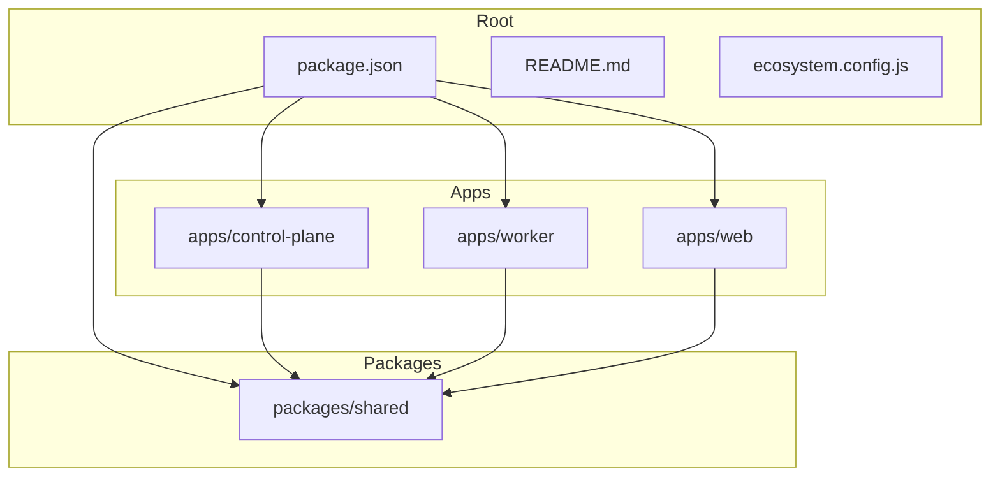
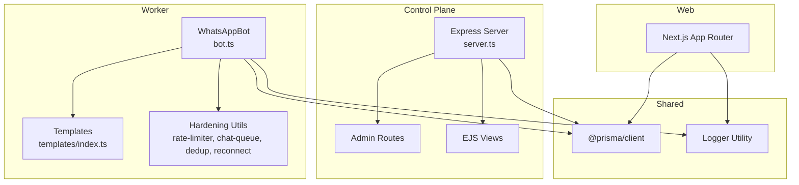
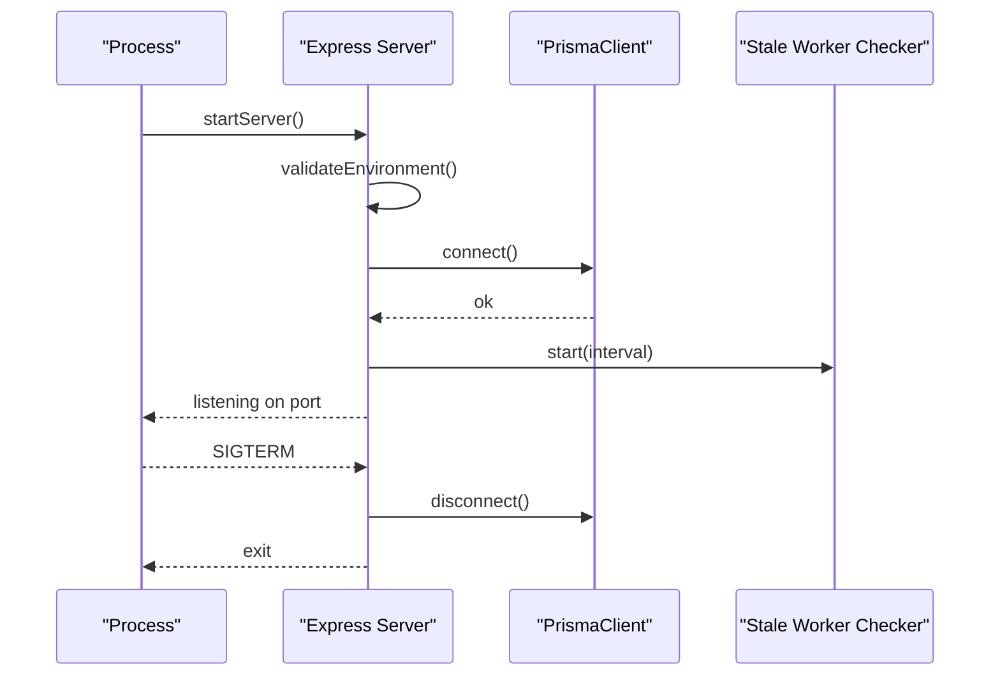
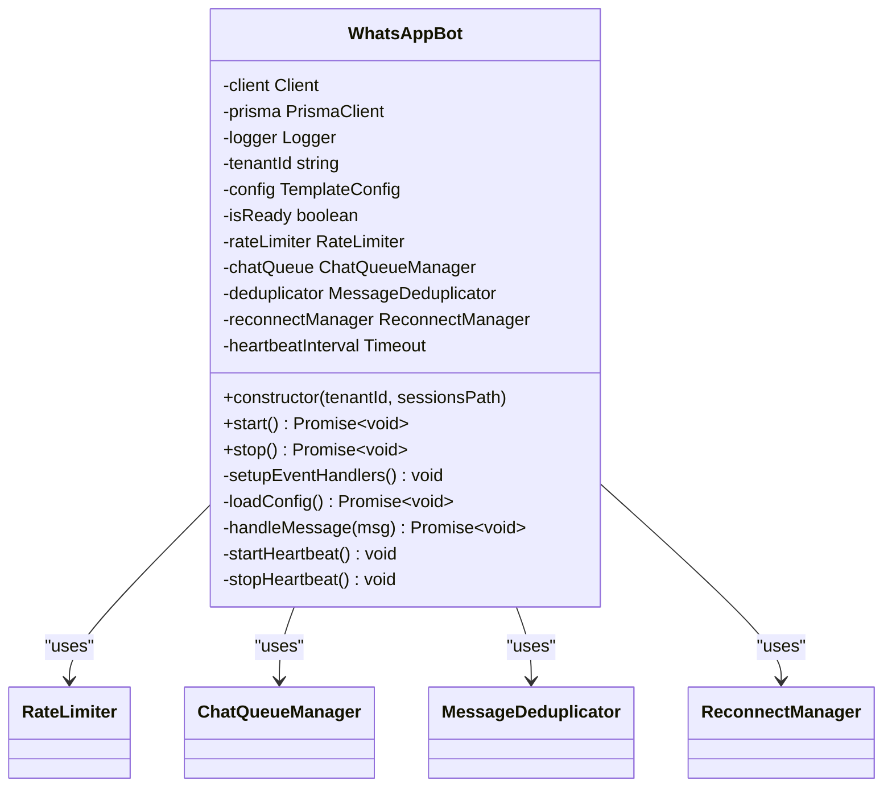
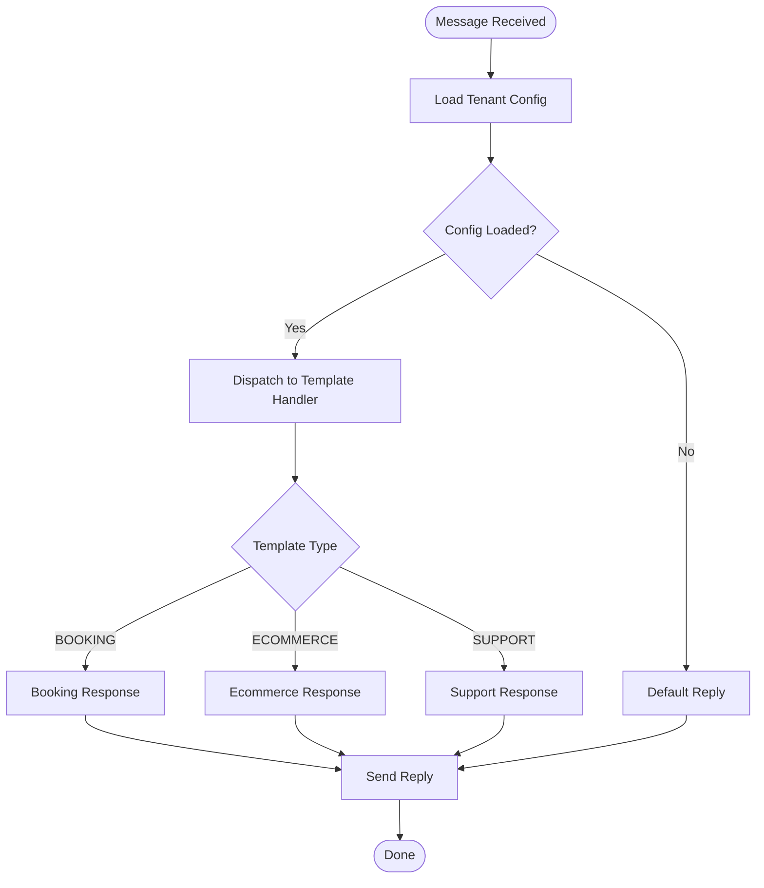
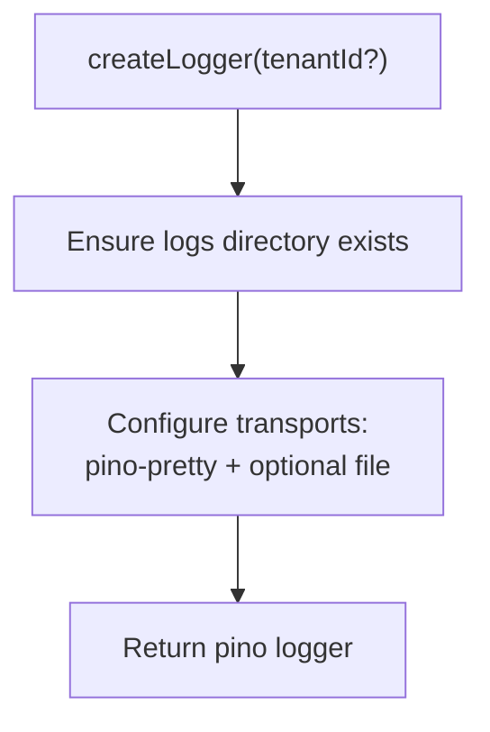
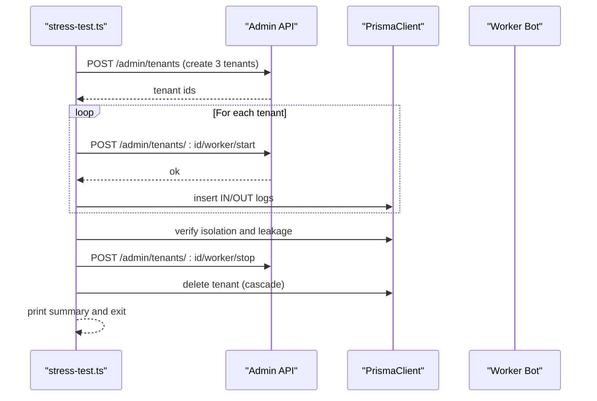
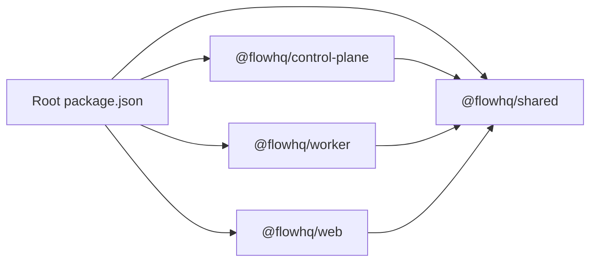

# Development Guide

<cite>
**Referenced Files in This Document**
- [package.json](file://package.json)
- [README.md](file://README.md)
- [ecosystem.config.js](file://ecosystem.config.js)
- [apps/control-plane/package.json](file://apps/control-plane/package.json)
- [apps/control-plane/tsconfig.json](file://apps/control-plane/tsconfig.json)
- [apps/control-plane/src/server.ts](file://apps/control-plane/src/server.ts)
- [apps/web/package.json](file://apps/web/package.json)
- [apps/web/tsconfig.json](file://apps/web/tsconfig.json)
- [apps/worker/package.json](file://apps/worker/package.json)
- [apps/worker/tsconfig.json](file://apps/worker/tsconfig.json)
- [apps/worker/src/worker.ts](file://apps/worker/src/worker.ts)
- [apps/worker/src/bot.ts](file://apps/worker/src/bot.ts)
- [apps/worker/src/templates/index.ts](file://apps/worker/src/templates/index.ts)
- [packages/shared/package.json](file://packages/shared/package.json)
- [packages/shared/tsconfig.json](file://packages/shared/tsconfig.json)
- [packages/shared/src/index.ts](file://packages/shared/src/index.ts)
- [packages/shared/src/utils/logger.ts](file://packages/shared/src/utils/logger.ts)
- [scripts/stress-test.ts](file://scripts/stress-test.ts)
</cite>

## Table of Contents
1. [Introduction](#introduction)
2. [Project Structure](#project-structure)
3. [Core Components](#core-components)
4. [Architecture Overview](#architecture-overview)
5. [Detailed Component Analysis](#detailed-component-analysis)
6. [Dependency Analysis](#dependency-analysis)
7. [Performance Considerations](#performance-considerations)
8. [Troubleshooting Guide](#troubleshooting-guide)
9. [Conclusion](#conclusion)
10. [Appendices](#appendices)

## Introduction
This guide provides end-to-end development documentation for the Flow HQ platform. It covers local setup, workspace configuration, TypeScript compilation settings, development servers, code organization, testing strategies, contribution guidelines, monorepo structure, package interdependencies, build processes, and practical examples for extending functionality such as adding new features, creating custom templates, extending the API, and debugging techniques. It also outlines best practices, code quality standards, and collaborative workflows to maintain consistency across the codebase.

## Project Structure
Flow HQ follows a monorepo layout with three applications and a shared package:
- apps/control-plane: Admin API and dashboard built with Express and EJS
- apps/web: Next.js frontend for portal and marketing pages
- apps/worker: Per-tenant WhatsApp bot process using whatsapp-web.js
- packages/shared: Shared types, Prisma client, and utilities
- scripts: Stress test to validate multi-tenant isolation
- Root configuration: Workspaces, scripts, and ecosystem management

**Diagram sources**
- [package.json](file://package.json#L1-L21)
- [apps/control-plane/package.json](file://apps/control-plane/package.json#L1-L24)
- [apps/web/package.json](file://apps/web/package.json#L1-L27)
- [apps/worker/package.json](file://apps/worker/package.json#L1-L22)
- [packages/shared/package.json](file://packages/shared/package.json#L1-L23)

**Section sources**
- [README.md](file://README.md#L116-L129)
- [package.json](file://package.json#L1-L21)

## Core Components
- Control Plane (Express + EJS): Admin API and dashboard for managing tenants, workers, QR codes, and logs
- Worker (whatsapp-web.js): Per-tenant WhatsApp bot with rate limiting, queues, deduplication, reconnect, and heartbeat
- Web (Next.js): Portal and marketing UI with authentication and routing
- Shared Package: Prisma client, types, and logging utilities

Key responsibilities:
- Control Plane: Validates environment, connects to the database, exposes admin endpoints, and runs periodic stale worker checks
- Worker: Manages WhatsApp sessions, processes messages sequentially, enforces rate limits, and persists logs and session state
- Web: Provides portal UI and marketing pages integrated with Next.js App Router
- Shared: Centralizes Prisma client and logging utilities used across apps

**Section sources**
- [apps/control-plane/src/server.ts](file://apps/control-plane/src/server.ts#L1-L89)
- [apps/worker/src/bot.ts](file://apps/worker/src/bot.ts#L1-L411)
- [apps/web/tsconfig.json](file://apps/web/tsconfig.json#L1-L27)
- [packages/shared/src/index.ts](file://packages/shared/src/index.ts#L1-L4)

## Architecture Overview
The system comprises:
- Control Plane: Exposes admin endpoints and renders the dashboard
- Worker: Runs per tenant, handles WhatsApp events, and interacts with the database
- Shared: Provides Prisma client and logging utilities
- Web: Frontend for portal and marketing pages

**Diagram sources**
- [apps/control-plane/src/server.ts](file://apps/control-plane/src/server.ts#L1-L89)
- [apps/worker/src/bot.ts](file://apps/worker/src/bot.ts#L1-L411)
- [apps/worker/src/templates/index.ts](file://apps/worker/src/templates/index.ts#L1-L70)
- [packages/shared/src/index.ts](file://packages/shared/src/index.ts#L1-L4)
- [packages/shared/src/utils/logger.ts](file://packages/shared/src/utils/logger.ts#L1-L33)

## Detailed Component Analysis

### Control Plane Server
Responsibilities:
- Load environment variables, validate prerequisites, connect to the database
- Configure Express app, set view engine, and mount admin and portal routes
- Start stale worker checker on an interval
- Graceful shutdown handling

**Diagram sources**
- [apps/control-plane/src/server.ts](file://apps/control-plane/src/server.ts#L65-L89)

**Section sources**
- [apps/control-plane/src/server.ts](file://apps/control-plane/src/server.ts#L1-L89)
- [apps/control-plane/tsconfig.json](file://apps/control-plane/tsconfig.json#L1-L18)

### Worker Bot
Responsibilities:
- Initialize WhatsApp client with LocalAuth and session persistence
- Handle QR generation, connection, disconnection, and auth failures
- Enforce rate limits, process messages sequentially per chat, deduplicate messages, and reconnect on failures
- Emit heartbeats and update statuses in the database
- Graceful shutdown and global error boundary to prevent worker crashes

**Diagram sources**
- [apps/worker/src/bot.ts](file://apps/worker/src/bot.ts#L12-L411)

**Section sources**
- [apps/worker/src/bot.ts](file://apps/worker/src/bot.ts#L1-L411)
- [apps/worker/src/worker.ts](file://apps/worker/src/worker.ts#L1-L46)
- [apps/worker/tsconfig.json](file://apps/worker/tsconfig.json#L1-L18)

### Templates and Response Logic
The worker delegates message responses to a template dispatcher. The template module exports a function that selects the appropriate response logic based on the configured template type and language.

**Diagram sources**
- [apps/worker/src/templates/index.ts](file://apps/worker/src/templates/index.ts#L1-L70)

**Section sources**
- [apps/worker/src/templates/index.ts](file://apps/worker/src/templates/index.ts#L1-L70)

### Shared Utilities and Logging
The shared package exposes Prisma client and a logger factory. The logger creates transport targets for pretty stdout and optionally per-tenant file logging.

**Diagram sources**
- [packages/shared/src/utils/logger.ts](file://packages/shared/src/utils/logger.ts#L1-L33)

**Section sources**
- [packages/shared/src/utils/logger.ts](file://packages/shared/src/utils/logger.ts#L1-L33)
- [packages/shared/src/index.ts](file://packages/shared/src/index.ts#L1-L4)

### Testing Strategy: Stress Test Script
The stress test validates multi-tenant isolation by:
- Creating test tenants via admin API
- Starting workers for each tenant
- Injecting inbound/outbound messages into the database
- Verifying tenant isolation, absence of cross-tenant data leakage, session isolation, and worker process isolation
- Cleaning up resources after completion

**Diagram sources**
- [scripts/stress-test.ts](file://scripts/stress-test.ts#L1-L420)

**Section sources**
- [scripts/stress-test.ts](file://scripts/stress-test.ts#L1-L420)
- [README.md](file://README.md#L221-L242)

## Dependency Analysis
Workspace and inter-package dependencies:
- Root workspace defines workspaces for apps and packages
- Control Plane depends on Shared
- Worker depends on Shared
- Web depends on Shared
- Shared depends on @prisma/client and exposes Prisma client and logger

**Diagram sources**
- [package.json](file://package.json#L5-L8)
- [apps/control-plane/package.json](file://apps/control-plane/package.json#L9-L16)
- [apps/worker/package.json](file://apps/worker/package.json#L9-L14)
- [apps/web/package.json](file://apps/web/package.json#L10-L17)
- [packages/shared/package.json](file://packages/shared/package.json#L12-L16)

**Section sources**
- [package.json](file://package.json#L1-L21)
- [apps/control-plane/package.json](file://apps/control-plane/package.json#L1-L24)
- [apps/worker/package.json](file://apps/worker/package.json#L1-L22)
- [apps/web/package.json](file://apps/web/package.json#L1-L27)
- [packages/shared/package.json](file://packages/shared/package.json#L1-L23)

## Performance Considerations
- Heartbeat intervals and stale worker detection prevent resource leaks and ensure liveness
- Rate limiting prevents flooding and protects downstream systems
- Sequential per-chat processing avoids race conditions and ensures ordered replies
- Message de-duplication reduces redundant processing
- Reconnect with exponential backoff improves resilience against transient failures
- Logging is structured and supports per-tenant file output for targeted diagnostics

[No sources needed since this section provides general guidance]

## Troubleshooting Guide
Common issues and resolutions:
- QR code not appearing: check worker logs, ensure worker started, and wait for QR generation
- Session not persisting: confirm sessions directory exists and SESSIONS_PATH is set correctly
- Database connection errors: verify PostgreSQL is running and DATABASE_URL format is correct
- WhatsApp Web errors: ensure Chromium is installed and PUPPETEER_EXECUTABLE_PATH is set
- Worker won't start in production: verify Chrome path and PUPPETEER_EXECUTABLE_PATH
- Stale workers: dashboard marks workers as STALE when heartbeat stops; use Force Restart
- Database connectivity: test connection and check service status

**Section sources**
- [README.md](file://README.md#L185-L208)
- [README.md](file://README.md#L452-L474)

## Conclusion
This guide outlined the Flow HQ development workflow, covering monorepo structure, workspace configuration, TypeScript settings, development servers, code organization, testing, and operational best practices. By following the provided patterns and leveraging the shared utilities, contributors can safely extend functionality, add new template types, and maintain consistency across the platform.

[No sources needed since this section summarizes without analyzing specific files]

## Appendices

### Local Development Setup
- Install root and workspace dependencies
- Copy and configure environment variables
- Generate Prisma client and run migrations
- Build applications
- Start Control Plane in development mode
- Start Worker for a specific tenant with TENANT_ID and SESSIONS_PATH

**Section sources**
- [README.md](file://README.md#L18-L63)
- [README.md](file://README.md#L209-L219)

### TypeScript Compilation Settings
- Control Plane: CommonJS target with strict mode and Node types
- Worker: CommonJS target with strict mode and Node types
- Web: Next.js-appropriate compiler options with bundler resolution and JSX preservation
- Shared: Declaration generation and source maps enabled

**Section sources**
- [apps/control-plane/tsconfig.json](file://apps/control-plane/tsconfig.json#L1-L18)
- [apps/worker/tsconfig.json](file://apps/worker/tsconfig.json#L1-L18)
- [apps/web/tsconfig.json](file://apps/web/tsconfig.json#L1-L27)
- [packages/shared/tsconfig.json](file://packages/shared/tsconfig.json#L1-L20)

### Development Server Configuration
- Control Plane: Dev script uses tsx watch on server entry
- Worker: Dev script uses tsx on worker entry
- Web: Next.js dev server on port 3001
- Production: PM2 manages the Control Plane process with logging and restart policies

**Section sources**
- [apps/control-plane/package.json](file://apps/control-plane/package.json#L4-L8)
- [apps/worker/package.json](file://apps/worker/package.json#L4-L8)
- [apps/web/package.json](file://apps/web/package.json#L5-L9)
- [ecosystem.config.js](file://ecosystem.config.js#L1-L19)

### Adding a New Template Type
Steps:
- Create a new template file under apps/worker/src/templates/
- Export the response function from apps/worker/src/templates/index.ts
- Update the TemplateConfig union and default fallback if needed
- Optionally update Prisma schema enum for template_type and run migrations

**Section sources**
- [README.md](file://README.md#L244-L249)
- [apps/worker/src/templates/index.ts](file://apps/worker/src/templates/index.ts#L1-L70)

### Extending the API
- Add new routes in the Control Plane and mount them appropriately
- Use the shared Prisma client for database operations
- Apply authentication middleware where required
- Validate environment variables and handle graceful shutdown

**Section sources**
- [apps/control-plane/src/server.ts](file://apps/control-plane/src/server.ts#L1-L89)
- [apps/control-plane/package.json](file://apps/control-plane/package.json#L9-L16)

### Debugging Techniques
- Use structured logs with tenant context for targeted insights
- Tail logs per tenant and control plane logs
- Monitor PM2 status and logs for process health
- Utilize the stress test to validate isolation and detect regressions

**Section sources**
- [packages/shared/src/utils/logger.ts](file://packages/shared/src/utils/logger.ts#L1-L33)
- [README.md](file://README.md#L406-L440)
- [scripts/stress-test.ts](file://scripts/stress-test.ts#L1-L420)

### Contribution Guidelines
- Keep changes scoped to a single feature or bug fix
- Add or update tests, especially for multi-tenant scenarios
- Maintain consistent logging and error handling patterns
- Update documentation and README sections affected by changes
- Follow the established monorepo structure and package interdependencies

[No sources needed since this section provides general guidance]