# API Integration

<cite>
**Referenced Files in This Document**
- [apps/web/src/app/api/portal/me/route.ts](file://apps/web/src/app/api/portal/me/route.ts)
- [apps/web/src/app/api/portal/setup-request/route.ts](file://apps/web/src/app/api/portal/setup-request/route.ts)
- [apps/web/src/app/api/portal/tenant/current/status/route.ts](file://apps/web/src/app/api/portal/tenant/current/status/route.ts)
- [apps/web/src/app/api/portal/tenant/current/qr/route.ts](file://apps/web/src/app/api/portal/tenant/current/qr/route.ts)
- [apps/web/src/app/api/portal/tenant/current/logs/route.ts](file://apps/web/src/app/api/portal/tenant/current/logs/route.ts)
- [apps/web/src/lib/auth.ts](file://apps/web/src/lib/auth.ts)
- [apps/web/src/lib/prisma.ts](file://apps/web/src/lib/prisma.ts)
- [apps/web/src/middleware.ts](file://apps/web/src/middleware.ts)
- [apps/web/src/app/api/auth/[...nextauth]/route.ts](file://apps/web/src/app/api/auth/[...nextauth]/route.ts)
- [apps/control-plane/src/routes/portal.ts](file://apps/control-plane/src/routes/portal.ts)
- [apps/control-plane/src/server.ts](file://apps/control-plane/src/server.ts)
- [packages/shared/src/types/index.ts](file://packages/shared/src/types/index.ts)
</cite>

## Table of Contents
1. [Introduction](#introduction)
2. [Project Structure](#project-structure)
3. [Core Components](#core-components)
4. [Architecture Overview](#architecture-overview)
5. [Detailed Component Analysis](#detailed-component-analysis)
6. [Dependency Analysis](#dependency-analysis)
7. [Performance Considerations](#performance-considerations)
8. [Troubleshooting Guide](#troubleshooting-guide)
9. [Conclusion](#conclusion)

## Introduction
This document explains the API integration patterns and data management for the portal, focusing on:
- Portal API endpoints for user profile management, setup requests, tenant status monitoring, and QR code generation
- Prisma client integration for database operations
- API route handlers implementation and data fetching strategies
- Practical examples of GET/POST request handling, response formatting, error handling, and authentication verification
- Integration with the control plane API, request/response schemas, and real-time data synchronization
- Caching strategies, loading states, and error boundary implementations for robust user experience

## Project Structure
The portal is implemented as a Next.js application with API routes under apps/web/src/app/api/portal/. These routes act as thin wrappers around the control plane API, validating internal keys and forwarding authenticated requests with user context. The control plane is an Express service under apps/control-plane/ that exposes the actual endpoints and performs database operations via Prisma.

**Diagram sources**
- [apps/web/src/app/api/portal/me/route.ts](file://apps/web/src/app/api/portal/me/route.ts#L1-L35)
- [apps/web/src/app/api/portal/setup-request/route.ts](file://apps/web/src/app/api/portal/setup-request/route.ts#L1-L40)
- [apps/web/src/app/api/portal/tenant/current/status/route.ts](file://apps/web/src/app/api/portal/tenant/current/status/route.ts#L1-L35)
- [apps/web/src/app/api/portal/tenant/current/qr/route.ts](file://apps/web/src/app/api/portal/tenant/current/qr/route.ts#L1-L35)
- [apps/web/src/app/api/portal/tenant/current/logs/route.ts](file://apps/web/src/app/api/portal/tenant/current/logs/route.ts#L1-L35)
- [apps/web/src/lib/auth.ts](file://apps/web/src/lib/auth.ts#L1-L76)
- [apps/web/src/lib/prisma.ts](file://apps/web/src/lib/prisma.ts#L1-L10)
- [apps/web/src/middleware.ts](file://apps/web/src/middleware.ts#L1-L44)
- [apps/control-plane/src/routes/portal.ts](file://apps/control-plane/src/routes/portal.ts#L1-L246)
- [apps/control-plane/src/server.ts](file://apps/control-plane/src/server.ts#L1-L89)
- [packages/shared/src/types/index.ts](file://packages/shared/src/types/index.ts#L1-L41)

**Section sources**
- [apps/web/src/app/api/portal/me/route.ts](file://apps/web/src/app/api/portal/me/route.ts#L1-L35)
- [apps/web/src/app/api/portal/setup-request/route.ts](file://apps/web/src/app/api/portal/setup-request/route.ts#L1-L40)
- [apps/web/src/app/api/portal/tenant/current/status/route.ts](file://apps/web/src/app/api/portal/tenant/current/status/route.ts#L1-L35)
- [apps/web/src/app/api/portal/tenant/current/qr/route.ts](file://apps/web/src/app/api/portal/tenant/current/qr/route.ts#L1-L35)
- [apps/web/src/app/api/portal/tenant/current/logs/route.ts](file://apps/web/src/app/api/portal/tenant/current/logs/route.ts#L1-L35)
- [apps/web/src/lib/auth.ts](file://apps/web/src/lib/auth.ts#L1-L76)
- [apps/web/src/lib/prisma.ts](file://apps/web/src/lib/prisma.ts#L1-L10)
- [apps/web/src/middleware.ts](file://apps/web/src/middleware.ts#L1-L44)
- [apps/control-plane/src/routes/portal.ts](file://apps/control-plane/src/routes/portal.ts#L1-L246)
- [apps/control-plane/src/server.ts](file://apps/control-plane/src/server.ts#L1-L89)
- [packages/shared/src/types/index.ts](file://packages/shared/src/types/index.ts#L1-L41)

## Core Components
- Portal API routes: Thin wrappers that authenticate via NextAuth, extract the user email, and forward requests to the control plane with an internal key and user context.
- Control plane routes: Enforce internal key validation, resolve the user by email header, and perform database operations via Prisma.
- Authentication and session management: NextAuth with Google provider and Prisma adapter; middleware enforces protected routes and redirects based on setup status.
- Prisma client: Singleton client initialized in both web and control plane contexts.
- Shared types: Tenant and input types used across the system.

**Section sources**
- [apps/web/src/app/api/portal/me/route.ts](file://apps/web/src/app/api/portal/me/route.ts#L1-L35)
- [apps/web/src/app/api/portal/setup-request/route.ts](file://apps/web/src/app/api/portal/setup-request/route.ts#L1-L40)
- [apps/web/src/app/api/portal/tenant/current/status/route.ts](file://apps/web/src/app/api/portal/tenant/current/status/route.ts#L1-L35)
- [apps/web/src/app/api/portal/tenant/current/qr/route.ts](file://apps/web/src/app/api/portal/tenant/current/qr/route.ts#L1-L35)
- [apps/web/src/app/api/portal/tenant/current/logs/route.ts](file://apps/web/src/app/api/portal/tenant/current/logs/route.ts#L1-L35)
- [apps/control-plane/src/routes/portal.ts](file://apps/control-plane/src/routes/portal.ts#L1-L246)
- [apps/web/src/lib/auth.ts](file://apps/web/src/lib/auth.ts#L1-L76)
- [apps/web/src/lib/prisma.ts](file://apps/web/src/lib/prisma.ts#L1-L10)
- [packages/shared/src/types/index.ts](file://packages/shared/src/types/index.ts#L1-L41)

## Architecture Overview
The portal API routes delegate to the control plane after verifying the internal key and extracting the user’s email from the NextAuth session. The control plane validates the internal key, resolves the user by email, and returns structured JSON responses. Shared types define the shape of tenant-related data.

**Diagram sources**
- [apps/web/src/app/api/portal/me/route.ts](file://apps/web/src/app/api/portal/me/route.ts#L8-L29)
- [apps/control-plane/src/routes/portal.ts](file://apps/control-plane/src/routes/portal.ts#L52-L79)
- [apps/web/src/lib/auth.ts](file://apps/web/src/lib/auth.ts#L47-L68)

## Detailed Component Analysis

### User Profile Management Endpoint
- Path: apps/web/src/app/api/portal/me/route.ts
- Method: GET
- Purpose: Fetch the authenticated user’s profile along with tenant and latest setup request from the control plane.
- Authentication: Uses NextAuth session to extract the user email; unauthorized if missing.
- Forwarding: Calls control plane endpoint /portal/me with headers:
  - x-portal-key: internal key from environment
  - x-user-email: authenticated user email
- Response: On success, returns user, tenant, and setupRequest; on failure, returns control plane error with appropriate HTTP status.

```mermaid
sequenceDiagram
participant Client as "Client"
participant Web as "GET /api/portal/me"
participant CP as "/portal/me"
participant DB as "Prisma"
Client->>Web : "GET"
Web->>Web : "getServerSession()"
alt "No session"
Web-->>Client : "401 Unauthorized"
else "Has session"
Web->>CP : "GET /portal/me<br/>with headers"
CP->>DB : "findUnique(user)<br/>include tenant"
DB-->>CP : "User+Tenant"
CP-->>Web : "JSON {user, tenant, setupRequest}"
Web-->>Client : "200 OK"
end
```

**Diagram sources**
- [apps/web/src/app/api/portal/me/route.ts](file://apps/web/src/app/api/portal/me/route.ts#L8-L29)
- [apps/control-plane/src/routes/portal.ts](file://apps/control-plane/src/routes/portal.ts#L52-L79)

**Section sources**
- [apps/web/src/app/api/portal/me/route.ts](file://apps/web/src/app/api/portal/me/route.ts#L1-L35)
- [apps/control-plane/src/routes/portal.ts](file://apps/control-plane/src/routes/portal.ts#L52-L79)

### Setup Request Submission
- Path: apps/web/src/app/api/portal/setup-request/route.ts
- Method: POST
- Purpose: Submit a setup request for the tenant associated with the authenticated user.
- Request body: Includes businessName, templateType, whatsappNumber, language.
- Control plane behavior:
  - Updates tenant name
  - Upserts tenant config
  - Creates setup request with status SUBMITTED
  - Sets tenant status to PENDING
  - Logs portal event
- Response: Returns the created setup request on success; otherwise returns an error with HTTP status.

**Diagram sources**
- [apps/web/src/app/api/portal/setup-request/route.ts](file://apps/web/src/app/api/portal/setup-request/route.ts#L8-L35)
- [apps/control-plane/src/routes/portal.ts](file://apps/control-plane/src/routes/portal.ts#L85-L153)

**Section sources**
- [apps/web/src/app/api/portal/setup-request/route.ts](file://apps/web/src/app/api/portal/setup-request/route.ts#L1-L40)
- [apps/control-plane/src/routes/portal.ts](file://apps/control-plane/src/routes/portal.ts#L85-L153)

### Tenant Status Monitoring
- Path: apps/web/src/app/api/portal/tenant/current/status/route.ts
- Method: GET
- Purpose: Retrieve current tenant status, including WhatsApp session and worker process details.
- Control plane behavior:
  - Resolves user by email header
  - Finds the latest setup request for the tenant
  - Returns tenant, setup request, and related session/process info

**Diagram sources**
- [apps/web/src/app/api/portal/tenant/current/status/route.ts](file://apps/web/src/app/api/portal/tenant/current/status/route.ts#L8-L29)
- [apps/control-plane/src/routes/portal.ts](file://apps/control-plane/src/routes/portal.ts#L159-L186)

**Section sources**
- [apps/web/src/app/api/portal/tenant/current/status/route.ts](file://apps/web/src/app/api/portal/tenant/current/status/route.ts#L1-L35)
- [apps/control-plane/src/routes/portal.ts](file://apps/control-plane/src/routes/portal.ts#L159-L186)

### QR Code Generation
- Path: apps/web/src/app/api/portal/tenant/current/qr/route.ts
- Method: GET
- Purpose: Retrieve the current WhatsApp QR code for the tenant.
- Control plane behavior:
  - Resolves tenant’s WhatsApp session
  - Returns session state and QR data URI

**Diagram sources**
- [apps/web/src/app/api/portal/tenant/current/qr/route.ts](file://apps/web/src/app/api/portal/tenant/current/qr/route.ts#L8-L29)
- [apps/control-plane/src/routes/portal.ts](file://apps/control-plane/src/routes/portal.ts#L192-L216)

**Section sources**
- [apps/web/src/app/api/portal/tenant/current/qr/route.ts](file://apps/web/src/app/api/portal/tenant/current/qr/route.ts#L1-L35)
- [apps/control-plane/src/routes/portal.ts](file://apps/control-plane/src/routes/portal.ts#L192-L216)

### Message Logs Retrieval
- Path: apps/web/src/app/api/portal/tenant/current/logs/route.ts
- Method: GET
- Purpose: Fetch recent message logs for the tenant.
- Query parameter: limit (default 50)
- Control plane behavior:
  - Retrieves logs ordered by creation time descending up to the limit

**Diagram sources**
- [apps/web/src/app/api/portal/tenant/current/logs/route.ts](file://apps/web/src/app/api/portal/tenant/current/logs/route.ts#L8-L29)
- [apps/control-plane/src/routes/portal.ts](file://apps/control-plane/src/routes/portal.ts#L222-L243)

**Section sources**
- [apps/web/src/app/api/portal/tenant/current/logs/route.ts](file://apps/web/src/app/api/portal/tenant/current/logs/route.ts#L1-L35)
- [apps/control-plane/src/routes/portal.ts](file://apps/control-plane/src/routes/portal.ts#L222-L243)

### Authentication and Session Management
- NextAuth configuration:
  - Google provider with Prisma adapter
  - Callbacks:
    - signIn: creates a tenant and user if the user does not exist
    - session: enriches session with user ID, tenant ID, role, and setup request presence
- Middleware:
  - Protects /app routes
  - Redirects based on setup request presence:
    - No setup request → redirect to onboarding
    - Has setup request → redirect to status

**Diagram sources**
- [apps/web/src/middleware.ts](file://apps/web/src/middleware.ts#L4-L27)
- [apps/web/src/lib/auth.ts](file://apps/web/src/lib/auth.ts#L47-L68)

**Section sources**
- [apps/web/src/lib/auth.ts](file://apps/web/src/lib/auth.ts#L1-L76)
- [apps/web/src/middleware.ts](file://apps/web/src/middleware.ts#L1-L44)

### Prisma Client Integration
- Web portal:
  - Singleton PrismaClient initialized with global leak prevention for non-production environments
- Control plane:
  - PrismaClient instantiated at startup and connected to the database
- Shared types:
  - TenantWithRelations and input interfaces define shapes for tenant, config, and logs

**Diagram sources**
- [apps/web/src/lib/prisma.ts](file://apps/web/src/lib/prisma.ts#L1-L10)
- [apps/control-plane/src/server.ts](file://apps/control-plane/src/server.ts#L13-L32)
- [packages/shared/src/types/index.ts](file://packages/shared/src/types/index.ts#L1-L41)

**Section sources**
- [apps/web/src/lib/prisma.ts](file://apps/web/src/lib/prisma.ts#L1-L10)
- [apps/control-plane/src/server.ts](file://apps/control-plane/src/server.ts#L13-L32)
- [packages/shared/src/types/index.ts](file://packages/shared/src/types/index.ts#L1-L41)

### Control Plane API Implementation
- Internal key enforcement via portalAuthMiddleware
- getUserFromRequest resolves user by x-user-email header and includes tenant relations
- Endpoints:
  - GET /portal/me: returns user, tenant, and latest setup request
  - POST /portal/setup-request: creates setup request, updates tenant, upserts config, logs events
  - GET /portal/tenant/current/status: returns tenant status and related info
  - GET /portal/tenant/current/qr: returns session state and QR data URI
  - GET /portal/tenant/current/logs: returns logs with optional limit

**Diagram sources**
- [apps/control-plane/src/routes/portal.ts](file://apps/control-plane/src/routes/portal.ts#L12-L25)
- [apps/control-plane/src/routes/portal.ts](file://apps/control-plane/src/routes/portal.ts#L52-L79)
- [apps/control-plane/src/routes/portal.ts](file://apps/control-plane/src/routes/portal.ts#L85-L153)
- [apps/control-plane/src/routes/portal.ts](file://apps/control-plane/src/routes/portal.ts#L159-L186)
- [apps/control-plane/src/routes/portal.ts](file://apps/control-plane/src/routes/portal.ts#L192-L216)
- [apps/control-plane/src/routes/portal.ts](file://apps/control-plane/src/routes/portal.ts#L222-L243)

**Section sources**
- [apps/control-plane/src/routes/portal.ts](file://apps/control-plane/src/routes/portal.ts#L1-L246)

## Dependency Analysis
- Web portal routes depend on NextAuth for session validation and on the control plane for data.
- Control plane routes depend on Prisma for database operations and enforce internal key validation.
- Shared types unify data contracts across services.

**Diagram sources**
- [apps/web/src/app/api/portal/me/route.ts](file://apps/web/src/app/api/portal/me/route.ts#L1-L35)
- [apps/web/src/lib/auth.ts](file://apps/web/src/lib/auth.ts#L1-L76)
- [apps/control-plane/src/routes/portal.ts](file://apps/control-plane/src/routes/portal.ts#L1-L246)
- [apps/web/src/lib/prisma.ts](file://apps/web/src/lib/prisma.ts#L1-L10)
- [packages/shared/src/types/index.ts](file://packages/shared/src/types/index.ts#L1-L41)

**Section sources**
- [apps/web/src/app/api/portal/me/route.ts](file://apps/web/src/app/api/portal/me/route.ts#L1-L35)
- [apps/web/src/lib/auth.ts](file://apps/web/src/lib/auth.ts#L1-L76)
- [apps/control-plane/src/routes/portal.ts](file://apps/control-plane/src/routes/portal.ts#L1-L246)
- [apps/web/src/lib/prisma.ts](file://apps/web/src/lib/prisma.ts#L1-L10)
- [packages/shared/src/types/index.ts](file://packages/shared/src/types/index.ts#L1-L41)

## Performance Considerations
- Minimize round-trips: Batch related reads when possible; leverage control plane endpoints that return aggregated data (e.g., /portal/me).
- Use pagination for logs: The logs endpoint supports a limit parameter to avoid large payloads.
- Caching strategies:
  - Client-side caching: Cache tenant status and QR data for short TTLs to reduce load and improve UX.
  - Server-side caching: Consider memoization for frequent reads of user profile data within a request lifecycle.
- Concurrency: Avoid redundant Prisma queries by reusing resolved user/tenant data across multiple control plane operations.
- Network timeouts: Set reasonable timeout values when calling the control plane to prevent hanging requests.

[No sources needed since this section provides general guidance]

## Troubleshooting Guide
- Unauthorized errors:
  - Verify NextAuth session exists and includes user email.
  - Confirm x-user-email header is present in portal API routes.
- Internal key errors:
  - Ensure PORTAL_INTERNAL_KEY is configured in the environment and matches the header value.
- User or tenant not found:
  - Confirm user exists and is linked to a tenant; the signIn callback creates both if missing.
- Control plane connectivity:
  - Check that CONTROL_PLANE_URL is reachable and that the control plane is running.
- Logging:
  - Inspect control plane logs for Prisma errors and portal event logs for audit trails.

**Section sources**
- [apps/web/src/app/api/portal/me/route.ts](file://apps/web/src/app/api/portal/me/route.ts#L11-L13)
- [apps/web/src/app/api/portal/setup-request/route.ts](file://apps/web/src/app/api/portal/setup-request/route.ts#L11-L13)
- [apps/web/src/app/api/portal/tenant/current/status/route.ts](file://apps/web/src/app/api/portal/tenant/current/status/route.ts#L11-L13)
- [apps/web/src/app/api/portal/tenant/current/qr/route.ts](file://apps/web/src/app/api/portal/tenant/current/qr/route.ts#L11-L13)
- [apps/web/src/app/api/portal/tenant/current/logs/route.ts](file://apps/web/src/app/api/portal/tenant/current/logs/route.ts#L11-L13)
- [apps/control-plane/src/routes/portal.ts](file://apps/control-plane/src/routes/portal.ts#L12-L25)
- [apps/web/src/lib/auth.ts](file://apps/web/src/lib/auth.ts#L17-L43)

## Conclusion
The portal integrates tightly with the control plane through secure, authenticated API routes that delegate to Prisma-backed endpoints. The design emphasizes clear separation of concerns: the web portal handles authentication and request forwarding, while the control plane manages business logic and data persistence. Shared types ensure consistent schemas across services. With proper caching, error handling, and middleware-driven routing, the system delivers a robust and scalable user experience.