# Application Architecture

<cite>
**Referenced Files in This Document**
- [apps/web/src/app/layout.tsx](file://apps/web/src/app/layout.tsx)
- [apps/web/src/app/providers.tsx](file://apps/web/src/app/providers.tsx)
- [apps/web/src/middleware.ts](file://apps/web/src/middleware.ts)
- [apps/web/src/lib/auth.ts](file://apps/web/src/lib/auth.ts)
- [apps/web/src/app/(marketing)/layout.tsx](file://apps/web/src/app/(marketing)/layout.tsx)
- [apps/web/src/app/(portal)/layout.tsx](file://apps/web/src/app/(portal)/layout.tsx)
- [apps/web/src/app/globals.css](file://apps/web/src/app/globals.css)
- [apps/web/src/app/(marketing)/page.tsx](file://apps/web/src/app/(marketing)/page.tsx)
- [apps/web/src/app/(portal)/app/status/page.tsx](file://apps/web/src/app/(portal)/app/status/page.tsx)
- [apps/web/src/app/auth/signin/page.tsx](file://apps/web/src/app/auth/signin/page.tsx)
- [apps/web/src/components/portal/Sidebar.tsx](file://apps/web/src/components/portal/Sidebar.tsx)
- [apps/web/src/components/layout/Header.tsx](file://apps/web/src/components/layout/Header.tsx)
- [apps/web/src/components/layout/Footer.tsx](file://apps/web/src/components/layout/Footer.tsx)
- [apps/web/src/components/index.ts](file://apps/web/src/components/index.ts)
- [apps/web/src/components/ui/Button.tsx](file://apps/web/src/components/ui/Button.tsx)
- [apps/web/src/components/sections/HeroSection.tsx](file://apps/web/src/components/sections/HeroSection.tsx)
- [apps/web/src/components/sections/PricingCards.tsx](file://apps/web/src/components/sections/PricingCards.tsx)
- [apps/web/src/components/sections/HowItWorks.tsx](file://apps/web/src/components/sections/HowItWorks.tsx)
- [apps/web/src/components/sections/FAQSection.tsx](file://apps/web/src/components/sections/FAQSection.tsx)
- [apps/web/next.config.js](file://apps/web/next.config.js)
- [apps/web/src/app/api/auth/[...nextauth]/route.ts](file://apps/web/src/app/api/auth/[...nextauth]/route.ts)
- [apps/web/src/app/api/portal/tenant/current/status/route.ts](file://apps/web/src/app/api/portal/tenant/current/status/route.ts)
- [apps/web/tailwind.config.js](file://apps/web/tailwind.config.js)
- [apps/web/postcss.config.js](file://apps/web/postcss.config.js)
- [apps/web/package.json](file://apps/web/package.json)
</cite>

## Update Summary
**Changes Made**
- Enhanced marketing layout system with new navigation components and improved UI design system
- Updated component composition patterns with new marketing section components
- Improved architectural documentation for the new UI design system with glass morphism and gradient effects
- Added comprehensive documentation for the new marketing page composition using dedicated section components
- Updated Tailwind configuration to support advanced animations and glass morphism effects

## Table of Contents
1. [Introduction](#introduction)
2. [Project Structure](#project-structure)
3. [Core Components](#core-components)
4. [Architecture Overview](#architecture-overview)
5. [Detailed Component Analysis](#detailed-component-analysis)
6. [Enhanced Marketing Layout System](#enhanced-marketing-layout-system)
7. [UI Design System and Component Composition](#ui-design-system-and-component-composition)
8. [Dependency Analysis](#dependency-analysis)
9. [Performance Considerations](#performance-considerations)
10. [Troubleshooting Guide](#troubleshooting-guide)
11. [Conclusion](#conclusion)
12. [Appendices](#appendices)

## Introduction
This document explains the Next.js application architecture for the web frontend, focusing on the enhanced marketing layout system with new navigation components and improved UI design patterns. The architecture covers the overall structure separating marketing pages from the authenticated portal interface, routing patterns using the Next.js App Router, layout system with metadata configuration, and provider setup for session state management. It documents the middleware implementation for authentication and authorization flows, internationalization setup with Inter font, and global CSS configuration via Tailwind. The enhanced marketing system now features sophisticated component composition patterns with dedicated section components, glass morphism effects, gradient animations, and responsive navigation with mobile-first design principles.

## Project Structure
The web application is organized under apps/web with the Next.js App Router. Key areas include:
- Enhanced marketing pages under (marketing) group with dedicated section components and improved layout system
- Portal interface under (portal) group, including nested routes for onboarding, status, logs, and WhatsApp setup
- Shared authentication configuration and API routes for NextAuth
- Middleware enforcing authentication and redirect logic for setup flow
- Comprehensive UI design system with glass morphism, gradient effects, and advanced animations
- Global providers, layout hierarchy, and Tailwind-based styling with custom color palettes

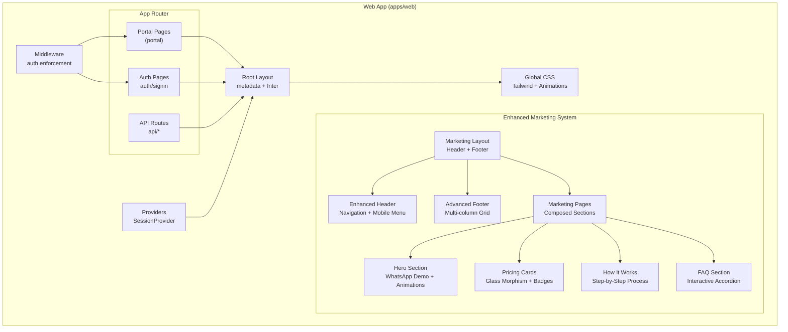
```mermaid
graph TB
subgraph "Web App (apps/web)"
subgraph "Enhanced Marketing System"
MktLayout["Marketing Layout<br/>Header + Footer"]
Header["Enhanced Header<br/>Navigation + Mobile Menu"]
Footer["Advanced Footer<br/>Multi-column Grid"]
Hero["Hero Section<br/>WhatsApp Demo + Animations"]
Pricing["Pricing Cards<br/>Glass Morphism + Badges"]
HowIt["How It Works<br/>Step-by-Step Process"]
FAQ["FAQ Section<br/>Interactive Accordion"]
MktPages["Marketing Pages<br/>Composed Sections"]
end
subgraph "App Router"
Portal["Portal Pages<br/>(portal)"]
Auth["Auth Pages<br/>auth/signin"]
API["API Routes<br/>api/*"]
end
MW["Middleware<br/>auth enforcement"]
Prov["Providers<br/>SessionProvider"]
Layout["Root Layout<br/>metadata + Inter"]
CSS["Global CSS<br/>Tailwind + Animations"]
end
MktLayout --> Header
MktLayout --> Footer
MktLayout --> MktPages
MktPages --> Hero
MktPages --> Pricing
MktPages --> HowIt
MktPages --> FAQ
Portal --> Layout
Auth --> Layout
API --> Layout
MW --> Portal
MW --> Auth
Prov --> Layout
Layout --> CSS
```

**Diagram sources**
- [apps/web/src/app/(marketing)/layout.tsx](file://apps/web/src/app/(marketing)/layout.tsx#L1-L17)
- [apps/web/src/components/layout/Header.tsx](file://apps/web/src/components/layout/Header.tsx#L1-L132)
- [apps/web/src/components/layout/Footer.tsx](file://apps/web/src/components/layout/Footer.tsx#L1-L171)
- [apps/web/src/components/sections/HeroSection.tsx](file://apps/web/src/components/sections/HeroSection.tsx#L1-L468)
- [apps/web/src/components/sections/PricingCards.tsx](file://apps/web/src/components/sections/PricingCards.tsx#L1-L174)
- [apps/web/src/components/sections/HowItWorks.tsx](file://apps/web/src/components/sections/HowItWorks.tsx#L1-L113)
- [apps/web/src/components/sections/FAQSection.tsx](file://apps/web/src/components/sections/FAQSection.tsx#L1-L111)
- [apps/web/src/app/(marketing)/page.tsx](file://apps/web/src/app/(marketing)/page.tsx#L1-L41)

**Section sources**
- [apps/web/src/app/(marketing)/layout.tsx](file://apps/web/src/app/(marketing)/layout.tsx#L1-L17)
- [apps/web/src/components/layout/Header.tsx](file://apps/web/src/components/layout/Header.tsx#L1-L132)
- [apps/web/src/components/layout/Footer.tsx](file://apps/web/src/components/layout/Footer.tsx#L1-L171)
- [apps/web/src/components/sections/HeroSection.tsx](file://apps/web/src/components/sections/HeroSection.tsx#L1-L468)
- [apps/web/src/components/sections/PricingCards.tsx](file://apps/web/src/components/sections/PricingCards.tsx#L1-L174)
- [apps/web/src/components/sections/HowItWorks.tsx](file://apps/web/src/components/sections/HowItWorks.tsx#L1-L113)
- [apps/web/src/components/sections/FAQSection.tsx](file://apps/web/src/components/sections/FAQSection.tsx#L1-L111)
- [apps/web/src/app/(marketing)/page.tsx](file://apps/web/src/app/(marketing)/page.tsx#L1-L41)

## Core Components
- **Enhanced Root Layout and Providers**: Defines Inter font, global CSS, and root HTML wrapper with Providers for session management
- **Advanced Providers**: Wraps the app tree with NextAuth's SessionProvider to enable client-side session access
- **Enhanced Middleware**: Enforces authentication for portal routes, redirects unauthenticated users to sign-in, and enforces onboarding vs status flow based on user setup state
- **Comprehensive Authentication Configuration**: NextAuth options with Prisma adapter, Google provider, and session augmentation with tenant and setup state
- **Enhanced Marketing Layout**: Provides responsive navigation with mobile menu, glass morphism effects, and improved accessibility
- **Advanced Footer System**: Multi-column grid layout with social media integration and brand positioning
- **Modern Portal Layout**: Ensures authenticated access to portal routes and renders the sidebar and main content area
- **Sophisticated UI Design System**: Advanced Tailwind configuration supporting glass morphism, gradient animations, and custom color palettes

**Section sources**
- [apps/web/src/app/layout.tsx](file://apps/web/src/app/layout.tsx#L1-L25)
- [apps/web/src/app/providers.tsx](file://apps/web/src/app/providers.tsx#L1-L8)
- [apps/web/src/middleware.ts](file://apps/web/src/middleware.ts#L1-L44)
- [apps/web/src/lib/auth.ts](file://apps/web/src/lib/auth.ts#L1-L76)
- [apps/web/src/app/(marketing)/layout.tsx](file://apps/web/src/app/(marketing)/layout.tsx#L1-L17)
- [apps/web/src/components/layout/Header.tsx](file://apps/web/src/components/layout/Header.tsx#L1-L132)
- [apps/web/src/components/layout/Footer.tsx](file://apps/web/src/components/layout/Footer.tsx#L1-L171)
- [apps/web/src/app/(portal)/layout.tsx](file://apps/web/src/app/(portal)/layout.tsx#L1-L30)
- [apps/web/tailwind.config.js](file://apps/web/tailwind.config.js#L1-L105)
- [apps/web/postcss.config.js](file://apps/web/postcss.config.js#L1-L7)

## Architecture Overview
The application separates public-facing marketing pages from an authenticated portal with an enhanced layout system. The marketing pages now feature sophisticated component composition using dedicated section components with glass morphism effects, gradient animations, and interactive elements. Middleware protects portal routes and enforces a guided onboarding flow. Authentication integrates with NextAuth and Prisma, enriching sessions with user and tenant data. The portal layout composes a persistent sidebar and main content area with advanced styling. Global CSS leverages Tailwind utilities with custom animations and glass morphism effects for a modern, immersive user experience.

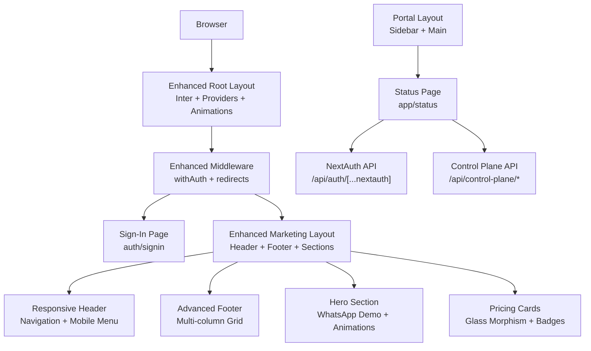
```mermaid
graph TB
Client["Browser"]
RootLayout["Enhanced Root Layout<br/>Inter + Providers + Animations"]
MW["Enhanced Middleware<br/>withAuth + redirects"]
AuthAPI["NextAuth API<br/>/api/auth/[...nextauth]"]
SignIn["Sign-In Page<br/>auth/signin"]
MarketingLayout["Enhanced Marketing Layout<br/>Header + Footer + Sections"]
Header["Responsive Header<br/>Navigation + Mobile Menu"]
Footer["Advanced Footer<br/>Multi-column Grid"]
Hero["Hero Section<br/>WhatsApp Demo + Animations"]
Pricing["Pricing Cards<br/>Glass Morphism + Badges"]
PortalLayout["Portal Layout<br/>Sidebar + Main"]
StatusPage["Status Page<br/>app/status"]
ControlPlane["Control Plane API<br/>/api/control-plane/*"]
Client --> RootLayout
RootLayout --> MW
MW --> SignIn
MW --> MarketingLayout
MarketingLayout --> Header
MarketingLayout --> Footer
MarketingLayout --> Hero
MarketingLayout --> Pricing
PortalLayout --> StatusPage
StatusPage --> AuthAPI
StatusPage --> ControlPlane
```

**Diagram sources**
- [apps/web/src/app/layout.tsx](file://apps/web/src/app/layout.tsx#L1-L25)
- [apps/web/src/middleware.ts](file://apps/web/src/middleware.ts#L1-L44)
- [apps/web/src/app/api/auth/[...nextauth]/route.ts](file://apps/web/src/app/api/auth/[...nextauth]/route.ts#L1-L7)
- [apps/web/src/app/auth/signin/page.tsx](file://apps/web/src/app/auth/signin/page.tsx#L1-L37)
- [apps/web/src/app/(marketing)/layout.tsx](file://apps/web/src/app/(marketing)/layout.tsx#L1-L17)
- [apps/web/src/components/layout/Header.tsx](file://apps/web/src/components/layout/Header.tsx#L1-L132)
- [apps/web/src/components/layout/Footer.tsx](file://apps/web/src/components/layout/Footer.tsx#L1-L171)
- [apps/web/src/components/sections/HeroSection.tsx](file://apps/web/src/components/sections/HeroSection.tsx#L1-L468)
- [apps/web/src/components/sections/PricingCards.tsx](file://apps/web/src/components/sections/PricingCards.tsx#L1-L174)
- [apps/web/src/app/(portal)/layout.tsx](file://apps/web/src/app/(portal)/layout.tsx#L1-L30)
- [apps/web/src/app/(portal)/app/status/page.tsx](file://apps/web/src/app/(portal)/app/status/page.tsx#L1-L160)
- [apps/web/next.config.js](file://apps/web/next.config.js#L1-L17)

## Detailed Component Analysis

### Enhanced Root Layout and Providers
The root layout imports global CSS with advanced animations, sets Inter font, defines metadata, and wraps children with Providers. The enhanced CSS supports glass morphism effects, gradient animations, and custom color variables for a modern dark theme experience.

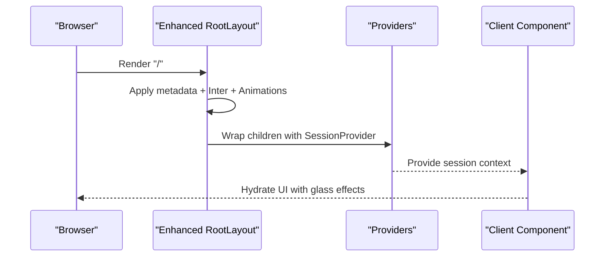
```mermaid
sequenceDiagram
participant Browser as "Browser"
participant Root as "Enhanced RootLayout"
participant Providers as "Providers"
participant ClientComp as "Client Component"
Browser->>Root : Render "/"
Root->>Root : Apply metadata + Inter + Animations
Root->>Providers : Wrap children with SessionProvider
Providers-->>ClientComp : Provide session context
ClientComp-->>Browser : Hydrate UI with glass effects
```

**Diagram sources**
- [apps/web/src/app/layout.tsx](file://apps/web/src/app/layout.tsx#L1-L25)
- [apps/web/src/app/providers.tsx](file://apps/web/src/app/providers.tsx#L1-L8)
- [apps/web/src/app/globals.css](file://apps/web/src/app/globals.css#L1-L348)

**Section sources**
- [apps/web/src/app/layout.tsx](file://apps/web/src/app/layout.tsx#L1-L25)
- [apps/web/src/app/providers.tsx](file://apps/web/src/app/providers.tsx#L1-L8)
- [apps/web/src/app/globals.css](file://apps/web/src/app/globals.css#L1-L348)

### Enhanced Middleware: Authentication and Authorization
The middleware uses next-auth/middleware with custom logic to protect portal routes, redirect authenticated users appropriately, and enforce onboarding flow based on user setup state. The enhanced system now better coordinates with the improved marketing layout.

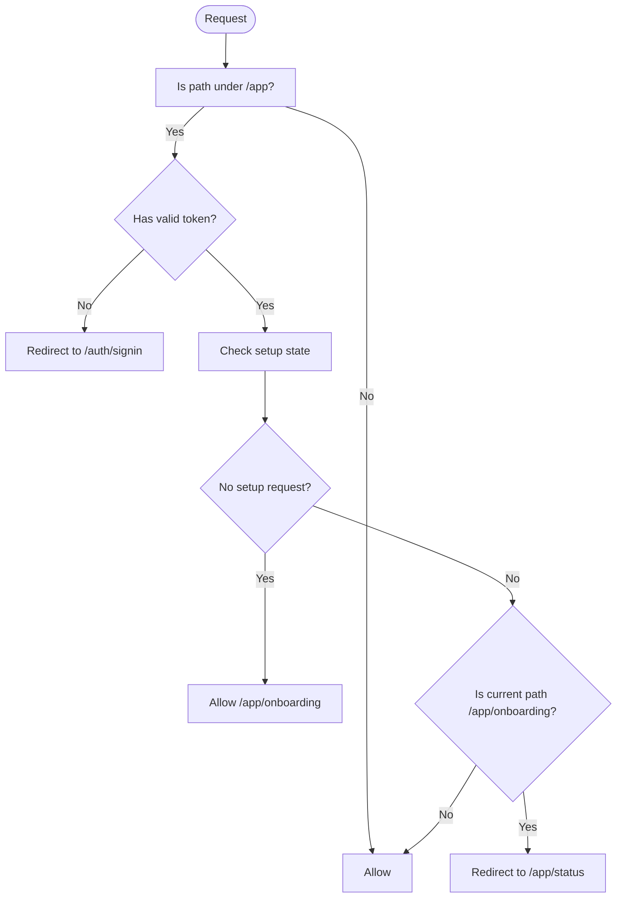
```mermaid
flowchart TD
Start(["Request"]) --> CheckPath["Is path under /app?"]
CheckPath --> |No| Allow["Allow"]
CheckPath --> |Yes| HasToken{"Has valid token?"}
HasToken --> |No| ToSignIn["Redirect to /auth/signin"]
HasToken --> |Yes| SetupCheck["Check setup state"]
SetupCheck --> NoSetupReq{"No setup request?"}
NoSetupReq --> |Yes| OnboardingOnly["Allow /app/onboarding"]
NoSetupReq --> |No| NotOnboarding{"Is current path /app/onboarding?"}
NotOnboarding --> |Yes| ToStatus["Redirect to /app/status"]
NotOnboarding --> |No| Allow
```

**Diagram sources**
- [apps/web/src/middleware.ts](file://apps/web/src/middleware.ts#L1-L44)

**Section sources**
- [apps/web/src/middleware.ts](file://apps/web/src/middleware.ts#L1-L44)

### Enhanced Authentication Configuration and Session Augmentation
The NextAuth configuration defines Google provider and Prisma adapter with comprehensive session augmentation including user ID, tenant ID, role, and computed hasSetupRequest flag. The enhanced system now better supports the improved marketing and portal experiences.

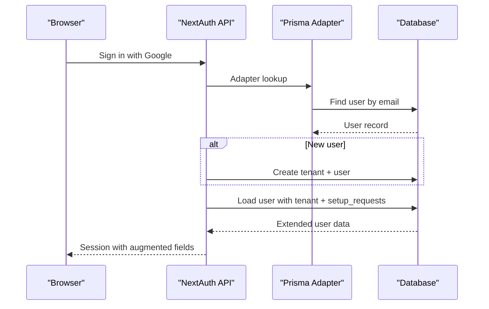
```mermaid
sequenceDiagram
participant Client as "Browser"
participant NextAuthAPI as "NextAuth API"
participant Prisma as "Prisma Adapter"
participant DB as "Database"
Client->>NextAuthAPI : Sign in with Google
NextAuthAPI->>Prisma : Adapter lookup
Prisma->>DB : Find user by email
DB-->>Prisma : User record
alt New user
NextAuthAPI->>DB : Create tenant + user
end
NextAuthAPI->>DB : Load user with tenant + setup_requests
DB-->>NextAuthAPI : Extended user data
NextAuthAPI-->>Client : Session with augmented fields
```

**Diagram sources**
- [apps/web/src/lib/auth.ts](file://apps/web/src/lib/auth.ts#L1-L76)
- [apps/web/src/app/api/auth/[...nextauth]/route.ts](file://apps/web/src/app/api/auth/[...nextauth]/route.ts#L1-L7)

**Section sources**
- [apps/web/src/lib/auth.ts](file://apps/web/src/lib/auth.ts#L1-L76)
- [apps/web/src/app/api/auth/[...nextauth]/route.ts](file://apps/web/src/app/api/auth/[...nextauth]/route.ts#L1-L7)

### Enhanced Marketing Layout and Navigation System
The enhanced marketing layout provides a responsive navbar with sophisticated navigation, mobile menu with Framer Motion animations, and glass morphism effects. The header includes logo with gradient styling, desktop navigation, mobile-responsive design, and animated mobile menu with backdrop blur effects.

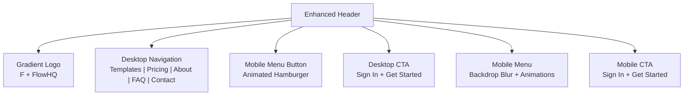
```mermaid
graph TB
Header["Enhanced Header"]
Logo["Gradient Logo<br/>F + FlowHQ"]
DesktopNav["Desktop Navigation<br/>Templates | Pricing | About | FAQ | Contact"]
MobileBtn["Mobile Menu Button<br/>Animated Hamburger"]
MobileMenu["Mobile Menu<br/>Backdrop Blur + Animations"]
DesktopCTA["Desktop CTA<br/>Sign In + Get Started"]
MobileCTA["Mobile CTA<br/>Sign In + Get Started"]
Header --> Logo
Header --> DesktopNav
Header --> MobileBtn
Header --> DesktopCTA
Header --> MobileMenu
Header --> MobileCTA
```

**Diagram sources**
- [apps/web/src/components/layout/Header.tsx](file://apps/web/src/components/layout/Header.tsx#L1-L132)

**Section sources**
- [apps/web/src/app/(marketing)/layout.tsx](file://apps/web/src/app/(marketing)/layout.tsx#L1-L17)
- [apps/web/src/components/layout/Header.tsx](file://apps/web/src/components/layout/Header.tsx#L1-L132)

### Advanced Footer System
The advanced footer implements a multi-column grid layout with brand positioning, product links, company information, legal links, and social media integration. The footer features gradient logos, brand messaging with Tanzanian cultural elements, and responsive design.

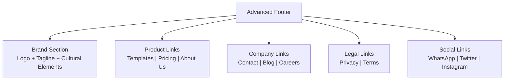
```mermaid
graph TB
Footer["Advanced Footer"]
Brand["Brand Section<br/>Logo + Tagline + Cultural Elements"]
Product["Product Links<br/>Templates | Pricing | About Us"]
Company["Company Links<br/>Contact | Blog | Careers"]
Legal["Legal Links<br/>Privacy | Terms"]
Social["Social Links<br/>WhatsApp | Twitter | Instagram"]
Footer --> Brand
Footer --> Product
Footer --> Company
Footer --> Legal
Footer --> Social
```

**Diagram sources**
- [apps/web/src/components/layout/Footer.tsx](file://apps/web/src/components/layout/Footer.tsx#L1-L171)

**Section sources**
- [apps/web/src/components/layout/Footer.tsx](file://apps/web/src/components/layout/Footer.tsx#L1-L171)

### Enhanced Marketing Page Composition
The marketing pages now use dedicated section components composed in a specific order: HeroSection with WhatsApp demonstration, ProblemSection, SolutionSection, HowItWorks, PricingCards, Testimonials, FAQSection, and CTASection. Each section implements sophisticated animations, glass morphism effects, and interactive elements.

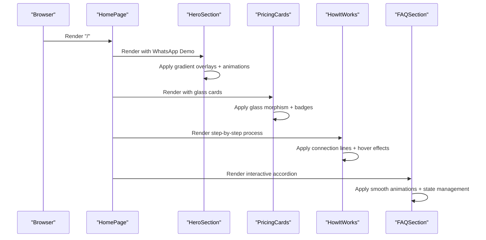
```mermaid
sequenceDiagram
participant Browser as "Browser"
participant HomePage as "HomePage"
participant Hero as "HeroSection"
participant Pricing as "PricingCards"
participant HowIt as "HowItWorks"
participant FAQ as "FAQSection"
Browser->>HomePage : Render "/"
HomePage->>Hero : Render with WhatsApp Demo
Hero->>Hero : Apply gradient overlays + animations
HomePage->>Pricing : Render with glass cards
Pricing->>Pricing : Apply glass morphism + badges
HomePage->>HowIt : Render step-by-step process
HowIt->>HowIt : Apply connection lines + hover effects
HomePage->>FAQ : Render interactive accordion
FAQ->>FAQ : Apply smooth animations + state management
```

**Diagram sources**
- [apps/web/src/app/(marketing)/page.tsx](file://apps/web/src/app/(marketing)/page.tsx#L1-L41)
- [apps/web/src/components/sections/HeroSection.tsx](file://apps/web/src/components/sections/HeroSection.tsx#L1-L468)
- [apps/web/src/components/sections/PricingCards.tsx](file://apps/web/src/components/sections/PricingCards.tsx#L1-L174)
- [apps/web/src/components/sections/HowItWorks.tsx](file://apps/web/src/components/sections/HowItWorks.tsx#L1-L113)
- [apps/web/src/components/sections/FAQSection.tsx](file://apps/web/src/components/sections/FAQSection.tsx#L1-L111)

**Section sources**
- [apps/web/src/app/(marketing)/page.tsx](file://apps/web/src/app/(marketing)/page.tsx#L1-L41)
- [apps/web/src/components/sections/HeroSection.tsx](file://apps/web/src/components/sections/HeroSection.tsx#L1-L468)
- [apps/web/src/components/sections/PricingCards.tsx](file://apps/web/src/components/sections/PricingCards.tsx#L1-L174)
- [apps/web/src/components/sections/HowItWorks.tsx](file://apps/web/src/components/sections/HowItWorks.tsx#L1-L113)
- [apps/web/src/components/sections/FAQSection.tsx](file://apps/web/src/components/sections/FAQSection.tsx#L1-L111)

### Portal Layout and Sidebar
The portal layout enforces server-side authentication via getServerSession and redirects unauthenticated users to sign-in. It renders PortalSidebar and main content area with responsive padding and enhanced styling.

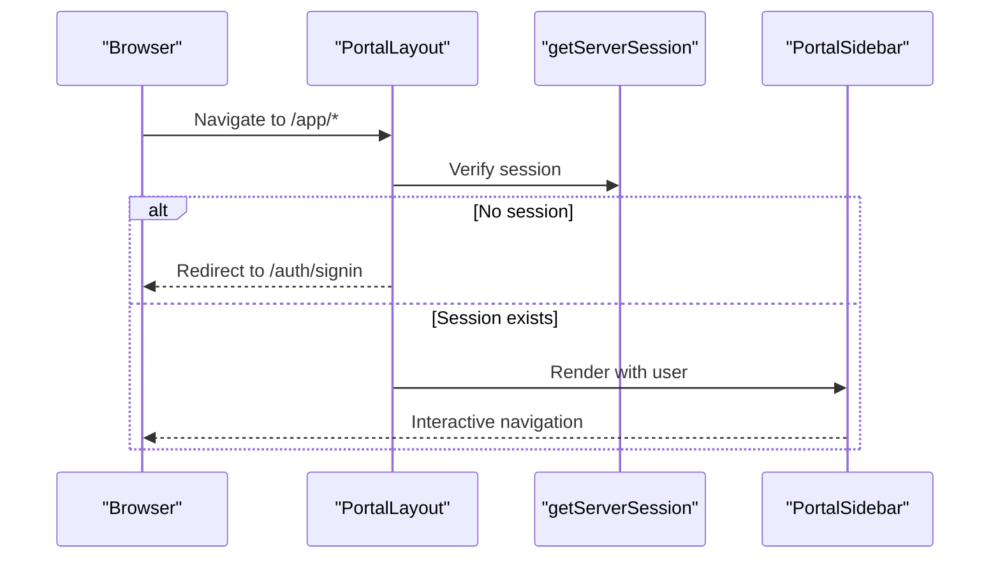
```mermaid
sequenceDiagram
participant Client as "Browser"
participant PortalLayout as "PortalLayout"
participant Session as "getServerSession"
participant Sidebar as "PortalSidebar"
Client->>PortalLayout : Navigate to /app/*
PortalLayout->>Session : Verify session
alt No session
PortalLayout-->>Client : Redirect to /auth/signin
else Session exists
PortalLayout->>Sidebar : Render with user
Sidebar-->>Client : Interactive navigation
end
```

**Diagram sources**
- [apps/web/src/app/(portal)/layout.tsx](file://apps/web/src/app/(portal)/layout.tsx#L1-L30)
- [apps/web/src/components/portal/Sidebar.tsx](file://apps/web/src/components/portal/Sidebar.tsx#L1-L69)

**Section sources**
- [apps/web/src/app/(portal)/layout.tsx](file://apps/web/src/app/(portal)/layout.tsx#L1-L30)
- [apps/web/src/components/portal/Sidebar.tsx](file://apps/web/src/components/portal/Sidebar.tsx#L1-L69)

### Status Page: Client-Side Data Fetching and UX
The status page performs periodic polling to fetch setup and connection status from a portal API route, displaying status cards with color-coded indicators and navigational actions based on state.

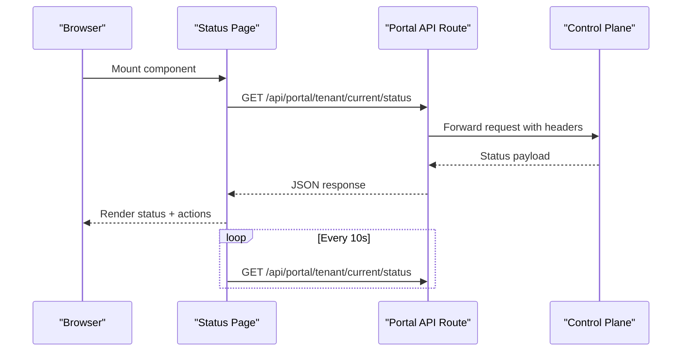
```mermaid
sequenceDiagram
participant Client as "Browser"
participant StatusPage as "Status Page"
participant PortalAPI as "Portal API Route"
participant ControlPlane as "Control Plane"
Client->>StatusPage : Mount component
StatusPage->>PortalAPI : GET /api/portal/tenant/current/status
PortalAPI->>ControlPlane : Forward request with headers
ControlPlane-->>PortalAPI : Status payload
PortalAPI-->>StatusPage : JSON response
StatusPage-->>Client : Render status + actions
loop Every 10s
StatusPage->>PortalAPI : GET /api/portal/tenant/current/status
end
```

**Diagram sources**
- [apps/web/src/app/(portal)/app/status/page.tsx](file://apps/web/src/app/(portal)/app/status/page.tsx#L1-L160)
- [apps/web/src/app/api/portal/tenant/current/status/route.ts](file://apps/web/src/app/api/portal/tenant/current/status/route.ts#L1-L35)

**Section sources**
- [apps/web/src/app/(portal)/app/status/page.tsx](file://apps/web/src/app/(portal)/app/status/page.tsx#L1-L160)
- [apps/web/src/app/api/portal/tenant/current/status/route.ts](file://apps/web/src/app/api/portal/tenant/current/status/route.ts#L1-L35)

### Sign-In Page: Provider-Based Authentication
The sign-in page displays available providers and triggers sign-in flow, redirecting authenticated users to onboarding with enhanced button styling.

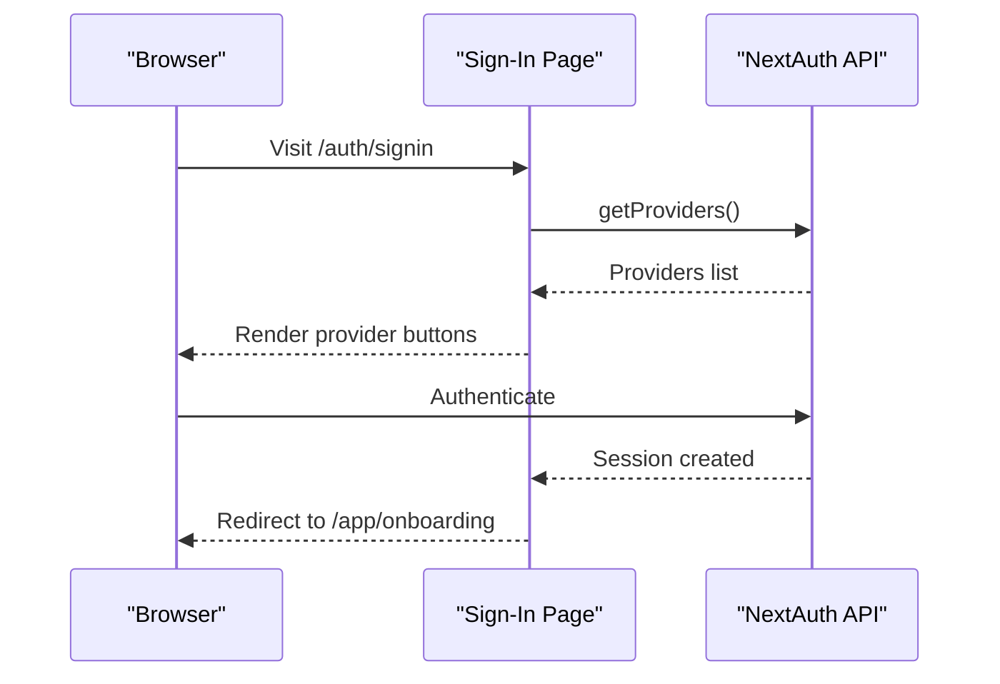
```mermaid
sequenceDiagram
participant Client as "Browser"
participant SignIn as "Sign-In Page"
participant NextAuth as "NextAuth API"
Client->>SignIn : Visit /auth/signin
SignIn->>NextAuth : getProviders()
NextAuth-->>SignIn : Providers list
SignIn-->>Client : Render provider buttons
Client->>NextAuth : Authenticate
NextAuth-->>SignIn : Session created
SignIn-->>Client : Redirect to /app/onboarding
```

**Diagram sources**
- [apps/web/src/app/auth/signin/page.tsx](file://apps/web/src/app/auth/signin/page.tsx#L1-L37)
- [apps/web/src/app/api/auth/[...nextauth]/route.ts](file://apps/web/src/app/api/auth/[...nextauth]/route.ts#L1-L7)

**Section sources**
- [apps/web/src/app/auth/signin/page.tsx](file://apps/web/src/app/auth/signin/page.tsx#L1-L37)
- [apps/web/src/app/api/auth/[...nextauth]/route.ts](file://apps/web/src/app/api/auth/[...nextauth]/route.ts#L1-L7)

### Enhanced Internationalization and Global CSS
The enhanced system applies Inter font globally via root layout with improved typography. The global CSS uses Tailwind directives with advanced animations, glass morphism effects, custom color variables, and sophisticated gradient backgrounds. The Tailwind configuration now supports extensive animation libraries, custom keyframes, and advanced backdrop effects.

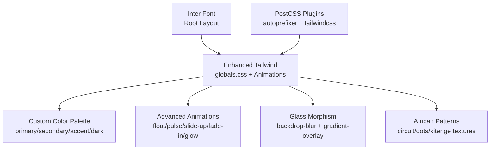
```mermaid
graph TB
Inter["Inter Font<br/>Root Layout"]
Tailwind["Enhanced Tailwind<br/>globals.css + Animations"]
Theme["Custom Color Palette<br/>primary/secondary/accent/dark"]
Animations["Advanced Animations<br/>float/pulse/slide-up/fade-in/glow"]
Glass["Glass Morphism<br/>backdrop-blur + gradient-overlay"]
Patterns["African Patterns<br/>circuit/dots/kitenge textures"]
PostCSS["PostCSS Plugins<br/>autoprefixer + tailwindcss"]
Inter --> Tailwind
Tailwind --> Theme
Tailwind --> Animations
Tailwind --> Glass
Tailwind --> Patterns
PostCSS --> Tailwind
```

**Diagram sources**
- [apps/web/src/app/layout.tsx](file://apps/web/src/app/layout.tsx#L1-L25)
- [apps/web/src/app/globals.css](file://apps/web/src/app/globals.css#L1-L348)
- [apps/web/tailwind.config.js](file://apps/web/tailwind.config.js#L1-L105)
- [apps/web/postcss.config.js](file://apps/web/postcss.config.js#L1-L7)

**Section sources**
- [apps/web/src/app/layout.tsx](file://apps/web/src/app/layout.tsx#L1-L25)
- [apps/web/src/app/globals.css](file://apps/web/src/app/globals.css#L1-L348)
- [apps/web/tailwind.config.js](file://apps/web/tailwind.config.js#L1-L105)
- [apps/web/postcss.config.js](file://apps/web/postcss.config.js#L1-L7)

### Routing Patterns and Grouping
The routing system maintains marketing pages under (marketing) group and portal pages under (portal) group, with enhanced nested portal routes including onboarding, status, logs, and WhatsApp. API routes under api/ handle NextAuth and portal-specific endpoints with improved organization.

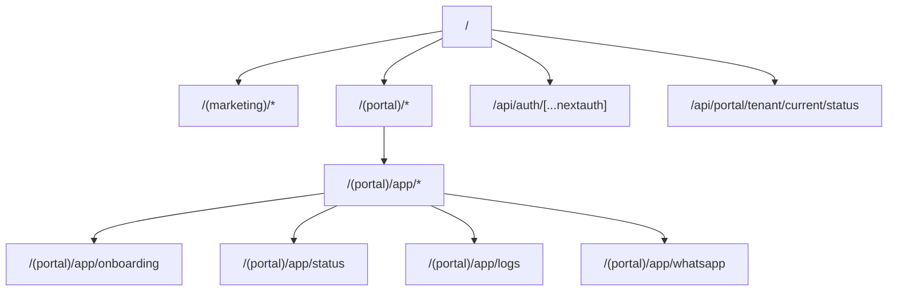
```mermaid
graph TB
Root["/"]
Mkt["/(marketing)/*"]
Portal["/(portal)/*"]
App["/(portal)/app/*"]
Onboarding["/(portal)/app/onboarding"]
Status["/(portal)/app/status"]
Logs["/(portal)/app/logs"]
WhatsApp["/(portal)/app/whatsapp"]
AuthAPI["/api/auth/[...nextauth]"]
PortalAPI["/api/portal/tenant/current/status"]
Root --> Mkt
Root --> Portal
Portal --> App
App --> Onboarding
App --> Status
App --> Logs
App --> WhatsApp
Root --> AuthAPI
Root --> PortalAPI
```

**Diagram sources**
- [apps/web/src/app/(marketing)/layout.tsx](file://apps/web/src/app/(marketing)/layout.tsx#L1-L17)
- [apps/web/src/app/(portal)/layout.tsx](file://apps/web/src/app/(portal)/layout.tsx#L1-L30)
- [apps/web/src/app/(portal)/app/status/page.tsx](file://apps/web/src/app/(portal)/app/status/page.tsx#L1-L160)
- [apps/web/src/app/api/auth/[...nextauth]/route.ts](file://apps/web/src/app/api/auth/[...nextauth]/route.ts#L1-L7)
- [apps/web/src/app/api/portal/tenant/current/status/route.ts](file://apps/web/src/app/api/portal/tenant/current/status/route.ts#L1-L35)

**Section sources**
- [apps/web/src/app/(marketing)/layout.tsx](file://apps/web/src/app/(marketing)/layout.tsx#L1-L17)
- [apps/web/src/app/(portal)/layout.tsx](file://apps/web/src/app/(portal)/layout.tsx#L1-L30)
- [apps/web/src/app/(portal)/app/status/page.tsx](file://apps/web/src/app/(portal)/app/status/page.tsx#L1-L160)
- [apps/web/src/app/api/auth/[...nextauth]/route.ts](file://apps/web/src/app/api/auth/[...nextauth]/route.ts#L1-L7)
- [apps/web/src/app/api/portal/tenant/current/status/route.ts](file://apps/web/src/app/api/portal/tenant/current/status/route.ts#L1-L35)

## Enhanced Marketing Layout System

### New Navigation Components
The enhanced marketing system introduces sophisticated navigation components with mobile-first design principles. The Header component features:
- Responsive gradient logo with animated hover effects
- Desktop navigation with hover transitions and active states
- Mobile menu with Framer Motion animations and backdrop blur
- Animated hamburger menu with smooth state transitions
- Glass morphism effects with backdrop blur and transparency
- Enhanced accessibility with proper ARIA labels and keyboard navigation

### Advanced Footer Implementation
The Footer component implements a comprehensive multi-column grid system:
- Brand section with gradient logo and cultural messaging
- Product links organized in accessible navigation lists
- Company information with professional branding
- Legal compliance links with proper categorization
- Social media integration with custom SVG icons
- Responsive design adapting to different screen sizes
- Enhanced visual hierarchy with proper spacing and typography

### Sophisticated Component Composition
The marketing pages now use dedicated section components composed in a strategic order:
- HeroSection with WhatsApp demonstration interface
- ProblemSection addressing customer pain points
- SolutionSection presenting tailored solutions
- HowItWorks with step-by-step process visualization
- PricingCards with glass morphism and interactive elements
- Testimonials with social proof and credibility
- FAQSection with interactive accordion functionality
- CTASection driving conversion and engagement

**Section sources**
- [apps/web/src/components/layout/Header.tsx](file://apps/web/src/components/layout/Header.tsx#L1-L132)
- [apps/web/src/components/layout/Footer.tsx](file://apps/web/src/components/layout/Footer.tsx#L1-L171)
- [apps/web/src/app/(marketing)/page.tsx](file://apps/web/src/app/(marketing)/page.tsx#L1-L41)

## UI Design System and Component Composition

### Advanced Button Component
The enhanced Button component supports multiple variants and sizes with sophisticated styling:
- Primary gradient buttons with hover animations and elevation effects
- Secondary variant with purple gradient styling
- Outline variant with transparent backgrounds and border effects
- Ghost variant for subtle interactive elements
- Responsive sizing with smooth transitions
- Loading states with spinner animations
- Accessibility support with proper focus states

### Glass Morphism and Gradient Effects
The design system implements advanced visual effects:
- Glass card components with backdrop blur and gradient overlays
- Multi-layered gradient backgrounds with custom color schemes
- Floating animations with physics-based motion
- Pulse effects with synchronized timing
- Custom keyframe animations for complex interactions
- Responsive design adapting to different screen densities

### Animation System
The enhanced animation system includes:
- Framer Motion integration for smooth transitions
- Custom keyframes for floating, pulsing, and sliding effects
- Staggered animations for content reveal sequences
- Interactive hover states with micro-interactions
- Performance-optimized animations using transform properties
- Smooth scrolling and anchor-based navigation

### Component Composition Patterns
The marketing system follows established composition patterns:
- Section-based architecture with dedicated components
- Reusable UI primitives with consistent styling
- Responsive design with mobile-first approach
- Accessibility-first development practices
- Performance optimization through lazy loading
- State management with React hooks and context

**Section sources**
- [apps/web/src/components/ui/Button.tsx](file://apps/web/src/components/ui/Button.tsx#L1-L57)
- [apps/web/src/components/sections/HeroSection.tsx](file://apps/web/src/components/sections/HeroSection.tsx#L1-L468)
- [apps/web/src/components/sections/PricingCards.tsx](file://apps/web/src/components/sections/PricingCards.tsx#L1-L174)
- [apps/web/src/components/sections/HowItWorks.tsx](file://apps/web/src/components/sections/HowItWorks.tsx#L1-L113)
- [apps/web/src/components/sections/FAQSection.tsx](file://apps/web/src/components/sections/FAQSection.tsx#L1-L111)
- [apps/web/tailwind.config.js](file://apps/web/tailwind.config.js#L1-L105)
- [apps/web/src/app/globals.css](file://apps/web/src/app/globals.css#L1-L348)

## Dependency Analysis
The enhanced system maintains dependencies while adding sophisticated UI capabilities:
- Root layout depends on providers, Inter font, and advanced CSS animations
- Enhanced middleware depends on NextAuth middleware and portal access control
- Marketing layout depends on Header, Footer, and section components
- Section components depend on UI primitives, animations, and state management
- UI components depend on Tailwind utilities, custom animations, and responsive design
- Global CSS depends on Tailwind configuration, PostCSS plugins, and animation libraries

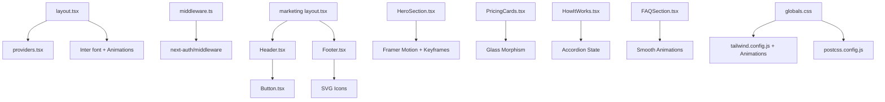
```mermaid
graph TB
Root["layout.tsx"] --> Providers["providers.tsx"]
Root --> Inter["Inter font + Animations"]
MW["middleware.ts"] --> NextAuthMW["next-auth/middleware"]
MarketingLayout["marketing layout.tsx"] --> Header["Header.tsx"]
MarketingLayout --> Footer["Footer.tsx"]
Header --> Button["Button.tsx"]
Footer --> SocialIcons["SVG Icons"]
Hero["HeroSection.tsx"] --> Animations["Framer Motion + Keyframes"]
Pricing["PricingCards.tsx"] --> GlassEffects["Glass Morphism"]
HowIt["HowItWorks.tsx"] --> Interactive["Accordion State"]
FAQ["FAQSection.tsx"] --> Accordion["Smooth Animations"]
CSS["globals.css"] --> Tailwind["tailwind.config.js + Animations"]
CSS --> PostCSS["postcss.config.js"]
```

**Diagram sources**
- [apps/web/src/app/layout.tsx](file://apps/web/src/app/layout.tsx#L1-L25)
- [apps/web/src/app/providers.tsx](file://apps/web/src/app/providers.tsx#L1-L8)
- [apps/web/src/middleware.ts](file://apps/web/src/middleware.ts#L1-L44)
- [apps/web/src/app/(marketing)/layout.tsx](file://apps/web/src/app/(marketing)/layout.tsx#L1-L17)
- [apps/web/src/components/layout/Header.tsx](file://apps/web/src/components/layout/Header.tsx#L1-L132)
- [apps/web/src/components/layout/Footer.tsx](file://apps/web/src/components/layout/Footer.tsx#L1-L171)
- [apps/web/src/components/ui/Button.tsx](file://apps/web/src/components/ui/Button.tsx#L1-L57)
- [apps/web/src/components/sections/HeroSection.tsx](file://apps/web/src/components/sections/HeroSection.tsx#L1-L468)
- [apps/web/src/components/sections/PricingCards.tsx](file://apps/web/src/components/sections/PricingCards.tsx#L1-L174)
- [apps/web/src/components/sections/HowItWorks.tsx](file://apps/web/src/components/sections/HowItWorks.tsx#L1-L113)
- [apps/web/src/components/sections/FAQSection.tsx](file://apps/web/src/components/sections/FAQSection.tsx#L1-L111)
- [apps/web/src/app/globals.css](file://apps/web/src/app/globals.css#L1-L348)
- [apps/web/tailwind.config.js](file://apps/web/tailwind.config.js#L1-L105)
- [apps/web/postcss.config.js](file://apps/web/postcss.config.js#L1-L7)

**Section sources**
- [apps/web/src/app/layout.tsx](file://apps/web/src/app/layout.tsx#L1-L25)
- [apps/web/src/app/providers.tsx](file://apps/web/src/app/providers.tsx#L1-L8)
- [apps/web/src/middleware.ts](file://apps/web/src/middleware.ts#L1-L44)
- [apps/web/src/app/(marketing)/layout.tsx](file://apps/web/src/app/(marketing)/layout.tsx#L1-L17)
- [apps/web/src/components/layout/Header.tsx](file://apps/web/src/components/layout/Header.tsx#L1-L132)
- [apps/web/src/components/layout/Footer.tsx](file://apps/web/src/components/layout/Footer.tsx#L1-L171)
- [apps/web/src/components/ui/Button.tsx](file://apps/web/src/components/ui/Button.tsx#L1-L57)
- [apps/web/src/components/sections/HeroSection.tsx](file://apps/web/src/components/sections/HeroSection.tsx#L1-L468)
- [apps/web/src/components/sections/PricingCards.tsx](file://apps/web/src/components/sections/PricingCards.tsx#L1-L174)
- [apps/web/src/components/sections/HowItWorks.tsx](file://apps/web/src/components/sections/HowItWorks.tsx#L1-L113)
- [apps/web/src/components/sections/FAQSection.tsx](file://apps/web/src/components/sections/FAQSection.tsx#L1-L111)
- [apps/web/src/app/globals.css](file://apps/web/src/app/globals.css#L1-L348)
- [apps/web/tailwind.config.js](file://apps/web/tailwind.config.js#L1-L105)
- [apps/web/postcss.config.js](file://apps/web/postcss.config.js#L1-L7)

## Performance Considerations
The enhanced system maintains performance while adding sophisticated UI effects:
- Prefer server-side rendering for portal layouts to avoid hydration mismatches
- Use middleware to block unauthorized access early and minimize unnecessary client-side requests
- Optimize API calls with appropriate caching headers and consider background refresh strategies
- Leverage Tailwind's utility-first approach for efficient CSS generation
- Implement lazy loading for heavy animations and interactive components
- Use CSS transforms instead of layout-affecting properties for smooth animations
- Minimize bundle size by importing only necessary animation libraries
- Enable Next.js App Router features and consider static generation for marketing pages

## Troubleshooting Guide
Enhanced troubleshooting guidance for the improved system:
- Authentication loops: Verify middleware matcher and protected routes, ensure NextAuth callbacks properly augment session data
- Unauthorized API responses: Confirm portal API route headers include x-portal-key and x-user-email, verify CONTROL_PLANE_URL accessibility
- Missing session in client components: Ensure Providers wrap the app and client components using session are marked as client
- Animation performance issues: Check Framer Motion configuration, verify hardware acceleration, monitor animation frame rates
- Glass morphism rendering problems: Verify backdrop blur compatibility, check browser support for experimental features
- Mobile menu responsiveness: Test touch interactions, verify event handling, check CSS media queries
- Styling inconsistencies: Validate Tailwind content globs, check PostCSS plugin configuration, verify custom animation keyframes
- Component composition errors: Ensure proper prop passing, verify component dependencies, check for circular imports

**Section sources**
- [apps/web/src/middleware.ts](file://apps/web/src/middleware.ts#L1-L44)
- [apps/web/src/app/api/portal/tenant/current/status/route.ts](file://apps/web/src/app/api/portal/tenant/current/status/route.ts#L1-L35)
- [apps/web/src/app/providers.tsx](file://apps/web/src/app/providers.tsx#L1-L8)
- [apps/web/tailwind.config.js](file://apps/web/tailwind.config.js#L1-L105)
- [apps/web/postcss.config.js](file://apps/web/postcss.config.js#L1-L7)

## Conclusion
The enhanced application architecture demonstrates a sophisticated marketing layout system with advanced navigation components, comprehensive UI design patterns, and improved component composition. The marketing pages now feature glass morphism effects, gradient animations, interactive elements, and responsive design principles. The system maintains clean separation between marketing and portal interfaces while providing an immersive user experience. The enhanced middleware, authentication system, and global styling support scalable SSR/SSG optimization and deliver a modern, accessible web application experience.

## Appendices
- Rewrites configuration enables seamless integration with the control plane backend for portal endpoints
- Package dependencies include Next.js, NextAuth, Tailwind CSS with advanced animation support, and Framer Motion for smooth interactions
- The enhanced UI system supports progressive enhancement with graceful degradation for older browsers
- Custom animation libraries provide sophisticated motion design while maintaining performance standards

**Section sources**
- [apps/web/next.config.js](file://apps/web/next.config.js#L1-L17)
- [apps/web/package.json](file://apps/web/package.json#L1-L27)