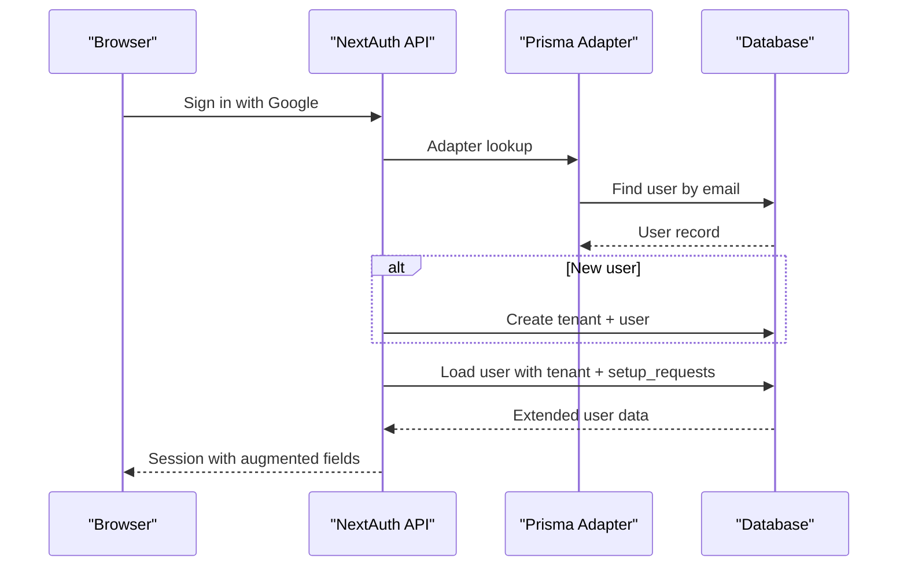

# Application Architecture

<cite>
**Referenced Files in This Document**
- [apps/web/src/app/layout.tsx](file://apps/web/src/app/layout.tsx)
- [apps/web/src/app/providers.tsx](file://apps/web/src/app/providers.tsx)
- [apps/web/src/middleware.ts](file://apps/web/src/middleware.ts)
- [apps/web/src/lib/auth.ts](file://apps/web/src/lib/auth.ts)
- [apps/web/src/app/(marketing)/layout.tsx](file://apps/web/src/app/(marketing)/layout.tsx)
- [apps/web/src/app/(portal)/layout.tsx](file://apps/web/src/app/(portal)/layout.tsx)
- [apps/web/src/app/globals.css](file://apps/web/src/app/globals.css)
- [apps/web/src/app/(marketing)/page.tsx](file://apps/web/src/app/(marketing)/page.tsx)
- [apps/web/src/app/(portal)/app/status/page.tsx](file://apps/web/src/app/(portal)/app/status/page.tsx)
- [apps/web/src/app/auth/signin/page.tsx](file://apps/web/src/app/auth/signin/page.tsx)
- [apps/web/src/components/portal/Sidebar.tsx](file://apps/web/src/components/portal/Sidebar.tsx)
- [apps/web/next.config.js](file://apps/web/next.config.js)
- [apps/web/src/app/api/auth/[...nextauth]/route.ts](file://apps/web/src/app/api/auth/[...nextauth]/route.ts)
- [apps/web/src/app/api/portal/tenant/current/status/route.ts](file://apps/web/src/app/api/portal/tenant/current/status/route.ts)
- [apps/web/tailwind.config.js](file://apps/web/tailwind.config.js)
- [apps/web/postcss.config.js](file://apps/web/postcss.config.js)
- [apps/web/package.json](file://apps/web/package.json)
</cite>

## Table of Contents
1. [Introduction](#introduction)
2. [Project Structure](#project-structure)
3. [Core Components](#core-components)
4. [Architecture Overview](#architecture-overview)
5. [Detailed Component Analysis](#detailed-component-analysis)
6. [Dependency Analysis](#dependency-analysis)
7. [Performance Considerations](#performance-considerations)
8. [Troubleshooting Guide](#troubleshooting-guide)
9. [Conclusion](#conclusion)
10. [Appendices](#appendices)

## Introduction
This document explains the Next.js application architecture for the web frontend. It covers the overall structure separating marketing pages from the authenticated portal interface, routing patterns using the Next.js App Router, layout system with metadata configuration, and provider setup for session state management. It also documents the middleware implementation for authentication and authorization flows, internationalization setup with Inter font, and global CSS configuration via Tailwind. Practical examples demonstrate component composition, layout inheritance, and SSR/SSG optimization strategies. Finally, it outlines the user experience flow from marketing landing pages to authenticated tenant dashboards.

## Project Structure
The web application is organized under apps/web with the Next.js App Router. Key areas:
- Marketing pages under (marketing) group, including homepage and static pages.
- Portal interface under (portal) group, including nested routes for onboarding, status, logs, and WhatsApp setup.
- Shared authentication configuration and API routes for NextAuth.
- Middleware enforcing authentication and redirect logic for setup flow.
- Global providers, layout hierarchy, and Tailwind-based styling.

**Diagram sources**
- [apps/web/src/app/layout.tsx](file://apps/web/src/app/layout.tsx#L1-L25)
- [apps/web/src/app/providers.tsx](file://apps/web/src/app/providers.tsx#L1-L8)
- [apps/web/src/middleware.ts](file://apps/web/src/middleware.ts#L1-L44)
- [apps/web/src/app/(marketing)/layout.tsx](file://apps/web/src/app/(marketing)/layout.tsx#L1-L42)
- [apps/web/src/app/(portal)/layout.tsx](file://apps/web/src/app/(portal)/layout.tsx#L1-L30)
- [apps/web/src/app/globals.css](file://apps/web/src/app/globals.css#L1-L20)

**Section sources**
- [apps/web/src/app/layout.tsx](file://apps/web/src/app/layout.tsx#L1-L25)
- [apps/web/src/app/providers.tsx](file://apps/web/src/app/providers.tsx#L1-L8)
- [apps/web/src/middleware.ts](file://apps/web/src/middleware.ts#L1-L44)
- [apps/web/src/app/(marketing)/layout.tsx](file://apps/web/src/app/(marketing)/layout.tsx#L1-L42)
- [apps/web/src/app/(portal)/layout.tsx](file://apps/web/src/app/(portal)/layout.tsx#L1-L30)
- [apps/web/src/app/globals.css](file://apps/web/src/app/globals.css#L1-L20)

## Core Components
- Root layout and metadata: Defines Inter font, global CSS, and root HTML wrapper with Providers.
- Providers: Wraps the app tree with NextAuth’s SessionProvider to enable client-side session access.
- Middleware: Enforces authentication for portal routes, redirects unauthenticated users to sign-in, and enforces onboarding vs status flow based on user setup state.
- Authentication configuration: NextAuth options with Prisma adapter, Google provider, and session augmentation with tenant and setup state.
- Marketing layout: Provides a shared marketing navigation and container for marketing pages.
- Portal layout: Ensures authenticated access to portal routes and renders the sidebar and main content area.
- Tailwind and PostCSS: Global styles and theme customization for consistent UI.

**Section sources**
- [apps/web/src/app/layout.tsx](file://apps/web/src/app/layout.tsx#L1-L25)
- [apps/web/src/app/providers.tsx](file://apps/web/src/app/providers.tsx#L1-L8)
- [apps/web/src/middleware.ts](file://apps/web/src/middleware.ts#L1-L44)
- [apps/web/src/lib/auth.ts](file://apps/web/src/lib/auth.ts#L1-L76)
- [apps/web/src/app/(marketing)/layout.tsx](file://apps/web/src/app/(marketing)/layout.tsx#L1-L42)
- [apps/web/src/app/(portal)/layout.tsx](file://apps/web/src/app/(portal)/layout.tsx#L1-L30)
- [apps/web/tailwind.config.js](file://apps/web/tailwind.config.js#L1-L23)
- [apps/web/postcss.config.js](file://apps/web/postcss.config.js#L1-L7)

## Architecture Overview
The application separates public-facing marketing pages from an authenticated portal. Middleware protects portal routes and enforces a guided onboarding flow. Authentication integrates with NextAuth and Prisma, enriching sessions with user and tenant data. The portal layout composes a persistent sidebar and main content area. Global CSS leverages Tailwind utilities and a custom primary palette.

**Diagram sources**
- [apps/web/src/app/layout.tsx](file://apps/web/src/app/layout.tsx#L1-L25)
- [apps/web/src/middleware.ts](file://apps/web/src/middleware.ts#L1-L44)
- [apps/web/src/app/api/auth/[...nextauth]/route.ts](file://apps/web/src/app/api/auth/[...nextauth]/route.ts#L1-L7)
- [apps/web/src/app/auth/signin/page.tsx](file://apps/web/src/app/auth/signin/page.tsx#L1-L37)
- [apps/web/src/app/(portal)/layout.tsx](file://apps/web/src/app/(portal)/layout.tsx#L1-L30)
- [apps/web/src/app/(portal)/app/status/page.tsx](file://apps/web/src/app/(portal)/app/status/page.tsx#L1-L160)
- [apps/web/next.config.js](file://apps/web/next.config.js#L1-L17)

## Detailed Component Analysis

### Root Layout and Providers
- Root layout imports global CSS, sets Inter font, defines metadata, and wraps children with Providers.
- Providers inject NextAuth’s SessionProvider so client components can access session data.

**Diagram sources**
- [apps/web/src/app/layout.tsx](file://apps/web/src/app/layout.tsx#L1-L25)
- [apps/web/src/app/providers.tsx](file://apps/web/src/app/providers.tsx#L1-L8)

**Section sources**
- [apps/web/src/app/layout.tsx](file://apps/web/src/app/layout.tsx#L1-L25)
- [apps/web/src/app/providers.tsx](file://apps/web/src/app/providers.tsx#L1-L8)

### Middleware: Authentication and Authorization
- Uses next-auth/middleware with custom logic:
  - Blocks access to /app routes without a valid token.
  - Redirects authenticated users to onboarding if no setup request exists.
  - Redirects users with an existing setup request away from onboarding to status.
- Matcher restricts middleware to /app routes.

**Diagram sources**
- [apps/web/src/middleware.ts](file://apps/web/src/middleware.ts#L1-L44)

**Section sources**
- [apps/web/src/middleware.ts](file://apps/web/src/middleware.ts#L1-L44)

### Authentication Configuration and Session Augmentation
- NextAuth options define Google provider and Prisma adapter.
- signIn callback creates a tenant and user if missing.
- session callback augments session with user ID, tenant ID, role, and a computed hasSetupRequest flag.
- NextAuth API route exposes NextAuth handlers.

**Diagram sources**
- [apps/web/src/lib/auth.ts](file://apps/web/src/lib/auth.ts#L1-L76)
- [apps/web/src/app/api/auth/[...nextauth]/route.ts](file://apps/web/src/app/api/auth/[...nextauth]/route.ts#L1-L7)

**Section sources**
- [apps/web/src/lib/auth.ts](file://apps/web/src/lib/auth.ts#L1-L76)
- [apps/web/src/app/api/auth/[...nextauth]/route.ts](file://apps/web/src/app/api/auth/[...nextauth]/route.ts#L1-L7)

### Marketing Layout and Navigation
- MarketingLayout provides a responsive navbar with links to templates, pricing, contact, and a CTA to onboarding.
- Marketing pages inherit this layout and render content inside.

**Diagram sources**
- [apps/web/src/app/(marketing)/layout.tsx](file://apps/web/src/app/(marketing)/layout.tsx#L1-L42)

**Section sources**
- [apps/web/src/app/(marketing)/layout.tsx](file://apps/web/src/app/(marketing)/layout.tsx#L1-L42)
- [apps/web/src/app/(marketing)/page.tsx](file://apps/web/src/app/(marketing)/page.tsx#L1-L104)

### Portal Layout and Sidebar
- PortalLayout enforces server-side authentication via getServerSession and redirects unauthenticated users to sign-in.
- Renders PortalSidebar and main content area with responsive padding.
- Sidebar provides navigation to onboarding, status, WhatsApp, and logs, with active-state highlighting and sign-out.

**Diagram sources**
- [apps/web/src/app/(portal)/layout.tsx](file://apps/web/src/app/(portal)/layout.tsx#L1-L30)
- [apps/web/src/components/portal/Sidebar.tsx](file://apps/web/src/components/portal/Sidebar.tsx#L1-L69)

**Section sources**
- [apps/web/src/app/(portal)/layout.tsx](file://apps/web/src/app/(portal)/layout.tsx#L1-L30)
- [apps/web/src/components/portal/Sidebar.tsx](file://apps/web/src/components/portal/Sidebar.tsx#L1-L69)

### Status Page: Client-Side Data Fetching and UX
- Status page performs periodic polling to fetch setup and connection status from a portal API route.
- Displays status cards with color-coded indicators and navigational actions based on state.

**Diagram sources**
- [apps/web/src/app/(portal)/app/status/page.tsx](file://apps/web/src/app/(portal)/app/status/page.tsx#L1-L160)
- [apps/web/src/app/api/portal/tenant/current/status/route.ts](file://apps/web/src/app/api/portal/tenant/current/status/route.ts#L1-L35)

**Section sources**
- [apps/web/src/app/(portal)/app/status/page.tsx](file://apps/web/src/app/(portal)/app/status/page.tsx#L1-L160)
- [apps/web/src/app/api/portal/tenant/current/status/route.ts](file://apps/web/src/app/api/portal/tenant/current/status/route.ts#L1-L35)

### Sign-In Page: Provider-Based Authentication
- Displays available providers and triggers sign-in flow.
- Redirects authenticated users to onboarding.

**Diagram sources**
- [apps/web/src/app/auth/signin/page.tsx](file://apps/web/src/app/auth/signin/page.tsx#L1-L37)
- [apps/web/src/app/api/auth/[...nextauth]/route.ts](file://apps/web/src/app/api/auth/[...nextauth]/route.ts#L1-L7)

**Section sources**
- [apps/web/src/app/auth/signin/page.tsx](file://apps/web/src/app/auth/signin/page.tsx#L1-L37)
- [apps/web/src/app/api/auth/[...nextauth]/route.ts](file://apps/web/src/app/api/auth/[...nextauth]/route.ts#L1-L7)

### Internationalization and Global CSS
- Inter font is applied globally via the root layout.
- Global CSS uses Tailwind directives and custom CSS variables for background and foreground.
- Tailwind is configured with a custom primary color palette.

**Diagram sources**
- [apps/web/src/app/layout.tsx](file://apps/web/src/app/layout.tsx#L1-L25)
- [apps/web/src/app/globals.css](file://apps/web/src/app/globals.css#L1-L20)
- [apps/web/tailwind.config.js](file://apps/web/tailwind.config.js#L1-L23)
- [apps/web/postcss.config.js](file://apps/web/postcss.config.js#L1-L7)

**Section sources**
- [apps/web/src/app/layout.tsx](file://apps/web/src/app/layout.tsx#L1-L25)
- [apps/web/src/app/globals.css](file://apps/web/src/app/globals.css#L1-L20)
- [apps/web/tailwind.config.js](file://apps/web/tailwind.config.js#L1-L23)
- [apps/web/postcss.config.js](file://apps/web/postcss.config.js#L1-L7)

### Routing Patterns and Grouping
- Marketing pages live under (marketing) group; portal pages under (portal) group.
- Nested portal routes include onboarding, status, logs, and WhatsApp.
- API routes under api/ handle NextAuth and portal-specific endpoints.

**Diagram sources**
- [apps/web/src/app/(marketing)/layout.tsx](file://apps/web/src/app/(marketing)/layout.tsx#L1-L42)
- [apps/web/src/app/(portal)/layout.tsx](file://apps/web/src/app/(portal)/layout.tsx#L1-L30)
- [apps/web/src/app/(portal)/app/status/page.tsx](file://apps/web/src/app/(portal)/app/status/page.tsx#L1-L160)
- [apps/web/src/app/api/auth/[...nextauth]/route.ts](file://apps/web/src/app/api/auth/[...nextauth]/route.ts#L1-L7)
- [apps/web/src/app/api/portal/tenant/current/status/route.ts](file://apps/web/src/app/api/portal/tenant/current/status/route.ts#L1-L35)

**Section sources**
- [apps/web/src/app/(marketing)/layout.tsx](file://apps/web/src/app/(marketing)/layout.tsx#L1-L42)
- [apps/web/src/app/(portal)/layout.tsx](file://apps/web/src/app/(portal)/layout.tsx#L1-L30)
- [apps/web/src/app/(portal)/app/status/page.tsx](file://apps/web/src/app/(portal)/app/status/page.tsx#L1-L160)
- [apps/web/src/app/api/auth/[...nextauth]/route.ts](file://apps/web/src/app/api/auth/[...nextauth]/route.ts#L1-L7)
- [apps/web/src/app/api/portal/tenant/current/status/route.ts](file://apps/web/src/app/api/portal/tenant/current/status/route.ts#L1-L35)

## Dependency Analysis
- Root layout depends on providers and Inter font.
- Middleware depends on NextAuth middleware and enforces portal access.
- Portal layout depends on server session retrieval and sidebar component.
- Status page depends on portal API route and control plane service.
- NextAuth API route depends on auth configuration.
- Global CSS depends on Tailwind and PostCSS configuration.

**Diagram sources**
- [apps/web/src/app/layout.tsx](file://apps/web/src/app/layout.tsx#L1-L25)
- [apps/web/src/app/providers.tsx](file://apps/web/src/app/providers.tsx#L1-L8)
- [apps/web/src/middleware.ts](file://apps/web/src/middleware.ts#L1-L44)
- [apps/web/src/app/(portal)/layout.tsx](file://apps/web/src/app/(portal)/layout.tsx#L1-L30)
- [apps/web/src/components/portal/Sidebar.tsx](file://apps/web/src/components/portal/Sidebar.tsx#L1-L69)
- [apps/web/src/app/(portal)/app/status/page.tsx](file://apps/web/src/app/(portal)/app/status/page.tsx#L1-L160)
- [apps/web/src/app/api/portal/tenant/current/status/route.ts](file://apps/web/src/app/api/portal/tenant/current/status/route.ts#L1-L35)
- [apps/web/src/app/api/auth/[...nextauth]/route.ts](file://apps/web/src/app/api/auth/[...nextauth]/route.ts#L1-L7)
- [apps/web/src/lib/auth.ts](file://apps/web/src/lib/auth.ts#L1-L76)
- [apps/web/src/app/globals.css](file://apps/web/src/app/globals.css#L1-L20)
- [apps/web/tailwind.config.js](file://apps/web/tailwind.config.js#L1-L23)
- [apps/web/postcss.config.js](file://apps/web/postcss.config.js#L1-L7)

**Section sources**
- [apps/web/src/app/layout.tsx](file://apps/web/src/app/layout.tsx#L1-L25)
- [apps/web/src/app/providers.tsx](file://apps/web/src/app/providers.tsx#L1-L8)
- [apps/web/src/middleware.ts](file://apps/web/src/middleware.ts#L1-L44)
- [apps/web/src/app/(portal)/layout.tsx](file://apps/web/src/app/(portal)/layout.tsx#L1-L30)
- [apps/web/src/components/portal/Sidebar.tsx](file://apps/web/src/components/portal/Sidebar.tsx#L1-L69)
- [apps/web/src/app/(portal)/app/status/page.tsx](file://apps/web/src/app/(portal)/app/status/page.tsx#L1-L160)
- [apps/web/src/app/api/portal/tenant/current/status/route.ts](file://apps/web/src/app/api/portal/tenant/current/status/route.ts#L1-L35)
- [apps/web/src/app/api/auth/[...nextauth]/route.ts](file://apps/web/src/app/api/auth/[...nextauth]/route.ts#L1-L7)
- [apps/web/src/lib/auth.ts](file://apps/web/src/lib/auth.ts#L1-L76)
- [apps/web/src/app/globals.css](file://apps/web/src/app/globals.css#L1-L20)
- [apps/web/tailwind.config.js](file://apps/web/tailwind.config.js#L1-L23)
- [apps/web/postcss.config.js](file://apps/web/postcss.config.js#L1-L7)

## Performance Considerations
- Prefer server-side rendering for portal layouts to avoid hydration mismatches and reduce client work.
- Use middleware to block unauthorized access early and minimize unnecessary client-side requests.
- Optimize API calls with appropriate caching headers and consider background refresh strategies for status polling.
- Keep global CSS minimal and scoped to reduce bundle size; leverage Tailwind utilities efficiently.
- Enable Next.js App Router features and consider static generation for marketing pages where feasible.

## Troubleshooting Guide
- Authentication loops: Verify middleware matcher and protected routes. Ensure NextAuth callbacks properly augment session data.
- Unauthorized API responses: Confirm portal API route headers include x-portal-key and x-user-email, and that CONTROL_PLANE_URL is reachable.
- Missing session in client components: Ensure Providers wrap the app and that client components using session are marked as client.
- Styling inconsistencies: Check Tailwind content globs and PostCSS plugin configuration.

**Section sources**
- [apps/web/src/middleware.ts](file://apps/web/src/middleware.ts#L1-L44)
- [apps/web/src/app/api/portal/tenant/current/status/route.ts](file://apps/web/src/app/api/portal/tenant/current/status/route.ts#L1-L35)
- [apps/web/src/app/providers.tsx](file://apps/web/src/app/providers.tsx#L1-L8)
- [apps/web/tailwind.config.js](file://apps/web/tailwind.config.js#L1-L23)
- [apps/web/postcss.config.js](file://apps/web/postcss.config.js#L1-L7)

## Conclusion
The application employs a clean separation between marketing and portal interfaces, enforced by Next.js App Router groups and middleware-driven authentication. Providers supply session context, while NextAuth manages authentication and session augmentation. The portal layout and sidebar deliver a cohesive user experience, and the status page demonstrates robust client-side data fetching with polling. Global CSS and Tailwind provide a consistent design system. Together, these patterns support scalable SSR/SSG optimization and a smooth user journey from marketing pages to authenticated tenant dashboards.

## Appendices
- Rewrites configuration enables integration with the control plane backend for portal endpoints.
- Package dependencies include Next.js, NextAuth, and Tailwind toolchain.

**Section sources**
- [apps/web/next.config.js](file://apps/web/next.config.js#L1-L17)
- [apps/web/package.json](file://apps/web/package.json#L1-L27)