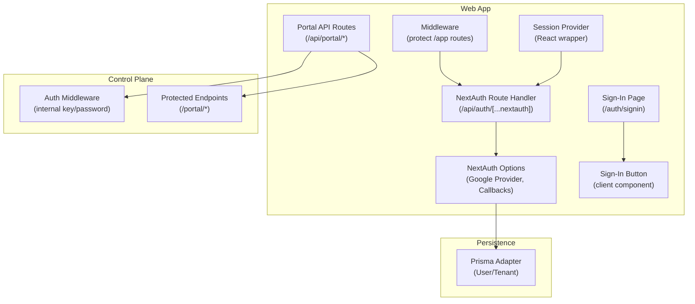
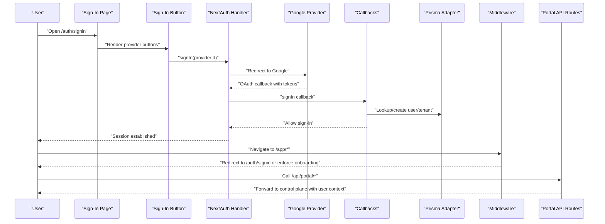
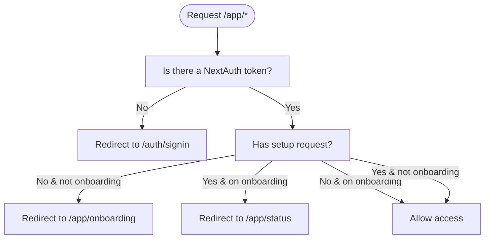
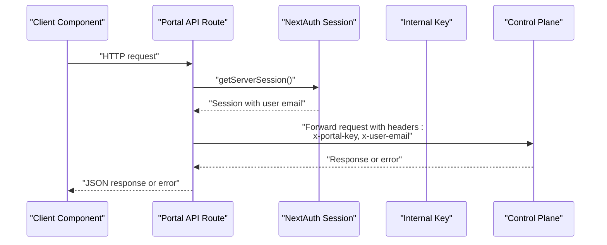
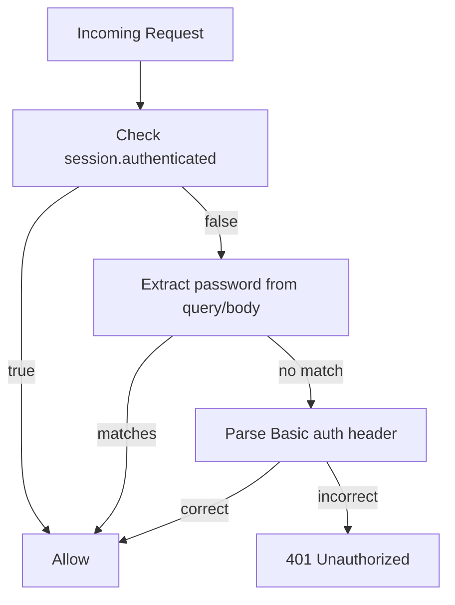
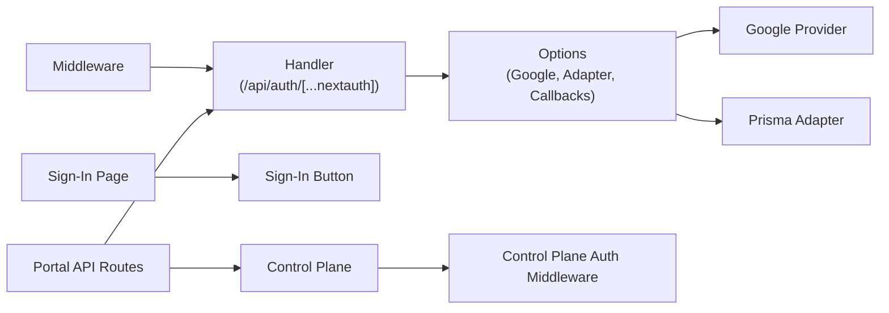

# Authentication System

<cite>
**Referenced Files in This Document**
- [apps/web/src/app/api/auth/[...nextauth]/route.ts](file://apps/web/src/app/api/auth/[...nextauth]/route.ts)
- [apps/web/src/lib/auth.ts](file://apps/web/src/lib/auth.ts)
- [apps/web/src/app/auth/signin/page.tsx](file://apps/web/src/app/auth/signin/page.tsx)
- [apps/web/src/app/auth/signin/SignInButton.tsx](file://apps/web/src/app/auth/signin/SignInButton.tsx)
- [apps/web/src/middleware.ts](file://apps/web/src/middleware.ts)
- [apps/web/src/app/providers.tsx](file://apps/web/src/app/providers.tsx)
- [apps/web/src/lib/prisma.ts](file://apps/web/src/lib/prisma.ts)
- [apps/web/src/app/api/portal/me/route.ts](file://apps/web/src/app/api/portal/me/route.ts)
- [apps/web/src/app/api/portal/setup-request/route.ts](file://apps/web/src/app/api/portal/setup-request/route.ts)
- [apps/web/src/app/api/portal/tenant/current/logs/route.ts](file://apps/web/src/app/api/portal/tenant/current/logs/route.ts)
- [apps/web/src/app/api/portal/tenant/current/qr/route.ts](file://apps/web/src/app/api/portal/tenant/current/qr/route.ts)
- [apps/web/src/app/api/portal/tenant/current/status/route.ts](file://apps/web/src/app/api/portal/tenant/current/status/route.ts)
- [apps/control-plane/src/middleware/auth.ts](file://apps/control-plane/src/middleware/auth.ts)
</cite>

## Table of Contents
1. [Introduction](#introduction)
2. [Project Structure](#project-structure)
3. [Core Components](#core-components)
4. [Architecture Overview](#architecture-overview)
5. [Detailed Component Analysis](#detailed-component-analysis)
6. [Dependency Analysis](#dependency-analysis)
7. [Performance Considerations](#performance-considerations)
8. [Troubleshooting Guide](#troubleshooting-guide)
9. [Conclusion](#conclusion)

## Introduction
This document explains the NextAuth.js authentication system integrated in the web application. It covers Google OAuth configuration, authentication callbacks and session management, sign-in page implementation, protected route handling, user role determination, session persistence, and integration with the control plane API for user verification, tenant association, and permission management. Practical authentication flows, error handling strategies, and security considerations are included.

## Project Structure
The authentication system spans several parts of the web application and integrates with the control plane backend:
- NextAuth.js endpoint configured via a NextAuth route handler
- NextAuth options with Google provider, Prisma adapter, and custom callbacks
- Sign-in page and a client-side sign-in button component
- Middleware for protecting portal routes and enforcing setup flow
- Session provider wrapper for React components
- Control plane API routes that require authenticated users and forward requests with internal keys and user identity

**Diagram sources**
- [apps/web/src/app/api/auth/[...nextauth]/route.ts](file://apps/web/src/app/api/auth/[...nextauth]/route.ts#L1-L7)
- [apps/web/src/lib/auth.ts](file://apps/web/src/lib/auth.ts#L1-L76)
- [apps/web/src/app/auth/signin/page.tsx](file://apps/web/src/app/auth/signin/page.tsx#L1-L37)
- [apps/web/src/app/auth/signin/SignInButton.tsx](file://apps/web/src/app/auth/signin/SignInButton.tsx#L1-L42)
- [apps/web/src/middleware.ts](file://apps/web/src/middleware.ts#L1-L44)
- [apps/web/src/app/providers.tsx](file://apps/web/src/app/providers.tsx#L1-L8)
- [apps/web/src/app/api/portal/me/route.ts](file://apps/web/src/app/api/portal/me/route.ts#L1-L35)
- [apps/control-plane/src/middleware/auth.ts](file://apps/control-plane/src/middleware/auth.ts#L1-L40)
- [apps/web/src/lib/prisma.ts](file://apps/web/src/lib/prisma.ts#L1-L10)

**Section sources**
- [apps/web/src/app/api/auth/[...nextauth]/route.ts](file://apps/web/src/app/api/auth/[...nextauth]/route.ts#L1-L7)
- [apps/web/src/lib/auth.ts](file://apps/web/src/lib/auth.ts#L1-L76)
- [apps/web/src/app/auth/signin/page.tsx](file://apps/web/src/app/auth/signin/page.tsx#L1-L37)
- [apps/web/src/app/auth/signin/SignInButton.tsx](file://apps/web/src/app/auth/signin/SignInButton.tsx#L1-L42)
- [apps/web/src/middleware.ts](file://apps/web/src/middleware.ts#L1-L44)
- [apps/web/src/app/providers.tsx](file://apps/web/src/app/providers.tsx#L1-L8)
- [apps/web/src/lib/prisma.ts](file://apps/web/src/lib/prisma.ts#L1-L10)

## Core Components
- NextAuth route handler: Exposes NextAuth endpoints for OAuth flows and session management.
- NextAuth options: Defines Google provider, Prisma adapter, callbacks, and custom pages.
- Sign-in page: Renders provider buttons and redirects authenticated users.
- Sign-in button: Triggers OAuth sign-in with a callback URL.
- Middleware: Protects portal routes and enforces onboarding/redirect logic based on setup state.
- Session provider: Wraps the app to enable client-side session access.
- Control plane API routes: Require authenticated users, forward internal keys and user email.

**Section sources**
- [apps/web/src/app/api/auth/[...nextauth]/route.ts](file://apps/web/src/app/api/auth/[...nextauth]/route.ts#L1-L7)
- [apps/web/src/lib/auth.ts](file://apps/web/src/lib/auth.ts#L1-L76)
- [apps/web/src/app/auth/signin/page.tsx](file://apps/web/src/app/auth/signin/page.tsx#L1-L37)
- [apps/web/src/app/auth/signin/SignInButton.tsx](file://apps/web/src/app/auth/signin/SignInButton.tsx#L1-L42)
- [apps/web/src/middleware.ts](file://apps/web/src/middleware.ts#L1-L44)
- [apps/web/src/app/providers.tsx](file://apps/web/src/app/providers.tsx#L1-L8)
- [apps/web/src/app/api/portal/me/route.ts](file://apps/web/src/app/api/portal/me/route.ts#L1-L35)

## Architecture Overview
The authentication architecture integrates NextAuth.js with Google OAuth, persists user and tenant data via Prisma, and enforces session-aware routing and control plane access.

**Diagram sources**
- [apps/web/src/app/auth/signin/page.tsx](file://apps/web/src/app/auth/signin/page.tsx#L1-L37)
- [apps/web/src/app/auth/signin/SignInButton.tsx](file://apps/web/src/app/auth/signin/SignInButton.tsx#L1-L42)
- [apps/web/src/app/api/auth/[...nextauth]/route.ts](file://apps/web/src/app/api/auth/[...nextauth]/route.ts#L1-L7)
- [apps/web/src/lib/auth.ts](file://apps/web/src/lib/auth.ts#L1-L76)
- [apps/web/src/middleware.ts](file://apps/web/src/middleware.ts#L1-L44)
- [apps/web/src/app/api/portal/me/route.ts](file://apps/web/src/app/api/portal/me/route.ts#L1-L35)

## Detailed Component Analysis

### NextAuth Configuration and Google OAuth
- Provider: Google OAuth configured with client ID and secret from environment variables.
- Adapter: Prisma adapter connects NextAuth to the database for storing sessions and user identities.
- Pages: Custom sign-in and new user pages are defined for redirect flows after authentication.

Key behaviors:
- On sign-in, the system checks if the user exists; if not, it creates a tenant and a user record with an OWNER role.
- Session callback enriches the session with user ID, tenant ID, role, and setup request presence.

Security considerations:
- Client secrets and environment variables must be properly secured.
- Ensure HTTPS in production to protect cookies and tokens.

**Section sources**
- [apps/web/src/lib/auth.ts](file://apps/web/src/lib/auth.ts#L1-L76)
- [apps/web/src/lib/prisma.ts](file://apps/web/src/lib/prisma.ts#L1-L10)

### Authentication Callbacks and Session Management
- signIn callback: Creates a tenant and user upon first Google sign-in, linking the user to the tenant and assigning the OWNER role.
- session callback: Augments the session with database-backed attributes (IDs, role, setup request presence) so downstream components can use them.

Session persistence:
- NextAuth manages cookie/session storage; the Prisma adapter persists session records.

Role determination:
- Role is stored per user and exposed in the session for route guards and UI decisions.

**Section sources**
- [apps/web/src/lib/auth.ts](file://apps/web/src/lib/auth.ts#L14-L70)

### Sign-In Page Implementation
- Server-rendered sign-in page checks for an existing session and redirects authenticated users to onboarding.
- Retrieves providers and renders a sign-in button for each provider.

Customization:
- The page uses Tailwind classes for layout and includes a welcome message and description.

**Section sources**
- [apps/web/src/app/auth/signin/page.tsx](file://apps/web/src/app/auth/signin/page.tsx#L1-L37)

### SignInButton Component
- Client component that triggers NextAuth sign-in for the selected provider.
- Uses a callback URL to direct users to onboarding after successful sign-in.

UI details:
- Includes a Google SVG icon when the provider is Google.

**Section sources**
- [apps/web/src/app/auth/signin/SignInButton.tsx](file://apps/web/src/app/auth/signin/SignInButton.tsx#L1-L42)

### Protected Route Handling and Setup Flow
- Middleware protects all /app routes and enforces:
  - Redirect to sign-in if no session exists.
  - Redirect to onboarding if no setup request exists.
  - Redirect to status if a setup request exists and the user is on onboarding.
- The setup state is derived from the session token set by NextAuth callbacks.

**Diagram sources**
- [apps/web/src/middleware.ts](file://apps/web/src/middleware.ts#L4-L28)

**Section sources**
- [apps/web/src/middleware.ts](file://apps/web/src/middleware.ts#L1-L44)

### Session Provider and Client-Side Access
- The app is wrapped with a SessionProvider to enable client-side hooks like useSession.
- Client components can trigger sign-in, sign-out, and access session data.

**Section sources**
- [apps/web/src/app/providers.tsx](file://apps/web/src/app/providers.tsx#L1-L8)

### Integration with Control Plane API
- Portal API routes require an authenticated user and forward requests to control plane endpoints.
- They attach:
  - An internal portal key header for service-to-service trust.
  - The authenticated user’s email as an identity header.
- Error handling:
  - Unauthorized responses if no session email is present.
  - Propagation of control plane errors with appropriate HTTP status codes.
  - Generic 500 responses on network failures.

Endpoints:
- GET /api/portal/me
- POST /api/portal/setup-request
- GET /api/portal/tenant/current/logs
- GET /api/portal/tenant/current/qr
- GET /api/portal/tenant/current/status

**Diagram sources**
- [apps/web/src/app/api/portal/me/route.ts](file://apps/web/src/app/api/portal/me/route.ts#L1-L35)
- [apps/web/src/app/api/portal/setup-request/route.ts](file://apps/web/src/app/api/portal/setup-request/route.ts#L1-L40)
- [apps/web/src/app/api/portal/tenant/current/logs/route.ts](file://apps/web/src/app/api/portal/tenant/current/logs/route.ts#L1-L35)
- [apps/web/src/app/api/portal/tenant/current/qr/route.ts](file://apps/web/src/app/api/portal/tenant/current/qr/route.ts#L1-L35)
- [apps/web/src/app/api/portal/tenant/current/status/route.ts](file://apps/web/src/app/api/portal/tenant/current/status/route.ts#L1-L35)

**Section sources**
- [apps/web/src/app/api/portal/me/route.ts](file://apps/web/src/app/api/portal/me/route.ts#L1-L35)
- [apps/web/src/app/api/portal/setup-request/route.ts](file://apps/web/src/app/api/portal/setup-request/route.ts#L1-L40)
- [apps/web/src/app/api/portal/tenant/current/logs/route.ts](file://apps/web/src/app/api/portal/tenant/current/logs/route.ts#L1-L35)
- [apps/web/src/app/api/portal/tenant/current/qr/route.ts](file://apps/web/src/app/api/portal/tenant/current/qr/route.ts#L1-L35)
- [apps/web/src/app/api/portal/tenant/current/status/route.ts](file://apps/web/src/app/api/portal/tenant/current/status/route.ts#L1-L35)

### Control Plane Authentication
- Control plane middleware supports two authentication modes:
  - Session-based flag indicating authenticated state.
  - Basic auth using a password extracted from Authorization header.
  - Admin password is configurable via environment variable.
- If neither condition is met, the middleware responds with 401 Unauthorized.

**Diagram sources**
- [apps/control-plane/src/middleware/auth.ts](file://apps/control-plane/src/middleware/auth.ts#L1-L40)

**Section sources**
- [apps/control-plane/src/middleware/auth.ts](file://apps/control-plane/src/middleware/auth.ts#L1-L40)

## Dependency Analysis
- NextAuth route handler depends on NextAuth options and NextAuth runtime.
- NextAuth options depend on:
  - Google provider configuration
  - Prisma adapter and Prisma client
  - Callbacks for sign-in and session enrichment
  - Custom pages for sign-in/new user
- Sign-in page and button depend on NextAuth client/server APIs.
- Middleware depends on NextAuth token presence and pathname checks.
- Portal API routes depend on NextAuth session retrieval and control plane endpoints.
- Control plane middleware depends on environment-provided admin password and request headers.

**Diagram sources**
- [apps/web/src/app/api/auth/[...nextauth]/route.ts](file://apps/web/src/app/api/auth/[...nextauth]/route.ts#L1-L7)
- [apps/web/src/lib/auth.ts](file://apps/web/src/lib/auth.ts#L1-L76)
- [apps/web/src/app/auth/signin/page.tsx](file://apps/web/src/app/auth/signin/page.tsx#L1-L37)
- [apps/web/src/app/auth/signin/SignInButton.tsx](file://apps/web/src/app/auth/signin/SignInButton.tsx#L1-L42)
- [apps/web/src/middleware.ts](file://apps/web/src/middleware.ts#L1-L44)
- [apps/web/src/app/api/portal/me/route.ts](file://apps/web/src/app/api/portal/me/route.ts#L1-L35)
- [apps/control-plane/src/middleware/auth.ts](file://apps/control-plane/src/middleware/auth.ts#L1-L40)

**Section sources**
- [apps/web/src/app/api/auth/[...nextauth]/route.ts](file://apps/web/src/app/api/auth/[...nextauth]/route.ts#L1-L7)
- [apps/web/src/lib/auth.ts](file://apps/web/src/lib/auth.ts#L1-L76)
- [apps/web/src/middleware.ts](file://apps/web/src/middleware.ts#L1-L44)

## Performance Considerations
- Minimize database queries in callbacks; the current implementation performs a single lookup per sign-in and session retrieval per request.
- Consider caching frequently accessed tenant/user data in memory or Redis if traffic increases.
- Keep NextAuth cookie settings aligned with site security policies (sameSite, secure, httpOnly).
- Use environment-specific NextAuth and database configurations for optimal performance.

## Troubleshooting Guide
Common issues and resolutions:
- Missing environment variables for Google OAuth cause provider misconfiguration. Verify client ID and secret.
- Unauthorized errors from portal API routes indicate missing session or invalid user email; ensure the user is signed in and session is active.
- Control plane 401 responses suggest incorrect internal key or admin password; confirm the portal internal key and admin password values.
- Middleware redirect loops can occur if setup state is inconsistent; verify the presence of setup requests and session token fields.
- Network errors when calling control plane endpoints should be logged and surfaced as 500 responses; check connectivity and endpoint availability.

**Section sources**
- [apps/web/src/app/api/portal/me/route.ts](file://apps/web/src/app/api/portal/me/route.ts#L15-L33)
- [apps/web/src/app/api/portal/setup-request/route.ts](file://apps/web/src/app/api/portal/setup-request/route.ts#L17-L38)
- [apps/web/src/middleware.ts](file://apps/web/src/middleware.ts#L14-L27)
- [apps/control-plane/src/middleware/auth.ts](file://apps/control-plane/src/middleware/auth.ts#L18-L26)

## Conclusion
The authentication system leverages NextAuth.js with Google OAuth, Prisma-backed session storage, and custom callbacks to manage user and tenant creation. Middleware enforces protected routes and a guided onboarding flow, while portal API routes integrate with the control plane using internal keys and user identity headers. Security is strengthened through environment-controlled secrets and middleware-based authentication for control plane endpoints.