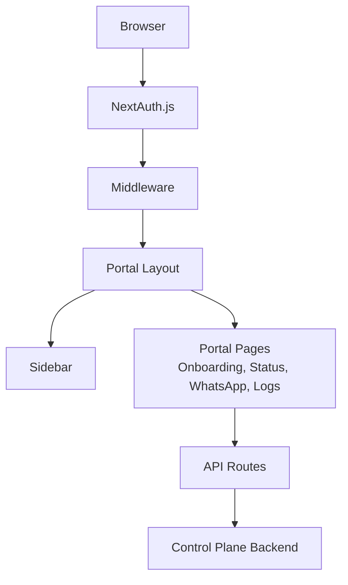
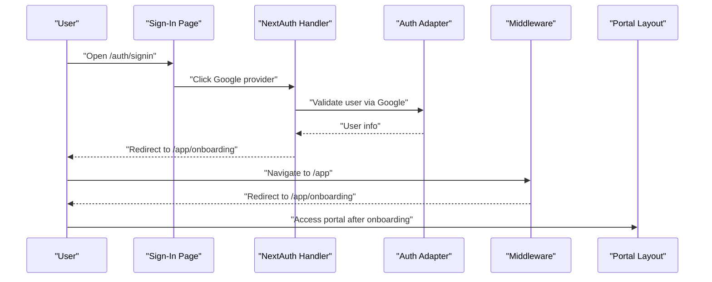
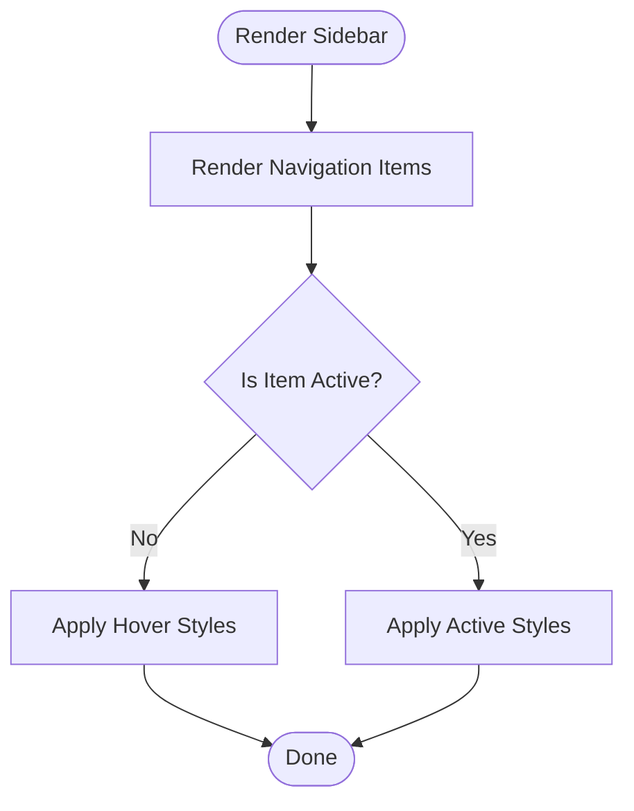
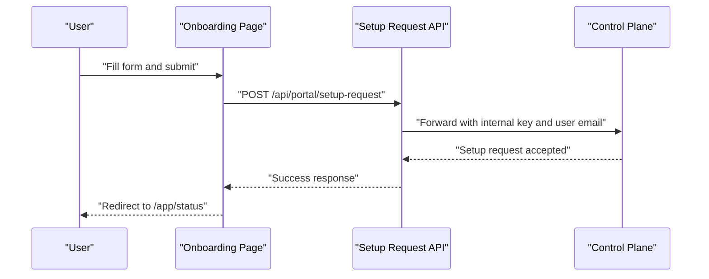
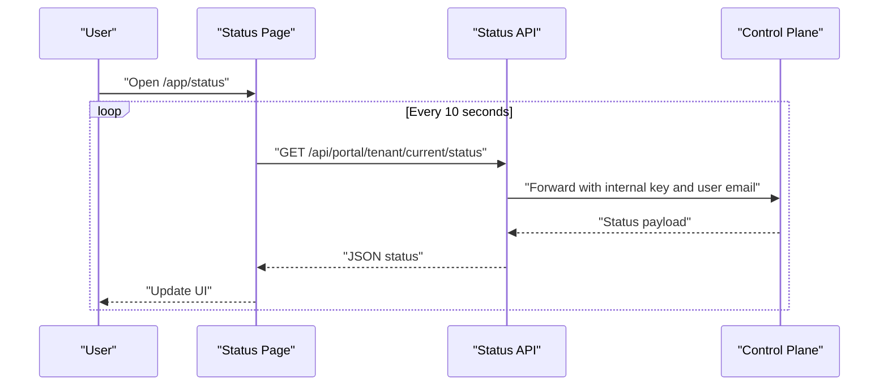
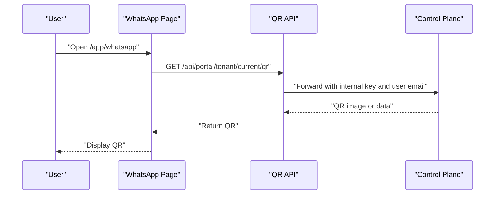
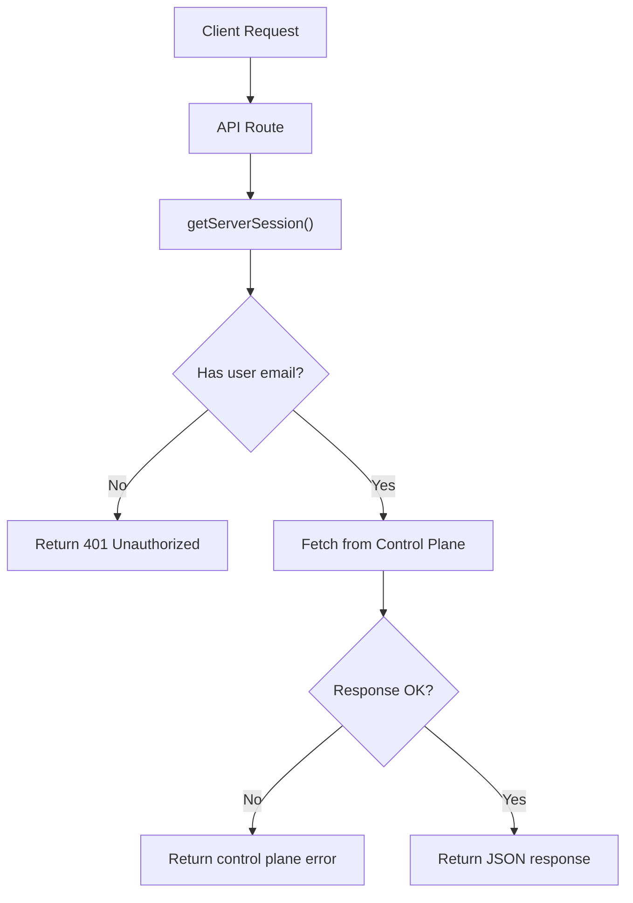
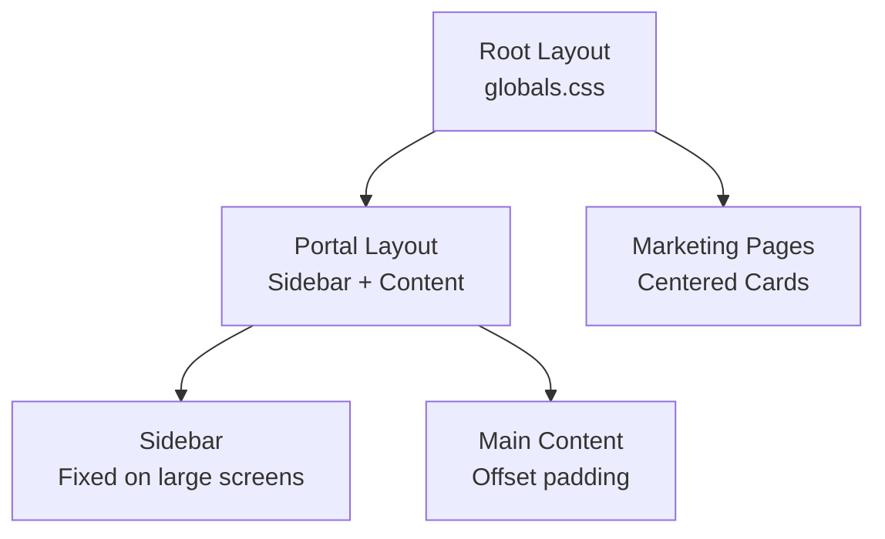
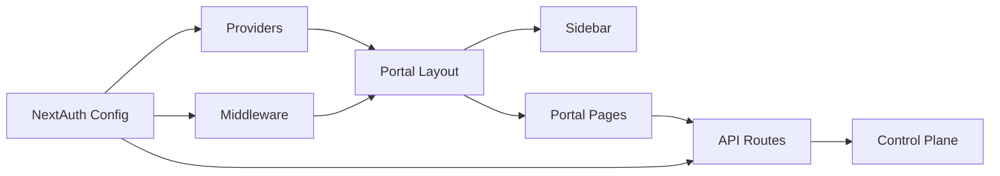

# Frontend Application

<cite>
**Referenced Files in This Document**
- [layout.tsx](file://apps/web/src/app/layout.tsx)
- [providers.tsx](file://apps/web/src/app/providers.tsx)
- [middleware.ts](file://apps/web/src/middleware.ts)
- [auth.ts](file://apps/web/src/lib/auth.ts)
- [Sidebar.tsx](file://apps/web/src/components/portal/Sidebar.tsx)
- [page.tsx](file://apps/web/src/app/(portal)/layout.tsx)
- [page.tsx](file://apps/web/src/app/auth/signin/page.tsx)
- [route.ts](file://apps/web/src/app/api/auth/[...nextauth]/route.ts)
- [route.ts](file://apps/web/src/app/api/portal/me/route.ts)
- [route.ts](file://apps/web/src/app/api/portal/setup-request/route.ts)
- [page.tsx](file://apps/web/src/app/(portal)/app/onboarding/page.tsx)
- [page.tsx](file://apps/web/src/app/(portal)/app/status/page.tsx)
- [route.ts](file://apps/web/src/app/api/portal/tenant/current/status/route.ts)
- [route.ts](file://apps/web/src/app/api/portal/tenant/current/qr/route.ts)
- [globals.css](file://apps/web/src/app/globals.css)
</cite>

## Table of Contents
1. [Introduction](#introduction)
2. [Project Structure](#project-structure)
3. [Core Components](#core-components)
4. [Architecture Overview](#architecture-overview)
5. [Detailed Component Analysis](#detailed-component-analysis)
6. [Dependency Analysis](#dependency-analysis)
7. [Performance Considerations](#performance-considerations)
8. [Troubleshooting Guide](#troubleshooting-guide)
9. [Conclusion](#conclusion)
10. [Appendices](#appendices)

## Introduction
This document describes the Next.js frontend application and user interface for Flow HQ. It covers the application structure with marketing pages and a protected portal, authentication integration using NextAuth.js with Google OAuth, tenant dashboard functionality, and API integration patterns. It also documents middleware for authentication and authorization, sidebar navigation, responsive design with Tailwind CSS, and practical user flows for onboarding, status monitoring, and portal navigation.

## Project Structure
The frontend is organized into:
- Marketing pages under a named route group for marketing content.
- A protected portal under a named route group for authenticated users.
- Shared providers and global styles.
- Middleware for authentication gating and redirects.
- Authentication routes handled by NextAuth.js.
- API routes that proxy requests to the control plane backend.

```mermaid
graph TB
subgraph "Marketing"
M1["apps/web/src/app/(marketing)/page.tsx"]
M2["apps/web/src/app/(marketing)/contact/page.tsx"]
M3["apps/web/src/app/(marketing)/pricing/page.tsx"]
M4["apps/web/src/app/(marketing)/templates/page.tsx"]
end
subgraph "Portal"
P1["apps/web/src/app/(portal)/layout.tsx"]
P2["apps/web/src/app/(portal)/app/onboarding/page.tsx"]
P3["apps/web/src/app/(portal)/app/status/page.tsx"]
P4["apps/web/src/app/(portal)/app/whatsapp/page.tsx"]
P5["apps/web/src/app/(portal)/app/logs/page.tsx"]
end
subgraph "Auth"
A1["apps/web/src/app/api/auth/[...nextauth]/route.ts"]
A2["apps/web/src/lib/auth.ts"]
S1["apps/web/src/app/auth/signin/page.tsx"]
end
subgraph "API"
API1["apps/web/src/app/api/portal/me/route.ts"]
API2["apps/web/src/app/api/portal/setup-request/route.ts"]
API3["apps/web/src/app/api/portal/tenant/current/status/route.ts"]
API4["apps/web/src/app/api/portal/tenant/current/qr/route.ts"]
end
G["apps/web/src/app/globals.css"]
Prov["apps/web/src/app/providers.tsx"]
MW["apps/web/src/middleware.ts"]
Prov --> M1
Prov --> P1
MW --> P1
MW --> S1
S1 --> A1
A1 --> A2
P1 --> P2
P1 --> P3
P1 --> P4
P1 --> P5
P2 --> API2
P3 --> API3
P3 --> API4
P1 --> API1
```

**Diagram sources**
- [layout.tsx](file://apps/web/src/app/layout.tsx#L1-L25)
- [providers.tsx](file://apps/web/src/app/providers.tsx#L1-L8)
- [middleware.ts](file://apps/web/src/middleware.ts#L1-L44)
- [auth.ts](file://apps/web/src/lib/auth.ts#L1-L76)
- [Sidebar.tsx](file://apps/web/src/components/portal/Sidebar.tsx#L1-L69)
- [page.tsx](file://apps/web/src/app/(portal)/layout.tsx#L1-L30)
- [page.tsx](file://apps/web/src/app/auth/signin/page.tsx#L1-L37)
- [route.ts](file://apps/web/src/app/api/auth/[...nextauth]/route.ts#L1-L7)
- [route.ts](file://apps/web/src/app/api/portal/me/route.ts#L1-L35)
- [route.ts](file://apps/web/src/app/api/portal/setup-request/route.ts#L1-L40)
- [page.tsx](file://apps/web/src/app/(portal)/app/onboarding/page.tsx#L1-L115)
- [page.tsx](file://apps/web/src/app/(portal)/app/status/page.tsx#L1-L160)
- [route.ts](file://apps/web/src/app/api/portal/tenant/current/status/route.ts#L1-L35)
- [route.ts](file://apps/web/src/app/api/portal/tenant/current/qr/route.ts#L1-L35)
- [globals.css](file://apps/web/src/app/globals.css#L1-L20)

**Section sources**
- [layout.tsx](file://apps/web/src/app/layout.tsx#L1-L25)
- [providers.tsx](file://apps/web/src/app/providers.tsx#L1-L8)
- [middleware.ts](file://apps/web/src/middleware.ts#L1-L44)
- [auth.ts](file://apps/web/src/lib/auth.ts#L1-L76)
- [Sidebar.tsx](file://apps/web/src/components/portal/Sidebar.tsx#L1-L69)
- [page.tsx](file://apps/web/src/app/(portal)/layout.tsx#L1-L30)
- [page.tsx](file://apps/web/src/app/auth/signin/page.tsx#L1-L37)
- [route.ts](file://apps/web/src/app/api/auth/[...nextauth]/route.ts#L1-L7)
- [route.ts](file://apps/web/src/app/api/portal/me/route.ts#L1-L35)
- [route.ts](file://apps/web/src/app/api/portal/setup-request/route.ts#L1-L40)
- [page.tsx](file://apps/web/src/app/(portal)/app/onboarding/page.tsx#L1-L115)
- [page.tsx](file://apps/web/src/app/(portal)/app/status/page.tsx#L1-L160)
- [route.ts](file://apps/web/src/app/api/portal/tenant/current/status/route.ts#L1-L35)
- [route.ts](file://apps/web/src/app/api/portal/tenant/current/qr/route.ts#L1-L35)
- [globals.css](file://apps/web/src/app/globals.css#L1-L20)

## Core Components
- Providers wrapper initializes NextAuth session context for the app tree.
- Root layout defines metadata and applies global Tailwind styles.
- Middleware enforces authentication for portal routes and redirects based on setup state.
- NextAuth configuration integrates Google OAuth, auto-provisions users and tenants, and enriches sessions.
- Portal layout renders the sidebar and main content area for authenticated users.
- Sidebar provides navigation links and a sign-out action.
- Authentication pages handle sign-in and provider redirection.
- API routes act as proxies to the control plane, passing internal keys and user identity.

**Section sources**
- [providers.tsx](file://apps/web/src/app/providers.tsx#L1-L8)
- [layout.tsx](file://apps/web/src/app/layout.tsx#L1-L25)
- [middleware.ts](file://apps/web/src/middleware.ts#L1-L44)
- [auth.ts](file://apps/web/src/lib/auth.ts#L1-L76)
- [page.tsx](file://apps/web/src/app/(portal)/layout.tsx#L1-L30)
- [Sidebar.tsx](file://apps/web/src/components/portal/Sidebar.tsx#L1-L69)
- [page.tsx](file://apps/web/src/app/auth/signin/page.tsx#L1-L37)
- [route.ts](file://apps/web/src/app/api/auth/[...nextauth]/route.ts#L1-L7)
- [route.ts](file://apps/web/src/app/api/portal/me/route.ts#L1-L35)

## Architecture Overview
The frontend uses a dual-layer architecture:
- Presentation layer: Next.js App Router with route groups for marketing and portal.
- Authentication and data layer: NextAuth.js for identity and session management, middleware for routing policies, and API routes for control plane integration.

**Diagram sources**
- [middleware.ts](file://apps/web/src/middleware.ts#L1-L44)
- [page.tsx](file://apps/web/src/app/(portal)/layout.tsx#L1-L30)
- [Sidebar.tsx](file://apps/web/src/components/portal/Sidebar.tsx#L1-L69)
- [page.tsx](file://apps/web/src/app/(portal)/app/onboarding/page.tsx#L1-L115)
- [page.tsx](file://apps/web/src/app/(portal)/app/status/page.tsx#L1-L160)
- [route.ts](file://apps/web/src/app/api/portal/me/route.ts#L1-L35)
- [route.ts](file://apps/web/src/app/api/portal/setup-request/route.ts#L1-L40)
- [route.ts](file://apps/web/src/app/api/portal/tenant/current/status/route.ts#L1-L35)
- [route.ts](file://apps/web/src/app/api/portal/tenant/current/qr/route.ts#L1-L35)

## Detailed Component Analysis

### Authentication and Authorization
- NextAuth configuration:
  - Uses Google OAuth provider with environment credentials.
  - Automatically creates a tenant and user on first sign-in.
  - Enriches session with user ID, tenant ID, role, and setup request presence.
  - Redirects new users to onboarding after sign-in.
- Authentication routes:
  - Provider endpoint is exposed via NextAuth handler.
  - Sign-in page checks for existing session and lists providers.
- Middleware:
  - Protects portal routes and redirects unauthenticated users to sign-in.
  - Redirects authenticated users to onboarding if no setup request exists.
  - Redirects users on onboarding to status once a setup request exists.

**Diagram sources**
- [page.tsx](file://apps/web/src/app/auth/signin/page.tsx#L1-L37)
- [route.ts](file://apps/web/src/app/api/auth/[...nextauth]/route.ts#L1-L7)
- [auth.ts](file://apps/web/src/lib/auth.ts#L1-L76)
- [middleware.ts](file://apps/web/src/middleware.ts#L1-L44)
- [page.tsx](file://apps/web/src/app/(portal)/layout.tsx#L1-L30)

**Section sources**
- [auth.ts](file://apps/web/src/lib/auth.ts#L1-L76)
- [route.ts](file://apps/web/src/app/api/auth/[...nextauth]/route.ts#L1-L7)
- [page.tsx](file://apps/web/src/app/auth/signin/page.tsx#L1-L37)
- [middleware.ts](file://apps/web/src/middleware.ts#L1-L44)

### Portal Navigation and Sidebar
- Sidebar displays navigation items and highlights the active route.
- Provides user profile display and a sign-out action.
- Fixed layout on large screens with a main content area offset.

**Diagram sources**
- [Sidebar.tsx](file://apps/web/src/components/portal/Sidebar.tsx#L1-L69)
- [page.tsx](file://apps/web/src/app/(portal)/layout.tsx#L1-L30)

**Section sources**
- [Sidebar.tsx](file://apps/web/src/components/portal/Sidebar.tsx#L1-L69)
- [page.tsx](file://apps/web/src/app/(portal)/layout.tsx#L1-L30)

### Onboarding Flow
- Collects business details and submission preferences.
- Submits a setup request to the control plane via an API route.
- Navigates to status after successful submission.

**Diagram sources**
- [page.tsx](file://apps/web/src/app/(portal)/app/onboarding/page.tsx#L1-L115)
- [route.ts](file://apps/web/src/app/api/portal/setup-request/route.ts#L1-L40)

**Section sources**
- [page.tsx](file://apps/web/src/app/(portal)/app/onboarding/page.tsx#L1-L115)
- [route.ts](file://apps/web/src/app/api/portal/setup-request/route.ts#L1-L40)

### Status Dashboard and Polling
- Periodically polls the control plane for tenant and setup status.
- Renders status cards with color-coded indicators.
- Provides navigation to next steps based on state.

**Diagram sources**
- [page.tsx](file://apps/web/src/app/(portal)/app/status/page.tsx#L1-L160)
- [route.ts](file://apps/web/src/app/api/portal/tenant/current/status/route.ts#L1-L35)

**Section sources**
- [page.tsx](file://apps/web/src/app/(portal)/app/status/page.tsx#L1-L160)
- [route.ts](file://apps/web/src/app/api/portal/tenant/current/status/route.ts#L1-L35)

### QR Generation Endpoint
- Exposes a route to fetch a QR code for WhatsApp connection.
- Proxies to the control plane with appropriate headers.

**Diagram sources**
- [page.tsx](file://apps/web/src/app/(portal)/app/status/page.tsx#L1-L160)
- [route.ts](file://apps/web/src/app/api/portal/tenant/current/qr/route.ts#L1-L35)

**Section sources**
- [route.ts](file://apps/web/src/app/api/portal/tenant/current/qr/route.ts#L1-L35)

### API Integration Patterns
- All portal API routes:
  - Retrieve the current session.
  - Validate presence of user email.
  - Forward requests to the control plane with:
    - x-portal-key header for service-to-service trust.
    - x-user-email header to identify the acting user.
  - Return standardized JSON responses or propagate control plane errors.

**Diagram sources**
- [route.ts](file://apps/web/src/app/api/portal/me/route.ts#L1-L35)
- [route.ts](file://apps/web/src/app/api/portal/setup-request/route.ts#L1-L40)
- [route.ts](file://apps/web/src/app/api/portal/tenant/current/status/route.ts#L1-L35)
- [route.ts](file://apps/web/src/app/api/portal/tenant/current/qr/route.ts#L1-L35)

**Section sources**
- [route.ts](file://apps/web/src/app/api/portal/me/route.ts#L1-L35)
- [route.ts](file://apps/web/src/app/api/portal/setup-request/route.ts#L1-L40)
- [route.ts](file://apps/web/src/app/api/portal/tenant/current/status/route.ts#L1-L35)
- [route.ts](file://apps/web/src/app/api/portal/tenant/current/qr/route.ts#L1-L35)

### Responsive Design and Layout
- Global Tailwind CSS is imported in the root layout.
- Portal layout uses a left sidebar on large screens and a main content area.
- Marketing pages use centered card layouts with shadows and spacing.

**Diagram sources**
- [layout.tsx](file://apps/web/src/app/layout.tsx#L1-L25)
- [globals.css](file://apps/web/src/app/globals.css#L1-L20)
- [page.tsx](file://apps/web/src/app/(portal)/layout.tsx#L1-L30)
- [Sidebar.tsx](file://apps/web/src/components/portal/Sidebar.tsx#L1-L69)

**Section sources**
- [layout.tsx](file://apps/web/src/app/layout.tsx#L1-L25)
- [globals.css](file://apps/web/src/app/globals.css#L1-L20)
- [page.tsx](file://apps/web/src/app/(portal)/layout.tsx#L1-L30)
- [Sidebar.tsx](file://apps/web/src/components/portal/Sidebar.tsx#L1-L69)

## Dependency Analysis
Key dependencies and relationships:
- Providers wrap the app tree to enable session context.
- Middleware depends on NextAuth’s withAuth helper and guards portal routes.
- Portal layout depends on session retrieval and renders the sidebar.
- API routes depend on NextAuth session and control plane environment variables.
- Sidebar depends on Next.js navigation primitives and NextAuth client hooks.

**Diagram sources**
- [providers.tsx](file://apps/web/src/app/providers.tsx#L1-L8)
- [middleware.ts](file://apps/web/src/middleware.ts#L1-L44)
- [page.tsx](file://apps/web/src/app/(portal)/layout.tsx#L1-L30)
- [Sidebar.tsx](file://apps/web/src/components/portal/Sidebar.tsx#L1-L69)
- [page.tsx](file://apps/web/src/app/(portal)/app/onboarding/page.tsx#L1-L115)
- [page.tsx](file://apps/web/src/app/(portal)/app/status/page.tsx#L1-L160)
- [route.ts](file://apps/web/src/app/api/portal/me/route.ts#L1-L35)
- [auth.ts](file://apps/web/src/lib/auth.ts#L1-L76)

**Section sources**
- [providers.tsx](file://apps/web/src/app/providers.tsx#L1-L8)
- [middleware.ts](file://apps/web/src/middleware.ts#L1-L44)
- [page.tsx](file://apps/web/src/app/(portal)/layout.tsx#L1-L30)
- [Sidebar.tsx](file://apps/web/src/components/portal/Sidebar.tsx#L1-L69)
- [page.tsx](file://apps/web/src/app/(portal)/app/onboarding/page.tsx#L1-L115)
- [page.tsx](file://apps/web/src/app/(portal)/app/status/page.tsx#L1-L160)
- [route.ts](file://apps/web/src/app/api/portal/me/route.ts#L1-L35)
- [auth.ts](file://apps/web/src/lib/auth.ts#L1-L76)

## Performance Considerations
- Client-side polling for status updates should be throttled and canceled on component unmount to avoid redundant network calls.
- Use caching headers or local storage sparingly for non-sensitive data to reduce repeated fetches.
- Lazy-load heavy components and images to improve initial render performance.
- Minimize re-renders by keeping state scoped to pages and avoiding unnecessary prop drilling.

## Troubleshooting Guide
Common issues and resolutions:
- Unauthorized access to portal routes:
  - Ensure the user is signed in and session is present.
  - Verify middleware matcher and callback logic for portal routes.
- Missing environment variables:
  - Confirm CONTROL_PLANE_URL and PORTAL_INTERNAL_KEY are set for API routes.
- Session enrichment problems:
  - Check NextAuth callbacks for session augmentation and database relations.
- Redirect loops:
  - Review middleware logic for onboarding and status redirects based on setup request presence.

**Section sources**
- [middleware.ts](file://apps/web/src/middleware.ts#L1-L44)
- [route.ts](file://apps/web/src/app/api/portal/me/route.ts#L1-L35)
- [auth.ts](file://apps/web/src/lib/auth.ts#L1-L76)

## Conclusion
The frontend provides a clean separation between marketing and portal experiences, robust authentication with Google OAuth, and a responsive layout with a fixed sidebar. API routes reliably proxy to the control plane while preserving user identity and enforcing internal trust boundaries. The onboarding and status dashboards offer a clear path for business owners to configure and monitor their WhatsApp automation.

## Appendices
- Environment variables used by API routes:
  - CONTROL_PLANE_URL: Base URL of the control plane backend.
  - PORTAL_INTERNAL_KEY: Internal key for service-to-service authentication.

**Section sources**
- [route.ts](file://apps/web/src/app/api/portal/me/route.ts#L1-L35)
- [route.ts](file://apps/web/src/app/api/portal/setup-request/route.ts#L1-L40)
- [route.ts](file://apps/web/src/app/api/portal/tenant/current/status/route.ts#L1-L35)
- [route.ts](file://apps/web/src/app/api/portal/tenant/current/qr/route.ts#L1-L35)