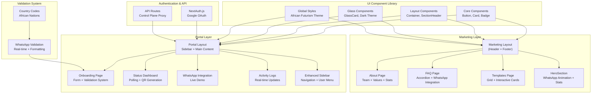
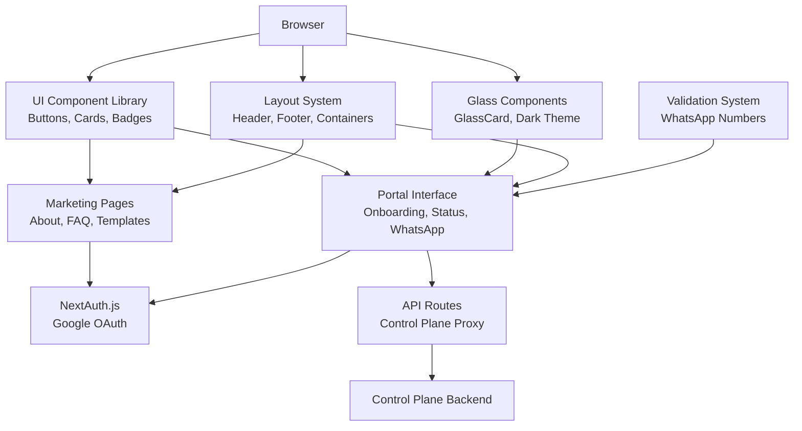
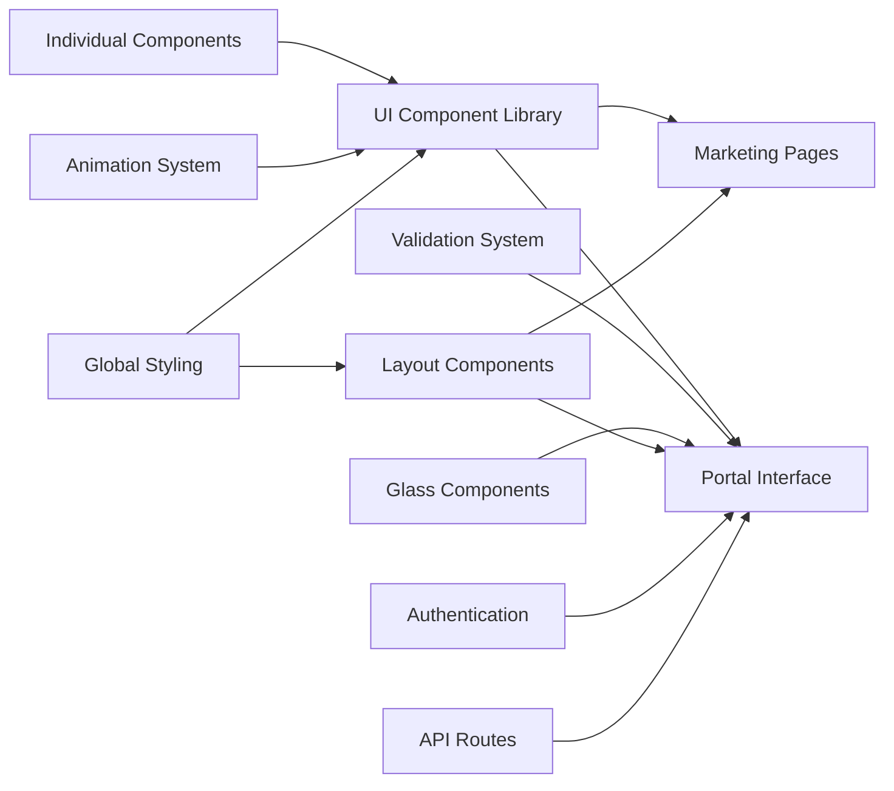

# Frontend Application

<cite>
**Referenced Files in This Document**
- [layout.tsx](file://apps/web/src/app/layout.tsx)
- [providers.tsx](file://apps/web/src/app/providers.tsx)
- [middleware.ts](file://apps/web/src/middleware.ts)
- [auth.ts](file://apps/web/src/lib/auth.ts)
- [Header.tsx](file://apps/web/src/components/layout/Header.tsx)
- [Footer.tsx](file://apps/web/src/components/layout/Footer.tsx)
- [HeroSection.tsx](file://apps/web/src/components/sections/HeroSection.tsx)
- [Button.tsx](file://apps/web/src/components/ui/Button.tsx)
- [Card.tsx](file://apps/web/src/components/ui/Card.tsx)
- [Badge.tsx](file://apps/web/src/components/ui/Badge.tsx)
- [Container.tsx](file://apps/web/src/components/ui/Container.tsx)
- [SectionHeader.tsx](file://apps/web/src/components/ui/SectionHeader.tsx)
- [Sidebar.tsx](file://apps/web/src/components/portal/Sidebar.tsx)
- [validators.ts](file://apps/web/src/lib/validators.ts)
- [marketing layout.tsx](file://apps/web/src/app/(marketing)/layout.tsx)
- [about page.tsx](file://apps/web/src/app/(marketing)/about/page.tsx)
- [faq page.tsx](file://apps/web/src/app/(marketing)/faq/page.tsx)
- [templates page.tsx](file://apps/web/src/app/(marketing)/templates/page.tsx)
- [portal layout.tsx](file://apps/web/src/app/(portal)/layout.tsx)
- [onboarding page.tsx](file://apps/web/src/app/(portal)/app/onboarding/page.tsx)
- [status page.tsx](file://apps/web/src/app/(portal)/app/status/page.tsx)
- [whatsapp page.tsx](file://apps/web/src/app/(portal)/app/whatsapp/page.tsx)
- [logs page.tsx](file://apps/web/src/app/(portal)/app/logs/page.tsx)
- [signin page.tsx](file://apps/web/src/app/auth/signin/page.tsx)
- [route.ts](file://apps/web/src/app/api/auth/[...nextauth]/route.ts)
- [route.ts](file://apps/web/src/app/api/portal/me/route.ts)
- [route.ts](file://apps/web/src/app/api/portal/setup-request/route.ts)
- [route.ts](file://apps/web/src/app/api/portal/tenant/current/status/route.ts)
- [route.ts](file://apps/web/src/app/api/portal/tenant/current/qr/route.ts)
- [globals.css](file://apps/web/src/app/globals.css)
- [tailwind.config.js](file://apps/web/tailwind.config.js)
</cite>

## Update Summary
**Changes Made**
- Added comprehensive documentation for the new validation system implementation with WhatsApp number validation
- Documented enhanced portal interface with dark theme and glass morphism effects
- Updated UI component library with glass card components and dark theme styling
- Enhanced validation system with real-time phone number validation and formatting
- Added comprehensive Tailwind CSS configuration for dark theme and glass effects
- Updated portal components with improved dark theme integration and glass morphism

## Table of Contents
1. [Introduction](#introduction)
2. [Project Structure](#project-structure)
3. [Core Components](#core-components)
4. [Architecture Overview](#architecture-overview)
5. [Detailed Component Analysis](#detailed-component-analysis)
6. [New Validation System Implementation](#new-validation-system-implementation)
7. [Enhanced Portal Interface with Dark Theme](#enhanced-portal-interface-with-dark-theme)
8. [Glass Morphism Effects and Dark Theme](#glass-morphism-effects-and-dark-theme)
9. [New Marketing Pages](#new-marketing-pages)
10. [Enhanced UI Component Library](#enhanced-ui-component-library)
11. [Layout System and Navigation](#layout-system-and-navigation)
12. [Dependency Analysis](#dependency-analysis)
13. [Performance Considerations](#performance-considerations)
14. [Troubleshooting Guide](#troubleshooting-guide)
15. [Conclusion](#conclusion)
16. [Appendices](#appendices)

## Introduction
This document describes the Next.js frontend application and user interface for Flow HQ, featuring a complete UI redesign with an African Futurism theme and enhanced validation systems. The application now includes comprehensive validation for WhatsApp numbers, sophisticated dark theme implementation with glass morphism effects, marketing pages with modern animations, a comprehensive portal interface with enhanced authentication, tenant dashboard functionality, and API integration patterns. The redesign introduces advanced validation systems, sophisticated UI components, responsive design with Tailwind CSS, and practical user flows for business owners managing multiple tenants.

## Project Structure
The frontend is organized into a dual-layer architecture with marketing and portal route groups, enhanced with a comprehensive UI component library and advanced validation systems:

```mermaid
graph TB
subgraph "Marketing Layer"
ML["Marketing Layout<br/>(Header + Footer)"]
MAbout["About Page<br/>Team + Values + Stats"]
MFAQ["FAQ Page<br/>Accordion + WhatsApp Integration"]
MTemplates["Templates Page<br/>Grid + Interactive Cards"]
MH["HeroSection<br/>WhatsApp Animation + Stats"]
end
subgraph "Portal Layer"
PL["Portal Layout<br/>Sidebar + Main Content"]
POnboard["Onboarding Page<br/>Form + Validation System"]
PStatus["Status Dashboard<br/>Polling + QR Generation"]
PWhatsApp["WhatsApp Integration<br/>Live Demo"]
PLogs["Activity Logs<br/>Real-time Updates"]
PSidebar["Enhanced Sidebar<br/>Navigation + User Menu"]
end
subgraph "UI Component Library"
UICore["Core Components<br/>Button, Card, Badge"]
UILayout["Layout Components<br/>Container, SectionHeader"]
UIGlass["Glass Components<br/>GlassCard, Dark Theme"]
UIGlobal["Global Styles<br/>African Futurism Theme"]
end
subgraph "Validation System"
Valid["WhatsApp Validation<br/>Real-time + Formatting"]
Countries["Country Codes<br/>African Nations"]
end
subgraph "Authentication & API"
Auth["NextAuth.js<br/>Google OAuth"]
API["API Routes<br/>Control Plane Proxy"]
end
ML --> MAbout
ML --> MFAQ
ML --> MTemplates
ML --> MH
PL --> POnboard
PL --> PStatus
PL --> PWhatsApp
PL --> PLogs
PL --> PSidebar
UICore --> ML
UICore --> PL
UILayout --> ML
UILayout --> PL
UIGlass --> ML
UIGlass --> PL
UIGlobal --> ML
UIGlobal --> PL
Valid --> POnboard
Countries --> Valid
Auth --> PL
API --> PL
```

**Diagram sources**
- [marketing layout.tsx](file://apps/web/src/app/(marketing)/layout.tsx#L1-L17)
- [Header.tsx](file://apps/web/src/components/layout/Header.tsx#L1-L132)
- [Footer.tsx](file://apps/web/src/components/layout/Footer.tsx#L1-L171)
- [HeroSection.tsx](file://apps/web/src/components/sections/HeroSection.tsx#L1-L468)
- [Button.tsx](file://apps/web/src/components/ui/Button.tsx#L1-L57)
- [Card.tsx](file://apps/web/src/components/ui/Card.tsx#L1-L71)
- [Badge.tsx](file://apps/web/src/components/ui/Badge.tsx#L1-L43)
- [Container.tsx](file://apps/web/src/components/ui/Container.tsx#L1-L28)
- [SectionHeader.tsx](file://apps/web/src/components/ui/SectionHeader.tsx#L1-L42)
- [portal layout.tsx](file://apps/web/src/app/(portal)/layout.tsx#L1-L30)
- [Sidebar.tsx](file://apps/web/src/components/portal/Sidebar.tsx#L1-L162)
- [validators.ts](file://apps/web/src/lib/validators.ts#L1-L102)

**Section sources**
- [marketing layout.tsx](file://apps/web/src/app/(marketing)/layout.tsx#L1-L17)
- [portal layout.tsx](file://apps/web/src/app/(portal)/layout.tsx#L1-L30)
- [Header.tsx](file://apps/web/src/components/layout/Header.tsx#L1-L132)
- [Footer.tsx](file://apps/web/src/components/layout/Footer.tsx#L1-L171)
- [HeroSection.tsx](file://apps/web/src/components/sections/HeroSection.tsx#L1-L468)

## Core Components
The application now features a comprehensive UI component library with sophisticated styling, dark theme integration, and glass morphism effects:

- **Layout Components**: Header with responsive navigation and mobile menu, Footer with social links and contact information
- **Marketing Components**: HeroSection with WhatsApp animation, interactive statistics, and animated phone mockup
- **UI Library**: Button component with multiple variants and sizes, Card component with glass effects and hover animations, Badge component with semantic variants
- **Glass Components**: Enhanced GlassCard component with frosted glass effect, dark theme integration, and backdrop blur
- **Container Components**: Flexible container sizing for different content layouts
- **Section Headers**: Consistent typography and alignment patterns across marketing pages
- **Portal Components**: Enhanced sidebar navigation with user menu, dark theme styling, and glass effects
- **Validation Components**: Real-time phone number validation with error handling and formatting

**Section sources**
- [Header.tsx](file://apps/web/src/components/layout/Header.tsx#L1-L132)
- [Footer.tsx](file://apps/web/src/components/layout/Footer.tsx#L1-L171)
- [HeroSection.tsx](file://apps/web/src/components/sections/HeroSection.tsx#L1-L468)
- [Button.tsx](file://apps/web/src/components/ui/Button.tsx#L1-L57)
- [Card.tsx](file://apps/web/src/components/ui/Card.tsx#L1-L71)
- [Badge.tsx](file://apps/web/src/components/ui/Badge.tsx#L1-L43)
- [Container.tsx](file://apps/web/src/components/ui/Container.tsx#L1-L28)
- [SectionHeader.tsx](file://apps/web/src/components/ui/SectionHeader.tsx#L1-L42)
- [Sidebar.tsx](file://apps/web/src/components/portal/Sidebar.tsx#L1-L162)

## Architecture Overview
The frontend maintains a dual-layer architecture with enhanced UI components, dark theme integration, and sophisticated validation systems:

```mermaid
graph TB
Client["Browser"]
UI["UI Component Library<br/>Buttons, Cards, Badges"]
Glass["Glass Components<br/>GlassCard, Dark Theme"]
Layout["Layout System<br/>Header, Footer, Containers"]
Validation["Validation System<br/>WhatsApp Numbers"]
Marketing["Marketing Pages<br/>About, FAQ, Templates"]
Portal["Portal Interface<br/>Onboarding, Status, WhatsApp"]
Auth["NextAuth.js<br/>Google OAuth"]
API["API Routes<br/>Control Plane Proxy"]
Client --> UI
Client --> Glass
Client --> Layout
UI --> Marketing
UI --> Portal
Glass --> Portal
Layout --> Marketing
Layout --> Portal
Validation --> Portal
Marketing --> Auth
Portal --> Auth
Portal --> API
API --> ControlPlane["Control Plane Backend"]
```

**Diagram sources**
- [Button.tsx](file://apps/web/src/components/ui/Button.tsx#L1-L57)
- [Card.tsx](file://apps/web/src/components/ui/Card.tsx#L1-L71)
- [Header.tsx](file://apps/web/src/components/layout/Header.tsx#L1-L132)
- [Footer.tsx](file://apps/web/src/components/layout/Footer.tsx#L1-L171)
- [validators.ts](file://apps/web/src/lib/validators.ts#L1-L102)
- [about page.tsx](file://apps/web/src/app/(marketing)/about/page.tsx#L1-L472)
- [faq page.tsx](file://apps/web/src/app/(marketing)/faq/page.tsx#L1-L153)
- [templates page.tsx](file://apps/web/src/app/(marketing)/templates/page.tsx#L1-L252)
- [portal layout.tsx](file://apps/web/src/app/(portal)/layout.tsx#L1-L30)

## Detailed Component Analysis

### Authentication and Authorization
The authentication system remains robust with Google OAuth integration and enhanced session management:

- NextAuth configuration with Google OAuth provider and automatic tenant/user provisioning
- Session enrichment with user ID, tenant ID, role, and setup request presence
- Middleware protection for portal routes with conditional redirects based on setup state
- Enhanced sign-in page with provider selection and session validation

**Section sources**
- [auth.ts](file://apps/web/src/lib/auth.ts#L1-L76)
- [route.ts](file://apps/web/src/app/api/auth/[...nextauth]/route.ts#L1-L7)
- [signin page.tsx](file://apps/web/src/app/auth/signin/page.tsx#L1-L37)
- [middleware.ts](file://apps/web/src/middleware.ts#L1-L44)

### Portal Navigation and Enhanced Sidebar
The portal interface features an improved sidebar with better navigation, dark theme integration, and glass morphism effects:

- Fixed layout on large screens with 72-unit left padding for sidebar
- Enhanced navigation items with active state highlighting and dark theme styling
- User profile display with avatar and role information using glass card components
- Improved responsive behavior and hover states with backdrop blur effects
- Dark theme integration with glass morphism and frosted effects

**Section sources**
- [portal layout.tsx](file://apps/web/src/app/(portal)/layout.tsx#L1-L30)
- [Sidebar.tsx](file://apps/web/src/components/portal/Sidebar.tsx#L1-L162)

### Onboarding Flow with Enhanced Validation System
The onboarding process now features a modern form interface with sophisticated validation:

- Comprehensive business information collection form with real-time validation
- Template selection with booking, ecommerce, and support options
- WhatsApp number validation with real-time feedback and formatting
- Language preference selection with country-specific options
- Loading states and error handling during submission with enhanced error display
- Real-time phone number validation with country code detection and formatting

**Section sources**
- [onboarding page.tsx](file://apps/web/src/app/(portal)/app/onboarding/page.tsx#L1-L253)
- [validators.ts](file://apps/web/src/lib/validators.ts#L1-L102)
- [route.ts](file://apps/web/src/app/api/portal/setup-request/route.ts#L1-L40)

### Status Dashboard and Real-time Updates
The status dashboard provides comprehensive tenant monitoring with live updates:

- Real-time polling for tenant and setup status
- Animated status indicators with color-coded feedback
- QR code generation for WhatsApp connection
- Navigation assistance based on current state
- Dark theme integration with glass morphism effects

**Section sources**
- [status page.tsx](file://apps/web/src/app/(portal)/app/status/page.tsx#L1-L160)
- [route.ts](file://apps/web/src/app/api/portal/tenant/current/status/route.ts#L1-L35)
- [route.ts](file://apps/web/src/app/api/portal/tenant/current/qr/route.ts#L1-L35)

### API Integration Patterns
All portal API routes maintain consistent patterns with enhanced error handling:

- Server-side session validation with user email verification
- Control plane proxy with proper header forwarding
- Standardized JSON response formats and error propagation
- Internal key authentication for service-to-service communication

**Section sources**
- [route.ts](file://apps/web/src/app/api/portal/me/route.ts#L1-L35)
- [route.ts](file://apps/web/src/app/api/portal/setup-request/route.ts#L1-L40)
- [route.ts](file://apps/web/src/app/api/portal/tenant/current/status/route.ts#L1-L35)
- [route.ts](file://apps/web/src/app/api/portal/tenant/current/qr/route.ts#L1-L35)

## New Validation System Implementation

### WhatsApp Number Validation Engine
The application now features a comprehensive validation system specifically designed for African WhatsApp numbers:

- **Real-time Validation**: Instant validation feedback as users type phone numbers
- **Country Code Detection**: Automatic detection of supported African country codes
- **Format Validation**: Strict pattern matching for each country's phone number format
- **Error Handling**: Comprehensive error messages with specific guidance for users
- **Formatting**: Automatic formatting of validated numbers for consistent storage

### Supported African Countries
The validation system supports all major African countries with their specific formats:

- **Tanzania (+255)**: 13-digit numbers starting with 6 or 7
- **Kenya (+254)**: 13-digit numbers starting with 1 or 7
- **Uganda (+256)**: 13-digit numbers starting with 7
- **Nigeria (+234)**: 14-digit numbers starting with 7, 8, or 9
- **South Africa (+27)**: 12-digit numbers starting with 6, 7, or 8
- **Ghana (+233)**: 13-digit numbers starting with 2-9
- **Ethiopia (+251)**: 13-digit numbers starting with 9
- **Egypt (+20)**: 13-digit numbers starting with 1
- **Morocco (+212)**: 13-digit numbers starting with 6 or 7

### Validation Features
The validation system provides comprehensive functionality:

- **Instant Feedback**: Real-time validation with immediate error display
- **Country Examples**: Dynamic examples showing proper number formats
- **Formatted Output**: Clean, standardized phone numbers for database storage
- **Pattern Matching**: Country-specific regex patterns for accurate validation
- **User Guidance**: Clear error messages explaining validation failures

**Section sources**
- [validators.ts](file://apps/web/src/lib/validators.ts#L1-L102)
- [onboarding page.tsx](file://apps/web/src/app/(portal)/app/onboarding/page.tsx#L25-L39)

## Enhanced Portal Interface with Dark Theme

### Dark Theme Implementation
The portal interface now features a sophisticated dark theme with comprehensive styling:

- **Deep Background**: Dark blue-gray background (#0f172a) providing excellent contrast
- **Glass Morphism**: Frosted glass effects with backdrop blur for modern appearance
- **Subtle Borders**: Light borders with transparency for depth perception
- **Gradient Overlays**: Strategic gradient overlays for visual interest
- **Consistent Color Scheme**: Unified color palette across all portal components

### Glass Morphism Effects
Advanced glass morphism effects enhance the user experience:

- **Glass Cards**: Frosted glass effect with backdrop blur for form elements
- **Glass Navigation**: Transparent navigation bars with blur effects
- **Glass Buttons**: Semi-transparent buttons with subtle borders
- **Glass Modals**: Modal dialogs with glass background and blur effects
- **Glass Tooltips**: Contextual help with glass styling

### Dark Theme Components
All portal components have been enhanced for dark theme compatibility:

- **Form Elements**: Inputs with dark background and light text
- **Navigation**: Sidebar with glass effect and dark theme styling
- **Buttons**: Gradient buttons with dark theme variants
- **Cards**: Glass cards with frosted effects
- **Badges**: Dark theme compatible badges with proper contrast

**Section sources**
- [globals.css](file://apps/web/src/app/globals.css#L44-L56)
- [globals.css](file://apps/web/src/app/globals.css#L141-L152)
- [globals.css](file://apps/web/src/app/globals.css#L311-L316)
- [Card.tsx](file://apps/web/src/components/ui/Card.tsx#L53-L70)
- [Sidebar.tsx](file://apps/web/src/components/portal/Sidebar.tsx#L93-L158)

## Glass Morphism Effects and Dark Theme

### Advanced Glass Effects
The application implements sophisticated glass morphism effects throughout the interface:

- **Backdrop Blur**: Advanced backdrop blur effects using -webkit-backdrop-filter
- **Gradient Transitions**: Smooth gradient transitions for depth perception
- **Border Transparency**: Subtle borders with transparency for modern appearance
- **Shadow Enhancements**: Enhanced shadows with glow effects for depth
- **Texture Overlays**: Subtle noise textures and pattern overlays

### Dark Theme Color System
Comprehensive dark theme implementation with carefully selected colors:

- **Background Spectrum**: From deep blue-gray (#0f172a) to near-black (#020617)
- **Text Contrast**: High contrast text with light gray (#f8fafc) for readability
- **Accent Colors**: Primary, secondary, and accent colors adapted for dark theme
- **Glass Opacity**: Strategic opacity levels for glass effects
- **Transition Effects**: Smooth transitions between light and dark states

### Motion and Animation Integration
Glass morphism effects integrate seamlessly with motion animations:

- **Smooth Transitions**: Glass effects maintain performance during animations
- **Backdrop Effects**: Backdrop blur effects work with animated elements
- **Depth Perception**: Glass effects enhance perceived depth in animations
- **Performance Optimization**: Hardware acceleration for smooth glass animations
- **Motion Compatibility**: All animations work with glass morphism effects

**Section sources**
- [globals.css](file://apps/web/src/app/globals.css#L141-L152)
- [globals.css](file://apps/web/src/app/globals.css#L311-L316)
- [globals.css](file://apps/web/src/app/globals.css#L173-L184)
- [tailwind.config.js](file://apps/web/tailwind.config.js#L98-L101)

## New Marketing Pages

### About Page - Team and Values Showcase
The About page presents the company story with rich visual storytelling:

- **Hero Section**: Full-screen background with geometric overlay patterns
- **Team Profiles**: Interactive cards with hover effects and social links
- **Values Display**: Animated feature cards with custom vector icons
- **Statistics Section**: Animated counters with African-inspired backgrounds
- **Mission/Vision**: Dual-card layout with decorative patterns

### FAQ Page - Interactive Knowledge Base
The FAQ page features an accordion system with modern styling:

- **Animated Accordion**: Smooth expand/collapse with rotation indicators
- **WhatsApp Integration**: Direct chat button with social media branding
- **Gradient Styling**: Secondary color accents for visual hierarchy
- **Responsive Design**: Mobile-first approach with touch-friendly interactions

### Templates Page - Interactive Showcase
The Templates page displays business solutions with engaging presentations:

- **Template Grid**: Responsive card layout with hover animations
- **Feature Tags**: Interactive badges with color coding
- **Popular Templates**: Highlighted sections with special badges
- **Custom Solutions**: Call-to-action for bespoke implementations

**Section sources**
- [about page.tsx](file://apps/web/src/app/(marketing)/about/page.tsx#L1-L472)
- [faq page.tsx](file://apps/web/src/app/(marketing)/faq/page.tsx#L1-L153)
- [templates page.tsx](file://apps/web/src/app/(marketing)/templates/page.tsx#L1-L252)

## Enhanced UI Component Library

### Button Component System
Comprehensive button system with multiple variants and states:

- **Variants**: Primary (gradient emerald), Secondary (gradient purple), Outline (transparent), Ghost (minimal)
- **Sizes**: Small (sm), Medium (md), Large (lg) with proportional scaling
- **States**: Loading indicators, hover effects, disabled states
- **Accessibility**: Proper focus states and keyboard navigation
- **Dark Theme**: All variants adapted for dark theme compatibility

### Glass Card Component Architecture
Enhanced card system supporting glass morphism effects:

- **Glass Cards**: Frosted glass effect with backdrop blur and gradient overlays
- **Dark Theme**: Fully adapted for dark theme with proper contrast
- **Interactive States**: Hover scaling, border transitions, shadow enhancements
- **Motion Integration**: Framer Motion compatibility for smooth animations
- **Border Effects**: Subtle borders with transparency for depth perception

### Badge Component System
Semantic badge system for status and categorization:

- **Color Variants**: Primary, Secondary, Accent, Success, Warning, Error
- **Size Options**: Small and medium variants
- **Border Styling**: Subtle borders with background fills
- **Dark Theme**: All variants adapted for dark theme compatibility
- **Consistent Spacing**: Proper padding and rounded corners

### Layout and Container Components
Structured layout system for consistent page design:

- **Container Component**: Flexible width constraints with responsive breakpoints
- **Section Header**: Consistent typography hierarchy with optional badges
- **Responsive Grids**: Mobile-first grid system with appropriate gutters
- **Dark Theme**: All containers adapted for dark theme styling

**Section sources**
- [Button.tsx](file://apps/web/src/components/ui/Button.tsx#L1-L57)
- [Card.tsx](file://apps/web/src/components/ui/Card.tsx#L1-L71)
- [Badge.tsx](file://apps/web/src/components/ui/Badge.tsx#L1-L43)
- [Container.tsx](file://apps/web/src/components/ui/Container.tsx#L1-L28)
- [SectionHeader.tsx](file://apps/web/src/components/ui/SectionHeader.tsx#L1-L42)

## Layout System and Navigation

### Header Component
Modern navigation bar with responsive design and dark theme integration:

- **Desktop Navigation**: Hidden on mobile with hamburger menu
- **Mobile Menu**: Animated slide-down with backdrop blur
- **Brand Identity**: Gradient logo with African-inspired styling
- **Call-to-Action**: Prominent buttons for conversion
- **Dark Theme**: Fully adapted for dark theme compatibility

### Footer Component
Comprehensive footer with multiple sections and glass effects:

- **Multi-column Layout**: Product, company, legal, and social sections
- **Social Integration**: WhatsApp direct chat and social media links
- **Contact Information**: Prominent phone number with WhatsApp integration
- **Local Identity**: Tanzanian pride with country-specific messaging
- **Glass Effects**: Subtle glass effects for modern appearance

### Marketing Layout
Consistent layout framework for marketing pages with dark theme:

- **Fixed Header**: Persistent navigation with glass effect
- **Full-width Content**: Unrestricted content width for marketing materials
- **Footer Integration**: Full-width footer spanning entire viewport
- **Responsive Breakpoints**: Optimized for all device sizes
- **Dark Theme**: Consistent dark theme throughout marketing pages

**Section sources**
- [Header.tsx](file://apps/web/src/components/layout/Header.tsx#L1-L132)
- [Footer.tsx](file://apps/web/src/components/layout/Footer.tsx#L1-L171)
- [marketing layout.tsx](file://apps/web/src/app/(marketing)/layout.tsx#L1-L17)

## Dependency Analysis
The enhanced component library creates a cohesive dependency structure with validation systems:

```mermaid
graph LR
UI["UI Component Library"] --> Marketing["Marketing Pages"]
UI --> Portal["Portal Interface"]
Validation["Validation System"] --> Portal
Glass["Glass Components"] --> Portal
Layout["Layout Components"] --> Marketing
Layout --> Portal
Components["Individual Components"] --> UI
Animations["Animation System"] --> UI
Styling["Global Styling"] --> UI
Styling --> Layout
Auth["Authentication"] --> Portal
API["API Routes"] --> Portal
```

**Diagram sources**
- [Button.tsx](file://apps/web/src/components/ui/Button.tsx#L1-L57)
- [Card.tsx](file://apps/web/src/components/ui/Card.tsx#L1-L71)
- [Header.tsx](file://apps/web/src/components/layout/Header.tsx#L1-L132)
- [Footer.tsx](file://apps/web/src/components/layout/Footer.tsx#L1-L171)
- [validators.ts](file://apps/web/src/lib/validators.ts#L1-L102)
- [about page.tsx](file://apps/web/src/app/(marketing)/about/page.tsx#L1-L472)

## Performance Considerations
The redesigned application maintains optimal performance through:

- **Component Reusability**: Shared UI components reduce bundle size
- **Lazy Loading**: Marketing page components load on demand
- **Animation Optimization**: Hardware-accelerated transforms for smooth performance
- **Image Optimization**: Proper sizing and lazy loading for marketing assets
- **State Management**: Efficient component state with minimal re-renders
- **Glass Performance**: Optimized backdrop blur effects for smooth animations
- **Validation Efficiency**: Lightweight validation system with minimal overhead

## Troubleshooting Guide
Common issues and resolutions for the enhanced UI and validation systems:

- **Animation Performance**: Disable animations on low-power devices via prefers-reduced-motion
- **Mobile Navigation**: Ensure hamburger menu works correctly across all screen sizes
- **Color Contrast**: Verify sufficient contrast ratios for accessibility compliance
- **Component Styling**: Check Tailwind CSS configuration for custom properties
- **Layout Issues**: Validate responsive breakpoints and container constraints
- **Validation Errors**: Ensure proper error handling and user feedback
- **Glass Effects**: Verify browser compatibility for backdrop blur and glass morphism
- **Dark Theme**: Check color contrast and accessibility compliance

**Section sources**
- [globals.css](file://apps/web/src/app/globals.css#L1-L348)
- [Button.tsx](file://apps/web/src/components/ui/Button.tsx#L1-L57)
- [Card.tsx](file://apps/web/src/components/ui/Card.tsx#L1-L71)
- [validators.ts](file://apps/web/src/lib/validators.ts#L1-L102)

## Conclusion
The enhanced Flow HQ frontend represents a significant evolution in user experience design, combining African Futurism aesthetics with modern web development practices and advanced validation systems. The comprehensive UI component library, sophisticated animation system, dark theme implementation with glass morphism effects, and robust validation system create a premium user experience that effectively serves both marketing and portal use cases. The integration of advanced Tailwind CSS configurations, Framer Motion animations, and sophisticated validation systems demonstrates the application's commitment to modern design principles while maintaining excellent performance and accessibility standards.

## Appendices

### Environment Variables
- CONTROL_PLANE_URL: Base URL for control plane backend services
- PORTAL_INTERNAL_KEY: Service-to-service authentication key

### Color System Reference
- Primary: Emerald green gradient (10b981 to ecfdf5)
- Secondary: Purple gradient (8b5cf6 to f5f3ff)  
- Accent: Amber yellow gradient (f59e0b to ffef9e)
- Dark Theme: Blue-gray spectrum (0f172a to f8fafc)

### Animation Properties
- Transition Duration: 300ms for most interactive elements
- Easing Functions: Ease-in-out for smooth motion
- Motion Variants: Staggered animations for list items
- Performance: Hardware acceleration for transform properties
- Glass Effects: Optimized backdrop blur for smooth animations

### Validation System Reference
- Supported Countries: 9 African nations with specific formats
- Validation Types: Real-time, format, and country code validation
- Error Handling: Comprehensive error messages and user guidance
- Formatting: Automatic number formatting for database storage

**Section sources**
- [route.ts](file://apps/web/src/app/api/portal/me/route.ts#L1-L35)
- [route.ts](file://apps/web/src/app/api/portal/setup-request/route.ts#L1-L40)
- [globals.css](file://apps/web/src/app/globals.css#L7-L56)
- [Button.tsx](file://apps/web/src/components/ui/Button.tsx#L24-L39)
- [validators.ts](file://apps/web/src/lib/validators.ts#L12-L22)