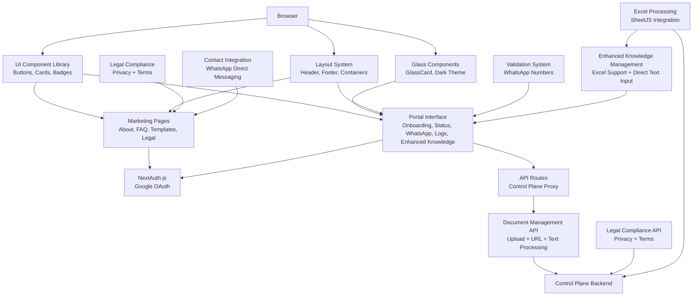
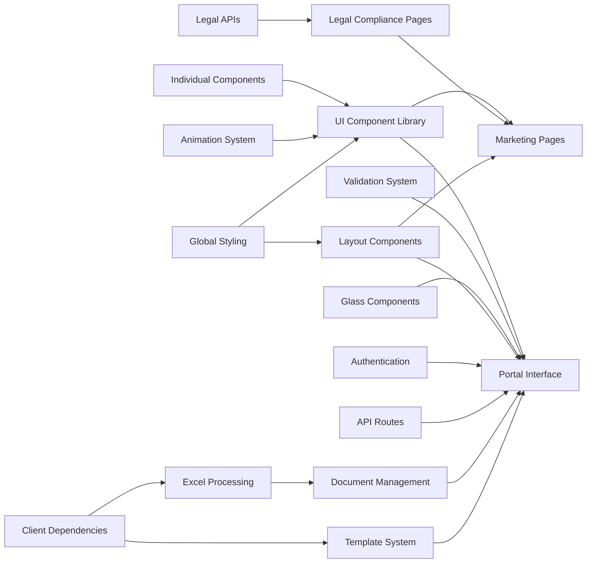

# Frontend Application

<cite>
**Referenced Files in This Document**
- [layout.tsx](file://apps/web/src/app/layout.tsx)
- [providers.tsx](file://apps/web/src/app/providers.tsx)
- [middleware.ts](file://apps/web/src/middleware.ts)
- [auth.ts](file://apps/web/src/lib/auth.ts)
- [Header.tsx](file://apps/web/src/components/layout/Header.tsx)
- [Footer.tsx](file://apps/web/src/components/layout/Footer.tsx)
- [HeroSection.tsx](file://apps/web/src/components/sections/HeroSection.tsx)
- [Button.tsx](file://apps/web/src/components/ui/Button.tsx)
- [Card.tsx](file://apps/web/src/components/ui/Card.tsx)
- [Badge.tsx](file://apps/web/src/components/ui/Badge.tsx)
- [Container.tsx](file://apps/web/src/components/ui/Container.tsx)
- [SectionHeader.tsx](file://apps/web/src/components/ui/SectionHeader.tsx)
- [Sidebar.tsx](file://apps/web/src/components/portal/Sidebar.tsx)
- [validators.ts](file://apps/web/src/lib/validators.ts)
- [marketing layout.tsx](file://apps/web/src/app/(marketing)/layout.tsx)
- [about page.tsx](file://apps/web/src/app/(marketing)/about/page.tsx)
- [faq page.tsx](file://apps/web/src/app/(marketing)/faq/page.tsx)
- [templates page.tsx](file://apps/web/src/app/(marketing)/templates/page.tsx)
- [privacy page.tsx](file://apps/web/src/app/(marketing)/privacy/page.tsx)
- [terms page.tsx](file://apps/web/src/app/(marketing)/terms/page.tsx)
- [contact page.tsx](file://apps/web/src/app/(marketing)/contact/page.tsx)
- [portal layout.tsx](file://apps/web/src/app/(portal)/layout.tsx)
- [onboarding page.tsx](file://apps/web/src/app/(portal)/app/onboarding/page.tsx)
- [status page.tsx](file://apps/web/src/app/(portal)/app/status/page.tsx)
- [whatsapp page.tsx](file://apps/web/src/app/(portal)/app/whatsapp/page.tsx)
- [logs page.tsx](file://apps/web/src/app/(portal)/app/logs/page.tsx)
- [knowledge page.tsx](file://apps/web/src/app/(portal)/app/knowledge/page.tsx)
- [signin page.tsx](file://apps/web/src/app/auth/signin/page.tsx)
- [route.ts](file://apps/web/src/app/api/auth/[...nextauth]/route.ts)
- [route.ts](file://apps/web/src/app/api/portal/me/route.ts)
- [route.ts](file://apps/web/src/app/api/portal/setup-request/route.ts)
- [route.ts](file://apps/web/src/app/api/portal/tenant/current/status/route.ts)
- [route.ts](file://apps/web/src/app/api/portal/tenant/current/qr/route.ts)
- [route.ts](file://apps/web/src/app/api/portal/documents/route.ts)
- [route.ts](file://apps/web/src/app/api/portal/documents/upload/route.ts)
- [route.ts](file://apps/web/src/app/api/portal/documents/url/route.ts)
- [route.ts](file://apps/web/src/app/api/portal/documents/text/route.ts)
- [globals.css](file://apps/web/src/app/globals.css)
- [tailwind.config.js](file://apps/web/tailwind.config.js)
- [products-template.csv](file://apps/web/public/products-template.csv)
- [package.json](file://apps/control-plane/package.json)
</cite>

## Update Summary
**Changes Made**
- Enhanced knowledge base with Excel file support (.xlsx/.xls via SheetJS)
- Added direct text input capability for knowledge management
- Implemented downloadable CSV templates for structured data entry
- Improved file type visualization with dedicated Excel icons
- Enhanced upload instructions and supported file formats documentation
- Updated API integration patterns for text-based knowledge input

## Table of Contents
1. [Introduction](#introduction)
2. [Project Structure](#project-structure)
3. [Core Components](#core-components)
4. [Architecture Overview](#architecture-overview)
5. [Detailed Component Analysis](#detailed-component-analysis)
6. [Enhanced Knowledge Base System](#enhanced-knowledge-base-system)
7. [Excel File Support and Processing](#excel-file-support-and-processing)
8. [Direct Text Input Capability](#direct-text-input-capability)
9. [Downloadable CSV Templates](#downloadable-csv-templates)
10. [Improved File Type Visualization](#improved-file-type-visualization)
11. [Enhanced Upload Instructions and User Guidance](#enhanced-upload-instructions-and-user-guidance)
12. [API Integration Patterns for Knowledge Management](#api-integration-patterns-for-knowledge-management)
13. [New Legal Compliance Pages](#new-legal-compliance-pages)
14. [Enhanced Contact Page with WhatsApp Integration](#enhanced-contact-page-with-whatsapp-integration)
15. [Redesigned Portal Knowledge Management System](#redesigned-portal-knowledge-management-system)
16. [Enhanced Dark Theme and Glass Morphism Implementation](#enhanced-dark-theme-and-glass-morphism-implementation)
17. [New Portal Navigation and User Experience](#new-portal-navigation-and-user-experience)
18. [Layout System and Navigation](#layout-system-and-navigation)
19. [Dependency Analysis](#dependency-analysis)
20. [Performance Considerations](#performance-considerations)
21. [Troubleshooting Guide](#troubleshooting-guide)
22. [Conclusion](#conclusion)
23. [Appendices](#appendices)

## Introduction
This document describes the Next.js frontend application and user interface for Flow HQ, featuring a complete UI redesign with an African Futurism theme and enhanced validation systems. The application now includes comprehensive legal compliance pages, sophisticated WhatsApp integration, advanced knowledge management system with Excel support, redesigned portal interface with modern dark theme implementation, and enhanced API integration patterns. The redesign introduces advanced validation systems, sophisticated UI components, responsive design with Tailwind CSS, and practical user flows for business owners managing multiple tenants with AI-powered business intelligence capabilities.

## Project Structure
The frontend is organized into a dual-layer architecture with marketing and portal route groups, enhanced with comprehensive legal compliance pages, knowledge management system with Excel support, and advanced validation systems:

```mermaid
graph TB
subgraph "Marketing Layer"
ML["Marketing Layout<br/>(Header + Footer)"]
MAbout["About Page<br/>Team + Values + Stats"]
MFAQ["FAQ Page<br/>Accordion + WhatsApp Integration"]
MTemplates["Templates Page<br/>Grid + Interactive Cards"]
MPrivacy["Privacy Policy<br/>Legal Compliance"]
MTerms["Terms of Service<br/>Legal Compliance"]
MContact["Contact Page<br/>WhatsApp Integration + Form"]
MH["HeroSection<br/>WhatsApp Animation + Stats"]
end
subgraph "Portal Layer"
PL["Portal Layout<br/>Sidebar + Main Content"]
POnboard["Onboarding Page<br/>Form + Validation System"]
PStatus["Status Dashboard<br/>Polling + QR Generation"]
PWhatsApp["WhatsApp Integration<br/>Live Demo"]
PLogs["Activity Logs<br/>Real-time Updates"]
PKnowledge["Enhanced Knowledge Management<br/>Excel Support + Direct Text Input"]
PSidebar["Enhanced Sidebar<br/>Navigation + User Menu"]
end
subgraph "UI Component Library"
UICore["Core Components<br/>Button, Card, Badge"]
UILayout["Layout Components<br/>Container, SectionHeader"]
UIGlass["Glass Components<br/>GlassCard, Dark Theme"]
UIGlobal["Global Styles<br/>African Futurism Theme"]
end
subgraph "Validation System"
Valid["WhatsApp Validation<br/>Real-time + Formatting"]
Countries["Country Codes<br/>African Nations"]
end
subgraph "Authentication & API"
Auth["NextAuth.js<br/>Google OAuth"]
API["API Routes<br/>Control Plane Proxy"]
DocAPI["Document Management<br/>Upload + URL + Text Processing"]
ExcelSupport["Excel Processing<br/>SheetJS Integration"]
LegalAPI["Legal Compliance<br/>Privacy + Terms"]
end
ML --> MAbout
ML --> MFAQ
ML --> MTemplates
ML --> MPrivacy
ML --> MTerms
ML --> MContact
ML --> MH
PL --> POnboard
PL --> PStatus
PL --> PWhatsApp
PL --> PLogs
PL --> PKnowledge
PL --> PSidebar
UICore --> ML
UICore --> PL
UILayout --> ML
UILayout --> PL
UIGlass --> ML
UIGlass --> PL
UIGlobal --> ML
UIGlobal --> PL
Valid --> POnboard
Countries --> Valid
Auth --> PL
API --> PL
DocAPI --> PKnowledge
ExcelSupport --> PKnowledge
LegalAPI --> MPrivacy
LegalAPI --> MTerms
```

**Diagram sources**
- [marketing layout.tsx](file://apps/web/src/app/(marketing)/layout.tsx#L1-L17)
- [Header.tsx](file://apps/web/src/components/layout/Header.tsx#L1-L132)
- [Footer.tsx](file://apps/web/src/components/layout/Footer.tsx#L1-L180)
- [HeroSection.tsx](file://apps/web/src/components/sections/HeroSection.tsx#L1-L468)
- [Button.tsx](file://apps/web/src/components/ui/Button.tsx#L1-L57)
- [Card.tsx](file://apps/web/src/components/ui/Card.tsx#L1-L71)
- [Badge.tsx](file://apps/web/src/components/ui/Badge.tsx#L1-L43)
- [Container.tsx](file://apps/web/src/components/ui/Container.tsx#L1-L28)
- [SectionHeader.tsx](file://apps/web/src/components/ui/SectionHeader.tsx#L1-L42)
- [portal layout.tsx](file://apps/web/src/app/(portal)/layout.tsx#L1-L30)
- [Sidebar.tsx](file://apps/web/src/components/portal/Sidebar.tsx#L1-L180)
- [validators.ts](file://apps/web/src/lib/validators.ts#L1-L102)
- [privacy page.tsx](file://apps/web/src/app/(marketing)/privacy/page.tsx#L1-L77)
- [terms page.tsx](file://apps/web/src/app/(marketing)/terms/page.tsx#L1-L95)
- [contact page.tsx](file://apps/web/src/app/(marketing)/contact/page.tsx#L1-L199)
- [knowledge page.tsx](file://apps/web/src/app/(portal)/app/knowledge/page.tsx#L1-L393)

**Section sources**
- [marketing layout.tsx](file://apps/web/src/app/(marketing)/layout.tsx#L1-L17)
- [portal layout.tsx](file://apps/web/src/app/(portal)/layout.tsx#L1-L30)
- [Header.tsx](file://apps/web/src/components/layout/Header.tsx#L1-L132)
- [Footer.tsx](file://apps/web/src/components/layout/Footer.tsx#L1-L180)
- [HeroSection.tsx](file://apps/web/src/components/sections/HeroSection.tsx#L1-L468)

## Core Components
The application now features a comprehensive UI component library with sophisticated styling, dark theme integration, and glass morphism effects:

- **Layout Components**: Header with responsive navigation and mobile menu, Footer with social links, contact information, and legal compliance links
- **Marketing Components**: HeroSection with WhatsApp animation, interactive statistics, animated phone mockup, and comprehensive legal compliance pages
- **Portal Components**: Enhanced sidebar navigation with user menu, knowledge management interface with Excel support, dark theme styling, and glass effects
- **UI Library**: Button component with multiple variants and sizes, Card component with glass effects and hover animations, Badge component with semantic variants
- **Glass Components**: Enhanced GlassCard component with frosted glass effect, dark theme integration, and backdrop blur
- **Container Components**: Flexible container sizing for different content layouts
- **Section Headers**: Consistent typography and alignment patterns across marketing pages
- **Validation Components**: Real-time phone number validation with error handling and formatting
- **Enhanced Knowledge Management Components**: Document upload interface with Excel support, URL source management, direct text input, and document listing with deletion capabilities

**Section sources**
- [Header.tsx](file://apps/web/src/components/layout/Header.tsx#L1-L132)
- [Footer.tsx](file://apps/web/src/components/layout/Footer.tsx#L1-L180)
- [HeroSection.tsx](file://apps/web/src/components/sections/HeroSection.tsx#L1-L468)
- [Button.tsx](file://apps/web/src/components/ui/Button.tsx#L1-L57)
- [Card.tsx](file://apps/web/src/components/ui/Card.tsx#L1-L71)
- [Badge.tsx](file://apps/web/src/components/ui/Badge.tsx#L1-L43)
- [Container.tsx](file://apps/web/src/components/ui/Container.tsx#L1-L28)
- [SectionHeader.tsx](file://apps/web/src/components/ui/SectionHeader.tsx#L1-L42)
- [Sidebar.tsx](file://apps/web/src/components/portal/Sidebar.tsx#L1-L180)
- [knowledge page.tsx](file://apps/web/src/app/(portal)/app/knowledge/page.tsx#L1-L393)

## Architecture Overview
The frontend maintains a dual-layer architecture with enhanced UI components, dark theme integration, sophisticated validation systems, comprehensive legal compliance infrastructure, and advanced knowledge management with Excel support:

```mermaid
graph TB
Client["Browser"]
UI["UI Component Library<br/>Buttons, Cards, Badges"]
Glass["Glass Components<br/>GlassCard, Dark Theme"]
Layout["Layout System<br/>Header, Footer, Containers"]
Validation["Validation System<br/>WhatsApp Numbers"]
Legal["Legal Compliance<br/>Privacy + Terms"]
Contact["Contact Integration<br/>WhatsApp Direct Messaging"]
Knowledge["Enhanced Knowledge Management<br/>Excel Support + Direct Text Input"]
Excel["Excel Processing<br/>SheetJS Integration"]
Marketing["Marketing Pages<br/>About, FAQ, Templates, Legal"]
Portal["Portal Interface<br/>Onboarding, Status, WhatsApp, Logs, Enhanced Knowledge"]
Auth["NextAuth.js<br/>Google OAuth"]
API["API Routes<br/>Control Plane Proxy"]
DocAPI["Document Management API<br/>Upload + URL + Text Processing"]
LegalAPI["Legal Compliance API<br/>Privacy + Terms"]
Client --> UI
Client --> Glass
Client --> Layout
UI --> Marketing
UI --> Portal
Glass --> Portal
Layout --> Marketing
Layout --> Portal
Validation --> Portal
Legal --> Marketing
Contact --> Marketing
Knowledge --> Portal
Excel --> Knowledge
Marketing --> Auth
Portal --> Auth
Portal --> API
API --> DocAPI
DocAPI --> ControlPlane["Control Plane Backend"]
LegalAPI --> ControlPlane
Excel --> ControlPlane
```

**Diagram sources**
- [Button.tsx](file://apps/web/src/components/ui/Button.tsx#L1-L57)
- [Card.tsx](file://apps/web/src/components/ui/Card.tsx#L1-L71)
- [Header.tsx](file://apps/web/src/components/layout/Header.tsx#L1-L132)
- [Footer.tsx](file://apps/web/src/components/layout/Footer.tsx#L1-L180)
- [validators.ts](file://apps/web/src/lib/validators.ts#L1-L102)
- [privacy page.tsx](file://apps/web/src/app/(marketing)/privacy/page.tsx#L1-L77)
- [terms page.tsx](file://apps/web/src/app/(marketing)/terms/page.tsx#L1-L95)
- [contact page.tsx](file://apps/web/src/app/(marketing)/contact/page.tsx#L1-L199)
- [knowledge page.tsx](file://apps/web/src/app/(portal)/app/knowledge/page.tsx#L1-L393)
- [portal layout.tsx](file://apps/web/src/app/(portal)/layout.tsx#L1-L30)

## Detailed Component Analysis

### Authentication and Authorization
The authentication system remains robust with Google OAuth integration and enhanced session management:

- NextAuth configuration with Google OAuth provider and automatic tenant/user provisioning
- Session enrichment with user ID, tenant ID, role, and setup request presence
- Middleware protection for portal routes with conditional redirects based on setup state
- Enhanced sign-in page with provider selection and session validation

**Section sources**
- [auth.ts](file://apps/web/src/lib/auth.ts#L1-L76)
- [route.ts](file://apps/web/src/app/api/auth/[...nextauth]/route.ts#L1-L7)
- [signin page.tsx](file://apps/web/src/app/auth/signin/page.tsx#L1-L37)
- [middleware.ts](file://apps/web/src/middleware.ts#L1-L44)

### Portal Navigation and Enhanced Sidebar
The portal interface features an improved sidebar with better navigation, dark theme integration, and glass morphism effects:

- Fixed layout on large screens with 72-unit left padding for sidebar
- Enhanced navigation items with active state highlighting and dark theme styling
- User profile display with avatar and role information using glass card components
- Improved responsive behavior and hover states with backdrop blur effects
- Dark theme integration with glass morphism and frosted effects
- New knowledge management navigation item for AI-powered business intelligence

**Section sources**
- [portal layout.tsx](file://apps/web/src/app/(portal)/layout.tsx#L1-L30)
- [Sidebar.tsx](file://apps/web/src/components/portal/Sidebar.tsx#L1-L180)

### Onboarding Flow with Enhanced Validation System
The onboarding process now features a modern form interface with sophisticated validation:

- Comprehensive business information collection form with real-time validation
- Template selection with booking, ecommerce, and support options
- WhatsApp number validation with real-time feedback and formatting
- Language preference selection with country-specific options
- Loading states and error handling during submission with enhanced error display
- Real-time phone number validation with country code detection and formatting

**Section sources**
- [onboarding page.tsx](file://apps/web/src/app/(portal)/app/onboarding/page.tsx#L1-L253)
- [validators.ts](file://apps/web/src/lib/validators.ts#L1-L102)
- [route.ts](file://apps/web/src/app/api/portal/setup-request/route.ts#L1-L40)

### Status Dashboard and Real-time Updates
The status dashboard provides comprehensive tenant monitoring with live updates:

- Real-time polling for tenant and setup status
- Animated status indicators with color-coded feedback
- QR code generation for WhatsApp connection
- Navigation assistance based on current state
- Dark theme integration with glass morphism effects

**Section sources**
- [status page.tsx](file://apps/web/src/app/(portal)/app/status/page.tsx#L1-L160)
- [route.ts](file://apps/web/src/app/api/portal/tenant/current/status/route.ts#L1-L35)
- [route.ts](file://apps/web/src/app/api/portal/tenant/current/qr/route.ts#L1-L35)

### API Integration Patterns
All portal API routes maintain consistent patterns with enhanced error handling:

- Server-side session validation with user email verification
- Control plane proxy with proper header forwarding
- Standardized JSON response formats and error propagation
- Internal key authentication for service-to-service communication

**Section sources**
- [route.ts](file://apps/web/src/app/api/portal/me/route.ts#L1-L35)
- [route.ts](file://apps/web/src/app/api/portal/setup-request/route.ts#L1-L40)
- [route.ts](file://apps/web/src/app/api/portal/tenant/current/status/route.ts#L1-L35)
- [route.ts](file://apps/web/src/app/api/portal/tenant/current/qr/route.ts#L1-L35)

## Enhanced Knowledge Base System

### Comprehensive Document Management Interface
The knowledge management system provides sophisticated AI-powered business intelligence with enhanced Excel support:

- **Enhanced Document Upload Interface**: Drag-and-drop file upload with support for PDF, DOCX, DOC, TXT, XLSX, and XLS formats
- **URL Source Integration**: Website URL addition for AI bot knowledge base expansion
- **Direct Text Input**: Knowledge notes input with optional labels for structured content
- **Real-time Processing**: Asynchronous document processing with progress indication
- **Source Organization**: Hierarchical document listing with dedicated Excel icons and metadata
- **Deletion Management**: Secure document removal with confirmation prompts
- **Success/Error Feedback**: Animated notifications for user action confirmation and error handling

### Advanced Knowledge Processing Capabilities
The system enables comprehensive business intelligence through multiple content sources with enhanced Excel processing:

- **Multi-format Support**: Extensive document format compatibility including Excel spreadsheets via SheetJS
- **URL Integration**: Web content scraping and indexing for dynamic business information
- **Direct Text Processing**: Structured knowledge input with optional labeling for categorization
- **Excel Spreadsheet Processing**: Automated parsing of XLSX/XLS files for structured business data
- **AI Enhancement**: Document processing for AI bot training and customer interaction optimization
- **Source Tracking**: Metadata management for document provenance and processing history
- **Performance Optimization**: Efficient document handling with size limits and processing queues

### User Experience and Interaction Design
The knowledge management interface prioritizes intuitive user experience with enhanced Excel support:

- **Glass Morphism Components**: Frosted glass effects with backdrop blur for modern aesthetic
- **Motion Animations**: Smooth transitions and staggered animations for enhanced user engagement
- **Visual Feedback**: Loading states, success indicators, and error messaging with appropriate visual cues
- **Responsive Design**: Adaptive layout for various screen sizes and device orientations
- **Accessibility**: Proper ARIA labels and keyboard navigation support
- **Excel-Specific Icons**: Dedicated 📊 icons for Excel files in the document listing
- **Template Integration**: Downloadable CSV templates for structured data entry

**Section sources**
- [knowledge page.tsx](file://apps/web/src/app/(portal)/app/knowledge/page.tsx#L1-L393)

## Excel File Support and Processing

### Enhanced Document Upload with Excel Support
The knowledge management system now supports comprehensive Excel file processing:

- **Supported Excel Formats**: XLSX (modern Excel) and XLS (legacy Excel) file formats
- **SheetJS Integration**: Advanced spreadsheet processing via xlsx package dependency
- **File Type Detection**: Automatic recognition of Excel files through MIME types and extensions
- **Format Validation**: Strict validation for Excel file types with comprehensive error handling
- **Upload Interface**: Enhanced drag-and-drop interface with Excel format indicators
- **Processing Pipeline**: Seamless integration with existing document processing workflows

### Excel Processing Workflow
The system implements a sophisticated Excel processing pipeline:

- **File Validation**: Format checking and MIME type verification for Excel files
- **Content Extraction**: Spreadsheet parsing with SheetJS for structured data extraction
- **Data Transformation**: Conversion of spreadsheet data to knowledge base format
- **AI Integration**: Content processing for AI bot knowledge enhancement
- **Storage Management**: Secure document storage with Excel-specific metadata
- **Indexing Operations**: Search and retrieval optimization for spreadsheet content

### User Interface Enhancements for Excel Support
The interface provides comprehensive Excel file support:

- **Excel Icons**: Dedicated 📊 icons in document listings for Excel files
- **Format Indicators**: Clear visual distinction between Excel and other document types
- **Template Integration**: Downloadable CSV templates for structured data entry
- **Upload Instructions**: Enhanced instructions specifically mentioning Excel support
- **Error Handling**: Specific error messages for Excel file processing failures

**Section sources**
- [knowledge page.tsx](file://apps/web/src/app/(portal)/app/knowledge/page.tsx#L14-L23)
- [knowledge page.tsx](file://apps/web/src/app/(portal)/app/knowledge/page.tsx#L61-L72)
- [knowledge page.tsx](file://apps/web/src/app/(portal)/app/knowledge/page.tsx#L216-L218)
- [package.json](file://apps/control-plane/package.json#L19)

## Direct Text Input Capability

### Knowledge Notes Input System
The system now supports direct text input for knowledge management:

- **Text Area Interface**: Dedicated textarea for knowledge content input
- **Optional Labeling**: Support for optional labels to categorize knowledge content
- **Structured Input**: Ability to input structured business information directly
- **Language Support**: Enhanced support for Swahili content and local business terminology
- **Validation System**: Real-time validation for text input with error handling
- **Submission Workflow**: Streamlined process for saving knowledge notes

### Text Processing and Integration
The direct text input system integrates seamlessly with the knowledge base:

- **Content Processing**: Direct integration with AI bot knowledge processing
- **Label Support**: Optional labels for categorization and organization
- **Template Integration**: Support for business-specific templates and formats
- **Multi-language Support**: Enhanced support for Swahili and other local languages
- **Content Validation**: Real-time validation and error handling for text input

### User Experience for Text Input
The text input interface provides an intuitive user experience:

- **Label Field**: Optional input field for content labeling
- **Placeholder Content**: Helpful examples and guidance for text input
- **Responsive Design**: Optimized interface for various screen sizes
- **Accessibility Features**: Proper ARIA labels and keyboard navigation support
- **Loading States**: Clear feedback during text processing and submission

**Section sources**
- [knowledge page.tsx](file://apps/web/src/app/(portal)/app/knowledge/page.tsx#L126-L147)
- [knowledge page.tsx](file://apps/web/src/app/(portal)/app/knowledge/page.tsx#L297-L317)

## Downloadable CSV Templates

### Template System Implementation
The system provides downloadable CSV templates for structured data entry:

- **Template File**: products-template.csv with comprehensive column definitions
- **Column Definitions**: Detailed column headers in both English and Swahili
- **Example Data**: Sample entries demonstrating proper template usage
- **Download Functionality**: One-click download of template files
- **Template Integration**: Seamless integration with Excel upload workflow

### Template Content and Structure
The CSV template provides comprehensive business data structure:

- **Product/Service Names**: Dual-language naming for international and local customers
- **Pricing Information**: Structured pricing fields with currency specification
- **Description Fields**: Detailed descriptions in both languages
- **Category Classification**: Hierarchical categorization system
- **Availability Status**: Boolean fields for availability tracking

### Template Usage and Integration
The template system enhances user experience:

- **Structured Entry**: Guided data entry through predefined columns
- **Multi-language Support**: Bilingual support for enhanced reach
- **Excel Compatibility**: Direct import into Excel and other spreadsheet applications
- **Template Download**: Easy access to template files via knowledge management interface
- **Usage Instructions**: Clear guidance on template usage and data entry

**Section sources**
- [products-template.csv](file://apps/web/public/products-template.csv#L1-L5)
- [knowledge page.tsx](file://apps/web/src/app/(portal)/app/knowledge/page.tsx#L205-L214)

## Improved File Type Visualization

### Enhanced Icon System
The knowledge management interface features an improved file type visualization system:

- **Excel Icons**: Dedicated 📊 icons for XLSX and XLS files
- **Standard Icons**: Consistent icons for PDF, DOCX, DOC, and TXT files
- **URL Icons**: Specialized 🌐 icons for website URLs
- **Text Icons**: Dedicated ✏️ icons for text-based knowledge entries
- **Visual Hierarchy**: Clear visual distinction between file types
- **Accessibility Support**: Proper ARIA labels for screen readers

### File Type Recognition and Display
The system implements sophisticated file type recognition:

- **Extension Matching**: File extension-based type identification
- **MIME Type Validation**: Server-side validation for file type accuracy
- **Icon Mapping**: Comprehensive mapping of file types to appropriate icons
- **Fallback Handling**: Graceful fallback for unrecognized file types
- **Dynamic Updates**: Real-time icon updates during file processing

### Visual Design Improvements
The file type visualization enhances user experience:

- **Consistent Styling**: Unified icon styling with glass morphism effects
- **Hover Effects**: Interactive hover states for better user feedback
- **Accessibility**: High contrast icons with proper color schemes
- **Responsive Design**: Icons that scale appropriately across device sizes
- **Performance Optimization**: Efficient icon rendering and caching

**Section sources**
- [knowledge page.tsx](file://apps/web/src/app/(portal)/app/knowledge/page.tsx#L14-L23)
- [knowledge page.tsx](file://apps/web/src/app/(portal)/app/knowledge/page.tsx#L354)

## Enhanced Upload Instructions and User Guidance

### Comprehensive Upload Documentation
The knowledge management interface provides enhanced user guidance:

- **Format Specifications**: Clear documentation of supported file formats
- **Size Limitations**: Explicit upload size limits and file size recommendations
- **Excel Instructions**: Specific guidance for Excel file upload and processing
- **Template Integration**: Instructions for using downloadable CSV templates
- **Best Practices**: Recommendations for optimal knowledge base content
- **Troubleshooting**: Common issues and solutions for upload problems

### User-Friendly Upload Experience
The upload interface prioritizes user experience:

- **Clear Instructions**: Step-by-step upload instructions with visual aids
- **Format Examples**: Examples of acceptable file formats and content
- **Template Integration**: Seamless integration with downloadable templates
- **Progress Feedback**: Real-time feedback during upload and processing
- **Error Handling**: Clear error messages with actionable solutions
- **Success Confirmation**: Visual confirmation of successful uploads

### Enhanced User Guidance Features
The system provides comprehensive user support:

- **Help Text**: Contextual help text for each upload option
- **Examples**: Practical examples of acceptable content and formats
- **Language Support**: Guidance in multiple languages including Swahili
- **Accessibility**: Screen reader support and keyboard navigation
- **Mobile Optimization**: Optimized experience for mobile device uploads
- **Performance Tips**: Guidance on optimizing upload performance

**Section sources**
- [knowledge page.tsx](file://apps/web/src/app/(portal)/app/knowledge/page.tsx#L216-L218)

## API Integration Patterns for Knowledge Management

### Enhanced Document Management API Architecture
The knowledge management system utilizes sophisticated API integration patterns with Excel support:

- **Upload Endpoint**: Multipart form data handling for document processing including Excel files
- **URL Processing**: RESTful endpoint for website content integration
- **Text Processing**: Dedicated endpoint for direct text input with optional labeling
- **List Management**: Comprehensive document listing with pagination and filtering
- **Deletion Operations**: Secure document removal with tenant isolation
- **Authentication**: Session-based authentication with tenant scoping
- **Excel Processing**: Specialized endpoints for Excel file handling

### Control Plane Integration
The portal communicates with the control plane through secure API endpoints with enhanced Excel support:

- **Internal Key Authentication**: Service-to-service communication with internal key validation
- **Tenant Isolation**: Multi-tenant architecture with tenant ID scoping
- **Error Propagation**: Consistent error handling and response formatting
- **Request Forwarding**: Direct request forwarding with header preservation
- **Response Processing**: JSON response parsing with error handling
- **Excel Processing**: Specialized processing for Excel file formats

### Knowledge Processing Workflow
The document management system follows a structured processing workflow with Excel support:

- **File Validation**: Format checking and size validation before processing including Excel files
- **Content Extraction**: Document parsing and metadata extraction with Excel spreadsheet processing
- **AI Integration**: Content processing for AI bot knowledge enhancement
- **Storage Management**: Secure document storage with lifecycle management
- **Indexing Operations**: Search and retrieval optimization for structured content
- **Excel-Specific Processing**: Specialized handling for spreadsheet data extraction

**Section sources**
- [route.ts](file://apps/web/src/app/api/portal/documents/route.ts#L1-L58)
- [route.ts](file://apps/web/src/app/api/portal/documents/upload/route.ts#L1-L42)
- [route.ts](file://apps/web/src/app/api/portal/documents/url/route.ts#L1-L37)
- [route.ts](file://apps/web/src/app/api/portal/documents/text/route.ts#L1-L37)

## New Legal Compliance Pages

### Privacy Policy Implementation
The application now features a comprehensive Privacy Policy page with detailed information governance:

- **Information Collection**: Explicit documentation of data collected during account creation and configuration
- **Usage Purposes**: Clear explanation of how personal information is used for service provision and improvement
- **Data Storage**: Regional compliance with EU and East Africa data residency requirements
- **Third-Party Services**: Disclosure of Google authentication and Anthropic Claude API integration
- **User Rights**: Clear procedures for account deletion and data removal requests
- **Contact Information**: Direct links to privacy inquiries and contact page integration

### Terms of Service Framework
The Terms of Service page establishes comprehensive user agreement guidelines:

- **Service Acceptance**: Clear terms for account creation and service usage
- **Business Use Responsibilities**: Guidelines for WhatsApp compliance and legal jurisdiction adherence
- **Account Security**: User responsibility for credential protection and unauthorized access reporting
- **Service Availability**: Disclaimers for uptime limitations and maintenance schedules
- **AI Content Liability**: Clarification of AI-generated content responsibility and quality assurance
- **Termination Rights**: Service provider termination rights and user cancellation procedures
- **Policy Updates**: Procedures for terms modification and continued service acceptance

**Section sources**
- [privacy page.tsx](file://apps/web/src/app/(marketing)/privacy/page.tsx#L1-L77)
- [terms page.tsx](file://apps/web/src/app/(marketing)/terms/page.tsx#L1-L95)

## Enhanced Contact Page with WhatsApp Integration

### Integrated WhatsApp Direct Messaging
The contact page features sophisticated WhatsApp integration with direct messaging capabilities:

- **Direct WhatsApp Links**: Immediate connection to +255 765 111 131 via wa.me protocol
- **Form-to-WhatsApp Integration**: Automatic message formatting with pre-filled customer information
- **Visual WhatsApp Branding**: Custom WhatsApp iconography with brand color integration
- **Multi-Channel Support**: Complementary email and physical location information
- **Swahili Localization**: Localized messaging ("Msaada?" - Help needed) for enhanced user experience
- **Background Storytelling**: African-inspired visual elements with geometric patterns and gradient overlays

### Enhanced Contact Form Functionality
The contact form provides comprehensive business inquiry management:

- **Customer Information Capture**: Name, email, and optional WhatsApp number collection
- **Pre-formatted Message Templates**: Automatic message construction for seamless WhatsApp integration
- **Real-time Validation**: Form field validation with error handling and user feedback
- **Glass Morphism Design**: Modern dark theme interface with backdrop blur effects
- **Responsive Layout**: Two-column design optimized for desktop and mobile experiences

**Section sources**
- [contact page.tsx](file://apps/web/src/app/(marketing)/contact/page.tsx#L1-L199)

## Redesigned Portal Knowledge Management System

### Comprehensive Document Management Interface
The knowledge management system provides sophisticated AI-powered business intelligence with enhanced Excel support:

- **Enhanced Document Upload Interface**: Drag-and-drop file upload with support for PDF, DOCX, DOC, TXT, XLSX, and XLS formats
- **URL Source Integration**: Website URL addition for AI bot knowledge base expansion
- **Direct Text Input**: Knowledge notes input with optional labels for structured content
- **Real-time Processing**: Asynchronous document processing with progress indication
- **Source Organization**: Hierarchical document listing with dedicated Excel icons and metadata
- **Deletion Management**: Secure document removal with confirmation prompts
- **Success/Error Feedback**: Animated notifications for user action confirmation and error handling

### Advanced Knowledge Processing Capabilities
The system enables comprehensive business intelligence through multiple content sources with enhanced Excel processing:

- **Multi-format Support**: Extensive document format compatibility including Excel spreadsheets via SheetJS
- **URL Integration**: Web content scraping and indexing for dynamic business information
- **Direct Text Processing**: Structured knowledge input with optional labeling for categorization
- **Excel Spreadsheet Processing**: Automated parsing of XLSX/XLS files for structured business data
- **AI Enhancement**: Document processing for AI bot training and customer interaction optimization
- **Source Tracking**: Metadata management for document provenance and processing history
- **Performance Optimization**: Efficient document handling with size limits and processing queues

### User Experience and Interaction Design
The knowledge management interface prioritizes intuitive user experience with enhanced Excel support:

- **Glass Morphism Components**: Frosted glass effects with backdrop blur for modern aesthetic
- **Motion Animations**: Smooth transitions and staggered animations for enhanced user engagement
- **Visual Feedback**: Loading states, success indicators, and error messaging with appropriate visual cues
- **Responsive Design**: Adaptive layout for various screen sizes and device orientations
- **Accessibility**: Proper ARIA labels and keyboard navigation support
- **Excel-Specific Icons**: Dedicated 📊 icons for Excel files in the document listing
- **Template Integration**: Downloadable CSV templates for structured data entry

**Section sources**
- [knowledge page.tsx](file://apps/web/src/app/(portal)/app/knowledge/page.tsx#L1-L393)

## Enhanced Dark Theme and Glass Morphism Implementation

### Advanced Glass Effects System
The application implements sophisticated glass morphism effects throughout the interface:

- **Backdrop Blur Technology**: Advanced -webkit-backdrop-filter implementation for smooth glass effects
- **Gradient Transitions**: Sophisticated gradient overlays with strategic positioning for depth perception
- **Border Transparency**: Subtle borders with controlled opacity for modern appearance
- **Shadow Enhancements**: Enhanced shadow systems with glow effects for dimensional depth
- **Texture Overlays**: Subtle noise textures and pattern overlays for visual interest

### Comprehensive Dark Theme Color System
The dark theme implementation features carefully curated color palettes:

- **Background Spectrum**: Deep blue-gray gradient from #0f172a to #020617 for optimal contrast
- **Text Contrast**: High-contrast text hierarchy with light gray (#f8fafc) for readability
- **Accent Colors**: Primary (emerald), secondary (purple), and accent (amber) colors adapted for dark theme
- **Glass Opacity Levels**: Strategic opacity controls for glass effects and transparency
- **Transition Effects**: Smooth color transitions with hardware acceleration for performance

### Motion and Animation Integration
Glass morphism effects seamlessly integrate with motion animations:

- **Performance Optimization**: Hardware-accelerated animations with smooth 60fps performance
- **Backdrop Compatibility**: Backdrop blur effects maintained during complex animations
- **Depth Perception**: Glass effects enhance perceived depth in animated interfaces
- **Motion Synchronization**: All animations coordinated with glass morphism effects
- **Accessibility Considerations**: Reduced motion options for user comfort

**Section sources**
- [globals.css](file://apps/web/src/app/globals.css#L44-L56)
- [globals.css](file://apps/web/src/app/globals.css#L141-L152)
- [globals.css](file://apps/web/src/app/globals.css#L311-L316)
- [globals.css](file://apps/web/src/app/globals.css#L173-L184)
- [Card.tsx](file://apps/web/src/components/ui/Card.tsx#L53-L70)
- [Sidebar.tsx](file://apps/web/src/components/portal/Sidebar.tsx#L93-L158)

## New Portal Navigation and User Experience

### Enhanced Navigation Structure
The portal interface features an expanded navigation system with knowledge management integration:

- **Dashboard Access**: Central status monitoring and system health overview
- **Onboarding Progression**: Step-by-step setup completion tracking
- **Enhanced Knowledge Base Management**: Expanded interface for AI-powered business intelligence with Excel support
- **WhatsApp Integration**: Live chat and messaging interface
- **Activity Monitoring**: Comprehensive message log and analytics dashboard
- **User Profile Management**: Enhanced user settings and session management

### Mobile-First Responsive Design
The navigation system adapts seamlessly across all device categories:

- **Mobile Menu System**: Slide-out navigation with backdrop overlay and smooth animations
- **Touch-Friendly Controls**: Optimized tap targets and gesture support
- **Adaptive Layout**: Responsive breakpoint management for tablet and desktop experiences
- **Performance Optimization**: Lightweight mobile navigation with minimal resource usage
- **Accessibility Features**: Screen reader support and keyboard navigation for mobile users

### User Experience Enhancements
The portal interface prioritizes intuitive user experience and workflow efficiency:

- **Active State Indicators**: Visual feedback for current navigation location
- **Progressive Disclosure**: Contextual information display based on user needs
- **Intuitive Workflows**: Logical step sequences for complex operations
- **Error Prevention**: Input validation and helpful error messages
- **Performance Feedback**: Loading indicators and progress visualization

**Section sources**
- [portal layout.tsx](file://apps/web/src/app/(portal)/layout.tsx#L1-L30)
- [Sidebar.tsx](file://apps/web/src/components/portal/Sidebar.tsx#L1-L180)

## Layout System and Navigation

### Header Component
Modern navigation bar with responsive design and dark theme integration:

- **Desktop Navigation**: Hidden on mobile with hamburger menu
- **Mobile Menu**: Animated slide-down with backdrop blur
- **Brand Identity**: Gradient logo with African-inspired styling
- **Call-to-Action**: Prominent buttons for conversion
- **Dark Theme**: Fully adapted for dark theme compatibility

### Footer Component
Comprehensive footer with multiple sections and glass effects:

- **Multi-column Layout**: Product, company, legal, and social sections
- **Social Integration**: WhatsApp direct chat and social media links
- **Contact Information**: Prominent phone number with WhatsApp integration
- **Local Identity**: Tanzanian pride with country-specific messaging
- **Glass Effects**: Subtle glass effects for modern appearance
- **Legal Compliance**: Direct links to Privacy Policy and Terms of Service

### Marketing Layout
Consistent layout framework for marketing pages with dark theme:

- **Fixed Header**: Persistent navigation with glass effect
- **Full-width Content**: Unrestricted content width for marketing materials
- **Footer Integration**: Full-width footer spanning entire viewport
- **Responsive Breakpoints**: Optimized for all device sizes
- **Dark Theme**: Consistent dark theme throughout marketing pages

**Section sources**
- [Header.tsx](file://apps/web/src/components/layout/Header.tsx#L1-L132)
- [Footer.tsx](file://apps/web/src/components/layout/Footer.tsx#L1-L180)
- [marketing layout.tsx](file://apps/web/src/app/(marketing)/layout.tsx#L1-L17)

## Dependency Analysis
The enhanced component library creates a cohesive dependency structure with validation systems, legal compliance infrastructure, and Excel processing capabilities:

```mermaid
graph LR
UI["UI Component Library"] --> Marketing["Marketing Pages"]
UI --> Portal["Portal Interface"]
Legal["Legal Compliance Pages"] --> Marketing
Validation["Validation System"] --> Portal
Glass["Glass Components"] --> Portal
Layout["Layout Components"] --> Marketing
Layout --> Portal
Components["Individual Components"] --> UI
Animations["Animation System"] --> UI
Styling["Global Styling"] --> UI
Styling --> Layout
Auth["Authentication"] --> Portal
API["API Routes"] --> Portal
DocAPI["Document Management"] --> Portal
ExcelSupport["Excel Processing"] --> DocAPI
LegalAPI["Legal APIs"] --> Legal
TemplateSystem["Template System"] --> Portal
Client["Client Dependencies"] --> ExcelSupport
Client --> TemplateSystem
```

**Diagram sources**
- [Button.tsx](file://apps/web/src/components/ui/Button.tsx#L1-L57)
- [Card.tsx](file://apps/web/src/components/ui/Card.tsx#L1-L71)
- [Header.tsx](file://apps/web/src/components/layout/Header.tsx#L1-L132)
- [Footer.tsx](file://apps/web/src/components/layout/Footer.tsx#L1-L180)
- [validators.ts](file://apps/web/src/lib/validators.ts#L1-L102)
- [privacy page.tsx](file://apps/web/src/app/(marketing)/privacy/page.tsx#L1-L77)
- [terms page.tsx](file://apps/web/src/app/(marketing)/terms/page.tsx#L1-L95)
- [about page.tsx](file://apps/web/src/app/(marketing)/about/page.tsx#L1-L472)
- [knowledge page.tsx](file://apps/web/src/app/(portal)/app/knowledge/page.tsx#L1-L393)

## Performance Considerations
The redesigned application maintains optimal performance through:

- **Component Reusability**: Shared UI components reduce bundle size
- **Lazy Loading**: Marketing page components load on demand
- **Animation Optimization**: Hardware-accelerated transforms for smooth performance
- **Image Optimization**: Proper sizing and lazy loading for marketing assets
- **State Management**: Efficient component state with minimal re-renders
- **Glass Performance**: Optimized backdrop blur effects for smooth animations
- **Validation Efficiency**: Lightweight validation system with minimal overhead
- **API Optimization**: Efficient document upload and processing workflows
- **Excel Processing**: Optimized SheetJS integration for spreadsheet handling
- **Template System**: Efficient template download and caching mechanisms
- **Legal Compliance**: Optimized legal page rendering and caching strategies

## Troubleshooting Guide
Common issues and resolutions for the enhanced UI, validation systems, legal compliance infrastructure, and Excel processing capabilities:

- **Animation Performance**: Disable animations on low-power devices via prefers-reduced-motion
- **Mobile Navigation**: Ensure hamburger menu works correctly across all screen sizes
- **Color Contrast**: Verify sufficient contrast ratios for accessibility compliance
- **Component Styling**: Check Tailwind CSS configuration for custom properties
- **Layout Issues**: Validate responsive breakpoints and container constraints
- **Validation Errors**: Ensure proper error handling and user feedback
- **Glass Effects**: Verify browser compatibility for backdrop blur and glass morphism
- **Dark Theme**: Check color contrast and accessibility compliance
- **Legal Compliance**: Verify proper rendering of Privacy Policy and Terms of Service
- **WhatsApp Integration**: Test direct messaging functionality and form integration
- **Knowledge Management**: Validate document upload, processing, and deletion workflows
- **Excel Processing**: Test SheetJS integration and spreadsheet parsing functionality
- **Template Downloads**: Verify CSV template download functionality and file integrity
- **Text Input**: Test direct text input validation and processing workflows
- **API Connectivity**: Monitor control plane API communication and error handling

**Section sources**
- [globals.css](file://apps/web/src/app/globals.css#L1-L348)
- [Button.tsx](file://apps/web/src/components/ui/Button.tsx#L1-L57)
- [Card.tsx](file://apps/web/src/components/ui/Card.tsx#L1-L71)
- [validators.ts](file://apps/web/src/lib/validators.ts#L1-L102)
- [privacy page.tsx](file://apps/web/src/app/(marketing)/privacy/page.tsx#L1-L77)
- [terms page.tsx](file://apps/web/src/app/(marketing)/terms/page.tsx#L1-L95)
- [contact page.tsx](file://apps/web/src/app/(marketing)/contact/page.tsx#L1-L199)
- [knowledge page.tsx](file://apps/web/src/app/(portal)/app/knowledge/page.tsx#L1-L393)

## Conclusion
The enhanced Flow HQ frontend represents a significant evolution in user experience design, combining African Futurism aesthetics with modern web development practices and comprehensive legal compliance infrastructure. The addition of Privacy Policy and Terms of Service pages, sophisticated WhatsApp integration, advanced knowledge management system with Excel support, redesigned portal interface with modern dark theme implementation, and enhanced API integration patterns creates a premium user experience that effectively serves both marketing and portal use cases. The integration of advanced Tailwind CSS configurations, Framer Motion animations, sophisticated validation systems, comprehensive legal compliance, Excel processing capabilities, and downloadable template system demonstrates the application's commitment to modern design principles while maintaining excellent performance, accessibility standards, and regulatory adherence.

## Appendices

### Environment Variables
- CONTROL_PLANE_URL: Base URL for control plane backend services
- PORTAL_INTERNAL_KEY: Service-to-service authentication key

### Color System Reference
- Primary: Emerald green gradient (10b981 to ecfdf5)
- Secondary: Purple gradient (8b5cf6 to f5f3ff)  
- Accent: Amber yellow gradient (f59e0b to ffef9e)
- Dark Theme: Blue-gray spectrum (0f172a to f8fafc)

### Animation Properties
- Transition Duration: 300ms for most interactive elements
- Easing Functions: Ease-in-out for smooth motion
- Motion Variants: Staggered animations for list items
- Performance: Hardware acceleration for transform properties
- Glass Effects: Optimized backdrop blur for smooth animations

### Validation System Reference
- Supported Countries: 9 African nations with specific formats
- Validation Types: Real-time, format, and country code validation
- Error Handling: Comprehensive error messages and user guidance
- Formatting: Automatic number formatting for database storage

### Legal Compliance Reference
- Privacy Policy: Comprehensive data governance and protection
- Terms of Service: User agreement and service usage guidelines
- Legal Links: Direct navigation to compliance documentation
- Regulatory Adherence: GDPR and regional data protection compliance

### Knowledge Management Reference
- Supported Formats: PDF, DOCX, DOC, TXT, XLSX, XLS document processing
- URL Integration: Website content indexing and processing
- Text Input: Direct knowledge entry with optional labeling
- Excel Processing: SheetJS integration for spreadsheet handling
- Template System: Downloadable CSV templates for structured data entry
- Processing Limits: File size restrictions and processing queues
- AI Enhancement: Document processing for AI bot training
- Tenant Isolation: Multi-tenant document management architecture

### Excel Processing Reference
- SheetJS Integration: xlsx package for spreadsheet processing
- Supported Formats: XLSX (modern) and XLS (legacy) Excel files
- File Validation: MIME type and extension-based validation
- Content Extraction: Automated spreadsheet data parsing
- Processing Pipeline: Seamless integration with knowledge base workflows
- Error Handling: Specific error messages for Excel processing failures

### Template System Reference
- Template File: products-template.csv with bilingual column headers
- Column Definitions: Comprehensive business data structure
- Example Data: Demonstrative entries for proper usage
- Download Functionality: One-click template access
- Integration Points: Seamless connection with upload workflows

**Section sources**
- [route.ts](file://apps/web/src/app/api/portal/me/route.ts#L1-L35)
- [route.ts](file://apps/web/src/app/api/portal/setup-request/route.ts#L1-L40)
- [globals.css](file://apps/web/src/app/globals.css#L7-L56)
- [Button.tsx](file://apps/web/src/components/ui/Button.tsx#L24-L39)
- [validators.ts](file://apps/web/src/lib/validators.ts#L12-L22)
- [privacy page.tsx](file://apps/web/src/app/(marketing)/privacy/page.tsx#L3-L5)
- [terms page.tsx](file://apps/web/src/app/(marketing)/terms/page.tsx#L3-L5)
- [knowledge page.tsx](file://apps/web/src/app/(portal)/app/knowledge/page.tsx#L14-L20)
- [products-template.csv](file://apps/web/public/products-template.csv#L1-L5)
- [package.json](file://apps/control-plane/package.json#L19)