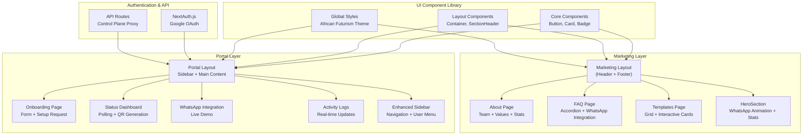
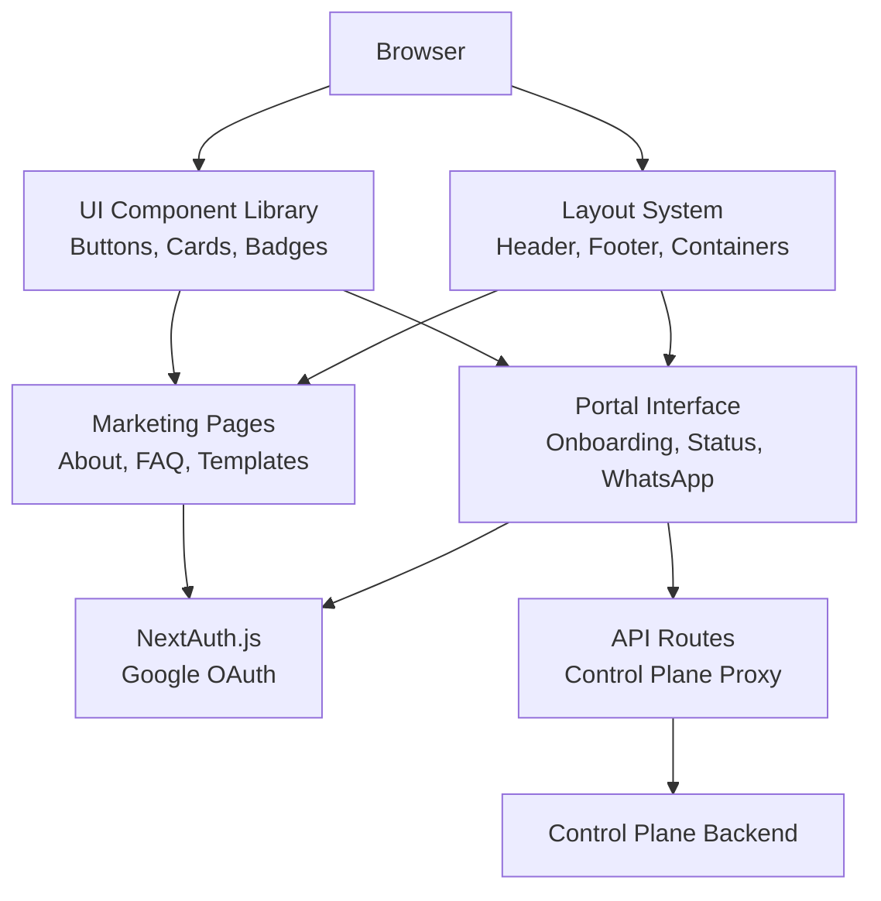
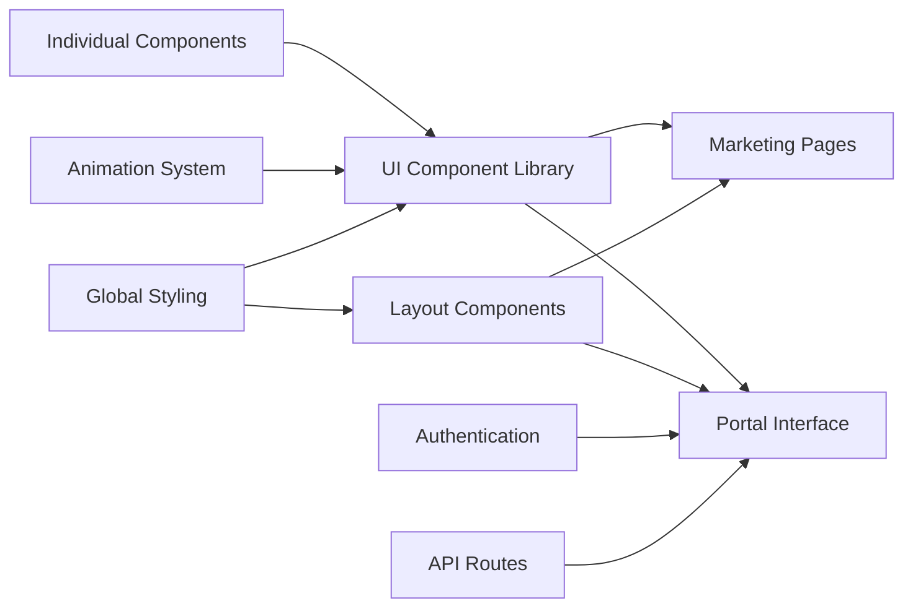

# Frontend Application

<cite>
**Referenced Files in This Document**
- [layout.tsx](file://apps/web/src/app/layout.tsx)
- [providers.tsx](file://apps/web/src/app/providers.tsx)
- [middleware.ts](file://apps/web/src/middleware.ts)
- [auth.ts](file://apps/web/src/lib/auth.ts)
- [Header.tsx](file://apps/web/src/components/layout/Header.tsx)
- [Footer.tsx](file://apps/web/src/components/layout/Footer.tsx)
- [HeroSection.tsx](file://apps/web/src/components/sections/HeroSection.tsx)
- [Button.tsx](file://apps/web/src/components/ui/Button.tsx)
- [Card.tsx](file://apps/web/src/components/ui/Card.tsx)
- [Badge.tsx](file://apps/web/src/components/ui/Badge.tsx)
- [Container.tsx](file://apps/web/src/components/ui/Container.tsx)
- [SectionHeader.tsx](file://apps/web/src/components/ui/SectionHeader.tsx)
- [Sidebar.tsx](file://apps/web/src/components/portal/Sidebar.tsx)
- [marketing layout.tsx](file://apps/web/src/app/(marketing)/layout.tsx)
- [about page.tsx](file://apps/web/src/app/(marketing)/about/page.tsx)
- [faq page.tsx](file://apps/web/src/app/(marketing)/faq/page.tsx)
- [templates page.tsx](file://apps/web/src/app/(marketing)/templates/page.tsx)
- [portal layout.tsx](file://apps/web/src/app/(portal)/layout.tsx)
- [onboarding page.tsx](file://apps/web/src/app/(portal)/app/onboarding/page.tsx)
- [status page.tsx](file://apps/web/src/app/(portal)/app/status/page.tsx)
- [whatsapp page.tsx](file://apps/web/src/app/(portal)/app/whatsapp/page.tsx)
- [logs page.tsx](file://apps/web/src/app/(portal)/app/logs/page.tsx)
- [signin page.tsx](file://apps/web/src/app/auth/signin/page.tsx)
- [route.ts](file://apps/web/src/app/api/auth/[...nextauth]/route.ts)
- [route.ts](file://apps/web/src/app/api/portal/me/route.ts)
- [route.ts](file://apps/web/src/app/api/portal/setup-request/route.ts)
- [route.ts](file://apps/web/src/app/api/portal/tenant/current/status/route.ts)
- [route.ts](file://apps/web/src/app/api/portal/tenant/current/qr/route.ts)
- [globals.css](file://apps/web/src/app/globals.css)
</cite>

## Update Summary
**Changes Made**
- Added comprehensive documentation for the new African Futurism UI redesign
- Documented new marketing pages (About, FAQ, Templates) with detailed component analysis
- Added HeroSection component with WhatsApp integration and animated features
- Documented complete UI component library (Button, Card, Badge, Container, SectionHeader)
- Added new layout components (Header, Footer) with responsive design patterns
- Enhanced global styling documentation with Tailwind CSS configuration and African Futurism themes
- Updated project structure to reflect new marketing route groups and components

## Table of Contents
1. [Introduction](#introduction)
2. [Project Structure](#project-structure)
3. [Core Components](#core-components)
4. [Architecture Overview](#architecture-overview)
5. [Detailed Component Analysis](#detailed-component-analysis)
6. [UI Redesign and African Futurism Theme](#ui-redesign-and-african-futurism-theme)
7. [New Marketing Pages](#new-marketing-pages)
8. [Enhanced UI Component Library](#enhanced-ui-component-library)
9. [Layout System and Navigation](#layout-system-and-navigation)
10. [Dependency Analysis](#dependency-analysis)
11. [Performance Considerations](#performance-considerations)
12. [Troubleshooting Guide](#troubleshooting-guide)
13. [Conclusion](#conclusion)
14. [Appendices](#appendices)

## Introduction
This document describes the Next.js frontend application and user interface for Flow HQ, featuring a complete UI redesign with an African Futurism theme. The application now includes marketing pages with modern animations, a comprehensive portal interface with enhanced authentication, tenant dashboard functionality, and API integration patterns. The redesign introduces sophisticated UI components, responsive design with Tailwind CSS, and practical user flows for business owners managing multiple tenants.

## Project Structure
The frontend is organized into a dual-layer architecture with marketing and portal route groups, enhanced with a comprehensive UI component library:

```mermaid
graph TB
subgraph "Marketing Layer"
ML["Marketing Layout<br/>(Header + Footer)"]
MAbout["About Page<br/>Team + Values + Stats"]
MFAQ["FAQ Page<br/>Accordion + WhatsApp Integration"]
MTemplates["Templates Page<br/>Grid + Interactive Cards"]
MH["HeroSection<br/>WhatsApp Animation + Stats"]
end
subgraph "Portal Layer"
PL["Portal Layout<br/>Sidebar + Main Content"]
POnboard["Onboarding Page<br/>Form + Setup Request"]
PStatus["Status Dashboard<br/>Polling + QR Generation"]
PWhatsApp["WhatsApp Integration<br/>Live Demo"]
PLogs["Activity Logs<br/>Real-time Updates"]
PSidebar["Enhanced Sidebar<br/>Navigation + User Menu"]
end
subgraph "UI Component Library"
UICore["Core Components<br/>Button, Card, Badge"]
UILayout["Layout Components<br/>Container, SectionHeader"]
UIGlobal["Global Styles<br/>African Futurism Theme"]
end
subgraph "Authentication & API"
Auth["NextAuth.js<br/>Google OAuth"]
API["API Routes<br/>Control Plane Proxy"]
end
ML --> MAbout
ML --> MFAQ
ML --> MTemplates
ML --> MH
PL --> POnboard
PL --> PStatus
PL --> PWhatsApp
PL --> PLogs
PL --> PSidebar
UICore --> ML
UICore --> PL
UILayout --> ML
UILayout --> PL
UIGlobal --> ML
UIGlobal --> PL
Auth --> PL
API --> PL
```

**Diagram sources**
- [marketing layout.tsx](file://apps/web/src/app/(marketing)/layout.tsx#L1-L17)
- [Header.tsx](file://apps/web/src/components/layout/Header.tsx#L1-L132)
- [Footer.tsx](file://apps/web/src/components/layout/Footer.tsx#L1-L171)
- [HeroSection.tsx](file://apps/web/src/components/sections/HeroSection.tsx#L1-L468)
- [Button.tsx](file://apps/web/src/components/ui/Button.tsx#L1-L57)
- [Card.tsx](file://apps/web/src/components/ui/Card.tsx#L1-L71)
- [Badge.tsx](file://apps/web/src/components/ui/Badge.tsx#L1-L43)
- [Container.tsx](file://apps/web/src/components/ui/Container.tsx#L1-L28)
- [SectionHeader.tsx](file://apps/web/src/components/ui/SectionHeader.tsx#L1-L42)
- [portal layout.tsx](file://apps/web/src/app/(portal)/layout.tsx#L1-L30)
- [Sidebar.tsx](file://apps/web/src/components/portal/Sidebar.tsx#L1-L69)

**Section sources**
- [marketing layout.tsx](file://apps/web/src/app/(marketing)/layout.tsx#L1-L17)
- [portal layout.tsx](file://apps/web/src/app/(portal)/layout.tsx#L1-L30)
- [Header.tsx](file://apps/web/src/components/layout/Header.tsx#L1-L132)
- [Footer.tsx](file://apps/web/src/components/layout/Footer.tsx#L1-L171)
- [HeroSection.tsx](file://apps/web/src/components/sections/HeroSection.tsx#L1-L468)

## Core Components
The application now features a comprehensive UI component library with sophisticated styling and animations:

- **Layout Components**: Header with responsive navigation and mobile menu, Footer with social links and contact information
- **Marketing Components**: HeroSection with WhatsApp animation, interactive statistics, and animated phone mockup
- **UI Library**: Button component with multiple variants and sizes, Card component with glass effects and hover animations, Badge component with semantic variants
- **Container Components**: Flexible container sizing for different content layouts
- **Section Headers**: Consistent typography and alignment patterns across marketing pages
- **Portal Components**: Enhanced sidebar navigation with user menu and active state management

**Section sources**
- [Header.tsx](file://apps/web/src/components/layout/Header.tsx#L1-L132)
- [Footer.tsx](file://apps/web/src/components/layout/Footer.tsx#L1-L171)
- [HeroSection.tsx](file://apps/web/src/components/sections/HeroSection.tsx#L1-L468)
- [Button.tsx](file://apps/web/src/components/ui/Button.tsx#L1-L57)
- [Card.tsx](file://apps/web/src/components/ui/Card.tsx#L1-L71)
- [Badge.tsx](file://apps/web/src/components/ui/Badge.tsx#L1-L43)
- [Container.tsx](file://apps/web/src/components/ui/Container.tsx#L1-L28)
- [SectionHeader.tsx](file://apps/web/src/components/ui/SectionHeader.tsx#L1-L42)

## Architecture Overview
The frontend maintains a dual-layer architecture with enhanced UI components and responsive design patterns:

```mermaid
graph TB
Client["Browser"]
UI["UI Component Library<br/>Buttons, Cards, Badges"]
Layout["Layout System<br/>Header, Footer, Containers"]
Marketing["Marketing Pages<br/>About, FAQ, Templates"]
Portal["Portal Interface<br/>Onboarding, Status, WhatsApp"]
Auth["NextAuth.js<br/>Google OAuth"]
API["API Routes<br/>Control Plane Proxy"]
Client --> UI
Client --> Layout
UI --> Marketing
UI --> Portal
Layout --> Marketing
Layout --> Portal
Marketing --> Auth
Portal --> Auth
Portal --> API
API --> ControlPlane["Control Plane Backend"]
```

**Diagram sources**
- [Button.tsx](file://apps/web/src/components/ui/Button.tsx#L1-L57)
- [Header.tsx](file://apps/web/src/components/layout/Header.tsx#L1-L132)
- [Footer.tsx](file://apps/web/src/components/layout/Footer.tsx#L1-L171)
- [about page.tsx](file://apps/web/src/app/(marketing)/about/page.tsx#L1-L472)
- [faq page.tsx](file://apps/web/src/app/(marketing)/faq/page.tsx#L1-L153)
- [templates page.tsx](file://apps/web/src/app/(marketing)/templates/page.tsx#L1-L252)
- [portal layout.tsx](file://apps/web/src/app/(portal)/layout.tsx#L1-L30)

## Detailed Component Analysis

### Authentication and Authorization
The authentication system remains robust with Google OAuth integration and enhanced session management:

- NextAuth configuration with Google OAuth provider and automatic tenant/user provisioning
- Session enrichment with user ID, tenant ID, role, and setup request presence
- Middleware protection for portal routes with conditional redirects based on setup state
- Enhanced sign-in page with provider selection and session validation

**Section sources**
- [auth.ts](file://apps/web/src/lib/auth.ts#L1-L76)
- [route.ts](file://apps/web/src/app/api/auth/[...nextauth]/route.ts#L1-L7)
- [signin page.tsx](file://apps/web/src/app/auth/signin/page.tsx#L1-L37)
- [middleware.ts](file://apps/web/src/middleware.ts#L1-L44)

### Portal Navigation and Enhanced Sidebar
The portal interface features an improved sidebar with better navigation and user experience:

- Fixed layout on large screens with 72-unit left padding for sidebar
- Enhanced navigation items with active state highlighting
- User profile display with avatar and role information
- Improved responsive behavior and hover states

**Section sources**
- [portal layout.tsx](file://apps/web/src/app/(portal)/layout.tsx#L1-L30)
- [Sidebar.tsx](file://apps/web/src/components/portal/Sidebar.tsx#L1-L69)

### Onboarding Flow with Enhanced UI
The onboarding process now features a modern form interface with validation:

- Comprehensive business information collection form
- Template selection with booking, ecommerce, and support options
- WhatsApp number validation and language preference
- Loading states and error handling during submission

**Section sources**
- [onboarding page.tsx](file://apps/web/src/app/(portal)/app/onboarding/page.tsx#L1-L115)
- [route.ts](file://apps/web/src/app/api/portal/setup-request/route.ts#L1-L40)

### Status Dashboard and Real-time Updates
The status dashboard provides comprehensive tenant monitoring with live updates:

- Real-time polling for tenant and setup status
- Animated status indicators with color-coded feedback
- QR code generation for WhatsApp connection
- Navigation assistance based on current state

**Section sources**
- [status page.tsx](file://apps/web/src/app/(portal)/app/status/page.tsx#L1-L160)
- [route.ts](file://apps/web/src/app/api/portal/tenant/current/status/route.ts#L1-L35)
- [route.ts](file://apps/web/src/app/api/portal/tenant/current/qr/route.ts#L1-L35)

### API Integration Patterns
All portal API routes maintain consistent patterns with enhanced error handling:

- Server-side session validation with user email verification
- Control plane proxy with proper header forwarding
- Standardized JSON response formats and error propagation
- Internal key authentication for service-to-service communication

**Section sources**
- [route.ts](file://apps/web/src/app/api/portal/me/route.ts#L1-L35)
- [route.ts](file://apps/web/src/app/api/portal/setup-request/route.ts#L1-L40)
- [route.ts](file://apps/web/src/app/api/portal/tenant/current/status/route.ts#L1-L35)
- [route.ts](file://apps/web/src/app/api/portal/tenant/current/qr/route.ts#L1-L35)

## UI Redesign and African Futurism Theme

### Color Palette and Design System
The application implements a sophisticated African Futurism color scheme with carefully selected primary, secondary, and accent colors:

- **Primary Colors**: Emerald green spectrum (#064e3b to #ecfdf5) representing growth and sustainability
- **Secondary Colors**: Purple gradient (#4c1d95 to #f5f3ff) symbolizing innovation and creativity
- **Accent Colors**: Amber yellow (#78350f to #fffbeb) evoking warmth and energy
- **Dark Theme**: Deep blue-gray (#0f172a to #f8fafc) providing excellent contrast for dark mode

### Typography and Visual Elements
The design system emphasizes modern typography and geometric patterns:

- **Headings**: Space Grotesk font for futuristic aesthetic
- **Body Text**: Inter font for excellent readability
- **Patterns**: Custom circuit board, dot grid, and Kigengé textile patterns
- **Effects**: Glass morphism, gradient overlays, and subtle glow effects

### Motion and Animation Framework
Sophisticated animation system enhances user experience:

- **Framer Motion**: Smooth entrance animations and hover effects
- **Typing Indicators**: Animated dots with staggered timing
- **Floating Elements**: Continuous motion with easing functions
- **Interactive Feedback**: Scale transforms and shadow enhancements

**Section sources**
- [globals.css](file://apps/web/src/app/globals.css#L7-L56)
- [globals.css](file://apps/web/src/app/globals.css#L154-L184)
- [HeroSection.tsx](file://apps/web/src/components/sections/HeroSection.tsx#L203-L218)

## New Marketing Pages

### About Page - Team and Values Showcase
The About page presents the company story with rich visual storytelling:

- **Hero Section**: Full-screen background with geometric overlay patterns
- **Team Profiles**: Interactive cards with hover effects and social links
- **Values Display**: Animated feature cards with custom vector icons
- **Statistics Section**: Animated counters with African-inspired backgrounds
- **Mission/Vision**: Dual-card layout with decorative patterns

### FAQ Page - Interactive Knowledge Base
The FAQ page features an accordion system with modern styling:

- **Animated Accordion**: Smooth expand/collapse with rotation indicators
- **WhatsApp Integration**: Direct chat button with social media branding
- **Gradient Styling**: Secondary color accents for visual hierarchy
- **Responsive Design**: Mobile-first approach with touch-friendly interactions

### Templates Page - Interactive Showcase
The Templates page displays business solutions with engaging presentations:

- **Template Grid**: Responsive card layout with hover animations
- **Feature Tags**: Interactive badges with color coding
- **Popular Templates**: Highlighted sections with special badges
- **Custom Solutions**: Call-to-action for bespoke implementations

**Section sources**
- [about page.tsx](file://apps/web/src/app/(marketing)/about/page.tsx#L1-L472)
- [faq page.tsx](file://apps/web/src/app/(marketing)/faq/page.tsx#L1-L153)
- [templates page.tsx](file://apps/web/src/app/(marketing)/templates/page.tsx#L1-L252)

## Enhanced UI Component Library

### Button Component System
Comprehensive button system with multiple variants and states:

- **Variants**: Primary (gradient emerald), Secondary (gradient purple), Outline (transparent), Ghost (minimal)
- **Sizes**: Small (sm), Medium (md), Large (lg) with proportional scaling
- **States**: Loading indicators, hover effects, disabled states
- **Accessibility**: Proper focus states and keyboard navigation

### Card Component Architecture
Flexible card system supporting various content types:

- **Glass Cards**: Frosted glass effect with backdrop blur
- **Gradient Cards**: Subtle directional gradients for depth
- **Interactive States**: Hover scaling, border transitions, shadow enhancements
- **Motion Integration**: Framer Motion compatibility for smooth animations

### Badge Component System
Semantic badge system for status and categorization:

- **Color Variants**: Primary, Secondary, Accent, Success, Warning, Error
- **Size Options**: Small and medium variants
- **Border Styling**: Subtle borders with background fills
- **Consistent Spacing**: Proper padding and rounded corners

### Layout and Container Components
Structured layout system for consistent page design:

- **Container Component**: Flexible width constraints with responsive breakpoints
- **Section Header**: Consistent typography hierarchy with optional badges
- **Responsive Grids**: Mobile-first grid system with appropriate gutters

**Section sources**
- [Button.tsx](file://apps/web/src/components/ui/Button.tsx#L1-L57)
- [Card.tsx](file://apps/web/src/components/ui/Card.tsx#L1-L71)
- [Badge.tsx](file://apps/web/src/components/ui/Badge.tsx#L1-L43)
- [Container.tsx](file://apps/web/src/components/ui/Container.tsx#L1-L28)
- [SectionHeader.tsx](file://apps/web/src/components/ui/SectionHeader.tsx#L1-L42)

## Layout System and Navigation

### Header Component
Modern navigation bar with responsive design:

- **Desktop Navigation**: Hidden on mobile with hamburger menu
- **Mobile Menu**: Animated slide-down with backdrop blur
- **Brand Identity**: Gradient logo with African-inspired styling
- **Call-to-Action**: Prominent buttons for conversion

### Footer Component
Comprehensive footer with multiple sections:

- **Multi-column Layout**: Product, company, legal, and social sections
- **Social Integration**: WhatsApp direct chat and social media links
- **Contact Information**: Prominent phone number with WhatsApp integration
- **Local Identity**: Tanzanian pride with country-specific messaging

### Marketing Layout
Consistent layout framework for marketing pages:

- **Fixed Header**: Persistent navigation with glass effect
- **Full-width Content**: Unrestricted content width for marketing materials
- **Footer Integration**: Full-width footer spanning entire viewport
- **Responsive Breakpoints**: Optimized for all device sizes

**Section sources**
- [Header.tsx](file://apps/web/src/components/layout/Header.tsx#L1-L132)
- [Footer.tsx](file://apps/web/src/components/layout/Footer.tsx#L1-L171)
- [marketing layout.tsx](file://apps/web/src/app/(marketing)/layout.tsx#L1-L17)

## Dependency Analysis
The enhanced component library creates a cohesive dependency structure:

```mermaid
graph LR
UI["UI Component Library"] --> Marketing["Marketing Pages"]
UI --> Portal["Portal Interface"]
Layout["Layout Components"] --> Marketing
Layout --> Portal
Components["Individual Components"] --> UI
Animations["Animation System"] --> UI
Styling["Global Styling"] --> UI
Styling --> Layout
Auth["Authentication"] --> Portal
API["API Routes"] --> Portal
```

**Diagram sources**
- [Button.tsx](file://apps/web/src/components/ui/Button.tsx#L1-L57)
- [Card.tsx](file://apps/web/src/components/ui/Card.tsx#L1-L71)
- [Header.tsx](file://apps/web/src/components/layout/Header.tsx#L1-L132)
- [Footer.tsx](file://apps/web/src/components/layout/Footer.tsx#L1-L171)
- [about page.tsx](file://apps/web/src/app/(marketing)/about/page.tsx#L1-L472)

## Performance Considerations
The redesigned application maintains optimal performance through:

- **Component Reusability**: Shared UI components reduce bundle size
- **Lazy Loading**: Marketing page components load on demand
- **Animation Optimization**: Hardware-accelerated transforms for smooth performance
- **Image Optimization**: Proper sizing and lazy loading for marketing assets
- **State Management**: Efficient component state with minimal re-renders

## Troubleshooting Guide
Common issues and resolutions for the enhanced UI:

- **Animation Performance**: Disable animations on low-power devices via prefers-reduced-motion
- **Mobile Navigation**: Ensure hamburger menu works correctly across all screen sizes
- **Color Contrast**: Verify sufficient contrast ratios for accessibility compliance
- **Component Styling**: Check Tailwind CSS configuration for custom properties
- **Layout Issues**: Validate responsive breakpoints and container constraints

**Section sources**
- [globals.css](file://apps/web/src/app/globals.css#L1-L348)
- [Button.tsx](file://apps/web/src/components/ui/Button.tsx#L1-L57)
- [Card.tsx](file://apps/web/src/components/ui/Card.tsx#L1-L71)

## Conclusion
The enhanced Flow HQ frontend represents a significant evolution in user experience design, combining African Futurism aesthetics with modern web development practices. The comprehensive UI component library, sophisticated animation system, and responsive layout architecture create a premium user experience that effectively serves both marketing and portal use cases. The integration of advanced Tailwind CSS configurations and Framer Motion animations demonstrates the application's commitment to modern design principles while maintaining excellent performance and accessibility standards.

## Appendices

### Environment Variables
- CONTROL_PLANE_URL: Base URL for control plane backend services
- PORTAL_INTERNAL_KEY: Service-to-service authentication key

### Color System Reference
- Primary: Emerald green gradient (10b981 to ecfdf5)
- Secondary: Purple gradient (8b5cf6 to f5f3ff)  
- Accent: Amber yellow gradient (f59e0b to ffef9e)
- Dark Theme: Blue-gray spectrum (0f172a to f8fafc)

### Animation Properties
- Transition Duration: 300ms for most interactive elements
- Easing Functions: Ease-in-out for smooth motion
- Motion Variants: Staggered animations for list items
- Performance: Hardware acceleration for transform properties

**Section sources**
- [route.ts](file://apps/web/src/app/api/portal/me/route.ts#L1-L35)
- [route.ts](file://apps/web/src/app/api/portal/setup-request/route.ts#L1-L40)
- [globals.css](file://apps/web/src/app/globals.css#L7-L56)
- [Button.tsx](file://apps/web/src/components/ui/Button.tsx#L24-L39)