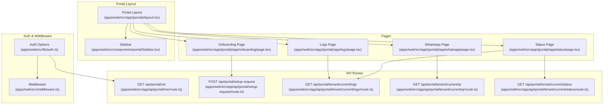
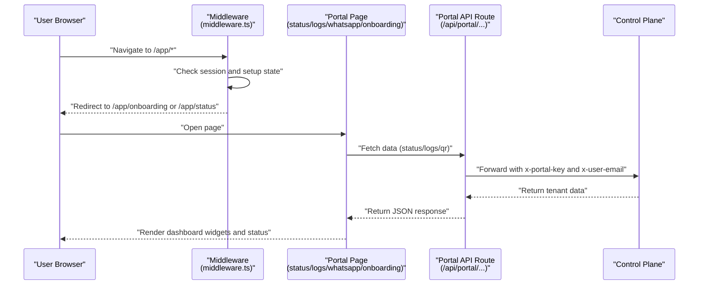
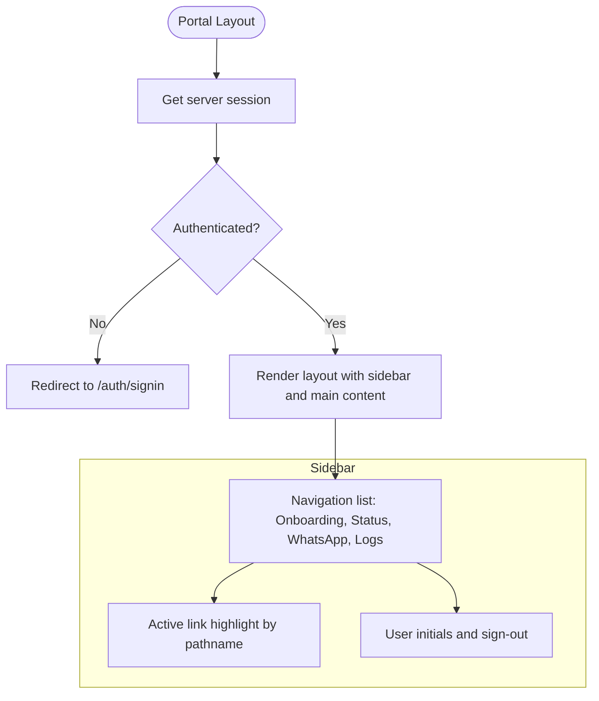
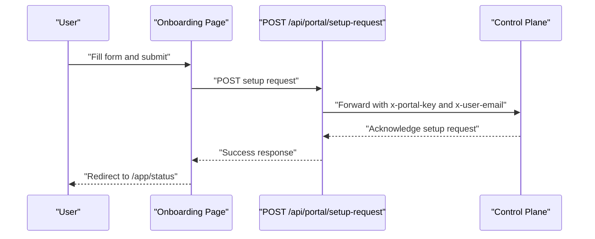
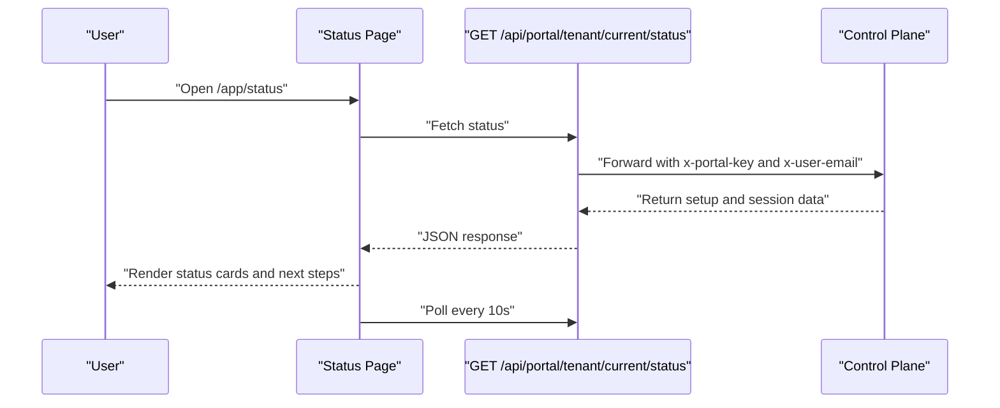
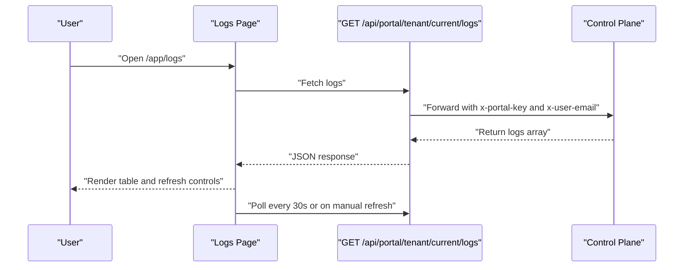
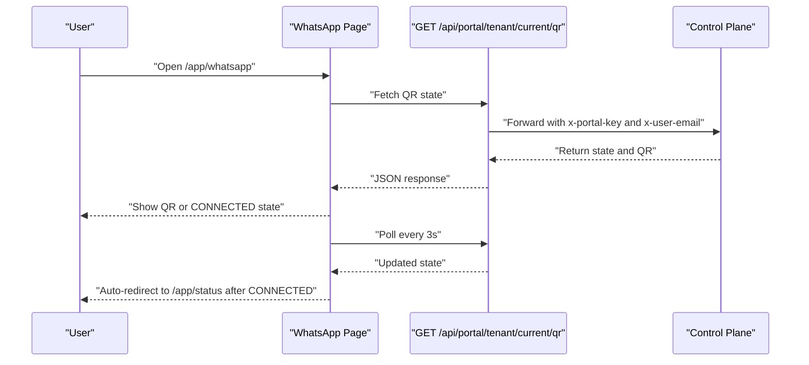
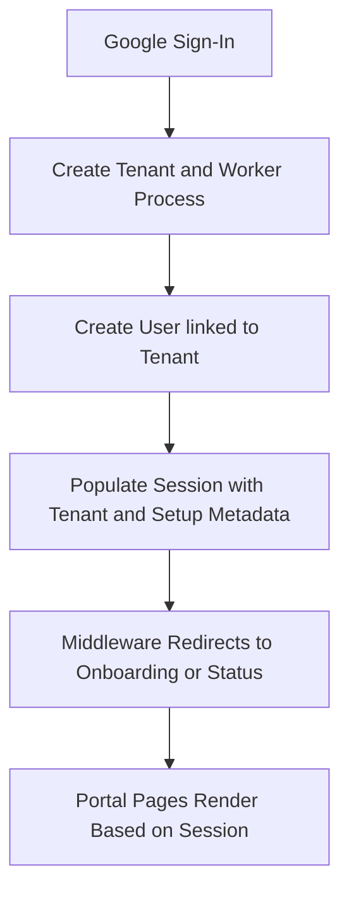
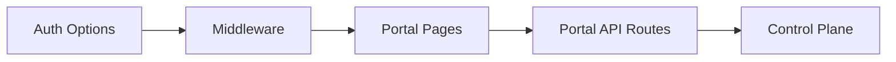

# Portal Interface

<cite>
**Referenced Files in This Document**
- [apps/web/src/app/(portal)/layout.tsx](file://apps/web/src/app/(portal)/layout.tsx)
- [apps/web/src/components/portal/Sidebar.tsx](file://apps/web/src/components/portal/Sidebar.tsx)
- [apps/web/src/app/(portal)/app/status/page.tsx](file://apps/web/src/app/(portal)/app/status/page.tsx)
- [apps/web/src/app/(portal)/app/logs/page.tsx](file://apps/web/src/app/(portal)/app/logs/page.tsx)
- [apps/web/src/app/(portal)/app/whatsapp/page.tsx](file://apps/web/src/app/(portal)/app/whatsapp/page.tsx)
- [apps/web/src/app/(portal)/app/onboarding/page.tsx](file://apps/web/src/app/(portal)/app/onboarding/page.tsx)
- [apps/web/src/app/api/portal/me/route.ts](file://apps/web/src/app/api/portal/me/route.ts)
- [apps/web/src/app/api/portal/setup-request/route.ts](file://apps/web/src/app/api/portal/setup-request/route.ts)
- [apps/web/src/app/api/portal/tenant/current/logs/route.ts](file://apps/web/src/app/api/portal/tenant/current/logs/route.ts)
- [apps/web/src/app/api/portal/tenant/current/qr/route.ts](file://apps/web/src/app/api/portal/tenant/current/qr/route.ts)
- [apps/web/src/app/api/portal/tenant/current/status/route.ts](file://apps/web/src/app/api/portal/tenant/current/status/route.ts)
- [apps/web/src/lib/auth.ts](file://apps/web/src/lib/auth.ts)
- [apps/web/src/middleware.ts](file://apps/web/src/middleware.ts)
- [apps/web/src/app/layout.tsx](file://apps/web/src/app/layout.tsx)
</cite>

## Table of Contents
1. [Introduction](#introduction)
2. [Project Structure](#project-structure)
3. [Core Components](#core-components)
4. [Architecture Overview](#architecture-overview)
5. [Detailed Component Analysis](#detailed-component-analysis)
6. [Dependency Analysis](#dependency-analysis)
7. [Performance Considerations](#performance-considerations)
8. [Troubleshooting Guide](#troubleshooting-guide)
9. [Conclusion](#conclusion)
10. [Appendices](#appendices)

## Introduction
This document describes the tenant portal interface and user dashboard. It covers the portal layout, sidebar navigation, status monitoring dashboard, activity logs interface, tenant management UI, worker status visualization, QR code authentication display, and real-time updates. It also documents navigation patterns, responsive design, user interaction flows, API integrations, data fetching strategies, and component composition patterns for dashboard widgets and status indicators.

## Project Structure
The portal is built as a Next.js application under apps/web. The portal layout composes a persistent sidebar with navigation links and a main content area. Pages under /app/(portal)/app implement the Onboarding, Status, WhatsApp, and Logs dashboards. API routes under /app/api/portal act as thin wrappers around the control plane service, forwarding requests with authentication and internal keys.

**Diagram sources**
- [apps/web/src/app/(portal)/layout.tsx](file://apps/web/src/app/(portal)/layout.tsx#L1-L30)
- [apps/web/src/components/portal/Sidebar.tsx](file://apps/web/src/components/portal/Sidebar.tsx#L1-L69)
- [apps/web/src/app/(portal)/app/onboarding/page.tsx](file://apps/web/src/app/(portal)/app/onboarding/page.tsx#L1-L115)
- [apps/web/src/app/(portal)/app/status/page.tsx](file://apps/web/src/app/(portal)/app/status/page.tsx#L1-L160)
- [apps/web/src/app/(portal)/app/whatsapp/page.tsx](file://apps/web/src/app/(portal)/app/whatsapp/page.tsx#L1-L115)
- [apps/web/src/app/(portal)/app/logs/page.tsx](file://apps/web/src/app/(portal)/app/logs/page.tsx#L1-L114)
- [apps/web/src/app/api/portal/me/route.ts](file://apps/web/src/app/api/portal/me/route.ts#L1-L35)
- [apps/web/src/app/api/portal/setup-request/route.ts](file://apps/web/src/app/api/portal/setup-request/route.ts#L1-L40)
- [apps/web/src/app/api/portal/tenant/current/logs/route.ts](file://apps/web/src/app/api/portal/tenant/current/logs/route.ts#L1-L35)
- [apps/web/src/app/api/portal/tenant/current/qr/route.ts](file://apps/web/src/app/api/portal/tenant/current/qr/route.ts#L1-L35)
- [apps/web/src/app/api/portal/tenant/current/status/route.ts](file://apps/web/src/app/api/portal/tenant/current/status/route.ts#L1-L35)
- [apps/web/src/lib/auth.ts](file://apps/web/src/lib/auth.ts#L1-L76)
- [apps/web/src/middleware.ts](file://apps/web/src/middleware.ts#L1-L44)

**Section sources**
- [apps/web/src/app/(portal)/layout.tsx](file://apps/web/src/app/(portal)/layout.tsx#L1-L30)
- [apps/web/src/components/portal/Sidebar.tsx](file://apps/web/src/components/portal/Sidebar.tsx#L1-L69)
- [apps/web/src/app/(portal)/app/onboarding/page.tsx](file://apps/web/src/app/(portal)/app/onboarding/page.tsx#L1-L115)
- [apps/web/src/app/(portal)/app/status/page.tsx](file://apps/web/src/app/(portal)/app/status/page.tsx#L1-L160)
- [apps/web/src/app/(portal)/app/whatsapp/page.tsx](file://apps/web/src/app/(portal)/app/whatsapp/page.tsx#L1-L115)
- [apps/web/src/app/(portal)/app/logs/page.tsx](file://apps/web/src/app/(portal)/app/logs/page.tsx#L1-L114)
- [apps/web/src/app/api/portal/me/route.ts](file://apps/web/src/app/api/portal/me/route.ts#L1-L35)
- [apps/web/src/app/api/portal/setup-request/route.ts](file://apps/web/src/app/api/portal/setup-request/route.ts#L1-L40)
- [apps/web/src/app/api/portal/tenant/current/logs/route.ts](file://apps/web/src/app/api/portal/tenant/current/logs/route.ts#L1-L35)
- [apps/web/src/app/api/portal/tenant/current/qr/route.ts](file://apps/web/src/app/api/portal/tenant/current/qr/route.ts#L1-L35)
- [apps/web/src/app/api/portal/tenant/current/status/route.ts](file://apps/web/src/app/api/portal/tenant/current/status/route.ts#L1-L35)
- [apps/web/src/lib/auth.ts](file://apps/web/src/lib/auth.ts#L1-L76)
- [apps/web/src/middleware.ts](file://apps/web/src/middleware.ts#L1-L44)

## Core Components
- Portal layout establishes the sidebar and main content container, enforcing authentication via server-side session checks and redirecting unauthenticated users to the sign-in page.
- Sidebar provides tenant-specific navigation with icons and active-state highlighting based on the current path. It displays the current user’s initials and includes a sign-out action.
- Onboarding page collects business and WhatsApp setup details and submits them to the control plane via a portal API endpoint.
- Status page aggregates setup request and tenant WhatsApp session status, polls the control plane periodically, and guides the user to next steps (QR or logs).
- WhatsApp page renders QR code visuals and connection states, polling frequently to detect transitions to CONNECTED and auto-redirecting to the status page.
- Logs page lists inbound and outbound messages, supports manual refresh, and polls periodically for near-real-time updates.
- Authentication and middleware orchestrate sign-in, session population with tenant and setup request metadata, and automatic redirects between onboarding and status based on setup state.
- API routes proxy requests to the control plane, attaching internal keys and the authenticated user’s email.

**Section sources**
- [apps/web/src/app/(portal)/layout.tsx](file://apps/web/src/app/(portal)/layout.tsx#L1-L30)
- [apps/web/src/components/portal/Sidebar.tsx](file://apps/web/src/components/portal/Sidebar.tsx#L1-L69)
- [apps/web/src/app/(portal)/app/onboarding/page.tsx](file://apps/web/src/app/(portal)/app/onboarding/page.tsx#L1-L115)
- [apps/web/src/app/(portal)/app/status/page.tsx](file://apps/web/src/app/(portal)/app/status/page.tsx#L1-L160)
- [apps/web/src/app/(portal)/app/whatsapp/page.tsx](file://apps/web/src/app/(portal)/app/whatsapp/page.tsx#L1-L115)
- [apps/web/src/app/(portal)/app/logs/page.tsx](file://apps/web/src/app/(portal)/app/logs/page.tsx#L1-L114)
- [apps/web/src/lib/auth.ts](file://apps/web/src/lib/auth.ts#L1-L76)
- [apps/web/src/middleware.ts](file://apps/web/src/middleware.ts#L1-L44)
- [apps/web/src/app/api/portal/me/route.ts](file://apps/web/src/app/api/portal/me/route.ts#L1-L35)
- [apps/web/src/app/api/portal/setup-request/route.ts](file://apps/web/src/app/api/portal/setup-request/route.ts#L1-L40)
- [apps/web/src/app/api/portal/tenant/current/logs/route.ts](file://apps/web/src/app/api/portal/tenant/current/logs/route.ts#L1-L35)
- [apps/web/src/app/api/portal/tenant/current/qr/route.ts](file://apps/web/src/app/api/portal/tenant/current/qr/route.ts#L1-L35)
- [apps/web/src/app/api/portal/tenant/current/status/route.ts](file://apps/web/src/app/api/portal/tenant/current/status/route.ts#L1-L35)

## Architecture Overview
The portal enforces authentication at both the page and middleware levels. Protected routes under /app require a valid session. The middleware redirects users depending on whether they have an existing setup request. The UI pages call portal API routes, which forward requests to the control plane with internal keys and the authenticated user’s email. The control plane responds with tenant-specific data, enabling the dashboard widgets and status indicators.

**Diagram sources**
- [apps/web/src/middleware.ts](file://apps/web/src/middleware.ts#L1-L44)
- [apps/web/src/app/(portal)/app/status/page.tsx](file://apps/web/src/app/(portal)/app/status/page.tsx#L1-L160)
- [apps/web/src/app/(portal)/app/logs/page.tsx](file://apps/web/src/app/(portal)/app/logs/page.tsx#L1-L114)
- [apps/web/src/app/(portal)/app/whatsapp/page.tsx](file://apps/web/src/app/(portal)/app/whatsapp/page.tsx#L1-L115)
- [apps/web/src/app/(portal)/app/onboarding/page.tsx](file://apps/web/src/app/(portal)/app/onboarding/page.tsx#L1-L115)
- [apps/web/src/app/api/portal/tenant/current/status/route.ts](file://apps/web/src/app/api/portal/tenant/current/status/route.ts#L1-L35)
- [apps/web/src/app/api/portal/tenant/current/logs/route.ts](file://apps/web/src/app/api/portal/tenant/current/logs/route.ts#L1-L35)
- [apps/web/src/app/api/portal/tenant/current/qr/route.ts](file://apps/web/src/app/api/portal/tenant/current/qr/route.ts#L1-L35)
- [apps/web/src/app/api/portal/setup-request/route.ts](file://apps/web/src/app/api/portal/setup-request/route.ts#L1-L40)

## Detailed Component Analysis

### Portal Layout and Sidebar Navigation
- The portal layout performs server-side session retrieval and redirects unauthenticated users to the sign-in page. It renders the sidebar and a main content area with responsive padding and width constraints.
- The sidebar defines a fixed navigation list with icons and labels for Onboarding, Status, WhatsApp, and Logs. It highlights the active link based on the current path and shows the user’s initials. It includes a sign-out button that clears the session and returns to the home page.

**Diagram sources**
- [apps/web/src/app/(portal)/layout.tsx](file://apps/web/src/app/(portal)/layout.tsx#L1-L30)
- [apps/web/src/components/portal/Sidebar.tsx](file://apps/web/src/components/portal/Sidebar.tsx#L1-L69)

**Section sources**
- [apps/web/src/app/(portal)/layout.tsx](file://apps/web/src/app/(portal)/layout.tsx#L1-L30)
- [apps/web/src/components/portal/Sidebar.tsx](file://apps/web/src/components/portal/Sidebar.tsx#L1-L69)

### Onboarding Dashboard
- Purpose: Collect business and WhatsApp setup details and submit a setup request.
- Data model: Includes business name, business type, template type, WhatsApp number, and language.
- Interaction: Submits form data to the portal setup-request API route, which forwards to the control plane. On success, navigates to the status page.

**Diagram sources**
- [apps/web/src/app/(portal)/app/onboarding/page.tsx](file://apps/web/src/app/(portal)/app/onboarding/page.tsx#L1-L115)
- [apps/web/src/app/api/portal/setup-request/route.ts](file://apps/web/src/app/api/portal/setup-request/route.ts#L1-L40)

**Section sources**
- [apps/web/src/app/(portal)/app/onboarding/page.tsx](file://apps/web/src/app/(portal)/app/onboarding/page.tsx#L1-L115)
- [apps/web/src/app/api/portal/setup-request/route.ts](file://apps/web/src/app/api/portal/setup-request/route.ts#L1-L40)

### Status Monitoring Dashboard
- Purpose: Display setup request status and tenant WhatsApp session state, with guidance for next steps.
- Data model: Setup request fields and tenant status with optional WhatsApp session state and timestamps.
- Real-time behavior: Polls the control plane every 10 seconds for status updates.
- UI guidance: Shows actionable buttons to connect WhatsApp or view logs when appropriate.

**Diagram sources**
- [apps/web/src/app/(portal)/app/status/page.tsx](file://apps/web/src/app/(portal)/app/status/page.tsx#L1-L160)
- [apps/web/src/app/api/portal/tenant/current/status/route.ts](file://apps/web/src/app/api/portal/tenant/current/status/route.ts#L1-L35)

**Section sources**
- [apps/web/src/app/(portal)/app/status/page.tsx](file://apps/web/src/app/(portal)/app/status/page.tsx#L1-L160)
- [apps/web/src/app/api/portal/tenant/current/status/route.ts](file://apps/web/src/app/api/portal/tenant/current/status/route.ts#L1-L35)

### Activity Logs Interface
- Purpose: Present inbound and outbound message logs in a scrollable table with directional badges and timestamps.
- Data model: Message log entries with direction, numbers, text, and creation time.
- Real-time behavior: Loads initial data and polls every 30 seconds; supports manual refresh with a spinner indicator.

**Diagram sources**
- [apps/web/src/app/(portal)/app/logs/page.tsx](file://apps/web/src/app/(portal)/app/logs/page.tsx#L1-L114)
- [apps/web/src/app/api/portal/tenant/current/logs/route.ts](file://apps/web/src/app/api/portal/tenant/current/logs/route.ts#L1-L35)

**Section sources**
- [apps/web/src/app/(portal)/app/logs/page.tsx](file://apps/web/src/app/(portal)/app/logs/page.tsx#L1-L114)
- [apps/web/src/app/api/portal/tenant/current/logs/route.ts](file://apps/web/src/app/api/portal/tenant/current/logs/route.ts#L1-L35)

### QR Code Authentication Display
- Purpose: Render QR code visuals and connection states during WhatsApp linking.
- Data model: QR state and base64 image data.
- Real-time behavior: Polls the control plane every 3 seconds; transitions to CONNECTED trigger an auto-redirect to the status page with a countdown.

**Diagram sources**
- [apps/web/src/app/(portal)/app/whatsapp/page.tsx](file://apps/web/src/app/(portal)/app/whatsapp/page.tsx#L1-L115)
- [apps/web/src/app/api/portal/tenant/current/qr/route.ts](file://apps/web/src/app/api/portal/tenant/current/qr/route.ts#L1-L35)

**Section sources**
- [apps/web/src/app/(portal)/app/whatsapp/page.tsx](file://apps/web/src/app/(portal)/app/whatsapp/page.tsx#L1-L115)
- [apps/web/src/app/api/portal/tenant/current/qr/route.ts](file://apps/web/src/app/api/portal/tenant/current/qr/route.ts#L1-L35)

### Tenant Management UI and Worker Status Visualization
- The authentication flow creates a tenant and worker process for new users and augments the session with tenant and setup metadata. The middleware uses this metadata to enforce onboarding-to-status redirection.
- The portal pages consume this session data to guide navigation and render contextual UI elements.

**Diagram sources**
- [apps/web/src/lib/auth.ts](file://apps/web/src/lib/auth.ts#L1-L76)
- [apps/web/src/middleware.ts](file://apps/web/src/middleware.ts#L1-L44)

**Section sources**
- [apps/web/src/lib/auth.ts](file://apps/web/src/lib/auth.ts#L1-L76)
- [apps/web/src/middleware.ts](file://apps/web/src/middleware.ts#L1-L44)

### Component Composition Patterns for Dashboard Widgets and Status Indicators
- Status cards: Render key-value pairs with color-coded status badges derived from status values.
- Logs table: Use directional badges and truncated text with tooltips for readability.
- QR state machine: Render distinct UI blocks for QR_READY, CONNECTED, CONNECTING, and waiting states with appropriate icons and messaging.
- Navigation: Use a shared sidebar with active-state highlighting and consistent spacing for a cohesive UX.

**Section sources**
- [apps/web/src/app/(portal)/app/status/page.tsx](file://apps/web/src/app/(portal)/app/status/page.tsx#L1-L160)
- [apps/web/src/app/(portal)/app/logs/page.tsx](file://apps/web/src/app/(portal)/app/logs/page.tsx#L1-L114)
- [apps/web/src/app/(portal)/app/whatsapp/page.tsx](file://apps/web/src/app/(portal)/app/whatsapp/page.tsx#L1-L115)
- [apps/web/src/components/portal/Sidebar.tsx](file://apps/web/src/components/portal/Sidebar.tsx#L1-L69)

## Dependency Analysis
- Frontend pages depend on portal API routes for data and actions.
- Portal API routes depend on the control plane service and rely on environment-provided internal keys and user identity.
- Authentication and middleware govern access and redirect behavior based on session state and setup presence.

**Diagram sources**
- [apps/web/src/app/(portal)/app/status/page.tsx](file://apps/web/src/app/(portal)/app/status/page.tsx#L1-L160)
- [apps/web/src/app/(portal)/app/logs/page.tsx](file://apps/web/src/app/(portal)/app/logs/page.tsx#L1-L114)
- [apps/web/src/app/(portal)/app/whatsapp/page.tsx](file://apps/web/src/app/(portal)/app/whatsapp/page.tsx#L1-L115)
- [apps/web/src/app/(portal)/app/onboarding/page.tsx](file://apps/web/src/app/(portal)/app/onboarding/page.tsx#L1-L115)
- [apps/web/src/app/api/portal/tenant/current/status/route.ts](file://apps/web/src/app/api/portal/tenant/current/status/route.ts#L1-L35)
- [apps/web/src/app/api/portal/tenant/current/logs/route.ts](file://apps/web/src/app/api/portal/tenant/current/logs/route.ts#L1-L35)
- [apps/web/src/app/api/portal/tenant/current/qr/route.ts](file://apps/web/src/app/api/portal/tenant/current/qr/route.ts#L1-L35)
- [apps/web/src/app/api/portal/setup-request/route.ts](file://apps/web/src/app/api/portal/setup-request/route.ts#L1-L40)
- [apps/web/src/lib/auth.ts](file://apps/web/src/lib/auth.ts#L1-L76)
- [apps/web/src/middleware.ts](file://apps/web/src/middleware.ts#L1-L44)

**Section sources**
- [apps/web/src/app/api/portal/me/route.ts](file://apps/web/src/app/api/portal/me/route.ts#L1-L35)
- [apps/web/src/app/api/portal/setup-request/route.ts](file://apps/web/src/app/api/portal/setup-request/route.ts#L1-L40)
- [apps/web/src/app/api/portal/tenant/current/logs/route.ts](file://apps/web/src/app/api/portal/tenant/current/logs/route.ts#L1-L35)
- [apps/web/src/app/api/portal/tenant/current/qr/route.ts](file://apps/web/src/app/api/portal/tenant/current/qr/route.ts#L1-L35)
- [apps/web/src/app/api/portal/tenant/current/status/route.ts](file://apps/web/src/app/api/portal/tenant/current/status/route.ts#L1-L35)
- [apps/web/src/lib/auth.ts](file://apps/web/src/lib/auth.ts#L1-L76)
- [apps/web/src/middleware.ts](file://apps/web/src/middleware.ts#L1-L44)

## Performance Considerations
- Polling intervals: Status and logs pages poll every 10 and 30 seconds respectively. WhatsApp page polls every 3 seconds for timely QR state updates. These intervals balance responsiveness with network and CPU efficiency.
- Loading states: Pages display loading indicators until initial data arrives, preventing unnecessary re-renders and improving perceived performance.
- Minimal re-renders: Status and logs pages update only the relevant sections upon receiving new data, avoiding full-page reloads.
- Responsive layout: The sidebar is hidden on small screens and becomes fixed on larger screens, ensuring optimal usability across devices.

[No sources needed since this section provides general guidance]

## Troubleshooting Guide
- Authentication failures: If the portal redirects to the sign-in page, verify the session and provider credentials. The middleware enforces authentication for /app routes.
- Unauthorized API responses: Ensure the portal API routes receive a valid user email and that the internal portal key is configured. The API routes attach headers required by the control plane.
- Empty or stale data: Confirm that the control plane is reachable and that the polling intervals are functioning. Logs and status pages include manual refresh controls.
- QR not updating: Verify that the QR endpoint returns a valid state and image. The WhatsApp page polls frequently and auto-redirects on CONNECTED state.

**Section sources**
- [apps/web/src/middleware.ts](file://apps/web/src/middleware.ts#L1-L44)
- [apps/web/src/app/api/portal/me/route.ts](file://apps/web/src/app/api/portal/me/route.ts#L1-L35)
- [apps/web/src/app/api/portal/tenant/current/status/route.ts](file://apps/web/src/app/api/portal/tenant/current/status/route.ts#L1-L35)
- [apps/web/src/app/api/portal/tenant/current/logs/route.ts](file://apps/web/src/app/api/portal/tenant/current/logs/route.ts#L1-L35)
- [apps/web/src/app/api/portal/tenant/current/qr/route.ts](file://apps/web/src/app/api/portal/tenant/current/qr/route.ts#L1-L35)

## Conclusion
The tenant portal integrates authentication, navigation, and real-time status updates through a clean separation of concerns: the layout and sidebar provide consistent navigation, the pages implement domain-specific dashboards, and the API routes proxy to the control plane. The design emphasizes responsive UX, clear status indicators, and guided workflows from onboarding to active operation.

[No sources needed since this section summarizes without analyzing specific files]

## Appendices

### Practical Examples of Navigation Patterns
- Automatic redirects: New users without a setup request are redirected to onboarding; users with a setup request are redirected to status.
- Active link highlighting: The sidebar reflects the current page using the pathname.
- Contextual CTAs: The status page offers quick links to logs and WhatsApp based on current state.

**Section sources**
- [apps/web/src/middleware.ts](file://apps/web/src/middleware.ts#L1-L44)
- [apps/web/src/components/portal/Sidebar.tsx](file://apps/web/src/components/portal/Sidebar.tsx#L1-L69)
- [apps/web/src/app/(portal)/app/status/page.tsx](file://apps/web/src/app/(portal)/app/status/page.tsx#L1-L160)

### Responsive Design Implementation
- Sidebar visibility: Hidden on small screens and fixed-width on large screens.
- Content padding: Responsive horizontal padding and constrained max widths for readability.
- Table responsiveness: Logs table remains readable with minimal adjustments for smaller screens.

**Section sources**
- [apps/web/src/app/(portal)/layout.tsx](file://apps/web/src/app/(portal)/layout.tsx#L1-L30)
- [apps/web/src/app/(portal)/app/logs/page.tsx](file://apps/web/src/app/(portal)/app/logs/page.tsx#L1-L114)

### Data Fetching Strategies and Real-Time Updates
- Controlled polling: Status and logs pages poll at fixed intervals; logs page also supports manual refresh.
- State-driven rendering: WhatsApp page renders different UI blocks based on QR state and auto-redirects on CONNECTED.
- Error handling: Pages catch errors during fetch and continue polling to recover from transient failures.

**Section sources**
- [apps/web/src/app/(portal)/app/status/page.tsx](file://apps/web/src/app/(portal)/app/status/page.tsx#L1-L160)
- [apps/web/src/app/(portal)/app/logs/page.tsx](file://apps/web/src/app/(portal)/app/logs/page.tsx#L1-L114)
- [apps/web/src/app/(portal)/app/whatsapp/page.tsx](file://apps/web/src/app/(portal)/app/whatsapp/page.tsx#L1-L115)

### Integration with Portal API Endpoints
- User profile: GET /api/portal/me
- Setup request: POST /api/portal/setup-request
- Tenant logs: GET /api/portal/tenant/current/logs
- Tenant QR: GET /api/portal/tenant/current/qr
- Tenant status: GET /api/portal/tenant/current/status

**Section sources**
- [apps/web/src/app/api/portal/me/route.ts](file://apps/web/src/app/api/portal/me/route.ts#L1-L35)
- [apps/web/src/app/api/portal/setup-request/route.ts](file://apps/web/src/app/api/portal/setup-request/route.ts#L1-L40)
- [apps/web/src/app/api/portal/tenant/current/logs/route.ts](file://apps/web/src/app/api/portal/tenant/current/logs/route.ts#L1-L35)
- [apps/web/src/app/api/portal/tenant/current/qr/route.ts](file://apps/web/src/app/api/portal/tenant/current/qr/route.ts#L1-L35)
- [apps/web/src/app/api/portal/tenant/current/status/route.ts](file://apps/web/src/app/api/portal/tenant/current/status/route.ts#L1-L35)