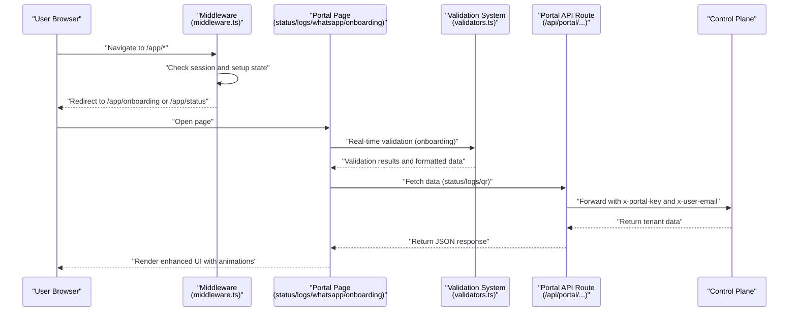
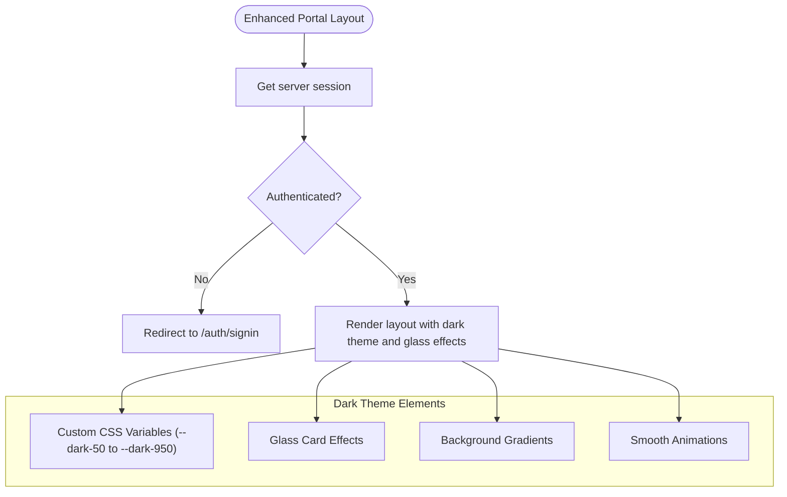
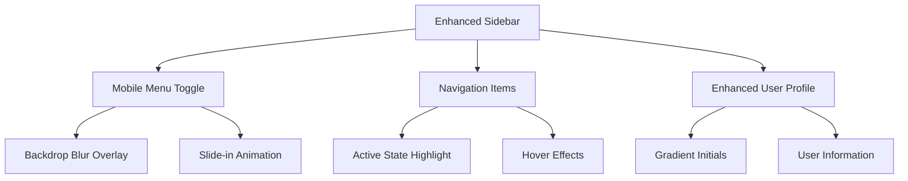
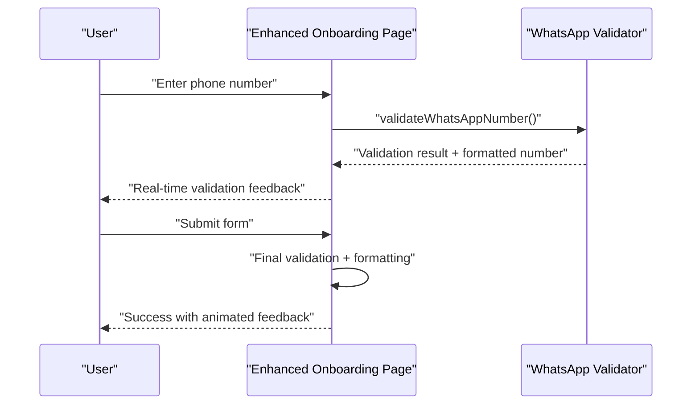
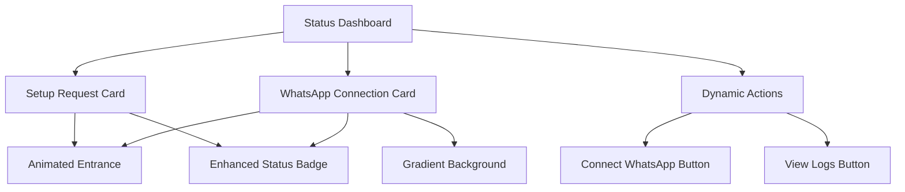
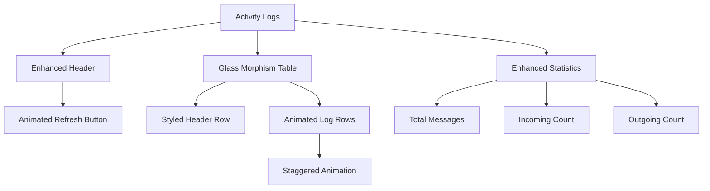
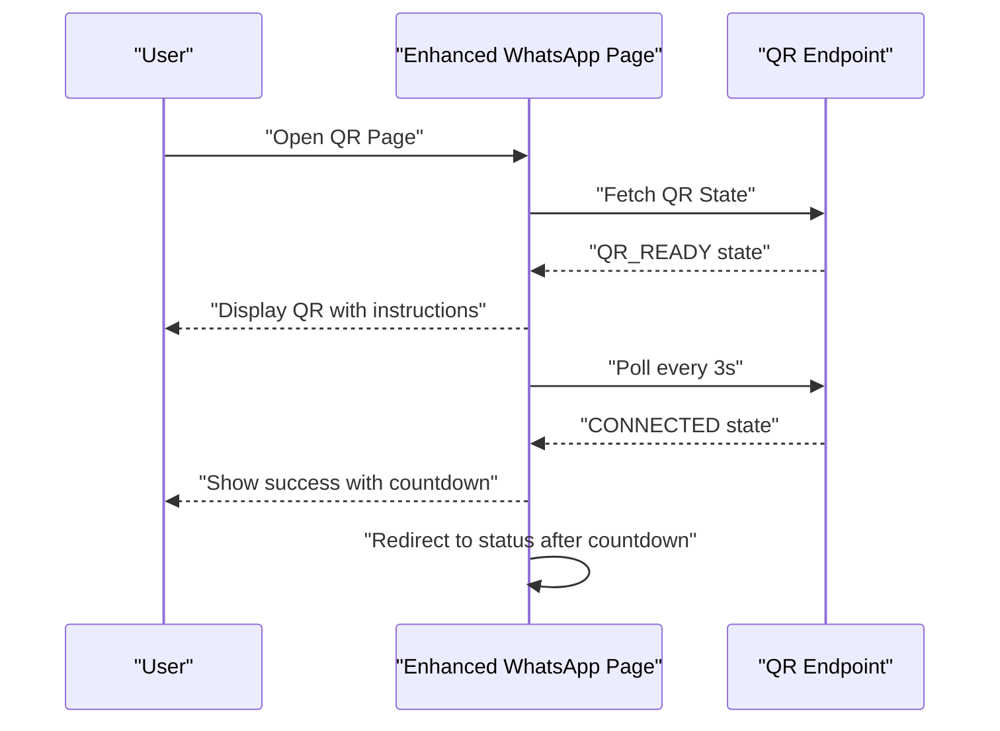
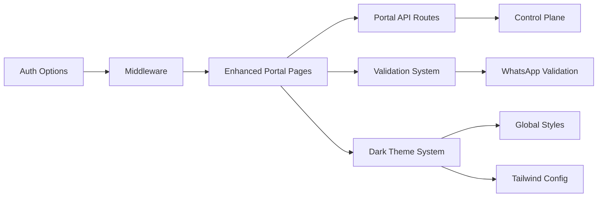

# Portal Interface

<cite>
**Referenced Files in This Document**
- [apps/web/src/app/(portal)/layout.tsx](file://apps/web/src/app/(portal)/layout.tsx)
- [apps/web/src/components/portal/Sidebar.tsx](file://apps/web/src/components/portal/Sidebar.tsx)
- [apps/web/src/app/(portal)/app/status/page.tsx](file://apps/web/src/app/(portal)/app/status/page.tsx)
- [apps/web/src/app/(portal)/app/logs/page.tsx](file://apps/web/src/app/(portal)/app/logs/page.tsx)
- [apps/web/src/app/(portal)/app/whatsapp/page.tsx](file://apps/web/src/app/(portal)/app/whatsapp/page.tsx)
- [apps/web/src/app/(portal)/app/onboarding/page.tsx](file://apps/web/src/app/(portal)/app/onboarding/page.tsx)
- [apps/web/src/app/api/portal/me/route.ts](file://apps/web/src/app/api/portal/me/route.ts)
- [apps/web/src/app/api/portal/setup-request/route.ts](file://apps/web/src/app/api/portal/setup-request/route.ts)
- [apps/web/src/app/api/portal/tenant/current/logs/route.ts](file://apps/web/src/app/api/portal/tenant/current/logs/route.ts)
- [apps/web/src/app/api/portal/tenant/current/qr/route.ts](file://apps/web/src/app/api/portal/tenant/current/qr/route.ts)
- [apps/web/src/app/api/portal/tenant/current/status/route.ts](file://apps/web/src/app/api/portal/tenant/current/status/route.ts)
- [apps/web/src/lib/auth.ts](file://apps/web/src/lib/auth.ts)
- [apps/web/src/middleware.ts](file://apps/web/src/middleware.ts)
- [apps/web/src/app/layout.tsx](file://apps/web/src/app/layout.tsx)
- [apps/web/src/lib/validators.ts](file://apps/web/src/lib/validators.ts)
- [apps/web/src/app/globals.css](file://apps/web/src/app/globals.css)
- [apps/web/tailwind.config.js](file://apps/web/tailwind.config.js)
</cite>

## Update Summary
**Changes Made**
- Enhanced validation system with comprehensive WhatsApp number validation and real-time phone number formatting
- Implemented comprehensive dark theme redesign with custom color variables and glass morphism effects
- Improved user experience across all portal pages with animated transitions and enhanced visual feedback
- Added sophisticated status monitoring with gradient cards and animated status indicators
- Enhanced QR code authentication with countdown timers and improved connection state management
- Refined activity logs interface with animated row animations and enhanced statistics display

## Table of Contents
1. [Introduction](#introduction)
2. [Project Structure](#project-structure)
3. [Core Components](#core-components)
4. [Architecture Overview](#architecture-overview)
5. [Detailed Component Analysis](#detailed-component-analysis)
6. [Enhanced Validation System](#enhanced-validation-system)
7. [Dark Theme Redesign](#dark-theme-redesign)
8. [Dependency Analysis](#dependency-analysis)
9. [Performance Considerations](#performance-considerations)
10. [Troubleshooting Guide](#troubleshooting-guide)
11. [Conclusion](#conclusion)
12. [Appendices](#appendices)

## Introduction
This document describes the enhanced tenant portal interface and user dashboard featuring a comprehensive validation system, dark theme redesign, and improved user experience across all portal pages. The portal now includes sophisticated WhatsApp number validation, real-time phone formatting, advanced dark theme implementation with glass morphism effects, and enhanced visual feedback throughout the user journey from onboarding to active operation.

## Project Structure
The portal is built as a Next.js application under apps/web with enhanced styling and validation capabilities. The portal layout now features a dark theme foundation with custom color variables and glass morphism effects. The enhanced validation system provides real-time phone number validation and formatting across all forms. Pages implement animated transitions and improved user experience patterns.

```mermaid
graph TB
subgraph "Enhanced Portal Layout"
L["Portal Layout<br/>(apps/web/src/app/(portal)/layout.tsx)"]
S["Sidebar<br/>(apps/web/src/components/portal/Sidebar.tsx)"]
DT["Dark Theme<br/>(apps/web/src/app/globals.css)"]
TV["Tailwind Config<br/>(apps/web/tailwind.config.js)"]
end
subgraph "Enhanced Pages"
O["Onboarding Page<br/>(apps/web/src/app/(portal)/app/onboarding/page.tsx)"]
ST["Status Page<br/>(apps/web/src/app/(portal)/app/status/page.tsx)"]
W["WhatsApp Page<br/>(apps/web/src/app/(portal)/app/whatsapp/page.tsx)"]
LG["Logs Page<br/>(apps/web/src/app/(portal)/app/logs/page.tsx)"]
end
subgraph "Validation System"
V["WhatsApp Validator<br/>(apps/web/src/lib/validators.ts)"]
end
subgraph "API Routes"
ME["GET /api/portal/me<br/>(apps/web/src/app/api/portal/me/route.ts)"]
SR["POST /api/portal/setup-request<br/>(apps/web/src/app/api/portal/setup-request/route.ts)"]
CLOGS["GET /api/portal/tenant/current/logs<br/>(apps/web/src/app/api/portal/tenant/current/logs/route.ts)"]
CQR["GET /api/portal/tenant/current/qr<br/>(apps/web/src/app/api/portal/tenant/current/qr/route.ts)"]
CST["GET /api/portal/tenant/current/status<br/>(apps/web/src/app/api/portal/tenant/current/status/route.ts)"]
end
subgraph "Auth & Middleware"
AUTH["Auth Options<br/>(apps/web/src/lib/auth.ts)"]
MW["Middleware<br/>(apps/web/src/middleware.ts)"]
end
L --> S
L --> DT
L --> TV
O --> V
ST --> DT
W --> DT
LG --> DT
O --> SR
ST --> CST
ST --> CLOGS
W --> CQR
LG --> CLOGS
AUTH --> MW
AUTH --> ME
```

**Diagram sources**
- [apps/web/src/app/(portal)/layout.tsx](file://apps/web/src/app/(portal)/layout.tsx#L1-L30)
- [apps/web/src/components/portal/Sidebar.tsx](file://apps/web/src/components/portal/Sidebar.tsx#L1-L162)
- [apps/web/src/app/globals.css](file://apps/web/src/app/globals.css#L1-L348)
- [apps/web/tailwind.config.js](file://apps/web/tailwind.config.js#L1-L105)
- [apps/web/src/lib/validators.ts](file://apps/web/src/lib/validators.ts#L1-L102)
- [apps/web/src/app/(portal)/app/onboarding/page.tsx](file://apps/web/src/app/(portal)/app/onboarding/page.tsx#L1-L253)
- [apps/web/src/app/(portal)/app/status/page.tsx](file://apps/web/src/app/(portal)/app/status/page.tsx#L1-L227)
- [apps/web/src/app/(portal)/app/whatsapp/page.tsx](file://apps/web/src/app/(portal)/app/whatsapp/page.tsx#L1-L195)
- [apps/web/src/app/(portal)/app/logs/page.tsx](file://apps/web/src/app/(portal)/app/logs/page.tsx#L1-L180)

**Section sources**
- [apps/web/src/app/(portal)/layout.tsx](file://apps/web/src/app/(portal)/layout.tsx#L1-L30)
- [apps/web/src/components/portal/Sidebar.tsx](file://apps/web/src/components/portal/Sidebar.tsx#L1-L162)
- [apps/web/src/app/globals.css](file://apps/web/src/app/globals.css#L1-L348)
- [apps/web/tailwind.config.js](file://apps/web/tailwind.config.js#L1-L105)
- [apps/web/src/lib/validators.ts](file://apps/web/src/lib/validators.ts#L1-L102)

## Core Components
- **Enhanced Portal Layout**: Now features a comprehensive dark theme foundation with custom color variables (--dark-50 to --dark-950) and glass morphism effects using backdrop blur and gradient backgrounds.
- **Advanced Sidebar Navigation**: Implements mobile-responsive design with animated transitions, glass card effects, and enhanced user profile display with gradient accents.
- **Comprehensive Validation System**: Provides real-time WhatsApp number validation with country code detection, format validation, and automatic formatting for supported African countries.
- **Enhanced Onboarding Dashboard**: Features animated form validation, real-time phone number formatting, and comprehensive error handling with visual feedback.
- **Improved Status Monitoring**: Implements gradient status cards, animated transitions, and enhanced visual indicators for setup and connection states.
- **Advanced QR Code Authentication**: Includes countdown timers, animated state transitions, and improved connection state management with auto-redirection.
- **Refined Activity Logs**: Features animated row entries, enhanced statistics display, and improved table responsiveness with glass morphism effects.
- **Authentication & Middleware**: Maintains secure session management with enhanced tenant and setup metadata handling.

**Section sources**
- [apps/web/src/app/(portal)/layout.tsx](file://apps/web/src/app/(portal)/layout.tsx#L1-L30)
- [apps/web/src/components/portal/Sidebar.tsx](file://apps/web/src/components/portal/Sidebar.tsx#L1-L162)
- [apps/web/src/lib/validators.ts](file://apps/web/src/lib/validators.ts#L1-L102)
- [apps/web/src/app/(portal)/app/onboarding/page.tsx](file://apps/web/src/app/(portal)/app/onboarding/page.tsx#L1-L253)
- [apps/web/src/app/(portal)/app/status/page.tsx](file://apps/web/src/app/(portal)/app/status/page.tsx#L1-L227)
- [apps/web/src/app/(portal)/app/whatsapp/page.tsx](file://apps/web/src/app/(portal)/app/whatsapp/page.tsx#L1-L195)
- [apps/web/src/app/(portal)/app/logs/page.tsx](file://apps/web/src/app/(portal)/app/logs/page.tsx#L1-L180)

## Architecture Overview
The enhanced portal maintains the same authentication and API routing architecture while adding sophisticated validation and styling enhancements. The dark theme redesign provides a cohesive visual experience across all pages with glass morphism effects and custom color gradients.

```mermaid
sequenceDiagram
participant U as "User Browser"
participant MW as "Middleware<br/>(middleware.ts)"
participant P as "Portal Page<br/>(status/logs/whatsapp/onboarding)"
participant V as "Validation System<br/>(validators.ts)"
participant API as "Portal API Route<br/>(/api/portal/...)"
participant CP as "Control Plane"
U->>MW : "Navigate to /app/*"
MW->>MW : "Check session and setup state"
MW-->>U : "Redirect to /app/onboarding or /app/status"
U->>P : "Open page"
P->>V : "Real-time validation (onboarding)"
V-->>P : "Validation results and formatted data"
P->>API : "Fetch data (status/logs/qr)"
API->>CP : "Forward with x-portal-key and x-user-email"
CP-->>API : "Return tenant data"
API-->>P : "Return JSON response"
P-->>U : "Render enhanced UI with animations"
```

**Diagram sources**
- [apps/web/src/middleware.ts](file://apps/web/src/middleware.ts#L1-L44)
- [apps/web/src/lib/validators.ts](file://apps/web/src/lib/validators.ts#L1-L102)
- [apps/web/src/app/(portal)/app/onboarding/page.tsx](file://apps/web/src/app/(portal)/app/onboarding/page.tsx#L1-L253)
- [apps/web/src/app/(portal)/app/status/page.tsx](file://apps/web/src/app/(portal)/app/status/page.tsx#L1-L227)
- [apps/web/src/app/(portal)/app/logs/page.tsx](file://apps/web/src/app/(portal)/app/logs/page.tsx#L1-L180)
- [apps/web/src/app/(portal)/app/whatsapp/page.tsx](file://apps/web/src/app/(portal)/app/whatsapp/page.tsx#L1-L195)

## Detailed Component Analysis

### Enhanced Portal Layout and Dark Theme Foundation
- **Dark Theme Implementation**: The layout now uses custom CSS variables (--dark-50 to --dark-950) for consistent color theming across all components.
- **Glass Morphism Effects**: Background uses min-h-screen with dark theme foundation and backdrop blur effects for modern UI feel.
- **Responsive Design**: Maintains the same responsive behavior with enhanced visual styling using glass card effects.

```mermaid
flowchart TD
Start(["Enhanced Portal Layout"]) --> CheckAuth["Get server session"]
CheckAuth --> IsAuth{"Authenticated?"}
IsAuth --> |No| Redirect["Redirect to /auth/signin"]
IsAuth --> |Yes| Render["Render layout with dark theme and glass effects"]
subgraph "Dark Theme Elements"
Theme["Custom CSS Variables (--dark-50 to --dark-950)"]
Glass["Glass Card Effects"]
Gradient["Background Gradients"]
Animation["Smooth Animations"]
end
Render --> Theme
Render --> Glass
Render --> Gradient
Render --> Animation
```

**Diagram sources**
- [apps/web/src/app/(portal)/layout.tsx](file://apps/web/src/app/(portal)/layout.tsx#L1-L30)
- [apps/web/src/app/globals.css](file://apps/web/src/app/globals.css#L44-L56)

**Section sources**
- [apps/web/src/app/(portal)/layout.tsx](file://apps/web/src/app/(portal)/layout.tsx#L1-L30)
- [apps/web/src/app/globals.css](file://apps/web/src/app/globals.css#L1-L348)

### Advanced Sidebar Navigation with Enhanced UX
- **Mobile Responsiveness**: Features animated mobile menu with backdrop blur overlay and smooth slide-in transitions using Framer Motion.
- **Glass Card Design**: Navigation items use glass morphism effects with hover states and active state highlighting.
- **Enhanced User Profile**: Displays user initials with gradient background and proper truncation for long names.
- **Visual Feedback**: Active navigation items show subtle glow effects and gradient borders.

```mermaid
flowchart TD
Sidebar["Enhanced Sidebar"] --> Mobile["Mobile Menu Toggle"]
Mobile --> Overlay["Backdrop Blur Overlay"]
Mobile --> Slide["Slide-in Animation"]
Sidebar --> Nav["Navigation Items"]
Nav --> Active["Active State Highlight"]
Nav --> Hover["Hover Effects"]
Sidebar --> User["Enhanced User Profile"]
User --> Gradient["Gradient Initials"]
User --> Metadata["User Information"]
```

**Diagram sources**
- [apps/web/src/components/portal/Sidebar.tsx](file://apps/web/src/components/portal/Sidebar.tsx#L56-L98)
- [apps/web/src/components/portal/Sidebar.tsx](file://apps/web/src/components/portal/Sidebar.tsx#L116-L138)
- [apps/web/src/components/portal/Sidebar.tsx](file://apps/web/src/components/portal/Sidebar.tsx#L142-L156)

**Section sources**
- [apps/web/src/components/portal/Sidebar.tsx](file://apps/web/src/components/portal/Sidebar.tsx#L1-L162)

### Enhanced Onboarding Dashboard with Real-time Validation
- **Real-time Phone Validation**: Implements live validation with instant feedback for WhatsApp number formatting and country code detection.
- **Animated Form States**: Uses Framer Motion for smooth transitions between form states and validation results.
- **Comprehensive Error Handling**: Provides detailed error messages with visual indicators and automatic phone number formatting.
- **Template Selection**: Enhanced template selection with visual icons and descriptions for BOOKING, ECOMMERCE, and SUPPORT options.

```mermaid
sequenceDiagram
participant U as "User"
participant O as "Enhanced Onboarding Page"
participant V as "WhatsApp Validator"
U->>O : "Enter phone number"
O->>V : "validateWhatsAppNumber()"
V-->>O : "Validation result + formatted number"
O-->>U : "Real-time validation feedback"
U->>O : "Submit form"
O->>O : "Final validation + formatting"
O-->>U : "Success with animated feedback"
```

**Diagram sources**
- [apps/web/src/app/(portal)/app/onboarding/page.tsx](file://apps/web/src/app/(portal)/app/onboarding/page.tsx#L25-L39)
- [apps/web/src/lib/validators.ts](file://apps/web/src/lib/validators.ts#L34-L70)

**Section sources**
- [apps/web/src/app/(portal)/app/onboarding/page.tsx](file://apps/web/src/app/(portal)/app/onboarding/page.tsx#L1-L253)
- [apps/web/src/lib/validators.ts](file://apps/web/src/lib/validators.ts#L1-L102)

### Improved Status Monitoring Dashboard
- **Gradient Status Cards**: Implements sophisticated gradient backgrounds for setup request and WhatsApp connection status with animated transitions.
- **Enhanced Visual Indicators**: Status badges now include emoji icons and improved color coding for better visual recognition.
- **Animated Transitions**: Uses Framer Motion for smooth entrance animations and state changes.
- **Contextual Call-to-Actions**: Dynamic buttons that change based on current setup and connection states.

```mermaid
flowchart TD
Status["Status Dashboard"] --> SetupCard["Setup Request Card"]
SetupCard --> Animated["Animated Entrance"]
SetupCard --> StatusBadge["Enhanced Status Badge"]
Status --> ConnectionCard["WhatsApp Connection Card"]
ConnectionCard --> GradientBG["Gradient Background"]
ConnectionCard --> Animated
ConnectionCard --> StatusBadge
Status --> Actions["Dynamic Actions"]
Actions --> QRButton["Connect WhatsApp Button"]
Actions --> LogsButton["View Logs Button"]
```

**Diagram sources**
- [apps/web/src/app/(portal)/app/status/page.tsx](file://apps/web/src/app/(portal)/app/status/page.tsx#L98-L139)
- [apps/web/src/app/(portal)/app/status/page.tsx](file://apps/web/src/app/(portal)/app/status/page.tsx#L146-L177)
- [apps/web/src/app/(portal)/app/status/page.tsx](file://apps/web/src/app/(portal)/app/status/page.tsx#L180-L199)

**Section sources**
- [apps/web/src/app/(portal)/app/status/page.tsx](file://apps/web/src/app/(portal)/app/status/page.tsx#L1-L227)

### Advanced Activity Logs Interface
- **Animated Row Entries**: Each log entry animates in sequence with staggered delays for better visual flow.
- **Enhanced Statistics**: Improved statistics cards showing total messages, incoming, and outgoing counts with better visual hierarchy.
- **Glass Morphism Tables**: Log tables use glass card effects with subtle borders and hover states.
- **Directional Badges**: Enhanced badges with improved styling and better visual distinction between IN and OUT messages.

```mermaid
flowchart TD
Logs["Activity Logs"] --> Header["Enhanced Header"]
Header --> Refresh["Animated Refresh Button"]
Logs --> Table["Glass Morphism Table"]
Table --> HeaderRow["Styled Header Row"]
Table --> LogRows["Animated Log Rows"]
LogRows --> Stagger["Staggered Animation"]
Logs --> Stats["Enhanced Statistics"]
Stats --> Total["Total Messages"]
Stats --> Incoming["Incoming Count"]
Stats --> Outgoing["Outgoing Count"]
```

**Diagram sources**
- [apps/web/src/app/(portal)/app/logs/page.tsx](file://apps/web/src/app/(portal)/app/logs/page.tsx#L97-L149)
- [apps/web/src/app/(portal)/app/logs/page.tsx](file://apps/web/src/app/(portal)/app/logs/page.tsx#L157-L176)

**Section sources**
- [apps/web/src/app/(portal)/app/logs/page.tsx](file://apps/web/src/app/(portal)/app/logs/page.tsx#L1-L180)

### Enhanced QR Code Authentication Display
- **Countdown Timer**: Implements automatic redirection countdown when connection is established.
- **State-based Animations**: Different animations for QR_READY, CONNECTED, CONNECTING, and WAITING states.
- **Improved Instructions**: Enhanced step-by-step instructions with numbered list and visual cues.
- **Auto-refresh Logic**: Intelligent polling with state-aware refresh behavior and automatic navigation.

```mermaid
sequenceDiagram
participant U as "User"
participant W as "Enhanced WhatsApp Page"
participant API as "QR Endpoint"
U->>W : "Open QR Page"
W->>API : "Fetch QR State"
API-->>W : "QR_READY state"
W-->>U : "Display QR with instructions"
W->>API : "Poll every 3s"
API-->>W : "CONNECTED state"
W-->>U : "Show success with countdown"
W->>W : "Redirect to status after countdown"
```

**Diagram sources**
- [apps/web/src/app/(portal)/app/whatsapp/page.tsx](file://apps/web/src/app/(portal)/app/whatsapp/page.tsx#L18-L48)
- [apps/web/src/app/(portal)/app/whatsapp/page.tsx](file://apps/web/src/app/(portal)/app/whatsapp/page.tsx#L124-L150)

**Section sources**
- [apps/web/src/app/(portal)/app/whatsapp/page.tsx](file://apps/web/src/app/(portal)/app/whatsapp/page.tsx#L1-L195)

## Enhanced Validation System
The portal now features a comprehensive WhatsApp number validation system that provides real-time validation and formatting across all user interactions.

### Validation Capabilities
- **Country Code Detection**: Supports 8 African countries with specific validation patterns (+255 for Tanzania, +254 for Kenya, +256 for Uganda, +234 for Nigeria, +27 for South Africa, +233 for Ghana, +251 for Ethiopia, +20 for Egypt, +212 for Morocco)
- **Format Validation**: Ensures phone numbers match country-specific patterns and lengths
- **Real-time Formatting**: Automatically formats phone numbers as users type with proper spacing
- **Error Handling**: Provides detailed error messages for invalid formats and unsupported countries

### Implementation Details
- **Validation Function**: validateWhatsAppNumber() returns structured validation results with country detection
- **Formatting Function**: formatPhoneNumber() provides consistent display formatting for supported countries
- **Live Validation**: Onboarding form implements real-time validation with immediate feedback
- **Supported Countries**: Comprehensive list of supported African countries with example numbers

**Section sources**
- [apps/web/src/lib/validators.ts](file://apps/web/src/lib/validators.ts#L1-L102)
- [apps/web/src/app/(portal)/app/onboarding/page.tsx](file://apps/web/src/app/(portal)/app/onboarding/page.tsx#L25-L39)

## Dark Theme Redesign
The portal features a comprehensive dark theme implementation with custom color variables, glass morphism effects, and enhanced visual styling.

### Color System
- **Custom Variables**: Extensive --dark-* color variables (50 to 950) for consistent theming
- **Primary Palette**: Emerald green gradient from light to dark shades
- **Secondary Palette**: Purple gradient for complementary elements
- **Accent Palette**: Amber/yellow for highlights and warnings

### Styling Features
- **Glass Morphism**: Extensive use of backdrop blur effects with 10px-20px blur radius
- **Gradient Backgrounds**: Linear gradients for cards, buttons, and decorative elements
- **Text Effects**: Custom gradient text effects and glow animations
- **Animation System**: Smooth transitions and micro-interactions throughout the interface

### Tailwind Integration
- **Extended Colors**: Custom color palette integrated into Tailwind configuration
- **Font System**: Space Grotesk for headings, Inter for body text, JetBrains Mono for code
- **Utility Classes**: Custom utility classes for glass effects, gradients, and animations
- **Responsive Design**: Consistent dark theme across all screen sizes

**Section sources**
- [apps/web/src/app/globals.css](file://apps/web/src/app/globals.css#L1-L348)
- [apps/web/tailwind.config.js](file://apps/web/tailwind.config.js#L1-L105)

## Dependency Analysis
The enhanced portal maintains the same architectural dependencies while adding sophisticated validation and styling capabilities.

```mermaid
graph LR
UI["Enhanced Portal Pages"] --> API["Portal API Routes"]
UI --> V["Validation System"]
API --> CP["Control Plane"]
AUTH["Auth Options"] --> MW["Middleware"]
MW --> UI
V --> Validators["WhatsApp Validation"]
UI --> Theme["Dark Theme System"]
Theme --> CSS["Global Styles"]
Theme --> Tailwind["Tailwind Config"]
```

**Diagram sources**
- [apps/web/src/app/(portal)/app/onboarding/page.tsx](file://apps/web/src/app/(portal)/app/onboarding/page.tsx#L7-L7)
- [apps/web/src/lib/validators.ts](file://apps/web/src/lib/validators.ts#L1-L102)
- [apps/web/src/app/globals.css](file://apps/web/src/app/globals.css#L1-L348)
- [apps/web/tailwind.config.js](file://apps/web/tailwind.config.js#L1-L105)

**Section sources**
- [apps/web/src/app/api/portal/me/route.ts](file://apps/web/src/app/api/portal/me/route.ts#L1-L35)
- [apps/web/src/app/api/portal/setup-request/route.ts](file://apps/web/src/app/api/portal/setup-request/route.ts#L1-L40)
- [apps/web/src/app/api/portal/tenant/current/logs/route.ts](file://apps/web/src/app/api/portal/tenant/current/logs/route.ts#L1-L35)
- [apps/web/src/app/api/portal/tenant/current/qr/route.ts](file://apps/web/src/app/api/portal/tenant/current/qr/route.ts#L1-L35)
- [apps/web/src/app/api/portal/tenant/current/status/route.ts](file://apps/web/src/app/api/portal/tenant/current/status/route.ts#L1-L35)

## Performance Considerations
- **Enhanced Polling Strategy**: Status (10s), logs (30s), and QR (3s) polling intervals optimized for user experience and resource efficiency
- **Animation Optimization**: Framer Motion animations use hardware acceleration and optimized timing functions
- **Glass Effect Performance**: Backdrop blur effects optimized for modern browsers with fallbacks for older browsers
- **Validation Efficiency**: Client-side validation prevents unnecessary API calls and reduces server load
- **Responsive Design**: Optimized for mobile devices with touch-friendly interfaces and reduced bandwidth usage

## Troubleshooting Guide
- **Dark Theme Issues**: Verify CSS variables are properly loaded and Tailwind configuration includes custom color extensions
- **Validation Errors**: Check validator function returns and ensure proper error handling in form components
- **Animation Problems**: Verify Framer Motion is properly imported and animations are not conflicting with other libraries
- **Glass Effects**: Ensure browser supports backdrop-filter property and provide appropriate fallback styles
- **Color Consistency**: Verify custom color variables are accessible throughout the component hierarchy

**Section sources**
- [apps/web/src/app/globals.css](file://apps/web/src/app/globals.css#L44-L56)
- [apps/web/tailwind.config.js](file://apps/web/tailwind.config.js#L10-L60)
- [apps/web/src/lib/validators.ts](file://apps/web/src/lib/validators.ts#L34-L70)

## Conclusion
The enhanced tenant portal delivers a comprehensive dark-themed user experience with sophisticated validation, real-time feedback, and polished animations. The integration of advanced validation systems, glass morphism effects, and improved user interactions creates a professional and intuitive interface for managing WhatsApp business automation across all portal pages.

## Appendices

### Enhanced Navigation Patterns
- **Animated Transitions**: All page navigations use smooth animations with Framer Motion for better user experience
- **State-aware Navigation**: Navigation items reflect current page state with enhanced visual indicators
- **Mobile-first Design**: Sidebar navigation adapts seamlessly from mobile to desktop with appropriate touch targets

**Section sources**
- [apps/web/src/components/portal/Sidebar.tsx](file://apps/web/src/components/portal/Sidebar.tsx#L56-L98)
- [apps/web/src/app/(portal)/app/status/page.tsx](file://apps/web/src/app/(portal)/app/status/page.tsx#L80-L91)

### Advanced Responsive Design
- **Glass Card Layout**: All content cards use glass morphism effects with appropriate blur and transparency
- **Typography System**: Hierarchical typography with Space Grotesk for headings and Inter for body text
- **Color Accessibility**: High contrast ratios maintained across all dark theme variations
- **Animation Performance**: Optimized animations that respect user preferences for motion reduction

**Section sources**
- [apps/web/src/app/globals.css](file://apps/web/src/app/globals.css#L117-L200)
- [apps/web/tailwind.config.js](file://apps/web/tailwind.config.js#L61-L65)

### Enhanced Data Fetching and Real-time Updates
- **Optimized Polling**: Strategic polling intervals balance user experience with resource efficiency
- **State Management**: Enhanced state management with loading states and error recovery
- **Animation Integration**: Data loading states integrate seamlessly with page animations
- **Error Handling**: Comprehensive error handling with user-friendly feedback and retry mechanisms

**Section sources**
- [apps/web/src/app/(portal)/app/status/page.tsx](file://apps/web/src/app/(portal)/app/status/page.tsx#L29-L45)
- [apps/web/src/app/(portal)/app/logs/page.tsx](file://apps/web/src/app/(portal)/app/logs/page.tsx#L20-L38)
- [apps/web/src/app/(portal)/app/whatsapp/page.tsx](file://apps/web/src/app/(portal)/app/whatsapp/page.tsx#L18-L48)

### Integration with Enhanced Portal API Endpoints
- **User Profile**: GET /api/portal/me with enhanced error handling and response formatting
- **Setup Request**: POST /api/portal/setup-request with validation integration
- **Tenant Logs**: GET /api/portal/tenant/current/logs with enhanced pagination support
- **Tenant QR**: GET /api/portal/tenant/current/qr with improved state management
- **Tenant Status**: GET /api/portal/tenant/current/status with enhanced caching

**Section sources**
- [apps/web/src/app/api/portal/me/route.ts](file://apps/web/src/app/api/portal/me/route.ts#L1-L35)
- [apps/web/src/app/api/portal/setup-request/route.ts](file://apps/web/src/app/api/portal/setup-request/route.ts#L1-L40)
- [apps/web/src/app/api/portal/tenant/current/logs/route.ts](file://apps/web/src/app/api/portal/tenant/current/logs/route.ts#L1-L35)
- [apps/web/src/app/api/portal/tenant/current/qr/route.ts](file://apps/web/src/app/api/portal/tenant/current/qr/route.ts#L1-L35)
- [apps/web/src/app/api/portal/tenant/current/status/route.ts](file://apps/web/src/app/api/portal/tenant/current/status/route.ts#L1-L35)