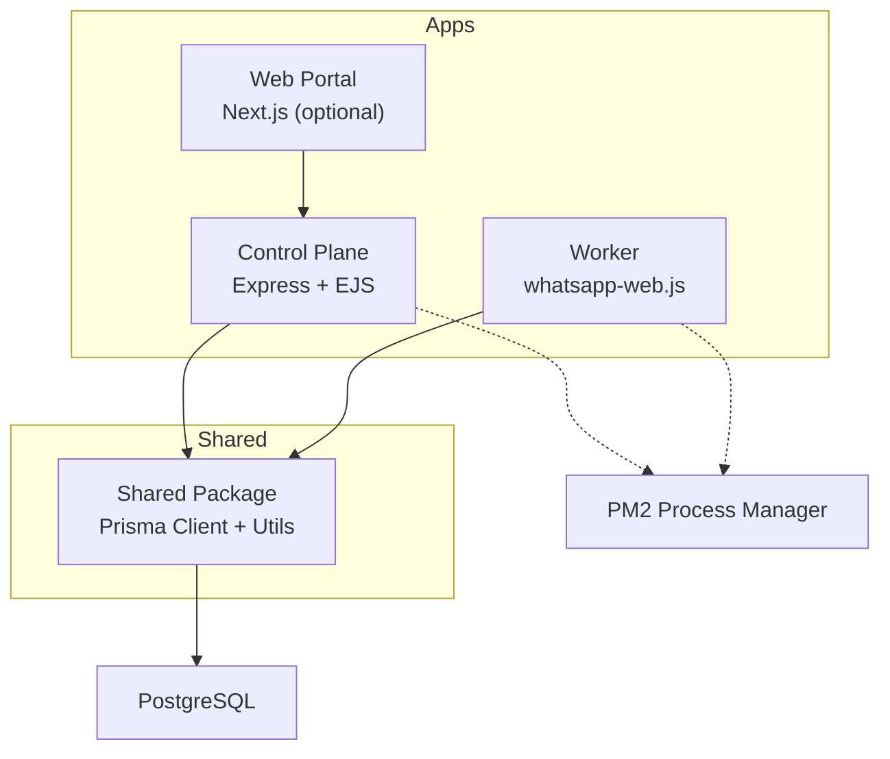
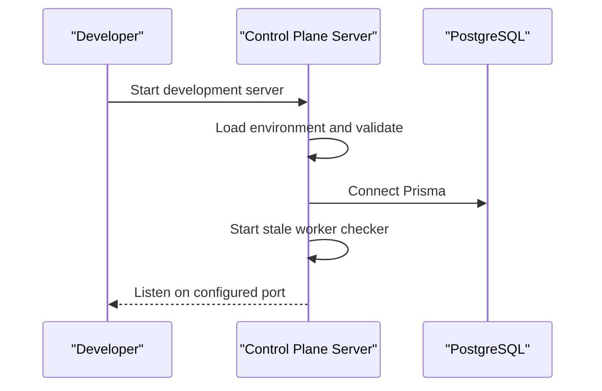
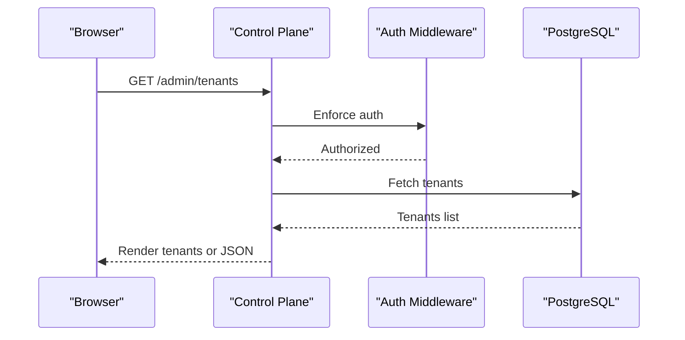
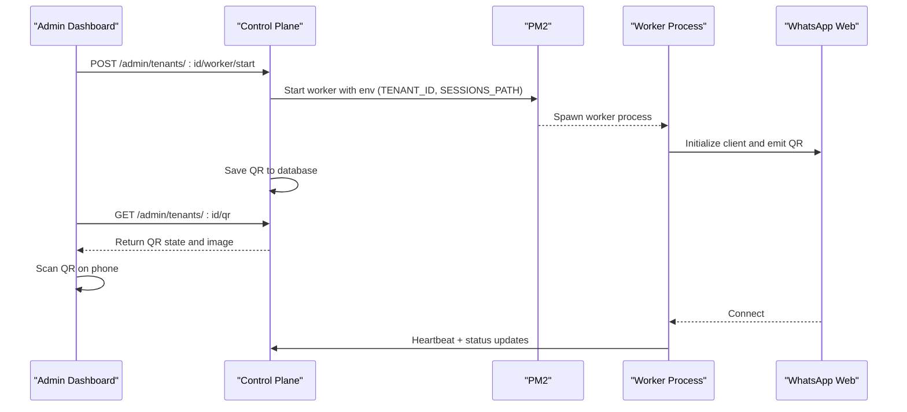
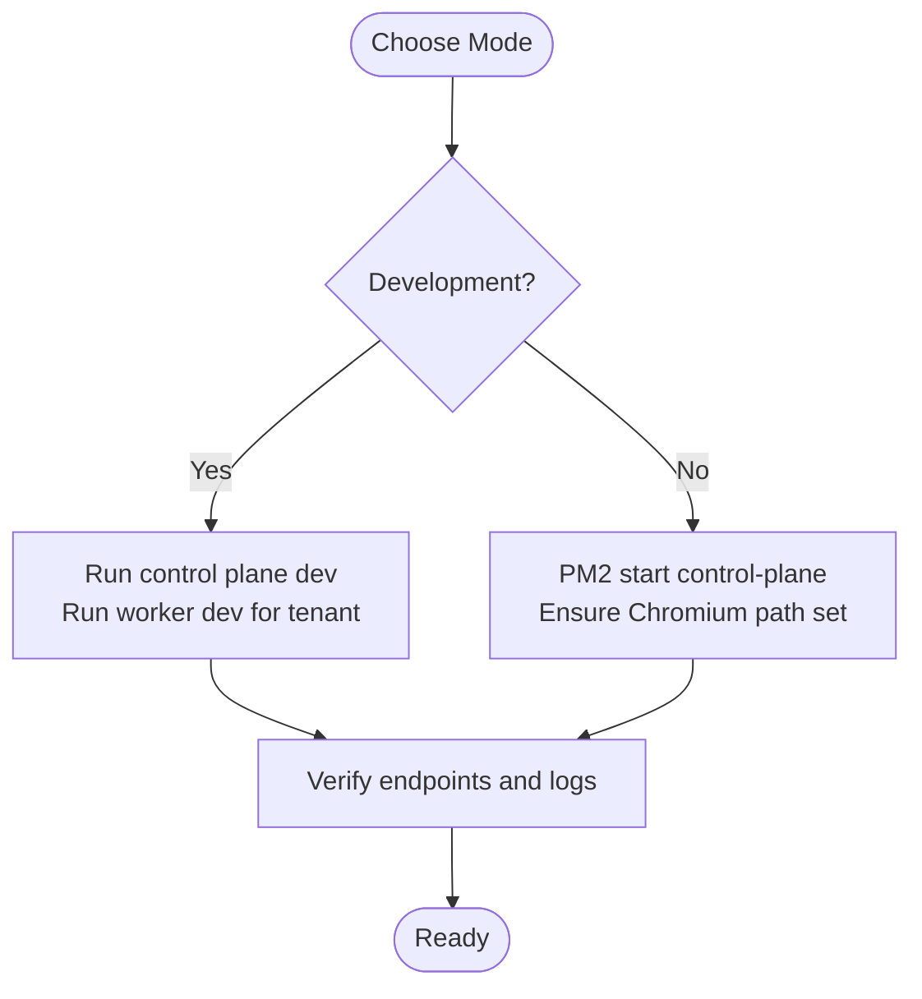

# Getting Started

<cite>
**Referenced Files in This Document**
- [README.md](file://README.md)
- [package.json](file://package.json)
- [.env.example](file://.env.example)
- [ecosystem.config.js](file://ecosystem.config.js)
- [apps/control-plane/package.json](file://apps/control-plane/package.json)
- [apps/control-plane/src/server.ts](file://apps/control-plane/src/server.ts)
- [apps/control-plane/src/middleware/auth.ts](file://apps/control-plane/src/middleware/auth.ts)
- [apps/control-plane/src/routes/admin.ts](file://apps/control-plane/src/routes/admin.ts)
- [apps/worker/package.json](file://apps/worker/package.json)
- [apps/worker/src/worker.ts](file://apps/worker/src/worker.ts)
- [apps/worker/src/bot.ts](file://apps/worker/src/bot.ts)
- [packages/shared/package.json](file://packages/shared/package.json)
- [packages/shared/src/prisma/schema.prisma](file://packages/shared/src/prisma/schema.prisma)
- [apps/web/next.config.js](file://apps/web/next.config.js)
</cite>

## Table of Contents
1. [Introduction](#introduction)
2. [Prerequisites](#prerequisites)
3. [Project Structure](#project-structure)
4. [Step-by-Step Installation](#step-by-step-installation)
5. [Environment Setup](#environment-setup)
6. [Database Initialization](#database-initialization)
7. [Build Applications](#build-applications)
8. [Control Plane Startup](#control-plane-startup)
9. [Admin Dashboard Access](#admin-dashboard-access)
10. [Create Your First Tenant](#create-your-first-tenant)
11. [Start Worker and Connect WhatsApp](#start-worker-and-connect-whatsapp)
12. [Verification Steps](#verification-steps)
13. [Development vs Production Modes](#development-vs-production-modes)
14. [Troubleshooting](#troubleshooting)
15. [Conclusion](#conclusion)

## Introduction
This guide walks you through installing and running the Flow HQ platform locally or in production. Flow HQ is a multi-tenant WhatsApp chatbot platform with:
- Control Plane: Admin API and dashboard (Express + EJS)
- Worker: Per-tenant WhatsApp bot process (whatsapp-web.js)
- Shared: Common types, Prisma client, and utilities

It supports both development and production modes, with PM2 for process management in production.

## Prerequisites
- Node.js 18+
- PostgreSQL 14+
- PM2 (process manager)
- A WhatsApp account for testing

**Section sources**
- [README.md](file://README.md#L11-L16)

## Project Structure
High-level structure:
- apps/control-plane: Admin API and dashboard
- apps/worker: Tenant-specific WhatsApp worker
- apps/web: Optional Next.js portal (proxied by control plane)
- packages/shared: Prisma schema, Prisma client, shared utilities
- sessions/: per-tenant session storage
- logs/: per-tenant logs
- ecosystem.config.js: PM2 configuration for production

**Diagram sources**
- [apps/control-plane/src/server.ts](file://apps/control-plane/src/server.ts#L1-L89)
- [apps/worker/src/worker.ts](file://apps/worker/src/worker.ts#L1-L46)
- [packages/shared/src/prisma/schema.prisma](file://packages/shared/src/prisma/schema.prisma#L1-L178)
- [apps/web/next.config.js](file://apps/web/next.config.js#L1-L17)
- [ecosystem.config.js](file://ecosystem.config.js#L1-L19)

**Section sources**
- [README.md](file://README.md#L116-L129)

## Step-by-Step Installation
1) Install root and workspace dependencies
- Run dependency installs at the repository root and in workspaces.

2) Copy and edit environment variables
- Copy the example environment file and set your database credentials and admin password.

3) Generate Prisma client and run migrations
- Generate Prisma client from the shared package.
- Apply database migrations.

4) Build applications
- Build all workspaces.

5) Start Control Plane
- Development mode: run the control plane dev script.
- Production mode: start with PM2 using the ecosystem configuration.

6) Access Admin Dashboard
- Open the admin tenants page and log in with your admin password.

7) Create your first tenant
- Fill in the form with business name, phone number, template type, display name, and language.

8) Start worker and connect WhatsApp
- Start the worker from the admin dashboard, wait for QR, and scan with your phone’s WhatsApp Web.

9) Verify installation
- Confirm the worker becomes active, logs are written, and basic bot responses work.

**Section sources**
- [README.md](file://README.md#L18-L115)
- [package.json](file://package.json#L9-L16)
- [packages/shared/package.json](file://packages/shared/package.json#L6-L10)
- [apps/control-plane/package.json](file://apps/control-plane/package.json#L4-L8)
- [apps/worker/package.json](file://apps/worker/package.json#L4-L8)

## Environment Setup
- Copy the example environment file to .env and set:
  - DATABASE_URL: PostgreSQL connection string
  - ADMIN_PASSWORD: Admin dashboard password
  - NODE_ENV, PORT, LOG_LEVEL
  - SESSIONS_PATH, LOGS_PATH

Notes:
- The control plane validates required environment variables and database connectivity at startup.
- In production, ensure PUPPETEER_EXECUTABLE_PATH is set so the worker can launch Chromium.

**Section sources**
- [.env.example](file://.env.example#L1-L15)
- [apps/control-plane/src/server.ts](file://apps/control-plane/src/server.ts#L17-L39)

## Database Initialization
- Generate Prisma client from the shared package.
- Run migrations to create tables.

Key schema highlights:
- Tenant, TenantConfig, WhatsAppSession, MessageLog, WorkerProcess, and related enums.

**Section sources**
- [packages/shared/package.json](file://packages/shared/package.json#L8-L10)
- [packages/shared/src/prisma/schema.prisma](file://packages/shared/src/prisma/schema.prisma#L1-L178)
- [README.md](file://README.md#L250-L258)

## Build Applications
- Build all workspaces to compile TypeScript and prepare distribution artifacts.

**Section sources**
- [package.json](file://package.json#L10-L10)
- [apps/control-plane/package.json](file://apps/control-plane/package.json#L6-L6)
- [apps/worker/package.json](file://apps/worker/package.json#L6-L6)

## Control Plane Startup
- Development mode
  - Run the control plane dev script; it starts the Express server and sets up EJS views.
  - It validates environment variables, connects to the database, and schedules stale worker checks.

- Production mode with PM2
  - Use the ecosystem configuration to start the control plane as a PM2-managed service.
  - Logs are written to files configured in the ecosystem file.

**Diagram sources**
- [apps/control-plane/src/server.ts](file://apps/control-plane/src/server.ts#L65-L81)
- [apps/control-plane/src/server.ts](file://apps/control-plane/src/server.ts#L54-L63)

**Section sources**
- [apps/control-plane/package.json](file://apps/control-plane/package.json#L5-L7)
- [apps/control-plane/src/server.ts](file://apps/control-plane/src/server.ts#L65-L81)
- [ecosystem.config.js](file://ecosystem.config.js#L1-L19)

## Admin Dashboard Access
- Open the admin tenants page in your browser.
- Authenticate using the admin password configured in environment variables.

**Diagram sources**
- [apps/control-plane/src/middleware/auth.ts](file://apps/control-plane/src/middleware/auth.ts#L5-L29)
- [apps/control-plane/src/routes/admin.ts](file://apps/control-plane/src/routes/admin.ts#L82-L102)

**Section sources**
- [README.md](file://README.md#L65-L69)
- [apps/control-plane/src/middleware/auth.ts](file://apps/control-plane/src/middleware/auth.ts#L3-L29)

## Create Your First Tenant
- From the admin dashboard, submit the tenant creation form with:
  - Business Name
  - Phone Number (format: +255XXXXXXXXX)
  - Template Type (select BOOKING for demo)
  - Display Name
  - Language (SW or EN)

The system creates associated config, session, and worker process records.

**Section sources**
- [README.md](file://README.md#L73-L82)
- [apps/control-plane/src/routes/admin.ts](file://apps/control-plane/src/routes/admin.ts#L104-L140)

## Start Worker and Connect WhatsApp
- From the tenant detail page, start the worker.
- The worker launches under PM2 with the correct tenant ID and session path.
- Wait for the QR code to appear in the admin dashboard.
- On your phone, open WhatsApp Web and link a device by scanning the QR.
- Once connected, the status updates to ACTIVE.

**Diagram sources**
- [apps/control-plane/src/routes/admin.ts](file://apps/control-plane/src/routes/admin.ts#L174-L230)
- [apps/worker/src/worker.ts](file://apps/worker/src/worker.ts#L1-L46)
- [apps/worker/src/bot.ts](file://apps/worker/src/bot.ts#L78-L135)
- [apps/control-plane/src/routes/admin.ts](file://apps/control-plane/src/routes/admin.ts#L334-L352)

**Section sources**
- [README.md](file://README.md#L84-L92)
- [apps/control-plane/src/routes/admin.ts](file://apps/control-plane/src/routes/admin.ts#L174-L230)
- [apps/worker/src/worker.ts](file://apps/worker/src/worker.ts#L7-L15)

## Verification Steps
After setup, verify:
- Control Plane: Access the admin dashboard and confirm it loads.
- Database: Ensure the connection is established and tenants appear.
- Create Test Tenant: Confirm the tenant appears in the list.
- Start Worker: Click Start and check PM2 status.
- Health Dashboard: Confirm the “Last Seen” column updates periodically.
- Rate Limiting: Send several messages quickly and observe warnings.
- Stress Test: Run the provided stress test script to verify multi-tenant isolation.

**Section sources**
- [README.md](file://README.md#L389-L402)
- [README.md](file://README.md#L221-L231)

## Development vs Production Modes
- Development mode
  - Control Plane: Use the dev script to run with hot reloading.
  - Worker: Start a specific tenant worker with environment variables for TENANT_ID and SESSIONS_PATH.

- Production mode
  - Use PM2 to manage the control plane process with configured logging and restart policies.
  - Ensure environment variables are set for production, including PUPPETEER_EXECUTABLE_PATH for Chromium.

**Diagram sources**
- [apps/control-plane/package.json](file://apps/control-plane/package.json#L5-L7)
- [apps/worker/package.json](file://apps/worker/package.json#L7-L7)
- [README.md](file://README.md#L209-L219)
- [README.md](file://README.md#L340-L349)

**Section sources**
- [README.md](file://README.md#L53-L63)
- [README.md](file://README.md#L209-L219)
- [README.md](file://README.md#L340-L349)

## Troubleshooting
Common issues and resolutions:
- QR code not appearing
  - Check worker logs and ensure the worker is started and PM2 reports it online.
  - Restart the worker and wait for the QR to appear.

- Session not persisting
  - Ensure the sessions directory exists and is writable.
  - Verify SESSIONS_PATH is set correctly.

- Database connection errors
  - Confirm PostgreSQL is running.
  - Verify DATABASE_URL format and credentials.

- WhatsApp Web errors
  - Ensure Chromium is installed and PUPPETEER_EXECUTABLE_PATH points to the correct binary.

- Worker won’t start in production
  - Confirm Chromium installation and executable path.
  - Check PM2 logs for the worker process.

- Stale workers
  - The control plane periodically marks workers without recent heartbeats as ERROR.
  - Use the Force Restart button to recover.

**Section sources**
- [README.md](file://README.md#L185-L208)
- [README.md](file://README.md#L452-L474)
- [apps/control-plane/src/server.ts](file://apps/control-plane/src/server.ts#L34-L38)

## Conclusion
You now have a working Flow HQ installation. Use the admin dashboard to create tenants, start workers, and connect WhatsApp Web. Monitor logs and PM2 status to keep the system healthy. For production, deploy behind a reverse proxy, secure the environment, and monitor logs and worker health.