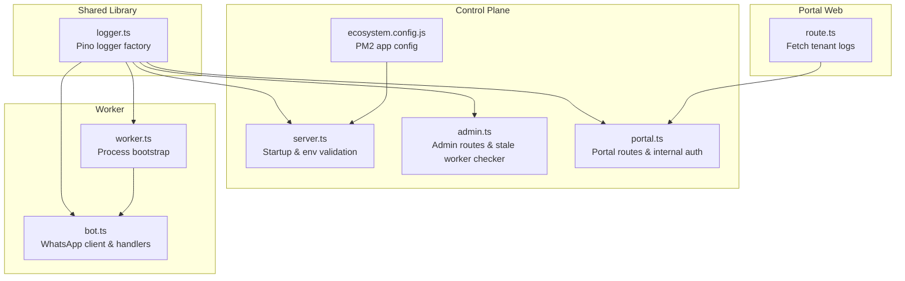
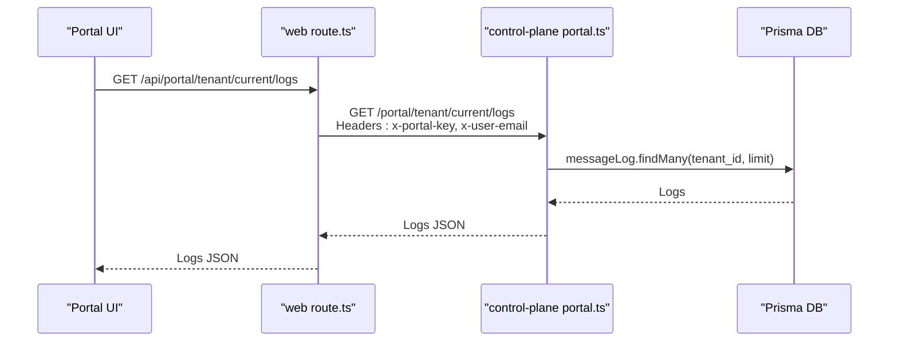
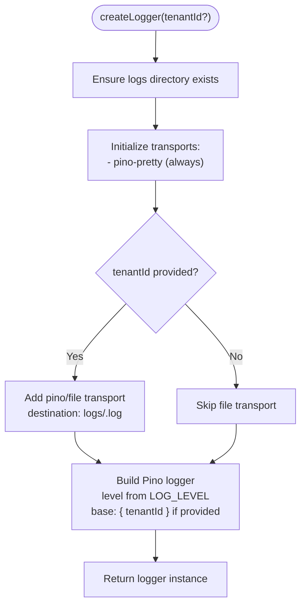
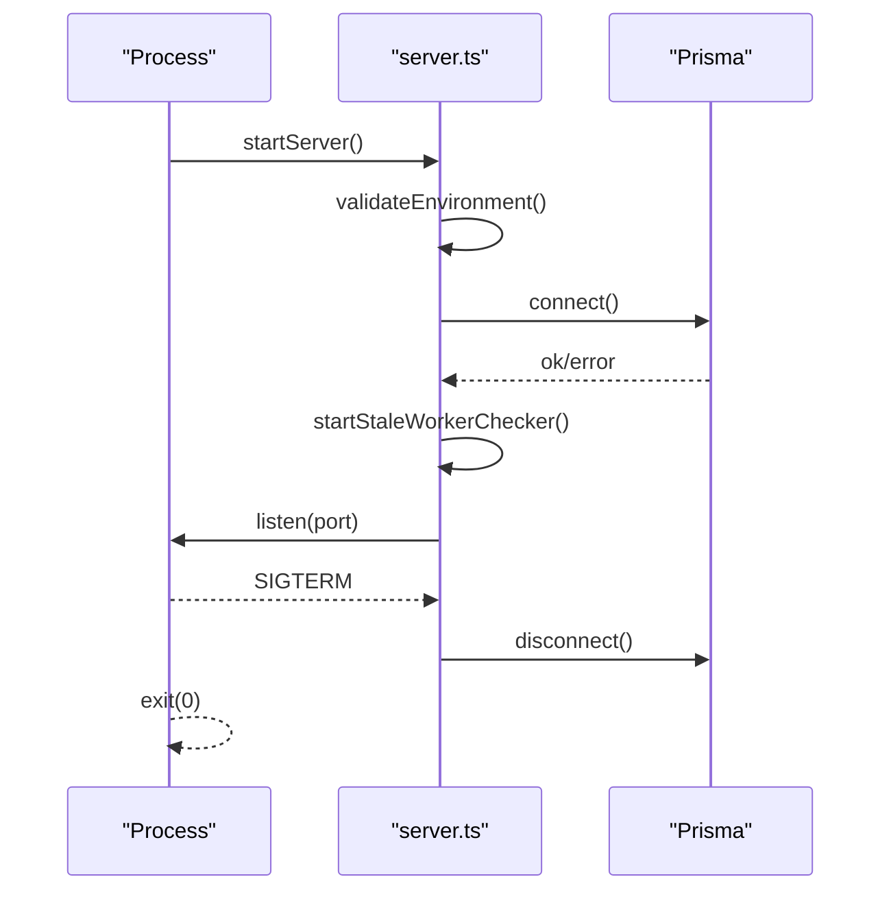
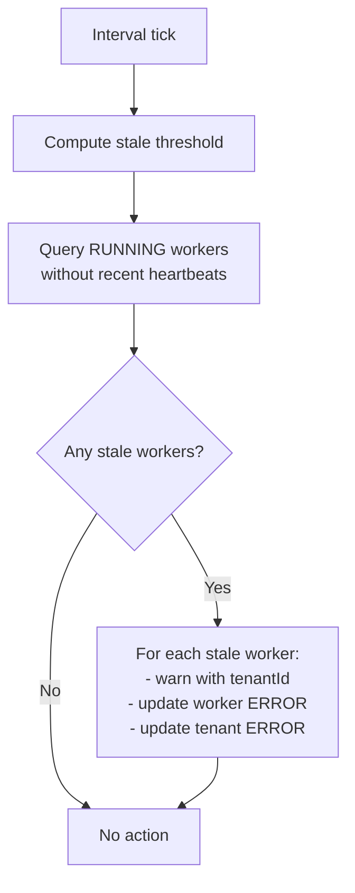
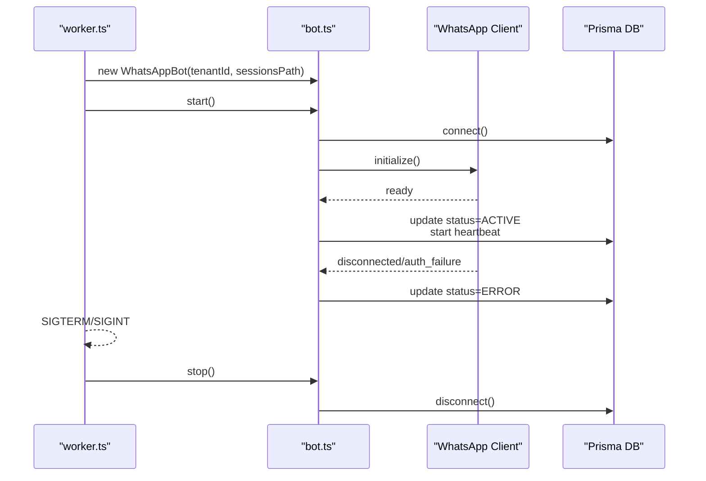
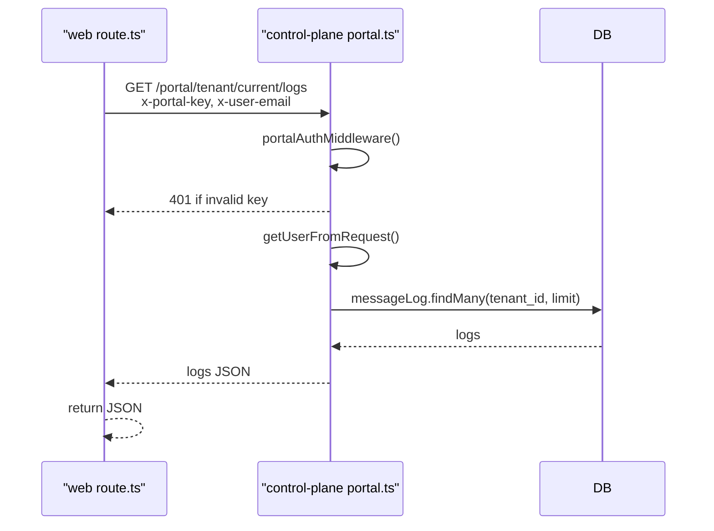
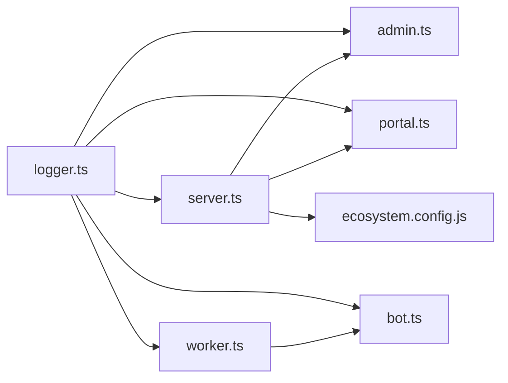

# Logging and Monitoring

<cite>
**Referenced Files in This Document**
- [logger.ts](file://packages/shared/src/utils/logger.ts)
- [server.ts](file://apps/control-plane/src/server.ts)
- [admin.ts](file://apps/control-plane/src/routes/admin.ts)
- [portal.ts](file://apps/control-plane/src/routes/portal.ts)
- [route.ts](file://apps/web/src/app/api/portal/tenant/current/logs/route.ts)
- [worker.ts](file://apps/worker/src/worker.ts)
- [bot.ts](file://apps/worker/src/bot.ts)
- [schema.prisma](file://packages/shared/src/prisma/schema.prisma)
- [ecosystem.config.js](file://ecosystem.config.js)
- [auth.ts](file://apps/control-plane/src/middleware/auth.ts)
- [auth.ts](file://apps/web/src/lib/auth.ts)
</cite>

## Table of Contents
1. [Introduction](#introduction)
2. [Project Structure](#project-structure)
3. [Core Components](#core-components)
4. [Architecture Overview](#architecture-overview)
5. [Detailed Component Analysis](#detailed-component-analysis)
6. [Dependency Analysis](#dependency-analysis)
7. [Performance Considerations](#performance-considerations)
8. [Troubleshooting Guide](#troubleshooting-guide)
9. [Conclusion](#conclusion)
10. [Appendices](#appendices)

## Introduction
This document explains the logging architecture and monitoring systems across the control plane, worker processes, and portal APIs. It covers structured logging with Pino, tenant-aware log file organization, centralized log management via a shared logger, error tracking, performance monitoring, alerting strategies, and practical log analysis and debugging workflows. It also outlines log rotation, retention, aggregation, dashboards, health checks, and operational metrics collection.

## Project Structure
The logging and monitoring system spans three primary areas:
- Shared logger library that creates Pino loggers with optional file transport per tenant
- Control plane service that validates environment, orchestrates background tasks, and exposes admin and portal endpoints
- Worker service that runs per tenant, handles WhatsApp events, and emits tenant-scoped logs



**Diagram sources**
- [logger.ts](file://packages/shared/src/utils/logger.ts#L1-L33)
- [server.ts](file://apps/control-plane/src/server.ts#L1-L89)
- [admin.ts](file://apps/control-plane/src/routes/admin.ts#L1-L528)
- [portal.ts](file://apps/control-plane/src/routes/portal.ts#L1-L246)
- [worker.ts](file://apps/worker/src/worker.ts#L1-L46)
- [bot.ts](file://apps/worker/src/bot.ts#L1-L411)
- [route.ts](file://apps/web/src/app/api/portal/tenant/current/logs/route.ts#L1-L35)
- [ecosystem.config.js](file://ecosystem.config.js#L1-L19)

**Section sources**
- [logger.ts](file://packages/shared/src/utils/logger.ts#L1-L33)
- [server.ts](file://apps/control-plane/src/server.ts#L1-L89)
- [admin.ts](file://apps/control-plane/src/routes/admin.ts#L1-L528)
- [portal.ts](file://apps/control-plane/src/routes/portal.ts#L1-L246)
- [worker.ts](file://apps/worker/src/worker.ts#L1-L46)
- [bot.ts](file://apps/worker/src/bot.ts#L1-L411)
- [route.ts](file://apps/web/src/app/api/portal/tenant/current/logs/route.ts#L1-L35)
- [ecosystem.config.js](file://ecosystem.config.js#L1-L19)

## Core Components
- Structured logger factory: Creates Pino loggers with pretty-printing and optional tenant-specific file transport. Logs are organized by tenant ID in a shared logs directory.
- Control plane server: Validates environment, connects to the database, starts periodic tasks, and listens for requests.
- Admin routes: Orchestrates worker lifecycle, marks stale workers, and exposes tenant logs endpoint.
- Portal routes: Provides tenant-centric endpoints for status, QR, and logs, protected by an internal key.
- Worker process: Initializes WhatsApp client, manages heartbeat, deduplication, rate limiting, and queues, and writes tenant-scoped logs.
- Centralized log management: Tenant logs are written to separate files named by tenant ID; the control plane also maintains its own process logs via PM2.

**Section sources**
- [logger.ts](file://packages/shared/src/utils/logger.ts#L5-L30)
- [server.ts](file://apps/control-plane/src/server.ts#L16-L39)
- [admin.ts](file://apps/control-plane/src/routes/admin.ts#L30-L80)
- [portal.ts](file://apps/control-plane/src/routes/portal.ts#L12-L25)
- [worker.ts](file://apps/worker/src/worker.ts#L10-L15)
- [bot.ts](file://apps/worker/src/bot.ts#L333-L359)
- [ecosystem.config.js](file://ecosystem.config.js#L13-L15)

## Architecture Overview
The system uses a shared Pino logger across services. When a tenant ID is provided, logs are written to a dedicated file under a shared logs directory. The control plane coordinates worker processes and exposes endpoints for logs and status. The portal frontend fetches logs via a controlled route that proxies to the control plane.



**Diagram sources**
- [route.ts](file://apps/web/src/app/api/portal/tenant/current/logs/route.ts#L8-L34)
- [portal.ts](file://apps/control-plane/src/routes/portal.ts#L222-L243)

**Section sources**
- [route.ts](file://apps/web/src/app/api/portal/tenant/current/logs/route.ts#L1-L35)
- [portal.ts](file://apps/control-plane/src/routes/portal.ts#L1-L246)

## Detailed Component Analysis

### Structured Logging with Pino and Tenant File Transport
- Logger creation:
  - Ensures a shared logs directory exists.
  - Adds a pretty-printing transport by default.
  - Adds a file transport when a tenant ID is provided, writing to a file named after the tenant ID.
  - Sets log level from environment and attaches a base field with tenant ID when available.
- Usage sites:
  - Control plane server uses the shared logger for startup, environment validation, and background tasks.
  - Admin routes use the logger for operational events and error reporting.
  - Worker process and bot use the logger for lifecycle, events, and error handling.



**Diagram sources**
- [logger.ts](file://packages/shared/src/utils/logger.ts#L5-L30)

**Section sources**
- [logger.ts](file://packages/shared/src/utils/logger.ts#L1-L33)
- [server.ts](file://apps/control-plane/src/server.ts#L20-L32)
- [admin.ts](file://apps/control-plane/src/routes/admin.ts#L54-L78)
- [worker.ts](file://apps/worker/src/worker.ts#L10-L15)
- [bot.ts](file://apps/worker/src/bot.ts#L333-L359)

### Control Plane Server and Health Monitoring
- Environment validation:
  - Checks required environment variables and exits with error logs if missing.
  - Validates database connectivity and warns about production Puppeteer configuration.
- Startup and lifecycle:
  - Starts a periodic stale worker checker that queries the database and updates worker statuses.
  - Listens on the configured port and logs lifecycle events.
- Graceful shutdown:
  - Disconnects the database on SIGTERM.



**Diagram sources**
- [server.ts](file://apps/control-plane/src/server.ts#L65-L89)

**Section sources**
- [server.ts](file://apps/control-plane/src/server.ts#L16-L39)
- [server.ts](file://apps/control-plane/src/server.ts#L54-L63)
- [server.ts](file://apps/control-plane/src/server.ts#L74-L76)

### Stale Worker Detection and Alerting
- Periodic task:
  - Runs at a configurable interval to compute a stale threshold and mark workers without recent heartbeats as ERROR.
- Logging:
  - Emits warnings with tenant metadata and info logs summarizing actions taken.
- Database updates:
  - Updates worker process and tenant status accordingly.



**Diagram sources**
- [admin.ts](file://apps/control-plane/src/routes/admin.ts#L30-L80)

**Section sources**
- [admin.ts](file://apps/control-plane/src/routes/admin.ts#L11-L12)
- [admin.ts](file://apps/control-plane/src/routes/admin.ts#L30-L80)

### Worker Lifecycle, Heartbeat, and Error Tracking
- Initialization:
  - Requires TENANT_ID; otherwise logs error and exits.
  - Creates a tenant-scoped logger and starts the WhatsApp client.
- Heartbeat:
  - Sends periodic heartbeats updating session last_seen_at and worker status.
- Event handling:
  - QR generation, readiness, disconnections, and auth failures update status and logs.
- Error handling:
  - Catches uncaught exceptions and unhandled rejections, logs them, and ensures graceful shutdown.
- Database logging:
  - Incoming and outgoing messages are persisted to the message logs table.
  - Worker errors are recorded in the worker process table.



**Diagram sources**
- [worker.ts](file://apps/worker/src/worker.ts#L10-L30)
- [bot.ts](file://apps/worker/src/bot.ts#L369-L392)
- [bot.ts](file://apps/worker/src/bot.ts#L98-L151)
- [bot.ts](file://apps/worker/src/bot.ts#L185-L226)
- [bot.ts](file://apps/worker/src/bot.ts#L333-L359)

**Section sources**
- [worker.ts](file://apps/worker/src/worker.ts#L1-L46)
- [bot.ts](file://apps/worker/src/bot.ts#L1-L411)

### Portal Internal Authentication and Secure Log Access
- Internal key enforcement:
  - Portal routes require a valid internal key via a custom header; logs endpoint is protected similarly.
- User context:
  - Extracts user from request headers and enriches responses with tenant and setup request data.
- Frontend proxy:
  - The Next.js route fetches logs from the control plane using the internal key and user email.



**Diagram sources**
- [route.ts](file://apps/web/src/app/api/portal/tenant/current/logs/route.ts#L8-L34)
- [portal.ts](file://apps/control-plane/src/routes/portal.ts#L12-L25)
- [portal.ts](file://apps/control-plane/src/routes/portal.ts#L222-L243)

**Section sources**
- [portal.ts](file://apps/control-plane/src/routes/portal.ts#L12-L25)
- [portal.ts](file://apps/control-plane/src/routes/portal.ts#L222-L243)
- [route.ts](file://apps/web/src/app/api/portal/tenant/current/logs/route.ts#L1-L35)

### Database Schema for Logs and Status
- Message logs:
  - Stores inbound and outbound messages with tenant association and timestamps.
  - Indexed by tenant and created_at for efficient queries.
- Worker processes:
  - Tracks status, last error, and PM2 name for each tenant.
- WhatsApp sessions:
  - Tracks QR state, last QR data URI, and last seen timestamps for heartbeat.
- Users and setup requests:
  - Link users to tenants and track setup request lifecycle.

```mermaid
erDiagram
TENANT {
uuid id PK
string name
string status
timestamp created_at
timestamp updated_at
}
MESSAGE_LOG {
uuid id PK
uuid tenant_id FK
enum direction
string from_number
string to_number
string message_text
string wa_message_id
timestamp created_at
}
WORKER_PROCESS {
uuid id PK
uuid tenant_id FK UK
string pm2_name
enum status
string last_error
timestamp created_at
timestamp updated_at
}
WHATSAPP_SESSION {
uuid id PK
uuid tenant_id FK UK
enum state
string last_qr
timestamp last_seen_at
timestamp created_at
timestamp updated_at
}
USER {
uuid id PK
uuid tenant_id UK
string name
string email UK
string role
timestamp created_at
timestamp updated_at
}
SETUP_REQUEST {
uuid id PK
uuid tenant_id FK
uuid user_id FK
enum status
string notes
timestamp created_at
timestamp updated_at
}
TENANT ||--o{ MESSAGE_LOG : "has many"
TENANT ||--o{ WORKER_PROCESS : "has one"
TENANT ||--o{ WHATSAPP_SESSION : "has one"
TENANT ||--o{ SETUP_REQUEST : "has many"
USER }o--|| TENANT : "belongs to"
SETUP_REQUEST }o--|| TENANT : "belongs to"
```

**Diagram sources**
- [schema.prisma](file://packages/shared/src/prisma/schema.prisma#L60-L177)

**Section sources**
- [schema.prisma](file://packages/shared/src/prisma/schema.prisma#L105-L118)
- [schema.prisma](file://packages/shared/src/prisma/schema.prisma#L120-L131)
- [schema.prisma](file://packages/shared/src/prisma/schema.prisma#L92-L103)
- [schema.prisma](file://packages/shared/src/prisma/schema.prisma#L133-L148)
- [schema.prisma](file://packages/shared/src/prisma/schema.prisma#L150-L164)

## Dependency Analysis
- Logger dependency:
  - Used across control plane, admin routes, portal routes, worker process, and bot.
- Process orchestration:
  - PM2 manages the control plane process and writes separate log files for stdout/stderr.
- Database dependency:
  - All components rely on Prisma for persistence of logs, worker status, and session state.



**Diagram sources**
- [logger.ts](file://packages/shared/src/utils/logger.ts#L1-L33)
- [server.ts](file://apps/control-plane/src/server.ts#L1-L14)
- [admin.ts](file://apps/control-plane/src/routes/admin.ts#L1-L9)
- [portal.ts](file://apps/control-plane/src/routes/portal.ts#L1-L5)
- [worker.ts](file://apps/worker/src/worker.ts#L1-L3)
- [bot.ts](file://apps/worker/src/bot.ts#L1-L10)
- [ecosystem.config.js](file://ecosystem.config.js#L1-L19)

**Section sources**
- [logger.ts](file://packages/shared/src/utils/logger.ts#L1-L33)
- [server.ts](file://apps/control-plane/src/server.ts#L1-L14)
- [admin.ts](file://apps/control-plane/src/routes/admin.ts#L1-L9)
- [portal.ts](file://apps/control-plane/src/routes/portal.ts#L1-L5)
- [worker.ts](file://apps/worker/src/worker.ts#L1-L3)
- [bot.ts](file://apps/worker/src/bot.ts#L1-L10)
- [ecosystem.config.js](file://ecosystem.config.js#L1-L19)

## Performance Considerations
- Log volume and throughput:
  - Tenant-specific files reduce contention and enable targeted analysis.
  - Pretty-printing is suitable for development; ensure production uses minimal formatting overhead.
- Worker performance:
  - Heartbeat intervals and stale thresholds should balance responsiveness with DB load.
  - Deduplication and queue management prevent overload and duplicate processing.
- Database indexing:
  - Indexes on tenant_id and created_at optimize log retrieval for tenants.
- Resource limits:
  - PM2 configuration sets memory thresholds and enables auto-restart to maintain stability.

[No sources needed since this section provides general guidance]

## Troubleshooting Guide
- Missing environment variables:
  - The server logs and exits when required variables are missing.
- Database connectivity:
  - On connection failure, the server logs an error and exits.
- Puppeteer in production:
  - Warns if executable path is not set, which can cause worker startup failures.
- Worker lifecycle:
  - Uncaught exceptions and unhandled rejections are logged; the process exits to trigger restarts.
- Stale workers:
  - Workers without heartbeats are marked ERROR; investigate network or session issues.
- Portal access:
  - Missing or invalid internal key leads to unauthorized responses.
- Log retrieval:
  - If the portal route fails, check the internal key and user email headers passed to the control plane.

**Section sources**
- [server.ts](file://apps/control-plane/src/server.ts#L17-L38)
- [admin.ts](file://apps/control-plane/src/routes/admin.ts#L54-L78)
- [portal.ts](file://apps/control-plane/src/routes/portal.ts#L15-L24)
- [worker.ts](file://apps/worker/src/worker.ts#L38-L45)
- [route.ts](file://apps/web/src/app/api/portal/tenant/current/logs/route.ts#L30-L33)

## Conclusion
The system employs a shared Pino logger with tenant-aware file transport, centralized log management, robust error handling, and heartbeat-driven monitoring. Admin and portal routes expose tenant logs and status, while PM2 provides process-level logging and restart capabilities. With proper environment configuration, indexing, and alerting on stale workers, the system supports reliable operations and effective debugging.

[No sources needed since this section summarizes without analyzing specific files]

## Appendices

### Practical Log Analysis and Debugging Workflows
- Identify tenant logs:
  - Look for files named by tenant ID in the shared logs directory.
- Filter by severity:
  - Adjust LOG_LEVEL to capture more verbose logs during investigations.
- Trace worker lifecycle:
  - Use heartbeat logs to confirm activity; check for ERROR status and last_error entries.
- Investigate stale workers:
  - Review warnings emitted by the stale worker checker and corresponding database updates.
- Monitor message traffic:
  - Use portal logs endpoint to inspect recent messages and directions.

[No sources needed since this section provides general guidance]

### Log Rotation, Retention, and Aggregation
- Current state:
  - Tenant logs are written to individual files; no explicit rotation or retention policy is configured in the repository.
- Recommended practices:
  - Use external log rotation tools to manage file sizes and retention windows.
  - Aggregate logs from the shared logs directory and control plane process logs into a central logging platform for querying and alerting.
  - Tag logs with tenantId for multi-tenant filtering.

[No sources needed since this section provides general guidance]

### Monitoring Dashboards and Operational Metrics
- Heartbeat and status:
  - Visualize worker status and last_seen_at trends to detect downtime.
- Error rates:
  - Track ERROR status counts and last_error frequency per tenant.
- Throughput:
  - Count message logs per tenant over time to estimate traffic.
- Availability:
  - Monitor uptime using PM2 process logs and heartbeat intervals.

[No sources needed since this section provides general guidance]

### Alerting Strategies
- Stale worker detection:
  - Alert when workers remain ERROR beyond acceptable thresholds.
- Database connectivity:
  - Alert on repeated connection failures during server startup.
- Puppeteer configuration:
  - Alert in production when executable path is missing.
- Portal access:
  - Alert on repeated unauthorized responses due to missing internal key.

[No sources needed since this section provides general guidance]