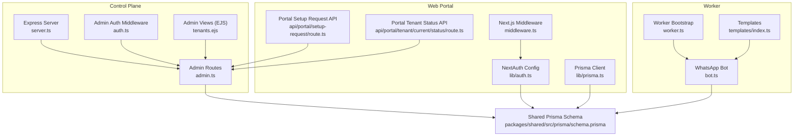
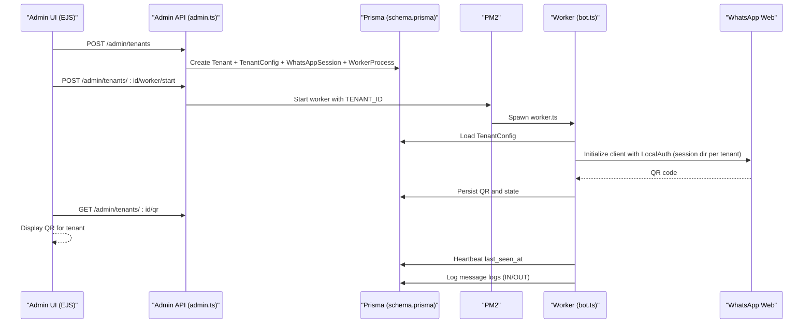
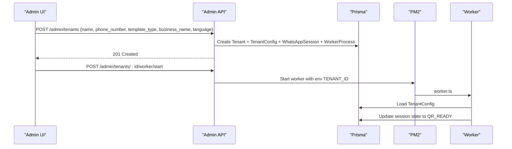
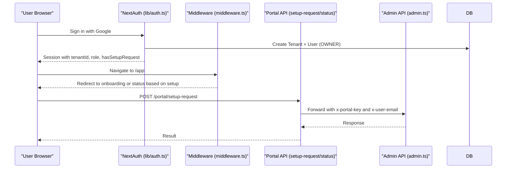
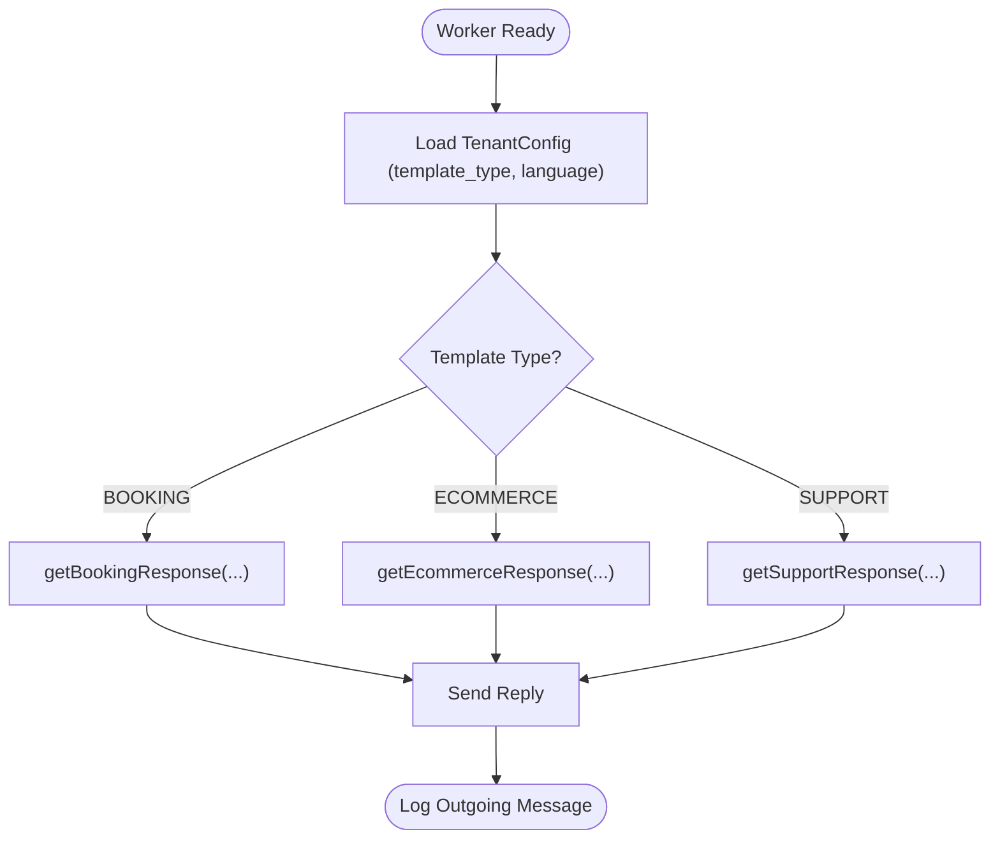
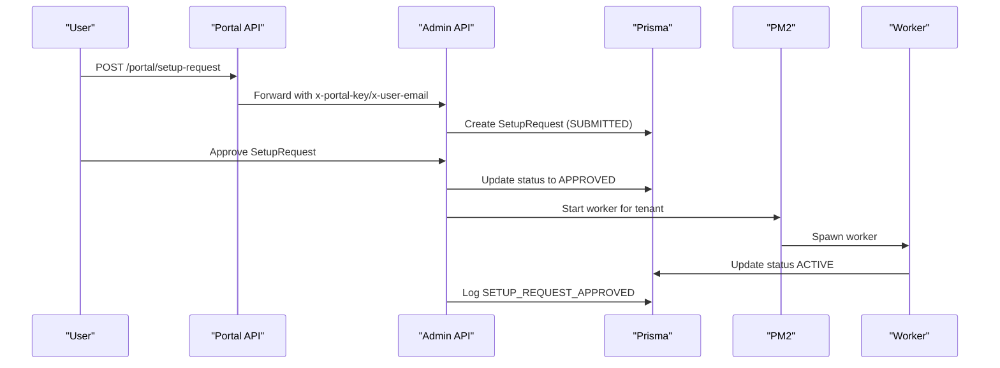
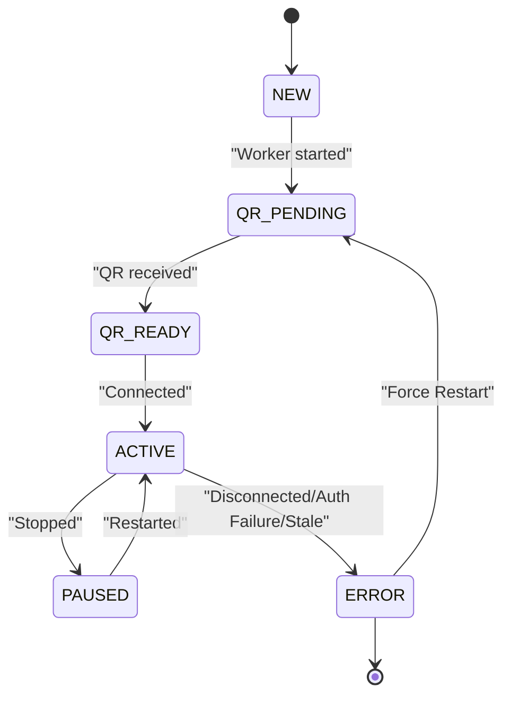
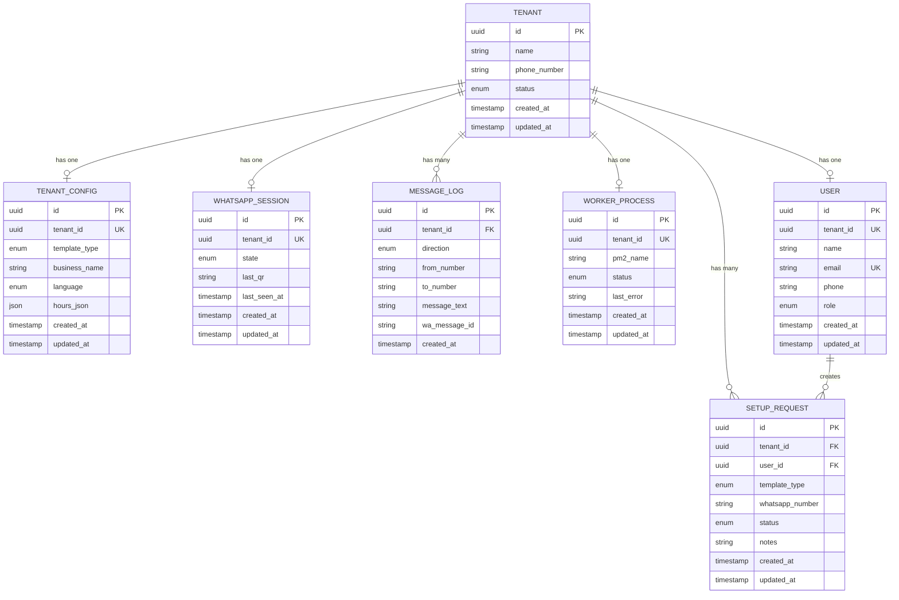
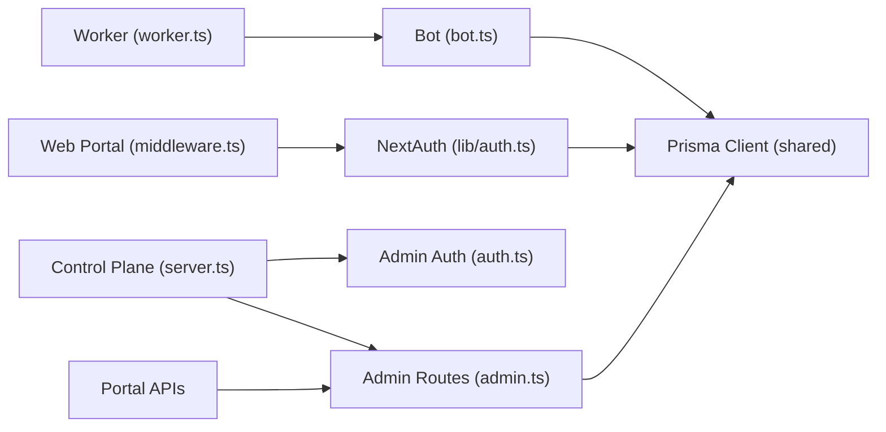

# Multi-Tenant Management

<cite>
**Referenced Files in This Document**
- [README.md](file://README.md)
- [schema.prisma](file://packages/shared/src/prisma/schema.prisma)
- [server.ts](file://apps/control-plane/src/server.ts)
- [admin.ts](file://apps/control-plane/src/routes/admin.ts)
- [auth.ts](file://apps/control-plane/src/middleware/auth.ts)
- [tenants.ejs](file://apps/control-plane/src/views/tenants.ejs)
- [prisma.ts](file://apps/web/src/lib/prisma.ts)
- [middleware.ts](file://apps/web/src/middleware.ts)
- [auth.ts](file://apps/web/src/lib/auth.ts)
- [route.ts](file://apps/web/src/app/api/portal/setup-request/route.ts)
- [route.ts](file://apps/web/src/app/api/portal/tenant/current/status/route.ts)
- [worker.ts](file://apps/worker/src/worker.ts)
- [bot.ts](file://apps/worker/src/bot.ts)
- [index.ts](file://apps/worker/src/templates/index.ts)
- [stress-test.ts](file://scripts/stress-test.ts)
</cite>

## Table of Contents
1. [Introduction](#introduction)
2. [Project Structure](#project-structure)
3. [Core Components](#core-components)
4. [Architecture Overview](#architecture-overview)
5. [Detailed Component Analysis](#detailed-component-analysis)
6. [Dependency Analysis](#dependency-analysis)
7. [Performance Considerations](#performance-considerations)
8. [Troubleshooting Guide](#troubleshooting-guide)
9. [Conclusion](#conclusion)
10. [Appendices](#appendices)

## Introduction
This document explains the Flow HQ multi-tenant management system with a focus on:
- Tenant creation and configuration
- User authentication and authorization patterns
- Template selection and customization
- Setup request workflow
- Prisma multi-tenant database design and tenant isolation
- Tenant lifecycle management from creation to deletion
- Practical examples and administrative control plane operations
- Security considerations for tenant isolation, access control, and data privacy

## Project Structure
The system is organized into three primary applications plus shared packages:
- Control Plane: Admin API and dashboard (Express + EJS)
- Web Portal: Next.js frontend with NextAuth-based user portal
- Worker: Per-tenant WhatsApp bot process
- Shared: Prisma schema, client, and utilities

**Diagram sources**
- [server.ts](file://apps/control-plane/src/server.ts#L1-L89)
- [admin.ts](file://apps/control-plane/src/routes/admin.ts#L1-L528)
- [auth.ts](file://apps/control-plane/src/middleware/auth.ts#L1-L40)
- [tenants.ejs](file://apps/control-plane/src/views/tenants.ejs#L1-L185)
- [middleware.ts](file://apps/web/src/middleware.ts#L1-L44)
- [auth.ts](file://apps/web/src/lib/auth.ts#L1-L76)
- [prisma.ts](file://apps/web/src/lib/prisma.ts#L1-L10)
- [route.ts](file://apps/web/src/app/api/portal/setup-request/route.ts#L1-L40)
- [route.ts](file://apps/web/src/app/api/portal/tenant/current/status/route.ts#L1-L35)
- [worker.ts](file://apps/worker/src/worker.ts#L1-L46)
- [bot.ts](file://apps/worker/src/bot.ts#L1-L395)
- [index.ts](file://apps/worker/src/templates/index.ts#L1-L70)
- [schema.prisma](file://packages/shared/src/prisma/schema.prisma#L1-L178)

**Section sources**
- [README.md](file://README.md#L116-L129)
- [server.ts](file://apps/control-plane/src/server.ts#L1-L89)
- [admin.ts](file://apps/control-plane/src/routes/admin.ts#L1-L528)
- [auth.ts](file://apps/control-plane/src/middleware/auth.ts#L1-L40)
- [tenants.ejs](file://apps/control-plane/src/views/tenants.ejs#L1-L185)
- [middleware.ts](file://apps/web/src/middleware.ts#L1-L44)
- [auth.ts](file://apps/web/src/lib/auth.ts#L1-L76)
- [prisma.ts](file://apps/web/src/lib/prisma.ts#L1-L10)
- [route.ts](file://apps/web/src/app/api/portal/setup-request/route.ts#L1-L40)
- [route.ts](file://apps/web/src/app/api/portal/tenant/current/status/route.ts#L1-L35)
- [worker.ts](file://apps/worker/src/worker.ts#L1-L46)
- [bot.ts](file://apps/worker/src/bot.ts#L1-L395)
- [index.ts](file://apps/worker/src/templates/index.ts#L1-L70)
- [schema.prisma](file://packages/shared/src/prisma/schema.prisma#L1-L178)

## Core Components
- Control Plane Admin API and Dashboard
  - Provides tenant CRUD, worker lifecycle controls, QR retrieval, and logs.
  - Uses admin authentication via password or Basic Auth.
- Web Portal
  - NextAuth-based user portal with middleware enforcing session and onboarding flows.
  - Integrates with Control Plane via internal keys for secure portal-to-control-plane calls.
- Worker
  - Per-tenant WhatsApp bot with session isolation, heartbeat, rate limiting, and resilience features.
- Shared Prisma Schema
  - Defines tenant isolation via tenant_id foreign keys and enums for statuses and roles.

Key implementation references:
- Admin routes and worker lifecycle: [admin.ts](file://apps/control-plane/src/routes/admin.ts#L104-L283)
- Admin auth middleware: [auth.ts](file://apps/control-plane/src/middleware/auth.ts#L5-L28)
- Control plane server bootstrap and background tasks: [server.ts](file://apps/control-plane/src/server.ts#L65-L81)
- Portal NextAuth and middleware: [auth.ts](file://apps/web/src/lib/auth.ts#L14-L70), [middleware.ts](file://apps/web/src/middleware.ts#L1-L44)
- Worker bootstrap and bot lifecycle: [worker.ts](file://apps/worker/src/worker.ts#L17-L24), [bot.ts](file://apps/worker/src/bot.ts#L353-L376)
- Prisma schema multi-tenant relations: [schema.prisma](file://packages/shared/src/prisma/schema.prisma#L60-L148)

**Section sources**
- [admin.ts](file://apps/control-plane/src/routes/admin.ts#L104-L283)
- [auth.ts](file://apps/control-plane/src/middleware/auth.ts#L5-L28)
- [server.ts](file://apps/control-plane/src/server.ts#L65-L81)
- [auth.ts](file://apps/web/src/lib/auth.ts#L14-L70)
- [middleware.ts](file://apps/web/src/middleware.ts#L1-L44)
- [worker.ts](file://apps/worker/src/worker.ts#L17-L24)
- [bot.ts](file://apps/worker/src/bot.ts#L353-L376)
- [schema.prisma](file://packages/shared/src/prisma/schema.prisma#L60-L148)

## Architecture Overview
The system enforces tenant isolation at multiple layers:
- Database-level isolation via tenant_id foreign keys and unique constraints
- Process-level isolation via per-tenant PM2 worker processes
- Session-level isolation via per-tenant session directories and WhatsApp sessions
- API-level isolation via admin authentication and portal internal keys

**Diagram sources**
- [admin.ts](file://apps/control-plane/src/routes/admin.ts#L104-L140)
- [admin.ts](file://apps/control-plane/src/routes/admin.ts#L174-L230)
- [schema.prisma](file://packages/shared/src/prisma/schema.prisma#L60-L148)
- [worker.ts](file://apps/worker/src/worker.ts#L17-L24)
- [bot.ts](file://apps/worker/src/bot.ts#L77-L135)
- [tenants.ejs](file://apps/control-plane/src/views/tenants.ejs#L158-L182)

**Section sources**
- [admin.ts](file://apps/control-plane/src/routes/admin.ts#L104-L140)
- [admin.ts](file://apps/control-plane/src/routes/admin.ts#L174-L230)
- [schema.prisma](file://packages/shared/src/prisma/schema.prisma#L60-L148)
- [worker.ts](file://apps/worker/src/worker.ts#L17-L24)
- [bot.ts](file://apps/worker/src/bot.ts#L77-L135)
- [tenants.ejs](file://apps/control-plane/src/views/tenants.ejs#L158-L182)

## Detailed Component Analysis

### Tenant Creation and Configuration
- Admin creates a tenant with associated TenantConfig, WhatsAppSession, and WorkerProcess.
- The admin dashboard form posts to the admin API, which persists the tenant and initializes related records.
- The worker is started via PM2 with environment variables for TENANT_ID and SESSIONS_PATH.

**Diagram sources**
- [admin.ts](file://apps/control-plane/src/routes/admin.ts#L104-L140)
- [admin.ts](file://apps/control-plane/src/routes/admin.ts#L174-L230)
- [schema.prisma](file://packages/shared/src/prisma/schema.prisma#L60-L148)
- [worker.ts](file://apps/worker/src/worker.ts#L17-L24)
- [bot.ts](file://apps/worker/src/bot.ts#L212-L230)

**Section sources**
- [admin.ts](file://apps/control-plane/src/routes/admin.ts#L104-L140)
- [tenants.ejs](file://apps/control-plane/src/views/tenants.ejs#L42-L74)
- [schema.prisma](file://packages/shared/src/prisma/schema.prisma#L60-L148)

### User Authentication and Authorization Patterns
- Admin access control: Password or Basic Auth via admin middleware.
- Portal access control: NextAuth with Google provider, protected middleware, and session callbacks enriching session with tenant and setup request metadata.
- Portal-to-Control Plane calls use internal keys for additional protection.

**Diagram sources**
- [auth.ts](file://apps/web/src/lib/auth.ts#L14-L70)
- [middleware.ts](file://apps/web/src/middleware.ts#L1-L44)
- [route.ts](file://apps/web/src/app/api/portal/setup-request/route.ts#L18-L34)
- [route.ts](file://apps/web/src/app/api/portal/tenant/current/status/route.ts#L16-L30)
- [admin.ts](file://apps/control-plane/src/routes/admin.ts#L419-L489)

**Section sources**
- [auth.ts](file://apps/control-plane/src/middleware/auth.ts#L5-L28)
- [auth.ts](file://apps/web/src/lib/auth.ts#L14-L70)
- [middleware.ts](file://apps/web/src/middleware.ts#L1-L44)
- [route.ts](file://apps/web/src/app/api/portal/setup-request/route.ts#L18-L34)
- [route.ts](file://apps/web/src/app/api/portal/tenant/current/status/route.ts#L16-L30)
- [admin.ts](file://apps/control-plane/src/routes/admin.ts#L419-L489)

### Template Selection and Customization
- Templates are selected via TenantConfig.template_type and language.
- The worker loads the tenant’s configuration and selects a response generator based on template_type.
- New templates can be added by extending the template index and updating the Prisma enum if needed.

**Diagram sources**
- [bot.ts](file://apps/worker/src/bot.ts#L212-L230)
- [index.ts](file://apps/worker/src/templates/index.ts#L9-L23)

**Section sources**
- [index.ts](file://apps/worker/src/templates/index.ts#L1-L70)
- [bot.ts](file://apps/worker/src/bot.ts#L212-L230)
- [schema.prisma](file://packages/shared/src/prisma/schema.prisma#L78-L90)

### Setup Request Workflow
- Users submit setup requests from the portal; the portal forwards to the admin API with internal keys.
- Admin reviews and approves or rejects setup requests; approval triggers worker start and status updates.
- Events are logged for auditability.

**Diagram sources**
- [route.ts](file://apps/web/src/app/api/portal/setup-request/route.ts#L18-L34)
- [admin.ts](file://apps/control-plane/src/routes/admin.ts#L373-L489)
- [schema.prisma](file://packages/shared/src/prisma/schema.prisma#L150-L164)
- [worker.ts](file://apps/worker/src/worker.ts#L17-L24)

**Section sources**
- [route.ts](file://apps/web/src/app/api/portal/setup-request/route.ts#L1-L40)
- [admin.ts](file://apps/control-plane/src/routes/admin.ts#L373-L489)
- [schema.prisma](file://packages/shared/src/prisma/schema.prisma#L150-L164)

### Tenant Lifecycle Management
- Creation: Tenant + TenantConfig + WhatsAppSession + WorkerProcess created atomically.
- Activation: Worker starts, QR is generated, session state transitions to QR_READY, then ACTIVE.
- Monitoring: Heartbeat updates last_seen_at; stale workers are auto-detected and marked ERROR.
- Deletion: Stress test demonstrates cascading deletion of tenant and related records.

**Diagram sources**
- [schema.prisma](file://packages/shared/src/prisma/schema.prisma#L10-L16)
- [bot.ts](file://apps/worker/src/bot.ts#L98-L135)
- [admin.ts](file://apps/control-plane/src/routes/admin.ts#L30-L80)
- [stress-test.ts](file://scripts/stress-test.ts#L314-L324)

**Section sources**
- [admin.ts](file://apps/control-plane/src/routes/admin.ts#L104-L140)
- [bot.ts](file://apps/worker/src/bot.ts#L98-L135)
- [admin.ts](file://apps/control-plane/src/routes/admin.ts#L30-L80)
- [stress-test.ts](file://scripts/stress-test.ts#L314-L324)

### Prisma Multi-Tenant Database Design
- Tenant is the root entity; all other entities are linked via tenant_id.
- Unique constraints ensure one-to-one relationships (TenantConfig, WhatsAppSession, WorkerProcess).
- Indexes optimize tenant-scoped queries (e.g., message logs by tenant and time).
- Enums define statuses and roles consistently across the system.

**Diagram sources**
- [schema.prisma](file://packages/shared/src/prisma/schema.prisma#L60-L177)

**Section sources**
- [schema.prisma](file://packages/shared/src/prisma/schema.prisma#L60-L177)

### Practical Examples
- Admin dashboard tenant creation and worker controls:
  - Form fields: business name, phone number, template type, display name, language.
  - Actions: Start, Stop, Restart, Force Restart; View details and logs.
- User onboarding and portal flows:
  - NextAuth sign-in with Google; automatic tenant/user creation.
  - Redirects to onboarding or status depending on setup request presence.
- Administrative management:
  - Approve or reject setup requests; monitor worker health and logs.

**Section sources**
- [tenants.ejs](file://apps/control-plane/src/views/tenants.ejs#L42-L74)
- [tenants.ejs](file://apps/control-plane/src/views/tenants.ejs#L158-L182)
- [auth.ts](file://apps/web/src/lib/auth.ts#L14-L70)
- [middleware.ts](file://apps/web/src/middleware.ts#L1-L44)
- [admin.ts](file://apps/control-plane/src/routes/admin.ts#L419-L489)

## Dependency Analysis
- Control Plane depends on shared Prisma client and admin middleware.
- Web Portal depends on NextAuth and Prisma adapter; communicates with Admin API via internal keys.
- Worker depends on Prisma client and local session storage; connects to WhatsApp Web.

**Diagram sources**
- [server.ts](file://apps/control-plane/src/server.ts#L1-L89)
- [admin.ts](file://apps/control-plane/src/routes/admin.ts#L1-L528)
- [auth.ts](file://apps/control-plane/src/middleware/auth.ts#L1-L40)
- [middleware.ts](file://apps/web/src/middleware.ts#L1-L44)
- [auth.ts](file://apps/web/src/lib/auth.ts#L1-L76)
- [prisma.ts](file://apps/web/src/lib/prisma.ts#L1-L10)
- [worker.ts](file://apps/worker/src/worker.ts#L1-L46)
- [bot.ts](file://apps/worker/src/bot.ts#L1-L395)

**Section sources**
- [server.ts](file://apps/control-plane/src/server.ts#L1-L89)
- [admin.ts](file://apps/control-plane/src/routes/admin.ts#L1-L528)
- [auth.ts](file://apps/control-plane/src/middleware/auth.ts#L1-L40)
- [middleware.ts](file://apps/web/src/middleware.ts#L1-L44)
- [auth.ts](file://apps/web/src/lib/auth.ts#L1-L76)
- [prisma.ts](file://apps/web/src/lib/prisma.ts#L1-L10)
- [worker.ts](file://apps/worker/src/worker.ts#L1-L46)
- [bot.ts](file://apps/worker/src/bot.ts#L1-L395)

## Performance Considerations
- Per-tenant isolation prevents cross-tenant contention and improves reliability.
- Worker heartbeat and stale detection prevent zombie workers from consuming resources.
- Rate limiting per tenant protects downstream services and ensures fair usage.
- Message de-duplication and per-chat queues avoid redundant processing and maintain ordering.
- Database indexes on tenant_id and timestamps optimize tenant-scoped queries.

[No sources needed since this section provides general guidance]

## Troubleshooting Guide
- QR code not appearing:
  - Check worker logs and ensure worker started; confirm PM2 status.
- Session not persisting:
  - Verify sessions directory exists and is writable; confirm SESSIONS_PATH environment variable.
- Database connection errors:
  - Verify PostgreSQL is running and DATABASE_URL format is correct.
- WhatsApp Web errors:
  - Ensure Chromium installation and PUPPETEER_EXECUTABLE_PATH configured in production.
- Stale workers:
  - Dashboard shows STALE when worker has not sent heartbeat for threshold minutes; use Force Restart.

**Section sources**
- [README.md](file://README.md#L185-L208)
- [README.md](file://README.md#L452-L474)
- [admin.ts](file://apps/control-plane/src/routes/admin.ts#L30-L80)

## Conclusion
Flow HQ implements robust multi-tenant isolation across database, process, session, and API layers. The admin control plane provides comprehensive tenant lifecycle management, while the portal enables seamless user onboarding and setup request workflows. The worker embeds stability features to ensure reliable per-tenant operations, and the shared Prisma schema enforces data segregation and auditability.

[No sources needed since this section summarizes without analyzing specific files]

## Appendices

### Security Considerations
- Tenant isolation:
  - Database foreign keys and unique constraints enforce strict tenant boundaries.
  - Stress test validates isolation across logs, sessions, and worker processes.
- Access control:
  - Admin endpoints require admin password via Basic Auth or query parameter.
  - Portal-to-control-plane calls use internal keys and user identity headers.
- Data privacy:
  - WhatsApp sessions are stored locally per tenant; ensure secure storage and backups.
  - Logs and message history are tenant-scoped; apply retention policies as needed.

**Section sources**
- [stress-test.ts](file://scripts/stress-test.ts#L137-L256)
- [auth.ts](file://apps/control-plane/src/middleware/auth.ts#L5-L28)
- [route.ts](file://apps/web/src/app/api/portal/setup-request/route.ts#L18-L26)