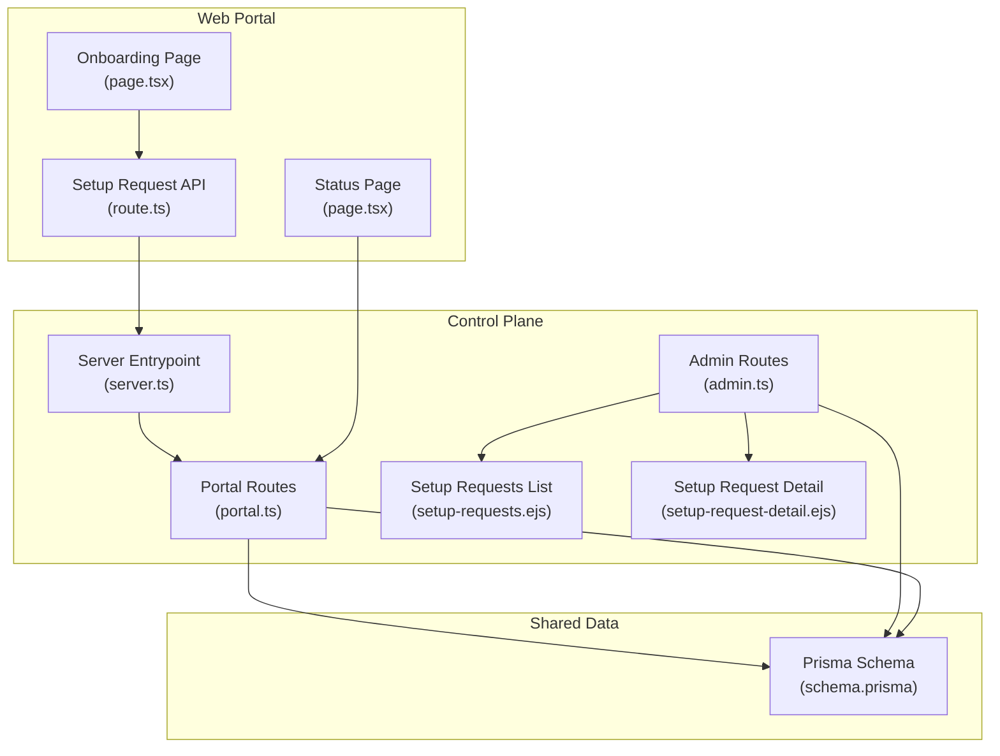
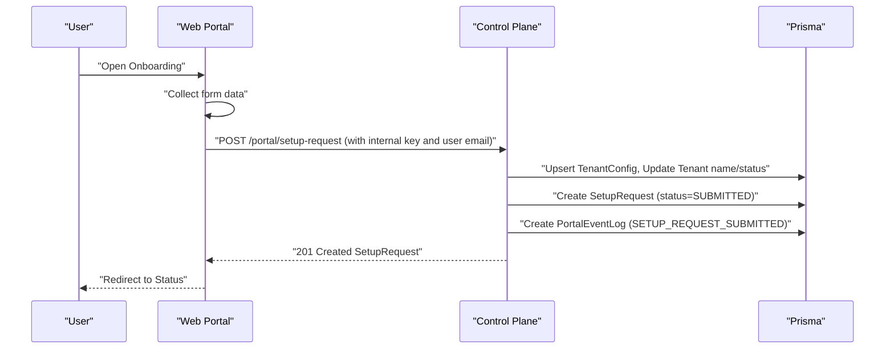
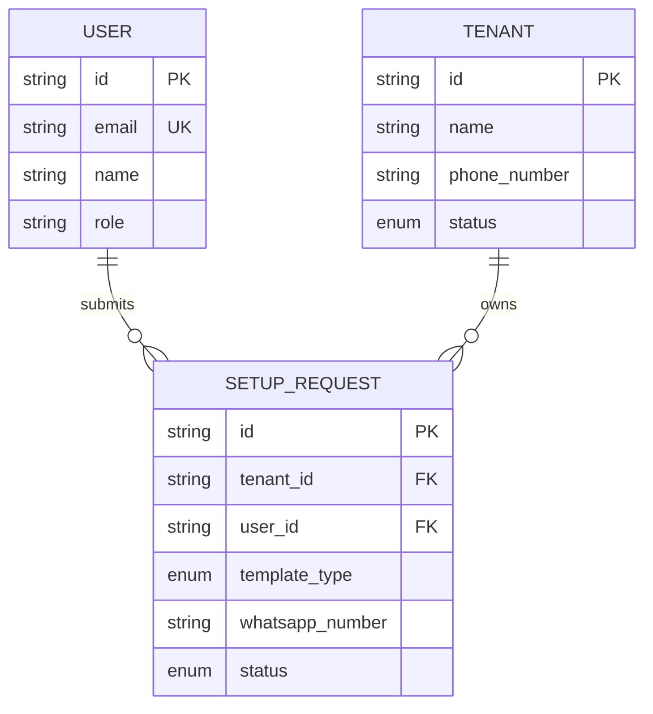
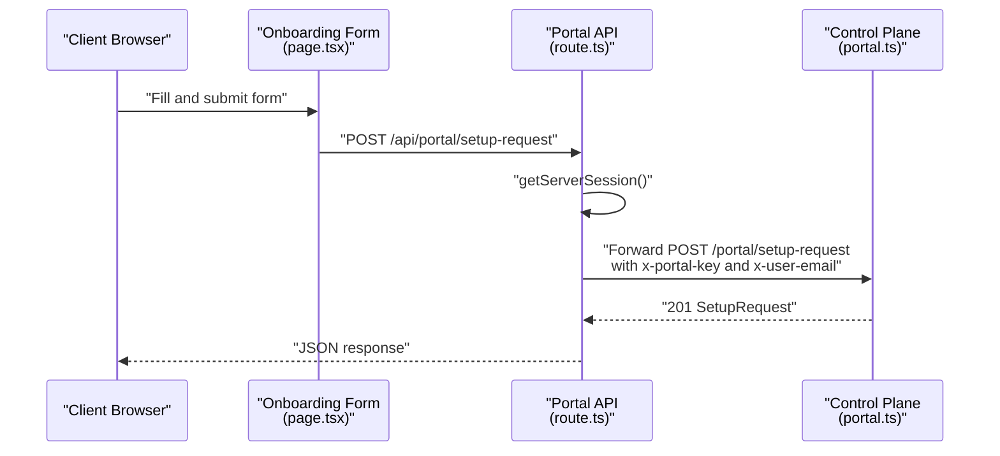
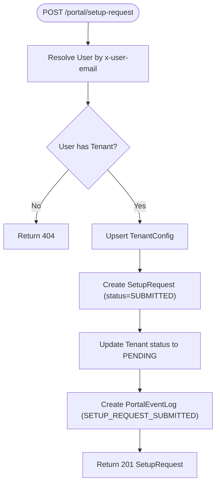
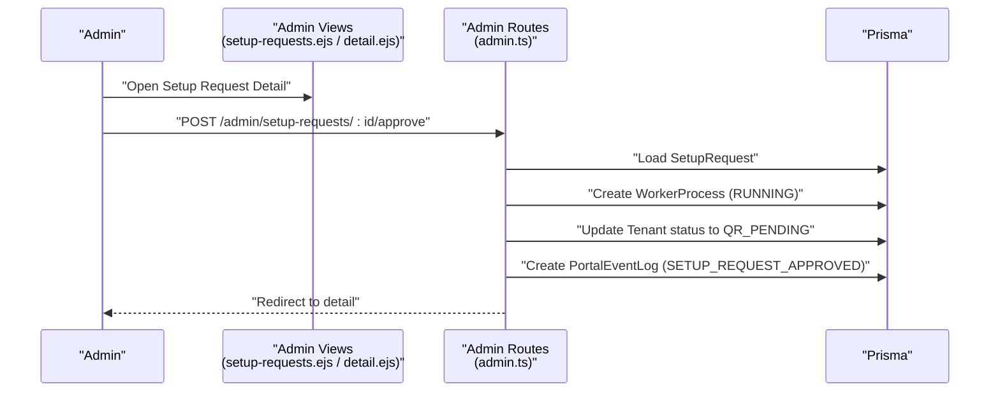
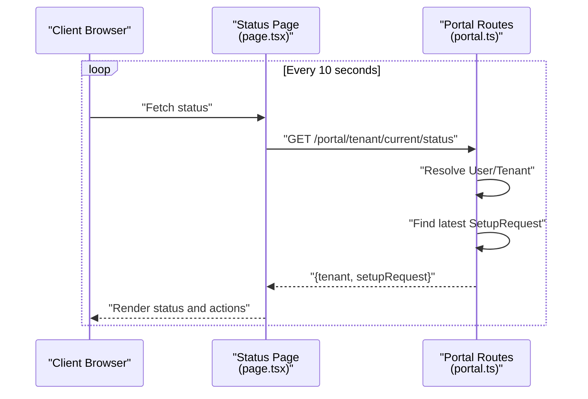
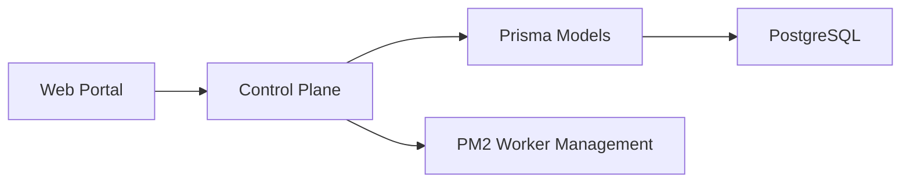

# Setup Request Workflow

<cite>
**Referenced Files in This Document**
- [schema.prisma](file://packages/shared/src/prisma/schema.prisma)
- [route.ts](file://apps/web/src/app/api/portal/setup-request/route.ts)
- [page.tsx](file://apps/web/src/app/(portal)/app/onboarding/page.tsx)
- [page.tsx](file://apps/web/src/app/(portal)/app/status/page.tsx)
- [portal.ts](file://apps/control-plane/src/routes/portal.ts)
- [admin.ts](file://apps/control-plane/src/routes/admin.ts)
- [server.ts](file://apps/control-plane/src/server.ts)
- [setup-requests.ejs](file://apps/control-plane/src/views/setup-requests.ejs)
- [setup-request-detail.ejs](file://apps/control-plane/src/views/setup-request-detail.ejs)
</cite>

## Table of Contents
1. [Introduction](#introduction)
2. [Project Structure](#project-structure)
3. [Core Components](#core-components)
4. [Architecture Overview](#architecture-overview)
5. [Detailed Component Analysis](#detailed-component-analysis)
6. [Dependency Analysis](#dependency-analysis)
7. [Performance Considerations](#performance-considerations)
8. [Troubleshooting Guide](#troubleshooting-guide)
9. [Conclusion](#conclusion)

## Introduction
This document explains the setup request workflow system in Flow HQ. It covers the complete lifecycle from submission via the web portal through administrative review and approval to tenant activation. It documents status management (SUBMITTED, REVIEWING, APPROVED, ACTIVE, REJECTED), model relationships among SetupRequest, Tenant, and User, validation and processing logic, and integration with tenant activation and monitoring.

## Project Structure
The setup request workflow spans three layers:
- Web Portal (Next.js): Collects user input, submits requests, and displays status
- Control Plane (Express): Validates portal submissions, persists data, manages approvals, and triggers activations
- Shared Data Model (Prisma): Defines SetupRequest, Tenant, and User relationships and statuses

**Diagram sources**
- [server.ts](file://apps/control-plane/src/server.ts#L1-L89)
- [portal.ts](file://apps/control-plane/src/routes/portal.ts#L1-L246)
- [admin.ts](file://apps/control-plane/src/routes/admin.ts#L1-L200)
- [setup-requests.ejs](file://apps/control-plane/src/views/setup-requests.ejs#L1-L97)
- [setup-request-detail.ejs](file://apps/control-plane/src/views/setup-request-detail.ejs#L1-L175)
- [schema.prisma](file://packages/shared/src/prisma/schema.prisma#L150-L164)

**Section sources**
- [server.ts](file://apps/control-plane/src/server.ts#L1-L89)
- [portal.ts](file://apps/control-plane/src/routes/portal.ts#L1-L246)
- [admin.ts](file://apps/control-plane/src/routes/admin.ts#L1-L200)
- [setup-requests.ejs](file://apps/control-plane/src/views/setup-requests.ejs#L1-L97)
- [setup-request-detail.ejs](file://apps/control-plane/src/views/setup-request-detail.ejs#L1-L175)
- [schema.prisma](file://packages/shared/src/prisma/schema.prisma#L150-L164)

## Core Components
- SetupRequest model: Stores request metadata, links to Tenant and User, tracks status, and supports optional notes
- Tenant model: Represents a business unit with status and associated child entities
- User model: Links to a Tenant and participates in setup requests
- Portal routes: Validate internal key, resolve user by email, create setup requests, and expose status endpoints
- Admin routes: Approve/reject setup requests, start workers, and render admin UI
- Web portal pages: Onboarding form and status dashboard

Key implementation references:
- SetupRequest model definition and status enum
- Portal route for creating setup requests
- Admin route for approving setup requests and starting workers
- Web onboarding form and status polling

**Section sources**
- [schema.prisma](file://packages/shared/src/prisma/schema.prisma#L52-L58)
- [schema.prisma](file://packages/shared/src/prisma/schema.prisma#L150-L164)
- [portal.ts](file://apps/control-plane/src/routes/portal.ts#L85-L153)
- [admin.ts](file://apps/control-plane/src/routes/admin.ts#L456-L489)
- [page.tsx](file://apps/web/src/app/(portal)/app/onboarding/page.tsx#L1-L115)
- [page.tsx](file://apps/web/src/app/(portal)/app/status/page.tsx#L1-L160)

## Architecture Overview
The system enforces a strict separation of concerns:
- Web Portal validates user session and forwards a request to the Control Plane
- Control Plane authenticates via internal key and user email, persists the setup request, updates tenant status, and logs events
- Admin UI surfaces setup requests, allows approvals/rejections, and starts workers
- Worker lifecycle is managed by the Control Plane and reflected in tenant status

**Diagram sources**
- [route.ts](file://apps/web/src/app/api/portal/setup-request/route.ts#L1-L40)
- [portal.ts](file://apps/control-plane/src/routes/portal.ts#L85-L153)

## Detailed Component Analysis

### SetupRequest Model and Relationships
The SetupRequest entity connects Users and Tenants, carries template selection and WhatsApp number, and maintains lifecycle status. It is central to the approval workflow.

**Diagram sources**
- [schema.prisma](file://packages/shared/src/prisma/schema.prisma#L133-L148)
- [schema.prisma](file://packages/shared/src/prisma/schema.prisma#L60-L76)
- [schema.prisma](file://packages/shared/src/prisma/schema.prisma#L150-L164)

**Section sources**
- [schema.prisma](file://packages/shared/src/prisma/schema.prisma#L52-L58)
- [schema.prisma](file://packages/shared/src/prisma/schema.prisma#L150-L164)

### Web Portal: Setup Request Creation
The portal collects business details, template type, WhatsApp number, and language, then posts to the Control Plane. The API wrapper ensures authentication and forwards the request.

**Diagram sources**
- [page.tsx](file://apps/web/src/app/(portal)/app/onboarding/page.tsx#L19-L38)
- [route.ts](file://apps/web/src/app/api/portal/setup-request/route.ts#L8-L39)
- [portal.ts](file://apps/control-plane/src/routes/portal.ts#L85-L153)

**Section sources**
- [page.tsx](file://apps/web/src/app/(portal)/app/onboarding/page.tsx#L1-L115)
- [route.ts](file://apps/web/src/app/api/portal/setup-request/route.ts#L1-L40)
- [portal.ts](file://apps/control-plane/src/routes/portal.ts#L85-L153)

### Control Plane: Validation and Persistence
The portal route validates the internal key and user email, resolves the user and tenant, updates tenant metadata, creates or upserts TenantConfig, creates SetupRequest with status SUBMITTED, sets tenant status to PENDING, and logs a portal event.

**Diagram sources**
- [portal.ts](file://apps/control-plane/src/routes/portal.ts#L85-L153)

**Section sources**
- [portal.ts](file://apps/control-plane/src/routes/portal.ts#L12-L46)
- [portal.ts](file://apps/control-plane/src/routes/portal.ts#L85-L153)

### Admin Review and Approval
Administrators review setup requests in the admin UI. When approved, the system starts the worker process, transitions tenant status to QR_PENDING, and records an event log. Rejection requires a reason and updates the setup request status accordingly.

**Diagram sources**
- [setup-request-detail.ejs](file://apps/control-plane/src/views/setup-request-detail.ejs#L120-L143)
- [admin.ts](file://apps/control-plane/src/routes/admin.ts#L456-L489)

**Section sources**
- [setup-requests.ejs](file://apps/control-plane/src/views/setup-requests.ejs#L69-L96)
- [setup-request-detail.ejs](file://apps/control-plane/src/views/setup-request-detail.ejs#L120-L143)
- [admin.ts](file://apps/control-plane/src/routes/admin.ts#L456-L489)

### Status Tracking and Activation
The portal status page polls tenant and setup request status, displaying badges and actionable steps. After approval, the system moves to QR_PENDING and later ACTIVE upon successful worker operation.

**Diagram sources**
- [page.tsx](file://apps/web/src/app/(portal)/app/status/page.tsx#L24-L44)
- [portal.ts](file://apps/control-plane/src/routes/portal.ts#L159-L186)

**Section sources**
- [page.tsx](file://apps/web/src/app/(portal)/app/status/page.tsx#L1-L160)
- [portal.ts](file://apps/control-plane/src/routes/portal.ts#L159-L186)

### Request Validation and Auditing
- Validation: The portal route validates presence of internal key and user email, ensures the user exists and belongs to a tenant, and extracts form fields
- Auditing: PortalEventLog captures SETUP_REQUEST_SUBMITTED and SETUP_REQUEST_APPROVED events with payload context

**Section sources**
- [portal.ts](file://apps/control-plane/src/routes/portal.ts#L12-L25)
- [portal.ts](file://apps/control-plane/src/routes/portal.ts#L30-L46)
- [portal.ts](file://apps/control-plane/src/routes/portal.ts#L139-L146)
- [portal.ts](file://apps/control-plane/src/routes/portal.ts#L476-L482)

### Practical Examples
- Setup request form fields: businessName, businessType, templateType, whatsappNumber, language
- Approval workflow: Approve button initiates worker start and tenant status change
- Rejection reason: Required field for rejection notes
- Status tracking: Color-coded badges and polling every 10 seconds

**Section sources**
- [page.tsx](file://apps/web/src/app/(portal)/app/onboarding/page.tsx#L11-L17)
- [setup-request-detail.ejs](file://apps/control-plane/src/views/setup-request-detail.ejs#L126-L140)
- [page.tsx](file://apps/web/src/app/(portal)/app/status/page.tsx#L48-L64)

## Dependency Analysis
The system exhibits clean separation:
- Web Portal depends on Control Plane for persistence and status
- Control Plane depends on Prisma for data access and logging
- Admin UI depends on Control Plane routes and Prisma models
- Tenant activation depends on worker lifecycle management

**Diagram sources**
- [server.ts](file://apps/control-plane/src/server.ts#L1-L89)
- [portal.ts](file://apps/control-plane/src/routes/portal.ts#L1-L246)
- [admin.ts](file://apps/control-plane/src/routes/admin.ts#L1-L200)
- [schema.prisma](file://packages/shared/src/prisma/schema.prisma#L1-L178)

**Section sources**
- [server.ts](file://apps/control-plane/src/server.ts#L1-L89)
- [portal.ts](file://apps/control-plane/src/routes/portal.ts#L1-L246)
- [admin.ts](file://apps/control-plane/src/routes/admin.ts#L1-L200)
- [schema.prisma](file://packages/shared/src/prisma/schema.prisma#L1-L178)

## Performance Considerations
- Worker startup and PM2 management: Ensure PM2 executable availability and appropriate environment variables
- Background checks: Stale worker detection runs on an interval; tune interval and thresholds for production
- Status polling: Client-side polling every 10 seconds balances responsiveness with load; consider backoff strategies for idle tenants

[No sources needed since this section provides general guidance]

## Troubleshooting Guide
Common issues and remedies:
- Missing environment variables: Internal key, admin password, portal internal key, database URL
- Unauthorized portal key: Verify x-portal-key header matches configuration
- User not found: Confirm x-user-email corresponds to an existing user
- Tenant not found: Ensure the user belongs to a tenant before submitting a setup request
- Worker start failures: Check PM2 installation and executable path; review logs and event logs for errors

**Section sources**
- [server.ts](file://apps/control-plane/src/server.ts#L17-L39)
- [portal.ts](file://apps/control-plane/src/routes/portal.ts#L12-L25)
- [portal.ts](file://apps/control-plane/src/routes/portal.ts#L89-L95)
- [admin.ts](file://apps/control-plane/src/routes/admin.ts#L174-L200)

## Conclusion
The setup request workflow integrates the web portal, control plane, and shared data model to provide a robust, auditable, and manageable onboarding experience. Administrators can review, approve, and activate tenants while users receive timely status updates and clear next steps.