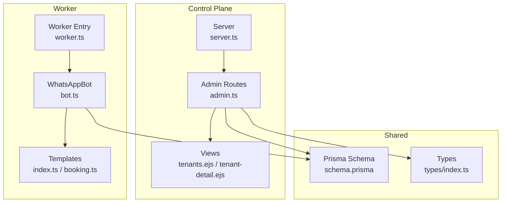
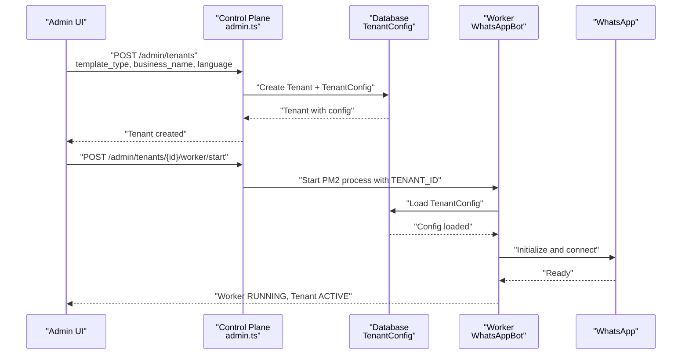
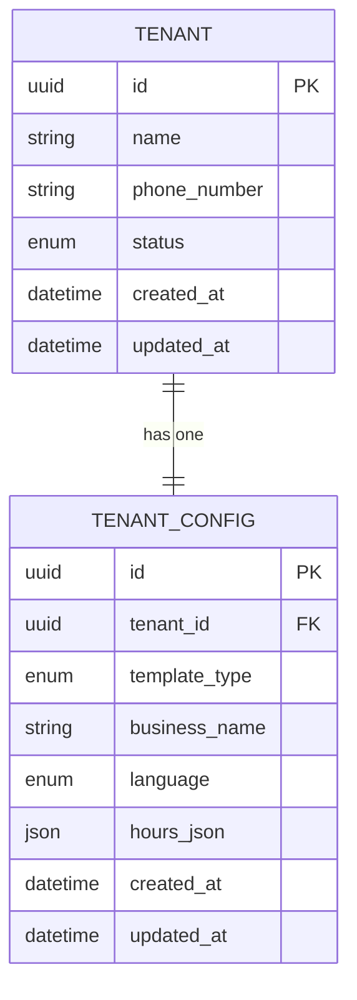
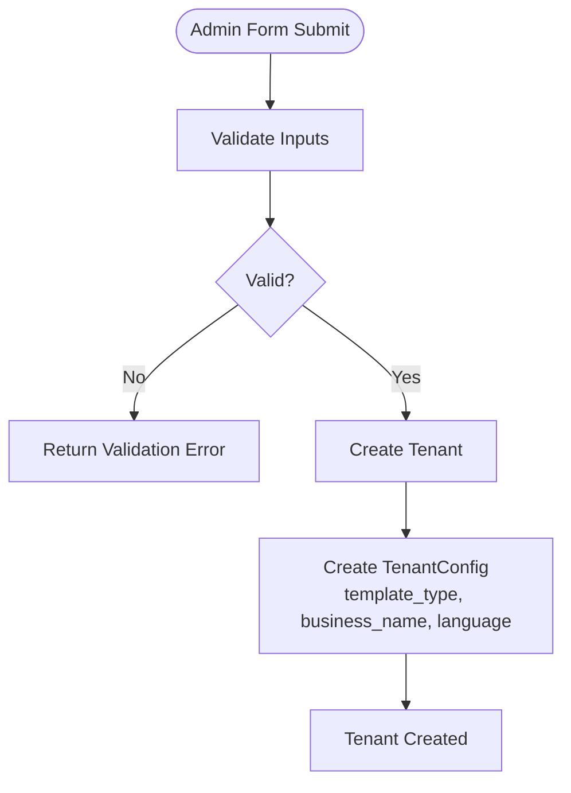
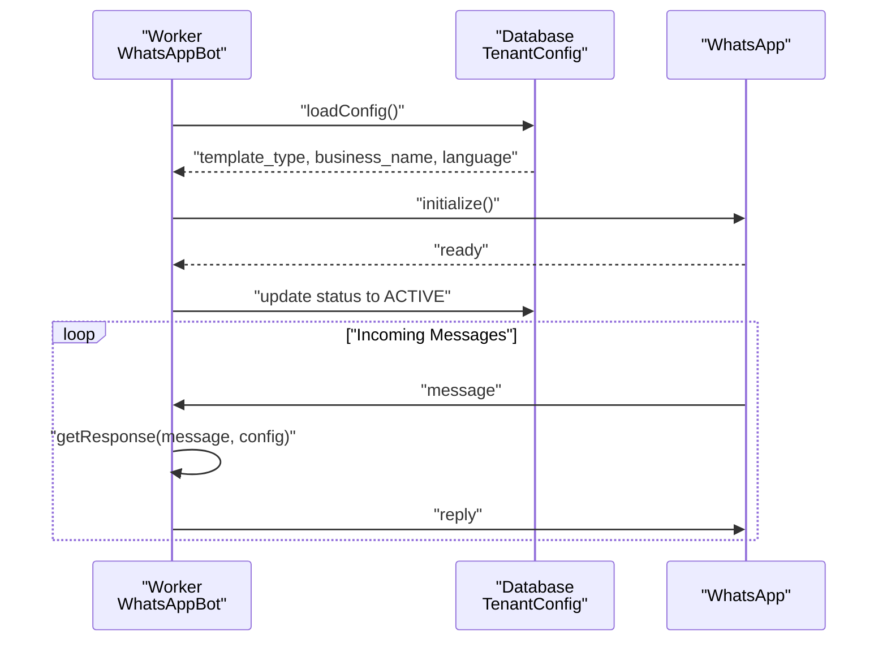
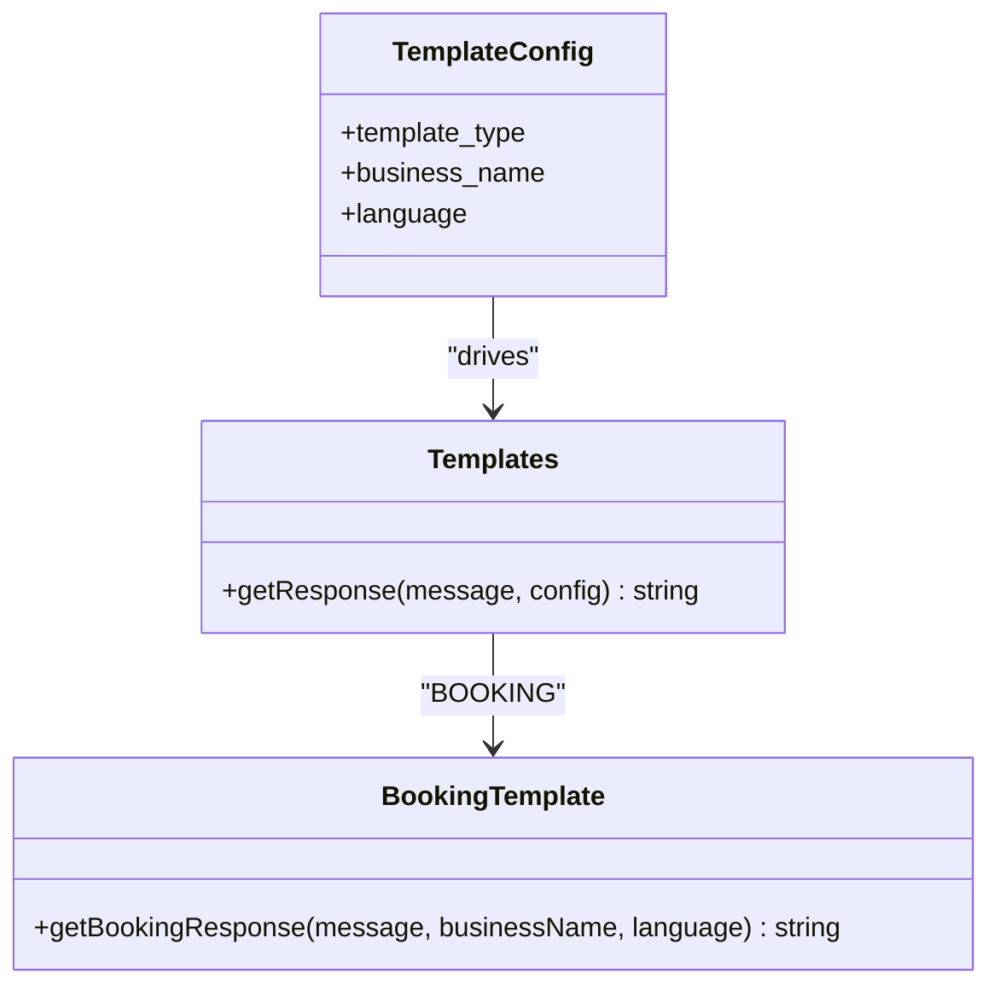
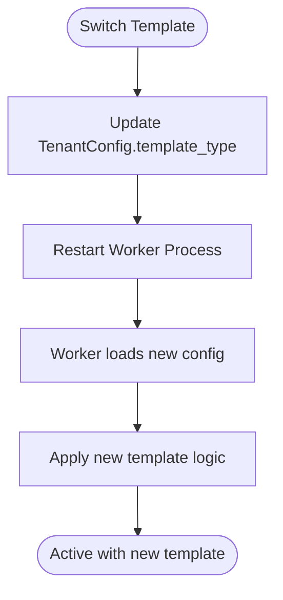
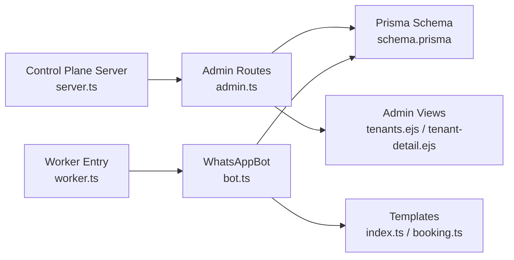

# Template Selection and Customization

<cite>
**Referenced Files in This Document**
- [schema.prisma](file://packages/shared/src/prisma/schema.prisma)
- [types/index.ts](file://packages/shared/src/types/index.ts)
- [admin.ts](file://apps/control-plane/src/routes/admin.ts)
- [tenants.ejs](file://apps/control-plane/src/views/tenants.ejs)
- [tenant-detail.ejs](file://apps/control-plane/src/views/tenant-detail.ejs)
- [server.ts](file://apps/control-plane/src/server.ts)
- [index.ts](file://apps/worker/src/templates/index.ts)
- [booking.ts](file://apps/worker/src/templates/booking.ts)
- [bot.ts](file://apps/worker/src/bot.ts)
- [worker.ts](file://apps/worker/src/worker.ts)
- [stress-test.ts](file://scripts/stress-test.ts)
</cite>

## Table of Contents
1. [Introduction](#introduction)
2. [Project Structure](#project-structure)
3. [Core Components](#core-components)
4. [Architecture Overview](#architecture-overview)
5. [Detailed Component Analysis](#detailed-component-analysis)
6. [Dependency Analysis](#dependency-analysis)
7. [Performance Considerations](#performance-considerations)
8. [Troubleshooting Guide](#troubleshooting-guide)
9. [Conclusion](#conclusion)

## Introduction
This document explains how template selection and customization work within the multi-tenant system. It covers the three available template types (BOOKING, ECOMMERCE, SUPPORT), the template type enumeration, and customization options such as business name, language, and operational hours. It also documents how template configuration is persisted via the TenantConfig model, how templates are selected during tenant setup, and how customization affects worker automation processes. Practical examples demonstrate activation, parameter configuration, and business-specific customizations, along with template switching, validation, and impact on automation.

## Project Structure
The template system spans the control plane (tenant management and configuration), the worker (automation and messaging), and shared data models (Prisma schema and TypeScript types).

**Diagram sources**
- [admin.ts](file://apps/control-plane/src/routes/admin.ts#L104-L140)
- [tenants.ejs](file://apps/control-plane/src/views/tenants.ejs#L42-L71)
- [tenant-detail.ejs](file://apps/control-plane/src/views/tenant-detail.ejs#L45-L71)
- [server.ts](file://apps/control-plane/src/server.ts#L47-L48)
- [bot.ts](file://apps/worker/src/bot.ts#L228-L246)
- [index.ts](file://apps/worker/src/templates/index.ts#L9-L23)
- [booking.ts](file://apps/worker/src/templates/booking.ts#L1-L22)
- [worker.ts](file://apps/worker/src/worker.ts#L1-L46)
- [schema.prisma](file://packages/shared/src/prisma/schema.prisma#L78-L90)
- [types/index.ts](file://packages/shared/src/types/index.ts#L1-L41)

**Section sources**
- [admin.ts](file://apps/control-plane/src/routes/admin.ts#L104-L140)
- [tenants.ejs](file://apps/control-plane/src/views/tenants.ejs#L42-L71)
- [tenant-detail.ejs](file://apps/control-plane/src/views/tenant-detail.ejs#L45-L71)
- [server.ts](file://apps/control-plane/src/server.ts#L47-L48)
- [schema.prisma](file://packages/shared/src/prisma/schema.prisma#L78-L90)
- [types/index.ts](file://packages/shared/src/types/index.ts#L1-L41)

## Core Components
- Template types and configuration:
  - TemplateConfig defines template_type, business_name, and language.
  - TemplateType enumeration includes BOOKING, ECOMMERCE, SUPPORT.
  - Language enumeration includes SW and EN.
  - TenantConfig persists template_type, business_name, language, and optional hours_json for operational hours.

- Control plane tenant creation and configuration:
  - Admin routes accept template_type, business_name, and language during tenant creation.
  - Views present form fields for template selection, business name, and language.

- Worker automation:
  - WhatsAppBot loads TenantConfig at startup and uses getResponse to generate replies based on the selected template and language.
  - Templates implement localized responses for each template type.

**Section sources**
- [index.ts](file://apps/worker/src/templates/index.ts#L3-L7)
- [schema.prisma](file://packages/shared/src/prisma/schema.prisma#L18-L27)
- [schema.prisma](file://packages/shared/src/prisma/schema.prisma#L78-L90)
- [admin.ts](file://apps/control-plane/src/routes/admin.ts#L104-L140)
- [tenants.ejs](file://apps/control-plane/src/views/tenants.ejs#L52-L71)
- [bot.ts](file://apps/worker/src/bot.ts#L228-L246)
- [booking.ts](file://apps/worker/src/templates/booking.ts#L1-L22)

## Architecture Overview
The system integrates control plane configuration with worker automation. The control plane stores TenantConfig and exposes APIs to manage tenants and workers. The worker loads the tenant’s configuration and applies the appropriate template logic to generate automated responses.

**Diagram sources**
- [admin.ts](file://apps/control-plane/src/routes/admin.ts#L104-L140)
- [admin.ts](file://apps/control-plane/src/routes/admin.ts#L174-L230)
- [schema.prisma](file://packages/shared/src/prisma/schema.prisma#L78-L90)
- [bot.ts](file://apps/worker/src/bot.ts#L228-L246)
- [worker.ts](file://apps/worker/src/worker.ts#L19-L24)

## Detailed Component Analysis

### Template Types and Enumerations
- TemplateType: BOOKING, ECOMMERCE, SUPPORT
- Language: SW, EN
- TenantConfig fields:
  - template_type: TemplateType with default BOOKING
  - business_name: string
  - language: Language with default SW
  - hours_json: optional JSON for operational hours

These definitions ensure consistent validation and storage of template preferences.

**Section sources**
- [schema.prisma](file://packages/shared/src/prisma/schema.prisma#L18-L27)
- [schema.prisma](file://packages/shared/src/prisma/schema.prisma#L78-L90)

### Template Configuration Persistence
- Creation endpoint accepts template_type, business_name, language and creates TenantConfig.
- Tenant details view displays template_type, business_name, and language from TenantConfig.
- Shared types define CreateTenantInput and TenantWithRelations for consistent API contracts.

**Diagram sources**
- [schema.prisma](file://packages/shared/src/prisma/schema.prisma#L60-L90)
- [admin.ts](file://apps/control-plane/src/routes/admin.ts#L104-L140)
- [types/index.ts](file://packages/shared/src/types/index.ts#L1-L41)

**Section sources**
- [admin.ts](file://apps/control-plane/src/routes/admin.ts#L104-L140)
- [tenant-detail.ejs](file://apps/control-plane/src/views/tenant-detail.ejs#L58-L69)
- [types/index.ts](file://packages/shared/src/types/index.ts#L1-L41)

### Template Selection During Tenant Setup
- Admin UI provides a form with:
  - Template Type dropdown (BOOKING, ECOMMERCE, SUPPORT)
  - Business Name input
  - Language dropdown (SW, EN)
- On submit, the control plane creates Tenant and TenantConfig with the chosen values.

**Diagram sources**
- [tenants.ejs](file://apps/control-plane/src/views/tenants.ejs#L52-L71)
- [admin.ts](file://apps/control-plane/src/routes/admin.ts#L104-L140)

**Section sources**
- [tenants.ejs](file://apps/control-plane/src/views/tenants.ejs#L42-L71)
- [admin.ts](file://apps/control-plane/src/routes/admin.ts#L104-L140)

### Customization Options
- Business name: displayed in template responses to personalize greetings and prompts.
- Language: drives localized responses for BOOKING, ECOMMERCE, and SUPPORT.
- Operational hours: stored in hours_json on TenantConfig for future use in scheduling-aware responses.

**Section sources**
- [index.ts](file://apps/worker/src/templates/index.ts#L3-L7)
- [schema.prisma](file://packages/shared/src/prisma/schema.prisma#L82-L85)

### Template Activation and Worker Automation
- Worker loads TenantConfig on startup and uses getResponse to select the correct template handler.
- The worker updates tenant status to ACTIVE upon successful connection and maintains periodic heartbeats.

**Diagram sources**
- [bot.ts](file://apps/worker/src/bot.ts#L228-L246)
- [bot.ts](file://apps/worker/src/bot.ts#L248-L331)
- [index.ts](file://apps/worker/src/templates/index.ts#L9-L23)

**Section sources**
- [bot.ts](file://apps/worker/src/bot.ts#L228-L246)
- [bot.ts](file://apps/worker/src/bot.ts#L248-L331)
- [index.ts](file://apps/worker/src/templates/index.ts#L9-L23)

### Template-Specific Behavior
- BOOKING: Personalized greeting and intent detection for booking-related keywords in Swahili and English.
- ECOMMERCE: Guidance for products, prices, orders, and delivery in Swahili and English.
- SUPPORT: Issue reporting and working hours prompt in Swahili and English.

**Diagram sources**
- [index.ts](file://apps/worker/src/templates/index.ts#L3-L7)
- [index.ts](file://apps/worker/src/templates/index.ts#L9-L23)
- [booking.ts](file://apps/worker/src/templates/booking.ts#L1-L22)

**Section sources**
- [booking.ts](file://apps/worker/src/templates/booking.ts#L1-L22)
- [index.ts](file://apps/worker/src/templates/index.ts#L25-L69)

### Template Switching Procedures
- To switch templates, update TenantConfig.template_type via the control plane API or admin UI.
- After updating, restart the worker so it reloads TenantConfig and applies the new template logic.
- The worker supports restart and force-restart endpoints to apply configuration changes.

**Diagram sources**
- [admin.ts](file://apps/control-plane/src/routes/admin.ts#L257-L283)
- [admin.ts](file://apps/control-plane/src/routes/admin.ts#L285-L332)
- [bot.ts](file://apps/worker/src/bot.ts#L228-L246)

**Section sources**
- [admin.ts](file://apps/control-plane/src/routes/admin.ts#L257-L283)
- [admin.ts](file://apps/control-plane/src/routes/admin.ts#L285-L332)
- [bot.ts](file://apps/worker/src/bot.ts#L228-L246)

### Configuration Validation
- Control plane validates environment variables and database connectivity before starting.
- Tenant creation enforces required fields: name, phone_number, template_type, business_name, language.
- Worker validates TENANT_ID and handles graceful shutdown on signals.

**Section sources**
- [server.ts](file://apps/control-plane/src/server.ts#L17-L39)
- [admin.ts](file://apps/control-plane/src/routes/admin.ts#L104-L140)
- [worker.ts](file://apps/worker/src/worker.ts#L12-L15)

### Impact on Worker Automation
- Template changes immediately affect message handling once the worker reloads configuration.
- Heartbeat monitoring ensures continuous operation; stale workers are marked ERROR and tenant status updated accordingly.
- Rate limiting, deduplication, and queue management remain consistent across template switches.

**Section sources**
- [bot.ts](file://apps/worker/src/bot.ts#L248-L331)
- [admin.ts](file://apps/control-plane/src/routes/admin.ts#L30-L80)

## Dependency Analysis
The control plane depends on Prisma models and admin routes to manage tenants and workers. The worker depends on the control plane for configuration and on templates for response generation.

**Diagram sources**
- [admin.ts](file://apps/control-plane/src/routes/admin.ts#L104-L140)
- [server.ts](file://apps/control-plane/src/server.ts#L47-L48)
- [schema.prisma](file://packages/shared/src/prisma/schema.prisma#L78-L90)
- [bot.ts](file://apps/worker/src/bot.ts#L228-L246)
- [index.ts](file://apps/worker/src/templates/index.ts#L9-L23)
- [booking.ts](file://apps/worker/src/templates/booking.ts#L1-L22)
- [worker.ts](file://apps/worker/src/worker.ts#L19-L24)

**Section sources**
- [admin.ts](file://apps/control-plane/src/routes/admin.ts#L104-L140)
- [server.ts](file://apps/control-plane/src/server.ts#L47-L48)
- [schema.prisma](file://packages/shared/src/prisma/schema.prisma#L78-L90)
- [bot.ts](file://apps/worker/src/bot.ts#L228-L246)
- [index.ts](file://apps/worker/src/templates/index.ts#L9-L23)
- [booking.ts](file://apps/worker/src/templates/booking.ts#L1-L22)
- [worker.ts](file://apps/worker/src/worker.ts#L19-L24)

## Performance Considerations
- Worker isolation: Each tenant runs a dedicated PM2 process with a unique name to prevent cross-tenant interference.
- Heartbeat intervals and stale worker detection help maintain system health.
- Rate limiting and message deduplication reduce load and avoid duplicate replies.

**Section sources**
- [stress-test.ts](file://scripts/stress-test.ts#L258-L299)
- [admin.ts](file://apps/control-plane/src/routes/admin.ts#L30-L80)
- [bot.ts](file://apps/worker/src/bot.ts#L264-L278)

## Troubleshooting Guide
- Worker fails to start: Check TENANT_ID environment variable and database connectivity. Review worker logs for initialization errors.
- Stale workers: The control plane periodically marks workers as ERROR if no heartbeat is received within the configured threshold.
- Template not applied: Ensure TenantConfig.template_type is set correctly and restart the worker to reload configuration.
- Language or business name not reflected: Confirm TenantConfig fields are updated and the worker has reloaded the configuration.

**Section sources**
- [worker.ts](file://apps/worker/src/worker.ts#L12-L15)
- [server.ts](file://apps/control-plane/src/server.ts#L17-L39)
- [admin.ts](file://apps/control-plane/src/routes/admin.ts#L30-L80)
- [bot.ts](file://apps/worker/src/bot.ts#L228-L246)

## Conclusion
The multi-tenant system provides robust template selection and customization through a clear separation of concerns: control plane configuration, persistent TenantConfig, and worker-driven automation. With three template types, language support, and optional operational hours, businesses can tailor their automation to fit booking, e-commerce, or support use cases. Template switching is straightforward and worker restarts ensure immediate adoption of new configurations, while monitoring and validation keep the system resilient.