# Tenant Creation and Configuration

<cite>
**Referenced Files in This Document**
- [schema.prisma](file://packages/shared/src/prisma/schema.prisma)
- [admin.ts](file://apps/control-plane/src/routes/admin.ts)
- [portal.ts](file://apps/control-plane/src/routes/portal.ts)
- [tenants.ejs](file://apps/control-plane/src/views/tenants.ejs)
- [tenant-detail.ejs](file://apps/control-plane/src/views/tenant-detail.ejs)
- [bot.ts](file://apps/worker/src/bot.ts)
- [auth.ts](file://apps/web/src/lib/auth.ts)
- [setup-request/route.ts](file://apps/web/src/app/api/portal/setup-request/route.ts)
- [current/status/route.ts](file://apps/web/src/app/api/portal/tenant/current/status/route.ts)
- [current/qr/route.ts](file://apps/web/src/app/api/portal/tenant/current/qr/route.ts)
- [current/logs/route.ts](file://apps/web/src/app/api/portal/tenant/current/logs/route.ts)
</cite>

## Table of Contents
1. [Introduction](#introduction)
2. [Project Structure](#project-structure)
3. [Core Components](#core-components)
4. [Architecture Overview](#architecture-overview)
5. [Detailed Component Analysis](#detailed-component-analysis)
6. [Dependency Analysis](#dependency-analysis)
7. [Performance Considerations](#performance-considerations)
8. [Troubleshooting Guide](#troubleshooting-guide)
9. [Conclusion](#conclusion)

## Introduction
This document explains the tenant creation and configuration lifecycle in Flow HQ. It covers how tenants are created, configured, and managed through the control plane, how tenant status evolves during setup and operation, and how tenant-specific data is isolated and secured. It also documents the control plane’s administrative capabilities and the portal’s tenant-centric APIs that delegate to the control plane.

## Project Structure
The tenant lifecycle spans three main areas:
- Shared data model: defines Tenant, TenantConfig, and related entities with Prisma schema.
- Control plane: exposes administrative routes for tenant CRUD, worker lifecycle, QR retrieval, and setup request management.
- Web portal: provides tenant-facing APIs that proxy to the control plane and enforce internal keys and user identity.

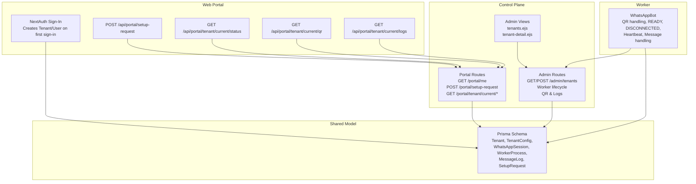

**Diagram sources**
- [schema.prisma](file://packages/shared/src/prisma/schema.prisma#L60-L164)
- [admin.ts](file://apps/control-plane/src/routes/admin.ts#L82-L140)
- [portal.ts](file://apps/control-plane/src/routes/portal.ts#L52-L243)
- [tenants.ejs](file://apps/control-plane/src/views/tenants.ejs#L40-L136)
- [tenant-detail.ejs](file://apps/control-plane/src/views/tenant-detail.ejs#L43-L169)
- [bot.ts](file://apps/worker/src/bot.ts#L77-L226)

**Section sources**
- [schema.prisma](file://packages/shared/src/prisma/schema.prisma#L60-L164)
- [admin.ts](file://apps/control-plane/src/routes/admin.ts#L82-L140)
- [portal.ts](file://apps/control-plane/src/routes/portal.ts#L52-L243)
- [tenants.ejs](file://apps/control-plane/src/views/tenants.ejs#L40-L136)
- [tenant-detail.ejs](file://apps/control-plane/src/views/tenant-detail.ejs#L43-L169)
- [bot.ts](file://apps/worker/src/bot.ts#L77-L226)

## Core Components
- Tenant: top-level entity representing a customer tenant with status and timestamps.
- TenantConfig: tenant-scoped configuration persisted via TenantConfig model.
- WhatsAppSession: per-tenant WhatsApp session state and QR data.
- WorkerProcess: per-tenant worker lifecycle and status.
- SetupRequest: tenant onboarding request with status transitions.
- MessageLog: tenant-scoped message audit trail.
- Portal routes: tenant-centric APIs that validate internal keys and user identity.
- Control plane admin routes: administrative operations for tenant lifecycle and diagnostics.

**Section sources**
- [schema.prisma](file://packages/shared/src/prisma/schema.prisma#L60-L164)
- [portal.ts](file://apps/control-plane/src/routes/portal.ts#L85-L153)
- [admin.ts](file://apps/control-plane/src/routes/admin.ts#L104-L140)

## Architecture Overview
The tenant lifecycle is orchestrated by the control plane with the worker implementing WhatsApp events and status updates. The portal delegates tenant operations to the control plane via internal key and user identity checks.

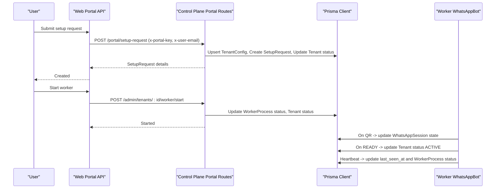

**Diagram sources**
- [setup-request/route.ts](file://apps/web/src/app/api/portal/setup-request/route.ts#L8-L34)
- [portal.ts](file://apps/control-plane/src/routes/portal.ts#L85-L153)
- [admin.ts](file://apps/control-plane/src/routes/admin.ts#L174-L230)
- [bot.ts](file://apps/worker/src/bot.ts#L77-L151)

## Detailed Component Analysis

### Tenant Status Lifecycle
Tenant status transitions are central to the lifecycle:
- NEW: Initial tenant created.
- PENDING: After a setup request is submitted by the tenant.
- APPROVED: Admin approves setup request; worker starts.
- QR_PENDING: Worker started and waiting for QR.
- ACTIVE: WhatsApp client connected and operational.
- PAUSED: Admin-controlled pause.
- ERROR: Worker or session error state.

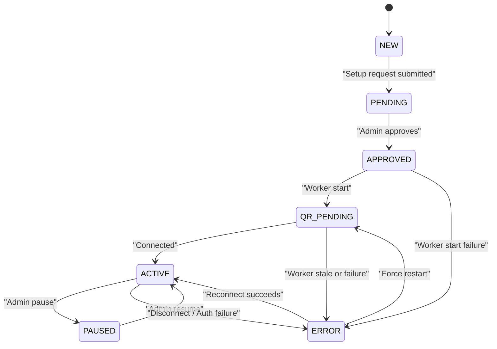

**Diagram sources**
- [schema.prisma](file://packages/shared/src/prisma/schema.prisma#L10-L16)
- [portal.ts](file://apps/control-plane/src/routes/portal.ts#L132-L136)
- [admin.ts](file://apps/control-plane/src/routes/admin.ts#L211-L214)
- [bot.ts](file://apps/worker/src/bot.ts#L185-L225)

**Section sources**
- [schema.prisma](file://packages/shared/src/prisma/schema.prisma#L10-L16)
- [portal.ts](file://apps/control-plane/src/routes/portal.ts#L132-L136)
- [admin.ts](file://apps/control-plane/src/routes/admin.ts#L211-L214)
- [bot.ts](file://apps/worker/src/bot.ts#L185-L225)

### Tenant Creation Workflow
There are two primary creation paths:
- First-time sign-in via NextAuth: automatically creates Tenant and User.
- Administrative creation via control plane: creates Tenant, TenantConfig, WhatsAppSession, and WorkerProcess.

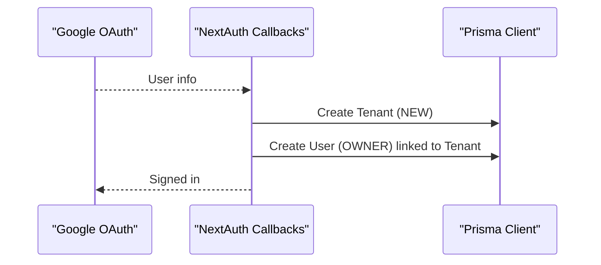

**Diagram sources**
- [auth.ts](file://apps/web/src/lib/auth.ts#L15-L46)

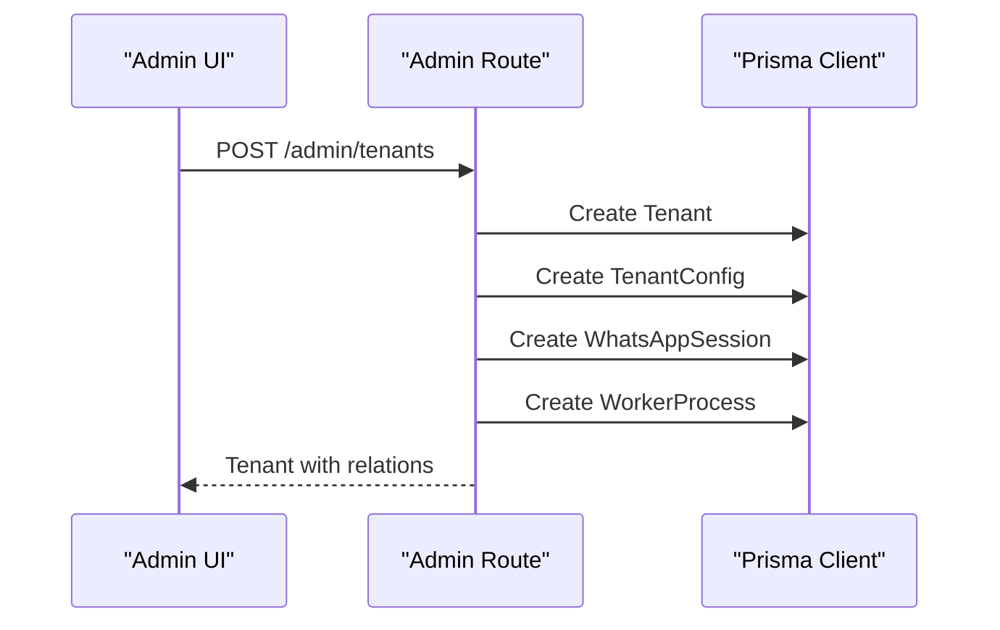

**Diagram sources**
- [admin.ts](file://apps/control-plane/src/routes/admin.ts#L104-L140)

**Section sources**
- [auth.ts](file://apps/web/src/lib/auth.ts#L15-L46)
- [admin.ts](file://apps/control-plane/src/routes/admin.ts#L104-L140)

### Configuration Persistence with TenantConfig
- The portal’s setup request endpoint upserts TenantConfig and creates SetupRequest.
- The worker loads TenantConfig on readiness to apply template and language settings.

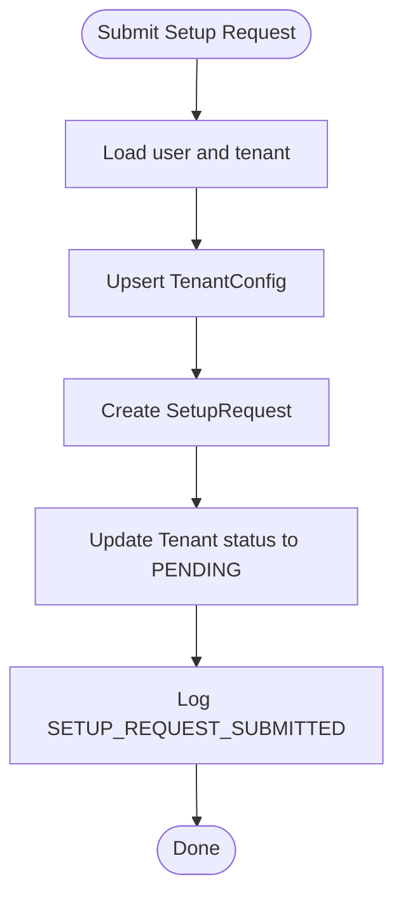

**Diagram sources**
- [portal.ts](file://apps/control-plane/src/routes/portal.ts#L85-L153)

**Section sources**
- [portal.ts](file://apps/control-plane/src/routes/portal.ts#L85-L153)
- [bot.ts](file://apps/worker/src/bot.ts#L228-L246)

### Setup Request Processing
- The portal validates internal key and user identity, then persists the request and updates status.
- Admin can approve or reject setup requests, which triggers worker start and status updates.

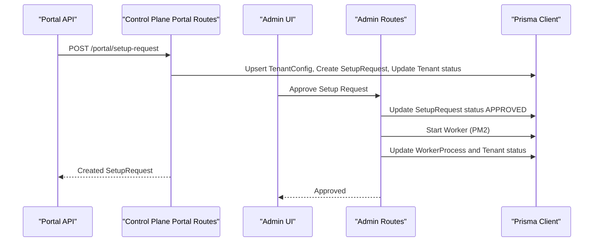

**Diagram sources**
- [setup-request/route.ts](file://apps/web/src/app/api/portal/setup-request/route.ts#L8-L34)
- [portal.ts](file://apps/control-plane/src/routes/portal.ts#L85-L153)
- [admin.ts](file://apps/control-plane/src/routes/admin.ts#L419-L489)

**Section sources**
- [setup-request/route.ts](file://apps/web/src/app/api/portal/setup-request/route.ts#L8-L34)
- [portal.ts](file://apps/control-plane/src/routes/portal.ts#L85-L153)
- [admin.ts](file://apps/control-plane/src/routes/admin.ts#L419-L489)

### QR Generation and Status Updates
- Worker emits QR events; the control plane stores QR as a data URI and updates session state.
- The portal exposes tenant QR retrieval for the current user.

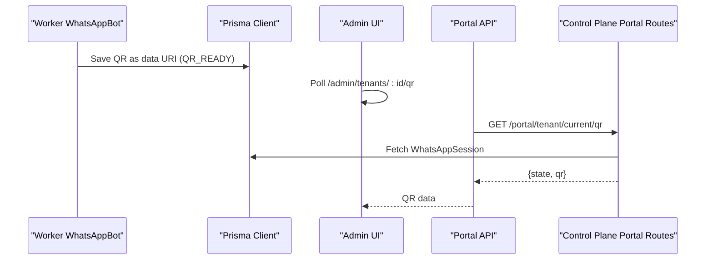

**Diagram sources**
- [bot.ts](file://apps/worker/src/bot.ts#L77-L96)
- [admin.ts](file://apps/control-plane/src/routes/admin.ts#L334-L352)
- [current/qr/route.ts](file://apps/web/src/app/api/portal/tenant/current/qr/route.ts#L8-L34)
- [portal.ts](file://apps/control-plane/src/routes/portal.ts#L192-L216)

**Section sources**
- [bot.ts](file://apps/worker/src/bot.ts#L77-L96)
- [admin.ts](file://apps/control-plane/src/routes/admin.ts#L334-L352)
- [current/qr/route.ts](file://apps/web/src/app/api/portal/tenant/current/qr/route.ts#L8-L34)
- [portal.ts](file://apps/control-plane/src/routes/portal.ts#L192-L216)

### Tenant Isolation and Security Boundaries
- Database isolation: each record includes tenant_id foreign keys ensuring tenant-scoped queries.
- Control plane enforcement: portal routes require x-portal-key and x-user-email headers to bind requests to a specific tenant.
- Worker isolation: worker runs per tenant with dedicated session storage and PM2 process naming.

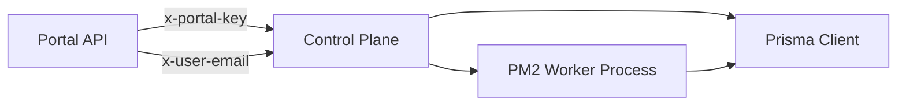

**Diagram sources**
- [portal.ts](file://apps/control-plane/src/routes/portal.ts#L12-L25)
- [bot.ts](file://apps/worker/src/bot.ts#L58-L75)

**Section sources**
- [portal.ts](file://apps/control-plane/src/routes/portal.ts#L12-L25)
- [bot.ts](file://apps/worker/src/bot.ts#L58-L75)

### Administrative Controls Through Control Plane
- Tenant listing and detail views with status, session state, and worker status.
- Worker lifecycle: start, stop, restart, and force restart with PM2 orchestration.
- Stale worker detection: marks workers and tenants as ERROR if no heartbeat within threshold.

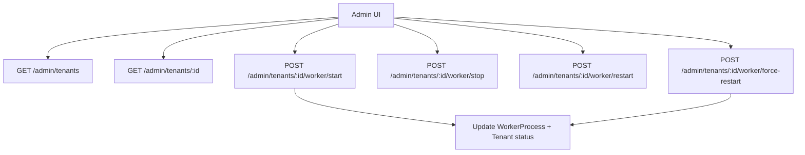

**Diagram sources**
- [tenants.ejs](file://apps/control-plane/src/views/tenants.ejs#L76-L136)
- [tenant-detail.ejs](file://apps/control-plane/src/views/tenant-detail.ejs#L119-L169)
- [admin.ts](file://apps/control-plane/src/routes/admin.ts#L174-L332)

**Section sources**
- [tenants.ejs](file://apps/control-plane/src/views/tenants.ejs#L76-L136)
- [tenant-detail.ejs](file://apps/control-plane/src/views/tenant-detail.ejs#L119-L169)
- [admin.ts](file://apps/control-plane/src/routes/admin.ts#L174-L332)

## Dependency Analysis
The following diagram maps key dependencies among tenant-related components:

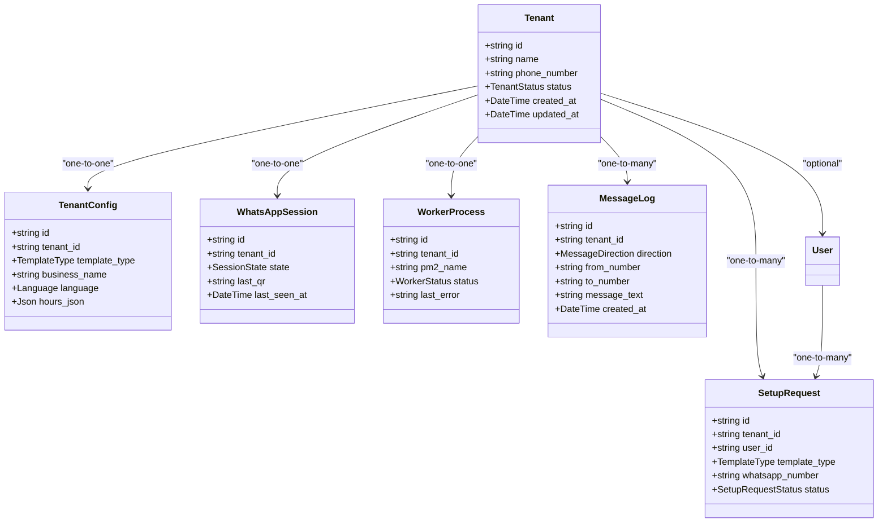

**Diagram sources**
- [schema.prisma](file://packages/shared/src/prisma/schema.prisma#L60-L164)

**Section sources**
- [schema.prisma](file://packages/shared/src/prisma/schema.prisma#L60-L164)

## Performance Considerations
- Worker heartbeat interval and stale detection: tune HEARTBEAT_INTERVAL_MS and STALE_THRESHOLD_MINUTES to balance responsiveness and load.
- Rate limiting and queueing: the worker enforces rate limits and chat queues to prevent overload and ensure ordered replies.
- Indexing: tenant_id indexed on MessageLog and PortalEventLog supports efficient tenant-scoped queries.

[No sources needed since this section provides general guidance]

## Troubleshooting Guide
Common scenarios and remedies:
- Tenant status stuck in QR_PENDING: confirm worker started and PM2 process is online; trigger force restart if needed.
- Frequent ERROR status: check worker logs, session storage permissions, and network connectivity; review last_error in WorkerProcess.
- No QR appearing: ensure worker is running and emitting QR events; poll /admin/tenants/:id/qr until QR appears.
- Portal unauthorized errors: verify x-portal-key and x-user-email headers are present and correct.

**Section sources**
- [admin.ts](file://apps/control-plane/src/routes/admin.ts#L174-L332)
- [bot.ts](file://apps/worker/src/bot.ts#L333-L359)

## Conclusion
Flow HQ implements a robust tenant lifecycle with clear status transitions, strong tenant isolation via database relations and control plane enforcement, and a reliable worker-driven WhatsApp integration. Administrators manage tenants and workers through the control plane, while tenants interact via the portal APIs that delegate to the control plane with strict authentication and authorization.