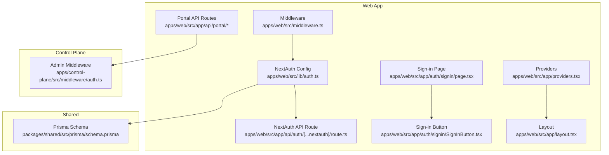
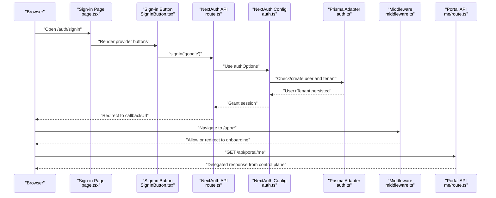
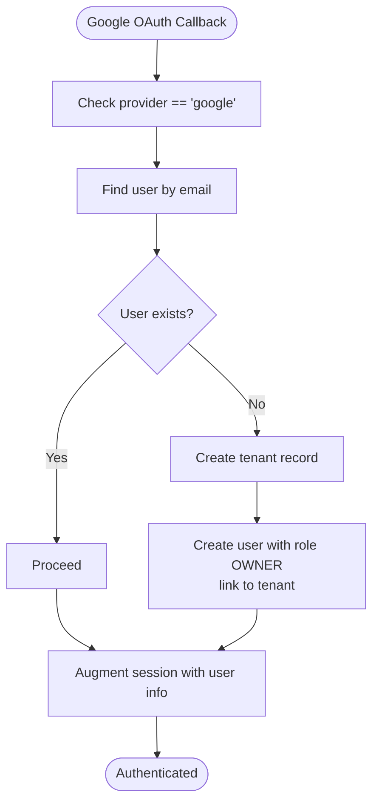
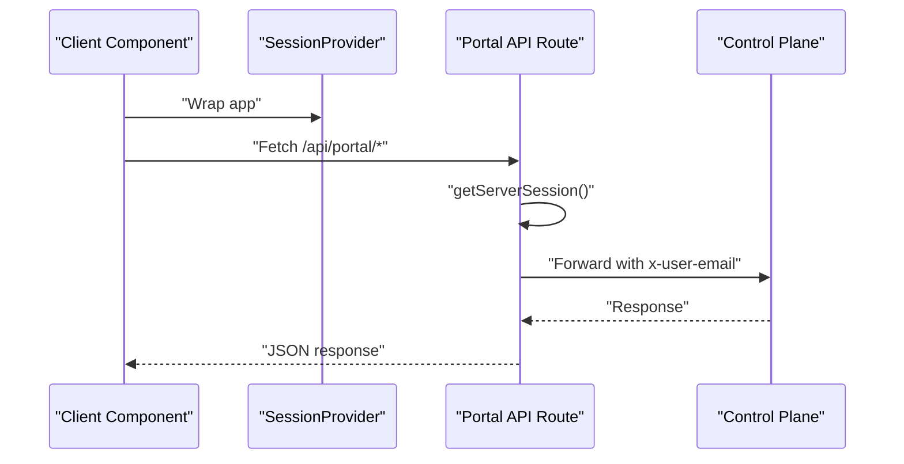
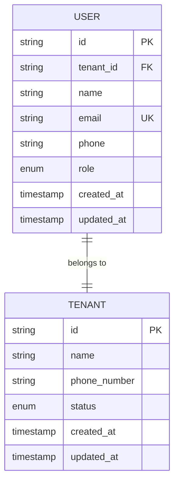
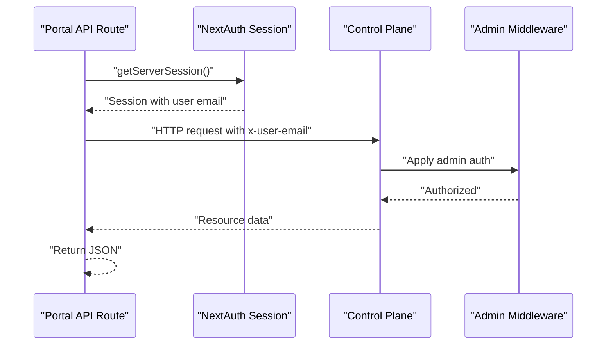
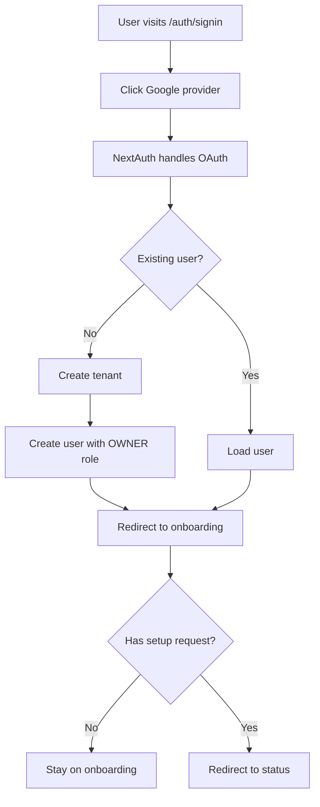
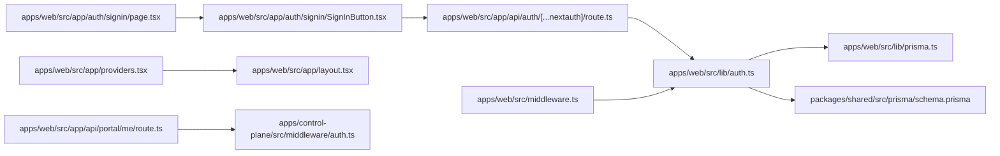

# User Authentication and Authorization

<cite>
**Referenced Files in This Document**
- [apps/web/src/lib/auth.ts](file://apps/web/src/lib/auth.ts)
- [apps/web/src/app/api/auth/[...nextauth]/route.ts](file://apps/web/src/app/api/auth/[...nextauth]/route.ts)
- [apps/web/src/app/auth/signin/page.tsx](file://apps/web/src/app/auth/signin/page.tsx)
- [apps/web/src/app/auth/signin/SignInButton.tsx](file://apps/web/src/app/auth/signin/SignInButton.tsx)
- [apps/web/src/middleware.ts](file://apps/web/src/middleware.ts)
- [apps/web/src/app/providers.tsx](file://apps/web/src/app/providers.tsx)
- [apps/web/src/app/layout.tsx](file://apps/web/src/app/layout.tsx)
- [apps/web/src/lib/prisma.ts](file://apps/web/src/lib/prisma.ts)
- [packages/shared/src/prisma/schema.prisma](file://packages/shared/src/prisma/schema.prisma)
- [apps/web/src/app/api/portal/me/route.ts](file://apps/web/src/app/api/portal/me/route.ts)
- [apps/web/src/app/api/portal/setup-request/route.ts](file://apps/web/src/app/api/portal/setup-request/route.ts)
- [apps/web/src/app/api/portal/tenant/current/status/route.ts](file://apps/web/src/app/api/portal/tenant/current/status/route.ts)
- [apps/web/src/app/api/portal/tenant/current/qr/route.ts](file://apps/web/src/app/api/portal/tenant/current/qr/route.ts)
- [apps/web/src/app/api/portal/tenant/current/logs/route.ts](file://apps/web/src/app/api/portal/tenant/current/logs/route.ts)
- [apps/control-plane/src/middleware/auth.ts](file://apps/control-plane/src/middleware/auth.ts)
</cite>

## Table of Contents
1. [Introduction](#introduction)
2. [Project Structure](#project-structure)
3. [Core Components](#core-components)
4. [Architecture Overview](#architecture-overview)
5. [Detailed Component Analysis](#detailed-component-analysis)
6. [Dependency Analysis](#dependency-analysis)
7. [Performance Considerations](#performance-considerations)
8. [Troubleshooting Guide](#troubleshooting-guide)
9. [Conclusion](#conclusion)
10. [Appendices](#appendices)

## Introduction
This document explains the user authentication and authorization system in the multi-tenant environment. It covers NextAuth.js integration with Google OAuth, automatic user and tenant creation, session management, and tenant-aware routing. It also documents role management (OWNER, STAFF, ADMIN), tenant-user relationships, and the authorization patterns used to access tenant-specific resources via portal APIs. Practical workflows for user onboarding, role assignment, and tenant membership validation are included, along with security considerations for multi-tenant access control, session persistence, token management, and logout procedures.

## Project Structure
The authentication system spans the web application (Next.js app) and the shared Prisma schema. Key areas:
- NextAuth configuration and callbacks for Google OAuth, user creation, and session augmentation
- Middleware enforcing protected routes and onboarding redirection logic
- Provider setup for session management in the React app
- Portal API routes that delegate to the control plane after validating the authenticated user
- Control plane middleware for administrative endpoints

**Diagram sources**
- [apps/web/src/lib/auth.ts](file://apps/web/src/lib/auth.ts#L1-L76)
- [apps/web/src/app/api/auth/[...nextauth]/route.ts](file://apps/web/src/app/api/auth/[...nextauth]/route.ts#L1-L7)
- [apps/web/src/app/auth/signin/page.tsx](file://apps/web/src/app/auth/signin/page.tsx#L1-L37)
- [apps/web/src/app/auth/signin/SignInButton.tsx](file://apps/web/src/app/auth/signin/SignInButton.tsx#L1-L42)
- [apps/web/src/middleware.ts](file://apps/web/src/middleware.ts#L1-L44)
- [apps/web/src/app/providers.tsx](file://apps/web/src/app/providers.tsx#L1-L8)
- [apps/web/src/app/layout.tsx](file://apps/web/src/app/layout.tsx#L1-L25)
- [packages/shared/src/prisma/schema.prisma](file://packages/shared/src/prisma/schema.prisma#L1-L178)
- [apps/web/src/app/api/portal/me/route.ts](file://apps/web/src/app/api/portal/me/route.ts#L1-L35)
- [apps/control-plane/src/middleware/auth.ts](file://apps/control-plane/src/middleware/auth.ts#L1-L40)

**Section sources**
- [apps/web/src/lib/auth.ts](file://apps/web/src/lib/auth.ts#L1-L76)
- [apps/web/src/app/api/auth/[...nextauth]/route.ts](file://apps/web/src/app/api/auth/[...nextauth]/route.ts#L1-L7)
- [apps/web/src/app/auth/signin/page.tsx](file://apps/web/src/app/auth/signin/page.tsx#L1-L37)
- [apps/web/src/app/auth/signin/SignInButton.tsx](file://apps/web/src/app/auth/signin/SignInButton.tsx#L1-L42)
- [apps/web/src/middleware.ts](file://apps/web/src/middleware.ts#L1-L44)
- [apps/web/src/app/providers.tsx](file://apps/web/src/app/providers.tsx#L1-L8)
- [apps/web/src/app/layout.tsx](file://apps/web/src/app/layout.tsx#L1-L25)
- [packages/shared/src/prisma/schema.prisma](file://packages/shared/src/prisma/schema.prisma#L1-L178)
- [apps/web/src/app/api/portal/me/route.ts](file://apps/web/src/app/api/portal/me/route.ts#L1-L35)
- [apps/control-plane/src/middleware/auth.ts](file://apps/control-plane/src/middleware/auth.ts#L1-L40)

## Core Components
- NextAuth configuration with Google OAuth provider and Prisma adapter
- Automatic user and tenant creation on first sign-in
- Session augmentation with tenant and role information
- Middleware protecting portal routes and enforcing onboarding flow
- Portal API routes that validate the authenticated user and forward to the control plane
- Shared Prisma schema defining roles and tenant-user relationships

Key implementation references:
- NextAuth options and callbacks: [apps/web/src/lib/auth.ts](file://apps/web/src/lib/auth.ts#L6-L75)
- NextAuth API route handler: [apps/web/src/app/api/auth/[...nextauth]/route.ts](file://apps/web/src/app/api/auth/[...nextauth]/route.ts#L1-L7)
- Sign-in page and button: [apps/web/src/app/auth/signin/page.tsx](file://apps/web/src/app/auth/signin/page.tsx#L1-L37), [apps/web/src/app/auth/signin/SignInButton.tsx](file://apps/web/src/app/auth/signin/SignInButton.tsx#L1-L42)
- Middleware protection and onboarding logic: [apps/web/src/middleware.ts](file://apps/web/src/middleware.ts#L4-L39)
- Provider setup in layout: [apps/web/src/app/providers.tsx](file://apps/web/src/app/providers.tsx#L1-L8), [apps/web/src/app/layout.tsx](file://apps/web/src/app/layout.tsx#L1-L25)
- Prisma adapter and client initialization: [apps/web/src/lib/prisma.ts](file://apps/web/src/lib/prisma.ts#L1-L10)
- Roles and tenant-user relations: [packages/shared/src/prisma/schema.prisma](file://packages/shared/src/prisma/schema.prisma#L46-L50), [packages/shared/src/prisma/schema.prisma](file://packages/shared/src/prisma/schema.prisma#L133-L148)
- Portal API routes delegating to control plane: [apps/web/src/app/api/portal/me/route.ts](file://apps/web/src/app/api/portal/me/route.ts#L1-L35), [apps/web/src/app/api/portal/setup-request/route.ts](file://apps/web/src/app/api/portal/setup-request/route.ts#L1-L40), [apps/web/src/app/api/portal/tenant/current/status/route.ts](file://apps/web/src/app/api/portal/tenant/current/status/route.ts#L1-L35), [apps/web/src/app/api/portal/tenant/current/qr/route.ts](file://apps/web/src/app/api/portal/tenant/current/qr/route.ts#L1-L35), [apps/web/src/app/api/portal/tenant/current/logs/route.ts](file://apps/web/src/app/api/portal/tenant/current/logs/route.ts#L1-L35)
- Control plane admin middleware: [apps/control-plane/src/middleware/auth.ts](file://apps/control-plane/src/middleware/auth.ts#L1-L40)

**Section sources**
- [apps/web/src/lib/auth.ts](file://apps/web/src/lib/auth.ts#L1-L76)
- [apps/web/src/app/api/auth/[...nextauth]/route.ts](file://apps/web/src/app/api/auth/[...nextauth]/route.ts#L1-L7)
- [apps/web/src/app/auth/signin/page.tsx](file://apps/web/src/app/auth/signin/page.tsx#L1-L37)
- [apps/web/src/app/auth/signin/SignInButton.tsx](file://apps/web/src/app/auth/signin/SignInButton.tsx#L1-L42)
- [apps/web/src/middleware.ts](file://apps/web/src/middleware.ts#L1-L44)
- [apps/web/src/app/providers.tsx](file://apps/web/src/app/providers.tsx#L1-L8)
- [apps/web/src/app/layout.tsx](file://apps/web/src/app/layout.tsx#L1-L25)
- [apps/web/src/lib/prisma.ts](file://apps/web/src/lib/prisma.ts#L1-L10)
- [packages/shared/src/prisma/schema.prisma](file://packages/shared/src/prisma/schema.prisma#L46-L50)
- [packages/shared/src/prisma/schema.prisma](file://packages/shared/src/prisma/schema.prisma#L133-L148)
- [apps/web/src/app/api/portal/me/route.ts](file://apps/web/src/app/api/portal/me/route.ts#L1-L35)
- [apps/web/src/app/api/portal/setup-request/route.ts](file://apps/web/src/app/api/portal/setup-request/route.ts#L1-L40)
- [apps/web/src/app/api/portal/tenant/current/status/route.ts](file://apps/web/src/app/api/portal/tenant/current/status/route.ts#L1-L35)
- [apps/web/src/app/api/portal/tenant/current/qr/route.ts](file://apps/web/src/app/api/portal/tenant/current/qr/route.ts#L1-L35)
- [apps/web/src/app/api/portal/tenant/current/logs/route.ts](file://apps/web/src/app/api/portal/tenant/current/logs/route.ts#L1-L35)
- [apps/control-plane/src/middleware/auth.ts](file://apps/control-plane/src/middleware/auth.ts#L1-L40)

## Architecture Overview
The authentication and authorization architecture integrates NextAuth.js with Google OAuth, manages sessions, and enforces tenant-aware access control. The flow below maps to actual source files.

**Diagram sources**
- [apps/web/src/app/auth/signin/page.tsx](file://apps/web/src/app/auth/signin/page.tsx#L1-L37)
- [apps/web/src/app/auth/signin/SignInButton.tsx](file://apps/web/src/app/auth/signin/SignInButton.tsx#L1-L42)
- [apps/web/src/app/api/auth/[...nextauth]/route.ts](file://apps/web/src/app/api/auth/[...nextauth]/route.ts#L1-L7)
- [apps/web/src/lib/auth.ts](file://apps/web/src/lib/auth.ts#L6-L75)
- [apps/web/src/middleware.ts](file://apps/web/src/middleware.ts#L4-L39)
- [apps/web/src/app/api/portal/me/route.ts](file://apps/web/src/app/api/portal/me/route.ts#L1-L35)

## Detailed Component Analysis

### NextAuth.js Integration with Google OAuth
- Provider configuration uses Google OAuth with environment variables for credentials.
- The signIn callback checks the provider and ensures a user and tenant exist; if not, it creates both.
- The session callback augments the session with user ID, tenant ID, role, and setup request presence.

Implementation references:
- Provider and callbacks: [apps/web/src/lib/auth.ts](file://apps/web/src/lib/auth.ts#L6-L75)
- NextAuth API route: [apps/web/src/app/api/auth/[...nextauth]/route.ts](file://apps/web/src/app/api/auth/[...nextauth]/route.ts#L1-L7)

**Diagram sources**
- [apps/web/src/lib/auth.ts](file://apps/web/src/lib/auth.ts#L14-L46)

**Section sources**
- [apps/web/src/lib/auth.ts](file://apps/web/src/lib/auth.ts#L6-L75)
- [apps/web/src/app/api/auth/[...nextauth]/route.ts](file://apps/web/src/app/api/auth/[...nextauth]/route.ts#L1-L7)

### Session Management and Token Handling
- SessionProvider wraps the app to enable client-side session access.
- getServerSession is used in portal API routes to validate the authenticated user before delegating to the control plane.
- Middleware protects portal routes and redirects based on setup request status.

Implementation references:
- SessionProvider: [apps/web/src/app/providers.tsx](file://apps/web/src/app/providers.tsx#L1-L8), [apps/web/src/app/layout.tsx](file://apps/web/src/app/layout.tsx#L1-L25)
- Server-side session validation: [apps/web/src/app/api/portal/me/route.ts](file://apps/web/src/app/api/portal/me/route.ts#L8-L13)
- Middleware protection: [apps/web/src/middleware.ts](file://apps/web/src/middleware.ts#L4-L39)

**Diagram sources**
- [apps/web/src/app/providers.tsx](file://apps/web/src/app/providers.tsx#L1-L8)
- [apps/web/src/app/layout.tsx](file://apps/web/src/app/layout.tsx#L1-L25)
- [apps/web/src/app/api/portal/me/route.ts](file://apps/web/src/app/api/portal/me/route.ts#L8-L29)

**Section sources**
- [apps/web/src/app/providers.tsx](file://apps/web/src/app/providers.tsx#L1-L8)
- [apps/web/src/app/layout.tsx](file://apps/web/src/app/layout.tsx#L1-L25)
- [apps/web/src/app/api/portal/me/route.ts](file://apps/web/src/app/api/portal/me/route.ts#L1-L35)
- [apps/web/src/middleware.ts](file://apps/web/src/middleware.ts#L1-L44)

### Role Management and Tenant-User Relationships
- Roles are defined as an enum with OWNER, STAFF, ADMIN.
- Users belong to a single tenant; the schema supports a unique tenant association for users.
- The initial sign-in callback assigns OWNER role to the first user of a Google account.

Implementation references:
- Role enum: [packages/shared/src/prisma/schema.prisma](file://packages/shared/src/prisma/schema.prisma#L46-L50)
- User model with role and tenant relation: [packages/shared/src/prisma/schema.prisma](file://packages/shared/src/prisma/schema.prisma#L133-L148)
- Role assignment on sign-in: [apps/web/src/lib/auth.ts](file://apps/web/src/lib/auth.ts#L34-L42)

**Diagram sources**
- [packages/shared/src/prisma/schema.prisma](file://packages/shared/src/prisma/schema.prisma#L133-L148)
- [packages/shared/src/prisma/schema.prisma](file://packages/shared/src/prisma/schema.prisma#L60-L76)

**Section sources**
- [packages/shared/src/prisma/schema.prisma](file://packages/shared/src/prisma/schema.prisma#L46-L50)
- [packages/shared/src/prisma/schema.prisma](file://packages/shared/src/prisma/schema.prisma#L133-L148)
- [apps/web/src/lib/auth.ts](file://apps/web/src/lib/auth.ts#L34-L42)

### Authorization Patterns for Tenant-Specific Resources
- Portal API routes validate the authenticated user via getServerSession and forward requests to the control plane with headers including the user’s email.
- Control plane middleware enforces admin access using a shared secret or Basic Auth.
- Middleware in the web app protects portal routes and enforces onboarding redirection based on setup request presence.

Implementation references:
- Portal API delegation: [apps/web/src/app/api/portal/me/route.ts](file://apps/web/src/app/api/portal/me/route.ts#L15-L29), [apps/web/src/app/api/portal/setup-request/route.ts](file://apps/web/src/app/api/portal/setup-request/route.ts#L17-L33), [apps/web/src/app/api/portal/tenant/current/status/route.ts](file://apps/web/src/app/api/portal/tenant/current/status/route.ts#L15-L28), [apps/web/src/app/api/portal/tenant/current/qr/route.ts](file://apps/web/src/app/api/portal/tenant/current/qr/route.ts#L15-L28), [apps/web/src/app/api/portal/tenant/current/logs/route.ts](file://apps/web/src/app/api/portal/tenant/current/logs/route.ts#L15-L28)
- Control plane admin middleware: [apps/control-plane/src/middleware/auth.ts](file://apps/control-plane/src/middleware/auth.ts#L5-L28)
- Web app middleware authorization: [apps/web/src/middleware.ts](file://apps/web/src/middleware.ts#L30-L38)

**Diagram sources**
- [apps/web/src/app/api/portal/me/route.ts](file://apps/web/src/app/api/portal/me/route.ts#L8-L29)
- [apps/control-plane/src/middleware/auth.ts](file://apps/control-plane/src/middleware/auth.ts#L5-L28)

**Section sources**
- [apps/web/src/app/api/portal/me/route.ts](file://apps/web/src/app/api/portal/me/route.ts#L1-L35)
- [apps/web/src/app/api/portal/setup-request/route.ts](file://apps/web/src/app/api/portal/setup-request/route.ts#L1-L40)
- [apps/web/src/app/api/portal/tenant/current/status/route.ts](file://apps/web/src/app/api/portal/tenant/current/status/route.ts#L1-L35)
- [apps/web/src/app/api/portal/tenant/current/qr/route.ts](file://apps/web/src/app/api/portal/tenant/current/qr/route.ts#L1-L35)
- [apps/web/src/app/api/portal/tenant/current/logs/route.ts](file://apps/web/src/app/api/portal/tenant/current/logs/route.ts#L1-L35)
- [apps/control-plane/src/middleware/auth.ts](file://apps/control-plane/src/middleware/auth.ts#L1-L40)
- [apps/web/src/middleware.ts](file://apps/web/src/middleware.ts#L1-L44)

### User Registration and Onboarding Workflows
- First-time Google sign-in triggers automatic tenant and user creation with OWNER role.
- Middleware redirects users to onboarding if no setup request exists; otherwise, it redirects to status.
- Sign-in page renders Google provider and redirects to onboarding after successful authentication.

Implementation references:
- Automatic creation and role assignment: [apps/web/src/lib/auth.ts](file://apps/web/src/lib/auth.ts#L22-L42)
- Onboarding and status redirection: [apps/web/src/middleware.ts](file://apps/web/src/middleware.ts#L14-L27)
- Sign-in page and button: [apps/web/src/app/auth/signin/page.tsx](file://apps/web/src/app/auth/signin/page.tsx#L7-L14), [apps/web/src/app/auth/signin/SignInButton.tsx](file://apps/web/src/app/auth/signin/SignInButton.tsx#L12-L16)

**Diagram sources**
- [apps/web/src/lib/auth.ts](file://apps/web/src/lib/auth.ts#L14-L46)
- [apps/web/src/middleware.ts](file://apps/web/src/middleware.ts#L14-L27)
- [apps/web/src/app/auth/signin/page.tsx](file://apps/web/src/app/auth/signin/page.tsx#L7-L14)
- [apps/web/src/app/auth/signin/SignInButton.tsx](file://apps/web/src/app/auth/signin/SignInButton.tsx#L12-L16)

**Section sources**
- [apps/web/src/lib/auth.ts](file://apps/web/src/lib/auth.ts#L14-L46)
- [apps/web/src/middleware.ts](file://apps/web/src/middleware.ts#L14-L27)
- [apps/web/src/app/auth/signin/page.tsx](file://apps/web/src/app/auth/signin/page.tsx#L1-L37)
- [apps/web/src/app/auth/signin/SignInButton.tsx](file://apps/web/src/app/auth/signin/SignInButton.tsx#L1-L42)

### Security Considerations for Multi-Tenant Access Control
- Session validation occurs server-side using getServerSession in portal routes.
- Requests to the control plane include the authenticated user’s email header to ensure tenant-scoped access.
- Admin endpoints require a shared secret or Basic Auth.
- Middleware protects portal routes and prevents unauthorized access to onboarding and status pages.

Implementation references:
- Server-side session validation: [apps/web/src/app/api/portal/me/route.ts](file://apps/web/src/app/api/portal/me/route.ts#L8-L13)
- Control plane admin middleware: [apps/control-plane/src/middleware/auth.ts](file://apps/control-plane/src/middleware/auth.ts#L5-L28)
- Web app middleware protection: [apps/web/src/middleware.ts](file://apps/web/src/middleware.ts#L9-L12)

**Section sources**
- [apps/web/src/app/api/portal/me/route.ts](file://apps/web/src/app/api/portal/me/route.ts#L1-L35)
- [apps/control-plane/src/middleware/auth.ts](file://apps/control-plane/src/middleware/auth.ts#L1-L40)
- [apps/web/src/middleware.ts](file://apps/web/src/middleware.ts#L1-L44)

## Dependency Analysis
The following diagram shows how authentication and authorization components depend on each other and on shared schema definitions.

**Diagram sources**
- [apps/web/src/lib/auth.ts](file://apps/web/src/lib/auth.ts#L1-L76)
- [apps/web/src/lib/prisma.ts](file://apps/web/src/lib/prisma.ts#L1-L10)
- [packages/shared/src/prisma/schema.prisma](file://packages/shared/src/prisma/schema.prisma#L1-L178)
- [apps/web/src/app/api/auth/[...nextauth]/route.ts](file://apps/web/src/app/api/auth/[...nextauth]/route.ts#L1-L7)
- [apps/web/src/app/auth/signin/page.tsx](file://apps/web/src/app/auth/signin/page.tsx#L1-L37)
- [apps/web/src/app/auth/signin/SignInButton.tsx](file://apps/web/src/app/auth/signin/SignInButton.tsx#L1-L42)
- [apps/web/src/middleware.ts](file://apps/web/src/middleware.ts#L1-L44)
- [apps/web/src/app/providers.tsx](file://apps/web/src/app/providers.tsx#L1-L8)
- [apps/web/src/app/layout.tsx](file://apps/web/src/app/layout.tsx#L1-L25)
- [apps/web/src/app/api/portal/me/route.ts](file://apps/web/src/app/api/portal/me/route.ts#L1-L35)
- [apps/control-plane/src/middleware/auth.ts](file://apps/control-plane/src/middleware/auth.ts#L1-L40)

**Section sources**
- [apps/web/src/lib/auth.ts](file://apps/web/src/lib/auth.ts#L1-L76)
- [apps/web/src/lib/prisma.ts](file://apps/web/src/lib/prisma.ts#L1-L10)
- [packages/shared/src/prisma/schema.prisma](file://packages/shared/src/prisma/schema.prisma#L1-L178)
- [apps/web/src/app/api/auth/[...nextauth]/route.ts](file://apps/web/src/app/api/auth/[...nextauth]/route.ts#L1-L7)
- [apps/web/src/app/auth/signin/page.tsx](file://apps/web/src/app/auth/signin/page.tsx#L1-L37)
- [apps/web/src/app/auth/signin/SignInButton.tsx](file://apps/web/src/app/auth/signin/SignInButton.tsx#L1-L42)
- [apps/web/src/middleware.ts](file://apps/web/src/middleware.ts#L1-L44)
- [apps/web/src/app/providers.tsx](file://apps/web/src/app/providers.tsx#L1-L8)
- [apps/web/src/app/layout.tsx](file://apps/web/src/app/layout.tsx#L1-L25)
- [apps/web/src/app/api/portal/me/route.ts](file://apps/web/src/app/api/portal/me/route.ts#L1-L35)
- [apps/control-plane/src/middleware/auth.ts](file://apps/control-plane/src/middleware/auth.ts#L1-L40)

## Performance Considerations
- Minimize database queries in callbacks by batching operations where possible.
- Use server-side session validation only when necessary; cache frequently accessed user and tenant data at the edge if appropriate.
- Keep portal API routes thin by delegating to the control plane and avoiding heavy computations in the web app.
- Monitor NextAuth session cookie size and avoid storing large payloads in the session.

## Troubleshooting Guide
Common issues and resolutions:
- Unauthorized access to portal routes: Ensure getServerSession returns a valid user email; verify middleware matcher and callback logic.
  - References: [apps/web/src/app/api/portal/me/route.ts](file://apps/web/src/app/api/portal/me/route.ts#L8-L13), [apps/web/src/middleware.ts](file://apps/web/src/middleware.ts#L9-L12)
- Admin endpoint failures: Confirm the shared secret or Basic Auth credentials match the control plane middleware.
  - References: [apps/control-plane/src/middleware/auth.ts](file://apps/control-plane/src/middleware/auth.ts#L5-L28)
- Google OAuth not triggering user creation: Verify GOOGLE_CLIENT_ID and GOOGLE_CLIENT_SECRET environment variables and that the signIn callback executes.
  - References: [apps/web/src/lib/auth.ts](file://apps/web/src/lib/auth.ts#L9-L13), [apps/web/src/lib/auth.ts](file://apps/web/src/lib/auth.ts#L14-L46)
- Onboarding redirect loops: Check setup request presence and middleware redirection logic.
  - References: [apps/web/src/middleware.ts](file://apps/web/src/middleware.ts#L14-L27)

**Section sources**
- [apps/web/src/app/api/portal/me/route.ts](file://apps/web/src/app/api/portal/me/route.ts#L1-L35)
- [apps/web/src/middleware.ts](file://apps/web/src/middleware.ts#L1-L44)
- [apps/control-plane/src/middleware/auth.ts](file://apps/control-plane/src/middleware/auth.ts#L1-L40)
- [apps/web/src/lib/auth.ts](file://apps/web/src/lib/auth.ts#L1-L76)

## Conclusion
The authentication and authorization system leverages NextAuth.js with Google OAuth, automatically provisions tenants and users, and enforces tenant-aware access control via middleware and portal API routes. Roles are defined and enforced at the schema level, while session management is handled consistently across the web app and delegated to the control plane for administrative operations. The documented flows and security measures provide a robust foundation for multi-tenant access control.

## Appendices
- Environment variables used:
  - GOOGLE_CLIENT_ID, GOOGLE_CLIENT_SECRET (NextAuth Google provider)
  - CONTROL_PLANE_URL, PORTAL_INTERNAL_KEY (portal API routes)
  - ADMIN_PASSWORD (control plane admin middleware)
- Additional portal endpoints:
  - Setup request submission: [apps/web/src/app/api/portal/setup-request/route.ts](file://apps/web/src/app/api/portal/setup-request/route.ts#L1-L40)
  - Current tenant status: [apps/web/src/app/api/portal/tenant/current/status/route.ts](file://apps/web/src/app/api/portal/tenant/current/status/route.ts#L1-L35)
  - Current tenant QR: [apps/web/src/app/api/portal/tenant/current/qr/route.ts](file://apps/web/src/app/api/portal/tenant/current/qr/route.ts#L1-L35)
  - Current tenant logs: [apps/web/src/app/api/portal/tenant/current/logs/route.ts](file://apps/web/src/app/api/portal/tenant/current/logs/route.ts#L1-L35)