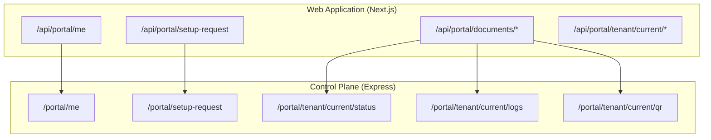
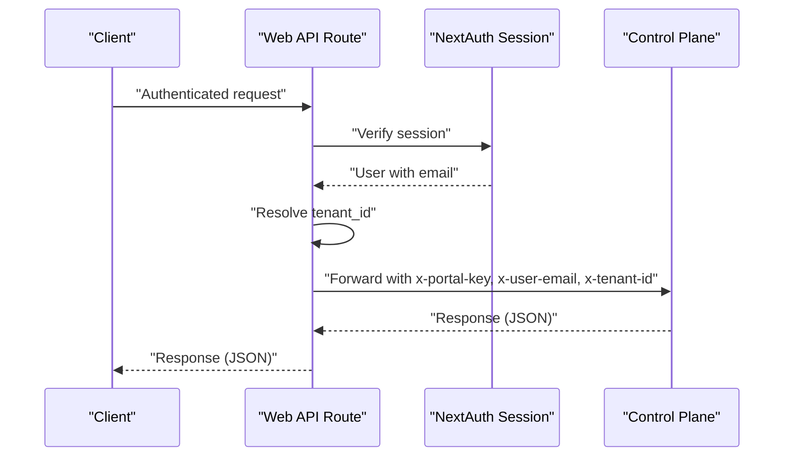
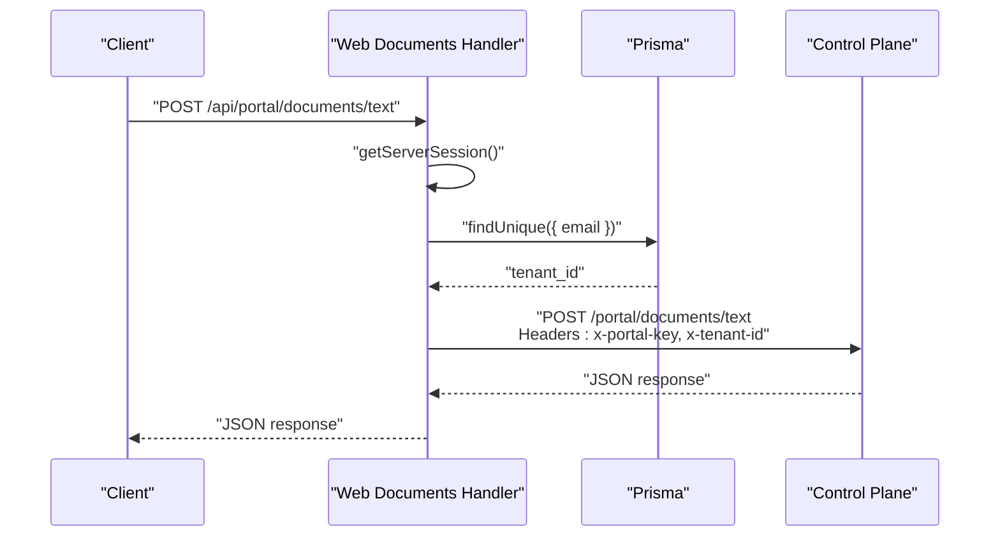
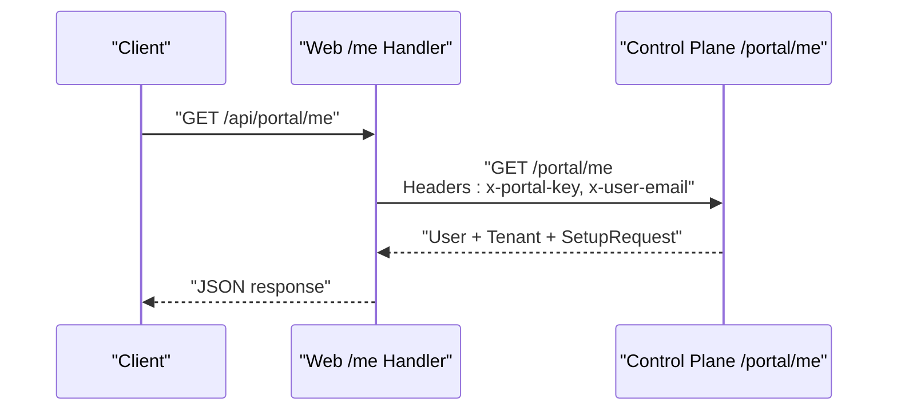
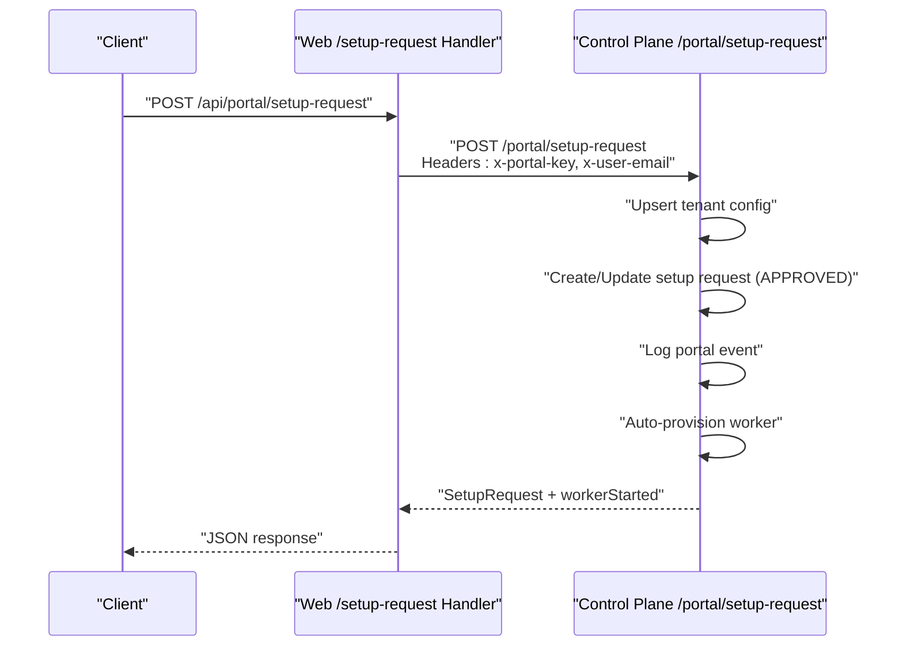
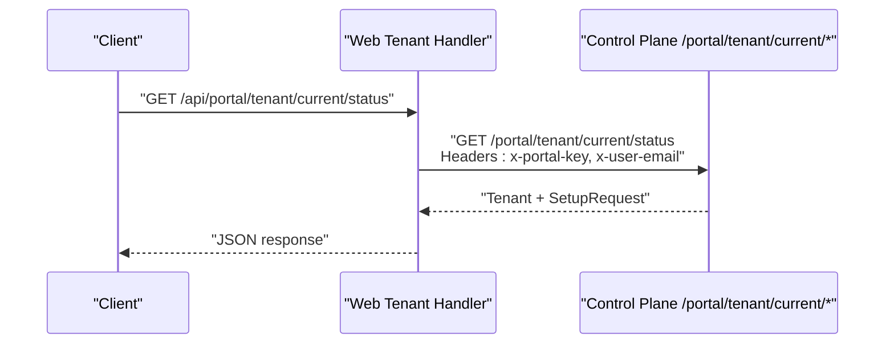
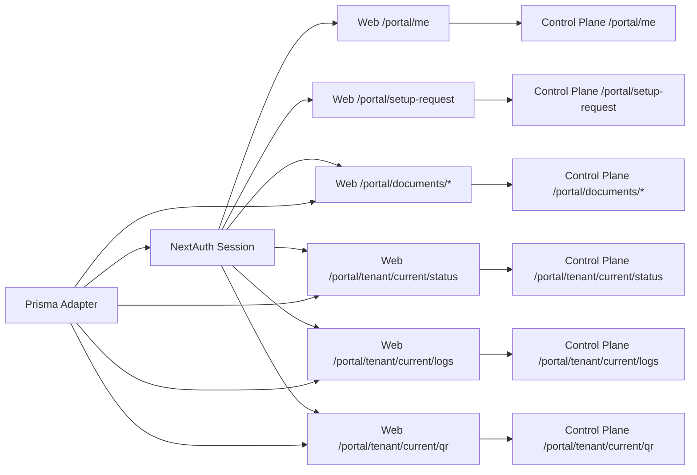

# Portal Endpoints

<cite>
**Referenced Files in This Document**
- [apps/web/src/app/api/portal/documents/route.ts](file://apps/web/src/app/api/portal/documents/route.ts)
- [apps/web/src/app/api/portal/documents/text/route.ts](file://apps/web/src/app/api/portal/documents/text/route.ts)
- [apps/web/src/app/api/portal/documents/upload/route.ts](file://apps/web/src/app/api/portal/documents/upload/route.ts)
- [apps/web/src/app/api/portal/documents/url/route.ts](file://apps/web/src/app/api/portal/documents/url/route.ts)
- [apps/web/src/app/api/portal/me/route.ts](file://apps/web/src/app/api/portal/me/route.ts)
- [apps/web/src/app/api/portal/setup-request/route.ts](file://apps/web/src/app/api/portal/setup-request/route.ts)
- [apps/web/src/app/api/portal/tenant/current/status/route.ts](file://apps/web/src/app/api/portal/tenant/current/status/route.ts)
- [apps/web/src/app/api/portal/tenant/current/logs/route.ts](file://apps/web/src/app/api/portal/tenant/current/logs/route.ts)
- [apps/web/src/app/api/portal/tenant/current/qr/route.ts](file://apps/web/src/app/api/portal/tenant/current/qr/route.ts)
- [apps/control-plane/src/routes/portal.ts](file://apps/control-plane/src/routes/portal.ts)
- [apps/control-plane/src/server.ts](file://apps/control-plane/src/server.ts)
- [apps/web/src/lib/auth.ts](file://apps/web/src/lib/auth.ts)
- [apps/web/src/lib/prisma.ts](file://apps/web/src/lib/prisma.ts)
</cite>

## Table of Contents
1. [Introduction](#introduction)
2. [Project Structure](#project-structure)
3. [Core Components](#core-components)
4. [Architecture Overview](#architecture-overview)
5. [Detailed Component Analysis](#detailed-component-analysis)
6. [Dependency Analysis](#dependency-analysis)
7. [Performance Considerations](#performance-considerations)
8. [Troubleshooting Guide](#troubleshooting-guide)
9. [Conclusion](#conclusion)

## Introduction
This document describes the Portal Endpoints that provide a secure interface for authenticated users to manage their tenant resources, submit setup requests, and access tenant-specific information such as status, logs, and QR codes. The portal endpoints are implemented as Next.js App Router API handlers in the web application and proxy authenticated requests to the Control Plane service, which enforces internal portal keys and tenant scoping.

## Project Structure
The portal endpoints are organized under the Next.js App Router at:
- apps/web/src/app/api/portal/*

Each handler validates the user session, extracts the tenant context, and forwards requests to the Control Plane service with appropriate headers. The Control Plane exposes the actual business logic under /portal routes.

**Diagram sources**
- [apps/web/src/app/api/portal/me/route.ts](file://apps/web/src/app/api/portal/me/route.ts#L1-L35)
- [apps/web/src/app/api/portal/setup-request/route.ts](file://apps/web/src/app/api/portal/setup-request/route.ts#L1-L40)
- [apps/web/src/app/api/portal/documents/route.ts](file://apps/web/src/app/api/portal/documents/route.ts#L1-L58)
- [apps/web/src/app/api/portal/tenant/current/status/route.ts](file://apps/web/src/app/api/portal/tenant/current/status/route.ts#L1-L35)
- [apps/web/src/app/api/portal/tenant/current/logs/route.ts](file://apps/web/src/app/api/portal/tenant/current/logs/route.ts#L1-L35)
- [apps/web/src/app/api/portal/tenant/current/qr/route.ts](file://apps/web/src/app/api/portal/tenant/current/qr/route.ts#L1-L35)
- [apps/control-plane/src/routes/portal.ts](file://apps/control-plane/src/routes/portal.ts#L1-L261)

**Section sources**
- [apps/web/src/app/api/portal/me/route.ts](file://apps/web/src/app/api/portal/me/route.ts#L1-L35)
- [apps/web/src/app/api/portal/setup-request/route.ts](file://apps/web/src/app/api/portal/setup-request/route.ts#L1-L40)
- [apps/web/src/app/api/portal/documents/route.ts](file://apps/web/src/app/api/portal/documents/route.ts#L1-L58)
- [apps/web/src/app/api/portal/tenant/current/status/route.ts](file://apps/web/src/app/api/portal/tenant/current/status/route.ts#L1-L35)
- [apps/web/src/app/api/portal/tenant/current/logs/route.ts](file://apps/web/src/app/api/portal/tenant/current/logs/route.ts#L1-L35)
- [apps/web/src/app/api/portal/tenant/current/qr/route.ts](file://apps/web/src/app/api/portal/tenant/current/qr/route.ts#L1-L35)
- [apps/control-plane/src/routes/portal.ts](file://apps/control-plane/src/routes/portal.ts#L1-L261)

## Core Components
- Authentication and session management powered by NextAuth.js with Google provider and Prisma adapter.
- Tenant-aware portal endpoints that extract tenant_id from the authenticated user and forward requests to the Control Plane.
- Internal key validation in the Control Plane to prevent unauthorized access to portal routes.
- Proxy-style handlers in the web app that forward requests with scoped headers (x-portal-key, x-tenant-id, x-user-email).

Key responsibilities:
- apps/web/src/app/api/portal/*: Validate session, resolve tenant_id, and proxy to Control Plane.
- apps/control-plane/src/routes/portal.ts: Enforce portal internal key, resolve user/tenant, and implement business logic.

**Section sources**
- [apps/web/src/lib/auth.ts](file://apps/web/src/lib/auth.ts#L1-L63)
- [apps/web/src/lib/prisma.ts](file://apps/web/src/lib/prisma.ts#L1-L10)
- [apps/web/src/app/api/portal/me/route.ts](file://apps/web/src/app/api/portal/me/route.ts#L1-L35)
- [apps/control-plane/src/routes/portal.ts](file://apps/control-plane/src/routes/portal.ts#L1-L261)

## Architecture Overview
The portal endpoints follow a layered architecture:
- Presentation Layer: Next.js API routes under /api/portal.
- Identity Layer: NextAuth.js session validation and user/tenant resolution.
- Gateway Layer: Web app proxies requests to the Control Plane with tenant-scoped headers.
- Business Layer: Control Plane routes enforce internal keys and implement tenant-centric operations.

**Diagram sources**
- [apps/web/src/app/api/portal/me/route.ts](file://apps/web/src/app/api/portal/me/route.ts#L8-L34)
- [apps/web/src/lib/auth.ts](file://apps/web/src/lib/auth.ts#L34-L56)
- [apps/control-plane/src/routes/portal.ts](file://apps/control-plane/src/routes/portal.ts#L11-L25)

## Detailed Component Analysis

### Portal Documents Endpoints
These endpoints handle document operations for the authenticated tenant:
- GET /portal/documents: Lists tenant documents by forwarding to Control Plane.
- DELETE /portal/documents: Deletes a document by ID.
- POST /portal/documents/text: Creates a document from raw text.
- POST /portal/documents/upload: Uploads a file to the tenant’s document store.
- POST /portal/documents/url: Creates a document from a URL.

Processing logic:
- Extract session user email.
- Resolve tenant_id from the user record.
- Forward request to Control Plane with x-portal-key and x-tenant-id.
- Return proxied response with original status codes.

**Diagram sources**
- [apps/web/src/app/api/portal/documents/text/route.ts](file://apps/web/src/app/api/portal/documents/text/route.ts#L9-L36)
- [apps/web/src/lib/prisma.ts](file://apps/web/src/lib/prisma.ts#L1-L10)
- [apps/control-plane/src/routes/portal.ts](file://apps/control-plane/src/routes/portal.ts#L1-L261)

**Section sources**
- [apps/web/src/app/api/portal/documents/route.ts](file://apps/web/src/app/api/portal/documents/route.ts#L1-L58)
- [apps/web/src/app/api/portal/documents/text/route.ts](file://apps/web/src/app/api/portal/documents/text/route.ts#L1-L37)
- [apps/web/src/app/api/portal/documents/upload/route.ts](file://apps/web/src/app/api/portal/documents/upload/route.ts#L1-L42)
- [apps/web/src/app/api/portal/documents/url/route.ts](file://apps/web/src/app/api/portal/documents/url/route.ts#L1-L37)

### Portal Me Endpoint
Retrieves the authenticated user’s profile, associated tenant, and latest setup request.

Behavior:
- Validates session and extracts user email.
- Proxies to Control Plane with x-portal-key and x-user-email.
- Handles non-OK responses from Control Plane and returns mapped errors.

**Diagram sources**
- [apps/web/src/app/api/portal/me/route.ts](file://apps/web/src/app/api/portal/me/route.ts#L8-L34)
- [apps/control-plane/src/routes/portal.ts](file://apps/control-plane/src/routes/portal.ts#L52-L79)

**Section sources**
- [apps/web/src/app/api/portal/me/route.ts](file://apps/web/src/app/api/portal/me/route.ts#L1-L35)
- [apps/control-plane/src/routes/portal.ts](file://apps/control-plane/src/routes/portal.ts#L52-L79)

### Portal Setup Request Endpoint
Submits a setup request for the tenant, updates tenant configuration, auto-approves the request, logs the event, and attempts to auto-provision the worker.

Flow:
- Validate session and user.
- Upsert tenant configuration with provided details.
- Create or update setup request with APPROVED status.
- Log portal event.
- Attempt to start worker via provisioner.
- Return setup request result and worker status.

**Diagram sources**
- [apps/web/src/app/api/portal/setup-request/route.ts](file://apps/web/src/app/api/portal/setup-request/route.ts#L8-L39)
- [apps/control-plane/src/routes/portal.ts](file://apps/control-plane/src/routes/portal.ts#L85-L168)

**Section sources**
- [apps/web/src/app/api/portal/setup-request/route.ts](file://apps/web/src/app/api/portal/setup-request/route.ts#L1-L40)
- [apps/control-plane/src/routes/portal.ts](file://apps/control-plane/src/routes/portal.ts#L85-L168)

### Portal Tenant Current Endpoints
- Status: Returns tenant status, WhatsApp session, and worker process.
- Logs: Returns recent message logs for the tenant with optional limit.
- QR: Returns the latest QR code state and image for tenant WhatsApp session.

All endpoints:
- Validate session and extract user email.
- Resolve tenant from user.
- Forward to Control Plane with x-portal-key and x-user-email.
- Return JSON response or propagate error.

**Diagram sources**
- [apps/web/src/app/api/portal/tenant/current/status/route.ts](file://apps/web/src/app/api/portal/tenant/current/status/route.ts#L8-L34)
- [apps/control-plane/src/routes/portal.ts](file://apps/control-plane/src/routes/portal.ts#L174-L201)

**Section sources**
- [apps/web/src/app/api/portal/tenant/current/status/route.ts](file://apps/web/src/app/api/portal/tenant/current/status/route.ts#L1-L35)
- [apps/web/src/app/api/portal/tenant/current/logs/route.ts](file://apps/web/src/app/api/portal/tenant/current/logs/route.ts#L1-L35)
- [apps/web/src/app/api/portal/tenant/current/qr/route.ts](file://apps/web/src/app/api/portal/tenant/current/qr/route.ts#L1-L35)
- [apps/control-plane/src/routes/portal.ts](file://apps/control-plane/src/routes/portal.ts#L174-L258)

## Dependency Analysis
- Web API routes depend on NextAuth.js for session validation and Prisma for user/tenant lookup.
- Control Plane routes depend on Prisma for database operations and the provisioner for worker lifecycle.
- All portal routes are protected by an internal key header checked in the Control Plane middleware.
- Tenant scoping is enforced by passing x-tenant-id from the web app to the Control Plane.

**Diagram sources**
- [apps/web/src/lib/auth.ts](file://apps/web/src/lib/auth.ts#L1-L63)
- [apps/web/src/lib/prisma.ts](file://apps/web/src/lib/prisma.ts#L1-L10)
- [apps/web/src/app/api/portal/me/route.ts](file://apps/web/src/app/api/portal/me/route.ts#L1-L35)
- [apps/web/src/app/api/portal/setup-request/route.ts](file://apps/web/src/app/api/portal/setup-request/route.ts#L1-L40)
- [apps/web/src/app/api/portal/documents/route.ts](file://apps/web/src/app/api/portal/documents/route.ts#L1-L58)
- [apps/web/src/app/api/portal/tenant/current/status/route.ts](file://apps/web/src/app/api/portal/tenant/current/status/route.ts#L1-L35)
- [apps/web/src/app/api/portal/tenant/current/logs/route.ts](file://apps/web/src/app/api/portal/tenant/current/logs/route.ts#L1-L35)
- [apps/web/src/app/api/portal/tenant/current/qr/route.ts](file://apps/web/src/app/api/portal/tenant/current/qr/route.ts#L1-L35)
- [apps/control-plane/src/routes/portal.ts](file://apps/control-plane/src/routes/portal.ts#L1-L261)

**Section sources**
- [apps/web/src/lib/auth.ts](file://apps/web/src/lib/auth.ts#L1-L63)
- [apps/web/src/lib/prisma.ts](file://apps/web/src/lib/prisma.ts#L1-L10)
- [apps/control-plane/src/server.ts](file://apps/control-plane/src/server.ts#L1-L174)

## Performance Considerations
- Session validation occurs on every request; keep NextAuth configuration efficient and avoid unnecessary database reads.
- Document upload endpoint forwards multipart/form-data directly to the Control Plane to minimize memory overhead.
- Control Plane endpoints use pagination-friendly limits for logs retrieval.
- Consider adding caching for frequently accessed tenant status and QR data if latency is a concern.

## Troubleshooting Guide
Common issues and resolutions:
- Unauthorized access:
  - Verify that the x-portal-key header matches the configured internal key in the Control Plane.
  - Ensure the user is authenticated and session contains the email claim.
- Tenant not found:
  - Confirm that the user is linked to a tenant and that tenant_id is present.
- Control Plane connectivity:
  - Check CONTROL_PLANE_URL and PORTAL_INTERNAL_KEY environment variables in the web app.
  - Verify that the Control Plane service is reachable and logging indicates successful startup.
- Worker provisioning failures:
  - Review Control Plane logs for auto-provision errors and ensure Puppeteer executable path is configured in production.

**Section sources**
- [apps/web/src/app/api/portal/me/route.ts](file://apps/web/src/app/api/portal/me/route.ts#L15-L34)
- [apps/web/src/app/api/portal/setup-request/route.ts](file://apps/web/src/app/api/portal/setup-request/route.ts#L17-L39)
- [apps/web/src/app/api/portal/documents/upload/route.ts](file://apps/web/src/app/api/portal/documents/upload/route.ts#L22-L41)
- [apps/control-plane/src/server.ts](file://apps/control-plane/src/server.ts#L18-L40)
- [apps/control-plane/src/routes/portal.ts](file://apps/control-plane/src/routes/portal.ts#L152-L161)

## Conclusion
The Portal Endpoints provide a secure, tenant-scoped interface for managing tenant resources and submitting setup requests. By validating sessions, resolving tenant contexts, and enforcing an internal portal key in the Control Plane, the system ensures proper isolation and authorization. The proxy pattern allows the web application to remain thin while delegating business logic to the Control Plane.