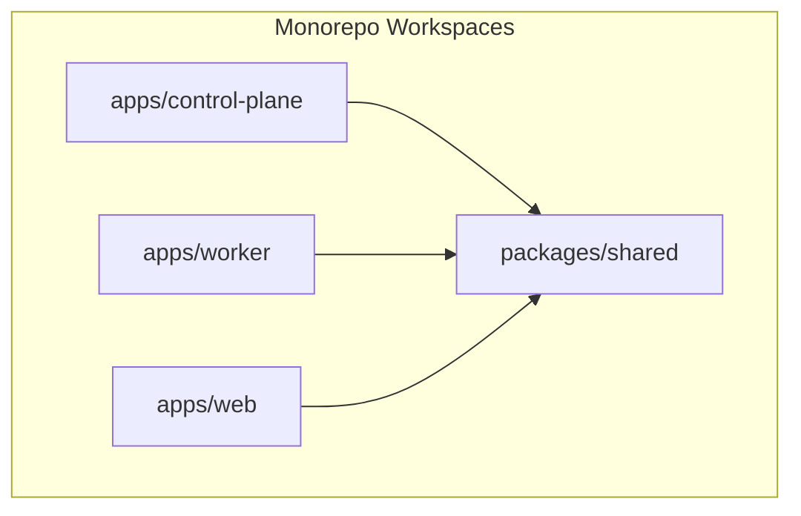
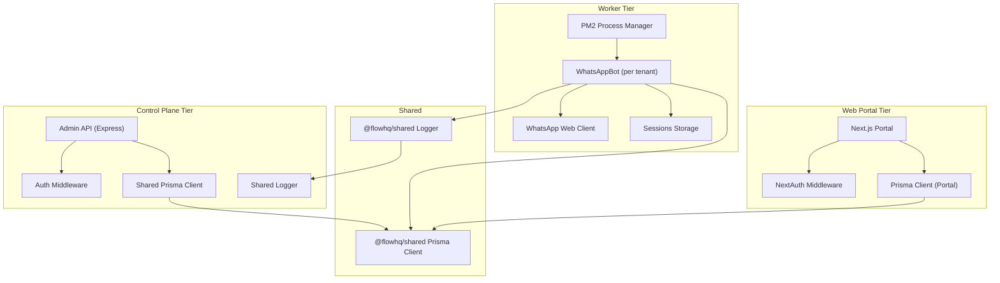
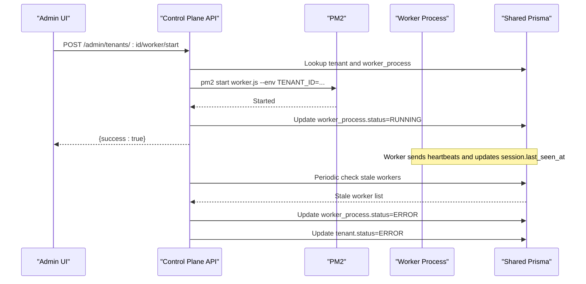
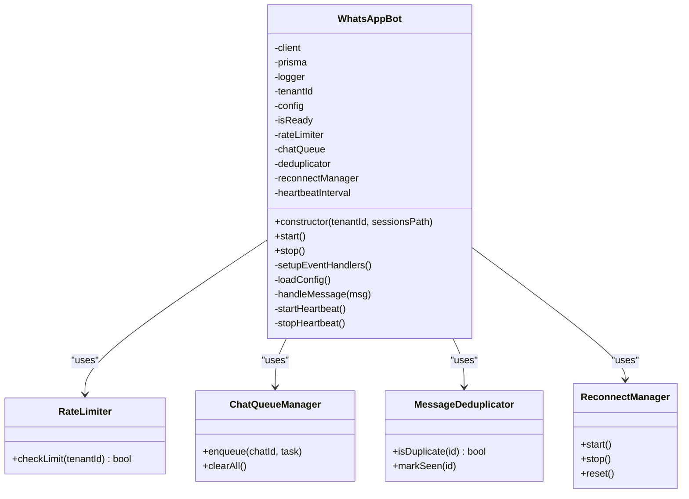
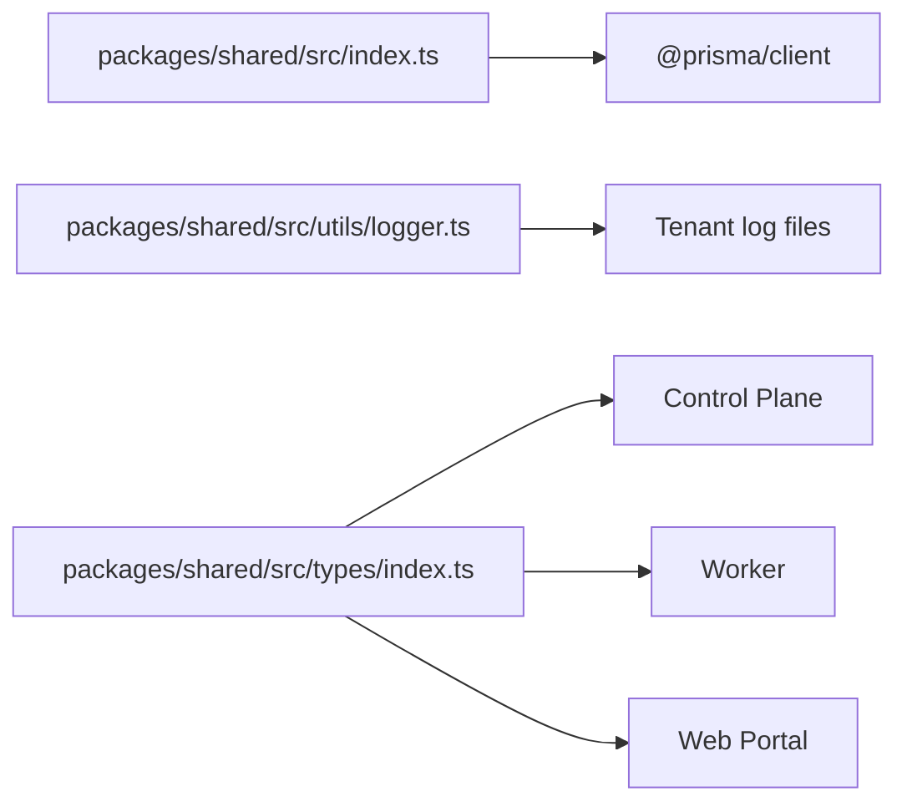
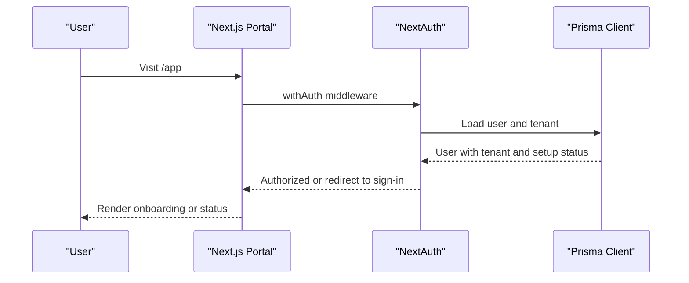
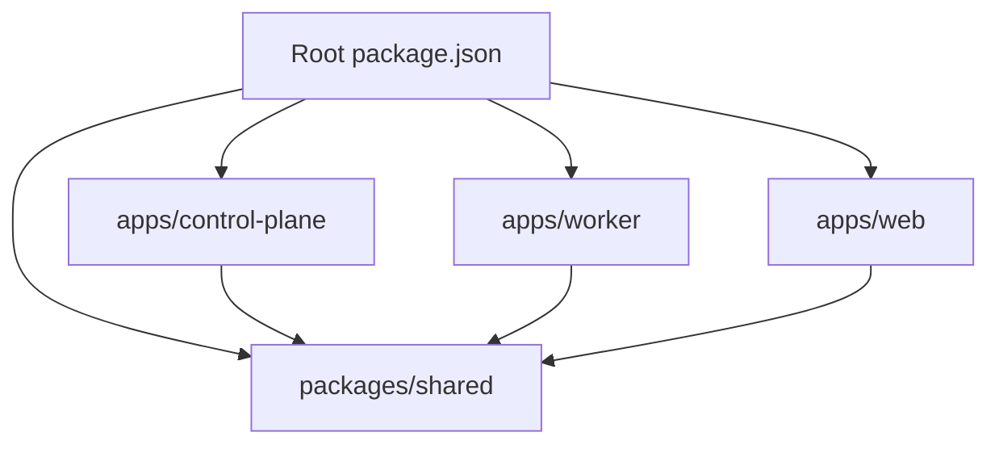

# Architecture Overview

<cite>
**Referenced Files in This Document**
- [package.json](file://package.json)
- [ecosystem.config.js](file://ecosystem.config.js)
- [apps/control-plane/src/server.ts](file://apps/control-plane/src/server.ts)
- [apps/control-plane/src/routes/admin.ts](file://apps/control-plane/src/routes/admin.ts)
- [apps/control-plane/src/middleware/auth.ts](file://apps/control-plane/src/middleware/auth.ts)
- [apps/worker/src/worker.ts](file://apps/worker/src/worker.ts)
- [apps/worker/src/bot.ts](file://apps/worker/src/bot.ts)
- [packages/shared/src/index.ts](file://packages/shared/src/index.ts)
- [packages/shared/src/utils/logger.ts](file://packages/shared/src/utils/logger.ts)
- [packages/shared/src/types/index.ts](file://packages/shared/src/types/index.ts)
- [apps/web/src/lib/prisma.ts](file://apps/web/src/lib/prisma.ts)
- [apps/web/src/middleware.ts](file://apps/web/src/middleware.ts)
- [apps/web/src/lib/auth.ts](file://apps/web/src/lib/auth.ts)
</cite>

## Table of Contents
1. [Introduction](#introduction)
2. [Project Structure](#project-structure)
3. [Core Components](#core-components)
4. [Architecture Overview](#architecture-overview)
5. [Detailed Component Analysis](#detailed-component-analysis)
6. [Dependency Analysis](#dependency-analysis)
7. [Performance Considerations](#performance-considerations)
8. [Troubleshooting Guide](#troubleshooting-guide)
9. [Conclusion](#conclusion)

## Introduction
This document presents the Flow HQ architecture overview for a multi-tenant WhatsApp automation platform. The system follows a three-tier architecture:
- Control Plane: Admin API and dashboard for tenant lifecycle and worker orchestration
- Worker processes: Per-tenant WhatsApp bots managed via PM2
- Shared components: Common utilities and Prisma client

It also documents the microservices pattern within a monorepo, inter-component communication, data flow, scalability, fault tolerance, and the role of PM2 in process management.

## Project Structure
Flow HQ uses a monorepo with workspaces for modular development:
- apps/control-plane: Express-based Control Plane with admin routes and auth middleware
- apps/worker: Per-tenant WhatsApp bot service with PM2 orchestration
- apps/web: Next.js portal for tenant onboarding and status
- packages/shared: Shared Prisma client and logging utilities
- Root scripts and configs for building, DB migration, and process management

**Diagram sources**
- [package.json](file://package.json#L5-L8)

**Section sources**
- [package.json](file://package.json#L1-L21)

## Core Components
- Control Plane (Express server)
  - Validates environment, connects to database, sets up routes, and runs periodic tasks
  - Exposes admin APIs for tenant management and worker lifecycle
- Worker (PM2-managed per-tenant)
  - Initializes WhatsApp client, handles messages, enforces rate limits, queues chats, de-duplicates messages, reconnects on failures
  - Sends heartbeats and updates status in the database
- Shared (utilities and Prisma)
  - Re-exports Prisma client and provides structured logging with tenant-aware log files
  - Defines common types for tenant, creation inputs, and message logs
- Web Portal (Next.js)
  - Authentication via NextAuth with Google provider
  - Middleware protection and onboarding redirects
  - Uses shared Prisma client

Key responsibilities:
- Tenant isolation: Workers run per tenant ID; logs and sessions are isolated by tenant
- Worker orchestration: Control Plane starts/stops/restarts workers via PM2 commands
- Multi-tenant architecture: Each tenant has dedicated records for config, session, worker process, and logs

**Section sources**
- [apps/control-plane/src/server.ts](file://apps/control-plane/src/server.ts#L1-L89)
- [apps/control-plane/src/routes/admin.ts](file://apps/control-plane/src/routes/admin.ts#L1-L528)
- [apps/control-plane/src/middleware/auth.ts](file://apps/control-plane/src/middleware/auth.ts#L1-L40)
- [apps/worker/src/worker.ts](file://apps/worker/src/worker.ts#L1-L46)
- [apps/worker/src/bot.ts](file://apps/worker/src/bot.ts#L1-L411)
- [packages/shared/src/index.ts](file://packages/shared/src/index.ts#L1-L4)
- [packages/shared/src/utils/logger.ts](file://packages/shared/src/utils/logger.ts#L1-L33)
- [packages/shared/src/types/index.ts](file://packages/shared/src/types/index.ts#L1-L41)
- [apps/web/src/lib/prisma.ts](file://apps/web/src/lib/prisma.ts#L1-L10)
- [apps/web/src/middleware.ts](file://apps/web/src/middleware.ts#L1-L44)
- [apps/web/src/lib/auth.ts](file://apps/web/src/lib/auth.ts#L1-L76)

## Architecture Overview
High-level architecture:
- Control Plane exposes admin endpoints and serves a dashboard
- Control Plane orchestrates per-tenant Workers via PM2
- Workers connect to WhatsApp, process messages, and persist state to the database
- Shared Prisma client is used across Control Plane, Worker, and Web Portal
- Web Portal authenticates users and guides onboarding; it reads/writes tenant data via shared Prisma

**Diagram sources**
- [apps/control-plane/src/server.ts](file://apps/control-plane/src/server.ts#L1-L89)
- [apps/control-plane/src/routes/admin.ts](file://apps/control-plane/src/routes/admin.ts#L1-L528)
- [apps/worker/src/bot.ts](file://apps/worker/src/bot.ts#L1-L411)
- [apps/web/src/lib/prisma.ts](file://apps/web/src/lib/prisma.ts#L1-L10)
- [apps/web/src/middleware.ts](file://apps/web/src/middleware.ts#L1-L44)
- [packages/shared/src/index.ts](file://packages/shared/src/index.ts#L1-L4)
- [packages/shared/src/utils/logger.ts](file://packages/shared/src/utils/logger.ts#L1-L33)

## Detailed Component Analysis

### Control Plane: Admin API and Orchestration
- Responsibilities
  - Validates environment and database connectivity
  - Serves admin routes for tenants, setup requests, QR retrieval, and logs
  - Starts/stops/restarts per-tenant workers via PM2 commands
  - Periodically marks stale workers based on session heartbeat
  - Protects admin endpoints with basic auth middleware
- Interactions
  - Uses shared Prisma client to manage tenants, sessions, worker processes, and logs
  - Spawns worker processes with environment variables (tenant ID, sessions path)
  - Updates tenant status and worker status based on lifecycle events

**Diagram sources**
- [apps/control-plane/src/routes/admin.ts](file://apps/control-plane/src/routes/admin.ts#L174-L230)
- [apps/control-plane/src/server.ts](file://apps/control-plane/src/server.ts#L54-L63)

**Section sources**
- [apps/control-plane/src/server.ts](file://apps/control-plane/src/server.ts#L1-L89)
- [apps/control-plane/src/routes/admin.ts](file://apps/control-plane/src/routes/admin.ts#L1-L528)
- [apps/control-plane/src/middleware/auth.ts](file://apps/control-plane/src/middleware/auth.ts#L1-L40)

### Worker: Per-Tenant WhatsApp Bot
- Responsibilities
  - Initialize WhatsApp client with local auth sessions per tenant
  - Handle incoming messages with de-duplication, rate limiting, and chat queue
  - Respond using templates configured per tenant
  - Maintain heartbeats and update session/worker status
  - Reconnect on disconnect and mark as error after max attempts
- Isolation and resilience
  - Tenant isolation via environment variable and session storage path
  - Structured logging per tenant to separate logs
  - Graceful shutdown on SIGTERM/SIGINT

**Diagram sources**
- [apps/worker/src/bot.ts](file://apps/worker/src/bot.ts#L12-L75)

**Section sources**
- [apps/worker/src/worker.ts](file://apps/worker/src/worker.ts#L1-L46)
- [apps/worker/src/bot.ts](file://apps/worker/src/bot.ts#L1-L411)
- [packages/shared/src/utils/logger.ts](file://packages/shared/src/utils/logger.ts#L1-L33)

### Shared Components: Utilities and Prisma Client
- Shared Prisma client
  - Exported from @flowhq/shared for reuse across Control Plane, Worker, and Web Portal
- Logging
  - Tenant-aware logger with console and optional file transport
- Types
  - Common TypeScript interfaces for tenant, creation inputs, and message logs

**Diagram sources**
- [packages/shared/src/index.ts](file://packages/shared/src/index.ts#L1-L4)
- [packages/shared/src/utils/logger.ts](file://packages/shared/src/utils/logger.ts#L1-L33)
- [packages/shared/src/types/index.ts](file://packages/shared/src/types/index.ts#L1-L41)

**Section sources**
- [packages/shared/src/index.ts](file://packages/shared/src/index.ts#L1-L4)
- [packages/shared/src/utils/logger.ts](file://packages/shared/src/utils/logger.ts#L1-L33)
- [packages/shared/src/types/index.ts](file://packages/shared/src/types/index.ts#L1-L41)

### Web Portal: Authentication and Onboarding
- Responsibilities
  - NextAuth with Google provider
  - Middleware to protect portal routes and enforce onboarding flow
  - Uses shared Prisma client for user/tenant/session persistence
- Integration
  - Reads tenant setup status from session claims
  - Redirects between onboarding and status based on setup state

**Diagram sources**
- [apps/web/src/middleware.ts](file://apps/web/src/middleware.ts#L1-L44)
- [apps/web/src/lib/auth.ts](file://apps/web/src/lib/auth.ts#L1-L76)
- [apps/web/src/lib/prisma.ts](file://apps/web/src/lib/prisma.ts#L1-L10)

**Section sources**
- [apps/web/src/middleware.ts](file://apps/web/src/middleware.ts#L1-L44)
- [apps/web/src/lib/auth.ts](file://apps/web/src/lib/auth.ts#L1-L76)
- [apps/web/src/lib/prisma.ts](file://apps/web/src/lib/prisma.ts#L1-L10)

## Dependency Analysis
- Workspace composition
  - Root defines workspaces for apps and packages
- Internal dependencies
  - Control Plane depends on @flowhq/shared for Prisma and logging
  - Worker depends on @flowhq/shared for Prisma and logging
  - Web Portal depends on @flowhq/shared for Prisma client
- External dependencies
  - Control Plane uses Express, EJS, child_process for PM2 commands
  - Worker uses whatsapp-web.js, qrcode, and shared utilities
  - Web Portal uses NextAuth and Prisma adapter

**Diagram sources**
- [package.json](file://package.json#L5-L8)

**Section sources**
- [package.json](file://package.json#L1-L21)

## Performance Considerations
- Concurrency and isolation
  - Per-tenant Workers prevent cross-tenant interference and enable horizontal scaling
  - Chat queue ensures sequential processing per chat to avoid race conditions
- Rate limiting
  - Built-in rate limiter per tenant prevents flooding and throttling
- Heartbeat and stale detection
  - Heartbeat updates keep session alive; stale worker checker detects dead workers
- Logging overhead
  - Tenant-specific log files help isolate noisy tenants and reduce cross-tenant log noise
- Resource limits
  - PM2 instance configuration and memory thresholds help stabilize long-running workers

[No sources needed since this section provides general guidance]

## Troubleshooting Guide
- Control Plane startup
  - Environment validation failures halt startup; ensure DATABASE_URL, ADMIN_PASSWORD, PORTAL_INTERNAL_KEY are set
  - Database connectivity is validated before listening
- Worker startup
  - Missing TENANT_ID causes immediate exit
  - Puppeteer executable path warning in production indicates missing Chrome/Chromium
- Worker lifecycle
  - PM2 commands are executed to start/stop/restart workers; verify PM2 installation and permissions
  - Stale worker checker updates worker and tenant statuses to ERROR when heartbeats stop
- Logging
  - Shared logger writes to console and per-tenant files under logs directory
- Web Portal
  - NextAuth requires Google OAuth credentials; middleware redirects unauthenticated users to sign-in

**Section sources**
- [apps/control-plane/src/server.ts](file://apps/control-plane/src/server.ts#L17-L39)
- [apps/worker/src/worker.ts](file://apps/worker/src/worker.ts#L12-L15)
- [apps/control-plane/src/routes/admin.ts](file://apps/control-plane/src/routes/admin.ts#L30-L80)
- [packages/shared/src/utils/logger.ts](file://packages/shared/src/utils/logger.ts#L1-L33)
- [apps/web/src/middleware.ts](file://apps/web/src/middleware.ts#L10-L27)

## Conclusion
Flow HQ implements a clean three-tier, multi-tenant architecture within a monorepo:
- Control Plane manages orchestration and admin operations
- Worker processes provide per-tenant WhatsApp automation with robust isolation and resilience
- Shared components encapsulate common utilities and Prisma client
- PM2 enables reliable process management and lifecycle control
- The design supports scalability, fault tolerance, and maintainability through clear separation of concerns and tenant isolation.