# Core Features

<cite>
**Referenced Files in This Document**
- [README.md](file://README.md)
- [server.ts](file://apps/control-plane/src/server.ts)
- [admin.ts](file://apps/control-plane/src/routes/admin.ts)
- [worker.ts](file://apps/worker/src/worker.ts)
- [bot.ts](file://apps/worker/src/bot.ts)
- [index.ts](file://apps/worker/src/templates/index.ts)
- [booking.ts](file://apps/worker/src/templates/booking.ts)
- [rate-limiter.ts](file://apps/worker/src/utils/rate-limiter.ts)
- [chat-queue.ts](file://apps/worker/src/utils/chat-queue.ts)
- [dedup.ts](file://apps/worker/src/utils/dedup.ts)
- [reconnect.ts](file://apps/worker/src/utils/reconnect.ts)
- [logger.ts](file://packages/shared/src/utils/logger.ts)
- [types/index.ts](file://packages/shared/src/types/index.ts)
- [route.ts](file://apps/web/src/app/api/portal/tenant/current/status/route.ts)
- [route.ts](file://apps/web/src/app/api/portal/tenant/current/logs/route.ts)
- [route.ts](file://apps/web/src/app/api/portal/tenant/current/qr/route.ts)
</cite>

## Table of Contents
1. [Introduction](#introduction)
2. [Project Structure](#project-structure)
3. [Core Components](#core-components)
4. [Architecture Overview](#architecture-overview)
5. [Detailed Component Analysis](#detailed-component-analysis)
6. [Dependency Analysis](#dependency-analysis)
7. [Performance Considerations](#performance-considerations)
8. [Troubleshooting Guide](#troubleshooting-guide)
9. [Conclusion](#conclusion)
10. [Appendices](#appendices)

## Introduction
This document explains the Flow HQ core features centered around multi-tenant WhatsApp automation. It covers template-based message responses (Booking, E-commerce, Support), real-time worker status monitoring, QR code authentication, and the message logging system. It also details tenant isolation, worker lifecycle management, administrative dashboard functionality, rate limiting, heartbeat monitoring, auto-recovery, and guidance for customization and extension.

## Project Structure
Flow HQ is organized into three primary applications and a shared package:
- Control Plane: Admin API and dashboard (Express + EJS)
- Worker: Per-tenant WhatsApp bot process (whatsapp-web.js)
- Web Portal: Next.js frontend APIs for tenant status, logs, and QR
- Shared: Common types, Prisma client, and utilities

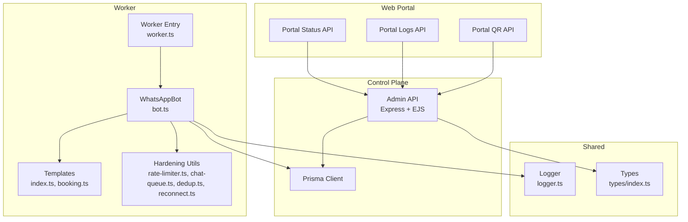

**Diagram sources**
- [server.ts](file://apps/control-plane/src/server.ts#L1-L89)
- [admin.ts](file://apps/control-plane/src/routes/admin.ts#L1-L528)
- [worker.ts](file://apps/worker/src/worker.ts#L1-L46)
- [bot.ts](file://apps/worker/src/bot.ts#L1-L411)
- [index.ts](file://apps/worker/src/templates/index.ts#L1-L70)
- [booking.ts](file://apps/worker/src/templates/booking.ts#L1-L22)
- [rate-limiter.ts](file://apps/worker/src/utils/rate-limiter.ts#L1-L110)
- [chat-queue.ts](file://apps/worker/src/utils/chat-queue.ts#L1-L140)
- [dedup.ts](file://apps/worker/src/utils/dedup.ts#L1-L93)
- [reconnect.ts](file://apps/worker/src/utils/reconnect.ts#L1-L117)
- [logger.ts](file://packages/shared/src/utils/logger.ts#L1-L33)
- [types/index.ts](file://packages/shared/src/types/index.ts#L1-L41)
- [route.ts](file://apps/web/src/app/api/portal/tenant/current/status/route.ts#L1-L35)
- [route.ts](file://apps/web/src/app/api/portal/tenant/current/logs/route.ts#L1-L35)
- [route.ts](file://apps/web/src/app/api/portal/tenant/current/qr/route.ts#L1-L35)

**Section sources**
- [README.md](file://README.md#L116-L129)
- [server.ts](file://apps/control-plane/src/server.ts#L1-L89)
- [admin.ts](file://apps/control-plane/src/routes/admin.ts#L1-L528)
- [worker.ts](file://apps/worker/src/worker.ts#L1-L46)
- [bot.ts](file://apps/worker/src/bot.ts#L1-L411)
- [index.ts](file://apps/worker/src/templates/index.ts#L1-L70)
- [booking.ts](file://apps/worker/src/templates/booking.ts#L1-L22)
- [rate-limiter.ts](file://apps/worker/src/utils/rate-limiter.ts#L1-L110)
- [chat-queue.ts](file://apps/worker/src/utils/chat-queue.ts#L1-L140)
- [dedup.ts](file://apps/worker/src/utils/dedup.ts#L1-L93)
- [reconnect.ts](file://apps/worker/src/utils/reconnect.ts#L1-L117)
- [logger.ts](file://packages/shared/src/utils/logger.ts#L1-L33)
- [types/index.ts](file://packages/shared/src/types/index.ts#L1-L41)
- [route.ts](file://apps/web/src/app/api/portal/tenant/current/status/route.ts#L1-L35)
- [route.ts](file://apps/web/src/app/api/portal/tenant/current/logs/route.ts#L1-L35)
- [route.ts](file://apps/web/src/app/api/portal/tenant/current/qr/route.ts#L1-L35)

## Core Components
- Multi-tenant WhatsApp automation: Each tenant runs an isolated worker process with its own session and template configuration.
- Template-based responses: Booking, E-commerce, and Support templates provide contextual replies based on language and intent.
- Real-time worker status monitoring: Heartbeat updates and stale worker detection keep the admin dashboard accurate.
- QR code authentication: QR generation and persistence enable device linking for each tenant.
- Message logging system: Bidirectional logs capture all incoming and outgoing messages per tenant.
- Tenant isolation: Database relations, per-tenant sessions, and per-tenant logging ensure strict separation.
- Worker lifecycle management: Start, stop, restart, and force-restart actions controlled via PM2 and the admin API.
- Administrative dashboard: Tenant listing, status, logs, QR retrieval, and setup request approvals.
- Rate limiting: Configurable replies-per-minute per tenant to prevent spam.
- Stability features: Heartbeat monitoring, auto-recovery with exponential backoff, per-chat queue, message de-duplication, and global error boundaries.

**Section sources**
- [README.md](file://README.md#L3-L10)
- [bot.ts](file://apps/worker/src/bot.ts#L1-L411)
- [index.ts](file://apps/worker/src/templates/index.ts#L1-L70)
- [rate-limiter.ts](file://apps/worker/src/utils/rate-limiter.ts#L1-L110)
- [chat-queue.ts](file://apps/worker/src/utils/chat-queue.ts#L1-L140)
- [dedup.ts](file://apps/worker/src/utils/dedup.ts#L1-L93)
- [reconnect.ts](file://apps/worker/src/utils/reconnect.ts#L1-L117)
- [admin.ts](file://apps/control-plane/src/routes/admin.ts#L1-L528)
- [server.ts](file://apps/control-plane/src/server.ts#L54-L81)
- [logger.ts](file://packages/shared/src/utils/logger.ts#L1-L33)

## Architecture Overview
The system comprises:
- Control Plane: Exposes admin endpoints, manages PM2 workers, and tracks tenant/workflow states.
- Worker: Runs per tenant, handles WhatsApp events, applies templates, enforces rate limits, and maintains logs.
- Web Portal: Provides tenant-facing APIs to fetch status, logs, and QR codes.
- Shared: Provides logging and type definitions used across Control Plane and Worker.

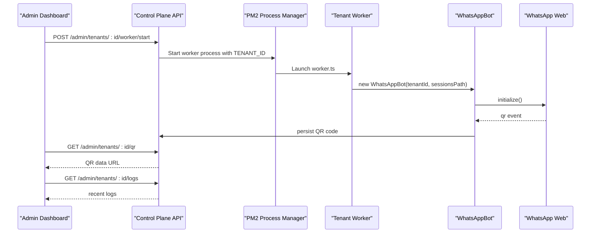

**Diagram sources**
- [admin.ts](file://apps/control-plane/src/routes/admin.ts#L174-L230)
- [worker.ts](file://apps/worker/src/worker.ts#L1-L46)
- [bot.ts](file://apps/worker/src/bot.ts#L77-L127)
- [server.ts](file://apps/control-plane/src/server.ts#L54-L81)

## Detailed Component Analysis

### Multi-Tenant WhatsApp Automation
- Each tenant has a dedicated worker process launched via PM2 with environment-specific TENANT_ID and SESSIONS_PATH.
- Sessions are stored under a per-tenant directory to ensure isolation.
- Template configuration is loaded per tenant to tailor responses.

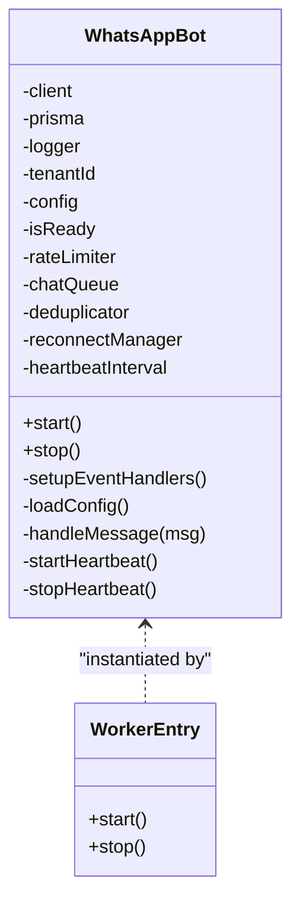

**Diagram sources**
- [bot.ts](file://apps/worker/src/bot.ts#L12-L411)
- [worker.ts](file://apps/worker/src/worker.ts#L1-L46)

**Section sources**
- [admin.ts](file://apps/control-plane/src/routes/admin.ts#L174-L230)
- [worker.ts](file://apps/worker/src/worker.ts#L1-L46)
- [bot.ts](file://apps/worker/src/bot.ts#L27-L75)

### Template-Based Message Responses
- Template selection is driven by TenantConfig (template_type, business_name, language).
- Supported templates: Booking, E-commerce, Support.
- Booking template recognizes booking-related keywords and responds accordingly in Swahili or English.

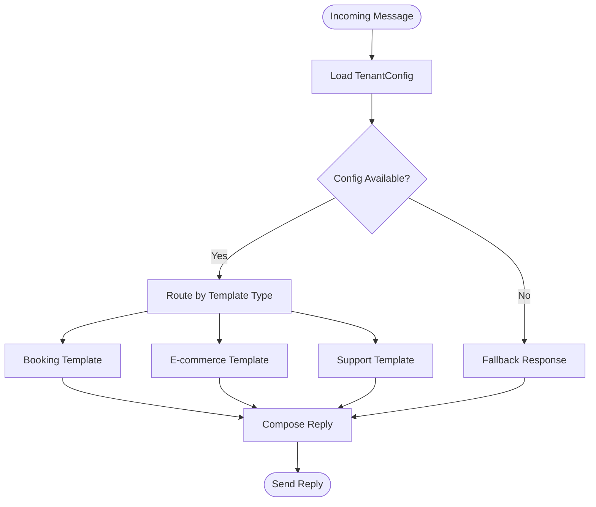

**Diagram sources**
- [index.ts](file://apps/worker/src/templates/index.ts#L9-L23)
- [booking.ts](file://apps/worker/src/templates/booking.ts#L1-L22)

**Section sources**
- [index.ts](file://apps/worker/src/templates/index.ts#L1-L70)
- [booking.ts](file://apps/worker/src/templates/booking.ts#L1-L22)
- [bot.ts](file://apps/worker/src/bot.ts#L228-L246)

### Real-Time Worker Status Monitoring
- Heartbeat: Worker sends periodic updates to update last_seen_at and worker status.
- Stale worker detection: Control Plane periodically marks workers without heartbeats as ERROR.
- Dashboard visibility: Admin dashboard reflects status, last seen, and worker state.

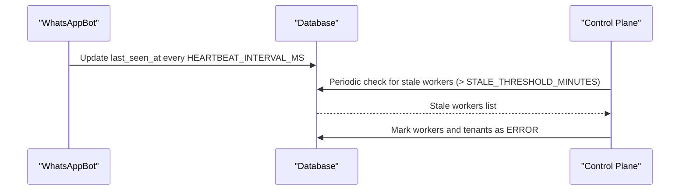

**Diagram sources**
- [bot.ts](file://apps/worker/src/bot.ts#L333-L367)
- [server.ts](file://apps/control-plane/src/server.ts#L54-L63)
- [admin.ts](file://apps/control-plane/src/routes/admin.ts#L30-L80)

**Section sources**
- [bot.ts](file://apps/worker/src/bot.ts#L333-L367)
- [server.ts](file://apps/control-plane/src/server.ts#L54-L63)
- [admin.ts](file://apps/control-plane/src/routes/admin.ts#L30-L80)

### QR Code Authentication
- QR event triggers QR code generation and persistence in the database.
- Admin can retrieve QR data URL for display and scanning.
- Session state transitions from DISCONNECTED to QR_READY to CONNECTED.

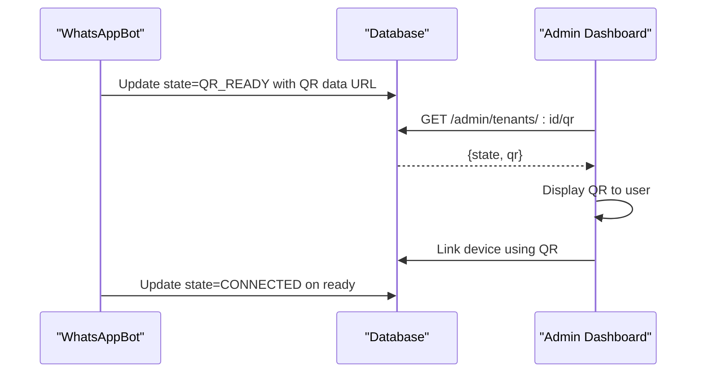

**Diagram sources**
- [bot.ts](file://apps/worker/src/bot.ts#L77-L96)
- [admin.ts](file://apps/control-plane/src/routes/admin.ts#L334-L352)

**Section sources**
- [bot.ts](file://apps/worker/src/bot.ts#L77-L127)
- [admin.ts](file://apps/control-plane/src/routes/admin.ts#L334-L352)

### Message Logging System
- Incoming and outgoing messages are logged with direction, numbers, and WhatsApp message IDs.
- Logs are scoped to tenant_id for isolation.
- Web portal APIs expose tenant logs and status.

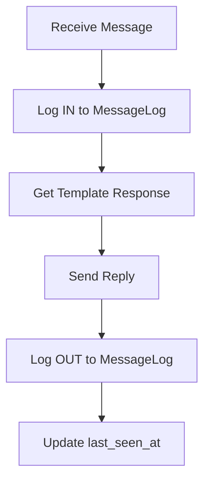

**Diagram sources**
- [bot.ts](file://apps/worker/src/bot.ts#L252-L311)
- [route.ts](file://apps/web/src/app/api/portal/tenant/current/logs/route.ts#L1-L35)

**Section sources**
- [bot.ts](file://apps/worker/src/bot.ts#L252-L311)
- [logger.ts](file://packages/shared/src/utils/logger.ts#L1-L33)
- [route.ts](file://apps/web/src/app/api/portal/tenant/current/logs/route.ts#L1-L35)

### Tenant Isolation Mechanism
- Database relations: Tenant includes TenantConfig, WhatsAppSession, and WorkerProcess.
- Session storage: LocalAuth dataPath per tenant ensures isolated session files.
- Logging: Logger writes per-tenant log files; message logs are filtered by tenant_id.
- Stress testing validates cross-tenant isolation.

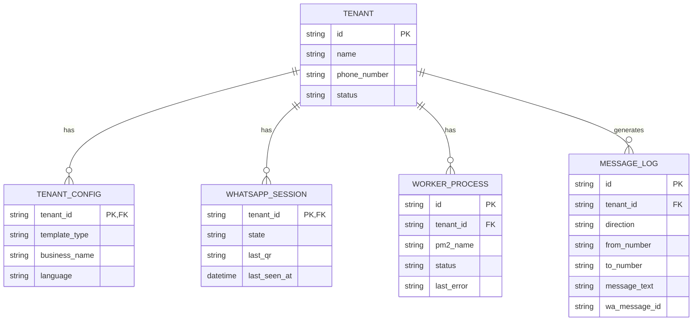

**Diagram sources**
- [types/index.ts](file://packages/shared/src/types/index.ts#L1-L41)
- [bot.ts](file://apps/worker/src/bot.ts#L58-L62)
- [logger.ts](file://packages/shared/src/utils/logger.ts#L19-L24)

**Section sources**
- [types/index.ts](file://packages/shared/src/types/index.ts#L1-L41)
- [bot.ts](file://apps/worker/src/bot.ts#L58-L62)
- [logger.ts](file://packages/shared/src/utils/logger.ts#L19-L24)
- [README.md](file://README.md#L221-L242)

### Worker Process Lifecycle Management
- Start: Validates environment, connects to DB, loads config, initializes client, sets status to QR_PENDING.
- Stop: Stops heartbeat, halts reconnect, clears queues, destroys client, disconnects DB.
- Restart/Force Restart: Controlled via PM2 commands; resets worker status and optionally re-links sessions.

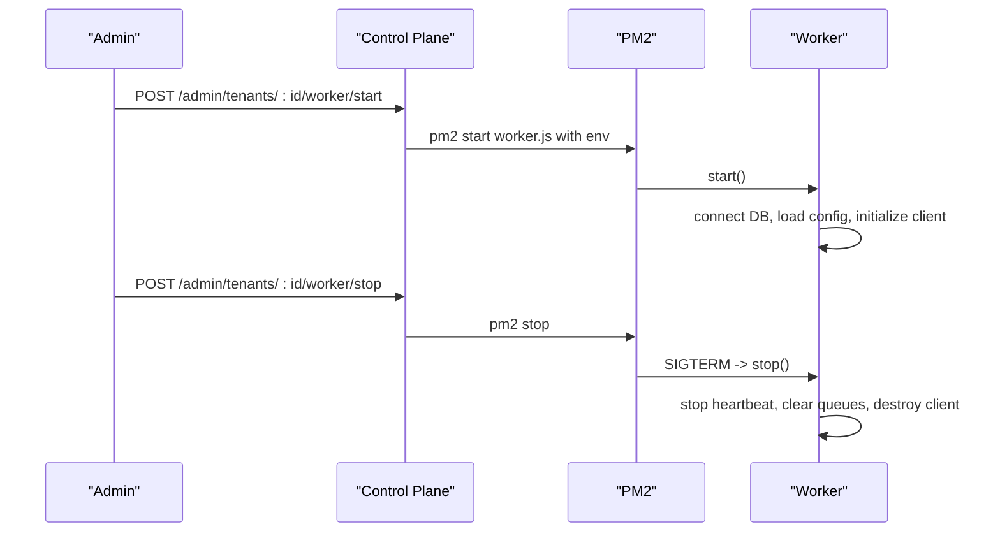

**Diagram sources**
- [admin.ts](file://apps/control-plane/src/routes/admin.ts#L174-L230)
- [worker.ts](file://apps/worker/src/worker.ts#L26-L46)
- [bot.ts](file://apps/worker/src/bot.ts#L369-L409)

**Section sources**
- [admin.ts](file://apps/control-plane/src/routes/admin.ts#L174-L283)
- [worker.ts](file://apps/worker/src/worker.ts#L1-L46)
- [bot.ts](file://apps/worker/src/bot.ts#L369-L409)

### Administrative Dashboard Functionality
- Tenant listing and detail pages with logs and status.
- Worker controls: start, stop, restart, force-restart.
- QR retrieval for linking devices.
- Setup request approvals trigger worker start and status updates.

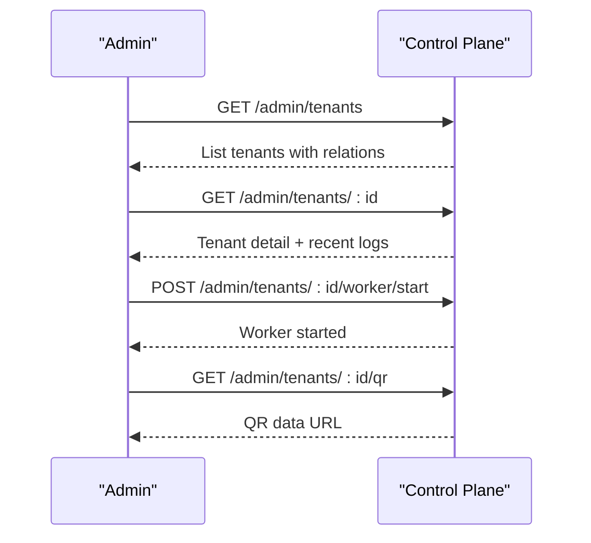

**Diagram sources**
- [admin.ts](file://apps/control-plane/src/routes/admin.ts#L82-L102)
- [admin.ts](file://apps/control-plane/src/routes/admin.ts#L142-L172)
- [admin.ts](file://apps/control-plane/src/routes/admin.ts#L174-L230)
- [admin.ts](file://apps/control-plane/src/routes/admin.ts#L334-L352)

**Section sources**
- [admin.ts](file://apps/control-plane/src/routes/admin.ts#L82-L172)
- [admin.ts](file://apps/control-plane/src/routes/admin.ts#L174-L230)
- [admin.ts](file://apps/control-plane/src/routes/admin.ts#L334-L352)

### Template System Architecture
- Centralized routing by template_type to specific handlers.
- Booking template supports intent recognition for Swahili and English.
- E-commerce and Support templates provide contextual guidance.

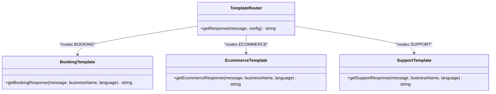

**Diagram sources**
- [index.ts](file://apps/worker/src/templates/index.ts#L9-L23)
- [booking.ts](file://apps/worker/src/templates/booking.ts#L1-L22)

**Section sources**
- [index.ts](file://apps/worker/src/templates/index.ts#L1-L70)
- [booking.ts](file://apps/worker/src/templates/booking.ts#L1-L22)

### Rate Limiting Implementation
- Per-tenant sliding window with configurable max replies per minute.
- Warning sent on first exceedance; subsequent replies suppressed until window reset.
- Configuration loaded from environment variables.

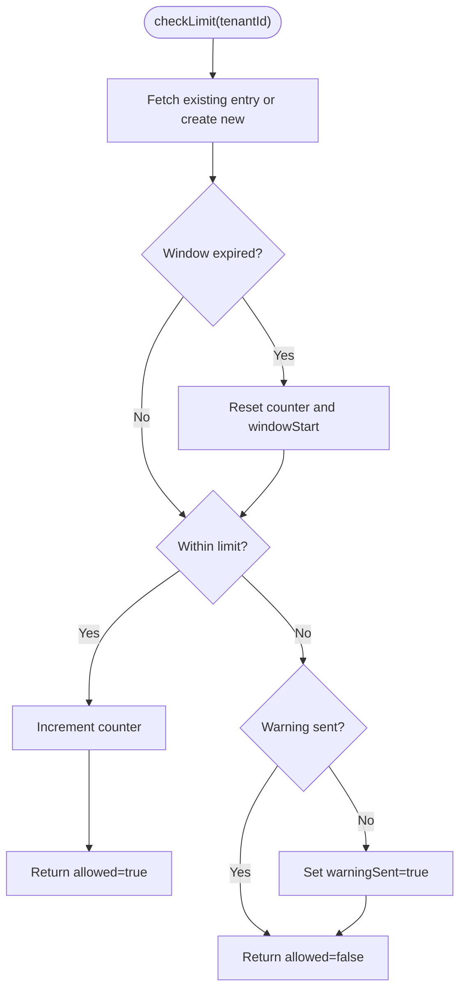

**Diagram sources**
- [rate-limiter.ts](file://apps/worker/src/utils/rate-limiter.ts#L32-L73)

**Section sources**
- [rate-limiter.ts](file://apps/worker/src/utils/rate-limiter.ts#L1-L110)
- [bot.ts](file://apps/worker/src/bot.ts#L264-L279)

### Stability Features
- Heartbeat monitoring: Worker updates last_seen_at and status periodically.
- Auto-recovery: Exponential backoff reconnect on disconnections.
- Per-chat queue: Sequential processing prevents race conditions.
- Message de-duplication: Prevents repeated processing of identical messages.
- Global error boundary: Message handling errors are caught and logged without crashing the worker.

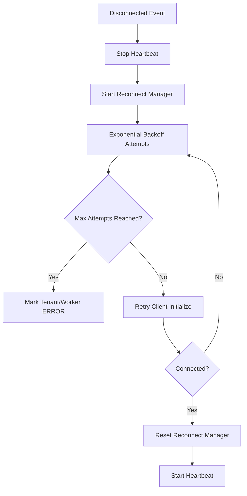

**Diagram sources**
- [bot.ts](file://apps/worker/src/bot.ts#L185-L225)
- [reconnect.ts](file://apps/worker/src/utils/reconnect.ts#L44-L93)

**Section sources**
- [bot.ts](file://apps/worker/src/bot.ts#L185-L225)
- [reconnect.ts](file://apps/worker/src/utils/reconnect.ts#L1-L117)
- [chat-queue.ts](file://apps/worker/src/utils/chat-queue.ts#L113-L138)
- [dedup.ts](file://apps/worker/src/utils/dedup.ts#L28-L46)

### Feature Customization and Extension Possibilities
- Add new templates: Create a new template module and register it in the template router.
- Adjust rate limiting: Tune environment variables for max replies per minute and window size.
- Modify heartbeat intervals: Configure heartbeat and stale thresholds via environment variables.
- Extend worker lifecycle: Integrate additional PM2 hooks or external monitoring.
- Enhance logging: Append transports or enrich log metadata in the shared logger.

**Section sources**
- [README.md](file://README.md#L244-L258)
- [index.ts](file://apps/worker/src/templates/index.ts#L1-L70)
- [rate-limiter.ts](file://apps/worker/src/utils/rate-limiter.ts#L98-L105)
- [logger.ts](file://packages/shared/src/utils/logger.ts#L26-L29)

## Dependency Analysis
- Control Plane depends on Prisma for data access and PM2 for process orchestration.
- Worker depends on whatsapp-web.js, LocalAuth for sessions, and shared logger.
- Web Portal APIs proxy tenant requests to Control Plane with internal keys.

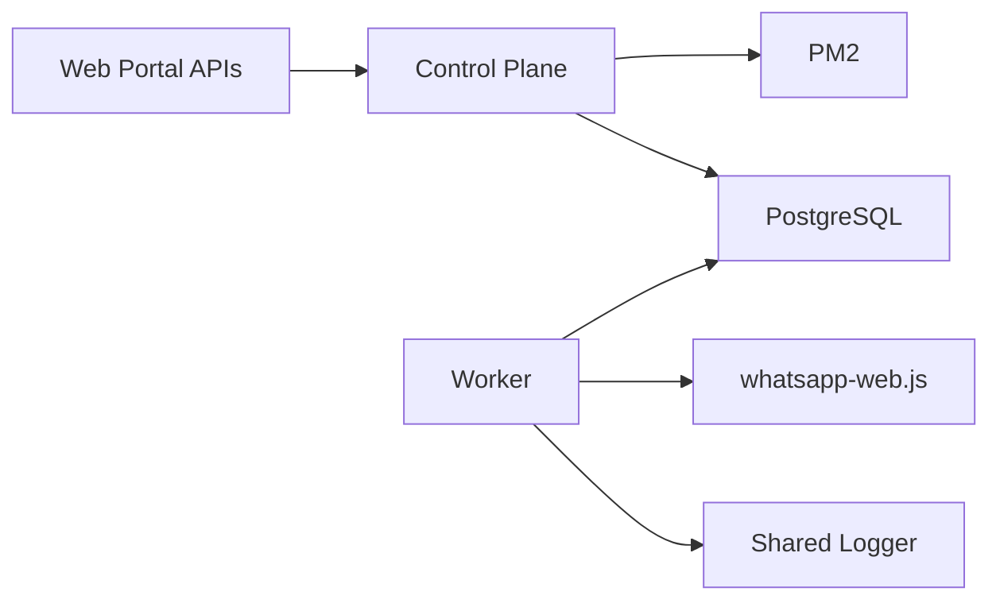

**Diagram sources**
- [admin.ts](file://apps/control-plane/src/routes/admin.ts#L1-L24)
- [worker.ts](file://apps/worker/src/worker.ts#L1-L10)
- [logger.ts](file://packages/shared/src/utils/logger.ts#L1-L33)
- [route.ts](file://apps/web/src/app/api/portal/tenant/current/status/route.ts#L15-L30)

**Section sources**
- [admin.ts](file://apps/control-plane/src/routes/admin.ts#L1-L24)
- [worker.ts](file://apps/worker/src/worker.ts#L1-L10)
- [logger.ts](file://packages/shared/src/utils/logger.ts#L1-L33)
- [route.ts](file://apps/web/src/app/api/portal/tenant/current/status/route.ts#L15-L30)

## Performance Considerations
- Per-tenant rate limiting prevents burst traffic from overwhelming a tenant’s conversation.
- Per-chat queue avoids contention and ensures ordered processing per customer thread.
- Heartbeat intervals and stale thresholds balance responsiveness with overhead.
- Exponential backoff reduces load during repeated failures and improves resilience.

[No sources needed since this section provides general guidance]

## Troubleshooting Guide
- QR code not appearing: Check worker logs, ensure worker started, and wait for QR propagation.
- Session not persisting: Verify sessions directory existence and permissions; confirm SESSIONS_PATH.
- Database connection errors: Confirm PostgreSQL is running and DATABASE_URL format.
- WhatsApp Web errors: Install Chromium/Chrome and set PUPPETEER_EXECUTABLE_PATH.
- Worker won’t start: Validate Chrome path and PUPPETEER_EXECUTABLE_PATH; inspect worker logs.
- Stale workers: Dashboard shows STALE; use Force Restart to recover.

**Section sources**
- [README.md](file://README.md#L185-L208)
- [README.md](file://README.md#L452-L474)

## Conclusion
Flow HQ delivers a robust, production-hardened multi-tenant WhatsApp automation platform. Its template-driven responses, real-time monitoring, QR authentication, and comprehensive logging provide a solid foundation for diverse business needs. Built-in stability features and lifecycle controls ensure reliability, while the modular architecture supports easy customization and extension.

[No sources needed since this section summarizes without analyzing specific files]

## Appendices

### Practical Examples and Use Cases
- Booking (Swahili/English): Clients request bookings and receive contextual prompts for service and date.
- E-commerce (Swahili/English): Clients inquire about prices and orders; bot guides them to product and delivery options.
- Support (Swahili/English): Clients report issues; bot escalates appropriately and provides assistance channels.

**Section sources**
- [booking.ts](file://apps/worker/src/templates/booking.ts#L1-L22)
- [index.ts](file://apps/worker/src/templates/index.ts#L25-L69)
- [README.md](file://README.md#L94-L104)

### Feature Limitations
- Rate limiting is enforced per tenant and per minute; bursts beyond the configured limit are suppressed after a warning.
- Workers are isolated by PM2 and tenant ID; cross-tenant data leakage is prevented by design.
- Heartbeat staleness thresholds apply to worker liveness; stale workers are auto-marked ERROR.

**Section sources**
- [rate-limiter.ts](file://apps/worker/src/utils/rate-limiter.ts#L32-L73)
- [admin.ts](file://apps/control-plane/src/routes/admin.ts#L30-L80)
- [README.md](file://README.md#L476-L489)