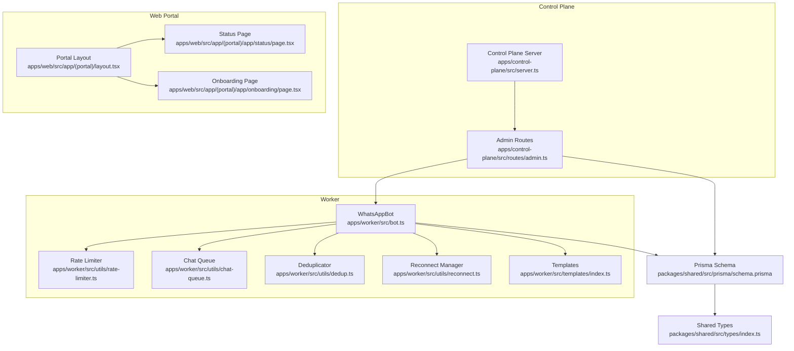
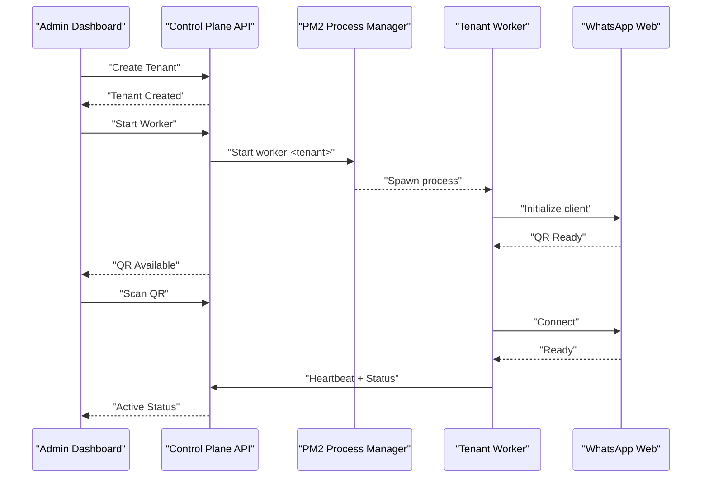
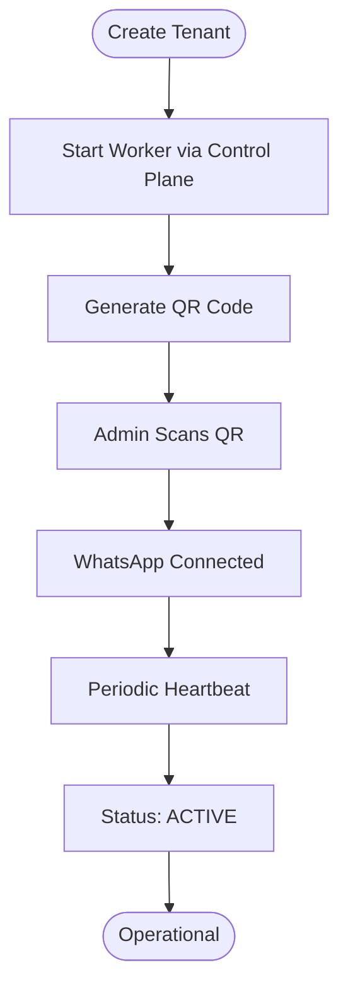
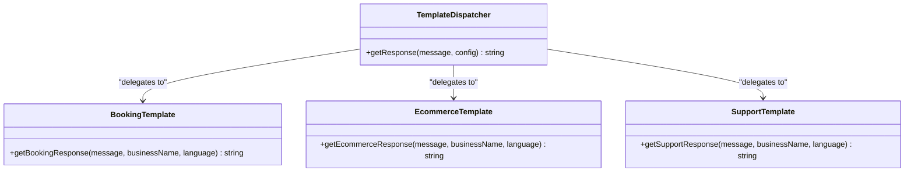
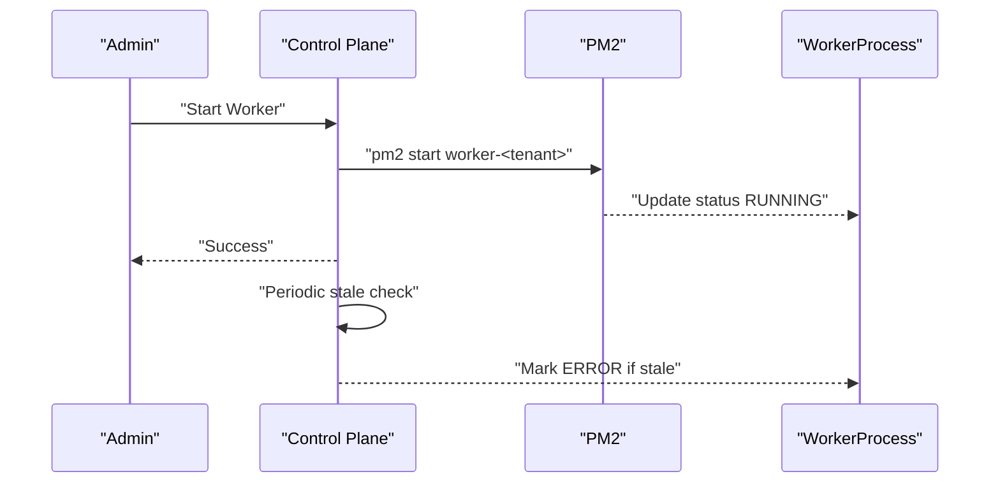
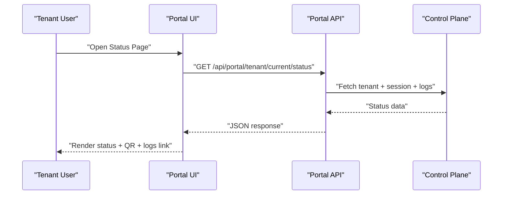
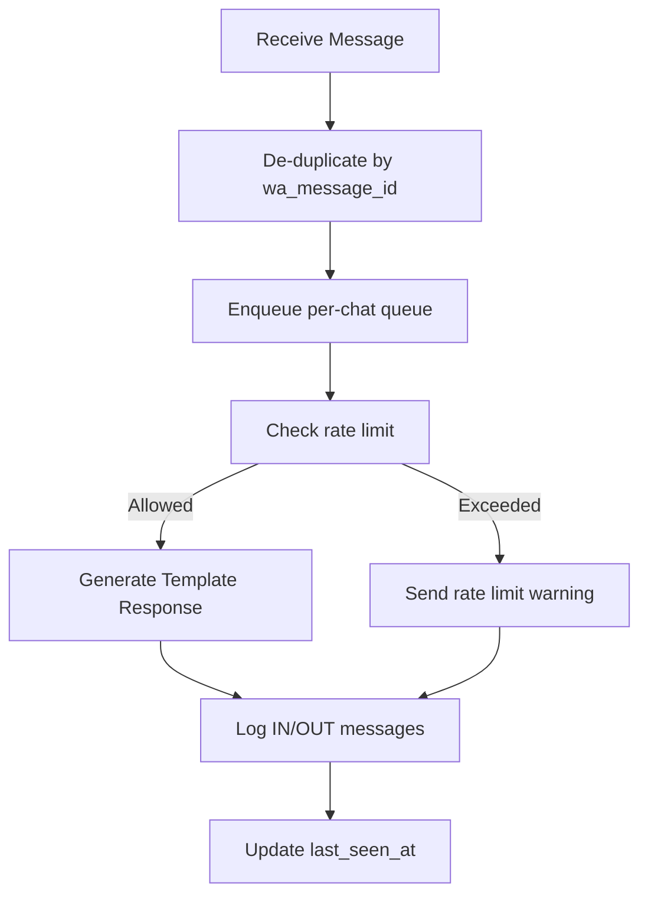
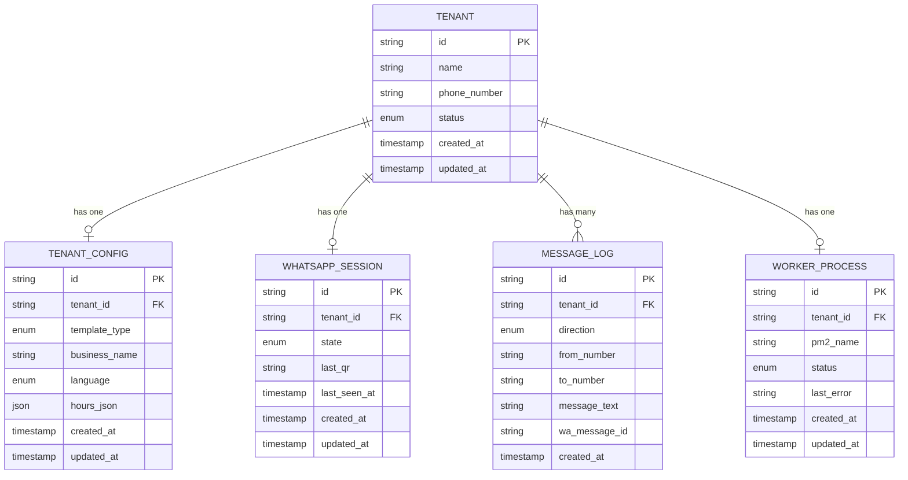
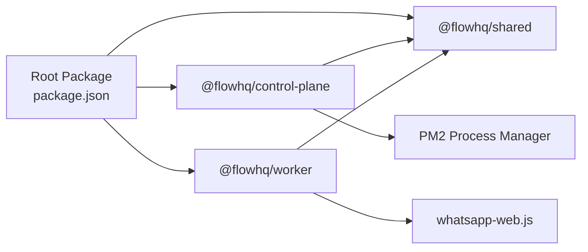

# Platform Benefits

<cite>
**Referenced Files in This Document**
- [README.md](file://README.md)
- [package.json](file://package.json)
- [ecosystem.config.js](file://ecosystem.config.js)
- [apps/control-plane/src/server.ts](file://apps/control-plane/src/server.ts)
- [apps/control-plane/src/routes/admin.ts](file://apps/control-plane/src/routes/admin.ts)
- [apps/web/src/app/(portal)/layout.tsx](file://apps/web/src/app/(portal)/layout.tsx)
- [apps/web/src/app/(portal)/app/status/page.tsx](file://apps/web/src/app/(portal)/app/status/page.tsx)
- [apps/web/src/app/(portal)/app/onboarding/page.tsx](file://apps/web/src/app/(portal)/app/onboarding/page.tsx)
- [apps/worker/src/bot.ts](file://apps/worker/src/bot.ts)
- [apps/worker/src/utils/rate-limiter.ts](file://apps/worker/src/utils/rate-limiter.ts)
- [apps/worker/src/utils/chat-queue.ts](file://apps/worker/src/utils/chat-queue.ts)
- [apps/worker/src/utils/dedup.ts](file://apps/worker/src/utils/dedup.ts)
- [apps/worker/src/utils/reconnect.ts](file://apps/worker/src/utils/reconnect.ts)
- [apps/worker/src/templates/index.ts](file://apps/worker/src/templates/index.ts)
- [packages/shared/src/prisma/schema.prisma](file://packages/shared/src/prisma/schema.prisma)
- [packages/shared/src/types/index.ts](file://packages/shared/src/types/index.ts)
- [scripts/stress-test.ts](file://scripts/stress-test.ts)
</cite>

## Table of Contents
1. [Introduction](#introduction)
2. [Project Structure](#project-structure)
3. [Core Components](#core-components)
4. [Architecture Overview](#architecture-overview)
5. [Detailed Component Analysis](#detailed-component-analysis)
6. [Dependency Analysis](#dependency-analysis)
7. [Performance Considerations](#performance-considerations)
8. [Troubleshooting Guide](#troubleshooting-guide)
9. [Conclusion](#conclusion)
10. [Appendices](#appendices)

## Introduction
Flow HQ is a multi-tenant WhatsApp chatbot platform designed to deliver cost-effective, secure, and scalable automation for businesses. It separates administrative control from per-tenant WhatsApp workers, enabling rapid deployment through templated responses, robust isolation guarantees, and built-in operational hardening. This document explains the platform’s benefits and value proposition, compares it to manual WhatsApp management, traditional CRM solutions, and custom chatbot development, and outlines ROI, scalability, and technical advantages such as rate limiting, error handling, and maintenance automation.

## Project Structure
The platform follows a workspace-first organization with three primary areas:
- Control Plane: Admin API and dashboard (Express + EJS)
- Worker: Per-tenant WhatsApp bot process (whatsapp-web.js)
- Shared: Common types, Prisma client, and utilities

**Diagram sources**
- [apps/control-plane/src/server.ts](file://apps/control-plane/src/server.ts#L65-L81)
- [apps/control-plane/src/routes/admin.ts](file://apps/control-plane/src/routes/admin.ts#L174-L230)
- [apps/web/src/app/(portal)/layout.tsx](file://apps/web/src/app/(portal)/layout.tsx#L6-L29)
- [apps/web/src/app/(portal)/app/status/page.tsx](file://apps/web/src/app/(portal)/app/status/page.tsx#L24-L44)
- [apps/web/src/app/(portal)/app/onboarding/page.tsx](file://apps/web/src/app/(portal)/app/onboarding/page.tsx#L7-L38)
- [apps/worker/src/bot.ts](file://apps/worker/src/bot.ts#L27-L75)
- [apps/worker/src/utils/rate-limiter.ts](file://apps/worker/src/utils/rate-limiter.ts#L17-L26)
- [apps/worker/src/utils/chat-queue.ts](file://apps/worker/src/utils/chat-queue.ts#L21-L29)
- [apps/worker/src/utils/dedup.ts](file://apps/worker/src/utils/dedup.ts#L11-L19)
- [apps/worker/src/utils/reconnect.ts](file://apps/worker/src/utils/reconnect.ts#L14-L39)
- [apps/worker/src/templates/index.ts](file://apps/worker/src/templates/index.ts#L9-L23)
- [packages/shared/src/prisma/schema.prisma](file://packages/shared/src/prisma/schema.prisma#L60-L131)
- [packages/shared/src/types/index.ts](file://packages/shared/src/types/index.ts#L1-L41)

**Section sources**
- [README.md](file://README.md#L116-L129)
- [package.json](file://package.json#L5-L16)

## Core Components
- Multi-tenant architecture with isolated sessions per tenant, managed centrally via the Control Plane.
- Template-driven automation supporting Booking, E-commerce, and Support scenarios.
- Operational hardening: rate limiting, per-chat queuing, message de-duplication, exponential backoff reconnect, heartbeat monitoring, and stale worker detection.
- Real-time monitoring and status dashboards for tenants and administrators.
- Automated worker lifecycle management via PM2 integration.

**Section sources**
- [README.md](file://README.md#L3-L9)
- [apps/control-plane/src/server.ts](file://apps/control-plane/src/server.ts#L54-L63)
- [apps/control-plane/src/routes/admin.ts](file://apps/control-plane/src/routes/admin.ts#L174-L230)
- [apps/worker/src/bot.ts](file://apps/worker/src/bot.ts#L33-L56)
- [apps/worker/src/utils/rate-limiter.ts](file://apps/worker/src/utils/rate-limiter.ts#L32-L73)
- [apps/worker/src/utils/chat-queue.ts](file://apps/worker/src/utils/chat-queue.ts#L35-L68)
- [apps/worker/src/utils/dedup.ts](file://apps/worker/src/utils/dedup.ts#L28-L31)
- [apps/worker/src/utils/reconnect.ts](file://apps/worker/src/utils/reconnect.ts#L44-L52)
- [apps/worker/src/templates/index.ts](file://apps/worker/src/templates/index.ts#L9-L23)

## Architecture Overview
The platform separates concerns across layers:
- Control Plane: Centralized administration, tenant lifecycle, worker orchestration, and monitoring.
- Worker: Per-tenant process handling WhatsApp events, applying templates, enforcing rate limits, and maintaining resilience.
- Shared: Database schema and shared types used across applications.

**Diagram sources**
- [apps/control-plane/src/routes/admin.ts](file://apps/control-plane/src/routes/admin.ts#L104-L140)
- [apps/control-plane/src/routes/admin.ts](file://apps/control-plane/src/routes/admin.ts#L174-L230)
- [apps/worker/src/bot.ts](file://apps/worker/src/bot.ts#L77-L151)
- [apps/worker/src/bot.ts](file://apps/worker/src/bot.ts#L333-L359)
- [apps/web/src/app/(portal)/app/status/page.tsx](file://apps/web/src/app/(portal)/app/status/page.tsx#L28-L44)

## Detailed Component Analysis

### Multi-Tenant Isolation and Cost-Effectiveness
- Each tenant has a dedicated worker process and isolated session storage, ensuring data and session boundaries remain intact across clients.
- Centralized admin controls reduce operational overhead by managing multiple tenants from a single interface.
- Template-driven automation minimizes customization effort, lowering development and maintenance costs.

**Diagram sources**
- [apps/control-plane/src/routes/admin.ts](file://apps/control-plane/src/routes/admin.ts#L174-L230)
- [apps/worker/src/bot.ts](file://apps/worker/src/bot.ts#L77-L151)
- [apps/worker/src/bot.ts](file://apps/worker/src/bot.ts#L333-L359)

**Section sources**
- [README.md](file://README.md#L480-L489)
- [scripts/stress-test.ts](file://scripts/stress-test.ts#L137-L163)
- [scripts/stress-test.ts](file://scripts/stress-test.ts#L215-L256)
- [scripts/stress-test.ts](file://scripts/stress-test.ts#L258-L299)

### Template System for Rapid Deployment
- Templates define business logic for common scenarios: Booking, E-commerce, and Support.
- The template dispatcher selects the appropriate response generator based on tenant configuration, enabling quick onboarding and consistent messaging.

**Diagram sources**
- [apps/worker/src/templates/index.ts](file://apps/worker/src/templates/index.ts#L9-L23)

**Section sources**
- [apps/worker/src/templates/index.ts](file://apps/worker/src/templates/index.ts#L25-L69)

### Operational Advantages: Automated Worker Management
- The Control Plane starts, stops, restarts, and force-restarts tenant workers via PM2, with safeguards against duplicate starts.
- Heartbeat monitoring and stale worker detection automatically flag inactive workers for admin intervention.

**Diagram sources**
- [apps/control-plane/src/routes/admin.ts](file://apps/control-plane/src/routes/admin.ts#L174-L230)
- [apps/control-plane/src/server.ts](file://apps/control-plane/src/server.ts#L54-L63)
- [packages/shared/src/prisma/schema.prisma](file://packages/shared/src/prisma/schema.prisma#L120-L131)

**Section sources**
- [apps/control-plane/src/routes/admin.ts](file://apps/control-plane/src/routes/admin.ts#L174-L230)
- [apps/control-plane/src/server.ts](file://apps/control-plane/src/server.ts#L54-L63)
- [packages/shared/src/prisma/schema.prisma](file://packages/shared/src/prisma/schema.prisma#L120-L131)

### Real-Time Monitoring and Status Dashboards
- The portal displays tenant setup status, WhatsApp session state, and last-seen timestamps, polling periodically for live updates.
- Admins can track message logs and worker health from the Control Plane.

**Diagram sources**
- [apps/web/src/app/(portal)/app/status/page.tsx](file://apps/web/src/app/(portal)/app/status/page.tsx#L28-L44)
- [apps/web/src/app/(portal)/layout.tsx](file://apps/web/src/app/(portal)/layout.tsx#L6-L29)

**Section sources**
- [apps/web/src/app/(portal)/app/status/page.tsx](file://apps/web/src/app/(portal)/app/status/page.tsx#L24-L156)
- [apps/web/src/app/(portal)/layout.tsx](file://apps/web/src/app/(portal)/layout.tsx#L6-L29)

### Built-In Stability Features
- Rate limiting prevents spam and throttles replies per tenant per minute.
- Per-chat queue ensures sequential processing to avoid race conditions.
- De-duplication avoids reprocessing the same message.
- Exponential backoff reconnect recovers from disconnections gracefully.
- Heartbeat keeps the Control Plane informed of worker liveness.

**Diagram sources**
- [apps/worker/src/bot.ts](file://apps/worker/src/bot.ts#L153-L183)
- [apps/worker/src/bot.ts](file://apps/worker/src/bot.ts#L248-L331)
- [apps/worker/src/utils/dedup.ts](file://apps/worker/src/utils/dedup.ts#L28-L31)
- [apps/worker/src/utils/chat-queue.ts](file://apps/worker/src/utils/chat-queue.ts#L35-L68)
- [apps/worker/src/utils/rate-limiter.ts](file://apps/worker/src/utils/rate-limiter.ts#L32-L73)
- [apps/worker/src/bot.ts](file://apps/worker/src/bot.ts#L333-L359)

**Section sources**
- [apps/worker/src/bot.ts](file://apps/worker/src/bot.ts#L20-L56)
- [apps/worker/src/utils/rate-limiter.ts](file://apps/worker/src/utils/rate-limiter.ts#L17-L26)
- [apps/worker/src/utils/chat-queue.ts](file://apps/worker/src/utils/chat-queue.ts#L21-L29)
- [apps/worker/src/utils/dedup.ts](file://apps/worker/src/utils/dedup.ts#L11-L19)
- [apps/worker/src/utils/reconnect.ts](file://apps/worker/src/utils/reconnect.ts#L14-L39)

### Data Model and Isolation Guarantees
- The schema defines tenant, configuration, session, message logs, worker process, and related entities with explicit enums and relations.
- Stress tests validate tenant isolation, session isolation, and worker isolation to prevent cross-tenant data leakage.

**Diagram sources**
- [packages/shared/src/prisma/schema.prisma](file://packages/shared/src/prisma/schema.prisma#L60-L131)

**Section sources**
- [packages/shared/src/prisma/schema.prisma](file://packages/shared/src/prisma/schema.prisma#L10-L58)
- [scripts/stress-test.ts](file://scripts/stress-test.ts#L137-L163)
- [scripts/stress-test.ts](file://scripts/stress-test.ts#L215-L256)
- [scripts/stress-test.ts](file://scripts/stress-test.ts#L258-L299)

## Dependency Analysis
- Workspace configuration ties together Control Plane, Worker, and Shared packages.
- Control Plane depends on Shared for Prisma models and logging; Worker depends on Shared for logging and Prisma client.
- PM2 orchestrates worker processes; ecosystem configuration defines process restart and logging.

**Diagram sources**
- [package.json](file://package.json#L5-L16)
- [apps/control-plane/src/routes/admin.ts](file://apps/control-plane/src/routes/admin.ts#L196-L200)
- [ecosystem.config.js](file://ecosystem.config.js#L1-L19)

**Section sources**
- [package.json](file://package.json#L5-L16)
- [apps/control-plane/src/routes/admin.ts](file://apps/control-plane/src/routes/admin.ts#L196-L200)
- [ecosystem.config.js](file://ecosystem.config.js#L1-L19)

## Performance Considerations
- Rate limiting caps replies per tenant per minute to protect upstream APIs and maintain responsiveness.
- Per-chat queue prevents concurrency issues and reduces error propagation.
- Heartbeat intervals and stale thresholds balance monitoring overhead with reliability.
- Stress tests validate isolation under load, ensuring no cross-tenant leakage.

[No sources needed since this section provides general guidance]

## Troubleshooting Guide
- QR code not appearing: verify worker logs and PM2 status; ensure the worker is started and environment variables are set.
- Session persistence: confirm session storage path exists and is writable; check environment variables.
- Database connectivity: verify PostgreSQL is running and DATABASE_URL is correctly formatted.
- Worker health: use PM2 logs and Control Plane stale checks; force restart if necessary.

**Section sources**
- [README.md](file://README.md#L185-L208)
- [README.md](file://README.md#L404-L441)
- [apps/control-plane/src/server.ts](file://apps/control-plane/src/server.ts#L34-L38)

## Conclusion
Flow HQ delivers a cost-effective, secure, and scalable solution for WhatsApp automation. Its multi-tenant architecture, template-driven deployment, and operational hardening reduce complexity and risk compared to manual management, CRM silos, and custom-built chatbots. Built-in monitoring, rate limiting, resilience mechanisms, and maintenance automation lower ongoing operational overhead, while stress-tested isolation guarantees data security across tenants.

[No sources needed since this section summarizes without analyzing specific files]

## Appendices

### Comparison Matrix: Flow HQ vs Alternatives
- Manual WhatsApp management
  - Pros: Immediate control; Cons: High operational overhead, no isolation, limited scalability, prone to human error.
- Traditional CRM solutions
  - Pros: Rich reporting; Cons: Often lacks native WhatsApp integration, higher licensing costs, slower deployment.
- Custom chatbot development
  - Pros: Full customization; Cons: Long development cycles, ongoing maintenance, risk of architectural gaps in resilience and isolation.

[No sources needed since this section provides general guidance]

### ROI and Scalability Considerations
- ROI: Reduced labor hours, fewer support escalations, and faster onboarding of new tenants offset platform licensing and infrastructure costs.
- Scalability: Horizontal scaling via additional worker processes and PM2, combined with per-tenant isolation, supports growing customer bases without cross-contamination.

[No sources needed since this section provides general guidance]