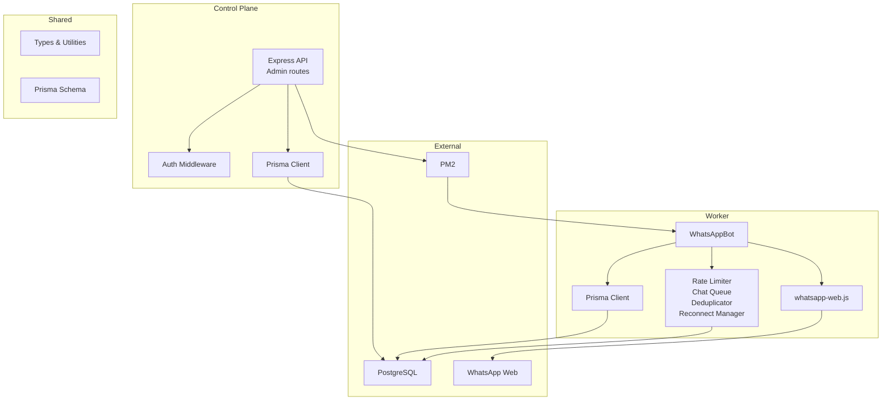
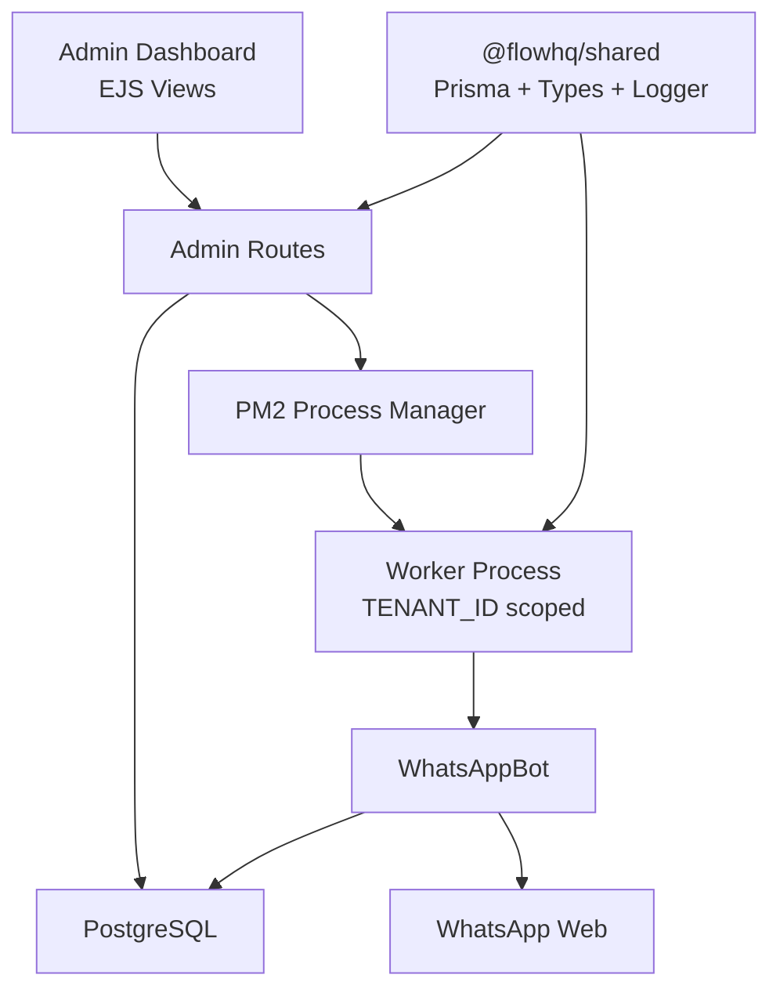
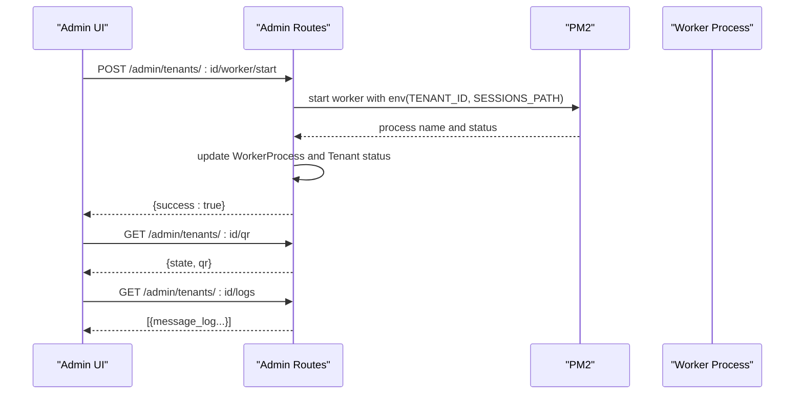
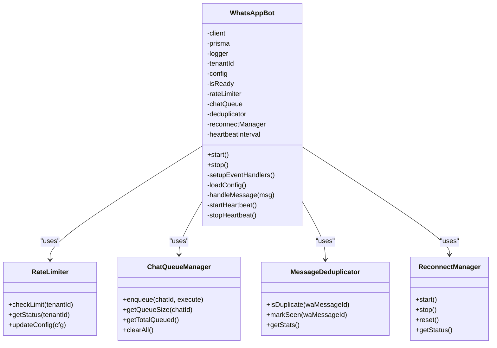
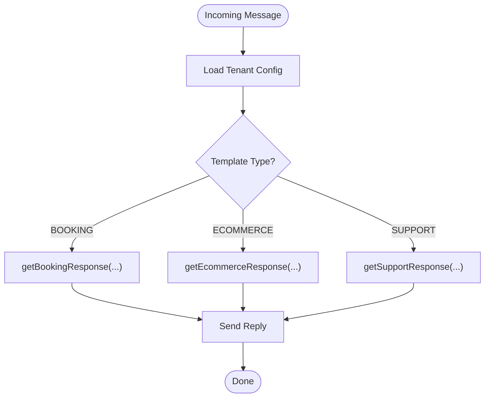
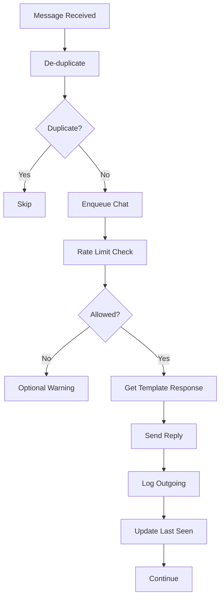
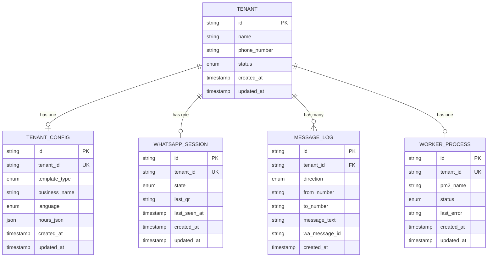
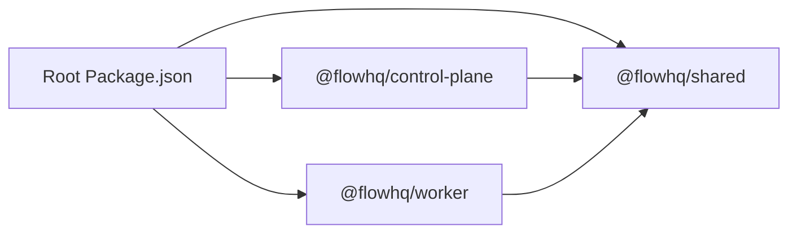

# Project Overview

<cite>
**Referenced Files in This Document**
- [README.md](file://README.md)
- [package.json](file://package.json)
- [ecosystem.config.js](file://ecosystem.config.js)
- [apps/control-plane/src/server.ts](file://apps/control-plane/src/server.ts)
- [apps/control-plane/src/routes/admin.ts](file://apps/control-plane/src/routes/admin.ts)
- [apps/control-plane/src/middleware/auth.ts](file://apps/control-plane/src/middleware/auth.ts)
- [apps/worker/src/worker.ts](file://apps/worker/src/worker.ts)
- [apps/worker/src/bot.ts](file://apps/worker/src/bot.ts)
- [apps/worker/src/templates/index.ts](file://apps/worker/src/templates/index.ts)
- [apps/worker/src/utils/rate-limiter.ts](file://apps/worker/src/utils/rate-limiter.ts)
- [apps/worker/src/utils/chat-queue.ts](file://apps/worker/src/utils/chat-queue.ts)
- [apps/worker/src/utils/dedup.ts](file://apps/worker/src/utils/dedup.ts)
- [apps/worker/src/utils/reconnect.ts](file://apps/worker/src/utils/reconnect.ts)
- [packages/shared/src/index.ts](file://packages/shared/src/index.ts)
- [packages/shared/src/types/index.ts](file://packages/shared/src/types/index.ts)
- [packages/shared/src/prisma/schema.prisma](file://packages/shared/src/prisma/schema.prisma)
- [packages/shared/src/utils/logger.ts](file://packages/shared/src/utils/logger.ts)
- [apps/web/next.config.js](file://apps/web/next.config.js)
</cite>

## Table of Contents
1. [Introduction](#introduction)
2. [Project Structure](#project-structure)
3. [Core Components](#core-components)
4. [Architecture Overview](#architecture-overview)
5. [Detailed Component Analysis](#detailed-component-analysis)
6. [Dependency Analysis](#dependency-analysis)
7. [Performance Considerations](#performance-considerations)
8. [Troubleshooting Guide](#troubleshooting-guide)
9. [Conclusion](#conclusion)
10. [Appendices](#appendices)

## Introduction
Flow HQ is a multi-tenant WhatsApp Business automation platform designed to isolate tenant sessions and orchestrate per-tenant worker processes. It provides a centralized admin control plane for managing tenants, starting/stopping workers, and monitoring health, while each tenant runs an independent WhatsApp bot process powered by whatsapp-web.js. The system integrates PM2 for process lifecycle management, PostgreSQL for persistence, and shared libraries for common types and utilities.

Key value propositions for businesses:
- Automated customer interactions via template-based responses (e.g., booking, support, commerce)
- Strong tenant isolation ensuring secure, independent operations per business
- Operational resilience with heartbeat monitoring, rate limiting, message de-duplication, and reconnect logic
- Centralized administration with QR provisioning, logs, and health dashboards

## Project Structure
The repository follows a monorepo workspace with three primary areas:
- apps/control-plane: Admin API and dashboard (Express + EJS)
- apps/worker: Per-tenant WhatsApp bot process (whatsapp-web.js)
- packages/shared: Shared Prisma client, types, and utilities
- sessions/: persisted WhatsApp session data per tenant
- logs/: per-tenant and control-plane logs
- ecosystem.config.js: PM2 configuration for process management

**Diagram sources**
- [apps/control-plane/src/server.ts](file://apps/control-plane/src/server.ts#L65-L81)
- [apps/control-plane/src/routes/admin.ts](file://apps/control-plane/src/routes/admin.ts#L174-L230)
- [apps/worker/src/bot.ts](file://apps/worker/src/bot.ts#L27-L75)
- [packages/shared/src/prisma/schema.prisma](file://packages/shared/src/prisma/schema.prisma#L1-L178)

**Section sources**
- [README.md](file://README.md#L116-L129)
- [package.json](file://package.json#L1-L21)
- [ecosystem.config.js](file://ecosystem.config.js#L1-L19)

## Core Components
- Control Plane (Admin API and dashboard):
  - Validates environment and database connectivity
  - Provides tenant CRUD, worker lifecycle controls, QR retrieval, and logs
  - Monitors stale workers and marks them ERROR
- Worker (Per-tenant WhatsApp bot):
  - Initializes whatsapp-web.js with local auth per tenant
  - Implements template-based responses, rate limiting, per-chat queuing, de-duplication, and reconnect logic
  - Sends periodic heartbeats and persists logs
- Shared (Common types, Prisma client, utilities):
  - Prisma schema defines tenants, configs, sessions, logs, worker processes, and related enums
  - Logger supports per-tenant file logging and pretty console output
- Process Management:
  - PM2 manages control-plane and per-tenant worker processes
- Database:
  - PostgreSQL stores all tenant state, session state, logs, and worker process metadata

**Section sources**
- [apps/control-plane/src/server.ts](file://apps/control-plane/src/server.ts#L16-L39)
- [apps/control-plane/src/routes/admin.ts](file://apps/control-plane/src/routes/admin.ts#L174-L230)
- [apps/worker/src/bot.ts](file://apps/worker/src/bot.ts#L27-L75)
- [packages/shared/src/prisma/schema.prisma](file://packages/shared/src/prisma/schema.prisma#L60-L131)
- [packages/shared/src/utils/logger.ts](file://packages/shared/src/utils/logger.ts#L5-L30)
- [ecosystem.config.js](file://ecosystem.config.js#L1-L19)

## Architecture Overview
The system separates concerns across three planes:
- Control Plane: Centralized management and visibility
- Worker Processes: Tenant-specific automation engines
- Shared Layer: Types, Prisma client, and utilities

**Diagram sources**
- [apps/control-plane/src/server.ts](file://apps/control-plane/src/server.ts#L47-L52)
- [apps/control-plane/src/routes/admin.ts](file://apps/control-plane/src/routes/admin.ts#L174-L230)
- [apps/worker/src/worker.ts](file://apps/worker/src/worker.ts#L7-L15)
- [packages/shared/src/index.ts](file://packages/shared/src/index.ts#L1-L4)

## Detailed Component Analysis

### Control Plane: Admin API and Dashboard
- Responsibilities:
  - Tenant management (create/list/get)
  - Worker orchestration (start/stop/restart/force-restart)
  - QR retrieval and logs exposure
  - Stale worker detection and marking
- Implementation highlights:
  - Environment validation and database connectivity checks
  - PM2 process discovery and lifecycle commands
  - Heartbeat-driven stale worker detection
  - Auth middleware supporting Basic Auth and query param

**Diagram sources**
- [apps/control-plane/src/routes/admin.ts](file://apps/control-plane/src/routes/admin.ts#L174-L230)
- [apps/control-plane/src/routes/admin.ts](file://apps/control-plane/src/routes/admin.ts#L334-L352)
- [apps/control-plane/src/routes/admin.ts](file://apps/control-plane/src/routes/admin.ts#L354-L369)

**Section sources**
- [apps/control-plane/src/server.ts](file://apps/control-plane/src/server.ts#L65-L81)
- [apps/control-plane/src/middleware/auth.ts](file://apps/control-plane/src/middleware/auth.ts#L1-L40)
- [apps/control-plane/src/routes/admin.ts](file://apps/control-plane/src/routes/admin.ts#L174-L230)
- [apps/control-plane/src/routes/admin.ts](file://apps/control-plane/src/routes/admin.ts#L30-L80)

### Worker Orchestration and Template-Based Responses
- Responsibilities:
  - Initialize whatsapp-web.js with LocalAuth per tenant
  - Handle lifecycle events (QR, ready, disconnected, auth failure)
  - Process inbound messages with template-based responses
  - Enforce rate limits, de-duplicate, and queue per chat
  - Heartbeat and reconnect management
- Implementation highlights:
  - Template routing selects response logic by template type and language
  - Per-tenant session persistence under sessions/<tenant_id>
  - Robust error boundary prevents worker crashes

**Diagram sources**
- [apps/worker/src/bot.ts](file://apps/worker/src/bot.ts#L12-L75)
- [apps/worker/src/utils/rate-limiter.ts](file://apps/worker/src/utils/rate-limiter.ts#L17-L106)
- [apps/worker/src/utils/chat-queue.ts](file://apps/worker/src/utils/chat-queue.ts#L21-L139)
- [apps/worker/src/utils/dedup.ts](file://apps/worker/src/utils/dedup.ts#L11-L93)
- [apps/worker/src/utils/reconnect.ts](file://apps/worker/src/utils/reconnect.ts#L14-L116)

**Section sources**
- [apps/worker/src/worker.ts](file://apps/worker/src/worker.ts#L7-L30)
- [apps/worker/src/bot.ts](file://apps/worker/src/bot.ts#L27-L75)
- [apps/worker/src/bot.ts](file://apps/worker/src/bot.ts#L137-L210)
- [apps/worker/src/bot.ts](file://apps/worker/src/bot.ts#L232-L315)
- [apps/worker/src/bot.ts](file://apps/worker/src/bot.ts#L317-L351)
- [apps/worker/src/bot.ts](file://apps/worker/src/bot.ts#L378-L393)

### Template-Based Responses
- The platform supports configurable templates (BOOKING, ECOMMERCE, SUPPORT) with language-aware replies.
- Response logic is selected by template type and language, enabling localized customer assistance.

**Diagram sources**
- [apps/worker/src/templates/index.ts](file://apps/worker/src/templates/index.ts#L9-L23)
- [apps/worker/src/templates/index.ts](file://apps/worker/src/templates/index.ts#L25-L70)

**Section sources**
- [apps/worker/src/templates/index.ts](file://apps/worker/src/templates/index.ts#L1-L70)

### Stability and Resilience Features
- Rate limiting: 10 replies per minute per tenant by default
- Per-chat queue: Ensures sequential processing per conversation
- De-duplication: Prevents processing duplicate messages
- Reconnect manager: Exponential backoff with max attempts
- Heartbeat: 30s intervals to mark worker health
- Stale worker detection: Workers marked ERROR after configured threshold

**Diagram sources**
- [apps/worker/src/bot.ts](file://apps/worker/src/bot.ts#L143-L167)
- [apps/worker/src/bot.ts](file://apps/worker/src/bot.ts#L248-L263)
- [apps/worker/src/bot.ts](file://apps/worker/src/bot.ts#L274-L289)
- [apps/worker/src/bot.ts](file://apps/worker/src/bot.ts#L292-L295)

**Section sources**
- [apps/worker/src/utils/rate-limiter.ts](file://apps/worker/src/utils/rate-limiter.ts#L32-L73)
- [apps/worker/src/utils/chat-queue.ts](file://apps/worker/src/utils/chat-queue.ts#L35-L68)
- [apps/worker/src/utils/dedup.ts](file://apps/worker/src/utils/dedup.ts#L28-L46)
- [apps/worker/src/utils/reconnect.ts](file://apps/worker/src/utils/reconnect.ts#L87-L115)
- [apps/control-plane/src/routes/admin.ts](file://apps/control-plane/src/routes/admin.ts#L30-L80)

### Database Schema and Data Model
- Core entities:
  - Tenant: business identity and status
  - TenantConfig: template type, business name, language
  - WhatsAppSession: state, QR, last seen
  - MessageLog: inbound/outbound logs with timestamps
  - WorkerProcess: PM2 tracking and status
- Enums define consistent states and types across the system

**Diagram sources**
- [packages/shared/src/prisma/schema.prisma](file://packages/shared/src/prisma/schema.prisma#L60-L131)

**Section sources**
- [packages/shared/src/prisma/schema.prisma](file://packages/shared/src/prisma/schema.prisma#L10-L178)

### Logging and Observability
- Per-tenant log files stored under logs/<tenant_id>.log
- Console output with pino-pretty for readability
- Structured logs include tenantId for correlation

**Section sources**
- [packages/shared/src/utils/logger.ts](file://packages/shared/src/utils/logger.ts#L5-L30)
- [apps/control-plane/src/server.ts](file://apps/control-plane/src/server.ts#L16-L39)

### Frontend Integration (Portal)
- Next.js app proxies control-plane API calls to the control-plane server
- Rewrites /api/control-plane/* to http://localhost:3000/*

**Section sources**
- [apps/web/next.config.js](file://apps/web/next.config.js#L6-L13)

## Dependency Analysis
- Workspace composition:
  - Root package.json defines workspaces for apps and packages
  - Scripts orchestrate building, database generation/migration, and development servers
- Control plane depends on:
  - @flowhq/shared for Prisma client and logger
  - PM2 for process management
- Worker depends on:
  - @flowhq/shared for Prisma client and logger
  - whatsapp-web.js for WhatsApp automation
  - Template modules for response logic
  - Utility modules for resilience

**Diagram sources**
- [package.json](file://package.json#L5-L10)
- [packages/shared/src/index.ts](file://packages/shared/src/index.ts#L1-L4)

**Section sources**
- [package.json](file://package.json#L1-L21)
- [packages/shared/src/index.ts](file://packages/shared/src/index.ts#L1-L4)

## Performance Considerations
- Rate limiting prevents burst responses and protects tenant quotas
- Per-chat queue avoids race conditions and reduces concurrency overhead
- De-duplication minimizes redundant processing
- Heartbeat ensures timely detection of failures
- Reconnect with exponential backoff reduces load during transient failures
- Consider tuning HEARTBEAT_INTERVAL_MS and STALE_THRESHOLD_MINUTES for your environment

[No sources needed since this section provides general guidance]

## Troubleshooting Guide
- QR code not appearing:
  - Confirm worker started and PM2 lists the process
  - Check per-tenant logs for initialization errors
- Session not persisting:
  - Ensure sessions/ directory exists and is writable
  - Verify SESSIONS_PATH environment variable
- Database connection errors:
  - Confirm PostgreSQL is running and DATABASE_URL is correct
- WhatsApp Web errors:
  - Install Chromium/Chrome and set PUPPETEER_EXECUTABLE_PATH
- Stale workers:
  - Dashboard shows STALE when no heartbeat for threshold minutes
  - Use Force Restart to recover

**Section sources**
- [README.md](file://README.md#L185-L208)
- [README.md](file://README.md#L452-L474)
- [apps/control-plane/src/server.ts](file://apps/control-plane/src/server.ts#L34-L38)

## Conclusion
Flow HQ delivers a robust, multi-tenant WhatsApp automation platform with clear separation between the control plane and worker processes. Its use of whatsapp-web.js, PM2, and PostgreSQL, combined with shared types and utilities, enables scalable, resilient customer service automation. The template-based response system and operational safeguards make it suitable for businesses seeking reliable, localized customer interactions.

[No sources needed since this section summarizes without analyzing specific files]

## Appendices

### Practical Examples
- Creating a tenant and starting a worker:
  - Use the admin dashboard to create a tenant with template type and language
  - Start the worker; scan the QR code to connect
  - Send test messages to trigger template-based responses
- Monitoring and maintenance:
  - Use logs/<tenant_id>.log for per-tenant diagnostics
  - Monitor PM2 status and restart workers as needed
  - Verify rate limiting and heartbeat behavior under load

**Section sources**
- [README.md](file://README.md#L73-L115)
- [README.md](file://README.md#L406-L441)