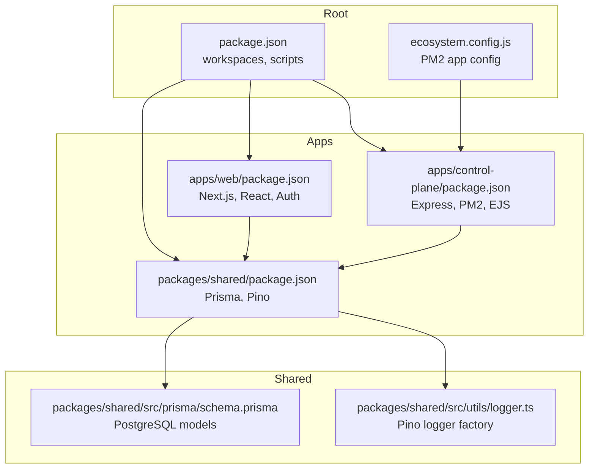
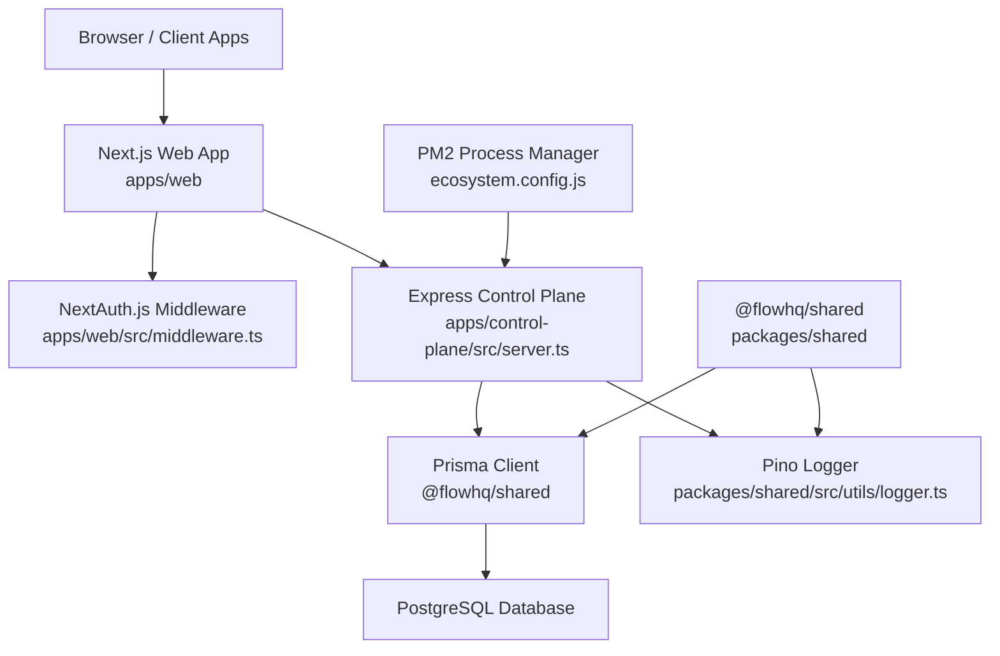
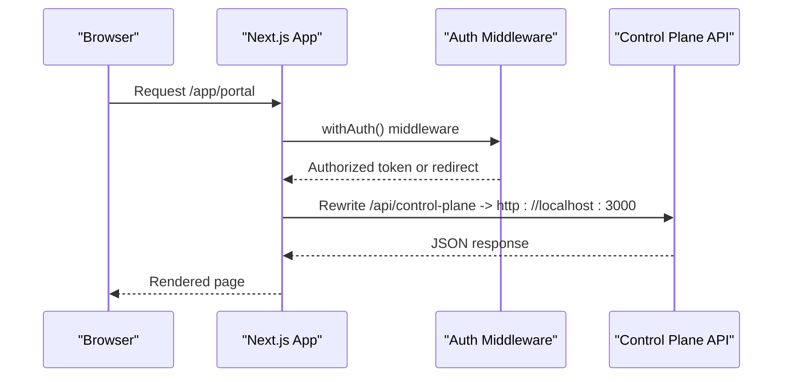
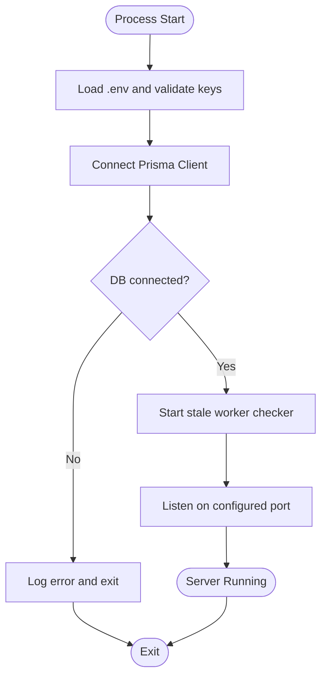
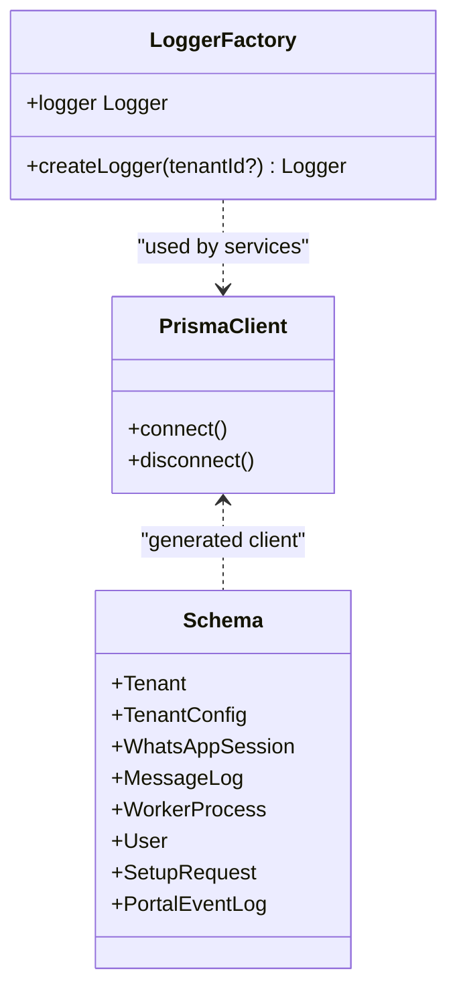
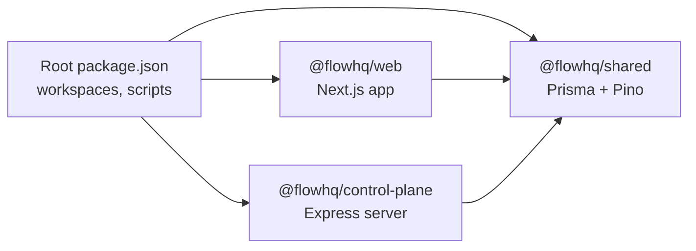

# Technology Stack

<cite>
**Referenced Files in This Document**
- [package.json](file://package.json)
- [ecosystem.config.js](file://ecosystem.config.js)
- [apps/web/package.json](file://apps/web/package.json)
- [apps/web/next.config.js](file://apps/web/next.config.js)
- [apps/web/tailwind.config.js](file://apps/web/tailwind.config.js)
- [apps/web/postcss.config.js](file://apps/web/postcss.config.js)
- [apps/web/tsconfig.json](file://apps/web/tsconfig.json)
- [apps/web/src/lib/prisma.ts](file://apps/web/src/lib/prisma.ts)
- [apps/web/src/middleware.ts](file://apps/web/src/middleware.ts)
- [apps/web/.env.local](file://apps/web/.env.local)
- [apps/control-plane/package.json](file://apps/control-plane/package.json)
- [apps/control-plane/tsconfig.json](file://apps/control-plane/tsconfig.json)
- [apps/control-plane/src/server.ts](file://apps/control-plane/src/server.ts)
- [packages/shared/package.json](file://packages/shared/package.json)
- [packages/shared/src/prisma/schema.prisma](file://packages/shared/src/prisma/schema.prisma)
- [packages/shared/src/utils/logger.ts](file://packages/shared/src/utils/logger.ts)
</cite>

## Table of Contents
1. [Introduction](#introduction)
2. [Project Structure](#project-structure)
3. [Core Components](#core-components)
4. [Architecture Overview](#architecture-overview)
5. [Detailed Component Analysis](#detailed-component-analysis)
6. [Dependency Analysis](#dependency-analysis)
7. [Performance Considerations](#performance-considerations)
8. [Troubleshooting Guide](#troubleshooting-guide)
9. [Conclusion](#conclusion)
10. [Appendices](#appendices)

## Introduction
This document describes the Flow HQ technology stack and how its components integrate to support a scalable, maintainable system. It covers the frontend built with Next.js 14, the backend service powered by Express.js, shared libraries using Prisma ORM with PostgreSQL, PM2 for process management, Pino for structured logging, and npm workspaces for monorepo-style dependency management. It also outlines environment configuration, build tooling, cross-platform considerations, and update/migration strategies.

## Project Structure
The repository follows a monorepo layout using npm workspaces:
- apps/web: Next.js 14 frontend application
- apps/control-plane: Express.js backend service
- apps/worker: Background worker implementation (referenced in shared models)
- packages/shared: Shared Prisma client, database schema, and logging utilities
- Root scripts and configurations orchestrate builds, migrations, and process management

**Diagram sources**
- [package.json](file://package.json#L1-L21)
- [apps/web/package.json](file://apps/web/package.json#L1-L27)
- [apps/control-plane/package.json](file://apps/control-plane/package.json#L1-L24)
- [packages/shared/package.json](file://packages/shared/package.json#L1-L23)
- [packages/shared/src/prisma/schema.prisma](file://packages/shared/src/prisma/schema.prisma#L1-L178)
- [packages/shared/src/utils/logger.ts](file://packages/shared/src/utils/logger.ts#L1-L33)
- [ecosystem.config.js](file://ecosystem.config.js#L1-L19)

**Section sources**
- [package.json](file://package.json#L1-L21)
- [apps/web/package.json](file://apps/web/package.json#L1-L27)
- [apps/control-plane/package.json](file://apps/control-plane/package.json#L1-L24)
- [packages/shared/package.json](file://packages/shared/package.json#L1-L23)

## Core Components
- Frontend: Next.js 14 with App Router, TypeScript, Tailwind CSS, and NextAuth.js for authentication
- Backend: Express.js server with EJS templating, PM2 for process management, and environment-driven configuration
- Shared: Prisma ORM with PostgreSQL client, Prisma CLI, and Pino structured logging utilities
- Monorepo: npm workspaces coordinating builds and scripts across apps and packages

Key version highlights:
- Next.js: ^14.2.35
- Express.js: ^4.18.2
- Prisma: ^5.7.0
- Pino: ^8.17.0
- TypeScript: ^5.3.0
- PM2: ^5.3.0

**Section sources**
- [apps/web/package.json](file://apps/web/package.json#L10-L25)
- [apps/control-plane/package.json](file://apps/control-plane/package.json#L9-L16)
- [packages/shared/package.json](file://packages/shared/package.json#L12-L21)
- [package.json](file://package.json#L17-L19)

## Architecture Overview
The system separates concerns across three applications while sharing a common data and logging layer:
- apps/web handles user-facing pages, authentication, and API routing
- apps/control-plane exposes administrative and portal endpoints, manages workers, and integrates with the database
- packages/shared encapsulates Prisma client generation, database schema, and logging utilities

**Diagram sources**
- [apps/web/src/middleware.ts](file://apps/web/src/middleware.ts#L1-L44)
- [apps/control-plane/src/server.ts](file://apps/control-plane/src/server.ts#L1-L89)
- [ecosystem.config.js](file://ecosystem.config.js#L1-L19)
- [packages/shared/src/utils/logger.ts](file://packages/shared/src/utils/logger.ts#L1-L33)
- [packages/shared/src/prisma/schema.prisma](file://packages/shared/src/prisma/schema.prisma#L1-L178)

## Detailed Component Analysis

### Next.js 14 Frontend (apps/web)
- App Router enabled with experimental flag
- Rewrites proxy to the control plane for API requests
- Authentication via NextAuth.js with middleware protection
- Tailwind CSS and PostCSS configured for styling
- TypeScript strict mode and bundler module resolution

**Diagram sources**
- [apps/web/next.config.js](file://apps/web/next.config.js#L1-L17)
- [apps/web/src/middleware.ts](file://apps/web/src/middleware.ts#L1-L44)

**Section sources**
- [apps/web/next.config.js](file://apps/web/next.config.js#L1-L17)
- [apps/web/tailwind.config.js](file://apps/web/tailwind.config.js#L1-L23)
- [apps/web/postcss.config.js](file://apps/web/postcss.config.js#L1-L7)
- [apps/web/tsconfig.json](file://apps/web/tsconfig.json#L1-L27)
- [apps/web/src/middleware.ts](file://apps/web/src/middleware.ts#L1-L44)
- [apps/web/.env.local](file://apps/web/.env.local#L1-L12)

### Express.js Control Plane (apps/control-plane)
- Validates environment variables and database connectivity at startup
- Exposes admin and portal routes with authentication middleware
- Schedules periodic cleanup of stale workers
- Uses PM2 for process management and logging to files

**Diagram sources**
- [apps/control-plane/src/server.ts](file://apps/control-plane/src/server.ts#L16-L39)
- [apps/control-plane/src/server.ts](file://apps/control-plane/src/server.ts#L65-L81)

**Section sources**
- [apps/control-plane/src/server.ts](file://apps/control-plane/src/server.ts#L1-L89)
- [apps/control-plane/tsconfig.json](file://apps/control-plane/tsconfig.json#L1-L18)
- [ecosystem.config.js](file://ecosystem.config.js#L1-L19)

### Shared Prisma and Logging (packages/shared)
- Prisma client generation and migrations orchestrated via npm scripts
- PostgreSQL datasource with environment variable configuration
- Structured logging via Pino with console and optional per-tenant file transport

**Diagram sources**
- [packages/shared/src/prisma/schema.prisma](file://packages/shared/src/prisma/schema.prisma#L1-L178)
- [packages/shared/src/utils/logger.ts](file://packages/shared/src/utils/logger.ts#L1-L33)

**Section sources**
- [packages/shared/package.json](file://packages/shared/package.json#L6-L11)
- [packages/shared/src/prisma/schema.prisma](file://packages/shared/src/prisma/schema.prisma#L1-L178)
- [packages/shared/src/utils/logger.ts](file://packages/shared/src/utils/logger.ts#L1-L33)

### WhatsApp Integration and Optional Dependencies
- The system references a worker process and session models that imply WhatsApp integration
- Production warnings indicate Puppeteer/Chromium requirements for worker processes
- No direct whatsapp-web.js dependency was found in the current codebase snapshot

Recommendations:
- Install a compatible browser runtime (e.g., Chromium) in production
- Set PUPPETEER_EXECUTABLE_PATH appropriately
- Add whatsapp-web.js as a dependency if integrating directly in worker processes

**Section sources**
- [apps/control-plane/src/server.ts](file://apps/control-plane/src/server.ts#L34-L38)
- [packages/shared/src/prisma/schema.prisma](file://packages/shared/src/prisma/schema.prisma#L92-L103)

## Dependency Analysis
The monorepo uses npm workspaces to coordinate builds and scripts:
- Root package.json defines workspaces and top-level scripts for building, Prisma generation, and starting services
- Each app/package has its own package.json with scoped dependencies
- Shared package provides Prisma client and logging utilities consumed by both apps

**Diagram sources**
- [package.json](file://package.json#L5-L8)
- [apps/web/package.json](file://apps/web/package.json#L10-L12)
- [apps/control-plane/package.json](file://apps/control-plane/package.json#L9-L10)
- [packages/shared/package.json](file://packages/shared/package.json#L12-L15)

**Section sources**
- [package.json](file://package.json#L1-L21)
- [apps/web/package.json](file://apps/web/package.json#L1-L27)
- [apps/control-plane/package.json](file://apps/control-plane/package.json#L1-L24)
- [packages/shared/package.json](file://packages/shared/package.json#L1-L23)

## Performance Considerations
- Use PM2 to manage process instances and enable autorestart with memory thresholds
- Configure Prisma client connection pooling and keep-alive settings in production
- Enable compression and static asset optimization in Next.js for reduced bandwidth
- Monitor worker process health and clean up stale entries periodically
- Centralize logging with Pino to avoid blocking I/O in hot paths

[No sources needed since this section provides general guidance]

## Troubleshooting Guide
Common issues and resolutions:
- Missing environment variables: The control plane validates required keys and exits if any are missing
- Database connectivity failures: The server attempts to connect and logs errors before exiting
- Production worker startup failures: Warning about Puppeteer executable path; install Chromium and set the environment variable accordingly
- Port conflicts: Adjust ports in Next.js and Express configurations as needed
- Log visibility: Pino writes to console and optionally to per-tenant files under logs/

**Section sources**
- [apps/control-plane/src/server.ts](file://apps/control-plane/src/server.ts#L16-L39)
- [apps/control-plane/src/server.ts](file://apps/control-plane/src/server.ts#L77-L80)
- [packages/shared/src/utils/logger.ts](file://packages/shared/src/utils/logger.ts#L26-L30)
- [apps/web/.env.local](file://apps/web/.env.local#L1-L12)

## Conclusion
The Flow HQ stack combines modern frontend and backend technologies with a shared data and logging layer. The monorepo structure, npm workspaces, and Prisma enable clean separation of concerns and efficient development workflows. By following the environment configuration, logging, and process management patterns outlined here, teams can reliably operate the system across development and production environments.

[No sources needed since this section summarizes without analyzing specific files]

## Appendices

### Build and Development Scripts
- Root-level scripts orchestrate workspace builds and Prisma operations
- Next.js app runs on port 3001; Express app runs on port 3000 by default
- Rewrites proxy in Next.js forwards API traffic to the control plane

**Section sources**
- [package.json](file://package.json#L9-L16)
- [apps/web/package.json](file://apps/web/package.json#L5-L8)
- [apps/control-plane/package.json](file://apps/control-plane/package.json#L4-L7)
- [apps/web/next.config.js](file://apps/web/next.config.js#L6-L13)

### Environment Variables
- Required for control plane: DATABASE_URL, ADMIN_PASSWORD, PORTAL_INTERNAL_KEY
- NextAuth and OAuth configuration for development
- Control plane URL and internal key for portal integration

**Section sources**
- [apps/control-plane/src/server.ts](file://apps/control-plane/src/server.ts#L17-L24)
- [apps/web/.env.local](file://apps/web/.env.local#L1-L12)

### Database Schema Highlights
- Enumerations for tenant status, template type, language, session state, message direction, worker status, user role, and setup request status
- Relations between tenants, configs, sessions, message logs, worker processes, users, setup requests, and portal event logs

**Section sources**
- [packages/shared/src/prisma/schema.prisma](file://packages/shared/src/prisma/schema.prisma#L10-L58)
- [packages/shared/src/prisma/schema.prisma](file://packages/shared/src/prisma/schema.prisma#L60-L177)

### Logging Configuration
- Pino logger factory supports console pretty printing and optional per-tenant file logging
- Base metadata includes tenant ID when provided

**Section sources**
- [packages/shared/src/utils/logger.ts](file://packages/shared/src/utils/logger.ts#L5-L30)