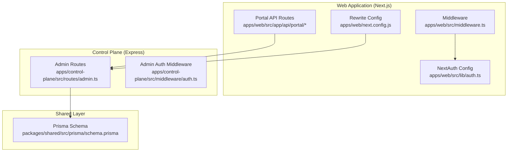
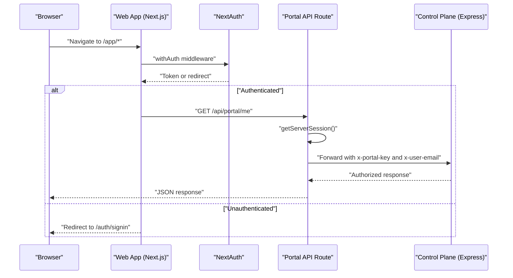
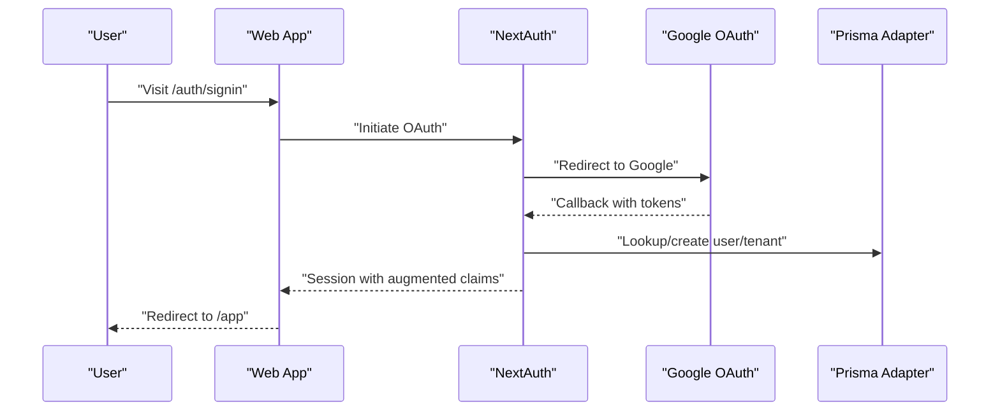
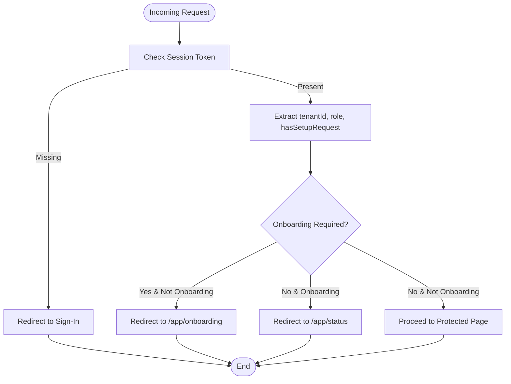
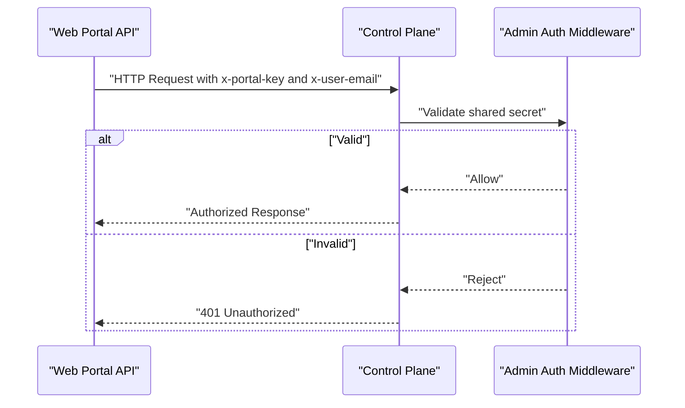
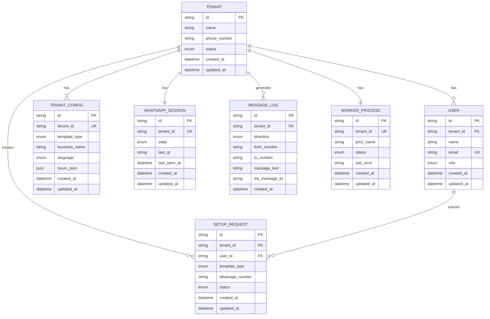
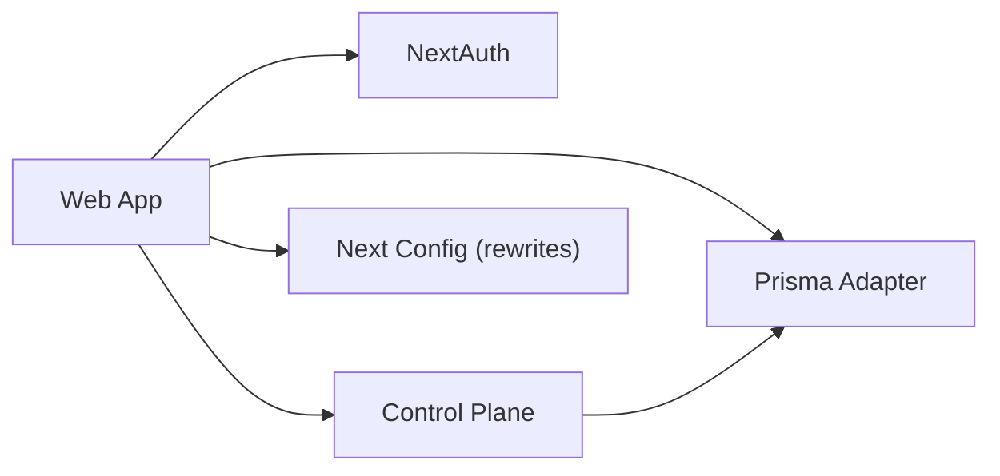

# Security Considerations

<cite>
**Referenced Files in This Document**
- [apps/web/src/lib/auth.ts](file://apps/web/src/lib/auth.ts)
- [apps/web/src/app/api/auth/[...nextauth]/route.ts](file://apps/web/src/app/api/auth/[...nextauth]/route.ts)
- [apps/web/src/middleware.ts](file://apps/web/src/middleware.ts)
- [apps/web/src/app/api/portal/me/route.ts](file://apps/web/src/app/api/portal/me/route.ts)
- [apps/web/src/app/api/portal/setup-request/route.ts](file://apps/web/src/app/api/portal/setup-request/route.ts)
- [apps/web/src/app/api/portal/tenant/current/logs/route.ts](file://apps/web/src/app/api/portal/tenant/current/logs/route.ts)
- [apps/web/src/app/api/portal/tenant/current/status/route.ts](file://apps/web/src/app/api/portal/tenant/current/status/route.ts)
- [apps/web/next.config.js](file://apps/web/next.config.js)
- [apps/web/.env.local](file://apps/web/.env.local)
- [.env.example](file://.env.example)
- [apps/control-plane/src/middleware/auth.ts](file://apps/control-plane/src/middleware/auth.ts)
- [apps/control-plane/src/routes/admin.ts](file://apps/control-plane/src/routes/admin.ts)
- [packages/shared/src/prisma/schema.prisma](file://packages/shared/src/prisma/schema.prisma)
- [package.json](file://package.json)
</cite>

## Table of Contents
1. [Introduction](#introduction)
2. [Project Structure](#project-structure)
3. [Core Components](#core-components)
4. [Architecture Overview](#architecture-overview)
5. [Detailed Component Analysis](#detailed-component-analysis)
6. [Dependency Analysis](#dependency-analysis)
7. [Performance Considerations](#performance-considerations)
8. [Troubleshooting Guide](#troubleshooting-guide)
9. [Conclusion](#conclusion)
10. [Appendices](#appendices)

## Introduction
This document provides comprehensive security documentation for the Flow HQ platform. It focuses on authentication security using NextAuth.js with Google OAuth, authorization patterns for tenant isolation, environment configuration security, and data protection measures. It also outlines production-grade security practices including firewall configuration, SSL/TLS setup, secure credential management, session security, API authentication security, database encryption, secure communication channels, a security checklist, vulnerability assessment procedures, incident response protocols, and compliance considerations.

## Project Structure
The platform consists of:
- Web application (Next.js) handling user-facing portal, authentication, and internal API calls to the control plane.
- Control plane (Express) exposing administrative endpoints and managing tenant lifecycle, worker processes, and logs.
- Shared Prisma schema defining tenant, user, session, logs, and worker models.
- Environment configuration files for local development and shared secrets.

**Diagram sources**
- [apps/web/src/middleware.ts](file://apps/web/src/middleware.ts#L1-L44)
- [apps/web/src/lib/auth.ts](file://apps/web/src/lib/auth.ts#L1-L76)
- [apps/web/src/app/api/portal/me/route.ts](file://apps/web/src/app/api/portal/me/route.ts#L1-L35)
- [apps/web/next.config.js](file://apps/web/next.config.js#L1-L17)
- [apps/control-plane/src/routes/admin.ts](file://apps/control-plane/src/routes/admin.ts#L1-L528)
- [apps/control-plane/src/middleware/auth.ts](file://apps/control-plane/src/middleware/auth.ts#L1-L40)
- [packages/shared/src/prisma/schema.prisma](file://packages/shared/src/prisma/schema.prisma#L1-L178)

**Section sources**
- [apps/web/src/middleware.ts](file://apps/web/src/middleware.ts#L1-L44)
- [apps/web/src/lib/auth.ts](file://apps/web/src/lib/auth.ts#L1-L76)
- [apps/web/src/app/api/portal/me/route.ts](file://apps/web/src/app/api/portal/me/route.ts#L1-L35)
- [apps/web/next.config.js](file://apps/web/next.config.js#L1-L17)
- [apps/control-plane/src/routes/admin.ts](file://apps/control-plane/src/routes/admin.ts#L1-L528)
- [apps/control-plane/src/middleware/auth.ts](file://apps/control-plane/src/middleware/auth.ts#L1-L40)
- [packages/shared/src/prisma/schema.prisma](file://packages/shared/src/prisma/schema.prisma#L1-L178)

## Core Components
- Authentication and session management via NextAuth.js with Google OAuth and Prisma adapter.
- Tenant isolation enforced through session-scoped user context and API gateways.
- Internal API security using a shared secret header validated by the control plane.
- Environment variable management for secrets, URLs, and operational settings.

Key security-relevant elements:
- NextAuth configuration and callbacks for session augmentation and tenant linking.
- Next.js middleware enforcing protected routes and onboarding redirection logic.
- Portal API routes validating session and forwarding requests to the control plane with internal keys.
- Control plane middleware enforcing admin access via a shared secret.
- Prisma schema modeling tenant, user, session, logs, and worker data with appropriate relations.

**Section sources**
- [apps/web/src/lib/auth.ts](file://apps/web/src/lib/auth.ts#L1-L76)
- [apps/web/src/middleware.ts](file://apps/web/src/middleware.ts#L1-L44)
- [apps/web/src/app/api/portal/me/route.ts](file://apps/web/src/app/api/portal/me/route.ts#L1-L35)
- [apps/control-plane/src/middleware/auth.ts](file://apps/control-plane/src/middleware/auth.ts#L1-L40)
- [packages/shared/src/prisma/schema.prisma](file://packages/shared/src/prisma/schema.prisma#L60-L148)

## Architecture Overview
The platform enforces authentication at the web boundary and delegates administrative operations to the control plane. The web app validates sessions and forwards authorized requests to the control plane using a shared internal key. The control plane persists data via Prisma and manages worker processes per tenant.

**Diagram sources**
- [apps/web/src/middleware.ts](file://apps/web/src/middleware.ts#L1-L44)
- [apps/web/src/app/api/portal/me/route.ts](file://apps/web/src/app/api/portal/me/route.ts#L1-L35)
- [apps/web/src/lib/auth.ts](file://apps/web/src/lib/auth.ts#L1-L76)
- [apps/control-plane/src/routes/admin.ts](file://apps/control-plane/src/routes/admin.ts#L1-L528)

## Detailed Component Analysis

### Authentication and Authorization with NextAuth.js (Google OAuth)
- NextAuth.js configured with Google provider and Prisma adapter.
- Callbacks augment session with user ID, tenant ID, role, and setup request presence.
- Middleware redirects unauthenticated users to the sign-in page and enforces onboarding flow based on session claims.

Security considerations:
- Secret rotation and HTTPS termination are required in production.
- Session storage and cookie security should be hardened (see Production Security Practices).
- Ensure strict origin and referrer policies for OAuth callback domains.

**Diagram sources**
- [apps/web/src/lib/auth.ts](file://apps/web/src/lib/auth.ts#L1-L76)
- [apps/web/src/app/api/auth/[...nextauth]/route.ts](file://apps/web/src/app/api/auth/[...nextauth]/route.ts#L1-L7)
- [apps/web/src/middleware.ts](file://apps/web/src/middleware.ts#L1-L44)

**Section sources**
- [apps/web/src/lib/auth.ts](file://apps/web/src/lib/auth.ts#L1-L76)
- [apps/web/src/app/api/auth/[...nextauth]/route.ts](file://apps/web/src/app/api/auth/[...nextauth]/route.ts#L1-L7)
- [apps/web/src/middleware.ts](file://apps/web/src/middleware.ts#L1-L44)

### Tenant Isolation and Authorization Patterns
- Session augmentation includes tenantId and role, enabling route-level checks.
- Middleware enforces that only authenticated users with valid tokens can access portal routes.
- Portal API routes validate session and forward requests to the control plane with internal keys.

**Diagram sources**
- [apps/web/src/middleware.ts](file://apps/web/src/middleware.ts#L1-L44)
- [apps/web/src/lib/auth.ts](file://apps/web/src/lib/auth.ts#L47-L69)

**Section sources**
- [apps/web/src/middleware.ts](file://apps/web/src/middleware.ts#L1-L44)
- [apps/web/src/lib/auth.ts](file://apps/web/src/lib/auth.ts#L47-L69)

### Internal API Security Between Web App and Control Plane
- Portal API routes require a valid NextAuth session and forward requests to the control plane with two headers:
  - x-portal-key: shared secret key
  - x-user-email: authenticated user’s email
- Control plane middleware validates the shared secret and allows access to admin routes.

**Diagram sources**
- [apps/web/src/app/api/portal/me/route.ts](file://apps/web/src/app/api/portal/me/route.ts#L1-L35)
- [apps/web/src/app/api/portal/setup-request/route.ts](file://apps/web/src/app/api/portal/setup-request/route.ts#L1-L40)
- [apps/web/src/app/api/portal/tenant/current/logs/route.ts](file://apps/web/src/app/api/portal/tenant/current/logs/route.ts#L1-L35)
- [apps/web/src/app/api/portal/tenant/current/status/route.ts](file://apps/web/src/app/api/portal/tenant/current/status/route.ts#L1-L35)
- [apps/control-plane/src/middleware/auth.ts](file://apps/control-plane/src/middleware/auth.ts#L1-L40)

**Section sources**
- [apps/web/src/app/api/portal/me/route.ts](file://apps/web/src/app/api/portal/me/route.ts#L1-L35)
- [apps/web/src/app/api/portal/setup-request/route.ts](file://apps/web/src/app/api/portal/setup-request/route.ts#L1-L40)
- [apps/web/src/app/api/portal/tenant/current/logs/route.ts](file://apps/web/src/app/api/portal/tenant/current/logs/route.ts#L1-L35)
- [apps/web/src/app/api/portal/tenant/current/status/route.ts](file://apps/web/src/app/api/portal/tenant/current/status/route.ts#L1-L35)
- [apps/control-plane/src/middleware/auth.ts](file://apps/control-plane/src/middleware/auth.ts#L1-L40)

### Environment Configuration Security
- Local development environment variables include NextAuth URL/secret, Google OAuth client credentials, control plane URL, and portal internal key.
- Example environment variables define DATABASE_URL, ADMIN_PASSWORD, PORTAL_INTERNAL_KEY, NODE_ENV, ports, logging, and worker thresholds.

Recommendations:
- Never commit secrets to version control; use separate environment files per environment.
- Rotate secrets regularly and enforce access control on deployment systems.
- Use encrypted secrets vaults and CI/CD secret injection.

**Section sources**
- [apps/web/.env.local](file://apps/web/.env.local#L1-L12)
- [.env.example](file://.env.example#L1-L22)

### Data Protection Measures
- Prisma schema defines tenant-centric models with foreign keys ensuring referential integrity.
- Message logs and portal event logs are indexed by tenant and timestamp for efficient querying.
- Worker processes and WhatsApp sessions are associated per tenant to maintain isolation.

**Diagram sources**
- [packages/shared/src/prisma/schema.prisma](file://packages/shared/src/prisma/schema.prisma#L60-L178)

**Section sources**
- [packages/shared/src/prisma/schema.prisma](file://packages/shared/src/prisma/schema.prisma#L60-L178)

### Session Security
- NextAuth manages session cookies and JWT tokens. In production, configure secure cookie attributes (SameSite, Secure, HttpOnly) and enforce HTTPS.
- Session callbacks enrich claims; ensure only necessary data is exposed to the client.

**Section sources**
- [apps/web/src/lib/auth.ts](file://apps/web/src/lib/auth.ts#L47-L69)

### API Authentication Security
- Portal API routes rely on NextAuth session validation and forward to the control plane using a shared internal key.
- Control plane middleware validates the shared key and optionally supports Basic Auth fallback for administrative endpoints.

**Section sources**
- [apps/web/src/app/api/portal/me/route.ts](file://apps/web/src/app/api/portal/me/route.ts#L1-L35)
- [apps/control-plane/src/middleware/auth.ts](file://apps/control-plane/src/middleware/auth.ts#L1-L40)

### Database Encryption
- The Prisma schema targets PostgreSQL via DATABASE_URL. Enable Transparent Data Encryption (TDE) at the database level and encrypt backups.
- Apply least privilege access controls and network-level encryption (TLS) for database connections.

**Section sources**
- [.env.example](file://.env.example#L1-L3)
- [packages/shared/src/prisma/schema.prisma](file://packages/shared/src/prisma/schema.prisma#L5-L8)

### Secure Communication Channels
- Use HTTPS/TLS for all endpoints. Configure reverse proxies or load balancers with modern TLS ciphers and SNI support.
- Restrict origins for OAuth callbacks and NextAuth endpoints to trusted domains.

**Section sources**
- [apps/web/.env.local](file://apps/web/.env.local#L2-L3)
- [apps/web/next.config.js](file://apps/web/next.config.js#L6-L13)

## Dependency Analysis
- Web app depends on NextAuth for authentication and Prisma for session/user persistence.
- Portal API routes depend on NextAuth session and forward to control plane endpoints.
- Control plane depends on Prisma for tenant/workers/logs and executes worker processes via PM2.
- Shared Prisma schema defines tenant isolation and data relationships.

**Diagram sources**
- [apps/web/src/lib/auth.ts](file://apps/web/src/lib/auth.ts#L1-L76)
- [apps/web/src/app/api/portal/me/route.ts](file://apps/web/src/app/api/portal/me/route.ts#L1-L35)
- [apps/web/next.config.js](file://apps/web/next.config.js#L1-L17)
- [apps/control-plane/src/routes/admin.ts](file://apps/control-plane/src/routes/admin.ts#L1-L528)
- [packages/shared/src/prisma/schema.prisma](file://packages/shared/src/prisma/schema.prisma#L1-L178)

**Section sources**
- [apps/web/src/lib/auth.ts](file://apps/web/src/lib/auth.ts#L1-L76)
- [apps/web/src/app/api/portal/me/route.ts](file://apps/web/src/app/api/portal/me/route.ts#L1-L35)
- [apps/web/next.config.js](file://apps/web/next.config.js#L1-L17)
- [apps/control-plane/src/routes/admin.ts](file://apps/control-plane/src/routes/admin.ts#L1-L528)
- [packages/shared/src/prisma/schema.prisma](file://packages/shared/src/prisma/schema.prisma#L1-L178)

## Performance Considerations
- Rate-limit API endpoints to prevent abuse and protect control plane resources.
- Use connection pooling and optimize Prisma queries with proper indexing (as seen on tenant and timestamp fields).
- Monitor worker process health and implement automatic restarts for stale workers.

[No sources needed since this section provides general guidance]

## Troubleshooting Guide
Common security-related issues and resolutions:
- Unauthorized access to portal routes:
  - Verify NextAuth session exists and token is present.
  - Confirm middleware matcher and protected route configuration.
- Control plane access denied:
  - Ensure x-portal-key matches ADMIN_PASSWORD or shared secret.
  - Validate that x-user-email corresponds to an authenticated session.
- Stale worker detection:
  - Review stale threshold configuration and logs for worker heartbeat failures.

**Section sources**
- [apps/web/src/middleware.ts](file://apps/web/src/middleware.ts#L1-L44)
- [apps/control-plane/src/middleware/auth.ts](file://apps/control-plane/src/middleware/auth.ts#L1-L40)
- [apps/control-plane/src/routes/admin.ts](file://apps/control-plane/src/routes/admin.ts#L30-L80)

## Conclusion
The Flow HQ platform implements layered security through NextAuth.js with Google OAuth, tenant-aware session management, and internal API key validation. Production hardening requires HTTPS/TLS, secure cookie configuration, secret rotation, database encryption, and strict access controls. Regular audits, vulnerability assessments, and incident response procedures are essential for maintaining a secure environment.

[No sources needed since this section summarizes without analyzing specific files]

## Appendices

### Production Security Checklist
- Enforce HTTPS/TLS on all endpoints and reverse proxies.
- Configure secure cookie attributes (SameSite=Lax|Strict, Secure, HttpOnly).
- Rotate NextAuth secret and Google OAuth credentials regularly.
- Store secrets in a secure vault and inject via environment variables.
- Limit control plane exposure (firewall rules, private networks).
- Enable database encryption at rest and in transit.
- Implement rate limiting and DDoS protections.
- Audit logs for authentication, authorization, and administrative actions.
- Back up encrypted databases and test restoration procedures.
- Conduct periodic penetration testing and dependency scanning.

[No sources needed since this section provides general guidance]

### Vulnerability Assessment Procedures
- Static analysis: Scan for hardcoded secrets, weak cryptography, and unsafe deserialization.
- Dynamic analysis: Test authentication bypass, session fixation, CSRF, and XXE.
- Dependency review: Audit third-party libraries for known vulnerabilities.
- Access control review: Verify tenant isolation and role-based permissions.
- Network security: Validate firewall rules and TLS cipher suites.

[No sources needed since this section provides general guidance]

### Incident Response Protocols
- Immediate: Revoke compromised secrets, rotate NextAuth and OAuth credentials, block affected IPs.
- Investigation: Collect logs from web app, control plane, and database; analyze session and request traces.
- Mitigation: Patch vulnerabilities, update access controls, and re-validate configurations.
- Recovery: Restore from clean backups, re-provision affected services, and monitor for anomalies.
- Post-mortem: Document root cause, remediation steps, and preventive measures.

[No sources needed since this section provides general guidance]

### Compliance Considerations
- Data localization and retention policies aligned with tenant data.
- Access logs retention and audit trails for regulatory compliance.
- Role-based access control (RBAC) and least privilege enforcement.
- Data subject rights handling (access, erasure, portability) via tenant-centric models.

[No sources needed since this section provides general guidance]