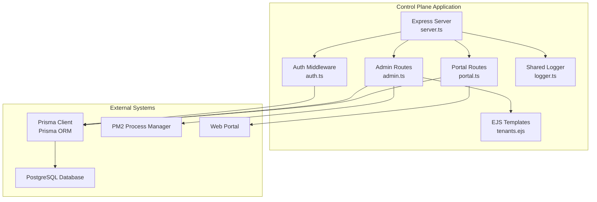
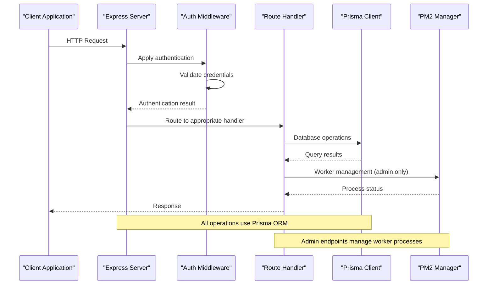
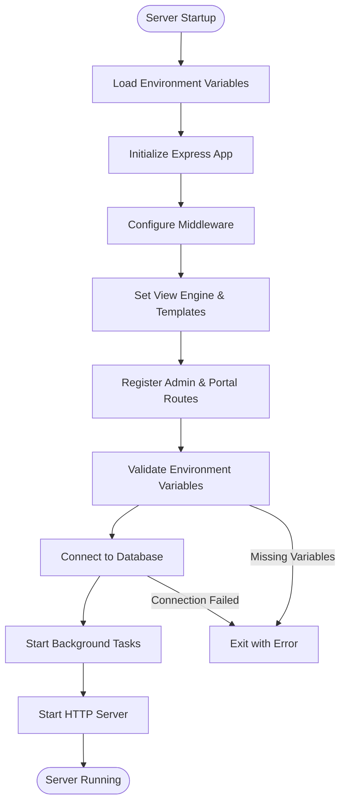
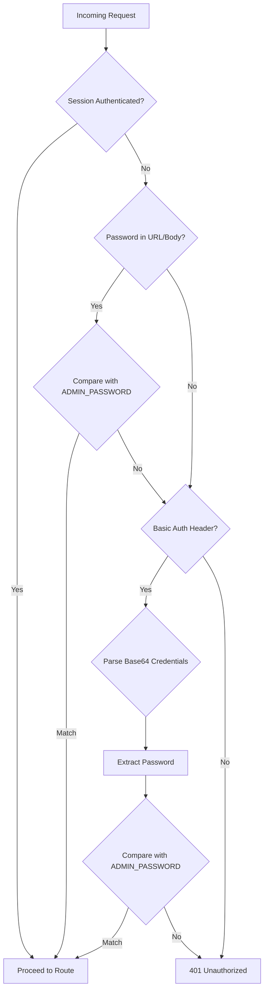
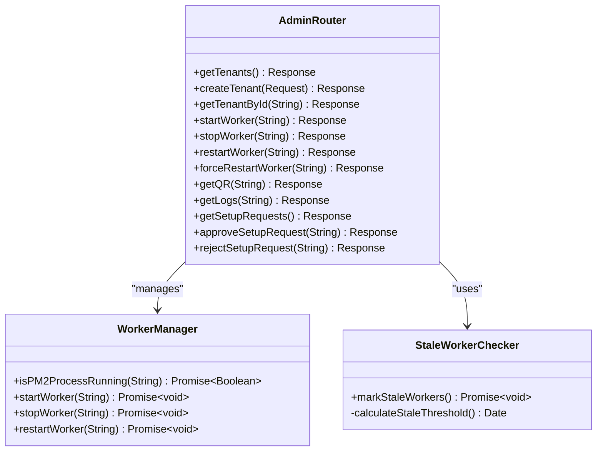
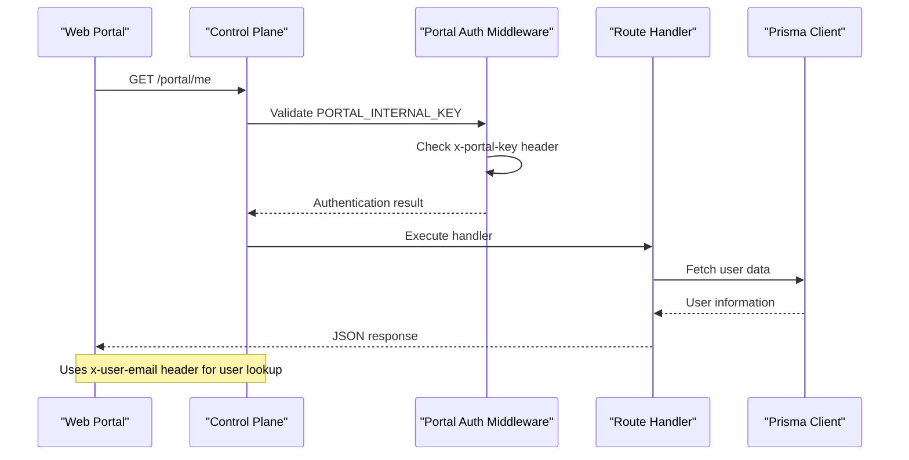
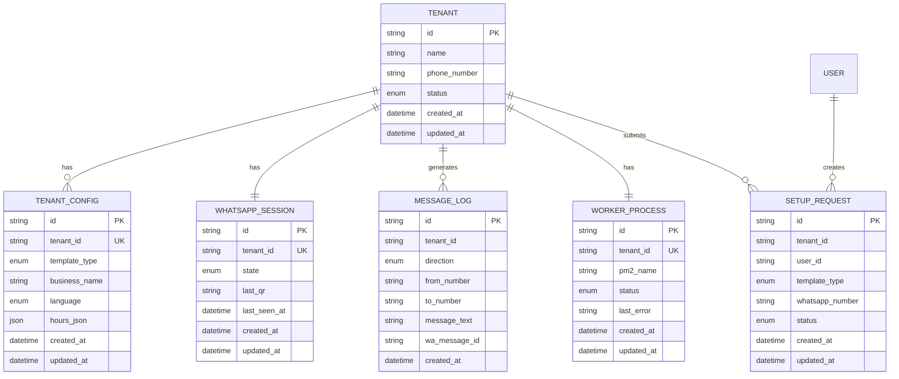
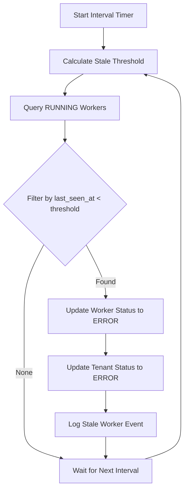

# Control Plane Architecture

<cite>
**Referenced Files in This Document**
- [server.ts](file://apps/control-plane/src/server.ts)
- [auth.ts](file://apps/control-plane/src/middleware/auth.ts)
- [admin.ts](file://apps/control-plane/src/routes/admin.ts)
- [portal.ts](file://apps/control-plane/src/routes/portal.ts)
- [logger.ts](file://packages/shared/src/utils/logger.ts)
- [schema.prisma](file://packages/shared/src/prisma/schema.prisma)
- [package.json](file://apps/control-plane/package.json)
- [tsconfig.json](file://apps/control-plane/tsconfig.json)
- [ecosystem.config.js](file://ecosystem.config.js)
- [.env.example](file://.env.example)
- [tenants.ejs](file://apps/control-plane/src/views/tenants.ejs)
</cite>

## Table of Contents
1. [Introduction](#introduction)
2. [Project Structure](#project-structure)
3. [Core Components](#core-components)
4. [Architecture Overview](#architecture-overview)
5. [Detailed Component Analysis](#detailed-component-analysis)
6. [Dependency Analysis](#dependency-analysis)
7. [Performance Considerations](#performance-considerations)
8. [Security Considerations](#security-considerations)
9. [Production Deployment](#production-deployment)
10. [Troubleshooting Guide](#troubleshooting-guide)
11. [Conclusion](#conclusion)

## Introduction
The Control Plane is an Express.js-based administrative backend responsible for tenant lifecycle management, worker orchestration, and portal integration within the Flow HQ ecosystem. It provides:
- Administrative endpoints for tenant creation, monitoring, and worker management
- Tenant-facing APIs for setup requests and operational status
- Background task scheduling for stale worker detection
- Secure authentication mechanisms for admin access and portal communication
- Database connectivity via Prisma ORM with PostgreSQL

## Project Structure
The Control Plane follows a modular Express.js architecture with clear separation of concerns:
- Server initialization and middleware registration
- Authentication middleware for admin endpoints
- Admin routes for tenant management and worker orchestration
- Portal routes for tenant-specific APIs
- Shared logging utilities and Prisma schema
- EJS templates for admin web interface



**Diagram sources**
- [server.ts](file://apps/control-plane/src/server.ts#L1-L89)
- [auth.ts](file://apps/control-plane/src/middleware/auth.ts#L1-L40)
- [admin.ts](file://apps/control-plane/src/routes/admin.ts#L1-L528)
- [portal.ts](file://apps/control-plane/src/routes/portal.ts#L1-L246)
- [logger.ts](file://packages/shared/src/utils/logger.ts#L1-L33)
- [tenants.ejs](file://apps/control-plane/src/views/tenants.ejs#L1-L185)

**Section sources**
- [server.ts](file://apps/control-plane/src/server.ts#L1-L89)
- [package.json](file://apps/control-plane/package.json#L1-L24)
- [tsconfig.json](file://apps/control-plane/tsconfig.json#L1-L18)

## Core Components
The Control Plane consists of several core components working together:

### Express Server Instance
The server initializes Express, loads environment variables, configures middleware, and sets up routing. It implements graceful shutdown handling and background task scheduling.

### Authentication Layer
Dual-layer authentication system:
- Basic authentication for admin endpoints
- Portal internal key validation for tenant APIs
- Session-based authentication support

### Database Abstraction
Prisma Client provides type-safe database operations with comprehensive tenant, worker, and messaging data models.

### Routing Architecture
- `/admin` endpoints: Administrative tenant management and worker control
- `/portal` endpoints: Tenant-specific APIs for setup requests and status monitoring

**Section sources**
- [server.ts](file://apps/control-plane/src/server.ts#L10-L89)
- [auth.ts](file://apps/control-plane/src/middleware/auth.ts#L1-L40)
- [admin.ts](file://apps/control-plane/src/routes/admin.ts#L1-L528)
- [portal.ts](file://apps/control-plane/src/routes/portal.ts#L1-L246)

## Architecture Overview
The Control Plane implements a layered architecture with clear separation between presentation, business logic, and data access layers.



**Diagram sources**
- [server.ts](file://apps/control-plane/src/server.ts#L41-L52)
- [auth.ts](file://apps/control-plane/src/middleware/auth.ts#L5-L29)
- [admin.ts](file://apps/control-plane/src/routes/admin.ts#L174-L230)
- [portal.ts](file://apps/control-plane/src/routes/portal.ts#L12-L25)

## Detailed Component Analysis

### Server Initialization and Lifecycle
The server initialization process follows a structured startup sequence:



**Diagram sources**
- [server.ts](file://apps/control-plane/src/server.ts#L65-L81)

The initialization validates three critical environment variables:
- DATABASE_URL: PostgreSQL connection string
- ADMIN_PASSWORD: Admin authentication credential
- PORTAL_INTERNAL_KEY: Internal API key for portal integration

**Section sources**
- [server.ts](file://apps/control-plane/src/server.ts#L16-L39)
- [server.ts](file://apps/control-plane/src/server.ts#L65-L81)

### Authentication Middleware Implementation
The authentication system supports multiple authentication methods:



**Diagram sources**
- [auth.ts](file://apps/control-plane/src/middleware/auth.ts#L5-L29)

**Section sources**
- [auth.ts](file://apps/control-plane/src/middleware/auth.ts#L1-L40)

### Admin Routes Architecture
The admin routes handle comprehensive tenant management operations:



**Diagram sources**
- [admin.ts](file://apps/control-plane/src/routes/admin.ts#L1-L528)

**Section sources**
- [admin.ts](file://apps/control-plane/src/routes/admin.ts#L82-L140)
- [admin.ts](file://apps/control-plane/src/routes/admin.ts#L174-L230)
- [admin.ts](file://apps/control-plane/src/routes/admin.ts#L30-L80)

### Portal Routes Implementation
Portal routes provide tenant-specific APIs secured by internal key validation:



**Diagram sources**
- [portal.ts](file://apps/control-plane/src/routes/portal.ts#L52-L79)
- [portal.ts](file://apps/control-plane/src/routes/portal.ts#L12-L25)

**Section sources**
- [portal.ts](file://apps/control-plane/src/routes/portal.ts#L1-L246)

### Database Schema and Data Models
The Prisma schema defines the core data model for tenant management:



**Diagram sources**
- [schema.prisma](file://packages/shared/src/prisma/schema.prisma#L60-L177)

**Section sources**
- [schema.prisma](file://packages/shared/src/prisma/schema.prisma#L1-L178)

### Stale Worker Checker Mechanism
The stale worker checker implements automatic health monitoring:



**Diagram sources**
- [admin.ts](file://apps/control-plane/src/routes/admin.ts#L30-L80)
- [server.ts](file://apps/control-plane/src/server.ts#L54-L63)

**Section sources**
- [admin.ts](file://apps/control-plane/src/routes/admin.ts#L30-L80)
- [server.ts](file://apps/control-plane/src/server.ts#L54-L63)

## Dependency Analysis
The Control Plane has well-defined dependencies and external integrations:

```mermaid
graph TB
subgraph "Application Dependencies"
A[express ^4.18.2]
B[ejs ^3.1.9]
C[pm2 ^5.3.0]
D[dotenv ^16.3.1]
E[body-parser ^1.20.2]
end
subgraph "Internal Dependencies"
F[@flowhq/shared]
G[Prisma Client]
H[Pino Logger]
end
subgraph "Runtime Dependencies"
I[Node.js Runtime]
J[PostgreSQL Database]
K[PM2 Process Manager]
end
A --> F
B --> F
C --> F
D --> F
E --> F
F --> G
F --> H
G --> J
K --> I
```

**Diagram sources**
- [package.json](file://apps/control-plane/package.json#L9-L22)

**Section sources**
- [package.json](file://apps/control-plane/package.json#L1-L24)

## Performance Considerations
Several performance aspects require attention:

### Database Connection Management
- Single PrismaClient instance per process
- Connection pooling handled by Prisma
- Graceful shutdown with proper disconnection

### Background Task Scheduling
- Configurable stale worker check interval
- Non-blocking execution using async/await
- Error handling to prevent task failures

### Memory Management
- PM2 autorestart based on memory thresholds
- Proper cleanup of child processes
- Efficient query pagination for large datasets

## Security Considerations

### Admin Authentication Security
The admin authentication system implements multiple verification methods:
- Environment-based password configuration
- Basic authentication header support
- Session-based authentication fallback
- Comprehensive error handling

### Portal API Security
- Internal key validation for all portal endpoints
- User identification via email header
- Request header validation and sanitization

### Production Security Requirements
- Puppeteer executable path configuration for production
- Environment variable validation during startup
- Secure credential storage and transmission

**Section sources**
- [auth.ts](file://apps/control-plane/src/middleware/auth.ts#L1-L40)
- [portal.ts](file://apps/control-plane/src/routes/portal.ts#L12-L25)
- [server.ts](file://apps/control-plane/src/server.ts#L34-L38)

## Production Deployment

### Process Manager Configuration
The ecosystem configuration defines production deployment parameters:
- Single instance with autorestart enabled
- Memory-based restart threshold (1GB)
- Separate log files for monitoring
- Production environment variables

### Environment Configuration
Critical production environment variables:
- DATABASE_URL: PostgreSQL connection string
- ADMIN_PASSWORD: Secure admin authentication
- PORTAL_INTERNAL_KEY: Shared secret key
- PUPPETEER_EXECUTABLE_PATH: Chrome/Chromium path
- STALE_CHECK_INTERVAL_MS: Background task frequency

**Section sources**
- [ecosystem.config.js](file://ecosystem.config.js#L1-L19)
- [.env.example](file://.env.example#L1-L22)

## Troubleshooting Guide

### Common Startup Issues
- **Database Connection Failures**: Verify DATABASE_URL format and PostgreSQL accessibility
- **Missing Environment Variables**: Check all required variables in .env file
- **Port Binding Issues**: Ensure PORT is available and not blocked by firewall

### Authentication Problems
- **Admin Access Denied**: Verify ADMIN_PASSWORD matches environment configuration
- **Portal API Errors**: Confirm PORTAL_INTERNAL_KEY matches web application configuration
- **Session Issues**: Check session storage configuration and cookie settings

### Worker Management Issues
- **PM2 Process Failures**: Verify PM2 installation and worker script path
- **Worker Status Mismatch**: Check stale worker threshold configuration
- **QR Generation Problems**: Ensure Puppeteer executable path is correctly set

### Database Connectivity
- **Query Timeout Issues**: Monitor database performance and connection pool usage
- **Schema Migration Problems**: Run Prisma migrations before deployment
- **Data Consistency**: Implement proper transaction handling for critical operations

**Section sources**
- [server.ts](file://apps/control-plane/src/server.ts#L26-L32)
- [admin.ts](file://apps/control-plane/src/routes/admin.ts#L174-L230)
- [logger.ts](file://packages/shared/src/utils/logger.ts#L1-L33)

## Conclusion
The Control Plane provides a robust foundation for managing tenant operations and worker orchestration within the Flow HQ ecosystem. Its modular architecture, comprehensive security measures, and automated maintenance capabilities make it suitable for production deployment. Key strengths include:

- Clear separation of admin and portal functionalities
- Multi-layered authentication system
- Automated worker health monitoring
- Comprehensive logging and error handling
- Production-ready deployment configuration

The architecture supports future enhancements including additional authentication methods, expanded monitoring capabilities, and integration with external systems while maintaining backward compatibility and operational reliability.