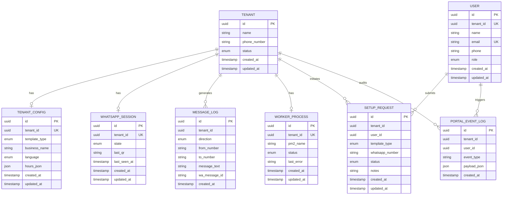

# Data Flow Architecture

<cite>
**Referenced Files in This Document**
- [schema.prisma](file://packages/shared/src/prisma/schema.prisma)
- [prisma.ts](file://apps/web/src/lib/prisma.ts)
- [auth.ts](file://apps/web/src/lib/auth.ts)
- [server.ts](file://apps/control-plane/src/server.ts)
- [auth-middleware.ts](file://apps/control-plane/src/middleware/auth.ts)
- [admin-routes.ts](file://apps/control-plane/src/routes/admin.ts)
- [worker.ts](file://apps/worker/src/worker.ts)
- [bot.ts](file://apps/worker/src/bot.ts)
- [web-setup-request-route.ts](file://apps/web/src/app/api/portal/setup-request/route.ts)
- [web-current-status-route.ts](file://apps/web/src/app/api/portal/tenant/current/status/route.ts)
- [web-current-logs-route.ts](file://apps/web/src/app/api/portal/tenant/current/logs/route.ts)
- [logger.ts](file://packages/shared/src/utils/logger.ts)
</cite>

## Table of Contents
1. [Introduction](#introduction)
2. [Project Structure](#project-structure)
3. [Core Components](#core-components)
4. [Architecture Overview](#architecture-overview)
5. [Detailed Component Analysis](#detailed-component-analysis)
6. [Dependency Analysis](#dependency-analysis)
7. [Performance Considerations](#performance-considerations)
8. [Troubleshooting Guide](#troubleshooting-guide)
9. [Conclusion](#conclusion)
10. [Appendices](#appendices)

## Introduction
This document explains the complete data flow across the system, from user authentication through tenant creation, worker process initialization, WhatsApp Web message processing, and response generation. It documents multi-tenant data isolation patterns, database transaction flows, inter-component communication, message flows between the web portal, control plane, and worker processes, along with data validation, error propagation, and audit trail mechanisms. It also maps Prisma models to real-world data transformations.

## Project Structure
The system is organized into three primary applications:
- Web portal: Next.js frontend with authentication and API routes that proxy to the control plane.
- Control plane: Express server managing administrative operations, tenant lifecycle, worker orchestration, and audit logging.
- Worker: Per-tenant process that runs WhatsApp Web automation and handles inbound/outbound messaging.

**Diagram sources**
- [server.ts](file://apps/control-plane/src/server.ts#L1-L89)
- [auth-middleware.ts](file://apps/control-plane/src/middleware/auth.ts#L1-L40)
- [admin-routes.ts](file://apps/control-plane/src/routes/admin.ts#L1-L528)
- [worker.ts](file://apps/worker/src/worker.ts#L1-L46)
- [bot.ts](file://apps/worker/src/bot.ts#L1-L411)
- [auth.ts](file://apps/web/src/lib/auth.ts#L1-L76)
- [web-setup-request-route.ts](file://apps/web/src/app/api/portal/setup-request/route.ts#L1-L40)
- [web-current-status-route.ts](file://apps/web/src/app/api/portal/tenant/current/status/route.ts#L1-L35)
- [web-current-logs-route.ts](file://apps/web/src/app/api/portal/tenant/current/logs/route.ts#L1-L35)

**Section sources**
- [server.ts](file://apps/control-plane/src/server.ts#L1-L89)
- [auth.ts](file://apps/web/src/lib/auth.ts#L1-L76)

## Core Components
- Prisma models define multi-tenant entities and their relationships, ensuring isolation via tenant_id and cascading deletes.
- Web portal authenticates users and proxies requests to the control plane with internal keys and user context.
- Control plane validates environment, manages tenant lifecycle, starts/stops workers, and maintains audit trails.
- Worker process initializes WhatsApp Web, processes messages, enforces rate limits, deduplicates, queues chats, and updates status.

**Section sources**
- [schema.prisma](file://packages/shared/src/prisma/schema.prisma#L60-L177)
- [prisma.ts](file://apps/web/src/lib/prisma.ts#L1-L10)
- [auth.ts](file://apps/web/src/lib/auth.ts#L14-L70)
- [server.ts](file://apps/control-plane/src/server.ts#L16-L89)
- [admin-routes.ts](file://apps/control-plane/src/routes/admin.ts#L104-L140)
- [worker.ts](file://apps/worker/src/worker.ts#L1-L46)
- [bot.ts](file://apps/worker/src/bot.ts#L12-L75)

## Architecture Overview
The system follows a strict separation of concerns:
- Authentication and session management in the web portal.
- Administrative control and orchestration in the control plane.
- Per-tenant automation in isolated worker processes.
- Persistent state stored in PostgreSQL via Prisma.

**Diagram sources**
- [auth.ts](file://apps/web/src/lib/auth.ts#L14-L46)
- [web-setup-request-route.ts](file://apps/web/src/app/api/portal/setup-request/route.ts#L8-L34)
- [web-current-status-route.ts](file://apps/web/src/app/api/portal/tenant/current/status/route.ts#L8-L29)
- [admin-routes.ts](file://apps/control-plane/src/routes/admin.ts#L174-L230)
- [worker.ts](file://apps/worker/src/worker.ts#L17-L24)
- [bot.ts](file://apps/worker/src/bot.ts#L333-L359)

## Detailed Component Analysis

### Authentication and Multi-Tenant Creation
- On first sign-in via Google, the web portal creates a Tenant and associated entities (session and worker) and links a User to the Tenant.
- Subsequent sessions enrich the session with tenant context and role.

**Diagram sources**
- [auth.ts](file://apps/web/src/lib/auth.ts#L14-L70)
- [prisma.ts](file://apps/web/src/lib/prisma.ts#L1-L10)

**Section sources**
- [auth.ts](file://apps/web/src/lib/auth.ts#L14-L70)

### Control Plane Orchestration and Worker Lifecycle
- Validates environment and database connectivity.
- Exposes admin endpoints to manage tenants, workers, and QR retrieval.
- Starts/stops/restarts workers via PM2, updating WorkerProcess and Tenant statuses accordingly.
- Periodically marks stale workers based on session heartbeat.

**Diagram sources**
- [server.ts](file://apps/control-plane/src/server.ts#L54-L81)
- [admin-routes.ts](file://apps/control-plane/src/routes/admin.ts#L174-L230)
- [admin-routes.ts](file://apps/control-plane/src/routes/admin.ts#L30-L80)
- [worker.ts](file://apps/worker/src/worker.ts#L17-L24)

**Section sources**
- [server.ts](file://apps/control-plane/src/server.ts#L16-L89)
- [admin-routes.ts](file://apps/control-plane/src/routes/admin.ts#L174-L230)
- [admin-routes.ts](file://apps/control-plane/src/routes/admin.ts#L30-L80)

### Worker Message Processing Pipeline
- Initializes WhatsApp Web client with local auth and session persistence.
- Handles QR generation, connection readiness, disconnections, and auth failures.
- Processes inbound messages with deduplication, rate limiting, and chat queue ordering.
- Generates outbound replies and logs both directions.
- Maintains heartbeat to keep Tenant and WorkerProcess healthy.

**Diagram sources**
- [bot.ts](file://apps/worker/src/bot.ts#L369-L392)
- [bot.ts](file://apps/worker/src/bot.ts#L153-L183)
- [bot.ts](file://apps/worker/src/bot.ts#L248-L331)
- [bot.ts](file://apps/worker/src/bot.ts#L333-L359)

**Section sources**
- [bot.ts](file://apps/worker/src/bot.ts#L12-L75)
- [bot.ts](file://apps/worker/src/bot.ts#L153-L183)
- [bot.ts](file://apps/worker/src/bot.ts#L248-L331)
- [bot.ts](file://apps/worker/src/bot.ts#L333-L359)

### Web Portal Interactions and Proxying
- Setup request submission is proxied to the control plane with an internal key and user email header.
- Current status and logs endpoints similarly proxy to the control plane using the internal key and user context.

**Diagram sources**
- [web-setup-request-route.ts](file://apps/web/src/app/api/portal/setup-request/route.ts#L8-L34)
- [web-current-status-route.ts](file://apps/web/src/app/api/portal/tenant/current/status/route.ts#L8-L29)
- [web-current-logs-route.ts](file://apps/web/src/app/api/portal/tenant/current/logs/route.ts#L8-L29)

**Section sources**
- [web-setup-request-route.ts](file://apps/web/src/app/api/portal/setup-request/route.ts#L1-L40)
- [web-current-status-route.ts](file://apps/web/src/app/api/portal/tenant/current/status/route.ts#L1-L35)
- [web-current-logs-route.ts](file://apps/web/src/app/api/portal/tenant/current/logs/route.ts#L1-L35)

### Data Validation, Error Propagation, and Audit Trails
- Environment validation ensures required variables are present and database connectivity is established.
- Worker catches unhandled exceptions and logs them to the database without crashing the process.
- Control plane routes update WorkerProcess and Tenant status on success/failure and log portal events.
- Message logs capture both directions and are indexed by tenant and timestamp for efficient queries.

**Diagram sources**
- [server.ts](file://apps/control-plane/src/server.ts#L16-L39)
- [bot.ts](file://apps/worker/src/bot.ts#L313-L331)
- [admin-routes.ts](file://apps/control-plane/src/routes/admin.ts#L476-L482)
- [schema.prisma](file://packages/shared/src/prisma/schema.prisma#L105-L118)

**Section sources**
- [server.ts](file://apps/control-plane/src/server.ts#L16-L39)
- [bot.ts](file://apps/worker/src/bot.ts#L313-L331)
- [admin-routes.ts](file://apps/control-plane/src/routes/admin.ts#L476-L482)
- [schema.prisma](file://packages/shared/src/prisma/schema.prisma#L105-L118)

## Dependency Analysis
The following diagram shows key dependencies among modules and their roles in the data flow.

**Diagram sources**
- [auth.ts](file://apps/web/src/lib/auth.ts#L1-L76)
- [prisma.ts](file://apps/web/src/lib/prisma.ts#L1-L10)
- [web-setup-request-route.ts](file://apps/web/src/app/api/portal/setup-request/route.ts#L1-L40)
- [web-current-status-route.ts](file://apps/web/src/app/api/portal/tenant/current/status/route.ts#L1-L35)
- [web-current-logs-route.ts](file://apps/web/src/app/api/portal/tenant/current/logs/route.ts#L1-L35)
- [server.ts](file://apps/control-plane/src/server.ts#L1-L89)
- [auth-middleware.ts](file://apps/control-plane/src/middleware/auth.ts#L1-L40)
- [admin-routes.ts](file://apps/control-plane/src/routes/admin.ts#L1-L528)
- [worker.ts](file://apps/worker/src/worker.ts#L1-L46)
- [bot.ts](file://apps/worker/src/bot.ts#L1-L411)
- [logger.ts](file://packages/shared/src/utils/logger.ts#L1-L33)
- [schema.prisma](file://packages/shared/src/prisma/schema.prisma#L1-L178)

**Section sources**
- [schema.prisma](file://packages/shared/src/prisma/schema.prisma#L60-L177)
- [admin-routes.ts](file://apps/control-plane/src/routes/admin.ts#L104-L140)
- [bot.ts](file://apps/worker/src/bot.ts#L369-L392)

## Performance Considerations
- Rate limiting prevents flooding and ensures fair usage per tenant.
- Chat queue serializes processing per chat to avoid conflicts.
- Heartbeat intervals maintain liveness and enable stale detection.
- Indexes on tenant_id and timestamps optimize log queries.
- PM2 process management enables graceful restarts and resource isolation.

[No sources needed since this section provides general guidance]

## Troubleshooting Guide
- Worker fails to start: Verify environment variables, PM2 installation, and Puppeteer executable path. Check WorkerProcess last_error and Tenant status.
- Stale workers: The control plane periodically sets WorkerProcess status to ERROR and Tenant status to ERROR if no heartbeat is received within the configured threshold.
- Authentication failures: Worker updates Tenant and WorkerProcess status to ERROR on auth failure; inspect last_error for details.
- Logging: Tenant-specific logs are written to dedicated files under the logs directory; global logs are pretty-printed to console.

**Section sources**
- [server.ts](file://apps/control-plane/src/server.ts#L34-L38)
- [admin-routes.ts](file://apps/control-plane/src/routes/admin.ts#L30-L80)
- [bot.ts](file://apps/worker/src/bot.ts#L210-L225)
- [logger.ts](file://packages/shared/src/utils/logger.ts#L1-L33)

## Conclusion
The system implements robust multi-tenant isolation, reliable worker orchestration, and comprehensive auditing. Data flows consistently through Prisma-managed models, with clear boundaries between the web portal, control plane, and worker processes. Validation, error handling, and heartbeat mechanisms ensure resilience and observability across the entire lifecycle.

[No sources needed since this section summarizes without analyzing specific files]

## Appendices

### Prisma Model Relationships and Data Transformations

**Diagram sources**
- [schema.prisma](file://packages/shared/src/prisma/schema.prisma#L60-L177)