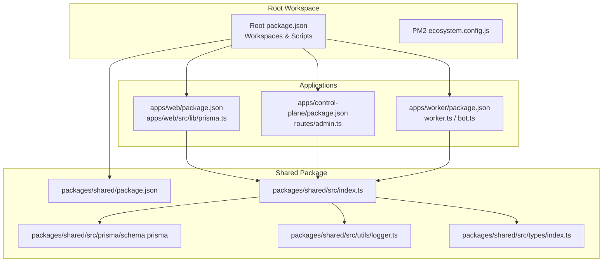
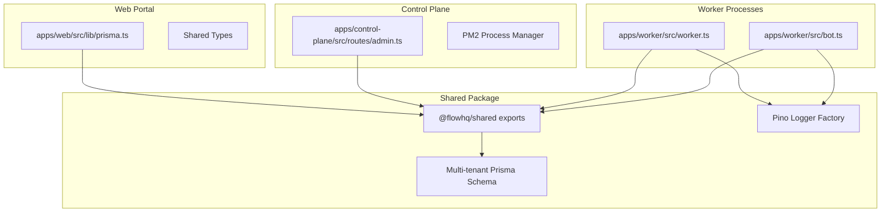
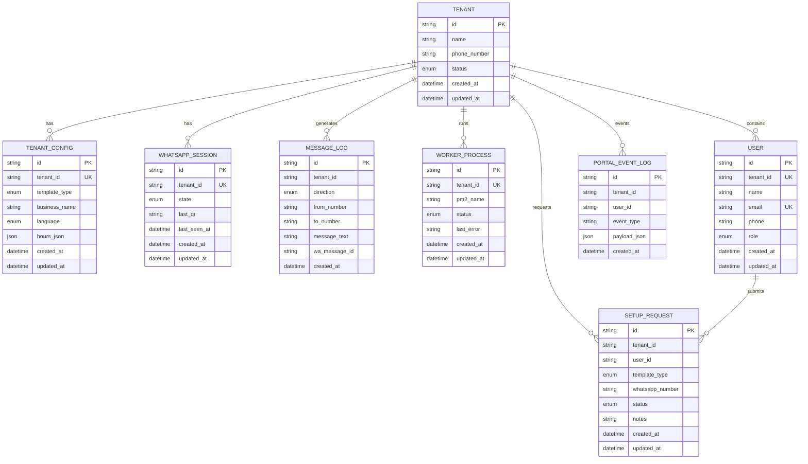
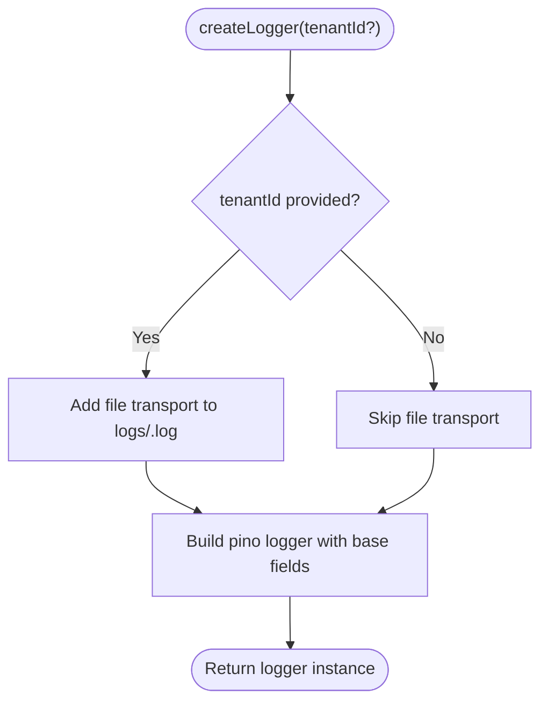
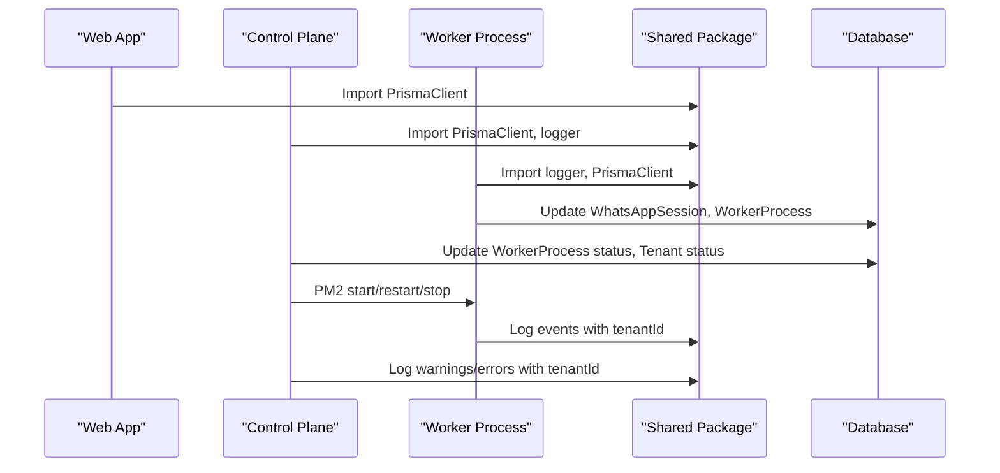
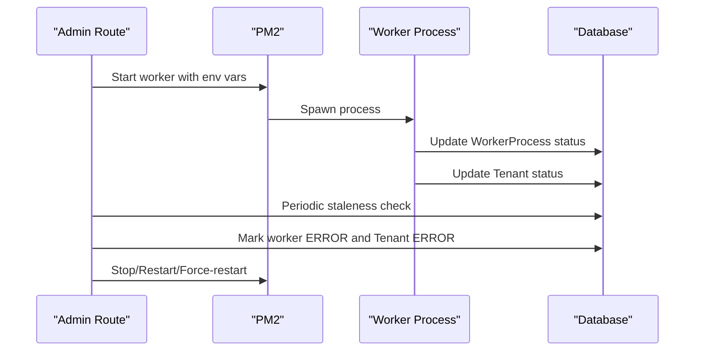
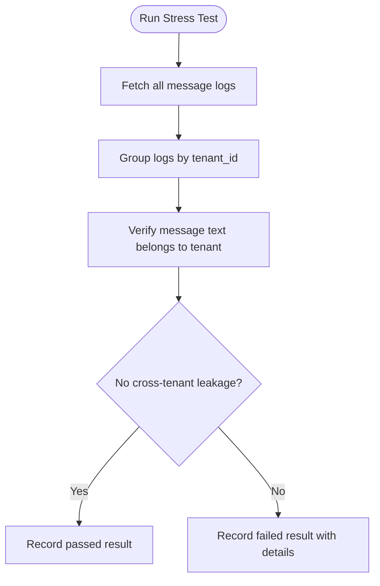
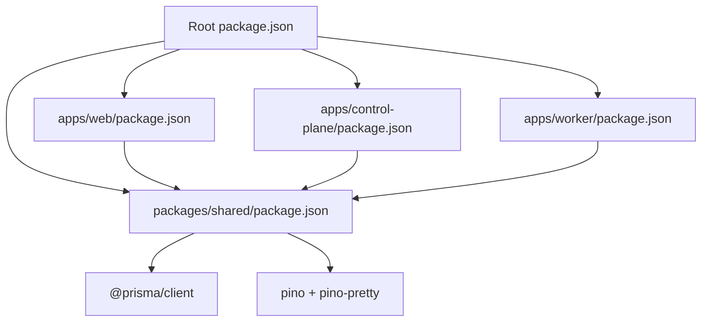

# Shared Components Architecture

<cite>
**Referenced Files in This Document**
- [package.json](file://package.json)
- [ecosystem.config.js](file://ecosystem.config.js)
- [packages/shared/package.json](file://packages/shared/package.json)
- [packages/shared/src/index.ts](file://packages/shared/src/index.ts)
- [packages/shared/src/prisma/schema.prisma](file://packages/shared/src/prisma/schema.prisma)
- [packages/shared/src/utils/logger.ts](file://packages/shared/src/utils/logger.ts)
- [packages/shared/src/types/index.ts](file://packages/shared/src/types/index.ts)
- [apps/web/package.json](file://apps/web/package.json)
- [apps/web/src/lib/prisma.ts](file://apps/web/src/lib/prisma.ts)
- [apps/control-plane/package.json](file://apps/control-plane/package.json)
- [apps/control-plane/src/routes/admin.ts](file://apps/control-plane/src/routes/admin.ts)
- [apps/worker/package.json](file://apps/worker/package.json)
- [apps/worker/src/worker.ts](file://apps/worker/src/worker.ts)
- [apps/worker/src/bot.ts](file://apps/worker/src/bot.ts)
- [scripts/stress-test.ts](file://scripts/stress-test.ts)
</cite>

## Table of Contents
1. [Introduction](#introduction)
2. [Project Structure](#project-structure)
3. [Core Components](#core-components)
4. [Architecture Overview](#architecture-overview)
5. [Detailed Component Analysis](#detailed-component-analysis)
6. [Dependency Analysis](#dependency-analysis)
7. [Performance Considerations](#performance-considerations)
8. [Troubleshooting Guide](#troubleshooting-guide)
9. [Conclusion](#conclusion)

## Introduction
This document describes the Shared Components system that powers the multi-tenant WhatsApp automation platform. It covers the monorepo structure, the shared package that provides Prisma client, database schemas, logging utilities, and common types, and how these components enable consistent data modeling and operational behavior across the web portal, control plane, and worker applications. The system implements tenant isolation, robust logging with Pino, and a clear separation of concerns to maintain consistency and reliability across distributed services.

## Project Structure
The repository follows a monorepo pattern with workspaces for applications and a shared package:
- Root workspace configuration orchestrates builds and database tasks
- Shared package exports Prisma client, logging utilities, and TypeScript types
- Applications depend on the shared package for consistent behavior

**Diagram sources**
- [package.json](file://package.json#L1-L20)
- [ecosystem.config.js](file://ecosystem.config.js#L1-L18)
- [packages/shared/package.json](file://packages/shared/package.json#L1-L23)
- [packages/shared/src/index.ts](file://packages/shared/src/index.ts#L1-L4)
- [packages/shared/src/prisma/schema.prisma](file://packages/shared/src/prisma/schema.prisma#L1-L178)
- [packages/shared/src/utils/logger.ts](file://packages/shared/src/utils/logger.ts#L1-L33)
- [packages/shared/src/types/index.ts](file://packages/shared/src/types/index.ts#L1-L41)
- [apps/web/package.json](file://apps/web/package.json#L1-L27)
- [apps/web/src/lib/prisma.ts](file://apps/web/src/lib/prisma.ts#L1-L10)
- [apps/control-plane/package.json](file://apps/control-plane/package.json#L1-L24)
- [apps/control-plane/src/routes/admin.ts](file://apps/control-plane/src/routes/admin.ts#L1-L332)
- [apps/worker/package.json](file://apps/worker/package.json#L1-L22)
- [apps/worker/src/worker.ts](file://apps/worker/src/worker.ts#L1-L46)
- [apps/worker/src/bot.ts](file://apps/worker/src/bot.ts#L1-L200)

**Section sources**
- [package.json](file://package.json#L1-L20)
- [ecosystem.config.js](file://ecosystem.config.js#L1-L18)
- [packages/shared/package.json](file://packages/shared/package.json#L1-L23)
- [packages/shared/src/index.ts](file://packages/shared/src/index.ts#L1-L4)

## Core Components
The shared package centralizes cross-cutting concerns:

- Prisma client export: Provides a single PrismaClient import used by all applications
- Logging utilities: Pino-based logger factory supporting console and tenant-specific file transports
- Type definitions: Interfaces for tenant relations, creation inputs, worker start commands, and message logs

Key exports and their roles:
- Index re-exports types, logger utilities, and Prisma client for convenient consumption
- Prisma schema defines multi-tenant entities and enums for consistent data modeling
- Logger factory creates structured logs with optional tenant-scoped file output

**Section sources**
- [packages/shared/src/index.ts](file://packages/shared/src/index.ts#L1-L4)
- [packages/shared/src/prisma/schema.prisma](file://packages/shared/src/prisma/schema.prisma#L1-L178)
- [packages/shared/src/utils/logger.ts](file://packages/shared/src/utils/logger.ts#L1-L33)
- [packages/shared/src/types/index.ts](file://packages/shared/src/types/index.ts#L1-L41)

## Architecture Overview
The system enforces tenant isolation through database design and runtime coordination:
- Database design: Each tenant has dedicated records for configuration, session state, message logs, worker process, and user management
- Runtime orchestration: Control plane manages worker lifecycle via PM2, updates worker status, and monitors staleness
- Application integration: Web portal consumes shared types and Prisma client; worker processes use tenant-scoped logging and database updates; control plane coordinates operations

**Diagram sources**
- [apps/web/src/lib/prisma.ts](file://apps/web/src/lib/prisma.ts#L1-L10)
- [apps/control-plane/src/routes/admin.ts](file://apps/control-plane/src/routes/admin.ts#L1-L332)
- [apps/worker/src/worker.ts](file://apps/worker/src/worker.ts#L1-L46)
- [apps/worker/src/bot.ts](file://apps/worker/src/bot.ts#L1-L200)
- [packages/shared/src/index.ts](file://packages/shared/src/index.ts#L1-L4)
- [packages/shared/src/prisma/schema.prisma](file://packages/shared/src/prisma/schema.prisma#L1-L178)
- [packages/shared/src/utils/logger.ts](file://packages/shared/src/utils/logger.ts#L1-L33)

## Detailed Component Analysis

### Multi-Tenant Database Design
The Prisma schema models tenant-centric entities with explicit foreign keys and indexes to ensure isolation and efficient queries:
- Tenant entity stores basic info and maintains relations to configuration, session, message logs, worker process, and user
- TenantConfig links to Tenant with a unique constraint and includes template type, language, and business metadata
- WhatsAppSession tracks connection state, QR codes, and last seen timestamps
- MessageLog records inbound/outbound messages with tenant scoping and composite indexing
- WorkerProcess tracks PM2 identity, status, and last error per tenant
- User entity supports multi-tenant user management with role enumeration
- SetupRequest ties user actions to tenant setup workflows
- PortalEventLog captures tenant-scoped events with JSON payloads

**Diagram sources**
- [packages/shared/src/prisma/schema.prisma](file://packages/shared/src/prisma/schema.prisma#L60-L177)

**Section sources**
- [packages/shared/src/prisma/schema.prisma](file://packages/shared/src/prisma/schema.prisma#L1-L178)

### Logging Architecture with Pino
The logging utility provides a configurable logger factory:
- Console transport with pretty-printing for readable output
- Optional file transport for tenant-scoped log files under a shared logs directory
- Base fields include tenantId when provided for correlation
- Environment-driven log level configuration

**Diagram sources**
- [packages/shared/src/utils/logger.ts](file://packages/shared/src/utils/logger.ts#L5-L30)

**Section sources**
- [packages/shared/src/utils/logger.ts](file://packages/shared/src/utils/logger.ts#L1-L33)

### Type Definitions for Consistent Data Modeling
The shared types define interfaces for:
- TenantWithRelations: Nested relations for configuration, session, and worker status
- CreateTenantInput: Inputs for tenant creation with validated enums
- WorkerStartInput: Command to start a worker for a given tenant
- MessageLogInput: Structured input for message logging with direction and identifiers

These types ensure consistent data contracts across applications and reduce duplication.

**Section sources**
- [packages/shared/src/types/index.ts](file://packages/shared/src/types/index.ts#L1-L41)

### Application Integration Patterns
- Web application: Uses shared Prisma client with a global singleton pattern to avoid multiple client instances
- Control plane: Imports Prisma client and logger from shared package; manages worker lifecycle via PM2 and updates database statuses
- Worker application: Creates tenant-scoped logger, initializes WhatsApp bot, and updates database on state changes

**Diagram sources**
- [apps/web/src/lib/prisma.ts](file://apps/web/src/lib/prisma.ts#L1-L10)
- [apps/control-plane/src/routes/admin.ts](file://apps/control-plane/src/routes/admin.ts#L1-L332)
- [apps/worker/src/worker.ts](file://apps/worker/src/worker.ts#L1-L46)
- [apps/worker/src/bot.ts](file://apps/worker/src/bot.ts#L1-L200)
- [packages/shared/src/index.ts](file://packages/shared/src/index.ts#L1-L4)

**Section sources**
- [apps/web/src/lib/prisma.ts](file://apps/web/src/lib/prisma.ts#L1-L10)
- [apps/control-plane/src/routes/admin.ts](file://apps/control-plane/src/routes/admin.ts#L1-L332)
- [apps/worker/src/worker.ts](file://apps/worker/src/worker.ts#L1-L46)
- [apps/worker/src/bot.ts](file://apps/worker/src/bot.ts#L1-L200)

### Worker Lifecycle Management
The control plane coordinates worker processes:
- Starts workers via PM2 with environment variables for tenant ID and session storage
- Updates worker status and tenant status upon lifecycle events
- Monitors staleness by checking last_seen_at timestamps and marks workers as ERROR accordingly
- Supports stop, restart, and force-restart operations

**Diagram sources**
- [apps/control-plane/src/routes/admin.ts](file://apps/control-plane/src/routes/admin.ts#L174-L332)
- [apps/worker/src/worker.ts](file://apps/worker/src/worker.ts#L1-L46)
- [apps/worker/src/bot.ts](file://apps/worker/src/bot.ts#L146-L151)

**Section sources**
- [apps/control-plane/src/routes/admin.ts](file://apps/control-plane/src/routes/admin.ts#L1-L332)
- [apps/worker/src/worker.ts](file://apps/worker/src/worker.ts#L1-L46)
- [apps/worker/src/bot.ts](file://apps/worker/src/bot.ts#L146-L151)

### Multi-Tenant Isolation Verification
Automated tests validate tenant isolation:
- Worker process isolation: Ensures unique PM2 names per tenant
- Cross-tenant data leakage prevention: Confirms message content does not leak across tenants

**Diagram sources**
- [scripts/stress-test.ts](file://scripts/stress-test.ts#L165-L213)

**Section sources**
- [scripts/stress-test.ts](file://scripts/stress-test.ts#L165-L213)
- [scripts/stress-test.ts](file://scripts/stress-test.ts#L258-L299)

## Dependency Analysis
The shared package depends on Prisma client and Pino ecosystem; applications depend on the shared package for consistent behavior. Root workspace scripts coordinate database generation and migrations.

**Diagram sources**
- [package.json](file://package.json#L1-L20)
- [packages/shared/package.json](file://packages/shared/package.json#L12-L16)
- [apps/web/package.json](file://apps/web/package.json#L10-L12)
- [apps/control-plane/package.json](file://apps/control-plane/package.json#L9-L11)
- [apps/worker/package.json](file://apps/worker/package.json#L9-L11)

**Section sources**
- [package.json](file://package.json#L1-L20)
- [packages/shared/package.json](file://packages/shared/package.json#L1-L23)
- [apps/web/package.json](file://apps/web/package.json#L1-L27)
- [apps/control-plane/package.json](file://apps/control-plane/package.json#L1-L24)
- [apps/worker/package.json](file://apps/worker/package.json#L1-L22)

## Performance Considerations
- Centralized Prisma client: Applications reuse a single PrismaClient instance to minimize overhead
- Structured logging: Pino transports reduce formatting costs while enabling tenant-scoped file logging
- Database indexing: Composite indexes on tenant_id and timestamps optimize tenant-scoped queries
- Worker heartbeat: Regular updates keep session and worker status synchronized, preventing stale operations

## Troubleshooting Guide
Common operational issues and resolutions:
- Worker not starting: Verify TENANT_ID environment variable and PM2 process name uniqueness; check worker logs for initialization errors
- Stale worker detection: Review staleness threshold configuration and confirm last_seen_at updates; mark workers ERROR and restart
- Cross-tenant data leakage: Validate tenant_id scoping in database queries and enforce strict tenant filters
- Log file management: Ensure logs directory exists and permissions allow file writes; confirm tenantId-based file naming

**Section sources**
- [packages/shared/src/utils/logger.ts](file://packages/shared/src/utils/logger.ts#L5-L30)
- [apps/control-plane/src/routes/admin.ts](file://apps/control-plane/src/routes/admin.ts#L30-L80)
- [apps/worker/src/worker.ts](file://apps/worker/src/worker.ts#L12-L15)
- [apps/worker/src/bot.ts](file://apps/worker/src/bot.ts#L317-L331)

## Conclusion
The Shared Components system provides a cohesive foundation for multi-tenant operations across the platform. By standardizing Prisma client usage, enforcing tenant isolation through schema design, and offering structured logging with Pino, the system ensures consistent behavior and reliable operations. Applications benefit from reduced duplication, centralized maintenance, and clear integration patterns that scale with additional tenants and features.